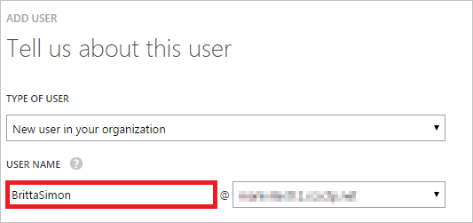

<properties
    pageTitle="Lernprogramm: Azure-Active Directory-Integration in flachere Dateien | Microsoft Azure"
    description="Informationen Sie zum Konfigurieren der einmaligen Anmeldens zwischen Azure Active Directory und flachere Dateien."
    services="active-directory"
    documentationCenter=""
    authors="jeevansd"
    manager="femila"
    editor=""/>

<tags
    ms.service="active-directory"
    ms.workload="identity"
    ms.tgt_pltfrm="na"
    ms.devlang="na"
    ms.topic="article"
    ms.date="09/29/2016"
    ms.author="jeedes"/>

# Lernprogramm: Azure-Active Directory-Integration in flachere Dateien

Ziel dieses Lernprogramms ist zu veranschaulichen flachere Dateien mit Azure Active Directory (Azure AD) integriert werden soll.  
Integrieren von flachere Dateien in Azure AD bietet Ihnen die folgenden Vorteile: 

- Sie können in Azure AD steuern, wer auf flachere Dateien zugreifen 
- Sie können Ihre Benutzer automatisch auf flachere Dateien (einmaliges Anmelden) angemeldete Abrufen mit ihren Azure AD-Konten aktivieren.
- Sie können Ihre Konten an einem zentralen Ort – im klassischen Azure Active Directory-Portal verwalten.

Wenn Sie weitere Details zu SaaS app-Integration in Azure AD-wissen möchten, finden Sie unter [Was ist Zugriff auf die Anwendung und einmaliges Anmelden mit Azure Active Directory](active-directory-appssoaccess-whatis.md).

## Erforderliche Komponenten 

Zum Konfigurieren von Azure AD-Integration mit flachere Dateien, benötigen Sie die folgenden Elemente:

- Ein Azure AD-Abonnement
- Eine flachere Dateien einmaligen Anmeldung aktiviert Abonnement

> [AZURE.NOTE] Wenn Sie um die Schritte in diesem Lernprogramm zu testen, empfehlen wir nicht mit einer Umgebung für die Herstellung.

Führen Sie zum Testen der Schritte in diesem Lernprogramm Tips:

- Sie sollten Ihre Umgebung Herstellung nicht verwenden, es sei denn, dies erforderlich ist.
- Wenn Sie eine Testversion Azure AD-Umgebung besitzen, können Sie eine einen Monat zum Testen [hier](https://azure.microsoft.com/pricing/free-trial/)erhalten. 

 
## Szenario Beschreibung
Ziel dieses Lernprogramms ist, sodass Sie in einer Umgebung für Azure AD-einmaligen Anmeldens testen können.  
In diesem Lernprogramm beschriebenen Szenario besteht aus zwei Hauptfenster Bausteine:

1. Hinzufügen von flachere Dateien aus dem Katalog 
2. Konfigurieren und Testen Azure AD einmaliges Anmelden

## Hinzufügen von flachere Dateien aus dem Katalog
Zum Konfigurieren der Integration von flachere Dateien in Azure AD müssen Sie flachere Dateien zu Ihrer Liste der verwalteten SaaS apps aus dem Katalog hinzuzufügen.

**Um flachere Dateien aus dem Katalog hinzuzufügen, führen Sie die folgenden Schritte aus:**

1. Klicken Sie im **Azure klassischen Portal**auf der linken Navigationsbereich auf **Active Directory**. 

    ![Active Directory][1]

2. Wählen Sie aus der Liste **Verzeichnis** Verzeichnis für das Sie Verzeichnisintegration aktivieren möchten.

3. Klicken Sie zum Öffnen der Anwendungsansicht in der Verzeichnisansicht im oberen Menü auf **Applications** .

    ![Applikationen][2]

4. Klicken Sie auf **Hinzufügen** , am unteren Rand der Seite.

    ![Applikationen][3]

5. Klicken Sie im Dialogfeld **Was möchten Sie tun** klicken Sie auf **eine Anwendung aus dem Katalog hinzufügen**.

    ![Applikationen][4]

6. Geben Sie in das Suchfeld **Flachere Dateien**ein.

    

7. Wählen Sie im Ergebnisbereich **Flachere Dateien**, und klicken Sie dann auf **abgeschlossen** , um die Anwendung hinzugefügt haben.

    

##  Konfigurieren und Testen Azure AD einmaliges Anmelden
Das Ziel der in diesem Abschnitt ist erläutert, wie Sie konfigurieren und Testen der Azure AD-einmaliges Anmelden mit flachere Dateien basierend auf einen Testbenutzer "Britta Simon" bezeichnet.

Für einmaliges Anmelden entwickelt muss Azure AD wissen, was der Benutzer Gegenstück flachere Dateien an einen Benutzer in Azure AD ist. Kurzum, muss eine Link Beziehung zwischen einem Azure AD-Benutzer und dem entsprechenden Benutzer flachere Dateien eingerichtet werden.  
Dieser Link Beziehung wird hergestellt, indem Sie den Wert des **Benutzernamens** in Azure AD als der Wert für den **Benutzernamen** flachere Dateien zuweisen.
 
Zum Konfigurieren und Azure AD-einmaliges Anmelden mit flachere Dateien testen, müssen Sie die folgenden Bausteine durchführen:

1. **[Konfigurieren von Azure AD einmaligen Anmeldens](#configuring-azure-ad-single-single-sign-on)** - damit Ihre Benutzer dieses Feature verwenden können.
2. **[Erstellen einer Azure AD Benutzer testen](#creating-an-azure-ad-test-user)** : Azure AD-einmaliges Anmelden mit Britta Simon testen.
4. **[Erstellen eine flachere Dateien Benutzer testen](#creating-a-halogen-software-test-user)** : Damit ein Gegenstück von Britta Simon flachere Dateien, die in der Azure AD-Darstellung Ihrer verknüpft ist.
5. **[Testen Sie Benutzer zuweisen Azure AD](#assigning-the-azure-ad-test-user)** - Britta Simon mit Azure AD-einmaliges Anmelden aktivieren.
5. **[Testen der einmaligen Anmeldens](#testing-single-sign-on)** - zur Überprüfung, ob die Konfiguration funktioniert.

### Konfigurieren von Azure AD-einmaliges Anmelden

Das Ziel der in diesem Abschnitt ist Azure AD-einmaliges Anmelden im klassischen Azure AD-Portal aktivieren und konfigurieren einmaliges Anmelden in Ihrer Anwendung flachere Dateien. Als Teil dieses Verfahrens müssen Sie eine Datei Base-64-codierte Zertifikat zu erstellen. Wenn Sie nicht mit diesem Verfahren vertraut sind, finden Sie unter [Konvertieren ein binäres Zertifikat in eine Textdatei](http://youtu.be/PlgrzUZ-Y1o).

Um einmaliges Anmelden für flachere Dateien zu konfigurieren, benötigen Sie eine Domäne registrierte. Wenn Sie eine Domäne registriert noch Kontakt besitzen Ihre flachere Dateien Supportteam über [support@flatterfiles.com](mailto:support@flatterfiles.com).  

**So konfigurieren Sie Azure AD-einmaliges Anmelden mit flachere Dateien die folgenden Schritte aus:**

1. Klassische Azure AD-Portal auf der Seite Anwendung Integration **Flachere Dateien** klicken Sie auf **Konfigurieren einmaligen Anmeldens** zum Öffnen des Dialogfelds **Konfigurieren einmaliges Anmelden** .

    ![Konfigurieren Sie einmaliges Anmelden][6] 

2. Klicken Sie auf der Seite **Wie möchten Sie Benutzer flachere Dateien auf bei** **Azure AD einmaliges Anmelden**wählen Sie aus, und klicken Sie dann auf **Weiter**.
 
     

3. Klicken Sie auf der Seite Dialogfeld **Konfigurieren der App-Einstellungen** auf **Weiter**.

     

    > [AZURE.NOTE] Flachere Dateien verwendet die gleiche SSO Anmelde-URL für alle Kunden: [https://www.flatterfiles.com/site/login/sso/](https://www.flatterfiles.com/site/login/sso/).
.
 
 
4. Führen Sie auf der Seite **Konfigurieren einmaliges Anmelden bei flachere Dateien** die folgenden Schritte aus:

      

    ein. Klicken Sie auf **Zertifikat herunterladen**, und speichern Sie die Datei auf Ihrem Computer.

    b. Klicken Sie auf **Weiter**.

1. Melden Sie sich für den Zugriff auf eine Anwendung flachere Dateien als Administrator.

2. Klicken Sie auf Dashboard. 

      

2. Klicken Sie auf **Einstellungen**, und führen Sie dann auf der Registerkarte **Unternehmen** die folgenden Schritte aus: 

      

    ein. Wählen Sie **verwenden SAML 2.0 für die Authentifizierung**ein.

    b. Klicken Sie auf **Konfigurieren von SAML**.

2. Klicken Sie im Dialogfeld **SAML-Konfiguration** führen Sie die folgenden Schritte aus: 

      

    ein. Geben Sie in das Textfeld Domäne Ihre Domäne registrierte.

    > [AZURE.NOTE] Wenn Sie eine Domäne registriert noch Kontakt besitzen Ihre flachere Dateien Supportteam über [support@flatterfiles.com](mailto:support@flatterfiles.com).
    
    b. In der Azure klassischen Portal, klicken Sie auf die einzelnen konfigurieren Anmelden bei Copt flachere Dateien im Dialogfeld die einzelnen anmelden-URL, und fügen Sie ihn in das Textfeld Identität Provider-URL.

    c.  Erstellen Sie eine **Base-64-codierte** Datei aus Ihrem heruntergeladene Zertifikat.  

    >[AZURE.TIP] Weitere Informationen hierzu finden Sie unter [So konvertieren ein binäres Zertifikat in eine Textdatei](http://youtu.be/PlgrzUZ-Y1o)

    d.  Öffnen Sie Ihre Base-64-codierte Zertifikat in Editor, kopieren Sie den Inhalt der es in der Zwischenablage, und fügen Sie ihn in das Textfeld **FlatterFiles Identität Anbieter Zertifikat** .

    e. Klicken Sie auf **Aktualisieren**.

6. Wählen Sie in der klassischen Azure AD-Portal die Bestätigung Konfiguration für einzelne Zeichen, und klicken Sie dann auf **Weiter**. 

    ![Azure AD einmaliges Anmelden][10]

7. Klicken Sie auf der Seite **Bestätigung für einzelne anmelden** auf **abgeschlossen**.  

    ![Azure AD einmaliges Anmelden][11]

### Erstellen eines Benutzers mit Azure AD-testen
Das Ziel der in diesem Abschnitt besteht im Erstellen eines Testbenutzers aufgerufen Britta Simon im klassischen Azure-Portal.

![Erstellen von Azure AD-Benutzer][20]

**Führen Sie die folgenden Schritte aus, um einen Testbenutzer in Azure AD zu erstellen:**

1. Klicken Sie im **Azure klassischen Portal**auf der linken Navigationsbereich auf **Active Directory**.

     

2. Wählen Sie aus der Liste **Verzeichnis** Verzeichnis für das Sie Verzeichnisintegration aktivieren möchten.

3. Wenn die Liste der Benutzer, klicken Sie im Menü oben anzeigen möchten, klicken Sie auf **Benutzer**.

     
 
4. Klicken Sie im Dialogfeld **Benutzer hinzufügen** um in der Symbolleiste auf der Unterseite öffnen, auf **Benutzer hinzufügen**. 

     

5. Führen Sie auf der Seite **Teilen Sie uns zu diesem Benutzer** die folgenden Schritte aus: 

      

    ein. Wählen Sie als Typ des Benutzers neuen Benutzer in Ihrer Organisation ein.

    b. Geben Sie den Benutzernamen **Textfeld** **BrittaSimon**ein.

    c. Klicken Sie auf **Weiter**.

6.  Klicken Sie auf der Seite **Benutzerprofil** Dialogfeld führen Sie die folgenden Schritte aus: 

     
 
    ein. Geben Sie im Textfeld **Vorname** **Britta**aus.  

    b. In das letzte Textfeld **Name** , Typ, **Simon**.

    c. Geben Sie im Textfeld **Anzeigename** **Britta Simon**aus.

    d. Wählen Sie in der Liste **Rolle** **Benutzer**aus.
    e. Klicken Sie auf **Weiter**.

7. Klicken Sie auf der Seite **erste temporäres Kennwort** auf **Erstellen**.

     
 
8. Führen Sie auf der Seite **erste temporäres Kennwort** die folgenden Schritte aus:

     
  
    ein. Notieren Sie den Wert für das **Neue Kennwort ein**.

    b. Klicken Sie auf **abgeschlossen**.   

  
 
### Erstellen eines Testbenutzers flachere Dateien

Das Ziel der in diesem Abschnitt ist zum Erstellen eines Benutzers Britta Simon flachere Dateien bezeichnet.

**Führen Sie die folgenden Schritte aus, um einen Benutzer namens Britta Simon flachere Dateien zu erstellen:**

1. Melden Sie sich auf der Website Ihres Unternehmens **Flachere Dateien** als Administrator an.

2. Klicken Sie im Navigationsbereich auf der linken Seite klicken Sie auf **Einstellungen**, und klicken Sie dann auf die **Registerkarte**von Benutzer.

    

3. Klicken Sie auf **Benutzer hinzufügen**. 

4. Klicken Sie im Dialogfeld **Benutzer hinzufügen** führen Sie die folgenden Schritte aus:

    

    ein. Geben Sie im Textfeld **Vorname** **Britta**aus.

    b. Geben Sie im Textfeld **Nachname** **Simon**aus. 

    c. Geben Sie in das Textfeld **E-Mail-Adresse** Brittas e-Mail-Adresse in der klassischen Azure-Portal aus.

    d. Klicken Sie auf **Absenden**.   

### Zuweisen des Azure AD-Test-Benutzers

Das Ziel der in diesem Abschnitt ist für die Aktivierung der Britta Simon Azure einmaliges Anmelden verwenden, indem Sie keinen Zugriff auf flachere Dateien erteilen.

![Benutzer zuweisen][200] 

**Um Britta Simon flachere Dateien zuzuweisen, führen Sie die folgenden Schritte aus:**

1. Klicken Sie im Portal Azure klassischen zum Öffnen der Anwendungsansicht in der Verzeichnisansicht klicken Sie auf **Applikationen** im oberen Menü.

    ![Benutzer zuweisen][201] 

2. Wählen Sie in der Liste Applikationen **Flachere Dateien**ein.

     

1. Klicken Sie auf **Benutzer**, klicken Sie im Menü oben.

    ![Benutzer zuweisen][203] 

1. Wählen Sie in der Liste Benutzer **Britta Simon**aus.

2. Klicken Sie unten auf der Symbolleiste auf **zuweisen**.

    ![Benutzer zuweisen][205]

### Testen einmaliges Anmelden

Das Ziel der in diesem Abschnitt ist zum Azure AD-einzelne anmelden Überprüfen der Konfiguration mithilfe des Bedienfelds Access.  
Wenn Sie die Kachel flachere Dateien im Access-Bereich klicken, Sie sollten automatisch an Ihrer Anwendung flachere Dateien angemeldete abrufen.

## Zusätzliche Ressourcen

* [Liste der zum Integrieren SaaS-Apps mit Azure-Active Directory-Lernprogramme](active-directory-saas-tutorial-list.md)
* [Was ist die Anwendungszugriff und einmaliges Anmelden mit Azure Active Directory?](active-directory-appssoaccess-whatis.md)

<!--Image references-->

[1]: ./media/active-directory-saas-flatter-files-tutorial/tutorial_general_01.png
[2]: ./media/active-directory-saas-flatter-files-tutorial/tutorial_general_02.png
[3]: ./media/active-directory-saas-flatter-files-tutorial/tutorial_general_03.png
[4]: ./media/active-directory-saas-flatter-files-tutorial/tutorial_general_04.png

[6]: ./media/active-directory-saas-flatter-files-tutorial/tutorial_general_05.png
[10]: ./media/active-directory-saas-flatter-files-tutorial/tutorial_general_06.png
[11]: ./media/active-directory-saas-flatter-files-tutorial/tutorial_general_07.png
[20]: ./media/active-directory-saas-flatter-files-tutorial/tutorial_general_100.png

[200]: ./media/active-directory-saas-flatter-files-tutorial/tutorial_general_200.png
[201]: ./media/active-directory-saas-flatter-files-tutorial/tutorial_general_201.png
[203]: ./media/active-directory-saas-flatter-files-tutorial/tutorial_general_203.png
[204]: ./media/active-directory-saas-flatter-files-tutorial/tutorial_general_204.png
[205]: ./media/active-directory-saas-flatter-files-tutorial/tutorial_general_205.png

