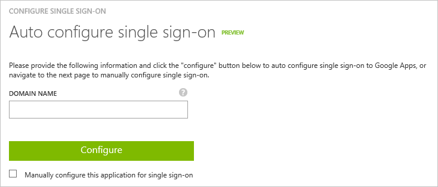
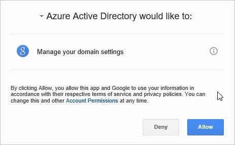
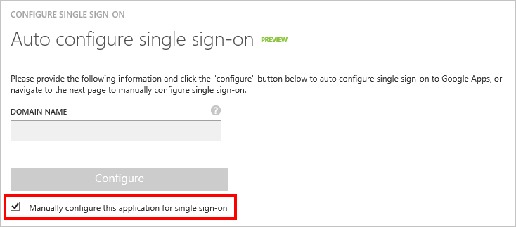

<properties
    pageTitle="Lernprogramm: Azure-Active Directory-Integration in Google Apps | Microsoft Azure"
    description="Informationen Sie zur Verwendung von Google-Apps mit Azure Active Directory einmaliges Anmelden, automatisierte Bereitstellung und mehr aktivieren!"
    services="active-directory"
    documentationCenter=""
    authors="asmalser-msft"
    manager="femila"
    editor=""/>

<tags
    ms.service="active-directory"
    ms.devlang="na"
    ms.topic="article"
    ms.tgt_pltfrm="na"
    ms.workload="identity"
    ms.date="05/16/2016"
    ms.author="asmalser-msft"/>

#Lernprogramm: Wie Google Apps mit Azure Active Directory integriert werden soll.

In diesem Lernprogramm wird die Herstellung der Verbindung Ihrer Umgebung Google Apps zu Azure Active Directory (Azure AD) angezeigt. So konfigurieren Sie einmaliges Anmelden auf Google Apps, zum Aktivieren der automatischen Benutzer bereitgestellt und So weisen Sie Benutzern den Zugriff auf Google Apps erfahren. 

##Erforderliche Komponenten

1. Um Azure Active Directory über das [Azure klassischen Portal](https://manage.windowsazure.com)zugreifen zu können, müssen Sie zuerst ein gültiges Azure-Abonnement verfügen.

2. Sie müssen einen gültigen Mandanten für [Google Apps für die Arbeit](https://www.google.com/work/apps/) oder [Google Apps für die Ausbildung](https://www.google.com/edu/products/productivity-tools/). Sie können ein kostenloses Testversion Konto für einen der Dienste verwenden.

##Video-Lernprogramm

Einmaliges Anmelden auf Google Apps in 2 Minuten Aktivieren von:

> [AZURE.VIDEO enable-single-sign-on-to-google-apps-in-2-minutes-with-azure-ad]

##Häufig gestellte Fragen

1. **F: sind Chromebooks und andere Geräte Chrome kompatibel mit Azure AD-einmaliges Anmelden?**

    A: Ja, melden Sie sich bei ihren Chromebook Geräten mit ihren Anmeldeinformationen Azure AD-kann werden Benutzer. Finden Sie unter diese [Google Apps unterstützen Artikel](https://support.google.com/chrome/a/answer/6060880) Informationen auf warum Benutzer Anmeldeinformationen zweimal erhalten möglicherweise aufgefordert.

2. **F: Wenn ich einmaliges Anmelden aktivieren, werden Benutzer ihre Anmeldeinformationen Azure AD-melden Sie sich bei ein Google-Produkt, wie z. B. Google Schulungsraum, Google Mail, Google Drive, YouTube usw. verwenden?**

    A: Ja, je nachdem, [welche Google apps](https://support.google.com/a/answer/182442?hl=en&ref_topic=1227583) , die Sie für Ihre Organisation zu aktivieren oder Deaktivieren von auswählen.

3. **F: aktivieren kann ich die einmaliges Anmelden für nur eine Teilmenge der meiner Benutzer Google Apps?**

    A: Nein, Einschalten des einmaligen Anmeldens sofort alle Benutzer mit ihren Anmeldeinformationen Azure AD-authentifizieren Google Apps aufgefordert. Da Google Apps mehrere Identitätsanbieter haben unterstützt, kann der Identitätsanbieter für Ihre Umgebung Google Apps entweder Azure AD sein oder Google – aber nicht beide gleichzeitig.

4. **F: Wenn ein Benutzer über Windows angemeldet ist, authentifiziert diese zu Google Apps automatisch ohne aufgefordert, ein Kennwort?**

    A: Es gibt zwei Optionen für das Aktivieren dieses Szenario ein. Zunächst konnte Benutzer bei Windows 10 Geräte über [Azure Active Directory teilnehmen](active-directory-azureadjoin-overview.md)anmelden. Alternativ können Benutzer in Windows-Geräten melden, die einer lokalen Active Directory Domäne beigetreten sind, die für einmaliges Anmelden Azure AD über eine Implementierung von [Active Directory Federation Services (AD FS)](active-directory-aadconnect-user-signin.md) aktiviert wurde. Führen Sie das Lernprogramm unten, um einmaliges Anmelden zwischen Azure AD aktivieren natürlich beiden Optionen benötigen und Google Apps.

##Schritt 1: Hinzufügen von Google-Apps zu Ihrem Verzeichnis

1. Klicken Sie im [Azure klassischen Portal](https://manage.windowsazure.com)auf der linken Navigationsbereich auf **Active Directory**.

    ![Wählen Sie im linken Navigationsbereich aus Active Directory.][0]

2. Wählen Sie aus der Liste **Verzeichnis** Verzeichnis, dem Sie hinzufügen, Google Apps möchten.

3. Klicken Sie auf im oberen Menü on **Applications** .

    ![Klicken Sie auf on Applications.][1]

4. Klicken Sie auf **Hinzufügen** , am unteren Rand der Seite.

    ![Klicken Sie auf Hinzufügen, um eine neue Anwendung hinzuzufügen.][2]

5. Klicken Sie im Dialogfeld **Was möchten Sie tun** klicken Sie auf **eine Anwendung aus dem Katalog hinzufügen**.

    ![Klicken Sie auf eine Anwendung aus dem Katalog hinzufügen.][3]

6. Geben Sie im **Suchfeld** **Google Apps**. Klicken Sie dann wählen Sie aus den Ergebnissen der **Google Apps** aus, und klicken Sie auf **abgeschlossen** , um die Anwendung hinzugefügt haben.

    ![Hinzufügen von Google-Apps.][4]

7. Sie sollten jetzt die Seite Schnellstart Google Apps finden Sie unter:

    ![Schnellstart-Seite in Azure AD-Google-Apps][5]

##Schritt 2: Aktivieren Sie einmaliges Anmelden

1. Klicken Sie in Azure AD, klicken Sie auf der Seite Schnellstart für Google Apps auf die Schaltfläche **Konfigurieren einmaliges Anmelden** .

    ![Die einzelnen anmelden Schaltfläche Konfigurieren][6]

2. Es wird ein Dialogfeld geöffnet, und sehen Sie einen Bildschirm mit der Frage "Wie Benutzer bei Google Apps, klicken Sie auf aussehen sollen?" Wählen Sie **Azure AD einmaliges Anmelden**aus, und klicken Sie dann auf **Weiter**.

    ![Wählen Sie aus Azure AD einmaliges Anmelden][7]

    > [AZURE.NOTE] Weitere Informationen zu den verschiedenen einzelnen melden Sie sich auf Optionen, [Klicken Sie hier](../active-directory-appssoaccess-whatis.md#how-does-single-sign-on-with-azure-active-directory-work) zu

3. Auf der Seite **Konfigurieren der App-Einstellungen** für das Feld **Melden Sie sich auf URL** eingeben von Text in Ihrem Google Apps Mandanten URL in folgendem Format ein:`https://mail.google.com/a/<yourdomain>`

    ![Geben Sie in Ihrem Mandanten-URL][8]

4. Geben Sie auf der Seite **einmaliges Anmelden für automatische Konfiguration** in der Domäne für Ihren Mandanten Google Apps. Drücken Sie dann die Schaltfläche **Konfigurieren** .

    

    > [AZURE.NOTE] Wenn Sie es vorziehen, einmaliges Anmelden manuell zu konfigurieren, finden Sie unter [Optional Schritt: manuell konfigurieren einmaliges Anmelden](#optional-step-manually-configure-single-sign-on)

5. Melden Sie sich bei Ihrem Google Apps Admin-Konto. Klicken Sie dann auf **Zulassen** , damit Azure Active Directory Konfiguration Ihres Abonnements Google Apps ändern kann.

    

6. Warten Sie ein paar Sekunden Azure Active Directory Ihrem Mandanten Google Apps konfiguriert. Sobald sie abgeschlossen ist, klicken Sie auf **Weiter**.

10. Geben Sie auf der letzten Seite des Dialogfelds in einer e-Mail-Adresse, wenn Sie e-Mail-Benachrichtigungen für Fehlern und Warnungen im Zusammenhang mit der Wartung dieser Konfiguration für einzelne Zeichen erhalten möchten.

    ![Geben Sie Ihre e-Mail-Adresse ein.][14]

11. Klicken Sie auf **abgeschlossen** , um das Dialogfeld zu schließen. Klicken Sie zum Testen der Konfigurations finden Sie weiter unten im Abschnitt [Benutzer zu Google Apps zuweisen](#step-4-assign-users-to-google-apps)aus.

##Optional Schritt: Manuelles Konfigurieren von einmaliges Anmelden

Wenn Sie einmaliges Anmelden manuell einrichten möchten, führen Sie die folgenden Schritte aus:

1. Klicken Sie in Azure AD, klicken Sie auf der Seite Schnellstart für Google Apps auf die Schaltfläche **Konfigurieren einmaliges Anmelden** .

    ![Die einzelnen anmelden Schaltfläche Konfigurieren][6]

2. Es wird ein Dialogfeld geöffnet, und sehen Sie einen Bildschirm mit der Frage "Wie Benutzer bei Google Apps, klicken Sie auf aussehen sollen?" Wählen Sie **Azure AD einmaliges Anmelden**aus, und klicken Sie dann auf **Weiter**.

    ![Wählen Sie aus Azure AD einmaliges Anmelden][7]

    > [AZURE.NOTE] Weitere Informationen zu den verschiedenen einzelnen melden Sie sich auf Optionen, [Klicken Sie hier](../active-directory-appssoaccess-whatis.md#how-does-single-sign-on-with-azure-active-directory-work) zu

3. Auf der Seite **Konfigurieren der App-Einstellungen** für das Feld **Melden Sie sich auf URL** eingeben von Text in Ihrem Google Apps Mandanten URL in folgendem Format ein:`https://mail.google.com/a/<yourdomain>`

    ![Geben Sie in Ihrem Mandanten-URL][8]

4. Klicken Sie auf der Seite **einmaliges Anmelden für automatische Konfiguration** wählen Sie das Kontrollkästchen Beschriftung **manuell konfigurieren dieser Anwendung für einmaliges Anmelden**. Klicken Sie dann auf **Weiter**.

    

4. Klicken Sie auf der Seite **Konfigurieren einmaliges Anmelden bei Google Apps** klicken Sie auf **Zertifikat herunterladen**, und klicken Sie dann speichern Sie die Zertifikatsdatei lokal auf Ihrem Computer.

    ![Laden Sie das Zertifikat ein.][9]

5. Öffnen einer neuen Registerkarte in Ihrem Browser, und melden Sie sich bei der [Google Apps-Verwaltungskonsole](http://admin.google.com/) als Administrator an.

6. Klicken Sie auf **Sicherheit**. Wenn Sie den Link angezeigt werden, kann er im Menü **Weitere Steuerelemente** am unteren Rand des Bildschirms ausgeblendet.

    ![Klicken Sie auf Sicherheit.][10]

7. Klicken Sie auf der Registerkarte **Sicherheit** auf **einmaliges Anmelden (SSO) einrichten.**

    ![Klicken Sie auf SSO.][11]

8. Führen Sie die folgenden Konfiguration Änderungen an:

    ![Konfigurieren von SSO][12]

    - Wählen Sie **Setup-SSO mit Drittanbieter-Identitätsanbieter**aus.

    - Kopieren Sie die **URL der Dienst für einmaliges Anmelden**in Azure AD, und fügen Sie ihn in das Feld **Anmeldung Seiten-URL** in Google Apps.

    - Kopieren Sie in Azure AD die **einzelnen Abmeldung Dienst-URL**, und fügen Sie ihn in das Feld **URL der Abmeldung** in Google Apps.

    - Kopieren Sie in Azure AD die **URL für das Kennwort ändern**, und fügen Sie ihn in das Feld **Kennwort-URL ändern** in Google Apps.

    - Hochladen von in Google-Apps für die **Überprüfung Zertifikat**, das Zertifikat, das Sie in Schritt 4 # heruntergeladen haben.

    - Klicken Sie auf **Änderungen speichern**.

9. Wählen Sie in Azure AD Konfiguration für einzelne Zeichen Bestätigung aktivieren, um das Zertifikat zu aktivieren, das Sie in Google Apps hochgeladen. Klicken Sie dann auf **Weiter**.

    ![Aktivieren Sie das Kontrollkästchen zur Bestätigung][13]

10. Geben Sie auf der letzten Seite des Dialogfelds in einer e-Mail-Adresse, wenn Sie e-Mail-Benachrichtigungen für Fehlern und Warnungen im Zusammenhang mit der Wartung dieser Konfiguration für einzelne Zeichen erhalten möchten. 

    ![Geben Sie Ihre e-Mail-Adresse ein.][14]

11. Klicken Sie auf **abgeschlossen** , um das Dialogfeld zu schließen. Klicken Sie zum Testen der Konfigurations finden Sie weiter unten im Abschnitt [Benutzer zu Google Apps zuweisen](#step-4-assign-users-to-google-apps)aus.

##Schritt 3: Aktivieren Sie Automatisches Benutzer bereitgestellt

> [AZURE.NOTE] Eine andere sinnvolle Option für die Benutzer bereitgestellt auf Google Apps Automatisierung besteht darin, [Google Apps Verzeichnis synchronisieren (GADS)](https://support.google.com/a/answer/106368?hl=en) verwenden der lokalen Active Directory Benutzeridentitäten zu Google Apps Vorschriften. Im Gegensatz dazu Vorschriften die Lösung in diesem Lernprogramm an Ihre Benutzer Azure Active Directory (Cloud) und e-Mail-aktivierten Gruppen Google Apps.

1. Melden Sie sich bei der [Google Apps-Verwaltungskonsole](http://admin.google.com/) als Administrator an, und klicken Sie auf **Sicherheit**. Wenn Sie den Link angezeigt werden, kann er im Menü **Weitere Steuerelemente** am unteren Rand des Bildschirms ausgeblendet.

    ![Klicken Sie auf Sicherheit.][10]

2. Klicken Sie auf der Seite **Sicherheit** auf **-API-Referenz**.

    ![Klicken Sie auf-API-Referenz.][15]

3. Wählen Sie **Aktivieren API-Zugriff**aus.

    ![Klicken Sie auf-API-Referenz.][16]

    > [AZURE.IMPORTANT] Dass Sie in Google Apps, ihren Benutzernamen in Azure Active Directory *muss* bereitstellen möchten werden für jeden Benutzer in einer benutzerdefinierten Domäne verknüpft. Angenommen, Benutzernamen, die Aussehen bob@contoso.onmicrosoft.com wird von Google-Apps nicht akzeptiert werden, während bob@contoso.com wird angenommen. Sie können einen vorhandenen Benutzer Domäne ändern, indem Sie ihre Eigenschaften bearbeiten, in Azure AD. Anleitungen zum Festlegen einer benutzerdefinierten Domänennamens für Azure Active Directory und Google Apps sind unter enthalten.

4. Wenn Sie einen benutzerdefinierten Domänennamen Ihrer Azure Active Directory noch nicht hinzugefügt haben, befolgen Sie die folgenden Schritte aus:

    - Klicken Sie im [Azure klassischen Portal](https://manage.windowsazure.com)auf der linken Navigationsbereich auf **Active Directory**. Wählen Sie in der Verzeichnisliste aus Ihrem Verzeichnis. 

    - Klicken Sie auf **Domänen** auf oberster Ebene im Menü, und klicken Sie dann auf **benutzerdefinierte Domäne hinzufügen**.

        ![Hinzufügen einer benutzerdefinierten Domänennamens][17]

    - Geben Sie Ihren Domänennamen ein, in das Feld **Domäne ein** . Dies sollte den gleichen Domänennamen sein, den Sie für Google Apps verwenden möchten. Wenn Sie bereit sind, klicken Sie auf die Schaltfläche **Hinzufügen** .

        ![Geben Sie Ihren Domänennamen ein.][18]

    - Klicken Sie auf **Weiter** um zur Seite Überprüfung zu wechseln. Um zu überprüfen, dass Sie diese Domäne besitzen, müssen Sie die DNS Einträge entsprechend den Werten bereitgestellt, die auf dieser Seite bearbeiten. Sie entscheiden möglicherweise Vergewissern Sie sich mithilfe von **MX-Einträge** oder **TXT-Einträge**, je nachdem, was Sie für die Option **Datensatztyp** auswählen. Umfassendere Anweisungen zum Domänennamen mit Azure AD-zu überprüfen finden Sie unter [Hinzufügen von Ihren eigenen Domänennamen zu Azure AD-](https://go.microsoft.com/fwLink/?LinkID=278919&clcid=0x409).

        ![Überprüfen Sie Ihren Domänennamen ein.][19]

    - Wiederholen Sie die obigen Schritte für alle Domänen, die Sie zum Verzeichnis hinzufügen möchten.

5. Jetzt, da Sie alle Ihre Domänen mit Azure AD überprüft haben, müssen Sie jetzt diese erneut mit Google Apps überprüfen. Führen Sie für jede Domäne, die bereits mit Google Apps nicht registriert ist die folgenden Schritte aus:

    - Klicken Sie in der [Google Apps-Verwaltungskonsole](http://admin.google.com/)auf **Domänen**.

        ![Klicken Sie auf Domänen][20]

    - Klicken Sie auf **eine Domäne oder eine Domänenalias hinzufügen**.

        ![Fügen Sie eine neue Domäne hinzu.][21]

    - Wählen Sie **eine andere Domäne hinzufügen**, und geben Sie den Namen der Domäne, die Sie hinzufügen möchten.

        ![Geben Sie Ihren Domänennamen ein][22]

    - Klicken Sie auf **Weiter und Überprüfen der Besitzrechte einer Domäne**. Befolgen Sie die Schritte zum Überprüfen, dass Sie den Namen der Domäne besitzen. Umfassende Informationen dazu, wie zur Überprüfung Ihrer Domäne mit Google Apps finden Sie unter [Überprüfen der Besitzrechte einer Website mit Google Apps](https://support.google.com/webmasters/answer/35179).

    - Wiederholen Sie die obigen Schritte für alle weiteren Domänen, die Sie Google Apps hinzufügen möchten.

    > [AZURE.WARNING] Und wenn Sie bereits einmaliges Anmelden mit Azure AD konfiguriert Änderung die primäre Domäne für Ihren Mandanten Google Apps, und müssen Sie wiederholen Sie Schritt 3 # unter [Schritt 2: Aktivieren einmaliges Anmelden](#step-two-enable-single-sign-on).

6. Klicken Sie in der [Google Apps-Verwaltungskonsole](http://admin.google.com/)auf **Administratorrollen**.

    ![Klicken Sie auf Google-Apps][26]

7. Bestimmen Sie, welche Administratorkonto verwenden Sie zum Verwalten der Benutzer bereitgestellt werden sollen. Bearbeiten Sie für die **Rolle des Administrators** des Kontos die **Berechtigungen** für diese Rolle aus. Stellen Sie sicher, dass es besitzt alle **Berechtigungen der Admin-API** aktiviert, sodass für die Bereitstellung von diesem Konto verwendet werden kann.

    ![Klicken Sie auf Google-Apps][27]

    > [AZURE.NOTE] Wenn Sie eine Herstellung Umgebung konfigurieren, ist die beste Methode so erstellen Sie ein neues Administratorkonto in Google Apps speziell für diesen Schritt. Diese Konto muss eine Administratorrolle zugeordnet haben, die das erforderlichen API Berechtigungen verfügt.

8. Klicken Sie in Azure Active Directory auf der obersten Ebene im Menü on **Applications** aus, und klicken Sie dann auf **Google Apps**.

    ![Klicken Sie auf Google-Apps][23]

9. Klicken Sie auf der Seite Schnellstart für Google Apps auf **Konfigurieren Benutzer bereitgestellt**.

    ![Konfigurieren der Benutzer bereitgestellt][24]

10. Klicken Sie auf **aktivieren Benutzer bereitgestellt** , in der Google Apps Admin-Konto authentifizieren, die Sie zum Verwalten der Bereitstellung verwenden möchten, klicken Sie im Dialogfeld, das geöffnet wird.

    ![Aktivieren der Bereitstellung][25]

11. Bestätigen Sie, dass Sie Änderungen an Ihrem Google Apps Mandanten vornehmen Azure Active Directory zustimmen möchten.

    ![Bestätigen Sie die Berechtigungen.][28]

12. Klicken Sie auf **abgeschlossen** , um das Dialogfeld zu schließen.

##Schritt 4: Zuweisen von Benutzern zu Google Apps

1. Klicken Sie zum Testen der Konfigurations beginnen Sie, erstellen ein neues Testkonto im Verzeichnis.

2. Klicken Sie auf der Seite Google Apps Schnellstart klicken Sie auf die Schaltfläche **Benutzer zuweisen** .

    ![Klicken Sie auf Benutzer zuweisen][29]

3. Wählen Sie Ihre Testbenutzer aus, und klicken Sie auf die Schaltfläche **zuweisen** am unteren Rand des Bildschirms:

 - Wenn Sie noch nicht aktivieren Sie Automatisches Benutzer bereitgestellt, und klicken Sie dann die folgende Aufforderung zur Bestätigung angezeigt werden:

        ![Confirm the assignment.][30]

 - Wenn Sie Automatisches provisioning Benutzer aktiviert haben, dann sehen Sie eine Aufforderung zum definieren, in welcher der Rolle des Benutzers in Google Apps sein soll. Neu eingerichtete Benutzer sollten in Ihrer Umgebung Google Apps nach ein paar Minuten angezeigt werden.

4. Klicken Sie zum Testen der Einstellungen für einzelnen Zeichen, öffnen Sie die Access-Systemsteuerung am [https://myapps.microsoft.com](https://myapps.microsoft.com/), und klicken Sie dann melden Sie sich bei der Testkonto, und klicken Sie auf **Google Apps**.

## Verwandte Artikel

- [Artikel Index für Anwendungsverwaltung in Azure-Active Directory](active-directory-apps-index.md)
- [Liste der Lernprogramme erfahren Sie, wie Apps SaaS integriert werden soll.](active-directory-saas-tutorial-list.md)

[0]: ./media/active-directory-saas-google-apps-tutorial/azure-active-directory.png
[1]: ./media/active-directory-saas-google-apps-tutorial/applications-tab.png
[2]: ./media/active-directory-saas-google-apps-tutorial/add-app.png
[3]: ./media/active-directory-saas-google-apps-tutorial/add-app-gallery.png
[4]: ./media/active-directory-saas-google-apps-tutorial/add-gapps.png
[5]: ./media/active-directory-saas-google-apps-tutorial/gapps-added.png
[6]: ./media/active-directory-saas-google-apps-tutorial/config-sso.png
[7]: ./media/active-directory-saas-google-apps-tutorial/sso-gapps.png
[8]: ./media/active-directory-saas-google-apps-tutorial/sso-url.png
[9]: ./media/active-directory-saas-google-apps-tutorial/download-cert.png
[10]: ./media/active-directory-saas-google-apps-tutorial/gapps-security.png
[11]: ./media/active-directory-saas-google-apps-tutorial/security-gapps.png
[12]: ./media/active-directory-saas-google-apps-tutorial/gapps-sso-config.png
[13]: ./media/active-directory-saas-google-apps-tutorial/gapps-sso-confirm.png
[14]: ./media/active-directory-saas-google-apps-tutorial/gapps-sso-email.png
[15]: ./media/active-directory-saas-google-apps-tutorial/gapps-api.png
[16]: ./media/active-directory-saas-google-apps-tutorial/gapps-api-enabled.png
[17]: ./media/active-directory-saas-google-apps-tutorial/add-custom-domain.png
[18]: ./media/active-directory-saas-google-apps-tutorial/specify-domain.png
[19]: ./media/active-directory-saas-google-apps-tutorial/verify-domain.png
[20]: ./media/active-directory-saas-google-apps-tutorial/gapps-domains.png
[21]: ./media/active-directory-saas-google-apps-tutorial/gapps-add-domain.png
[22]: ./media/active-directory-saas-google-apps-tutorial/gapps-add-another.png
[23]: ./media/active-directory-saas-google-apps-tutorial/apps-gapps.png
[24]: ./media/active-directory-saas-google-apps-tutorial/gapps-provisioning.png
[25]: ./media/active-directory-saas-google-apps-tutorial/gapps-provisioning-auth.png
[26]: ./media/active-directory-saas-google-apps-tutorial/gapps-admin.png
[27]: ./media/active-directory-saas-google-apps-tutorial/gapps-admin-privileges.png
[28]: ./media/active-directory-saas-google-apps-tutorial/gapps-auth.png
[29]: ./media/active-directory-saas-google-apps-tutorial/assign-users.png
[30]: ./media/active-directory-saas-google-apps-tutorial/assign-confirm.png
