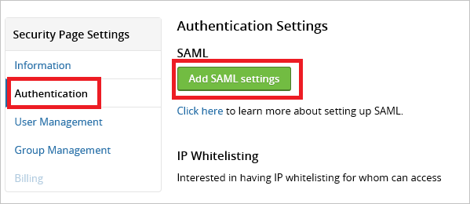

<properties
    pageTitle="Lernprogramm: Azure-Active Directory-Integration in HackerOne | Microsoft Azure"
    description="Informationen Sie zum einmaligen Anmeldens zwischen Azure Active Directory und HackerOne konfigurieren."
    services="active-directory"
    documentationCenter=""
    authors="jeevansd"
    manager="femila"
    editor=""/>

<tags
    ms.service="active-directory"
    ms.workload="identity"
    ms.tgt_pltfrm="na"
    ms.devlang="na"
    ms.topic="article"
    ms.date="09/29/2016"
    ms.author="jeedes"/>

# Lernprogramm: Azure-Active Directory-Integration in HackerOne

In diesem Lernprogramm integrieren Sie HackerOne mit Azure Active Directory (Azure AD) aus.

Integration von HackerOne mit Azure AD bietet Ihnen die folgenden Vorteile:

- Sie können in Azure AD steuern, die auf HackerOne zugreifen
- Sie können Ihre Benutzer automatisch auf HackerOne (einmaliges Anmelden) mit ihren Konten Azure AD-angemeldete abrufen aktivieren.
- Sie können Ihre Konten an einem zentralen Ort – im klassischen Azure-Portal verwalten.

Wenn Sie weitere Details zu SaaS app-Integration in Azure AD-wissen möchten, finden Sie unter [Was ist Zugriff auf die Anwendung und einmaliges Anmelden mit Azure Active Directory](active-directory-appssoaccess-whatis.md).

## Erforderliche Komponenten

Zum Konfigurieren von Azure AD-Integration mit HackerOne, benötigen Sie die folgenden Elemente:

- Ein Azure-Abonnement
- Eine HackerOne einmaligen Anmeldung aktiviert Abonnement

> [AZURE.NOTE] Wenn Sie um die Schritte in diesem Lernprogramm zu testen, empfehlen wir nicht mit einer Umgebung für die Herstellung.

Führen Sie zum Testen der Schritte in diesem Lernprogramm Tips:

- Sie sollten Ihre Umgebung Herstellung nicht verwenden, es sei denn, dies erforderlich ist.
- Wenn Sie eine Testversion Azure AD-Umgebung besitzen, können Sie eine einen Monat zum Testen [hier](https://azure.microsoft.com/pricing/free-trial/)erhalten.

## Szenario Beschreibung
In diesem Lernprogramm konfigurieren und Testen Sie in einer Umgebung für Azure AD-einmaliges Anmelden.  
In diesem Lernprogramm beschriebenen Szenario besteht aus zwei Hauptfenster Bausteine:

1. Hinzufügen von HackerOne aus dem Katalog
2. Konfigurieren und Testen Azure AD einmaliges Anmelden

## Hinzufügen von HackerOne aus dem Katalog
Um HackerOne in Azure AD zu integrieren, müssen Sie HackerOne zu Ihrer Liste der verwalteten SaaS apps aus dem Katalog hinzuzufügen.

**Um HackerOne aus dem Katalog hinzufügen möchten, führen Sie die folgenden Schritte aus:**

1. Klicken Sie im **Azure klassischen Portal**auf der linken Navigationsbereich auf **Active Directory**. 

    ![Active Directory][1]

2. Wählen Sie aus der Liste **Verzeichnis** Verzeichnis für das Sie Verzeichnisintegration aktivieren möchten.

3. Klicken Sie zum Öffnen der Anwendungsansicht in der Verzeichnisansicht im oberen Menü auf **Applications** .

    ![Applikationen][2]

4. Klicken Sie auf **Hinzufügen** , am unteren Rand der Seite.

    ![Applikationen][3]

5. Klicken Sie im Dialogfeld **Was möchten Sie tun** klicken Sie auf **eine Anwendung aus dem Katalog hinzufügen**.

![Applikationen][4]

6. Geben Sie im Suchfeld **HackerOne**ein.

7. Wählen Sie im Ergebnisbereich **HackerOne aus**, und klicken Sie dann auf **abgeschlossen** , um die Anwendung hinzugefügt haben.

##  Konfigurieren und Testen Azure AD einmaliges Anmelden
Als Nächstes konfigurieren und Testen Azure AD-einmaliges Anmelden mit HackerOne basierend auf einen Testbenutzer "Britta Simon" bezeichnet.

Für einmaliges Anmelden entwickelt muss Azure AD wissen, was der Benutzer Gegenstück HackerOne an einen Benutzer in Azure AD ist. Kurzum, muss eine Link Beziehung zwischen einem Azure AD-Benutzer und dem entsprechenden Benutzer in HackerOne eingerichtet werden.  
Dieser Link Beziehung wird hergestellt, indem Sie den Wert des **Benutzernamens** in Azure AD als der Wert für den **Benutzernamen** in HackerOne zuweisen.

Zum Konfigurieren und Azure AD-einmaliges Anmelden mit HackerOne testen, müssen Sie die folgenden Bausteine durchführen:

1. **[Konfigurieren von Azure AD einmaligen Anmeldens](#configuring-azure-ad-single-single-sign-on)** - damit Ihre Benutzer dieses Feature verwenden können.
2. **[Erstellen einer Azure AD Benutzer testen](#creating-an-azure-ad-test-user)** : Azure AD-einmaliges Anmelden mit Britta Simon testen.
3. **[Erstellen einer HackerOne Benutzer testen](#creating-a-hackerone-test-user)** : ein Gegenstück von Britta Simon in zertifizieren haben, die in der Azure AD-Darstellung Ihrer verknüpft ist.
4. **[Testen Sie Benutzer zuweisen Azure AD](#assigning-the-azure-ad-test-user)** - Britta Simon mit Azure AD-einmaliges Anmelden aktivieren.
5. **[Testen der einmaligen Anmeldens](#testing-single-sign-on)** - zur Überprüfung, ob die Konfiguration funktioniert.

### Konfigurieren von Azure AD einmaliges Anmelden

Aktivieren Sie als Nächstes Azure AD-einmaliges Anmelden im Portal klassischen und so konfigurieren Sie in Ihrer Anwendung HackerOne einmaliges Anmelden.

Als Teil dieses Verfahrens müssen Sie eine Datei Base-64-codierte Zertifikat zu erstellen.  
Wenn Sie nicht mit diesem Verfahren vertraut sind, finden Sie unter [Konvertieren ein binäres Zertifikat in eine Textdatei](http://youtu.be/PlgrzUZ-Y1o).

**Führen Sie die folgenden Schritte aus, um Azure AD-einmaliges Anmelden mit HackerOne konfigurieren:**

1. Im Azure klassischen-Portal auf der Seite **HackerOne** Integration Anwendung klicken Sie auf **Konfigurieren einmaligen Anmeldens** zum Öffnen des Dialogfelds **Konfigurieren einmaliges Anmelden** .

    ![Konfigurieren Sie einmaliges Anmelden][6] 

2. Klicken Sie auf der Seite **Wie möchten Sie Benutzer bei der HackerOne auf** **Azure AD einmaliges Anmelden**wählen Sie aus, und klicken Sie dann auf **Weiter**.

     

3. Führen Sie auf der Seite **Einstellungen für die App konfigurieren** Dialogfeld die folgenden Schritte aus, und klicken Sie dann auf **Weiter**:

     

    ein. Geben Sie in das Textfeld **Melden Sie sich auf URL** die URL Ihrer Benutzer melden Sie sich für den Zugriff auf Ihre HackerOne-Anwendung unter Verwendung des folgenden Musters untersuchten: **"https://hackerone.com/\<Firmennamen\>/authentication"**. 

    b. Wenden Sie sich an das Supportteam HackerOne über [support@hackerone.com](mailto:support@hackerone.com) in Ihrem Mandanten URL zu erhalten, wenn Sie es nicht kennen.

    c. Geben Sie in das Textfeld **Bezeichner** den Mandanten-URL ein. 

    d. Klicken Sie auf **Weiter**.

4. Klicken Sie auf der Seite **Konfigurieren einmaliges Anmelden bei HackerOne** führen Sie die folgenden Schritte aus, und klicken Sie dann auf **Weiter**:

     

    ein. Klicken Sie auf **Zertifikat herunterladen**, und speichern Sie die Datei auf Ihrem Computer.

    b. Klicken Sie auf **Weiter**.

1. Melden Sie sich für den Zugriff auf Ihre HackerOne Mandanten als Administrator.

1. Klicken Sie auf **Einstellungen**, klicken Sie im Menü oben.

     

1. Navigieren Sie zu "**Authentifizierung**" aus, und klicken Sie auf "**Hinzufügen von SAML-Einstellungen**".

     

1. Klicken Sie im Dialogfeld **SAML-Einstellungen** führen Sie die folgenden Schritte aus:

     

    ein. Geben Sie in das Textfeld **E-Mail-Domäne** eine Domäne registrierte.

    b. Klicken Sie im Portal Azure klassischen kopieren Sie die **Einzelnen anmelden Dienst-URL**, und fügen Sie ihn in das Textfeld einzelne melden Sie sich auf URL.

    c. Erstellen Sie eine **Base-64-codierte** Datei aus Ihrem heruntergeladene Zertifikat.  

       >[AZURE.TIP] Weitere Informationen hierzu finden Sie unter [So konvertieren ein binäres Zertifikat in eine Textdatei](http://youtu.be/PlgrzUZ-Y1o)
    
    d. Öffnen das Base-64-codierte Zertifikat in Editor, kopieren Sie den Inhalt der es in der Zwischenablage, und fügen Sie Sie dann auf die **X509 Zertifikat** Textfeld.

    e. Klicken Sie auf **Speichern**

1. Klicken Sie im Dialogfeld Authentifizierungseinstellungen führen Sie die folgenden Schritte aus:

     

    ein. Klicken Sie auf **Test ausgeführt**.

    b. Wenn der Wert des **Status** gleich dem Feld **letzten testen Status: erstellt**, wenden Sie sich an Ihr Supportteam HackerOne über [support@hackerone.com](mailto:support@hackerone.com) So fordern Sie eine Bewertung der Konfiguration an.

6. Im Portal Azure klassischen wählen Sie die Konfiguration für einzelne Zeichen Bestätigung, und klicken Sie dann auf **Weiter**.

    ![Azure AD einmaliges Anmelden][10]

7. Klicken Sie auf der Seite **Bestätigung für einzelne anmelden** auf **abgeschlossen**.  
 
    ![Azure AD einmaliges Anmelden][11]

### Erstellen eines Benutzers mit Azure AD-testen

Als Nächstes erstellen Sie einen Testbenutzer im klassischen Portal Britta Simon bezeichnet.  

![Erstellen von Azure AD-Benutzer][20]

**Führen Sie zum Erstellen eines Testbenutzers VORFÜHREN SECURE in Azure AD die folgenden Schritte aus:**

1. Klicken Sie im **Azure klassischen Portal**auf der linken Navigationsbereich auf **Active Directory**.

     

2. Wählen Sie aus der Liste **Verzeichnis** Verzeichnis für das Sie Verzeichnisintegration aktivieren möchten.

3. Wenn die Liste der Benutzer, klicken Sie im Menü oben anzeigen möchten, klicken Sie auf **Benutzer**.

     

4. Klicken Sie im Dialogfeld **Benutzer hinzufügen** um in der Symbolleiste auf der Unterseite öffnen, auf **Benutzer hinzufügen**.
     

5. Führen Sie auf der Seite **Teilen Sie uns zu diesem Benutzer** die folgenden Schritte aus:

     

    ein. Wählen Sie als Typ des Benutzers neuen Benutzer in Ihrer Organisation ein.

    b. Geben Sie den Benutzernamen **Textfeld** **BrittaSimon**ein.

    c. Klicken Sie auf **Weiter**.

6.  Klicken Sie auf der Seite **Benutzerprofil** Dialogfeld führen Sie die folgenden Schritte aus:

     

    ein. Geben Sie im Textfeld **Vorname** **Britta**aus.  

    b. In das letzte Textfeld **Name** , Typ, **Simon**.

    c. Geben Sie im Textfeld **Anzeigename** **Britta Simon**aus.

    d. Wählen Sie in der Liste **Rolle** **Benutzer**aus.

    e. Klicken Sie auf **Weiter**.

7. Klicken Sie auf der Seite **erste temporäres Kennwort** auf **Erstellen**.

     

8. Führen Sie auf der Seite **erste temporäres Kennwort** die folgenden Schritte aus:

     

    ein. Notieren Sie den Wert für das **Neue Kennwort ein**.

    b. Klicken Sie auf **abgeschlossen**.   

### Erstellen eines Testbenutzers HackerOne

Als Nächstes erstellen Sie einen Benutzer namens Britta Simon in HackerOne. HackerOne unterstützt in-Time-Bereitstellung, ist standardmäßig aktiviert.

Keine für Sie in diesem Abschnitt Aktionselement ist vorhanden. Beim Zugriff auf HackerOne, wird ein neuer Benutzer erstellt, wenn er noch nicht vorhanden ist. [Konfigurieren von Azure AD einmaliges Anmelden](#configuring-azure-ad-single-single-sign-on).

> [AZURE.NOTE] Wenn Sie einen Benutzer manuell zu erstellen müssen, müssen Sie die zertifizieren Supportteam.

### Zuweisen des Azure AD-Test-Benutzers

Aktivieren Sie als Nächstes Sie Britta Simon Azure einmaliges Anmelden verwenden, indem Sie keinen Zugriff auf HackerOne erteilen.

![Benutzer zuweisen][200] 

**Um Britta Simon HackerOne zuzuweisen, führen Sie die folgenden Schritte aus:**

1. Klicken Sie im Portal Azure klassischen zum Öffnen der Anwendungsansicht in der Verzeichnisansicht klicken Sie auf **Applikationen** im oberen Menü.

    ![Benutzer zuweisen][201] 

2. Wählen Sie in der Liste Applications **HackerOne**.

     

1. Klicken Sie auf **Benutzer**, klicken Sie im Menü oben.

    ![Benutzer zuweisen][203] 

1. Wählen Sie in der Liste Benutzer **Britta Simon**aus.

2. Klicken Sie unten auf der Symbolleiste auf **zuweisen**.

    ![Benutzer zuweisen][205]

### Testen einmaliges Anmelden

Schließlich testen Sie Ihre Azure AD-einzelne anmelden Konfiguration mit der Access-Systemsteuerung.  
Wenn Sie die Kachel HackerOne im Bereich Access klicken, Sie sollten automatisch an Ihrer Anwendung HackerOne angemeldete abrufen.

## Zusätzliche Ressourcen

* [Liste der zum Integrieren SaaS-Apps mit Azure-Active Directory-Lernprogramme](active-directory-saas-tutorial-list.md)
* [Was ist die Anwendungszugriff und einmaliges Anmelden mit Azure Active Directory?](active-directory-appssoaccess-whatis.md)

<!--Image references-->

[1]: ./media/active-directory-saas-hackerone-tutorial/tutorial_general_01.png
[2]: ./media/active-directory-saas-hackerone-tutorial/tutorial_general_02.png
[3]: ./media/active-directory-saas-hackerone-tutorial/tutorial_general_03.png
[4]: ./media/active-directory-saas-hackerone-tutorial/tutorial_general_04.png

[6]: ./media/active-directory-saas-hackerone-tutorial/tutorial_general_05.png
[10]: ./media/active-directory-saas-hackerone-tutorial/tutorial_general_06.png
[11]: ./media/active-directory-saas-hackerone-tutorial/tutorial_general_07.png
[20]: ./media/active-directory-saas-hackerone-tutorial/tutorial_general_100.png

[200]: ./media/active-directory-saas-hackerone-tutorial/tutorial_general_200.png
[201]: ./media/active-directory-saas-hackerone-tutorial/tutorial_general_201.png
[203]: ./media/active-directory-saas-hackerone-tutorial/tutorial_general_203.png
[204]: ./media/active-directory-saas-hackerone-tutorial/tutorial_general_204.png
[205]: ./media/active-directory-saas-hackerone-tutorial/tutorial_general_205.png