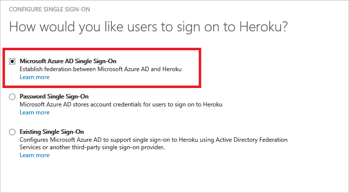
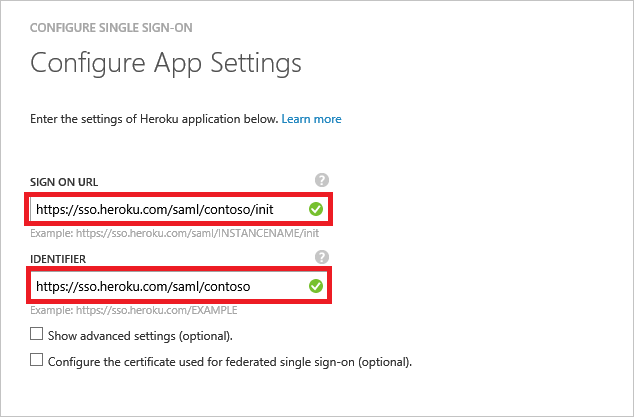
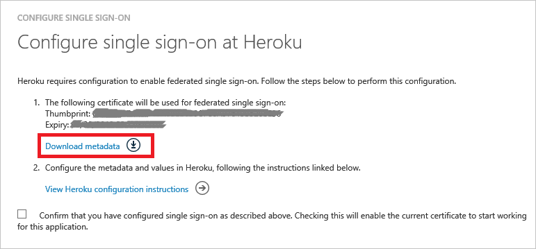
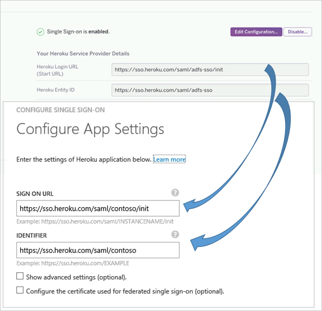
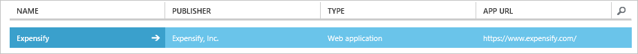

<properties
    pageTitle="Lernprogramm: Azure-Active Directory-Integration in Heroku | Microsoft Azure"
    description="Informationen Sie zum einmaligen Anmeldens zwischen Azure Active Directory und Heroku konfigurieren."
    services="active-directory"
    documentationCenter=""
    authors="jeevansd"
    manager="femila"
    editor=""/>

<tags
    ms.service="active-directory"
    ms.workload="identity"
    ms.tgt_pltfrm="na"
    ms.devlang="na"
    ms.topic="article"
    ms.date="09/29/2016"
    ms.author="jeedes"/>

# Lernprogramm: Azure-Active Directory-Integration in Heroku

In diesem Lernprogramm erfahren Sie, wie Heroku mit Azure Active Directory (Azure AD) integriert werden soll.

Integration von Heroku mit Azure AD bietet Ihnen die folgenden Vorteile:

- Sie können in Azure AD steuern, die auf Heroku zugreifen
- Sie können Ihre Benutzer automatisch auf Heroku (einmaliges Anmelden) mit ihren Konten Azure AD-angemeldete abrufen aktivieren.
- Sie können Ihre Konten an einem zentralen Ort – im klassischen Azure-Portal verwalten.

Wenn Sie weitere Details zu SaaS app-Integration in Azure AD-wissen möchten, finden Sie unter [Was ist Zugriff auf die Anwendung und einmaliges Anmelden mit Azure Active Directory](active-directory-appssoaccess-whatis.md).

## Erforderliche Komponenten

Zum Konfigurieren von Azure AD-Integration mit Heroku, benötigen Sie die folgenden Elemente:

- Ein Azure-Abonnement
- Eine Heroku einmaligen Anmeldung aktiviert Abonnement

> [AZURE.NOTE] Wenn Sie um die Schritte in diesem Lernprogramm zu testen, empfehlen wir nicht mit einer Umgebung für die Herstellung.

Führen Sie zum Testen der Schritte in diesem Lernprogramm Tips:

- Sie sollten Ihre Umgebung Herstellung nicht verwenden, es sei denn, dies erforderlich ist.
- Wenn Sie eine Testversion Azure AD-Umgebung besitzen, können Sie eine einen Monat zum Testen [hier](https://azure.microsoft.com/pricing/free-trial/)erhalten.

## Szenario Beschreibung
In diesem Lernprogramm testen Sie Azure AD-einmaliges Anmelden in einer testumgebung.  
In diesem Lernprogramm beschriebenen Szenario besteht aus zwei Hauptfenster Bausteine:

1. Hinzufügen von Heroku aus dem Katalog
2. Konfigurieren und Testen Azure AD einmaliges Anmelden

## Hinzufügen von Heroku aus dem Katalog
Um die Integration der Heroku in Azure AD zu konfigurieren, müssen Sie Heroku zu Ihrer Liste der verwalteten SaaS apps aus dem Katalog hinzuzufügen.

**Um Heroku aus dem Katalog hinzufügen möchten, führen Sie die folgenden Schritte aus:**

1. Klicken Sie im **Azure klassischen Portal**auf der linken Navigationsbereich auf **Active Directory**. 

    ![Active Directory][1]

2. Wählen Sie aus der Liste **Verzeichnis** Verzeichnis für das Sie Verzeichnisintegration aktivieren möchten.

3. Klicken Sie zum Öffnen der Anwendungsansicht in der Verzeichnisansicht im oberen Menü auf **Applications** .

    ![Applikationen][2]

4. Klicken Sie auf **Hinzufügen** , am unteren Rand der Seite.

    ![Applikationen][3]

5. Klicken Sie im Dialogfeld **Was möchten Sie tun** klicken Sie auf **eine Anwendung aus dem Katalog hinzufügen**.

    ![Applikationen][4]

6. Geben Sie im Suchfeld **Heroku**ein.

    

7. Wählen Sie im Ergebnisbereich **Heroku aus**, und klicken Sie dann auf **abgeschlossen** , um die Anwendung hinzugefügt haben.

    

##  Konfigurieren und Testen Azure AD einmaliges Anmelden
In diesem Abschnitt Konfigurieren und Testen Azure AD-einmaliges Anmelden mit Heroku basierend auf einen Testbenutzer "Britta Simon" bezeichnet.

Für einmaliges Anmelden entwickelt muss Azure AD kennen, kann der Benutzer Gegenstück Heroku einem Benutzer in Azure AD. Kurzum, muss eine Link Beziehung zwischen einem Azure AD-Benutzer und dem entsprechenden Benutzer in Heroku eingerichtet werden.  
Dieser Link Beziehung wird hergestellt, indem Sie den Wert des **Benutzernamens** in Azure AD als der Wert für den **Benutzernamen** in Heroku zuweisen.

Zum Konfigurieren und Testen Azure AD-einmaliges Anmelden mit Heroku, müssen Sie die folgenden Bausteine durchführen:

1. **[Konfigurieren von Azure AD einmaligen Anmeldens](#configuring-azure-ad-single-sign-on)** - damit Ihre Benutzer dieses Feature verwenden können.
2. **[Erstellen einer Azure AD Benutzer testen](#creating-an-azure-ad-test-user)** : Azure AD-einmaliges Anmelden mit Britta Simon testen.
4. **[Erstellen einer Heroku Benutzer testen](#creating-an-heroku-test-user)** : ein Gegenstück von Britta Simon in Heroku haben, die in der Azure AD-Darstellung Ihrer verknüpft ist.
5. **[Testen Sie Benutzer zuweisen Azure AD](#assigning-the-azure-ad-test-user)** - Britta Simon mit Azure AD-einmaliges Anmelden aktivieren.
5. **[Testen der einmaligen Anmeldens](#testing-single-sign-on)** - zur Überprüfung, ob die Konfiguration funktioniert.

### Konfigurieren von Azure AD einmaliges Anmelden

In diesem Abschnitt Azure AD-einmaliges Anmelden im klassischen Portal aktivieren und konfigurieren in Ihrer Anwendung Heroku einmaliges Anmelden.

**Führen Sie die folgenden Schritte aus, um Azure AD-einmaliges Anmelden mit Heroku konfigurieren:**

1. Im Portal klassischen auf der Seite **Heroku** Integration Anwendung klicken Sie auf **Konfigurieren einmaligen Anmeldens** zum Öffnen des Dialogfelds **Konfigurieren einmaliges Anmelden** .

    ![Konfigurieren Sie einmaliges Anmelden][6] 

2. Klicken Sie auf der Seite **Wie möchten Sie Benutzer bei der Heroku auf** **Azure AD einmaliges Anmelden**wählen Sie aus, und klicken Sie dann auf **Weiter**.
 
     

3. Führen Sie auf der Seite Dialogfeld **Konfigurieren der App-Einstellungen** die folgenden Schritte aus:
 
     

    > [AZURE.NOTE] Wenn Sie nicht wissen, was die richtigen Werte für einmaliges Anmelden URL und URL-Bezeichner sind, finden Sie unter "[Gehen Sie folgendermaßen vor, um SSO in Heroku, aktivieren](#x123)Sie" Anweisungen zum Abrufen.   

    ein. Geben Sie in das Textfeld **Melden Sie sich auf URL** die URL Ihrer Benutzer melden Sie sich für den Zugriff auf Ihre Heroku-Anwendung unter Verwendung des folgenden Musters untersuchten: **"https://sso.heroku.com/saml/\<Firmennamen\>/init"**. 

    b. Geben Sie in das Textfeld **Bezeichner enthält** eine URL mit folgenden Muster: "**https://sso.heroku.com/saml/\<Firmennamen\>**".  

    c. Klicken Sie auf **Weiter**.

4. Klicken Sie auf der Seite **Konfigurieren einmaliges Anmelden bei Heroku** führen Sie die folgenden Schritte aus:

     

    ein. Klicken Sie auf **Herunterladen von Metadaten**aus, und speichern Sie die Datei auf Ihrem Computer.

    b. Klicken Sie auf **Weiter**.

5. Wenn SSO in Heroku aktivieren möchten, führen Sie die folgenden Schritte aus:
 
    ein. Melden Sie sich als Administrator in das Heroku-Konto an.

    b. Klicken Sie auf der Registerkarte **Einstellungen** .

    c. Klicken Sie auf die **Einzelnen melden Sie sich auf Seite**auf **Hochladen Metadaten**.
 
    d. Laden Sie die Metadatendatei, die Sie vom klassischen Azure-Portal heruntergeladen haben.

    e. Wenn das Setup erfolgreich ist, Administratoren werden ein Bestätigungsdialogfeld angezeigt, und die URL des Benutzernamens SSO Endbenutzer wird angezeigt.

    f. Kopieren Sie Ihre **Anmelde-URL Heroku** und **Heroku Entität-ID**, und klicken Sie dann auf dem Portal Azure AD-klassischen kehren Sie zu der Seite **Einstellungen für die App konfigurieren** , und fügen Sie die Werte in den verknüpften Textfeldern.

  
     

    g. Klicken Sie auf **Weiter**.
  
6. Wählen Sie die Bestätigung Konfiguration für einzelne Zeichen, und klicken Sie dann auf **Weiter**.

    ![Azure AD einmaliges Anmelden][10]

7. Klicken Sie auf der Seite **Bestätigung für einzelne anmelden** auf **abgeschlossen**.  

    ![Azure AD einmaliges Anmelden][11]

### Erstellen eines Benutzers mit Azure AD-testen
In diesem Abschnitt erstellen Sie einen Testbenutzer im klassischen Portal Britta Simon bezeichnet.  

![Erstellen von Azure AD-Benutzer][20]

**Führen Sie die folgenden Schritte aus, um einen Testbenutzer in Azure AD zu erstellen:**

1. Klicken Sie im **Azure klassischen Portal**auf der linken Navigationsbereich auf **Active Directory**.

     

2. Wählen Sie aus der Liste **Verzeichnis** Verzeichnis für das Sie Verzeichnisintegration aktivieren möchten.

3. Wenn die Liste der Benutzer, klicken Sie im Menü oben anzeigen möchten, klicken Sie auf **Benutzer**.

     

4. Klicken Sie im Dialogfeld **Benutzer hinzufügen** um in der Symbolleiste auf der Unterseite öffnen, auf **Benutzer hinzufügen**.

     

5. Führen Sie auf der Seite **Teilen Sie uns zu diesem Benutzer** die folgenden Schritte aus:

     

    ein. Wählen Sie als Typ des Benutzers neuen Benutzer in Ihrer Organisation ein.

    b. Geben Sie den Benutzernamen **Textfeld** **BrittaSimon**ein.

    c. Klicken Sie auf **Weiter**.

6.  Klicken Sie auf der Seite **Benutzerprofil** Dialogfeld führen Sie die folgenden Schritte aus:

     

    ein. Geben Sie im Textfeld **Vorname** **Britta**aus.  

    b. In das letzte Textfeld **Name** , Typ, **Simon**.

    c. Geben Sie im Textfeld **Anzeigename** **Britta Simon**aus.

    d. Wählen Sie in der Liste **Rolle** **Benutzer**aus.

    e. Klicken Sie auf **Weiter**.

7. Klicken Sie auf der Seite **erste temporäres Kennwort** auf **Erstellen**.

     

8. Führen Sie auf der Seite **erste temporäres Kennwort** die folgenden Schritte aus:

     

    ein. Notieren Sie den Wert für das **Neue Kennwort ein**.

    b. Klicken Sie auf **abgeschlossen**.   

### Erstellen eines Benutzers mit Heroku testen

In diesem Abschnitt erstellen Sie einen Benutzer namens Britta Simon in Heroku. Heroku unterstützt in-Time-Bereitstellung, ist standardmäßig aktiviert.

Keine für Sie in diesem Abschnitt Aktionselement ist vorhanden. Beim Zugriff auf Heroku, wenn der Benutzer noch nicht vorhanden ist, wird ein neuer Benutzer erstellt. Nachdem das Konto bereitgestellt wird, der Endbenutzer empfängt eine Überprüfung e-Mail und muss auf den Link für die Bestätigung klicken.

> [AZURE.NOTE] Wenn Sie einen Benutzer manuell zu erstellen müssen, müssen Sie die Heroku-Supportteam.

### Zuweisen des Azure AD-Test-Benutzers

In diesem Abschnitt aktivieren Sie Britta Simon Azure einmaliges Anmelden verwenden, indem Sie keinen Zugriff auf Heroku erteilen.

![Benutzer zuweisen][200] 

**Um Britta Simon Heroku zuzuweisen, führen Sie die folgenden Schritte aus:**

1. Klicken Sie im Portal klassischen zum Öffnen der Anwendungsansicht in der Verzeichnisansicht klicken Sie auf **Applikationen** im oberen Menü.

    ![Benutzer zuweisen][201] 

2. Wählen Sie in der Liste Applications **Heroku**.

     

1. Klicken Sie auf **Benutzer**, klicken Sie im Menü oben.

    ![Benutzer zuweisen][203] 

1. Wählen Sie in der Liste Benutzer **Britta Simon**aus.

2. Klicken Sie unten auf der Symbolleiste auf **zuweisen**.

    ![Benutzer zuweisen][205]

### Testen einmaliges Anmelden

In diesem Abschnitt Testen Sie Ihre Azure AD-einzelne anmelden Konfiguration mit der Access-Systemsteuerung.  
Wenn Sie die Kachel Heroku im Bereich Access klicken, Sie sollten automatisch an Ihrer Anwendung Heroku angemeldete abrufen.

## Zusätzliche Ressourcen

* [Liste der zum Integrieren SaaS-Apps mit Azure-Active Directory-Lernprogramme](active-directory-saas-tutorial-list.md)
* [Was ist die Anwendungszugriff und einmaliges Anmelden mit Azure Active Directory?](active-directory-appssoaccess-whatis.md)

<!--Image references-->

[1]: ./media/active-directory-saas-heroku-tutorial/tutorial_general_01.png
[2]: ./media/active-directory-saas-heroku-tutorial/tutorial_general_02.png
[3]: ./media/active-directory-saas-heroku-tutorial/tutorial_general_03.png
[4]: ./media/active-directory-saas-heroku-tutorial/tutorial_general_04.png

[6]: ./media/active-directory-saas-heroku-tutorial/tutorial_general_05.png
[10]: ./media/active-directory-saas-heroku-tutorial/tutorial_general_06.png
[11]: ./media/active-directory-saas-heroku-tutorial/tutorial_general_07.png
[20]: ./media/active-directory-saas-heroku-tutorial/tutorial_general_100.png

[200]: ./media/active-directory-saas-heroku-tutorial/tutorial_general_200.png
[201]: ./media/active-directory-saas-heroku-tutorial/tutorial_general_201.png
[203]: ./media/active-directory-saas-heroku-tutorial/tutorial_general_203.png
[204]: ./media/active-directory-saas-heroku-tutorial/tutorial_general_204.png
[205]: ./media/active-directory-saas-heroku-tutorial/tutorial_general_205.png
