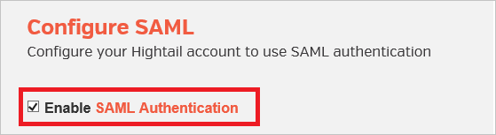
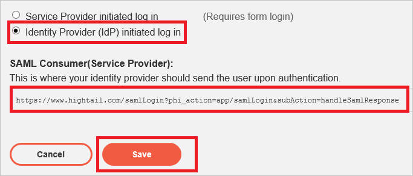

<properties
    pageTitle="Lernprogramm: Azure-Active Directory-Integration in Hightail | Microsoft Azure"
    description="Informationen Sie zum einmaligen Anmeldens zwischen Azure Active Directory und Hightail konfigurieren."
    services="active-directory"
    documentationCenter=""
    authors="jeevansd"
    manager="femila"
    editor=""/>

<tags
    ms.service="active-directory"
    ms.workload="identity"
    ms.tgt_pltfrm="na"
    ms.devlang="na"
    ms.topic="article"
    ms.date="09/29/2016"
    ms.author="jeedes"/>

# Lernprogramm: Azure-Active Directory-Integration in Hightail

Ziel dieses Lernprogramms ist es zu zeigen, wie Sie Hightail mit Azure Active Directory (Azure AD) integrieren.

Integration von Hightail mit Azure AD bietet Ihnen die folgenden Vorteile:

- Sie können in Azure AD steuern, die auf Hightail zugreifen
- Sie können Ihre Benutzer automatisch auf Hightail (einmaliges Anmelden) mit ihren Konten Azure AD-angemeldete abrufen aktivieren.
- Sie können Ihre Konten an einem zentralen Ort – im klassischen Azure-Portal verwalten.

Wenn Sie weitere Details zu SaaS app-Integration in Azure AD-wissen möchten, finden Sie unter [Was ist Zugriff auf die Anwendung und einmaliges Anmelden mit Azure Active Directory](active-directory-appssoaccess-whatis.md).

## Erforderliche Komponenten

Zum Konfigurieren von Azure AD-Integration mit Hightail, benötigen Sie die folgenden Elemente:

- Ein Azure AD-Abonnement
- Eine Hightail einmaligen Anmeldung aktiviert Abonnement

> [AZURE.NOTE] Wenn Sie um die Schritte in diesem Lernprogramm zu testen, empfehlen wir nicht mit einer Umgebung für die Herstellung.

Führen Sie zum Testen der Schritte in diesem Lernprogramm Tips:

- Sie sollten Ihre Umgebung Herstellung nicht verwenden, es sei denn, dies erforderlich ist.
- Wenn Sie eine Testversion Azure AD-Umgebung besitzen, können Sie eine einen Monat zum Testen [hier](https://azure.microsoft.com/pricing/free-trial/)erhalten.

## Szenario Beschreibung
Ziel dieses Lernprogramms ist, sodass Sie in einer Umgebung für Azure AD-einmaligen Anmeldens testen können. 

In diesem Lernprogramm beschriebenen Szenario besteht aus zwei Hauptfenster Bausteine:

1. Hinzufügen von Hightail aus dem Katalog
2. Konfigurieren und Testen Azure AD einmaliges Anmelden

## Hinzufügen von Hightail aus dem Katalog
Um die Integration der Hightail in Azure AD zu konfigurieren, müssen Sie Hightail zu Ihrer Liste der verwalteten SaaS apps aus dem Katalog hinzuzufügen.

**Um Hightail aus dem Katalog hinzufügen möchten, führen Sie die folgenden Schritte aus:**

1. Klicken Sie im **Azure klassischen Portal**auf der linken Navigationsbereich auf **Active Directory**. 
 
    ![Active Directory][1]

2. Wählen Sie aus der Liste **Verzeichnis** Verzeichnis für das Sie Verzeichnisintegration aktivieren möchten.

3. Klicken Sie zum Öffnen der Anwendungsansicht in der Verzeichnisansicht im oberen Menü auf **Applications** .

    ![Applikationen][2]

4. Klicken Sie auf **Hinzufügen** , am unteren Rand der Seite.

    ![Applikationen][3]

5. Klicken Sie im Dialogfeld **Was möchten Sie tun** klicken Sie auf **eine Anwendung aus dem Katalog hinzufügen**.

    ![Applikationen][4]

6. Geben Sie im Suchfeld **Hightail**ein.

    

7. Wählen Sie im Ergebnisbereich **Hightail aus**, und klicken Sie dann auf **abgeschlossen** , um die Anwendung hinzugefügt haben.

    

##  Konfigurieren und Testen Azure AD einmaliges Anmelden
Das Ziel der in diesem Abschnitt ist erläutert, wie Sie konfigurieren und Testen der Azure AD-einmaliges Anmelden mit Hightail basierend auf einen Testbenutzer "Britta Simon" bezeichnet.

Für einmaliges Anmelden entwickelt muss Azure AD wissen, was der Benutzer Gegenstück Hightail an einen Benutzer in Azure AD ist. Kurzum, muss eine Link Beziehung zwischen einem Azure AD-Benutzer und dem entsprechenden Benutzer in Hightail eingerichtet werden.

Dieser Link Beziehung wird hergestellt, indem Sie den Wert des **Benutzernamens** in Azure AD als der Wert für den **Benutzernamen** in Hightail zuweisen.

Zum Konfigurieren und Azure AD-einmaliges Anmelden mit Hightail testen, müssen Sie die folgenden Bausteine durchführen:

1. **[Konfigurieren von Azure AD einmaligen Anmeldens](#configuring-azure-ad-single-sign-on)** - damit Ihre Benutzer dieses Feature verwenden können.
2. **[Erstellen einer Azure AD Benutzer testen](#creating-an-azure-ad-test-user)** : Azure AD-einmaliges Anmelden mit Britta Simon testen.
4. **[Erstellen einer Hightail Benutzer testen](#creating-a-hightail-test-user)** : ein Gegenstück von Britta Simon in Hightail haben, die in der Azure AD-Darstellung Ihrer verknüpft ist.
5. **[Testen Sie Benutzer zuweisen Azure AD](#assigning-the-azure-ad-test-user)** - Britta Simon mit Azure AD-einmaliges Anmelden aktivieren.
5. **[Testen der einmaligen Anmeldens](#testing-single-sign-on)** - zur Überprüfung, ob die Konfiguration funktioniert.

### Konfigurieren von Azure AD einmaliges Anmelden

Das Ziel der in diesem Abschnitt ist Azure AD-einmaliges Anmelden im klassischen Azure-Portal aktivieren und konfigurieren einmaliges Anmelden in Ihrer Anwendung Hightail.

Hightail Anwendung erwartet die SAML-Assertionen in einem bestimmten Format. Konfigurieren Sie die folgenden Ansprüche für diese Anwendung. Sie können die Werte dieser Attribute der Registerkarte **"Atrribute"** der Anwendung verwalten. Das folgende Bildschirmabbild zeigt ein Beispiel dafür. 

 

**Führen Sie die folgenden Schritte aus, um Azure AD-einmaliges Anmelden mit Hightail konfigurieren:**

1. Im klassischen Azure Portal **Hightail** Anwendung Integration in die Seite, klicken Sie im Menü oben klicken Sie auf **Attribute**.

     

1. Klicken Sie im Dialogfeld **token SAML-Attribute** für jede Zeile in der folgenden Tabelle werden führen Sie die folgenden Schritte aus:

  	| Attributname | Attributwert |
  	| --- | --- |    
  	| Vorname | User.GivenName |
  	| Nachname  | User.Surname |
  	| E-Mail | User.Mail |
  	| Benutzeridentität | User.Mail |

    ein. Klicken Sie auf **Benutzerattribut hinzufügen** , um das Dialogfeld **Benutzer Attribure hinzufügen** zu öffnen.

     

    b. Geben Sie in das Textfeld **Attrubute Name** das Attribut Bankname für diese Zeile ein.

    c. Aus der Liste **Attributwert** Selsect das Attributwert für diese Zeile angezeigt.

    d. Klicken Sie auf **abgeschlossen**.  
    

1. Klicken Sie im Menü oben auf **Schnellstart**.

      

2. Klicken Sie auf der Seite **Wie möchten Sie Benutzer bei der Hightail auf** **Azure AD einmaliges Anmelden**wählen Sie aus, und klicken Sie dann auf **Weiter**.

     

3. Auf der Seite **Einstellungen für die App konfigurieren** Dialogfeld Wenn Sie die Anwendung im **IDP initiiert Modus**konfigurieren möchten, führen Sie die folgenden Schritte aus und klicken Sie auf **Weiter**:

     

    ein. Geben Sie in das Textfeld **Antwort-URL** die URL in das folgende Muster: **"https://www.hightail.com/samlLogin?phi_action=app/samlLogin & Unteraktion HandleSamlResponse ="**

    b. Klicken Sie auf **Weiter**

4. Wenn Sie die Anwendung in **SP initiiert Modus** auf der **App-Einstellungen konfigurieren** Dialogseite konfigurieren möchten, klicken Sie dann auf die **"Erweiterte Einstellungen (optional) anzeigen"** , und geben Sie die **Melden Sie sich auf URL** , und klicken Sie auf **Weiter**.

     

    ein. Geben Sie in das Textfeld melden Sie sich auf URL die URL Ihrer Benutzer melden Sie sich für den Zugriff auf Ihre Hightail-Anwendung unter Verwendung des folgenden Musters untersuchten: **https://www.hightail.com/loginSSO**. Dies ist die allgemeine Anmeldeseite für alle Kunden ab, die SSO verwenden möchten.

    b. Klicken Sie auf **Weiter**

5. Klicken Sie auf der Seite **Konfigurieren einmaliges Anmelden bei Hightail** führen Sie die folgenden Schritte aus, und klicken Sie auf **Weiter**:

     

    ein. Klicken Sie auf **Zertifikat herunterladen**, und speichern Sie die Datei Base-64-codierte Zertifikat auf Ihrem Computer.

    b. Klicken Sie auf **Weiter**.

    > [AZURE.NOTE] Bevor Sie konfigurieren die Single Sign On bei Hightail app, wenden Sie sich bitte weiße Liste Ihrer e-Mail-Domäne mit Hightail Teamwebsite, damit die Benutzer, die diese Domäne verwenden Single Sign On Funktionen nutzen können.

6. Wenn für die Anwendung konfigurierten SSO erhalten möchten, müssen Sie Ihrem Mandanten Hightail als Administrator anmelden.

    ein. Klicken Sie im Menü oben klicken Sie auf die Registerkarte **Konto** , und wählen Sie **Konfigurieren von SAML**.

     

    b. Aktivieren Sie das Kontrollkästchen der **SAML-Authentifizierung aktivieren**.

     

    c. Öffnen Sie Ihre Base-64-codierte Zertifikat in Editor, kopieren Sie den Inhalt der es in der Zwischenablage, und fügen Sie ihn in das Textfeld **SAML Token Signaturzertifikat** .

     

    d. Kopieren Sie Remote Anmelde-URL aus Azure AD- **SAML-Zertifizierungsstelle (Identitätsanbieter)** in Hightail.

    
    
    

    e. Wählen Sie **"Identitätsanbieter (IdP) initiiert Log in"**, wenn Sie die Anwendung im **IDP initiiert Modus** konfigurieren möchten. Wenn **SP initiiert Modus** **"Dienstanbieter (SP) initiiert Log in"**auswählen.
    
    

    f. Kopieren der SAML-Consumer-URL für Ihre Instanz, und fügen Sie ihn in das Textfeld **URL Antworten** aus, wie in Schritt 4 dargestellt. 

    g. Klicken Sie auf **Speichern**.

6. Im Portal Azure klassischen wählen Sie die Konfiguration für einzelne Zeichen Bestätigung, und klicken Sie dann auf **Weiter**.

    ![Azure AD einmaliges Anmelden][10]

7. Klicken Sie auf der Seite **Bestätigung für einzelne anmelden** auf **abgeschlossen**. 
 
    ![Azure AD einmaliges Anmelden][11]

### Erstellen eines Benutzers mit Azure AD-testen
Das Ziel der in diesem Abschnitt besteht im Erstellen eines Testbenutzers aufgerufen Britta Simon im klassischen Azure-Portal.

Wählen Sie in der Liste Benutzer **Britta Simon**aus.

![Erstellen von Azure AD-Benutzer][20]

**Führen Sie die folgenden Schritte aus, um einen Testbenutzer in Azure AD zu erstellen:**

1. Klicken Sie im **Azure klassischen Portal**auf der linken Navigationsbereich auf **Active Directory**.

     

2. Wählen Sie aus der Liste **Verzeichnis** Verzeichnis für das Sie Verzeichnisintegration aktivieren möchten.

3. Wenn die Liste der Benutzer, klicken Sie im Menü oben anzeigen möchten, klicken Sie auf **Benutzer**.
 
     

4. Klicken Sie im Dialogfeld **Benutzer hinzufügen** um in der Symbolleiste auf der Unterseite öffnen, auf **Benutzer hinzufügen**.

    

5. Führen Sie auf der Seite **Teilen Sie uns zu diesem Benutzer** die folgenden Schritte aus:

     

    ein. Wählen Sie als **Typ des Benutzers** **neuen Benutzer in Ihrer Organisation**ein.

    b. Geben Sie in das Textfeld **Benutzername** **BrittaSimon**ein.

    c. Klicken Sie auf **Weiter**.

6.  Klicken Sie auf der Seite **Benutzerprofil** Dialogfeld führen Sie die folgenden Schritte aus:

     

    ein. Geben Sie im Textfeld **Vorname** **Britta**aus.  

    b. In das letzte Textfeld **Name** , Typ, **Simon**.

    c. Geben Sie im Textfeld **Anzeigename** **Britta Simon**aus.

    d. Wählen Sie in der Liste **Rolle** **Benutzer**aus.

    e. Klicken Sie auf **Weiter**.

7. Klicken Sie auf der Seite **erste temporäres Kennwort** auf **Erstellen**.

     

8. Führen Sie auf der Seite **erste temporäres Kennwort** die folgenden Schritte aus:
 
     

    ein. Notieren Sie den Wert für das **Neue Kennwort ein**.

    b. Klicken Sie auf **abgeschlossen**.   

### Erstellen eines Testbenutzers Hightail

Das Ziel der in diesem Abschnitt ist zum Erstellen eines Benutzers Britta Simon in Hightail bezeichnet. 

Keine für Sie in diesem Abschnitt Aktionselement ist vorhanden. Hightail unterstützt abhängig von der benutzerdefinierte Ansprüche in-Time-Benutzer bereitgestellt. Wenn Sie die benutzerdefinierten Ansprüche konfiguriert haben, wie im Abschnitt **[Konfigurieren von Azure AD einmaligen Anmeldens](#configuring-azure-ad-single-sign-on)** oben dargestellt, wird automatisch ein Benutzer in der Anwendung erstellt, die sie noch nicht vorhanden ist. 

> [AZURE.NOTE] Wenn Sie einen Benutzer manuell erstellen müssen, müssen Sie wenden Sie sich an das Supportteam Hightail über [support@hightail.com](mailto:support@hightail.com).

### Zuweisen des Azure AD-Test-Benutzers

Das Ziel der in diesem Abschnitt ist für die Aktivierung der Britta Simon Azure einmaliges Anmelden verwenden, indem Sie keinen Zugriff auf Hightail erteilen.

![Benutzer zuweisen][200] 

**Um Britta Simon Hightail zuzuweisen, führen Sie die folgenden Schritte aus:**

1. Klicken Sie im Portal Azure klassischen zum Öffnen der Anwendungsansicht in der Verzeichnisansicht klicken Sie auf **Applikationen** im oberen Menü.
 
    ![Benutzer zuweisen][201] 

2. Wählen Sie in der Liste Applications **Hightail**.

     

1. Klicken Sie auf **Benutzer**, klicken Sie im Menü oben.

    ![Benutzer zuweisen][203]

1. Wählen Sie in der Liste Benutzer **Britta Simon**aus.

2. Klicken Sie unten auf der Symbolleiste auf **zuweisen**.

![Benutzer zuweisen][205]

### Testen einmaliges Anmelden

Das Ziel der in diesem Abschnitt ist zum Azure AD-einzelne anmelden Überprüfen der Konfiguration mithilfe des Bedienfelds Access.

Wenn Sie die Kachel Hightail im Bereich Access klicken, Sie sollten automatisch an Ihrer Anwendung Hightail angemeldete abrufen.

## Zusätzliche Ressourcen

* [Liste der zum Integrieren SaaS-Apps mit Azure-Active Directory-Lernprogramme](active-directory-saas-tutorial-list.md)
* [Was ist die Anwendungszugriff und einmaliges Anmelden mit Azure Active Directory?](active-directory-appssoaccess-whatis.md)

<!--Image references-->

[1]: ./media/active-directory-saas-hightail-tutorial/tutorial_general_01.png
[2]: ./media/active-directory-saas-hightail-tutorial/tutorial_general_02.png
[3]: ./media/active-directory-saas-hightail-tutorial/tutorial_general_03.png
[4]: ./media/active-directory-saas-hightail-tutorial/tutorial_general_04.png

[6]: ./media/active-directory-saas-hightail-tutorial/tutorial_general_05.png
[10]: ./media/active-directory-saas-hightail-tutorial/tutorial_general_06.png
[11]: ./media/active-directory-saas-hightail-tutorial/tutorial_general_07.png
[20]: ./media/active-directory-saas-hightail-tutorial/tutorial_general_100.png

[200]: ./media/active-directory-saas-hightail-tutorial/tutorial_general_200.png
[201]: ./media/active-directory-saas-hightail-tutorial/tutorial_general_201.png
[203]: ./media/active-directory-saas-hightail-tutorial/tutorial_general_203.png
[204]: ./media/active-directory-saas-hightail-tutorial/tutorial_general_204.png
[205]: ./media/active-directory-saas-hightail-tutorial/tutorial_general_205.png
