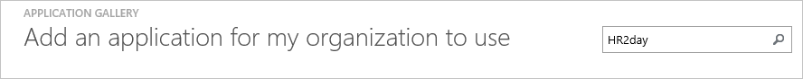
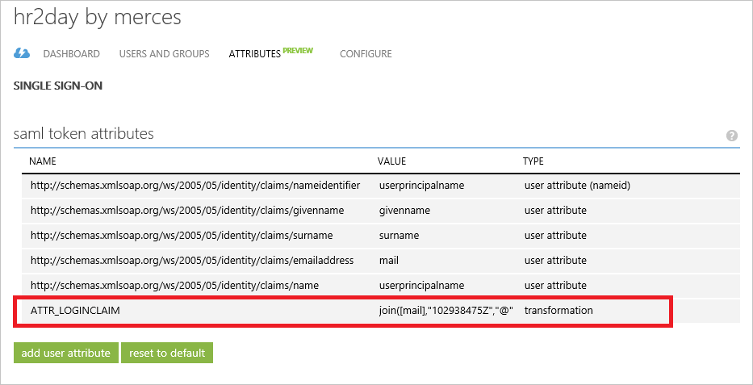
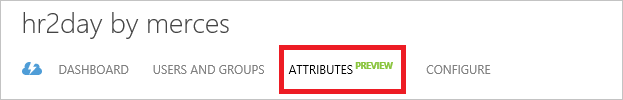
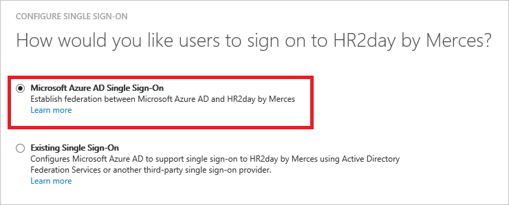
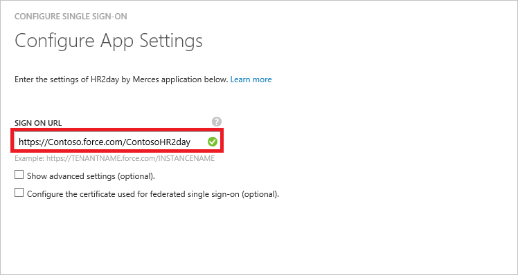
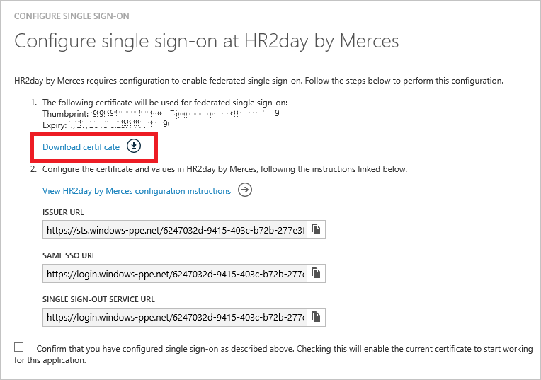
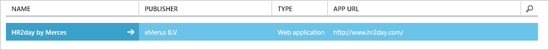

<properties
    pageTitle="Lernprogramm: Azure-Active Directory-Integration in HR2day durch Merces | Microsoft Azure"
    description="Informationen Sie zum einmaligen Anmeldens zwischen Azure Active Directory und HR2day durch Merces konfigurieren."
    services="active-directory"
    documentationCenter=""
    authors="jeevansd"
    manager="femila"
    editor=""/>

<tags
    ms.service="active-directory"
    ms.workload="identity"
    ms.tgt_pltfrm="na"
    ms.devlang="na"
    ms.topic="article"
    ms.date="09/01/2016"
    ms.author="jeedes"/>

# Lernprogramm: Azure-Active Directory-Integration in HR2day von Merces

Ziel dieses Lernprogramms ist es zu zeigen, wie Sie HR2day durch Merces mit Azure Active Directory (Azure AD) integrieren.  
Integration von HR2day durch Merces mit Azure AD bietet Ihnen die folgenden Vorteile:

- Sie können in Azure AD steuern, wer auf HR2day durch Merces zugreifen kann
- Sie können Ihre Benutzer automatisch auf HR2day durch Merces (einmaliges Anmelden) mit ihren Azure AD-Konten angemeldete abrufen aktivieren.
- Sie können Ihre Konten an einem zentralen Ort – im klassischen Azure-Portal verwalten.

Wenn Sie weitere Details zu SaaS app-Integration in Azure AD-wissen möchten, finden Sie unter [Was ist Zugriff auf die Anwendung und einmaliges Anmelden mit Azure Active Directory](active-directory-appssoaccess-whatis.md).

## Erforderliche Komponenten

Zum Konfigurieren von Azure AD-Integration mit HR2day durch Merces, benötigen Sie die folgenden Elemente:

- Ein Azure AD-Abonnement
- Eine HR2day durch Merces einmaligen Anmeldung aktiviert Abonnement

> [AZURE.NOTE] Wenn Sie um die Schritte in diesem Lernprogramm zu testen, empfehlen wir nicht mit einer Umgebung für die Herstellung.

Führen Sie zum Testen der Schritte in diesem Lernprogramm Tips:

- Sie sollten Ihre Umgebung Herstellung nicht verwenden, es sei denn, dies erforderlich ist.
- Wenn Sie eine Testversion Azure AD-Umgebung besitzen, können Sie eine einen Monat zum Testen [hier](https://azure.microsoft.com/pricing/free-trial/)erhalten.

## Szenario Beschreibung
Ziel dieses Lernprogramms ist, sodass Sie in einer Umgebung für Azure AD-einmaligen Anmeldens testen können.  
In diesem Lernprogramm beschriebenen Szenario besteht aus zwei Hauptfenster Bausteine:

1. Hinzufügen von Merces HR2day aus dem Katalog
2. Konfigurieren und Testen Azure AD einmaliges Anmelden

## Hinzufügen von Merces HR2day aus dem Katalog
Zum Konfigurieren der Integration von HR2day durch Merces in Azure AD müssen Sie HR2day durch Merces zu Ihrer Liste der verwalteten SaaS apps aus dem Katalog hinzuzufügen.

**Wenn HR2day durch Merces aus dem Katalog hinzufügen möchten, führen Sie die folgenden Schritte aus:**

1. Klicken Sie im **Azure klassischen Portal**auf der linken Navigationsbereich auf **Active Directory**. 

    ![Active Directory][1]

2. Wählen Sie aus der Liste **Verzeichnis** Verzeichnis für das Sie Verzeichnisintegration aktivieren möchten.

3. Klicken Sie zum Öffnen der Anwendungsansicht in der Verzeichnisansicht im oberen Menü auf **Applications** .
 
    ![Applikationen][2]

4. Klicken Sie auf **Hinzufügen** , am unteren Rand der Seite.

    ![Applikationen][3]

5. Klicken Sie im Dialogfeld **Was möchten Sie tun** klicken Sie auf **eine Anwendung aus dem Katalog hinzufügen**.

    ![Applikationen][4]

6. Geben Sie in das Suchfeld **nach Merces HR2day**ein.

    

7. Im Bereich Ergebnisse wählen Sie **HR2day durch Merces aus**und dann auf **abgeschlossen** , um die Anwendung hinzuzufügen.

##  Konfigurieren und Testen Azure AD einmaliges Anmelden
Das Ziel der in diesem Abschnitt ist erläutert, wie Sie konfigurieren und Testen der Azure AD-einmaliges Anmelden mit HR2day durch Merces basierend auf einen Testbenutzer "Britta Simon" bezeichnet.

Für einmaliges Anmelden entwickelt muss Azure AD Gegenstück Benutzer im HR2day durch Merces an einen Benutzer in Azure AD kennen. Kurzum, muss eine Link Beziehung zwischen einem Azure AD-Benutzer und dem entsprechenden Benutzer in HR2day durch Merces hergestellt werden.  
Dieser Link Beziehung wird hergestellt, indem Sie den Wert des **Benutzernamens** in Azure AD als der Wert für den **Benutzernamen** in HR2day durch Merces zuweisen.

Zum Konfigurieren und Azure AD-einmaliges Anmelden mit HR2day durch Merces testen, müssen Sie die folgenden Bausteine durchführen:

1. **[Konfigurieren von Azure AD einmaligen Anmeldens](#configuring-azure-ad-single-single-sign-on)** - damit Ihre Benutzer dieses Feature verwenden können.
2. **[Erstellen einer Azure AD Benutzer testen](#creating-an-azure-ad-test-user)** : Azure AD-einmaliges Anmelden mit Britta Simon testen.
4. **[Erstellen einer HR2day durch Merces Benutzer testen](#creating-a-hr2day-by-merces-test-user)** : ein Gegenstück von Britta Simon in HR2day durch Merces haben, die in der Azure AD-Darstellung Ihrer verknüpft ist.
5. **[Testen Sie Benutzer zuweisen Azure AD](#assigning-the-azure-ad-test-user)** - Britta Simon mit Azure AD-einmaliges Anmelden aktivieren.
5. **[Testen der einmaligen Anmeldens](#testing-single-sign-on)** - zur Überprüfung, ob die Konfiguration funktioniert.

### Konfigurieren von Azure AD einmaliges Anmelden

Das Ziel der in diesem Abschnitt ist zu gliedernden wie Benutzer authentifizieren zu HR2day durch Merces mit ihrem Konto in Azure Active Directory Federation je nach verwendetem SAML-Protokoll verwenden aktiviert.

Ihre HR2day von Merces Anwendung erwartet die SAML-Assertionen in einem bestimmten Format, das Hinzufügen von benutzerdefinierten Attribut Zuordnungen zu der SAML-token Attribute Konfiguration erfordert. Das folgende Bildschirmabbild zeigt ein Beispiel dafür. 

 

Bevor Sie die SAML-Assertion konfigurieren können, müssen Sie wenden Sie sich an Ihr Supportteam HR2day über [servicedesk@merces.nl](mailto:servicedesk@merces.nl) , und bitten Sie den Wert für das Attribut eindeutige ID für Ihren Mandanten. Sie benötigen diesen Wert auf die Schritte im nächsten Abschnitt.

**Führen Sie die folgenden Schritte aus, um Azure AD-einmaliges Anmelden mit HR2day durch Merces konfigurieren:**

1. Klicken Sie im Azure klassischen Portal **HR2day durch Merces** Anwendung Integration in die Seite, das Menü im oberen Bereich auf **Attributen** , um das Dialogfeld **Token SAML-Attribute** zu öffnen. 

     

2. Erforderliches Attribut Zuordnungen hinzufügen möchten, gehen Sie folgendermaßen vor, führen Sie die folgenden Schritte aus: 

     

    ein. Klicken Sie auf **Benutzerattribut hinzufügen**.

    b. Geben Sie in das Textfeld **Name Attribut** **"ATTR_LOGINCLAIM"**ein.

    c. Wählen Sie in der Liste **Attributwert** **Join()**aus. 

    d. Wählen Sie in der Liste **Zeichenfolge1** **User.mail**ein. 

    e. Geben Sie in das Textfeld **Zeichenfolge2** zur Verfügung gestellt, indem Sie Ihr Team HR2day **eindeutige ID** ein. 

    f. Geben Sie im Textfeld **Trennzeichen** ein **@**.

    g. Klicken Sie auf **abgeschlossen**.

  
3. Klicken Sie auf **Änderungen anzuwenden**.

1. Klicken Sie im Menü oben auf **Schnellstart** , um das Dialogfeld **Schnellstart** zu öffnen.

     

1. Klicken Sie auf **Konfigurieren einmaligen Anmeldens** zum Öffnen des Dialogfelds **Konfigurieren einmaliges Anmelden** .

    ![Konfigurieren Sie einmaliges Anmelden][6] 

2. Klicken Sie auf der Seite **Wie möchten Sie Benutzer bei der HR2day nach Merces auf** **Azure AD einmaliges Anmelden**wählen Sie aus, und klicken Sie dann auf **Weiter**.

     

3. Führen Sie auf der Seite Dialogfeld **Konfigurieren der App-Einstellungen** die folgenden Schritte aus: 

     

    ein. Geben Sie in das Textfeld melden Sie sich auf URL die URL Ihrer Benutzer melden Sie sich für den Zugriff auf Ihre HR2day von Merces-Anwendung unter Verwendung des folgenden Musters untersuchten: **"https://\<Mandanten Namen\>.force.com/\<Instanznamen\>"**.

    b. Klicken Sie auf **Weiter**.

4. Klicken Sie auf der Seite **Konfigurieren einmaliges Anmelden bei HR2day durch Merces** führen Sie die folgenden Schritte aus:

     

    ein. Klicken Sie auf **Zertifikat herunterladen**, und speichern Sie die Datei auf Ihrem Computer.

    b. Klicken Sie auf **Weiter**.

5. Wenn für die Anwendung konfigurierten SSO erhalten möchten, wenden Sie sich an Ihre HR2day vom Supportteam über Merces [servicedesk@merces.nl](emailTo:servicedesk@merces.nl) und die heruntergeladene Zertifikatsdatei zu Ihren e-Mails anfügen. Auch Bitte bieten der SAML SSO-URL, melden Sie sich ab URL und Herausgeber URL, damit sie für die Integration von SSO konfiguriert werden können.

> [AZURE.NOTE] Wenden Sie sich bitte an Merces Team Erwähnen Sie, dass diese Integration benötigen Entität-ID, die mit diesem Muster **https://hr2day.force.com/INSTANCENAME** festgelegt werden

6. Im Portal Azure klassischen wählen Sie die Konfiguration für einzelne Zeichen Bestätigung, und klicken Sie dann auf **Weiter**.

    ![Azure AD einmaliges Anmelden][10]

7. Klicken Sie auf der Seite **Bestätigung für einzelne anmelden** auf **abgeschlossen**.  

    ![Azure AD einmaliges Anmelden][11]

### Erstellen eines Benutzers mit Azure AD-testen
Das Ziel der in diesem Abschnitt besteht im Erstellen eines Testbenutzers aufgerufen Britta Simon im klassischen Azure-Portal.  

![Erstellen von Azure AD-Benutzer][20]

**Führen Sie die folgenden Schritte aus, um einen Testbenutzer in Azure AD zu erstellen:**

1. Klicken Sie im **Azure klassischen Portal**auf der linken Navigationsbereich auf **Active Directory**.

     

2. Wählen Sie aus der Liste **Verzeichnis** Verzeichnis für das Sie Verzeichnisintegration aktivieren möchten.

3. Wenn die Liste der Benutzer, klicken Sie im Menü oben anzeigen möchten, klicken Sie auf **Benutzer**.

     

4. Klicken Sie im Dialogfeld **Benutzer hinzufügen** um in der Symbolleiste auf der Unterseite öffnen, auf **Benutzer hinzufügen**.

     

5. Führen Sie auf der Seite **Teilen Sie uns zu diesem Benutzer** die folgenden Schritte aus:

     

    ein. Wählen Sie als Typ des Benutzers neuen Benutzer in Ihrer Organisation ein.

    b. Geben Sie den Benutzernamen **Textfeld** **BrittaSimon**ein.

    c. Klicken Sie auf **Weiter**.

6.  Klicken Sie auf der Seite **Benutzerprofil** Dialogfeld führen Sie die folgenden Schritte aus:

     

    ein. Geben Sie im Textfeld **Vorname** **Britta**aus.  

    b. In das letzte Textfeld **Name** , Typ, **Simon**.

    c. Geben Sie im Textfeld **Anzeigename** **Britta Simon**aus.

    d. Wählen Sie in der Liste **Rolle** **Benutzer**aus.

    e. Klicken Sie auf **Weiter**.

7. Klicken Sie auf der Seite **erste temporäres Kennwort** auf **Erstellen**.

     

8. Klicken Sie auf der Seite **erste temporäres Kennwort** führen Sie die folgenden Schritte aus:

     

    ein. Notieren Sie den Wert für das **Neue Kennwort ein**.

    b. Klicken Sie auf **abgeschlossen**.   

### Erstellen einer HR2day durch Merces Testbenutzers

Das Ziel der in diesem Abschnitt ist zum Erstellen eines Benutzers Britta Simon in HR2day von Merces aufgerufen. Arbeiten Sie mit HR2day vom Supportteam Merces, die Benutzer in der HR2day-Konto hinzufügen. 

> [AZURE.NOTE]Wenn Sie einen Benutzer manuell erstellen müssen, müssen Sie die HR2day vom Supportteam Merces wenden Sie sich an.

### Zuweisen des Azure AD-Test-Benutzers

Das Ziel der in diesem Abschnitt ist für die Aktivierung der Britta Simon Azure einmaliges Anmelden verwenden, indem Sie keinen Zugriff auf HR2day durch Merces erteilen.

![Benutzer zuweisen][200] 

**Um Britta Simon HR2day durch Merces zuzuweisen, führen Sie die folgenden Schritte aus:**

1. Klicken Sie im Portal Azure klassischen zum Öffnen der Anwendungsansicht in der Verzeichnisansicht klicken Sie auf **Applikationen** im oberen Menü.

    ![Benutzer zuweisen][201] 

2. Wählen Sie in der Liste Applications **HR2day durch Merces**aus.

     

1. Klicken Sie auf **Benutzer**, klicken Sie im Menü oben.

    ![Benutzer zuweisen][203] 

1. Wählen Sie in der Liste Benutzer **Britta Simon**aus.

2. Klicken Sie unten auf der Symbolleiste auf **zuweisen**.

    ![Benutzer zuweisen][205]

### Testen einmaliges Anmelden

Das Ziel der in diesem Abschnitt ist zum Azure AD-einzelne anmelden Überprüfen der Konfiguration mithilfe des Bedienfelds Access.  
Wenn Sie die HR2day durch Merces Kachel im Bereich Access klicken, Sie sollten automatisch angemeldet-zu Ihrer HR2day von Merces Anwendung auf abrufen.

## Zusätzliche Ressourcen

* [Liste der zum Integrieren SaaS-Apps mit Azure-Active Directory-Lernprogramme](active-directory-saas-tutorial-list.md)
* [Was ist die Anwendungszugriff und einmaliges Anmelden mit Azure Active Directory?](active-directory-appssoaccess-whatis.md)

<!--Image references-->

[1]: ./media/active-directory-saas-hr2day-tutorial/tutorial_general_01.png
[2]: ./media/active-directory-saas-hr2day-tutorial/tutorial_general_02.png
[3]: ./media/active-directory-saas-hr2day-tutorial/tutorial_general_03.png
[4]: ./media/active-directory-saas-hr2day-tutorial/tutorial_general_04.png

[6]: ./media/active-directory-saas-hr2day-tutorial/tutorial_general_05.png
[10]: ./media/active-directory-saas-hr2day-tutorial/tutorial_general_06.png
[11]: ./media/active-directory-saas-hr2day-tutorial/tutorial_general_07.png
[20]: ./media/active-directory-saas-hr2day-tutorial/tutorial_general_100.png

[200]: ./media/active-directory-saas-hr2day-tutorial/tutorial_general_200.png
[201]: ./media/active-directory-saas-hr2day-tutorial/tutorial_general_201.png
[203]: ./media/active-directory-saas-hr2day-tutorial/tutorial_general_203.png
[204]: ./media/active-directory-saas-hr2day-tutorial/tutorial_general_204.png
[205]: ./media/active-directory-saas-hr2day-tutorial/tutorial_general_205.png
