<properties
    pageTitle="Wie Sie die Access-Systemsteuerung-Erweiterung für Internet Explorer mithilfe von Gruppenrichtlinien bereitstellen | Microsoft Azure"
    description="Wie Gruppenrichtlinien mithilfe des Internet Explorer Add-Ons für das Portal meine Apps bereitstellen."
    services="active-directory"
    documentationCenter=""
    authors="MarkusVi"
    manager="femila"
    editor=""/>
<tags
    ms.service="active-directory"
    ms.devlang="na"
    ms.topic="article"
    ms.tgt_pltfrm="na"
    ms.workload="identity"
    ms.date="08/16/2016"
    ms.author="markvi"/>

#Wie Sie die Access-Systemsteuerung-Erweiterung für Internet Explorer mithilfe von Gruppenrichtlinien bereitstellen

In diesem Lernprogramm erfahren, wie Sie Gruppenrichtlinien, um die Access-Systemsteuerung Erweiterung für Internet Explorer auf Computern Ihrer Benutzer für den Remote zu installieren. Diese Erweiterung ist erforderlich für Internet Explorer-Benutzer, die sich in apps, die mithilfe von [Kennwörtern basierende einmaliges Anmelden](active-directory-appssoaccess-whatis.md#password-based-single-sign-on)konfiguriert werden müssen.

Es wird empfohlen, dass Administratoren die Bereitstellung von dieser Erweiterung automatisieren. Andernfalls haben Benutzer herunterladen und installieren die Erweiterung selbst, d. h. Benutzer fehleranfällig und erfordert Administratorberechtigungen. In diesem Lernprogramm wird eine Methode zum Automatisieren von Software-Bereitstellungen mit Gruppenrichtlinien behandelt. [Weitere Informationen zu Gruppenrichtlinien.](https://technet.microsoft.com/windowsserver/bb310732.aspx)

Die Access-Systemsteuerung Erweiterung ist auch für [Chrome](https://go.microsoft.com/fwLink/?LinkID=311859) und [Firefox](https://go.microsoft.com/fwLink/?LinkID=626998), da diese keine Administratorberechtigungen installieren erforderlich sind, zur Verfügung.

##Erforderliche Komponenten

- [Active Directory-Domänendiensten](https://msdn.microsoft.com/library/aa362244%28v=vs.85%29.aspx)eingerichtet haben, und Sie haben Ihrer Benutzer für den Computer angeschlossen, an Ihre Domäne.
- Sie müssen die Berechtigung "Einstellungen bearbeiten", um Group Policy Objects (GPOs) zu bearbeiten. Standardmäßig die folgenden Sicherheitsgruppen Mitglieder verfügen über diese Berechtigung: Domänen-Admins, Organisations-Administratoren und Richtlinien-Ersteller-Besitzer. [Weitere Informationen.](https://technet.microsoft.com/library/cc781991%28v=ws.10%29.aspx)

##Schritt 1: Erstellen der Verteilung Punkt

Zuerst müssen Sie das Installer-Paket auf einem Netzlaufwerk platzieren, die von allen Computern zugegriffen werden kann, denen Sie Remote die Erweiterung installieren möchten. Gehen Sie dazu folgendermaßen vor:

1. Melden Sie sich als Administrator auf dem server

2. Wechseln Sie im Fenster **Server-Manager** auf **Dateien und Dienste Speicher**.

    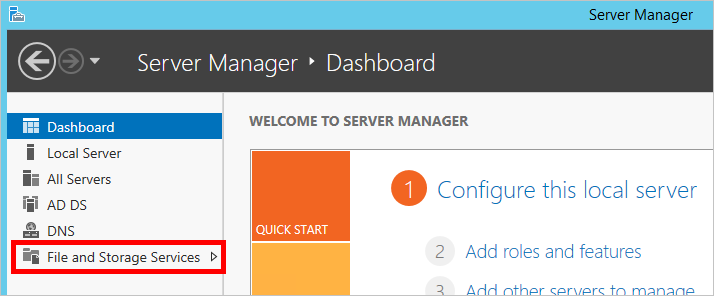

3. Wechseln Sie zur Registerkarte **Freigaben** . Klicken Sie dann auf **Aufgaben** > **Neue Freigabe...**

    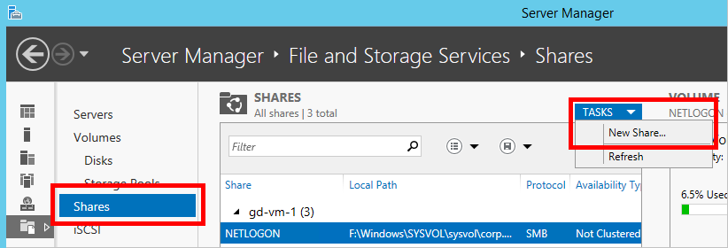

4. Schließen Sie den **Assistenten zum Freigeben** und Festlegen von Berechtigungen, um sicherzustellen, dass es aus Ihrer Benutzer für den Computer zugegriffen werden kann. [Weitere Informationen zu Freigaben.](https://technet.microsoft.com/library/cc753175.aspx)

5. Laden Sie das folgende Microsoft Windows Installer-Paket (MSI-Datei): [Access Systemsteuerung Extension.msi](https://account.activedirectory.windowsazure.com/Applications/Installers/x64/Access Panel Extension.msi)

6. Kopieren Sie das Installer-Paket an die gewünschte Position für die Freigabe ein.

    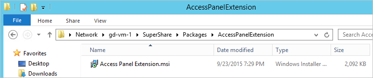

8. Stellen Sie sicher, dass Client-Computer die Freigabe das Installer-Paket zugreifen können. 

##Schritt 2: Erstellen des Gruppenrichtlinienobjekts

1. Melden Sie sich bei dem Server, der Ihrer Installation Active Directory-Domänendiensten (AD DS hostet).

2. Im Server-Manager, gehen Sie zu **Extras** > **Gruppenrichtlinien-Verwaltungskonsole**.

    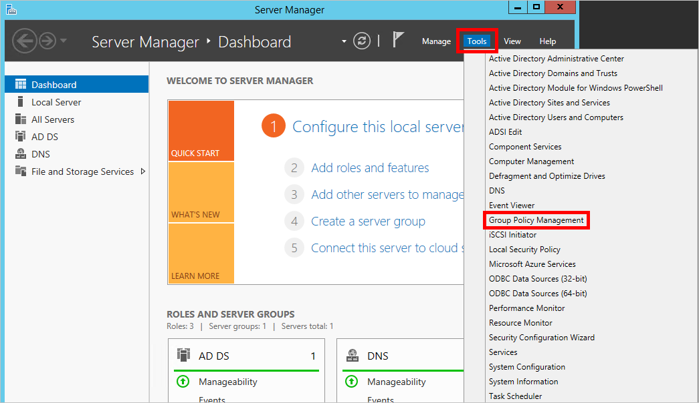

3. Klicken Sie im linken Bereich des Fensters **Gruppenrichtlinien-Verwaltungskonsole** zeigen Sie die Hierarchie Organisationseinheit (OU an), und bestimmen Sie, welche Gültigkeitsbereich Sie die Gruppenrichtlinien anwenden möchten. Beispielsweise Sie können entscheiden, wählen Sie eine kleine Organisationseinheit zu Testzwecken wenigen Benutzern bereitstellen, oder Sie möglicherweise eine Organisationseinheit auf oberster Ebene in der gesamten Organisation bereitgestellt auswählen.

    > [AZURE.NOTE] Wenn Sie möchten, erstellen oder Bearbeiten von Ihrer Organisationseinheiten, wechseln wieder in den Server-Manager und wechseln Sie zu **Tools** > **Active Directory-Benutzer und Computer**.

4. Nachdem Sie eine Organisationseinheit ausgewählt haben, mit der rechten Maustaste darauf, und wählen Sie **Erstellen Sie ein Gruppenrichtlinienobjekt in dieser Domäne, und verknüpfen Sie ihn hier...**

    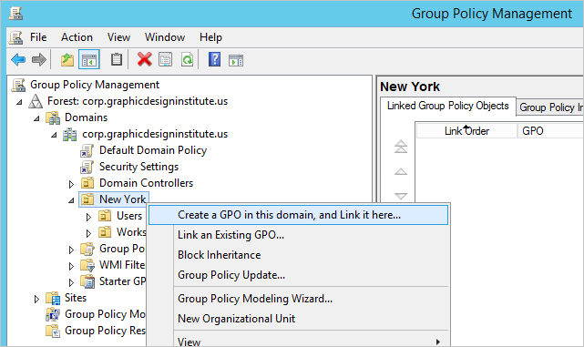

5. **Neues Gruppenrichtlinienobjekt** dazu aufgefordert werden Geben Sie einen Namen für das neue Gruppenrichtlinienobjekt.

    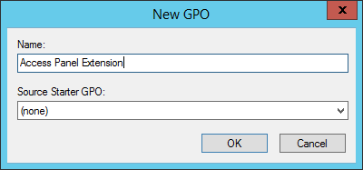

6. Mit der rechten Maustaste auf das Gruppenrichtlinienobjekt, die Sie soeben erstellt haben, und wählen Sie **Bearbeiten**aus.

    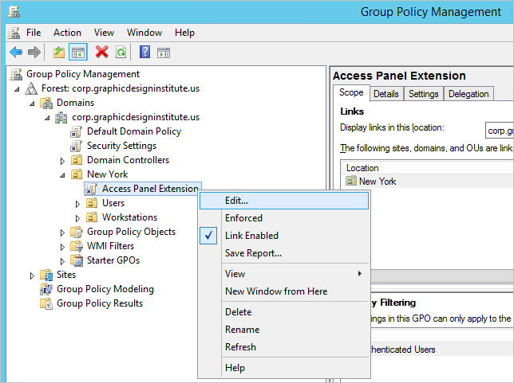

##Schritt 3: Zuweisen des Installationspakets

1. Bestimmen Sie, ob Sie die Erweiterung basierend auf dem **Computerkonfiguration** oder **Konfiguration für Benutzer**bereitstellen möchten. Bei der Verwendung von [Computerkonfiguration](https://technet.microsoft.com/library/cc736413%28v=ws.10%29.aspx)wird auf dem Computer, unabhängig davon, welche Benutzer melden Sie sich an die Erweiterung installiert. Andererseits, mit der [Konfiguration für Benutzer](https://technet.microsoft.com/library/cc781953%28v=ws.10%29.aspx)haben Benutzer die Erweiterung für diese unabhängig davon, welchen, denen Computern Anmeldung installiert.

2. Im linken Bereich des Fensters **Gruppenrichtlinien Management-Editor** wechseln Sie zu einem der folgenden Ordnerpfade, je nachdem, welchen Konfiguration Sie ausgewählt haben:
    - `Computer Configuration/Policies/Software Settings/`
    - `User Configuration/Policies/Software Settings/`

3. Mit der rechten Maustaste auf die **Installation der Software**, und wählen Sie dann **neu** > **Paket...**

    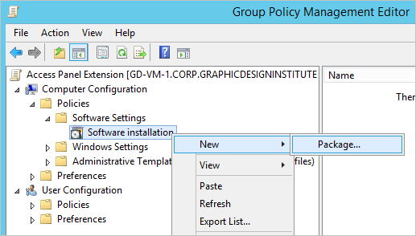

4. Klicken Sie auf den freigegebenen Ordner, die das Installer-Paket aus enthält [Schritt 1: Erstellen der Verteilung auf](#step-1-create-the-distribution-point), wählen Sie die MSI-Datei aus, und klicken Sie auf **Öffnen**.

    > [AZURE.IMPORTANT] Wenn die Freigabe auf diesem Server gespeichert ist, stellen Sie sicher, dass Sie die MSI-Datei über den lokalen Dateipfad, statt der Dateipfad Netzwerk zugreifen.

    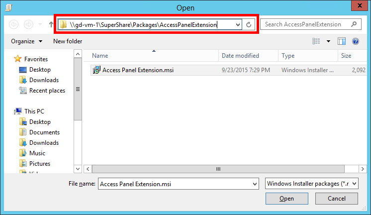

5. Wählen Sie in der entsprechenden Aufforderung **Software bereitstellen** **zugewiesen** für Ihre Bereitstellungsmethode aus. Klicken Sie dann auf **OK**.

    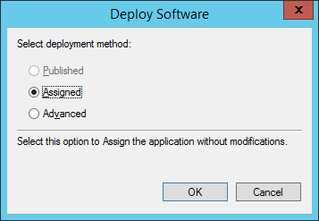

Die Erweiterung ist nun mit der Organisationseinheit bereitgestellt, die Sie ausgewählt haben. [Weitere Informationen zu Gruppenrichtlinie Software Installation.](https://technet.microsoft.com/library/cc738858%28v=ws.10%29.aspx)

##Schritt 4: Automatisch aktivieren die Erweiterung für InternetExplorer 

Zusätzlich zum Ausführen des Installationsprogramms, muss jeder Erweiterung für Internet Explorer explizit aktiviert sein, bevor er verwendet werden kann. Führen Sie die folgenden Schritte zur Erweiterung des Bereichs mit Gruppenrichtlinien aktivieren:

1. Im Fenster **Gruppenrichtlinien Management-Editor** , wechseln Sie zu einem der folgenden Pfade, je nachdem, welchen Konfiguration, die Sie in ignoriert [Schritt 3: Zuweisen des Installationspakets](#step-3-assign-the-installation-package):
    - `Computer Configuration/Policies/Administrative Templates/Windows Components/Internet Explorer/Security Features/Add-on Management`
    - `User Configuration/Policies/Administrative Templates/Windows Components/Internet Explorer/Security Features/Add-on Management`

2. Mit der rechten Maustaste auf das **Add-On-Liste**, und wählen Sie **Bearbeiten**aus.
    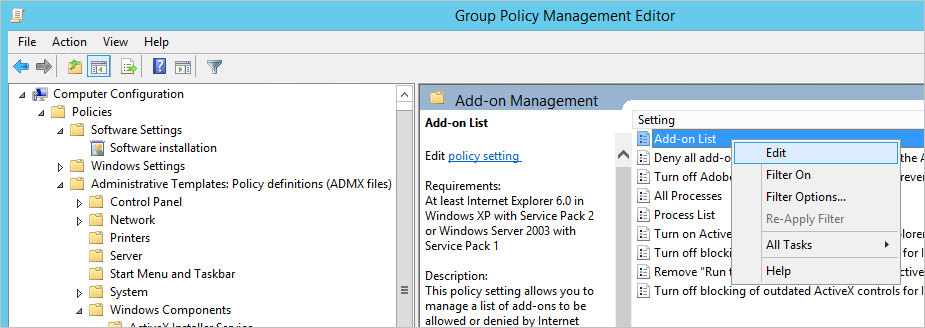

3. Wählen Sie im Fenster **Add-Ons Liste** **aktiviert**. Klicken Sie im Abschnitt **Optionen** klicken Sie dann auf **... anzeigen**.

    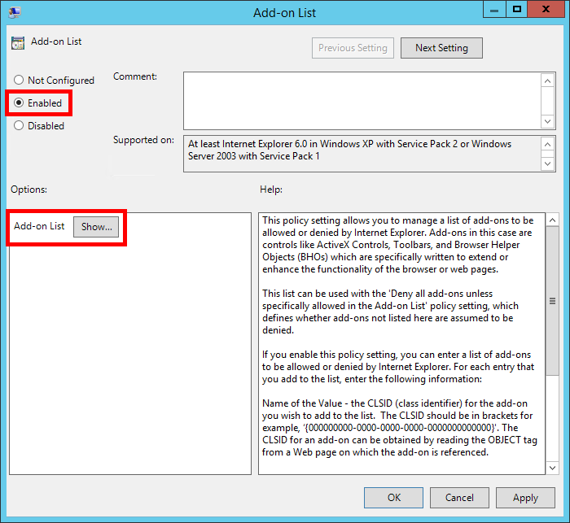

4. Führen Sie im Fenster **Inhalt anzeigen** die folgenden Schritte aus:

    1. Kopieren Sie und fügen Sie die folgenden Klassen-ID, für die erste Spalte (das Feld mit dem **Namen des Werts** ):`{030E9A3F-7B18-4122-9A60-B87235E4F59E}`

    2. Geben Sie in den folgenden Wert für die zweite Spalte (das Feld **Wert** ):`1`

    3. Klicken Sie auf **OK** , um das Fenster **Inhalt anzeigen** zu schließen.

    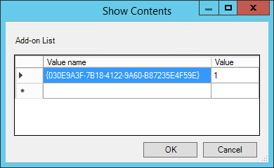

5. Klicken Sie auf **OK** , um Ihre Änderungen anzuwenden und schließen Sie das Fenster **Add-On-Liste aufgeführt** .

Die Erweiterung sollten nun für die Computer in der ausgewählten Organisationseinheit aktiviert sein. [Weitere Informationen zum Verwenden von Gruppenrichtlinien zum Aktivieren oder Deaktivieren von Internet Explorer-Add-Ons.](https://technet.microsoft.com/library/dn454941.aspx)

##Schritt 5 (Optional): Deaktivieren Sie die Aufforderung "Kennwort speichern"

Wenn Benutzer zu Websites mit der Erweiterung des Bedienfelds Anmeldung möglicherweise Internet Explorer anzeigen folgenden gefragt werden, "Sie Ihr Kennwort speichern möchten?"

Um zu verhindern, dass die Benutzer diese Aufforderung angezeigt werden soll, und folgen Sie den Schritten unten, um zu verhindern, dass der automatischen Vervollständigung von Eingabe von Kennwörtern:

1. Wechseln Sie im Fenster **Gruppenrichtlinien Management-Editor** auf den Pfad unten aufgeführten. Beachten Sie, dass diese Einstellung Konfiguration nur unter **Konfiguration für Benutzer**verfügbar ist.
    - `User Configuration/Policies/Administrative Templates/Windows Components/Internet Explorer/`

2. Suchen Sie die Einstellung mit dem Namen **der AutoVervollständigen - Funktion für Benutzernamen und Kennwörter für Formulare aktivieren**.

    > [AZURE.NOTE] Diese Einstellung mit dem Namen **AutoVervollständigen Speichern von Kennwörtern nicht zulassen**können frühere Versionen von Active Directory aufgeführt wird. Die Konfiguration für diese Einstellung unterscheidet sich von der Einstellung in diesem Lernprogramm beschrieben.

    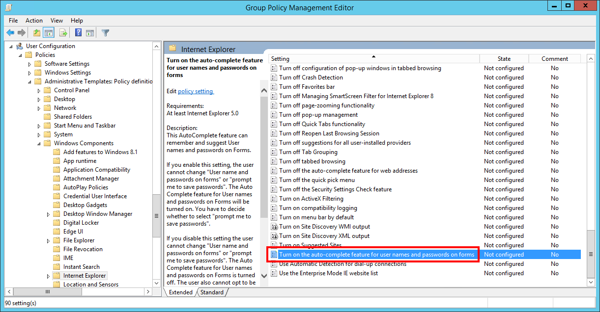

3. Klicken Sie mit der rechten Maustaste auf die oben genannte Einstellung, und wählen Sie **Bearbeiten**aus.

4. Wählen Sie im Fenster mit dem Titel, **Aktivieren Sie das AutoVervollständigen - Feature für Benutzernamen und Kennwörter in Formularen** **deaktiviert**.

    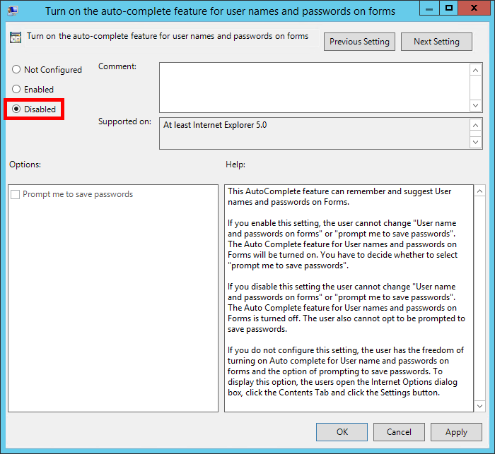

5. Klicken Sie auf **OK** , um diese Änderungen anwenden und schließen Sie das Fenster.

Benutzer werden nicht mehr speichern ihre Anmeldeinformationen oder AutoVervollständigen-Funktion verwenden, um zuvor gespeicherte Anmeldeinformationen zugreifen können. Dieser Richtlinie lässt Benutzer weiterhin verwenden von AutoVervollständigen für andere Typen von Formularfeldern, z. B. Felder für die Suche.

> [AZURE.WARNING] Wenn diese Richtlinie aktiviert ist, nachdem Benutzer ausgewählt haben, speichern einige Anmeldeinformationen, die dieser Richtlinie wird *nicht* deaktivieren Sie die Anmeldeinformationen, die bereits gespeichert wurden.

##Schritt 6: Testen der Bereitstellung

Gehen Sie folgendermaßen vor, um zu überprüfen, wenn die Erweiterung Bereitstellung erfolgreich war:

1. Wenn Sie mit der **Konfiguration der Computer**bereitgestellt haben, melden Sie sich in einem Clientcomputer, die mit der Organisationseinheit, die im ausgewählten gehört [Schritt2: Erstellen der Gruppenrichtlinienobjekt](#step-2-create-the-group-policy-object). Wenn Sie mit der **Konfiguration für Benutzer**bereitgestellt haben, stellen Sie sicher, als Benutzer anmelden, die an diese Organisationseinheit gehört.

2. Einige Zeichen ins für die Gruppenrichtlinien vollständig in verwandelt aktualisieren dauern mit diesem Computer. Um die Aktualisierung zu erzwingen, öffnen Sie **ein Eingabeaufforderungsfenster** , und führen Sie den folgenden Befehl aus:`gpupdate /force`

3. Sie müssen den Computer für die Installation erfolgen neu starten. Start kann wesentlich mehr Zeit als Deutsch, während die Erweiterung Installationen dauern.

4. Nach dem Neustart, öffnen Sie **Internet Explorer**. Klicken Sie auf der oberen rechten Ecke des Fensters klicken Sie auf **Extras** (Zahnradsymbol), und wählen Sie dann auf **Add-ons verwalten**.

    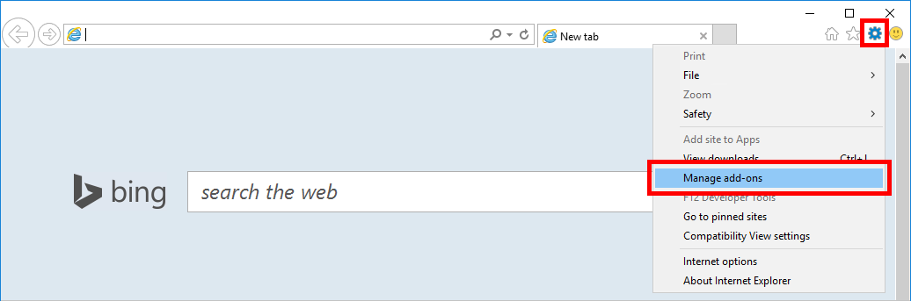

5. Stellen Sie sicher, dass die **Erweiterung des Bedienfelds** installiert wurde und deren **Status** auf **aktiviert**festgelegt wurde, klicken Sie im Fenster **Add-ons verwalten** .

    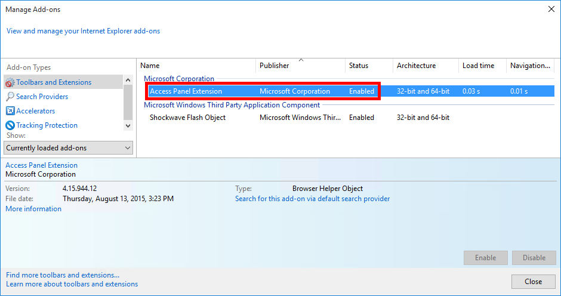

## Verwandte Artikel

- [Artikel Index für Anwendungsverwaltung in Azure-Active Directory](active-directory-apps-index.md)
- [Zugriff auf die Anwendung und einmaliges Anmelden mit Azure Active Directory](active-directory-appssoaccess-whatis.md)
- [Problembehandlung bei der Access-Systemsteuerung-Erweiterung für InternetExplorer](active-directory-saas-ie-troubleshooting.md)
