<properties
    pageTitle="Problembehandlung bei der Access-Systemsteuerung-Erweiterung für InternetExplorer | Microsoft Azure"
    description="Wie Gruppenrichtlinien mithilfe des Internet Explorer Add-Ons für das Portal meine Apps bereitstellen."
    services="active-directory"
    documentationCenter=""
    authors="MarkusVi"
    manager="femila"
    editor=""/>

<tags
    ms.service="active-directory"
    ms.devlang="na"
    ms.topic="article"
    ms.tgt_pltfrm="na"
    ms.workload="identity"
    ms.date="08/16/2016"
    ms.author="markvi"/>

#Problembehandlung bei der Access-Systemsteuerung-Erweiterung für InternetExplorer

In diesem Artikel werden die folgenden Probleme bei der Problembehandlung helfen:

- Sie sind nicht auf Ihre apps über das meine Apps-Portal zugreifen, während der Verwendung von Internet Explorer.
- Sie sehen die Meldung "Software installieren", obwohl Sie die Software bereits installiert haben.

Wenn Sie ein Administrator sind, siehe auch: [Gewusst wie: Bereitstellen der Access-Systemsteuerung-Erweiterung für Internet Explorer mithilfe von Gruppenrichtlinien](active-directory-saas-ie-group-policy.md)

##Führen Sie das Diagnosetool

Sie können Probleme bei der Installation mit der Access-Erweiterung Systemsteuerung durch Herunterladen und Ausführen das Access-Systemsteuerung Diagnosetool diagnostizieren:

1. [Klicken Sie hier, um das Diagnosetool herunterzuladen.](https://account.activedirectory.windowsazure.com/applications/AccessPanelExtensionDiagnosticTool/AccessPanelExtensionDiagnosticTool.zip)

2. Öffnen Sie die Datei, und drücken Sie die Schaltfläche **Alle extrahieren** .

    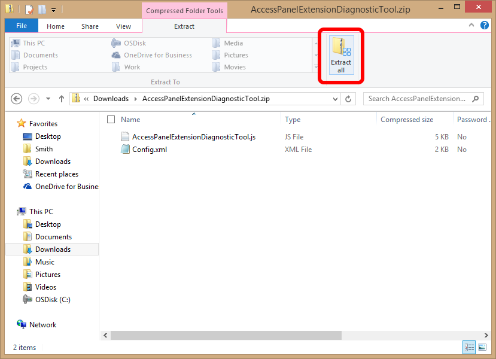

3. Drücken Sie dann die Schaltfläche **extrahieren** , um den Vorgang fortzusetzen.

    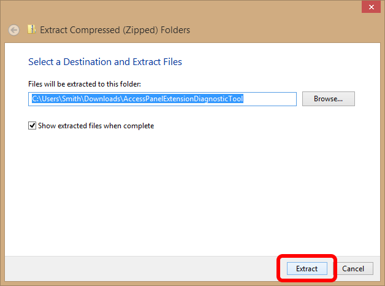

4. Zum Ausführen des Tools, mit der rechten Maustaste in der Datei mit dem Namen **AccessPanelExtensionDiagnosticTool**, und wählen Sie dann **mit öffnen > Microsoft Windows basierten Script Host**.

    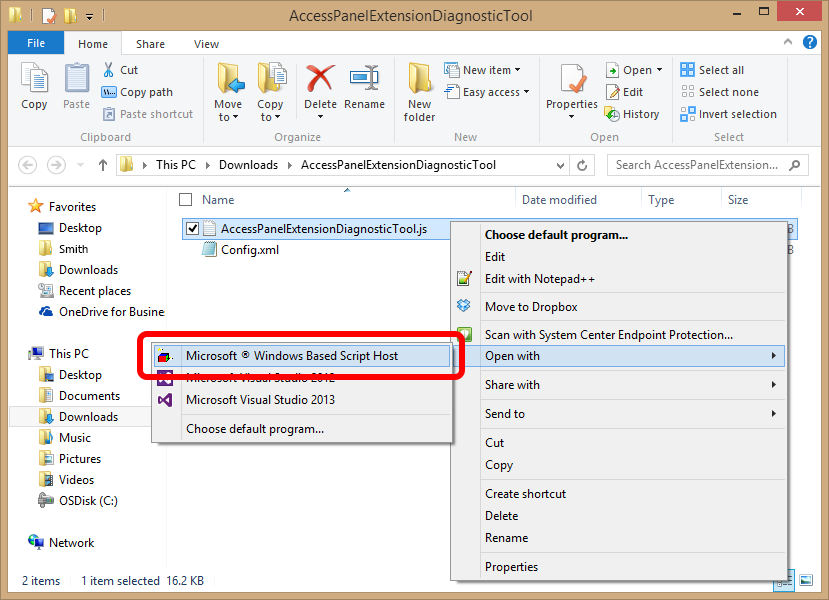

5. Das folgende diagnostische Fenster, wird das beschreibt, was möglicherweise Fehler bei der Installation dann angezeigt.

    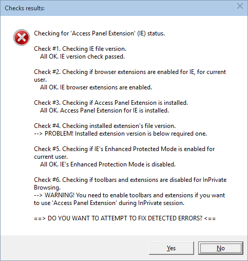

6. Klicken Sie auf "**Ja**", wenn Sie zulassen, dass das Programm die Probleme zu beheben, die gefunden wurden.

7. Um diese Änderungen zu speichern, schließen Sie alle Internet Explorer-Fenster, und öffnen Sie Internet Explorer erneut. Wenn Sie weiterhin Ihre apps zugreifen können, versuchen Sie die folgenden Schritte aus.

##Überprüfen Sie, dass die Erweiterung des Bedienfelds aktiviert ist

So überprüfen, dass die Erweiterung des Bereichs in Internet Explorer aktiviert ist:

1. Klicken Sie in Internet Explorer auf das **Zahnradsymbol** in der oberen rechten Ecke des Fensters. Wählen Sie dann **Internetoptionen**aus. (In älteren Versionen von Internet Explorer finden Sie diese unter **Extras > Internetoptionen**.

    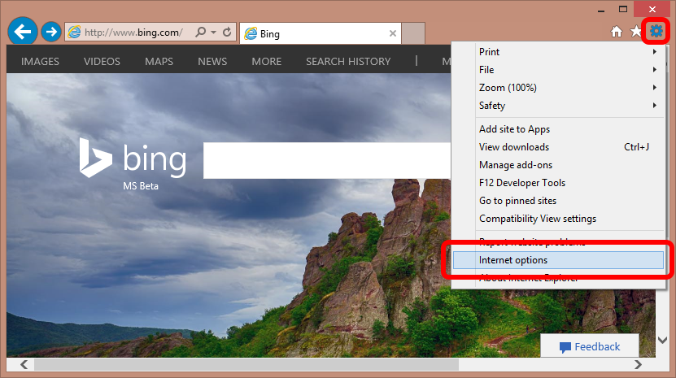

2. Klicken Sie auf die Registerkarte **Programme** , und klicken Sie auf die Schaltfläche **Add-ons verwalten** .

    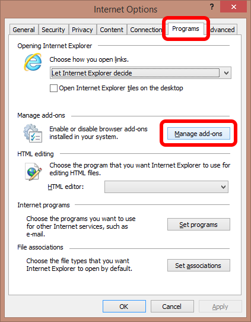

3. Wählen Sie in diesem Dialogfeld **Die Systemsteuerung Erweiterung Access** , und klicken Sie dann auf die Schaltfläche **Aktivieren** .

    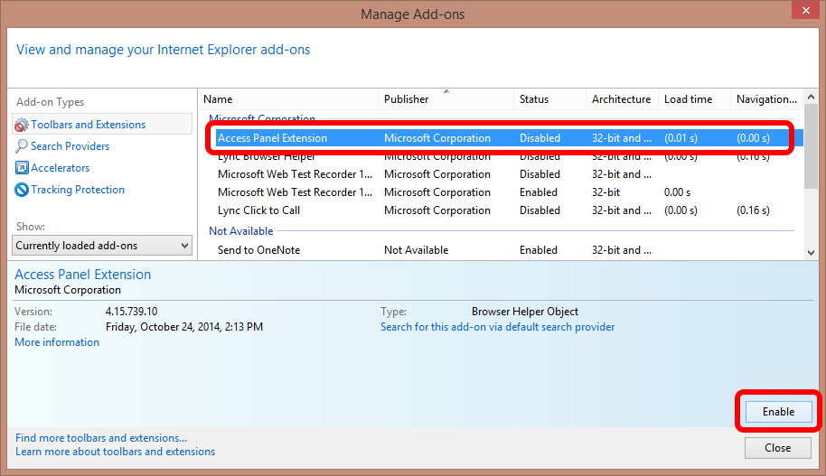

4. Um diese Änderungen zu speichern, schließen Sie alle Internet Explorer-Fenster, und öffnen Sie Internet Explorer erneut.

##Aktivieren Sie für den InPrivate-Browsermodus Erweiterungen

Wenn Sie den InPrivate-Browsermodus-Modus verwenden:

1. Klicken Sie in Internet Explorer auf das **Zahnradsymbol** in der oberen rechten Ecke des Fensters. Wählen Sie dann **Internetoptionen**aus. (In älteren Versionen von Internet Explorer finden Sie diese unter **Extras > Internetoptionen**.

    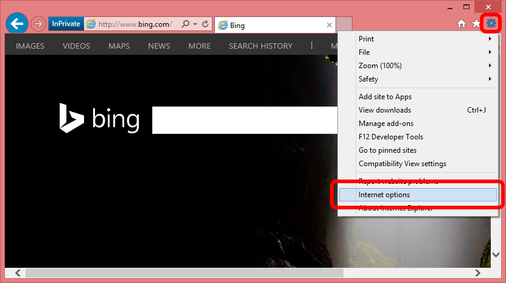

2. Wechseln Sie auf die Registerkarte **Datenschutz** , **Deaktivieren Sie** das Kontrollkästchen Beschriftung **Symbolleisten und Erweiterungen beim Start InPrivate-Browsermodus deaktivieren**

    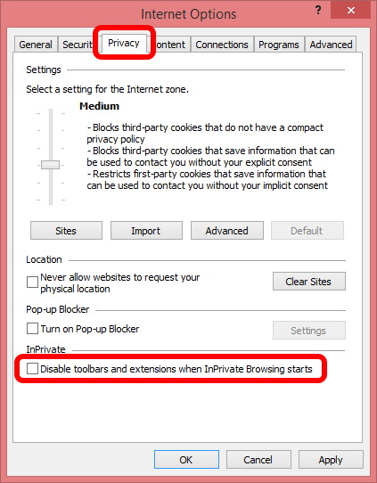

3. Um diese Änderungen zu speichern, schließen Sie alle Internet Explorer-Fenster, und öffnen Sie Internet Explorer erneut.

##Deinstallieren Sie die Access-Systemsteuerung-Erweiterung

So deinstallieren Sie die Access-Systemsteuerung Erweiterung von Ihrem computer

1. Drücken Sie auf der Tastatur die **Windows-Taste** , um das Startmenü aufzurufen. Wenn das Menü geöffnet ist, können Sie etwas zum Ausführen einer Suche eingeben. Geben Sie "Control Panel", und öffnen Sie die **Systemsteuerung** dann, wenn es in den Suchergebnissen angezeigt wird.

    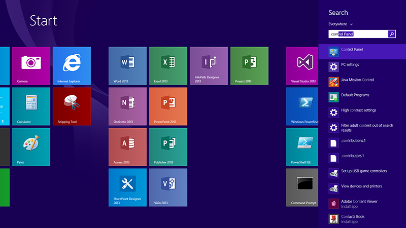

2. In der oberen rechten Ecke der Systemsteuerung ändern Sie die Option für die **Anzeige** auf **große Symbole**aus. Klicken Sie dann suchen Sie, und klicken Sie auf die Schaltfläche **Programme und Funktionen** .

    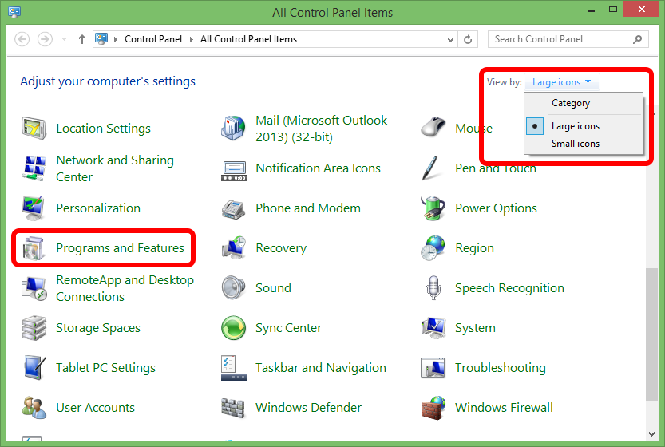

3. Wählen Sie aus der Liste aus **Access Systemsteuerung Erweiterung**, und klicken Sie auf die Schaltfläche **Deinstallieren** .

    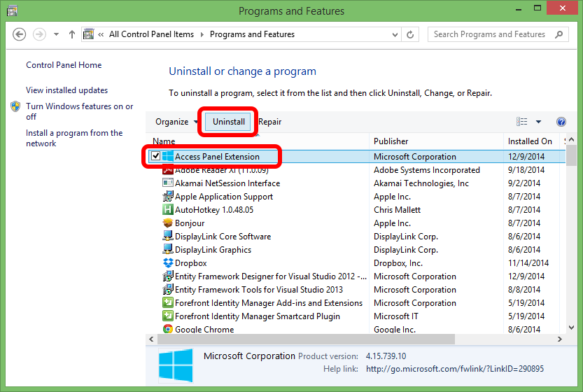

4. Sie können dann versuchen, installieren die Erweiterung erneut aus, um festzustellen, ob das Problem behoben wurde.

Wenn Sie die Erweiterung deinstallieren Probleme auftreten, können Sie es mit dem Tool [Microsoft beheben sie](https://go.microsoft.com/?linkid=9779673) auch entfernen.

## Verwandte Artikel

- [Artikel Index für Anwendungsverwaltung in Azure-Active Directory](active-directory-apps-index.md)
- [Zugriff auf die Anwendung und einmaliges Anmelden mit Azure Active Directory](active-directory-appssoaccess-whatis.md)
- [Wie Sie die Access-Systemsteuerung-Erweiterung für Internet Explorer mithilfe von Gruppenrichtlinien bereitstellen](active-directory-saas-ie-group-policy.md)
