<properties
    pageTitle="Lernprogramm: Azure-Active Directory-Integration in ImageRelay | Microsoft Azure"
    description="Informationen Sie zum einmaligen Anmeldens zwischen Azure Active Directory und ImageRelay konfigurieren."
    services="active-directory"
    documentationCenter=""
    authors="jeevansd"
    manager="femila"
    editor=""/>

<tags
    ms.service="active-directory"
    ms.workload="identity"
    ms.tgt_pltfrm="na"
    ms.devlang="na"
    ms.topic="article"
    ms.date="08/15/2016"
    ms.author="jeedes"/>

# Lernprogramm: Azure-Active Directory-Integration in ImageRelay

Ziel dieses Lernprogramms ist es zu zeigen, wie Sie ImageRelay mit Azure Active Directory (Azure AD) integrieren.  
Integration von ImageRelay mit Azure AD bietet Ihnen die folgenden Vorteile:

- Sie können in Azure AD steuern, die auf ImageRelay zugreifen
- Sie können Ihre Benutzer automatisch auf ImageRelay (einmaliges Anmelden) mit ihren Konten Azure AD-angemeldete abrufen aktivieren.
- Sie können Ihre Konten an einem zentralen Ort – im klassischen Azure-Portal verwalten.

Wenn Sie weitere Details zu SaaS app-Integration in Azure AD-wissen möchten, finden Sie unter [Was ist Zugriff auf die Anwendung und einmaliges Anmelden mit Azure Active Directory](active-directory-appssoaccess-whatis.md).

## Erforderliche Komponenten

Zum Konfigurieren von Azure AD-Integration mit ImageRelay, benötigen Sie die folgenden Elemente:

- Ein Azure AD-Abonnement
- Eine ImageRelay einmaliges Anmelden aktiviert Abonnement

> [AZURE.NOTE] Wenn Sie um die Schritte in diesem Lernprogramm zu testen, empfehlen wir nicht mit einer Umgebung für die Herstellung.

Führen Sie zum Testen der Schritte in diesem Lernprogramm Tips:

- Sie sollten Ihre Umgebung Herstellung nicht verwenden, es sei denn, dies erforderlich ist.
- Wenn Sie eine Testversion Azure AD-Umgebung besitzen, können Sie eine einen Monat zum Testen [hier](https://azure.microsoft.com/pricing/free-trial/)erhalten.

## Szenario Beschreibung
Ziel dieses Lernprogramms ist, sodass Sie in einer Umgebung für Azure AD-einmaligen Anmeldens testen können.  
In diesem Lernprogramm beschriebenen Szenario besteht aus zwei Hauptfenster Bausteine:

1. Hinzufügen von ImageRelay aus dem Katalog

2. Konfigurieren und Testen Azure AD einmaliges Anmelden

## Hinzufügen von ImageRelay aus dem Katalog
Um die Integration der ImageRelay in Azure AD zu konfigurieren, müssen Sie ImageRelay zu Ihrer Liste der verwalteten SaaS apps aus dem Katalog hinzuzufügen.

**Um ImageRelay aus dem Katalog hinzufügen möchten, führen Sie die folgenden Schritte aus:**

1. Klicken Sie im Azure klassischen-Portal auf der linken Navigationsbereich auf **Active Directory**. 

    ![Active Directory][1]

2. Wählen Sie aus der Liste **Verzeichnis** Verzeichnis für das Sie Verzeichnisintegration aktivieren möchten.

3. Klicken Sie zum Öffnen der Anwendungsansicht in der Verzeichnisansicht im oberen Menü auf **Applications** .

    ![Applikationen][2]

4. Klicken Sie auf **Hinzufügen** , am unteren Rand der Seite.

    ![Applikationen][3]

5. Klicken Sie im Dialogfeld **Was möchten Sie tun** klicken Sie auf **eine Anwendung aus dem Katalog hinzufügen**.

    ![Applikationen][4]

6. Geben Sie im Suchfeld **ImageRelay**ein.

    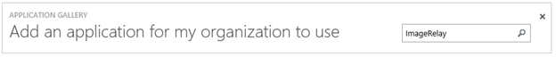

7. Wählen Sie im Ergebnisbereich **ImageRelay aus**, und klicken Sie dann auf **abgeschlossen** , um die Anwendung hinzugefügt haben.

    

##  Konfigurieren und Testen Azure AD einmaliges Anmelden
Das Ziel der in diesem Abschnitt ist erläutert, wie Sie konfigurieren und Testen der Azure AD-einmaliges Anmelden mit ImageRelay basierend auf einen Testbenutzer "Britta Simon" bezeichnet.

Für einmaliges Anmelden entwickelt benötigt Azure AD ein Benutzerkonto, das den zugehörigen Benutzer in ImageRelay darstellt.  Kurzum, muss eine Link Beziehung zwischen einem Azure AD-Benutzer und dem entsprechenden Benutzer in ImageRelay eingerichtet werden.  
Dieser Link Beziehung wird hergestellt, indem Sie den Wert des **Benutzernamens** in Azure AD als der Wert für den **Benutzernamen** in ImageRelay zuweisen.

Zum Konfigurieren und Azure AD-einmaliges Anmelden mit ImageRelay testen, müssen Sie die folgenden Bausteine durchführen:

1. **[Konfigurieren von Azure AD einmaligen Anmeldens](#configuring-azure-ad-single-single-sign-on)** - damit Ihre Benutzer dieses Feature verwenden können.
2. **[Erstellen einer Azure AD Benutzer testen](#creating-an-azure-ad-test-user)** : Azure AD-einmaliges Anmelden mit Britta Simon testen.
4. **[Erstellen einer ImageRelay Benutzer testen](#creating-a-userecho-test-user)** : ein Gegenstück von Britta Simon in ImageRelay haben, die in der Azure AD-Darstellung Ihrer verknüpft ist.
5. **[Testen Sie Benutzer zuweisen Azure AD](#assigning-the-azure-ad-test-user)** - Britta Simon mit Azure AD-einmaliges Anmelden aktivieren.
5. **[Testen der einmaligen Anmeldens](#testing-single-sign-on)** - zur Überprüfung, ob die Konfiguration funktioniert.

### Konfigurieren von Azure AD einmaliges Anmelden

Das Ziel der in diesem Abschnitt ist Azure AD-einmaliges Anmelden im klassischen Azure-Portal aktivieren und konfigurieren einmaliges Anmelden in Ihrer Anwendung ImageRelay.

**Führen Sie die folgenden Schritte aus, um Azure AD-einmaliges Anmelden mit ImageRelay konfigurieren:**

1. Im Azure klassischen-Portal auf der Seite **ImageRelay** Integration Anwendung klicken Sie auf **Konfigurieren einmaligen Anmeldens** zum Öffnen des Dialogfelds **Konfigurieren einmaliges Anmelden** .

     ![Konfigurieren Sie einmaliges Anmelden][6] 

2. Klicken Sie auf der Seite **Wie möchten Sie Benutzer bei der ImageRelay auf** **Azure AD einmaliges Anmelden**wählen Sie aus, und klicken Sie dann auf **Weiter**.

    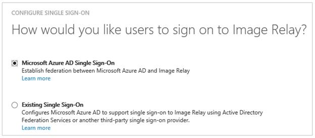 

3. Führen Sie auf der Seite Dialogfeld **Konfigurieren der App-Einstellungen** die folgenden Schritte aus:

     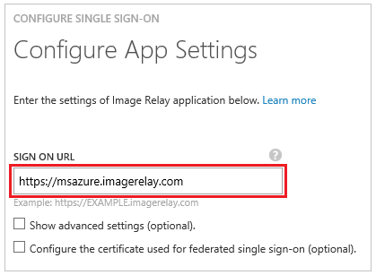 

    ein. Geben Sie in das Textfeld **Melden Sie sich auf URL** die URL, die von den Benutzern verwendet, um melden Sie sich an Ihrer Anwendung ImageRelay auf (zum Beispiel: *https://fabrikam.ImageRelay.com/*).

    b. Klicken Sie auf **Weiter**.

4. Klicken Sie auf der Seite **Konfigurieren einmaliges Anmelden bei ImageRelay** führen Sie die folgenden Schritte aus:

    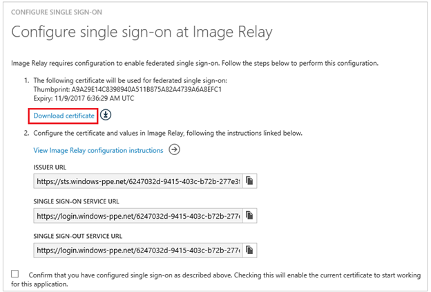 

    ein. Klicken Sie auf **Zertifikat herunterladen**, und speichern Sie die Datei auf Ihrem Computer.

    b. Klicken Sie auf **Weiter**.

5. Melden Sie in einem anderen Browserfenster sich bei der Website Ihres Unternehmens ImageRelay als Administrator.

1. Klicken Sie oben auf der Symbolleiste auf die Arbeitsbelastung **Benutzer und Berechtigungen** .

    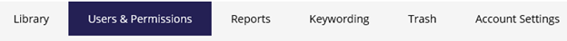 

1. Klicken Sie auf **neuen Berechtigungsstufe zu erstellen**.

    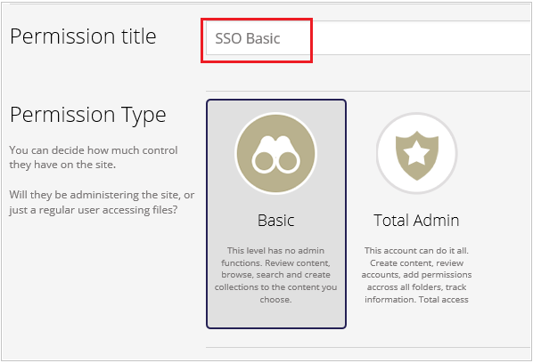 

1. Aktivieren Sie das Kontrollkästchen **dieser Gruppe können nur Anmeldung über Single Sign On** in die Arbeitsbelastung **Einzelnes Zeichen auf Einstellungen** , und klicken Sie dann auf **Speichern**.

    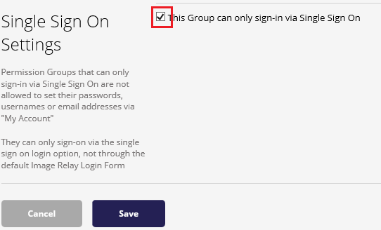 

1. Wechseln Sie zu **Kontoeinstellungen**.

    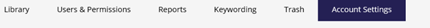 

1. Wechseln Sie zu der Arbeitsbelastung **Einzelnen melden Sie sich auf Einstellungen** .

    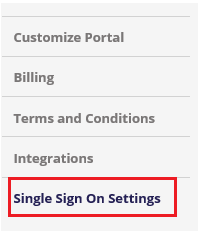

1. Klicken Sie im Dialogfeld **SAML-Einstellungen** führen Sie die folgenden Schritte aus:

    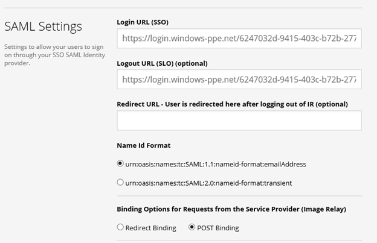

    ein. Im Portal Azure klassischen kopieren Sie die **Einzelnen anmelden Dienst-URL**, und fügen Sie ihn in das Textfeld **Anmelde-URL** .

    b. Im Portal Azure klassischen kopieren Sie die **Einzelnen Sign-Out Dienst-URL**, und fügen Sie ihn in das Textfeld **URL Abmelden** .

    c. Wählen Sie als **Id Namensformat**, **Urn: Oasis: Namen: Tc: SAML:1.1:nameid-Format: EmailAddress**.

    
    d. Wählen Sie als **Bindung Optionen für Anfragen der Dienstanbieter (Abbildung Relay)** **Bindung Beitrag**aus.
   

    e. Klicken Sie unter **x. 509-Zertifikat**klicken Sie auf **Aktualisieren**.

    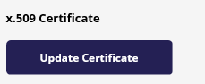

    f. Öffnen des heruntergeladenen Zertifikats in Editor, kopieren Sie den Inhalt aus, und fügen Sie ihn in das Textfeld x. 509-Zertifikat.
  
    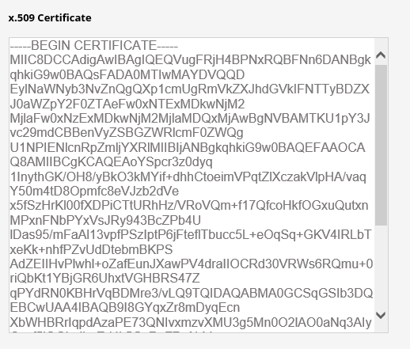

    g. Wählen Sie **Just-in-Time-Benutzer bereitgestellt** Abschnitt der **Aktivieren Just-in-Time-Benutzer bereitgestellt**.

    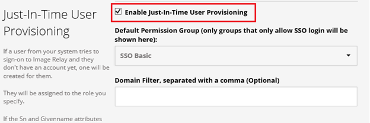

    h. Wählen Sie aus der Berechtigungsgruppe was zulässig ist nur durch einmaliges Anmelden (z. B. **Grundlegende SSO**).

    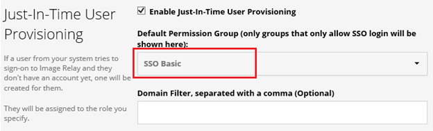

    Ich. Klicken Sie auf **Speichern**.

6. Im Portal Azure klassischen wählen Sie die Konfiguration für einzelne Zeichen Bestätigung, und klicken Sie dann auf **Weiter**.

    ![Azure AD einmaliges Anmelden][10]

7. Klicken Sie auf der Seite **Bestätigung für einzelne anmelden** auf **abgeschlossen**.

    ![Azure AD einmaliges Anmelden][11]

### Erstellen eines Benutzers mit Azure AD-testen
Das Ziel der in diesem Abschnitt besteht im Erstellen eines Testbenutzers aufgerufen Britta Simon im klassischen Azure-Portal.

![Erstellen von Azure AD-Benutzer][20]

**Führen Sie die folgenden Schritte aus, um einen Testbenutzer in Azure AD zu erstellen:**

1. Klicken Sie im **Azure klassischen Portal**auf der linken Navigationsbereich auf **Active Directory**.

     

2. Wählen Sie aus der Liste **Verzeichnis** Verzeichnis für das Sie Verzeichnisintegration aktivieren möchten.

3. Wenn die Liste der Benutzer, klicken Sie im Menü oben anzeigen möchten, klicken Sie auf **Benutzer**.

     

4. Klicken Sie im Dialogfeld **Benutzer hinzufügen** um in der Symbolleiste auf der Unterseite öffnen, auf **Benutzer hinzufügen**.

     

5. Führen Sie auf der Seite **Teilen Sie uns zu diesem Benutzer** die folgenden Schritte aus:

     

    ein. Wählen Sie als Typ des Benutzers neuen Benutzer in Ihrer Organisation ein.

    b. Geben Sie den Benutzernamen **Textfeld** **BrittaSimon**ein.

    c. Klicken Sie auf **Weiter**.

6.  Klicken Sie auf der Seite **Benutzerprofil** Dialogfeld führen Sie die folgenden Schritte aus:

     

    ein. Geben Sie im Textfeld **Vorname** **Britta**aus.  

    b. In das letzte Textfeld **Name** , Typ, **Simon**.

    c. Geben Sie im Textfeld **Anzeigename** **Britta Simon**aus.

    d. Wählen Sie in der Liste **Rolle** **Benutzer**aus.

    e. Klicken Sie auf **Weiter**.

7. Klicken Sie auf der Seite **erste temporäres Kennwort** auf **Erstellen**.

     

8. Klicken Sie auf der Seite **erste temporäres Kennwort** führen Sie die folgenden Schritte aus:

     

    ein. Notieren Sie den Wert für das **Neue Kennwort ein**.

    b. Klicken Sie auf **abgeschlossen**.   

### Erstellen eines Testbenutzers ImageRelay

Das Ziel der in diesem Abschnitt ist zum Erstellen eines Benutzers Britta Simon in ImageRelay bezeichnet.

**Führen Sie die folgenden Schritte aus, um einen Benutzer namens Britta Simon in ImageRelay zu erstellen:**

1. Melden Sie sich für den Zugriff auf Ihre ImageRelay Firmenwebsite als Administrator.

1. Wechseln Sie zu **Benutzer und Berechtigungen** , und wählen Sie **SSO-Benutzer erstellen**.

    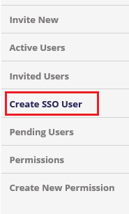 

1. Geben Sie die **E-Mail**, **Vorname**, **Nachname** und **Unternehmen** des Benutzers bereitstellen, und wählen Sie die Berechtigungsgruppe also, die nur durch einmaliges, in anmelden können der Gruppe (z. B. SSO grundlegende) werden soll.

    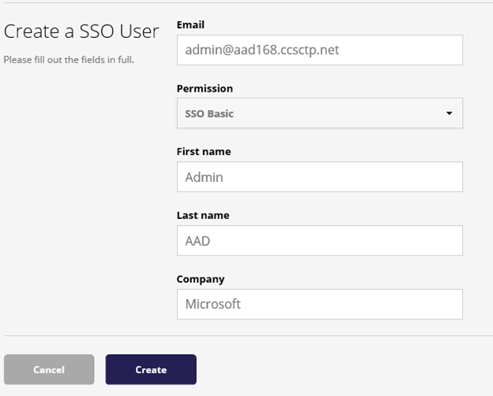 

1. Klicken Sie auf **Erstellen**.

### Zuweisen des Azure AD-Test-Benutzers

Das Ziel der in diesem Abschnitt ist für die Aktivierung der Britta Simon Azure einmaliges Anmelden verwenden, indem Sie keinen Zugriff auf ImageRelay erteilen.

![Benutzer zuweisen][200] 

**Um Britta Simon ImageRelay zuzuweisen, führen Sie die folgenden Schritte aus:**

1. Im Portal Azure klassischen zum Öffnen der Anwendungsansicht in der Verzeichnisansicht klicken Sie auf **Applikationen** im oberen Menü.

    ![Benutzer zuweisen][201] 

2. Wählen Sie in der Liste Applications **ImageRelay**.

    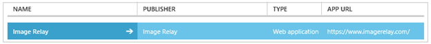 

1. Klicken Sie auf **Benutzer**, klicken Sie im Menü oben.

    ![Benutzer zuweisen][203] 

1. Wählen Sie in der Liste Benutzer **Britta Simon**aus.

2. Klicken Sie unten auf der Symbolleiste auf **zuweisen**.

    ![Benutzer zuweisen][205]

### Testen einmaliges Anmelden

Das Ziel der in diesem Abschnitt ist zum Azure AD-einzelne anmelden Überprüfen der Konfiguration mithilfe des Bedienfelds Access.  
Wenn Sie die Kachel ImageRelay im Bereich Access klicken, Sie sollten automatisch an Ihrer Anwendung ImageRelay angemeldete abrufen.

## Zusätzliche Ressourcen

* [Liste der zum Integrieren SaaS-Apps mit Azure-Active Directory-Lernprogramme](active-directory-saas-tutorial-list.md)
* [Was ist die Anwendungszugriff und einmaliges Anmelden mit Azure Active Directory?](active-directory-appssoaccess-whatis.md)

<!--Image references-->

[1]: ./media/active-directory-saas-imagerelay-tutorial/tutorial_general_01.png
[2]: ./media/active-directory-saas-imagerelay-tutorial/tutorial_general_02.png
[3]: ./media/active-directory-saas-imagerelay-tutorial/tutorial_general_03.png
[4]: ./media/active-directory-saas-imagerelay-tutorial/tutorial_general_04.png

[6]: ./media/active-directory-saas-imagerelay-tutorial/tutorial_general_05.png
[10]: ./media/active-directory-saas-imagerelay-tutorial/tutorial_general_06.png
[11]: ./media/active-directory-saas-imagerelay-tutorial/tutorial_general_07.png
[20]: ./media/active-directory-saas-imagerelay-tutorial/tutorial_general_100.png

[200]: ./media/active-directory-saas-imagerelay-tutorial/tutorial_general_200.png
[201]: ./media/active-directory-saas-imagerelay-tutorial/tutorial_general_201.png
[203]: ./media/active-directory-saas-imagerelay-tutorial/tutorial_general_203.png
[204]: ./media/active-directory-saas-imagerelay-tutorial/tutorial_general_204.png
[205]: ./media/active-directory-saas-imagerelay-tutorial/tutorial_general_205.png
