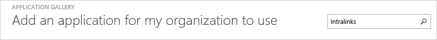
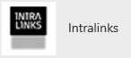
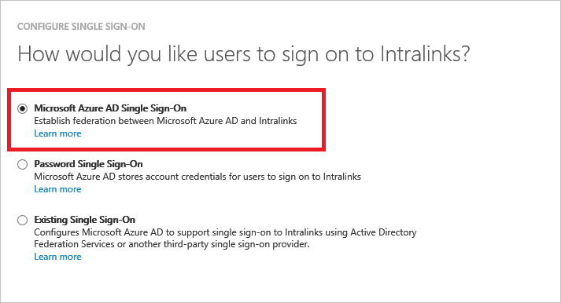
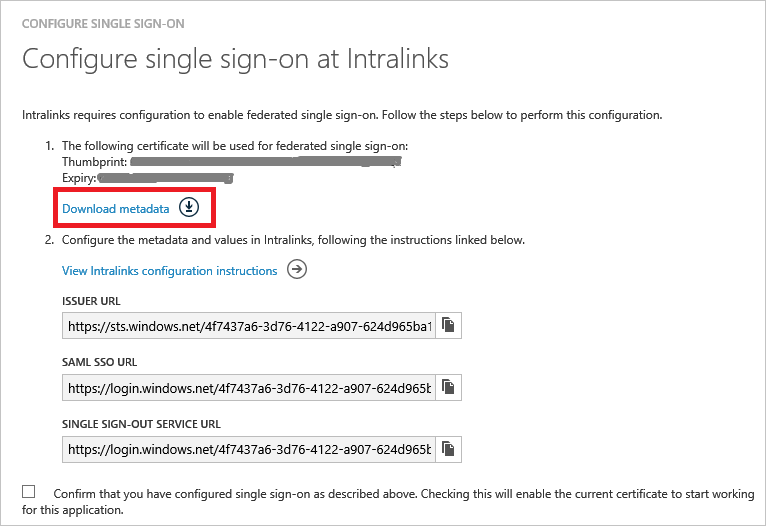
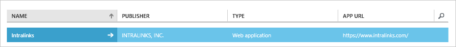
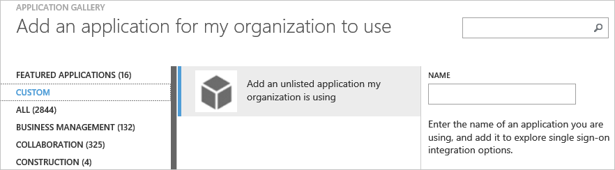
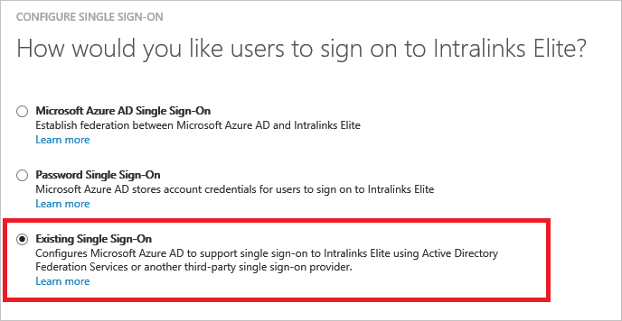
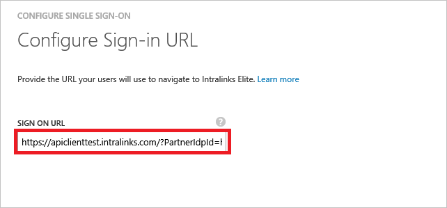

<properties
    pageTitle="Lernprogramm: Azure-Active Directory-Integration in Intralinks | Microsoft Azure"
    description="Informationen Sie zum einmaligen Anmeldens zwischen Azure Active Directory und Intralinks konfigurieren."
    services="active-directory"
    documentationCenter=""
    authors="jeevansd"
    manager="femila"
    editor=""/>

<tags
    ms.service="active-directory"
    ms.workload="identity"
    ms.tgt_pltfrm="na"
    ms.devlang="na"
    ms.topic="article"
    ms.date="09/29/2016"
    ms.author="jeedes"/>

# Lernprogramm: Azure-Active Directory-Integration in Intralinks

In diesem Lernprogramm erfahren Sie, wie Intralinks mit Azure Active Directory (Azure AD) integriert werden soll.

Integration von Intralinks mit Azure AD bietet Ihnen die folgenden Vorteile:

- Sie können in Azure AD steuern, die auf Intralinks zugreifen
- Sie können Ihre Benutzer automatisch auf Intralinks (einmaliges Anmelden) mit ihren Konten Azure AD-angemeldete abrufen aktivieren.
- Sie können Ihre Konten an einem zentralen Ort – im klassischen Azure-Portal verwalten.

Wenn Sie weitere Details zu SaaS app-Integration in Azure AD-wissen möchten, finden Sie unter [Was ist Zugriff auf die Anwendung und einmaliges Anmelden mit Azure Active Directory](active-directory-appssoaccess-whatis.md).

## Erforderliche Komponenten

Zum Konfigurieren von Azure AD-Integration mit Intralinks, benötigen Sie die folgenden Elemente:

- Ein Azure AD-Abonnement
- Eine Intralinks einmaligen Anmeldung aktiviert Abonnement

> [AZURE.NOTE] Wenn Sie um die Schritte in diesem Lernprogramm zu testen, empfehlen wir nicht mit einer Umgebung für die Herstellung.

Führen Sie zum Testen der Schritte in diesem Lernprogramm Tips:

- Sie sollten Ihre Umgebung Herstellung nicht verwenden, es sei denn, dies erforderlich ist.
- Wenn Sie eine Testversion Azure AD-Umgebung besitzen, können Sie eine einen Monat zum Testen [hier](https://azure.microsoft.com/pricing/free-trial/)erhalten.

## Szenario Beschreibung
In diesem Lernprogramm testen Sie Azure AD-einmaliges Anmelden in einer testumgebung.

In diesem Lernprogramm beschriebenen Szenario besteht aus zwei Hauptfenster Bausteine:

1. Hinzufügen von Intralinks aus dem Katalog
2. Konfigurieren und Testen Azure AD einmaliges Anmelden

## Hinzufügen von Intralinks aus dem Katalog
Um die Integration der Intralinks in Azure AD zu konfigurieren, müssen Sie Intralinks zu Ihrer Liste der verwalteten SaaS apps aus dem Katalog hinzuzufügen.

**Um Intralinks aus dem Katalog hinzufügen möchten, führen Sie die folgenden Schritte aus:**

1. Klicken Sie im **Azure klassischen Portal**auf der linken Navigationsbereich auf **Active Directory**.

    ![Active Directory][1]

2. Wählen Sie aus der Liste **Verzeichnis** Verzeichnis für das Sie Verzeichnisintegration aktivieren möchten.

3. Klicken Sie zum Öffnen der Anwendungsansicht in der Verzeichnisansicht im oberen Menü auf **Applications** .

    ![Applikationen][2]

4. Klicken Sie auf **Hinzufügen** , am unteren Rand der Seite.

    ![Applikationen][3]

5. Klicken Sie im Dialogfeld **Was möchten Sie tun** klicken Sie auf **eine Anwendung aus dem Katalog hinzufügen**.

    ![Applikationen][4]

6. Geben Sie im Suchfeld **Intralinks**ein.

    

7. Wählen Sie im Ergebnisbereich **Intralinks aus**, und klicken Sie dann auf **abgeschlossen** , um die Anwendung hinzugefügt haben.

    

##  Konfigurieren und Testen Azure AD einmaliges Anmelden

In diesem Abschnitt Konfigurieren und Testen Azure AD-einmaliges Anmelden mit Intralinks basierend auf einen Testbenutzer "Britta Simon" bezeichnet.

Für einmaliges Anmelden entwickelt muss Azure AD kennen, kann der Benutzer Gegenstück Intralinks einem Benutzer in Azure AD. Kurzum, muss eine Link Beziehung zwischen einem Azure AD-Benutzer und dem entsprechenden Benutzer in Intralinks eingerichtet werden.

Dieser Link Beziehung wird hergestellt, indem Sie den Wert des **Benutzernamens** in Azure AD als der Wert für den **Benutzernamen** in Intralinks zuweisen.

Zum Konfigurieren und Azure AD-einmaliges Anmelden mit Intralinks testen, müssen Sie die folgenden Bausteine durchführen:

1. **[Konfigurieren von Azure AD einmaligen Anmeldens](#configuring-azure-ad-single-sign-on)** - damit Ihre Benutzer dieses Feature verwenden können.
2. **[Erstellen einer Azure AD Benutzer testen](#creating-an-azure-ad-test-user)** : Azure AD-einmaliges Anmelden mit Britta Simon testen.
4. **[Erstellen einer Intralinks Benutzer testen](#creating-an-intralinks-test-user)** : ein Gegenstück von Britta Simon in Intralinks haben, die in der Azure AD-Darstellung Ihrer verknüpft ist.
5. **[Testen Sie Benutzer zuweisen Azure AD](#assigning-the-azure-ad-test-user)** - Britta Simon mit Azure AD-einmaliges Anmelden aktivieren.
5. **[Testen der einmaligen Anmeldens](#testing-single-sign-on)** - zur Überprüfung, ob die Konfiguration funktioniert.

### Konfigurieren von Azure AD einmaliges Anmelden

In diesem Abschnitt Azure AD-einmaliges Anmelden im klassischen Portal aktivieren und konfigurieren in Ihrer Anwendung Intralinks einmaliges Anmelden.

**Führen Sie die folgenden Schritte aus, um Azure AD-einmaliges Anmelden mit Intralinks konfigurieren:**

1. Im Portal klassischen auf der Seite **Intralinks** Integration Anwendung klicken Sie auf **Konfigurieren einmaligen Anmeldens** zum Öffnen des Dialogfelds **Konfigurieren einmaliges Anmelden** .
     
    ![Konfigurieren Sie einmaliges Anmelden][6] 

2. Klicken Sie auf der Seite **Wie möchten Sie Benutzer bei der Intralinks auf** **Azure AD einmaliges Anmelden**wählen Sie aus, und klicken Sie dann auf **Weiter**.

     

3. Führen Sie auf der Seite **Einstellungen für die App konfigurieren** Dialogfeld die folgenden Schritte aus:.

     

    ein. Geben Sie in das Textfeld **Melden Sie sich auf URL** die URL Ihrer Benutzer melden Sie sich für den Zugriff auf Ihre Intralinks-Anwendung unter Verwendung des folgenden Musters untersuchten: **https://\<Firmennamen\>.Intralinks.com/?PartnerIdpId= https://sts.windows.net/\<Azure AD-Mandanten-ID\>**.

    b. Klicken Sie auf **Weiter**.
    
4. Klicken Sie auf der Seite **Konfigurieren einmaliges Anmelden bei Intralinks** führen Sie die folgenden Schritte aus:

    

    ein. Klicken Sie auf **Herunterladen von Metadaten**aus, und speichern Sie die Datei auf Ihrem Computer.

    b. Klicken Sie auf **Weiter**.

5. Um für die Anwendung konfigurierten SSO zu erhalten, wenden Sie sich an Intralinks Supportteam und per e-Mail senden Sie die heruntergeladene Metadaten-Datei anfügen.

6. Im Portal klassischen wählen Sie die Bestätigung Konfiguration für einzelne Zeichen, und klicken Sie dann auf **Weiter**.
    
    ![Azure AD einmaliges Anmelden][10]

7. Klicken Sie auf der Seite **Bestätigung für einzelne anmelden** auf **abgeschlossen**.  
 
    ![Azure AD einmaliges Anmelden][11]

### Erstellen eines Benutzers mit Azure AD-testen
In diesem Abschnitt erstellen Sie einen Testbenutzer im klassischen Portal Britta Simon bezeichnet.

Wählen Sie in der Liste Benutzer **Britta Simon**aus.

![Erstellen von Azure AD-Benutzer][20]

**Führen Sie die folgenden Schritte aus, um einen Testbenutzer in Azure AD zu erstellen:**

1. Klicken Sie im **Azure klassischen Portal**auf der linken Navigationsbereich auf **Active Directory**.

     

2. Wählen Sie aus der Liste **Verzeichnis** Verzeichnis für das Sie Verzeichnisintegration aktivieren möchten.

3. Wenn die Liste der Benutzer, klicken Sie im Menü oben anzeigen möchten, klicken Sie auf **Benutzer**.

     

4. Klicken Sie im Dialogfeld **Benutzer hinzufügen** um in der Symbolleiste auf der Unterseite öffnen, auf **Benutzer hinzufügen**.

     

5. Führen Sie auf der Seite **Teilen Sie uns zu diesem Benutzer** die folgenden Schritte aus:   

    ein. Wählen Sie als Typ des Benutzers neuen Benutzer in Ihrer Organisation ein.

    b. Geben Sie den Benutzernamen **Textfeld** **BrittaSimon**ein.

    c. Klicken Sie auf **Weiter**.

6.  Klicken Sie auf der Seite **Benutzerprofil** -Dialogfeld führen Sie die folgenden Schritte aus:  

    ein. Geben Sie im Textfeld **Vorname** **Britta**aus.  

    b. In das letzte Textfeld **Name** , Typ, **Simon**.

    c. Geben Sie im Textfeld **Anzeigename** **Britta Simon**aus.

    d. Wählen Sie in der Liste **Rolle** **Benutzer**aus.

    e. Klicken Sie auf **Weiter**.

7. Klicken Sie auf der Seite **erste temporäres Kennwort** auf **Erstellen**.

     

8. Klicken Sie auf der Seite **erste temporäres Kennwort** führen Sie die folgenden Schritte aus:

     

    ein. Notieren Sie den Wert für das **Neue Kennwort ein**.

    b. Klicken Sie auf **abgeschlossen**.   

### Erstellen eines Benutzers mit Intralinks testen

In diesem Abschnitt erstellen Sie einen Benutzer namens Britta Simon in Intralinks. Arbeiten Sie mit Intralinks Supportteam Benutzer in der Intralinks-Plattform hinzufügen.

### Zuweisen des Azure AD-Test-Benutzers

In diesem Abschnitt aktivieren Sie Britta Simon Azure einmaliges Anmelden verwenden, indem Sie keinen Zugriff auf Intralinks erteilen.

![Benutzer zuweisen][200] 

**Um Britta Simon Intralinks zuzuweisen, führen Sie die folgenden Schritte aus:**

1. Klicken Sie im Portal klassischen zum Öffnen der Anwendungsansicht in der Verzeichnisansicht klicken Sie auf **Applikationen** im oberen Menü.

    ![Benutzer zuweisen][201] 

2. Wählen Sie in der Liste Applications **Intralinks**.

     

3. Klicken Sie auf **Benutzer**, klicken Sie im Menü oben.

    ![Benutzer zuweisen][203]

4. Wählen Sie in der Liste Benutzer **Britta Simon**aus.

5. Klicken Sie unten auf der Symbolleiste auf **zuweisen**.

    ![Benutzer zuweisen][205]

### Hinzufügen von Intralinks per oder Elite-Anwendung
Intralinks verwendet die gleiche einzelne melden Sie sich auf Identität Plattform für alle anderen ausschließen Geschäft Nexus Anwendung Intralinks-Programme. Wenn Sie beabsichtigen, verwenden Sie eine andere Intralinks Anwendung dann zunächst Sie haben so konfigurieren Sie die Single Sign On für einen primären Intralinks-Anwendung, die mit den oben beschriebenen Verfahren.

Anschließend führen Sie die unter Verfahren zu einer anderen Anwendung von Intralinks in Ihrem Mandanten hinzufügen, die diese primäre Anwendung für einmaliges Anmelden nutzen können. 

> [AZURE.NOTE] Bitte beachten Sie, dass dieses Feature nur für Azure AD Premium SKU Kunden verfügbar, kostenlos nicht verfügbar ist oder grundlegende SKU Kunden.

1. Klicken Sie im **Azure klassischen Portal**auf der linken Navigationsbereich auf **Active Directory**.

    ![Active Directory][1]
2. Wählen Sie aus der Liste **Verzeichnis** Verzeichnis für das Sie Verzeichnisintegration aktivieren möchten.

3. Klicken Sie zum Öffnen der Anwendungsansicht in der Verzeichnisansicht im oberen Menü auf **Applications** .

    ![Applikationen][2]

4. Klicken Sie auf **Hinzufügen** , am unteren Rand der Seite.

    ![Applikationen][3]

5. Klicken Sie im Dialogfeld **Was möchten Sie tun** klicken Sie auf **eine Anwendung aus dem Katalog hinzufügen**.

    ![Applikationen][4]

6. Klicken Sie im Tabstopp links auf der Registerkarte **Benutzerdefiniert**

    

7. Geben Sie geeigneten Namen für die Anwendung z. B. **Intralinks Elite** , und klicken Sie auf Fertig stellen, Schaltfläche.

8. Klicken Sie auf die Schaltfläche **Single Sign konfigurieren**

9. Wählen Sie die Option **Vorhandene Single Sign On**

    

10. Abrufen der SP initiiert SSO-URL aus Intralinks Teamwebsite für die anderen Intralinks-Anwendung, und geben Sie es ein, wie unten dargestellt. 

    

    ein. Geben Sie in das Textfeld melden Sie sich auf URL die URL Ihrer Benutzer melden Sie sich für den Zugriff auf Ihre Intralinks-Anwendung unter Verwendung des folgenden Musters untersuchten: **https://\<Firmenname\>.Intralinks.com/?PartnerIdpId= https://sts.windows.net/\<AzureADTenantID\> **

11. Klicken Sie auf **Weiter**.

12. Weisen Sie die Anwendung an Benutzer oder Gruppen aus, wie im Abschnitt ** [zuweisen den Testbenutzer Azure AD-](#assigning-the-azure-ad-test-user) dargestellt**

### Testen einmaliges Anmelden

In diesem Abschnitt Testen Sie Ihre Azure AD-einzelne anmelden Konfiguration mit der Access-Systemsteuerung.

Wenn Sie die Kachel Intralinks im Bereich Access klicken, Sie sollten automatisch an Ihrer Anwendung Intralinks angemeldete abrufen.

## Zusätzliche Ressourcen

* [Liste der zum Integrieren SaaS-Apps mit Azure-Active Directory-Lernprogramme](active-directory-saas-tutorial-list.md)
* [Was ist die Anwendungszugriff und einmaliges Anmelden mit Azure Active Directory?](active-directory-appssoaccess-whatis.md)

<!--Image references-->

[1]: ./media/active-directory-saas-intralinks-tutorial/tutorial_general_01.png
[2]: ./media/active-directory-saas-intralinks-tutorial/tutorial_general_02.png
[3]: ./media/active-directory-saas-intralinks-tutorial/tutorial_general_03.png
[4]: ./media/active-directory-saas-intralinks-tutorial/tutorial_general_04.png

[6]: ./media/active-directory-saas-intralinks-tutorial/tutorial_general_05.png
[10]: ./media/active-directory-saas-intralinks-tutorial/tutorial_general_06.png
[11]: ./media/active-directory-saas-intralinks-tutorial/tutorial_general_07.png
[20]: ./media/active-directory-saas-intralinks-tutorial/tutorial_general_100.png

[200]: ./media/active-directory-saas-intralinks-tutorial/tutorial_general_200.png
[201]: ./media/active-directory-saas-intralinks-tutorial/tutorial_general_201.png
[203]: ./media/active-directory-saas-intralinks-tutorial/tutorial_general_203.png
[204]: ./media/active-directory-saas-intralinks-tutorial/tutorial_general_204.png
[205]: ./media/active-directory-saas-intralinks-tutorial/tutorial_general_205.png
