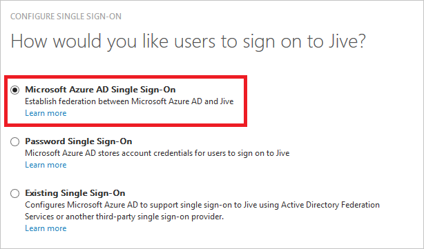
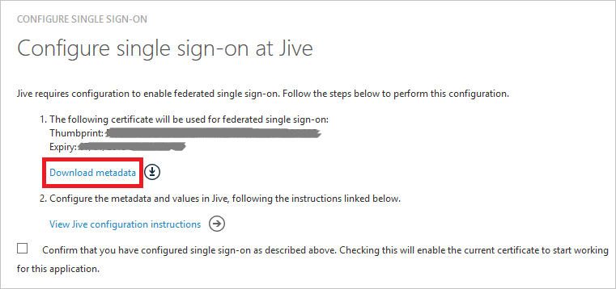
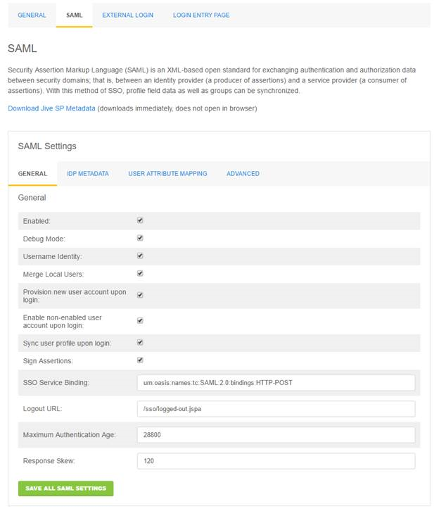
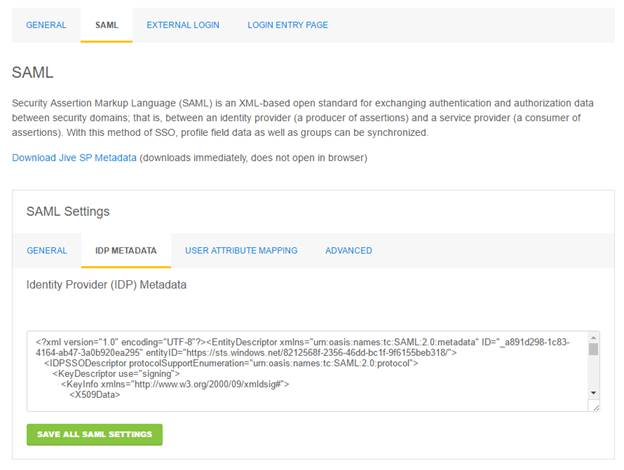
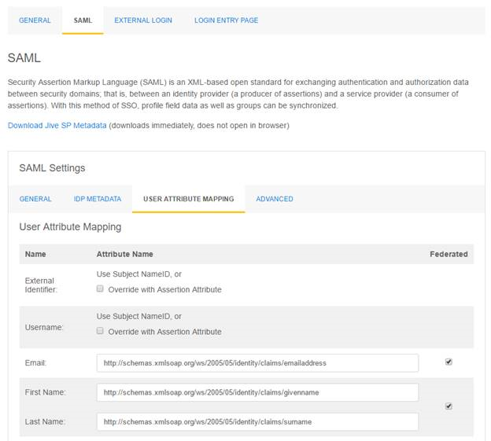

<properties
    pageTitle="Lernprogramm: Azure-Active Directory-Integration in Jive | Microsoft Azure"
    description="Informationen Sie zum einmaligen Anmeldens zwischen Azure Active Directory und Jive konfigurieren."
    services="active-directory"
    documentationCenter=""
    authors="jeevansd"
    manager="femila"
    editor=""/>

<tags
    ms.service="active-directory"
    ms.workload="identity"
    ms.tgt_pltfrm="na"
    ms.devlang="na"
    ms.topic="article"
    ms.date="09/01/2016"
    ms.author="jeedes"/>

# Lernprogramm: Azure-Active Directory-Integration in Jive

In diesem Lernprogramm erfahren Sie, wie Jive mit Azure Active Directory (Azure AD) integriert werden soll.

Integration von Jive mit Azure AD bietet Ihnen die folgenden Vorteile:

- Sie können in Azure AD steuern, die auf Jive zugreifen
- Sie können Ihre Benutzer automatisch auf Jive (einmaliges Anmelden) mit ihren Konten Azure AD-angemeldete abrufen aktivieren.
- Sie können Ihre Konten an einem zentralen Ort – im klassischen Azure-Portal verwalten.

Wenn Sie weitere Details zu SaaS app-Integration in Azure AD-wissen möchten, finden Sie unter [Was ist Zugriff auf die Anwendung und einmaliges Anmelden mit Azure Active Directory](active-directory-appssoaccess-whatis.md).

## Erforderliche Komponenten

Zum Konfigurieren von Azure AD-Integration mit Jive, benötigen Sie die folgenden Elemente:

- Ein Azure AD-Abonnement
- Eine Jive einmaligen Anmeldung aktiviert Abonnement

> [AZURE.NOTE] Wenn Sie um die Schritte in diesem Lernprogramm zu testen, empfehlen wir nicht mit einer Umgebung für die Herstellung.

Führen Sie zum Testen der Schritte in diesem Lernprogramm Tips:

- Sie sollten Ihre Umgebung Herstellung nicht verwenden, es sei denn, dies erforderlich ist.
- Wenn Sie eine Testversion Azure AD-Umgebung besitzen, können Sie eine einen Monat zum Testen [hier](https://azure.microsoft.com/pricing/free-trial/)erhalten.

## Szenario Beschreibung
In diesem Lernprogramm testen Sie Azure AD-einmaliges Anmelden in einer testumgebung.

In diesem Lernprogramm beschriebenen Szenario besteht aus zwei Hauptfenster Bausteine:

1. Hinzufügen von Jive aus dem Katalog
2. Konfigurieren und Testen Azure AD einmaliges Anmelden

## Hinzufügen von Jive aus dem Katalog
Um die Integration von Jive in Azure AD konfigurieren zu können, müssen Sie Jive zu Ihrer Liste der verwalteten SaaS apps aus dem Katalog hinzuzufügen.

**Um Jive aus dem Katalog hinzufügen möchten, führen Sie die folgenden Schritte aus:**

1. Klicken Sie im **Azure klassischen Portal**auf der linken Navigationsbereich auf **Active Directory**.

    ![Active Directory][1]
2. Wählen Sie aus der Liste **Verzeichnis** Verzeichnis für das Sie Verzeichnisintegration aktivieren möchten.

3. Klicken Sie zum Öffnen der Anwendungsansicht in der Verzeichnisansicht im oberen Menü auf **Applications** .

    ![Applikationen][2]

4. Klicken Sie auf **Hinzufügen** , am unteren Rand der Seite.

    ![Applikationen][3]

5. Klicken Sie im Dialogfeld **Was möchten Sie tun** klicken Sie auf **eine Anwendung aus dem Katalog hinzufügen**.

    ![Applikationen][4]

6. Geben Sie im Suchfeld **Jive**ein.

    
7. Wählen Sie im Ergebnisbereich **Jive aus**, und klicken Sie dann auf **abgeschlossen** , um die Anwendung hinzugefügt haben.

    

##  Konfigurieren und Testen Azure AD einmaliges Anmelden
In diesem Abschnitt Konfigurieren und Testen Azure AD-einmaliges Anmelden mit Jive basierend auf einen Testbenutzer "Britta Simon" bezeichnet.

Für einmaliges Anmelden entwickelt muss Azure AD kennen, kann der Benutzer Gegenstück Jive einem Benutzer in Azure AD. Kurzum, muss eine Link Beziehung zwischen einem Azure AD-Benutzer und dem entsprechenden Benutzer in Jive eingerichtet werden.

Dieser Link Beziehung wird hergestellt, indem Sie den Wert des **Benutzernamens** in Azure AD als der Wert für den **Benutzernamen** in Jive zuweisen.

Zum Konfigurieren und Azure AD-einmaliges Anmelden mit Jive testen, müssen Sie die folgenden Bausteine durchführen:

1. **[Konfigurieren von Azure AD einmaligen Anmeldens](#configuring-azure-ad-single-sign-on)** - damit Ihre Benutzer dieses Feature verwenden können.
2. **[Erstellen einer Azure AD Benutzer testen](#creating-an-azure-ad-test-user)** : Azure AD-einmaliges Anmelden mit Britta Simon testen.
3. **[Erstellen einer Jive Benutzer testen](#creating-a-jive-test-user)** : ein Gegenstück von Britta Simon in Jive haben, die in der Azure AD-Darstellung Ihrer verknüpft ist.
4. **[Konfigurieren der Benutzer bereitgestellt](#configuring-user-provisioning)** – zu gliedernden So aktivieren Sie Benutzer Bereitstellung von Active Directory-Benutzer-Konten zur Jive.
5. **[Testen Sie Benutzer zuweisen Azure AD](#assigning-the-azure-ad-test-user)** - Britta Simon mit Azure AD-einmaliges Anmelden aktivieren.
6. **[Testen der einmaligen Anmeldens](#testing-single-sign-on)** - zur Überprüfung, ob die Konfiguration funktioniert.

### Konfigurieren von Azure AD einmaliges Anmelden

Das Ziel der in diesem Abschnitt ist Azure AD-einmaliges Anmelden im klassischen Azure-Portal aktivieren und konfigurieren einmaliges Anmelden in Ihrer Anwendung Jive.

**Führen Sie die folgenden Schritte aus, um Azure AD-einmaliges Anmelden mit Jive konfigurieren:**

1. Im Portal klassischen auf der Seite **Jive** Integration Anwendung klicken Sie auf **Konfigurieren einmaligen Anmeldens** zum Öffnen des Dialogfelds **Konfigurieren einmaliges Anmelden** .
     
    ![Konfigurieren Sie einmaliges Anmelden][6] 

2. Klicken Sie auf der Seite **Wie möchten Sie, wie Benutzer bei der Jive auf** **Azure AD einmaliges Anmelden**wählen Sie aus, und klicken Sie dann auf **Weiter**.

     

3. Führen Sie auf der Seite Dialogfeld **Konfigurieren der App-Einstellungen** die folgenden Schritte aus:

     

    ein. Geben Sie in das Textfeld **Melden Sie sich auf URL** die URL Ihrer Benutzer melden Sie sich für den Zugriff auf Ihre Jive-Anwendung unter Verwendung des folgenden Musters untersuchten: **https://\<Kundenname\>. jivecustom.com**.
    
    b. Klicken Sie auf **Weiter**
 
4. Klicken Sie auf der Seite **Konfigurieren einmaliges Anmelden bei Jive** führen Sie die folgenden Schritte aus:

    

    ein. Klicken Sie auf **Zertifikat herunterladen**, und speichern Sie die Datei auf Ihrem Computer.

    b. Klicken Sie auf **Weiter**.

5. Melden Sie sich für den Zugriff auf Ihre Jive Mandanten als Administrator.

6. Klicken Sie im Menü oben auf "**Saml**".

    

    ein. Wählen Sie unter der Registerkarte **Allgemein** **aktiviert** aus.

    b. Klicken Sie auf die Schaltfläche "**Alle Saml-Einstellungen speichern**".

7. Navigieren Sie zur Registerkarte "**Idp Metadaten**".

    

    ein. Kopieren Sie den Inhalt der heruntergeladenen Metadaten-XML-Datei, und fügen Sie ihn in das Textfeld **Metadaten Identität Anbieter (IDP)** .

    b. Klicken Sie auf die Schaltfläche "**Alle Saml-Einstellungen speichern**". 

8. Wechseln Sie zur Registerkarte "**Benutzer Attribut Zuordnung**".

    

    ein. Klicken Sie in das Textfeld **E-Mail** kopieren Sie, und fügen Sie Attributnamen für **e-Mail** -Wert.

    b. Im Textfeld **Vorname** kopieren Sie, und fügen Sie das Attribut ein **Vorname** Werts.

    c. Im Textfeld **Nachname** kopieren Sie, und fügen Sie das Attribut ein **Nachname** Werts.
    
9. Im Portal Azure AD-wählen Sie die Bestätigung Konfiguration für einzelne Zeichen, und klicken Sie dann auf **Weiter**.
![Azure AD einmaliges Anmelden][10]

10. Klicken Sie auf der Seite **Bestätigung für einzelne anmelden** auf **abgeschlossen**.  
  ![Azure AD einmaliges Anmelden][11]

### Erstellen eines Benutzers mit Azure AD-testen
In diesem Abschnitt erstellen Sie einen Testbenutzer im klassischen Portal Britta Simon bezeichnet.

![Erstellen von Azure AD-Benutzer][20]

**Führen Sie die folgenden Schritte aus, um einen Testbenutzer in Azure AD zu erstellen:**

1. Klicken Sie im **Azure klassischen Portal**auf der linken Navigationsbereich auf **Active Directory**.

     

2. Wählen Sie aus der Liste **Verzeichnis** Verzeichnis für das Sie Verzeichnisintegration aktivieren möchten.

3. Wenn die Liste der Benutzer, klicken Sie im Menü oben anzeigen möchten, klicken Sie auf **Benutzer**.

     

4. Klicken Sie im Dialogfeld **Benutzer hinzufügen** um in der Symbolleiste auf der Unterseite öffnen, auf **Benutzer hinzufügen**.

     

5. Führen Sie auf der Seite **Teilen Sie uns zu diesem Benutzer** die folgenden Schritte aus:   

    ein. Wählen Sie als Typ des Benutzers neuen Benutzer in Ihrer Organisation ein.

    b. Geben Sie den Benutzernamen **Textfeld** **BrittaSimon**ein.

    c. Klicken Sie auf **Weiter**.

6.  Klicken Sie auf der Seite **Benutzerprofil** -Dialogfeld führen Sie die folgenden Schritte aus:  

    ein. Geben Sie im Textfeld **Vorname** **Britta**aus.  

    b. In das letzte Textfeld **Name** , Typ, **Simon**.

    c. Geben Sie im Textfeld **Anzeigename** **Britta Simon**aus.

    d. Wählen Sie in der Liste **Rolle** **Benutzer**aus.

    e. Klicken Sie auf **Weiter**.

7. Klicken Sie auf der Seite **erste temporäres Kennwort** auf **Erstellen**.

     

8. Führen Sie auf der Seite **erste temporäres Kennwort** die folgenden Schritte aus:

     

    ein. Notieren Sie den Wert für das **Neue Kennwort ein**.

    b. Klicken Sie auf **abgeschlossen**.   

###Erstellen eines Testbenutzers Jive

In diesem Abschnitt erstellen Sie einen Benutzer namens Britta Simon in Jive. Arbeiten Sie mit Jive Supportteam Benutzer in der Jive-Plattform hinzufügen.

###Konfigurieren der Benutzer bereitgestellt
  
Das Ziel der in diesem Abschnitt ist zu gliedernden wie Benutzer Bereitstellung von Active Directory-Benutzerkonten zu Jive aktiviert.  
Als Teil dieses Verfahrens müssen Sie ein Benutzersicherheitstoken bereitstellen, die Sie zum Anfordern von Jive.com müssen.
  
Das folgende Bildschirmabbild zeigt ein Beispiel für das Dialogfeld Verwandte in Azure AD:

![Konfigurieren der Benutzer bereitgestellt] (./media/active-directory-saas-jive-tutorial/IC698794.png "Konfigurieren der Benutzer bereitgestellt")

####Führen Sie zum Konfigurieren der Benutzer bereitgestellt, die folgenden Schritte aus:

1.  Klicken Sie im Verwaltungsportal Azure, klicken Sie auf der Seite **Jive** Anwendung Integration auf **Konfigurieren Benutzer bereitgestellt** , um das Dialogfeld **Konfigurieren Benutzer bereitgestellt** öffnen.

2.  Geben Sie auf der Seite **Geben Sie Ihre Anmeldeinformationen Jive zum Aktivieren der automatischen Benutzer bereitgestellt** die folgenden Einstellungen für die Konfiguration aus:

    1.  Geben Sie in das Textfeld **Jive Administratorbenutzernamen** einen Kontonamen Jive, der das Profil **Systemadministrator** in Jive.com zugewiesen wurde.

    2.  Geben Sie in das Textfeld **Jive Administratorkennworts** das Kennwort für dieses Konto ein.

    3.  Geben Sie in das Textfeld **Jive Mandanten URL** die Jive Mandanten-URL ein.

        >[AZURE.NOTE]Die Jive Mandanten ist URL, die von Ihrer Organisation zur Anmeldung bei Jive verwendet wird.  
        In der Regel, die URL weist das folgende Format: **Www.\< Organisation\>. jive.com**.

    4.  Klicken Sie auf **Überprüfen** , um zu überprüfen, ob Ihre Konfiguration.

    5.  Klicken Sie auf die Schaltfläche **Weiter** , um **die Bestätigungsseite** zu öffnen.

3.  Klicken Sie auf der Seite **Bestätigung** auf das Häkchen, um die Konfiguration zu speichern.
  
Sie können jetzt erstellen ein Testkonto, 10 Minuten warten, und stellen Sie sicher, dass das Konto mit Jive.com synchronisiert wurde.

### Zuweisen des Azure AD-Test-Benutzers

In diesem Abschnitt aktivieren Sie Britta Simon Azure einmaliges Anmelden verwenden, indem Sie keinen Zugriff auf Jive erteilen.

![Benutzer zuweisen][200] 

**Um Britta Simon Jive zuzuweisen, führen Sie die folgenden Schritte aus:**

1. Klicken Sie im Portal klassischen zum Öffnen der Anwendungsansicht in der Verzeichnisansicht klicken Sie auf **Applikationen** im oberen Menü.

    ![Benutzer zuweisen][201] 

2. Wählen Sie in der Liste Applications **Jive**.

     

3. Klicken Sie auf **Benutzer**, klicken Sie im Menü oben.

    ![Benutzer zuweisen][203]

4. Wählen Sie in der Liste Benutzer **Britta Simon**aus.

5. Klicken Sie unten auf der Symbolleiste auf **zuweisen**.

    ![Benutzer zuweisen][205]

### Testen einmaliges Anmelden

In diesem Abschnitt Testen Sie Ihre Azure AD-einzelne anmelden Konfiguration mit der Access-Systemsteuerung.

Wenn Sie die Kachel Jive im Bereich Access klicken, Sie sollten automatisch an Ihrer Anwendung Jive angemeldete abrufen.

## Zusätzliche Ressourcen

* [Liste der zum Integrieren SaaS-Apps mit Azure-Active Directory-Lernprogramme](active-directory-saas-tutorial-list.md)
* [Was ist die Anwendungszugriff und einmaliges Anmelden mit Azure Active Directory?](active-directory-appssoaccess-whatis.md)

<!--Image references-->

[1]: ./media/active-directory-saas-jive-tutorial/tutorial_general_01.png
[2]: ./media/active-directory-saas-jive-tutorial/tutorial_general_02.png
[3]: ./media/active-directory-saas-jive-tutorial/tutorial_general_03.png
[4]: ./media/active-directory-saas-jive-tutorial/tutorial_general_04.png

[6]: ./media/active-directory-saas-jive-tutorial/tutorial_general_05.png
[10]: ./media/active-directory-saas-jive-tutorial/tutorial_general_06.png
[11]: ./media/active-directory-saas-jive-tutorial/tutorial_general_07.png
[20]: ./media/active-directory-saas-jive-tutorial/tutorial_general_100.png

[200]: ./media/active-directory-saas-jive-tutorial/tutorial_general_200.png
[201]: ./media/active-directory-saas-jive-tutorial/tutorial_general_201.png
[203]: ./media/active-directory-saas-jive-tutorial/tutorial_general_203.png
[204]: ./media/active-directory-saas-jive-tutorial/tutorial_general_204.png
[205]: ./media/active-directory-saas-jive-tutorial/tutorial_general_205.png
