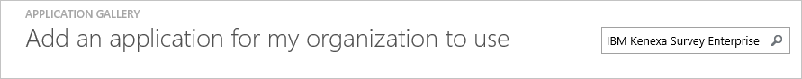
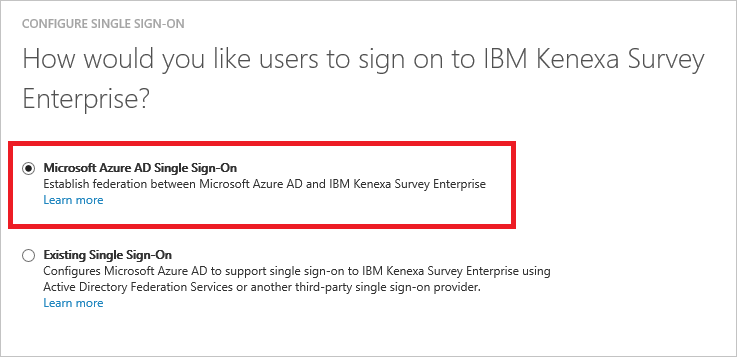
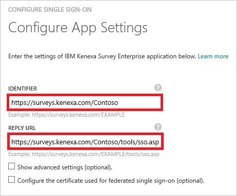
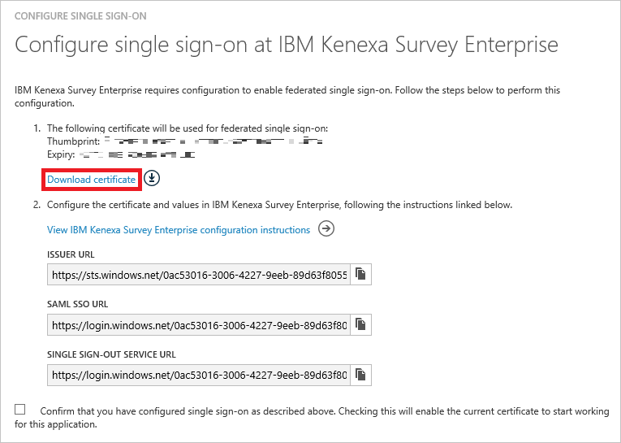
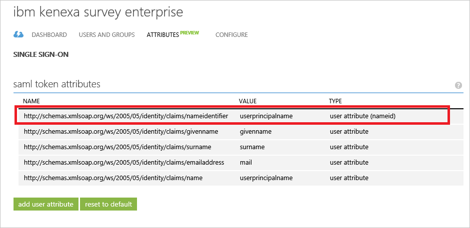
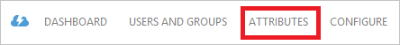
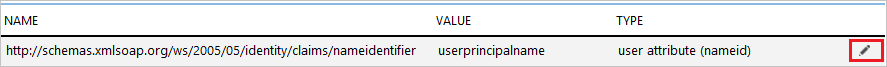
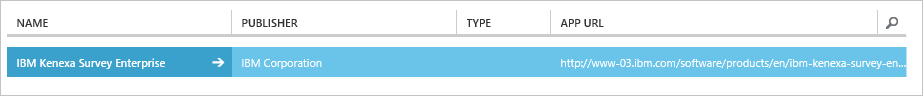

<properties
    pageTitle="Lernprogramm: Azure-Active Directory-Integration in IBM Kenexa Umfrage Enterprise | Microsoft Azure"
    description="Informationen Sie zum Konfigurieren der einmaligen Anmeldens zwischen Azure Active Directory und IBM Kenexa Umfrage Enterprise."
    services="active-directory"
    documentationCenter=""
    authors="jeevansd"
    manager="femila"
    editor=""/>

<tags
    ms.service="active-directory"
    ms.workload="identity"
    ms.tgt_pltfrm="na"
    ms.devlang="na"
    ms.topic="article"
    ms.date="10/20/2016"
    ms.author="jeedes"/>

# Lernprogramm: Azure-Active Directory-Integration in IBM Kenexa Umfrage Enterprise

In diesem Lernprogramm erfahren Sie, wie IBM Kenexa Umfrage Enterprise mit Azure Active Directory (Azure AD) integriert werden soll.

Integrieren von IBM Kenexa Umfrage Enterprise in Azure AD bietet Ihnen die folgenden Vorteile:

- Sie können in Azure AD steuern, die auf IBM Kenexa Umfrage Enterprise zugreifen
- Sie können Ihre Benutzer automatisch auf IBM Kenexa Umfrage Enterprise (einmaliges Anmelden) angemeldete Abrufen mit ihren Azure AD-Konten aktivieren.
- Sie können Ihre Konten an einem zentralen Ort – im klassischen Azure-Portal verwalten.

Wenn Sie weitere Details zu SaaS app-Integration in Azure AD-wissen möchten, finden Sie unter [Was ist Zugriff auf die Anwendung und einmaliges Anmelden mit Azure Active Directory](active-directory-appssoaccess-whatis.md).

## Erforderliche Komponenten

Zum Konfigurieren von Azure AD-Integration mit IBM Kenexa Umfrage Enterprise, benötigen Sie die folgenden Elemente:

- Ein Azure AD-Abonnement
- IBM Kenexa Umfrage Enterprise einmalige Anmeldung aktiviert Abonnements

> [AZURE.NOTE] Wenn Sie um die Schritte in diesem Lernprogramm zu testen, empfehlen wir nicht mit einer Umgebung für die Herstellung.

Führen Sie zum Testen der Schritte in diesem Lernprogramm Tips:

- Sie sollten Ihre Umgebung Herstellung nicht verwenden, es sei denn, dies erforderlich ist.
- Wenn Sie eine Testversion Azure AD-Umgebung besitzen, können Sie eine einen Monat zum Testen [hier](https://azure.microsoft.com/pricing/free-trial/)erhalten.

## Szenario Beschreibung
In diesem Lernprogramm testen Sie Azure AD-einmaliges Anmelden in einer testumgebung. In diesem Lernprogramm beschriebenen Szenario besteht aus zwei Hauptfenster Bausteine:

1. Hinzufügen von IBM Kenexa Umfrage Enterprise aus dem Katalog
2. Konfigurieren und Testen Azure AD einmaliges Anmelden

## Hinzufügen von IBM Kenexa Umfrage Enterprise aus dem Katalog
Zum Konfigurieren der Integration von IBM Kenexa Umfrage Enterprise in Azure AD müssen Sie IBM Kenexa Umfrage Enterprise zu Ihrer Liste der verwalteten SaaS apps aus dem Katalog hinzuzufügen.

**Um IBM Kenexa Umfrage Enterprise aus dem Katalog hinzufügen möchten, führen Sie die folgenden Schritte aus:**

1. Klicken Sie im **Azure klassischen Portal**auf der linken Navigationsbereich auf **Active Directory**. 

    ![Active Directory][1]

2. Wählen Sie aus der Liste **Verzeichnis** Verzeichnis für das Sie Verzeichnisintegration aktivieren möchten.

3. Klicken Sie zum Öffnen der Anwendungsansicht in der Verzeichnisansicht im oberen Menü auf **Applications** .

    ![Applikationen][2]

4. Klicken Sie auf **Hinzufügen** , am unteren Rand der Seite.

    ![Applikationen][3]

5. Klicken Sie im Dialogfeld **Was möchten Sie tun** klicken Sie auf **eine Anwendung aus dem Katalog hinzufügen**.

    ![Applikationen][4]

6. Geben Sie in das Suchfeld **IBM Kenexa Umfrage Enterprise**aus.

    

7. Wählen Sie im Ergebnisbereich **IBM Kenexa Umfrage Enterprise**, und klicken Sie dann auf **abgeschlossen** , um die Anwendung hinzugefügt haben.

    

##  Konfigurieren und Testen Azure AD einmaliges Anmelden
In diesem Abschnitt Konfigurieren und Testen Azure AD-einmaliges Anmelden mit IBM Kenexa Umfrage Enterprise basierend auf einen Testbenutzer "Britta Simon" bezeichnet.

Für einmaliges Anmelden entwickelt muss Azure AD kennen, kann der Benutzer Gegenstück IBM Kenexa Umfrage Enterprise an einen Benutzer in Azure AD. Kurzum, muss eine Link Beziehung zwischen einem Azure AD-Benutzer und dem entsprechenden Benutzer in IBM Kenexa Umfrage Enterprise eingerichtet werden.

Dieser Link Beziehung wird hergestellt, indem Sie den Wert des **Benutzernamens** in Azure AD als der Wert für den **Benutzernamen** in IBM Kenexa Umfrage Enterprise zuweisen.

Zum Konfigurieren und Azure AD-einmaliges Anmelden mit IBM Kenexa Umfrage Enterprise testen, müssen Sie die folgenden Bausteine durchführen:

1. **[Konfigurieren von Azure AD einmaligen Anmeldens](#configuring-azure-ad-single-sign-on)** - damit Ihre Benutzer dieses Feature verwenden können.
2. **[Erstellen einer Azure AD Benutzer testen](#creating-an-azure-ad-test-user)** : Azure AD-einmaliges Anmelden mit Britta Simon testen.
4. **[Erstellen einer IBM Kenexa Umfrage Enterprise Benutzer testen](#creating-an-kenexasurvey-test-user)** : ein Gegenstück von Britta Simon in IBM Kenexa Umfrage Enterprise haben, die in der Azure AD-Darstellung Ihrer verknüpft ist.
5. **[Testen Sie Benutzer zuweisen Azure AD](#assigning-the-azure-ad-test-user)** - Britta Simon mit Azure AD-einmaliges Anmelden aktivieren.
6. **[Testen der einmaligen Anmeldens](#testing-single-sign-on)** - zur Überprüfung, ob die Konfiguration funktioniert.

### Konfigurieren von Azure AD-einmaliges Anmelden

In diesem Abschnitt Azure AD-einmaliges Anmelden im klassischen Portal aktivieren und Konfigurieren der IBM Kenexa Umfrage Enterprise-Anwendung einmaliges Anmelden.

**Führen Sie die folgenden Schritte aus, um Azure AD-einmaliges Anmelden mit IBM Kenexa Umfrage Enterprise konfigurieren:**

1. Im Portal klassischen auf der Seite **IBM Kenexa Umfrage Enterprise** Application Integration klicken Sie auf **Konfigurieren einmaligen Anmeldens** zum Öffnen des Dialogfelds **Konfigurieren einmaliges Anmelden** .

    ![Konfigurieren Sie einmaliges Anmelden][6] 

2. Klicken Sie auf der Seite **Wie möchten Sie Benutzer bei der IBM Kenexa Umfrage Enterprise auf** **Azure AD einmaliges Anmelden**wählen Sie aus, und klicken Sie dann auf **Weiter**.
 
    

3. Führen Sie auf der Seite Dialogfeld **Konfigurieren der App-Einstellungen** die folgenden Schritte aus:

    

    ein. Geben Sie in das Textfeld **Bezeichner** einer URL dem folgenden Muster:`https://surveys.kenexa.com/<company code>`

    b. Geben Sie im Textfeld **URL Antworten** einer URL dem folgenden Muster:`https://surveys.kenexa.com/<company code>/tools/sso.asp`

    c. Klicken Sie auf **Weiter**.

    > [AZURE.NOTE] Bitte beachten Sie, dass diese nicht die tatsächlichen Werte sind. Sie müssen diese Werte mit den tatsächlichen Bezeichner und Antworten URL zu aktualisieren. Wenden Sie sich an IBM Kenexa Umfrage Enterprise-Supportteam, diese Werte abzurufen.

4. Klicken Sie auf **Zertifikat herunterladen** , und speichern Sie die Datei auf Ihrem Computer, auf der Seite **Konfigurieren einmaliges Anmelden bei IBM Kenexa Umfrage Enterprise** :

     

5. Um für die Anwendung konfigurierten SSO zu gelangen, wenden Sie sich an IBM Kenexa Supportteam, und teilen Sie sie mit der folgenden:

    • Die heruntergeladene Zertifikatsdatei

    • Die **URL des Herausgebers**

    • Der **SAML SSO-URL**

    • Die **einzelnen Abmeldung Dienst-URL**

    > [AZURE.NOTE] Bitte muss Beachten Sie, dass NameID Wert in der Antwort beanspruchen SSO-ID, die so konfiguriert, dass Kenexa System entsprechen. Also bitte Arbeit mit Kenexa Supportteam zum Zuordnen der entsprechenden Benutzer-ID in Ihrer Organisation als SSO-ID an. Standardmäßig wird der NameIdentifier Azure AD als UPN Wert festgelegt werden. Sie können dieses Attribut Registerkarte wie im folgenden Screenshot gezeigt ändern. Die Integration funktioniert nur nach dem Ausfüllen der korrekten Zuordnung. 
    
    

6. Im Portal klassischen wählen Sie die Bestätigung Konfiguration für einzelne Zeichen, und klicken Sie dann auf **Weiter**.

    ![Azure AD einmaliges Anmelden][10]

7. Klicken Sie auf der Seite **Bestätigung für einzelne anmelden** auf **abgeschlossen**.  
  
    ![Azure AD einmaliges Anmelden][11]

8. Klicken Sie im Azure klassischen-Portal auf Integrationsseite **IBM Kenexa Umfrage Enterprise** Anwendung in das Menü im oberen Bereich auf **Attribute**.

    

9. Führen Sie die folgenden Schritte aus, klicken Sie im Dialogfeld **token SAML-Attribute** :

    ein. Wählen Sie das Attribut der **NameIdentifier** aus, und klicken Sie auf Symbol **Bearbeiten** .

    
    
    b. Geben Sie in der Liste **Attributwert** den Attributwert von SSO-ID, die im Kenexa System konfiguriert ist.
    
    c. Klicken Sie auf **abgeschlossen**

### Erstellen eines Benutzers mit Azure AD-testen
Das Ziel der in diesem Abschnitt besteht im Erstellen eines Testbenutzers im klassischen Portal Britta Simon bezeichnet.

![Erstellen von Azure AD-Benutzer][20]

**Führen Sie die folgenden Schritte aus, um einen Testbenutzer in Azure AD zu erstellen:**

1. Klicken Sie im **Azure klassischen Portal**auf der linken Navigationsbereich auf **Active Directory**.

     

2. Wählen Sie aus der Liste **Verzeichnis** Verzeichnis für das Sie Verzeichnisintegration aktivieren möchten.

3. Wenn die Liste der Benutzer, klicken Sie im Menü oben anzeigen möchten, klicken Sie auf **Benutzer**.

     

4. Klicken Sie im Dialogfeld **Benutzer hinzufügen** um in der Symbolleiste auf der Unterseite öffnen, auf **Benutzer hinzufügen**.
 
     

5. Führen Sie auf der Seite **Teilen Sie uns zu diesem Benutzer** die folgenden Schritte aus:
 
     

    ein. Wählen Sie als Typ des Benutzers neuen Benutzer in Ihrer Organisation ein.

    b. Geben Sie den Benutzernamen **Textfeld** **BrittaSimon**ein.

    c. Klicken Sie auf **Weiter**.

6.  Klicken Sie auf der Seite **Benutzerprofil** Dialogfeld führen Sie die folgenden Schritte aus:

     

    ein. Geben Sie im Textfeld **Vorname** **Britta**aus.  

    b. In das letzte Textfeld **Name** , Typ, **Simon**.

    c. Geben Sie im Textfeld **Anzeigename** **Britta Simon**aus.

    d. Wählen Sie in der Liste **Rolle** **Benutzer**aus.

    e. Klicken Sie auf **Weiter**.

7. Klicken Sie auf der Seite **erste temporäres Kennwort** auf **Erstellen**.

     

8. Führen Sie auf der Seite **erste temporäres Kennwort** die folgenden Schritte aus:

     

    ein. Notieren Sie den Wert für das **Neue Kennwort ein**.

    b. Klicken Sie auf **abgeschlossen**.   

### Erstellen eines Benutzers mit IBM Kenexa Umfrage Enterprise testen

In diesem Abschnitt erstellen Sie einen Benutzer namens Britta Simon in IBM Kenexa Umfrage Enterprise aus. Arbeiten Sie mit IBM Kenexa Supportteam die SSO-ID für alle Benutzer zuordnen. Auch sollte dieser Wert SSO-ID den Wert NameIdentifier aus Azure Active Directory zugeordnet werden. Sie können diese Standardeinstellungen auf der Registerkarte Attribut ändern.

> [AZURE.NOTE] Wenn Sie einen Benutzer manuell zu erstellen müssen, müssen Sie die IBM Kenexa Umfrage Enterprise-Supportteam.

### Zuweisen des Azure AD-Test-Benutzers

In diesem Abschnitt aktivieren Sie Britta Simon Azure einmaliges Anmelden verwenden, indem Sie keinen Zugriff auf IBM Kenexa Umfrage Enterprise erteilen.

![Benutzer zuweisen][200] 

**Um IBM Kenexa Umfrage Enterprise Britta Simon zuzuweisen, führen Sie die folgenden Schritte aus:**

1. Klicken Sie im Portal klassischen zum Öffnen der Anwendungsansicht in der Verzeichnisansicht klicken Sie auf **Applikationen** im oberen Menü.

    ![Benutzer zuweisen][201] 

2. Wählen Sie in der Liste Applikationen **IBM Kenexa Umfrage Enterprise**aus.

     

1. Klicken Sie auf **Benutzer**, klicken Sie im Menü oben.

    ![Benutzer zuweisen][203] 

1. Wählen Sie in der Liste Benutzer **Britta Simon**aus.

2. Klicken Sie unten auf der Symbolleiste auf **zuweisen**.
    
    ![Benutzer zuweisen][205]

### Testen einmaliges Anmelden

In diesem Abschnitt Testen Sie Ihre Azure AD-einzelne anmelden Konfiguration mit der Access-Systemsteuerung.

Wenn Sie die Kachel IBM Kenexa Umfrage Enterprise im Bereich Access klicken, Sie sollten automatisch an Ihrer Anwendung IBM Kenexa Umfrage Enterprise angemeldete abrufen.

## Zusätzliche Ressourcen

* [Liste der zum Integrieren SaaS-Apps mit Azure-Active Directory-Lernprogramme](active-directory-saas-tutorial-list.md)
* [Was ist die Anwendungszugriff und einmaliges Anmelden mit Azure Active Directory?](active-directory-appssoaccess-whatis.md)

<!--Image references-->

[1]: ./media/active-directory-saas-kenexasurvey-tutorial/tutorial_general_01.png
[2]: ./media/active-directory-saas-kenexasurvey-tutorial/tutorial_general_02.png
[3]: ./media/active-directory-saas-kenexasurvey-tutorial/tutorial_general_03.png
[4]: ./media/active-directory-saas-kenexasurvey-tutorial/tutorial_general_04.png

[6]: ./media/active-directory-saas-kenexasurvey-tutorial/tutorial_general_05.png
[10]: ./media/active-directory-saas-kenexasurvey-tutorial/tutorial_general_06.png
[11]: ./media/active-directory-saas-kenexasurvey-tutorial/tutorial_general_07.png
[20]: ./media/active-directory-saas-kenexasurvey-tutorial/tutorial_general_100.png

[200]: ./media/active-directory-saas-kenexasurvey-tutorial/tutorial_general_200.png
[201]: ./media/active-directory-saas-kenexasurvey-tutorial/tutorial_general_201.png
[203]: ./media/active-directory-saas-kenexasurvey-tutorial/tutorial_general_203.png
[204]: ./media/active-directory-saas-kenexasurvey-tutorial/tutorial_general_204.png
[205]: ./media/active-directory-saas-kenexasurvey-tutorial/tutorial_general_205.png
