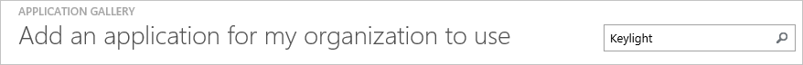
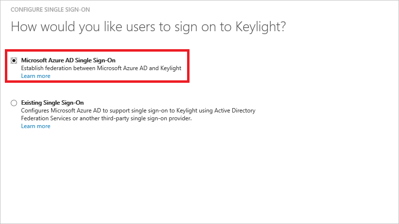
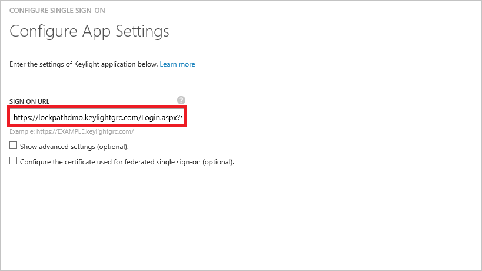
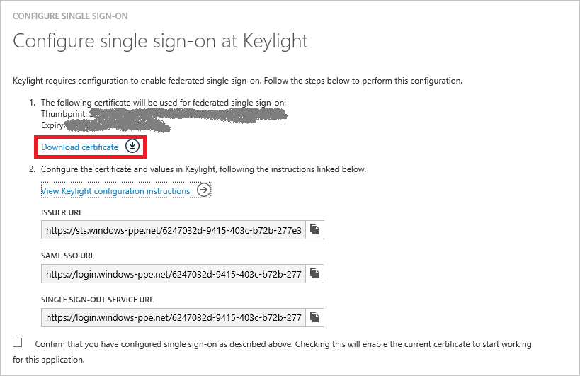
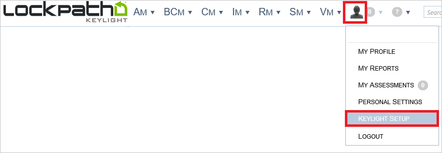
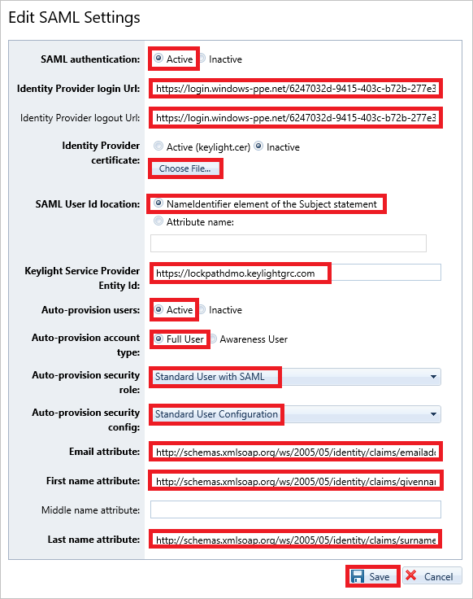
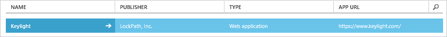

<properties
    pageTitle="Lernprogramm: Azure-Active Directory-Integration in Keylight | Microsoft Azure"
    description="Informationen Sie zum einmaligen Anmeldens zwischen Azure Active Directory und Keylight konfigurieren."
    services="active-directory"
    documentationCenter=""
    authors="jeevansd"
    manager="femila"
    editor=""/>

<tags
    ms.service="active-directory"
    ms.workload="identity"
    ms.tgt_pltfrm="na"
    ms.devlang="na"
    ms.topic="article"
    ms.date="09/29/2016"
    ms.author="jeedes"/>

# Lernprogramm: Azure-Active Directory-Integration in Keylight

In diesem Lernprogramm erfahren Sie, wie Keylight mit Azure Active Directory (Azure AD) integriert werden soll.

Integrieren von Keylight in Azure AD bietet Ihnen die folgenden Vorteile:

- Sie können in Azure AD steuern, wer auf Keylight zugreifen kann
- Sie können Ihre Benutzer automatisch angemeldet-zum Keylight (einmaliges Anmelden) mit ihren Azure AD-Konten auf erste aktivieren.
- Sie können Ihre Konten an einem zentralen Ort – im klassischen Azure-Portal verwalten.

Wenn Sie weitere Details zu SaaS app-Integration in Azure AD-wissen möchten, finden Sie unter [Was ist Zugriff auf die Anwendung und einmaliges Anmelden mit Azure Active Directory](active-directory-appssoaccess-whatis.md).

## Erforderliche Komponenten

Zum Konfigurieren von Azure AD-Integration mit Keylight, benötigen Sie die folgenden Elemente:

- Ein Azure-Abonnement
- Eine Keylight einmaligen Anmeldung aktiviert Abonnement

> [AZURE.NOTE] Wenn Sie um die Schritte in diesem Lernprogramm zu testen, empfehlen wir nicht mit einer Umgebung für die Herstellung.

Führen Sie zum Testen der Schritte in diesem Lernprogramm Tips:

- Sie sollten Ihre Umgebung Herstellung nicht verwenden, es sei denn, dies erforderlich ist.
- Wenn Sie eine Testversion Azure AD-Umgebung besitzen, können Sie eine einen Monat zum Testen [hier](https://azure.microsoft.com/pricing/free-trial/)erhalten.

## Szenario Beschreibung
In diesem Lernprogramm testen Sie Azure AD-einmaliges Anmelden in einer testumgebung. 

In diesem Lernprogramm beschriebenen Szenario besteht aus zwei Hauptfenster Bausteine:

1. Hinzufügen von Keylight aus dem Katalog
2. Konfigurieren und Testen Azure AD einmaliges Anmelden

## Hinzufügen von Keylight aus dem Katalog
Zum Konfigurieren der Integration von Keylight in Azure AD müssen Sie Keylight zu Ihrer Liste der verwalteten SaaS apps aus dem Katalog hinzuzufügen.

**Um Keylight aus dem Katalog hinzufügen möchten, führen Sie die folgenden Schritte aus:**

1. Klicken Sie im **Azure klassischen Portal**auf der linken Navigationsbereich auf **Active Directory**. 

    ![Active Directory][1]

2. Wählen Sie aus der Liste **Verzeichnis** Verzeichnis für das Sie Verzeichnisintegration aktivieren möchten.

3. Klicken Sie zum Öffnen der Anwendungsansicht in der Verzeichnisansicht im oberen Menü auf **Applications** .

    ![Applikationen][2]

4. Klicken Sie auf **Hinzufügen** , am unteren Rand der Seite.

    ![Applikationen][3]

5. Klicken Sie im Dialogfeld **Was möchten Sie tun** klicken Sie auf **eine Anwendung aus dem Katalog hinzufügen**.

    ![Applikationen][4]

6. Geben Sie in das Suchfeld **Keylight**aus.

    

7. Im Ergebnisbereich **Keylight**wählen Sie aus, und klicken Sie dann auf **abgeschlossen** , um die Anwendung hinzugefügt haben.

    

##  Konfigurieren und Testen Azure AD einmaliges Anmelden
In diesem Abschnitt Konfigurieren und Testen Azure AD-einmaliges Anmelden mit Keylight basierend auf einen Testbenutzer "Britta Simon" bezeichnet.

Zum Konfigurieren und Azure AD-einmaliges Anmelden mit Keylight testen, müssen Sie die folgenden Bausteine durchführen:

1. **[Konfigurieren von Azure AD einmaligen Anmeldens](#configuring-azure-ad-single-single-sign-on)** - damit Ihre Benutzer dieses Feature verwenden können.
2. **[Erstellen einer Azure AD Benutzer testen](#creating-an-azure-ad-test-user)** : Azure AD-einmaliges Anmelden mit Britta Simon testen.
4. **[Erstellen einer Keylight Benutzer testen](#creating-a-keylight-test-user)** : ein Gegenstück von Britta Simon in Keylight haben, die in der Azure AD-Darstellung Ihrer verknüpft ist.
5. **[Testen Sie Benutzer zuweisen Azure AD](#assigning-the-azure-ad-test-user)** - Britta Simon mit Azure AD-einmaliges Anmelden aktivieren.
5. **[Testen der einmaligen Anmeldens](#testing-single-sign-on)** - zur Überprüfung, ob die Konfiguration funktioniert.

### Konfigurieren von Azure AD einmaliges Anmelden

In diesem Abschnitt Azure AD-einmaliges Anmelden im klassischen Azure-Portal aktivieren und konfigurieren in Ihrer Anwendung Keylight einmaliges Anmelden.

**Führen Sie die folgenden Schritte aus, um Azure AD-einmaliges Anmelden mit Keylight konfigurieren:**

1. Im Azure klassischen-Portal auf der Seite **Keylight** Integration Anwendung klicken Sie auf **Konfigurieren einmaligen Anmeldens** zum Öffnen des Dialogfelds **Konfigurieren einmaliges Anmelden** .

    ![Konfigurieren Sie einmaliges Anmelden][6] 

2. Klicken Sie auf der Seite **Wie möchten Sie Benutzer Keylight auf bei** **Azure AD einmaliges Anmelden**wählen Sie aus, und klicken Sie dann auf **Weiter**.

     

3. Führen Sie auf der Seite Dialogfeld **Konfigurieren der App-Einstellungen** die folgenden Schritte aus:
 
     

    ein. Geben Sie in das Textfeld melden Sie sich auf URL die URL Ihrer Benutzer melden Sie sich für den Zugriff auf Ihre Keylight-Anwendung unter Verwendung des folgenden Musters untersuchten: **"https://\<Firmennamen\>.keylightgrc.com/Login.aspx?saml=1"**.

4. Klicken Sie auf der Seite **Konfigurieren einmaliges Anmelden bei Keylight** führen Sie die folgenden Schritte aus:
 
     

    ein. Klicken Sie auf **Zertifikat herunterladen**, und speichern Sie die Datei auf Ihrem Computer.

    b. Klicken Sie auf **Weiter**.

5. Wenn SSO in Keylight aktivieren möchten, führen Sie die folgenden Schritte aus:
 
    ein. Melden Sie sich für den Zugriff auf Ihr Konto Keylight als Administrator.

    b. Klicken Sie im Menü oben klicken Sie auf die **Person**, und wählen Sie **Keylight einrichten**.
       
     

    c. Klicken Sie in der Strukturansicht auf der linken Seite auf **SAML**.

     

    d. Klicken Sie im Dialogfeld **SAML-Einstellungen** klicken Sie auf **Bearbeiten**.

     
  

5. Klicken Sie auf der Dialogseite **SAML-Einstellungen bearbeiten** führen Sie die folgenden Schritte aus:

     

    ein. Legen Sie auf **aktiv** **SAML-Authentifizierung** ein.

    b. Klassische Azure AD-Portal kopieren Sie den Wert von **SAML SSO-URL** , und fügen Sie ihn in das Textfeld **Identität Anbieter Anmelde-URL** .

    c. Klassische Azure AD-Portal kopieren Sie den Wert für die **Einzelnen Sign-Out Dienst-URL** , und fügen Sie ihn in das Textfeld **Identität Anbieter Abmelden URL** .

    d. Klicken Sie auf **Datei auswählen** , um Ihre heruntergeladenen Keylight Zertifikat auszuwählen, und klicken Sie dann auf **Öffnen** , wenn Sie das Zertifikat hochladen.

    e. Legen Sie **SAML-Benutzer-Id-Speicherort** , an **NameIdentifier Bestandteil der Betreff-Anweisung**.
   
    f. Angeben der **Keylight Service Provider mit dem folgenden Muster: **https://&lt;Firmennamen&gt;. keylightgrc.com**.

    g. Legen Sie **Benutzer automatisch bereitstellen** auf **aktiv**.

    h. Legen Sie **Vollständige**Benutzer **Kontotyp automatisch bereitstellen** .

    Ich. Wählen Sie als **Rolle automatisch bereitstellen** **Standardbenutzer mit SAML**aus.
   
    j. Wählen Sie als **automatisch bereitstellen Sicherheit Config** **Standard-Benutzer-Konfiguration**aus.
   
    k. Geben Sie die e-Mail-Attribut Textfeld **http://schemas.xmlsoap.org/ws/2005/05/identity/claims/emailaddress**ein.

    l. Geben Sie im Textfeld **Vorname Attribut** **http://schemas.xmlsoap.org/ws/2005/05/identity/claims/givenname**ein.

    m. Geben Sie in das Textfeld **Last Name-Attribut** **http://schemas.xmlsoap.org/ws/2005/05/identity/claims/surname**ein.

    n. Klicken Sie auf **Speichern**.
   
  
   
  
6. Im Portal Azure klassischen wählen Sie die Konfiguration für einzelne Zeichen Bestätigung, und klicken Sie dann auf **Weiter**.

    ![Azure AD einmaliges Anmelden][10]

7. Klicken Sie auf der Seite **Bestätigung für einzelne anmelden** auf **abgeschlossen**.  

    ![Azure AD einmaliges Anmelden][11]

### Erstellen eines Benutzers mit Azure AD-testen
In diesem Abschnitt erstellen Sie einen Testbenutzer aufgerufen Britta Simon im klassischen Azure-Portal an.

Wählen Sie in der Liste Benutzer **Britta Simon**aus.

![Erstellen von Azure AD-Benutzer][20]

**Führen Sie die folgenden Schritte aus, um einen Testbenutzer in Azure AD zu erstellen:**

1. Klicken Sie im **Azure klassischen Portal**auf der linken Navigationsbereich auf **Active Directory**.

     

2. Wählen Sie aus der Liste **Verzeichnis** Verzeichnis für das Sie Verzeichnisintegration aktivieren möchten.

3. Wenn die Liste der Benutzer, klicken Sie im Menü oben anzeigen möchten, klicken Sie auf **Benutzer**.

     

4. Klicken Sie im Dialogfeld **Benutzer hinzufügen** um in der Symbolleiste auf der Unterseite öffnen, auf **Benutzer hinzufügen**.

     

5. Führen Sie auf der Seite **Teilen Sie uns zu diesem Benutzer** die folgenden Schritte aus:

     

    ein. Wählen Sie als Typ des Benutzers neuen Benutzer in Ihrer Organisation ein.

    b. Geben Sie den Benutzernamen **Textfeld** **BrittaSimon**ein.

    c. Klicken Sie auf **Weiter**.

6.  Klicken Sie auf der Seite **Benutzerprofil** Dialogfeld führen Sie die folgenden Schritte aus:

     

    ein. Geben Sie im Textfeld **Vorname** **Britta**aus.  

    b. In das letzte Textfeld **Name** , Typ, **Simon**.

    c. Geben Sie im Textfeld **Anzeigename** **Britta Simon**aus.

    d. Wählen Sie in der Liste **Rolle** **Benutzer**aus.

    e. Klicken Sie auf **Weiter**.

7. Klicken Sie auf der Seite **erste temporäres Kennwort** auf **Erstellen**.

     

8. Klicken Sie auf der Seite **erste temporäres Kennwort** führen Sie die folgenden Schritte aus:

     

    ein. Notieren Sie den Wert für das **Neue Kennwort ein**.

    b. Klicken Sie auf **abgeschlossen**.   

### Erstellen eines Testbenutzers Keylight

In diesem Abschnitt erstellen Sie einen Benutzer namens Britta Simon in Keylight. Keylight unterstützt in-Time-Bereitstellung, ist standardmäßig aktiviert.

Keine für Sie in diesem Abschnitt Aktionselement ist vorhanden. Beim Zugriff auf Keylight, wenn der Benutzer noch nicht vorhanden ist, wird ein neuer Benutzer erstellt. 

> [AZURE.NOTE] Wenn Sie einen Benutzer manuell zu erstellen müssen, müssen Sie die Keylight Supportteam.

### Zuweisen des Azure AD-Test-Benutzers

In diesem Abschnitt aktivieren Sie Britta Simon Azure einmaliges Anmelden verwenden, indem Sie keinen Zugriff auf Keylight erteilen.

![Benutzer zuweisen][200] 

**Um Keylight Britta Simon zuzuweisen, führen Sie die folgenden Schritte aus:**

1. Klicken Sie im Portal Azure klassischen zum Öffnen der Anwendungsansicht in der Verzeichnisansicht klicken Sie auf **Applikationen** im oberen Menü.

    ![Benutzer zuweisen][201] 

2. Wählen Sie in der Liste Applikationen **Keylight**aus.

     

1. Klicken Sie auf **Benutzer**, klicken Sie im Menü oben.

    ![Benutzer zuweisen][203] 

1. Wählen Sie in der Liste Benutzer **Britta Simon**aus.

2. Klicken Sie unten auf der Symbolleiste auf **zuweisen**.

    ![Benutzer zuweisen][205]

### Testen einmaliges Anmelden

In diesem Abschnitt Testen Sie Ihre Azure AD-einzelne anmelden Konfiguration mit der Access-Systemsteuerung.

Wenn Sie die Kachel Keylight im Bereich Access klicken, Sie sollten automatisch an Ihrer Anwendung Keylight angemeldete abrufen.

## Zusätzliche Ressourcen

* [Liste der zum Integrieren SaaS-Apps mit Azure-Active Directory-Lernprogramme](active-directory-saas-tutorial-list.md)
* [Was ist die Anwendungszugriff und einmaliges Anmelden mit Azure Active Directory?](active-directory-appssoaccess-whatis.md)

<!--Image references-->

[1]: ./media/active-directory-saas-keylight-tutorial/tutorial_general_01.png
[2]: ./media/active-directory-saas-keylight-tutorial/tutorial_general_02.png
[3]: ./media/active-directory-saas-keylight-tutorial/tutorial_general_03.png
[4]: ./media/active-directory-saas-keylight-tutorial/tutorial_general_04.png

[6]: ./media/active-directory-saas-keylight-tutorial/tutorial_general_05.png
[10]: ./media/active-directory-saas-keylight-tutorial/tutorial_general_06.png
[11]: ./media/active-directory-saas-keylight-tutorial/tutorial_general_07.png
[20]: ./media/active-directory-saas-keylight-tutorial/tutorial_general_100.png

[200]: ./media/active-directory-saas-keylight-tutorial/tutorial_general_200.png
[201]: ./media/active-directory-saas-keylight-tutorial/tutorial_general_201.png
[203]: ./media/active-directory-saas-keylight-tutorial/tutorial_general_203.png
[204]: ./media/active-directory-saas-keylight-tutorial/tutorial_general_204.png
[205]: ./media/active-directory-saas-keylight-tutorial/tutorial_general_205.png
