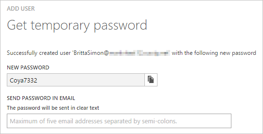

<properties
    pageTitle="Lernprogramm: Azure-Active Directory-Integration in Learning am Arbeitsplatz | Microsoft Azure"
    description="Informationen Sie zum einmaligen Anmeldens zwischen Azure Active Directory und Schulung am Arbeitsplatz konfigurieren."
    services="active-directory"
    documentationCenter=""
    authors="jeevansd"
    manager="femila"
    editor=""/>

<tags
    ms.service="active-directory"
    ms.workload="identity"
    ms.tgt_pltfrm="na"
    ms.devlang="na"
    ms.topic="article"
    ms.date="09/29/2016"
    ms.author="jeedes"/>

# Lernprogramm: Azure-Active Directory-Integration in Schulung bei der Arbeit

In diesem Lernprogramm erfahren Sie, wie Learning bei der Arbeit mit Azure Active Directory (Azure AD) integriert werden soll.

Integration von Learning bei der Arbeit mit Azure AD bietet Ihnen die folgenden Vorteile:

- Sie können in Azure AD steuern, die bei der Arbeit zu lernen zugreifen
- Sie können den Benutzern automatisch zu lernen am Arbeitsplatz (einmaliges Anmelden) mit ihren Konten Azure AD-angemeldete Abrufen ermöglichen.
- Sie können Ihre Konten an einem zentralen Ort – im klassischen Azure-Portal verwalten.

Wenn Sie weitere Details zu SaaS app-Integration in Azure AD-wissen möchten, finden Sie unter [Was ist Zugriff auf die Anwendung und einmaliges Anmelden mit Azure Active Directory](active-directory-appssoaccess-whatis.md).

## Erforderliche Komponenten

Zum Konfigurieren von Azure AD-Integration mit Learning am Arbeitsplatz, benötigen Sie die folgenden Elemente:

- Ein Azure AD-Abonnement
- Learning bei der Arbeit (Saba Cloud) einmaligen Anmeldung aktiviert Abonnement

> [AZURE.NOTE] Wenn Sie um die Schritte in diesem Lernprogramm zu testen, empfehlen wir nicht mit einer Umgebung für die Herstellung.

Führen Sie zum Testen der Schritte in diesem Lernprogramm Tips:

- Sie sollten Ihre Umgebung Herstellung nicht verwenden, es sei denn, dies erforderlich ist.
- Wenn Sie eine Testversion Azure AD-Umgebung besitzen, können Sie eine einen Monat zum Testen [hier](https://azure.microsoft.com/pricing/free-trial/)erhalten.

## Szenario Beschreibung
In diesem Lernprogramm testen Sie Azure AD-einmaliges Anmelden in einer testumgebung.

In diesem Lernprogramm beschriebenen Szenario besteht aus zwei Hauptfenster Bausteine:

1. Learning am Arbeitsplatz aus dem Katalog hinzufügen
2. Konfigurieren und Testen Azure AD einmaliges Anmelden

## Learning am Arbeitsplatz aus dem Katalog hinzufügen
Zum Konfigurieren der Integration von Learning bei der Arbeit in Azure AD müssen Sie zu Ihrer Liste der apps für verwaltete SaaS Learning am Arbeitsplatz aus dem Katalog hinzuzufügen.

**Learning bei Arbeit aus dem Katalog hinzufügen möchten, führen Sie die folgenden Schritte aus:**

1. Klicken Sie im **Azure klassischen Portal**auf der linken Navigationsbereich auf **Active Directory**.

    ![Active Directory][1]
2. Wählen Sie aus der Liste **Verzeichnis** Verzeichnis für das Sie Verzeichnisintegration aktivieren möchten.

3. Klicken Sie zum Öffnen der Anwendungsansicht in der Verzeichnisansicht im oberen Menü auf **Applications** .

    ![Applikationen][2]

4. Klicken Sie auf **Hinzufügen** , am unteren Rand der Seite.

    ![Applikationen][3]

5. Klicken Sie im Dialogfeld **Was möchten Sie tun** klicken Sie auf **eine Anwendung aus dem Katalog hinzufügen**.

    ![Applikationen][4]

6. Geben Sie in das Suchfeld **am Arbeitsplatz Learning**ein.

    

7. Im Bereich Ergebnisse wählen Sie **Learning am Arbeitsplatz aus**und dann auf **abgeschlossen** , um die Anwendung hinzuzufügen.

    

##  Konfigurieren und Testen Azure AD einmaliges Anmelden
In diesem Abschnitt Konfigurieren und Testen Azure AD-einmaliges Anmelden mit Learning am Arbeitsplatz basierend auf einen Testbenutzer "Britta Simon" bezeichnet.

Für einmaliges Anmelden entwickelt muss Azure AD wissen, was der Benutzer Gegenstück interessante bei der Arbeit an einen Benutzer in Azure AD ist. Kurzum, muss eine Link Beziehung zwischen einem Azure AD-Benutzer und dem entsprechenden Benutzer interessante am Arbeitsplatz eingerichtet werden.

Dieser Link Beziehung wird hergestellt, indem Sie den Wert des **Benutzernamens** in Azure AD als der Wert für den **Benutzernamen** interessante am Arbeitsplatz zuweisen.

Zum Konfigurieren und Azure AD-einmaliges Anmelden mit Learning am Arbeitsplatz testen, müssen Sie die folgenden Bausteine durchführen:

1. **[Konfigurieren von Azure AD einmaligen Anmeldens](#configuring-azure-ad-single-sign-on)** - damit Ihre Benutzer dieses Feature verwenden können.
2. **[Erstellen einer Azure AD Benutzer testen](#creating-an-azure-ad-test-user)** : Azure AD-einmaliges Anmelden mit Britta Simon testen.
3. **[Erstellen einer Schulung am Arbeitsplatz testen Benutzer](#creating-a-predictix-price-reporting-test-user)** : ein Gegenstück von Britta Simon interessante am Arbeitsplatz haben, die in der Azure AD-Darstellung Ihrer verknüpft ist.
4. **[Testen Sie Benutzer zuweisen Azure AD](#assigning-the-azure-ad-test-user)** - Britta Simon mit Azure AD-einmaliges Anmelden aktivieren.
5. **[Testen der einmaligen Anmeldens](#testing-single-sign-on)** - zur Überprüfung, ob die Konfiguration funktioniert.

### Konfigurieren von Azure AD-einmaliges Anmelden

In diesem Abschnitt Azure AD-einmaliges Anmelden im klassischen Portal aktivieren und konfigurieren einmaliges Anmelden in Ihren Wissensstand bei Anwendung arbeiten.

**So konfigurieren Sie Azure AD-einmaliges Anmelden mit Learning am Arbeitsplatz die folgenden Schritte aus:**

1. Im Portal klassischen auf der Seite Anwendung Integration **Learning am Arbeitsplatz** klicken Sie auf **Konfigurieren einmaligen Anmeldens** zum Öffnen des Dialogfelds **Konfigurieren einmaliges Anmelden** .
     
    ![Konfigurieren Sie einmaliges Anmelden][6] 

2. Klicken Sie auf der Seite **Wie möchten Sie Benutzer bei der Schulung im Büro auf** **Azure AD einmaliges Anmelden**wählen Sie aus, und klicken Sie dann auf **Weiter**.

     

3. Führen Sie auf der Seite Dialogfeld **Konfigurieren der App-Einstellungen** die folgenden Schritte aus:

     

    ein. Geben Sie in das Textfeld **Melden Sie sich auf URL** die URL Ihrer Benutzer melden Sie sich für den Zugriff auf Ihren Wissensstand bei der Arbeit-Anwendung unter Verwendung des folgenden Musters untersuchten aus:`https://\<company name\>.sabacloud.com/Saba/Web/<company code>`
    
    b. Geben Sie in das Textfeld **Bezeichner** die URL, die mit dem folgenden Muster: ' https://<company name>.sabacloud.com/Saba/SAML/sso/alias/<company name>``

    c. Klicken Sie auf **Weiter**
 
4. Klicken Sie auf der Seite **Konfigurieren einmaliges Anmelden bei Learning am Arbeitsplatz** führen Sie die folgenden Schritte aus:

    

    ein. Klicken Sie auf **Herunterladen von Metadaten**aus, und speichern Sie die Datei auf Ihrem Computer.

    b. Klicken Sie auf **Weiter**.

5. Um für die Anwendung konfigurierten SSO zu gelangen, wenden Sie sich bei der Arbeit (Saba Cloud) Supportteam an Schulung, und teilen Sie sie mit der folgenden:

    • Die heruntergeladene Metadaten

    • Die **Url des Herausgebers**

    • Der **SAML SSO-URL**

    • Der **einzelnen Abmelden Dienst-URL**

6. Im Portal klassischen wählen Sie die Bestätigung Konfiguration für einzelne Zeichen, und klicken Sie dann auf **Weiter**.
    
    ![Azure AD einmaliges Anmelden][10]

7. Klicken Sie auf der Seite **Bestätigung für einzelne anmelden** auf **abgeschlossen**.  
 
    ![Azure AD einmaliges Anmelden][11]

### Erstellen eines Benutzers mit Azure AD-testen
In diesem Abschnitt erstellen Sie einen Testbenutzer im klassischen Portal Britta Simon bezeichnet.

![Erstellen von Azure AD-Benutzer][20]

**Führen Sie die folgenden Schritte aus, um einen Testbenutzer in Azure AD zu erstellen:**

1. Klicken Sie im **Azure klassischen Portal**auf der linken Navigationsbereich auf **Active Directory**.

     

2. Wählen Sie aus der Liste **Verzeichnis** Verzeichnis für das Sie Verzeichnisintegration aktivieren möchten.

3. Wenn die Liste der Benutzer, klicken Sie im Menü oben anzeigen möchten, klicken Sie auf **Benutzer**.

     

4. Klicken Sie im Dialogfeld **Benutzer hinzufügen** um in der Symbolleiste auf der Unterseite öffnen, auf **Benutzer hinzufügen**.

     

5. Führen Sie auf der Seite **Teilen Sie uns zu diesem Benutzer** die folgenden Schritte aus:   

    ein. Wählen Sie als Typ des Benutzers neuen Benutzer in Ihrer Organisation ein.

    b. Geben Sie den Benutzernamen **Textfeld** **BrittaSimon**ein.

    c. Klicken Sie auf **Weiter**.

6.  Klicken Sie auf der Seite **Benutzerprofil** -Dialogfeld führen Sie die folgenden Schritte aus:  

    ein. Geben Sie im Textfeld **Vorname** **Britta**aus.  

    b. In das letzte Textfeld **Name** , Typ, **Simon**.

    c. Geben Sie im Textfeld **Anzeigename** **Britta Simon**aus.

    d. Wählen Sie in der Liste **Rolle** **Benutzer**aus.

    e. Klicken Sie auf **Weiter**.

7. Klicken Sie auf der Seite **erste temporäres Kennwort** auf **Erstellen**.

     

8. Führen Sie auf der Seite **erste temporäres Kennwort** die folgenden Schritte aus:

     

    ein. Notieren Sie den Wert für das **Neue Kennwort ein**.

    b. Klicken Sie auf **abgeschlossen**.   

### Erstellen eine Schulung zur Testbenutzer Arbeit

In diesem Abschnitt erstellen Sie einen Benutzer namens Britta Simon interessante bei der Arbeit an. Arbeiten Sie mit Learning am Supportteam Arbeit, die Benutzer in der Schulung bei der Arbeit Plattform hinzufügen.

### Zuweisen des Azure AD-Test-Benutzers

In diesem Abschnitt aktivieren Sie Britta Simon Azure einmaliges Anmelden verwenden, indem Sie ihre Access zu lernen am Arbeitsplatz erteilen.

![Benutzer zuweisen][200] 

**Um Britta Simon Learning am Arbeitsplatz zuzuweisen, führen Sie die folgenden Schritte aus:**

1. Klicken Sie im Portal klassischen zum Öffnen der Anwendungsansicht in der Verzeichnisansicht klicken Sie auf **Applikationen** im oberen Menü.

    ![Benutzer zuweisen][201] 

2. Wählen Sie in der Liste Applikationen **Learning am Arbeitsplatz**.

     

3. Klicken Sie auf **Benutzer**, klicken Sie im Menü oben.

    ![Benutzer zuweisen][203]

4. Wählen Sie in der Liste Benutzer **Britta Simon**aus.

5. Klicken Sie unten auf der Symbolleiste auf **zuweisen**.

    ![Benutzer zuweisen][205]

### Testen einmaliges Anmelden

In diesem Abschnitt Testen Sie Ihre Azure AD-einzelne anmelden Konfiguration mit der Access-Systemsteuerung.

Wenn Sie die Website zum Kennenlernen bei der Arbeit Kachel im Bereich Access klicken, Sie sollten automatisch zu Ihren Wissensstand bei der Arbeit Anwendung angemeldete erhalten.

## Zusätzliche Ressourcen

* [Liste der zum Integrieren SaaS-Apps mit Azure-Active Directory-Lernprogramme](active-directory-saas-tutorial-list.md)
* [Was ist die Anwendungszugriff und einmaliges Anmelden mit Azure Active Directory?](active-directory-appssoaccess-whatis.md)

<!--Image references-->

[1]: ./media/active-directory-saas-learning-at-work-tutorial/tutorial_general_01.png
[2]: ./media/active-directory-saas-learning-at-work-tutorial/tutorial_general_02.png
[3]: ./media/active-directory-saas-learning-at-work-tutorial/tutorial_general_03.png
[4]: ./media/active-directory-saas-learning-at-work-tutorial/tutorial_general_04.png

[6]: ./media/active-directory-saas-learning-at-work-tutorial/tutorial_general_05.png
[10]: ./media/active-directory-saas-learning-at-work-tutorial/tutorial_general_06.png
[11]: ./media/active-directory-saas-learning-at-work-tutorial/tutorial_general_07.png
[20]: ./media/active-directory-saas-learning-at-work-tutorial/tutorial_general_100.png

[200]: ./media/active-directory-saas-learning-at-work-tutorial/tutorial_general_200.png
[201]: ./media/active-directory-saas-learning-at-work-tutorial/tutorial_general_201.png
[203]: ./media/active-directory-saas-learning-at-work-tutorial/tutorial_general_203.png
[204]: ./media/active-directory-saas-learning-at-work-tutorial/tutorial_general_204.png
[205]: ./media/active-directory-saas-learning-at-work-tutorial/tutorial_general_205.png
