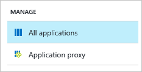

<properties
    pageTitle="Lernprogramm: Azure-Active Directory-Integration in der Lifesize Cloud | Microsoft Azure"
    description="Informationen Sie zum Konfigurieren der einmaligen Anmeldens zwischen Azure Active Directory und Lifesize Cloud."
    services="active-directory"
    documentationCenter=""
    authors="jeevansd"
    manager="femila"
    editor=""/>

<tags
    ms.service="active-directory"
    ms.workload="identity"
    ms.tgt_pltfrm="na"
    ms.devlang="na"
    ms.topic="article"
    ms.date="10/04/2016"
    ms.author="jeedes"/>

# Lernprogramm: Azure-Active Directory-Integration in der Lifesize Cloud

In diesem Lernprogramm erfahren Sie, wie Lifesize Cloud mit Azure Active Directory (Azure AD) integriert werden soll.

Integrieren von Azure AD Lifesize Cloud bietet Ihnen die folgenden Vorteile:

- Sie können in Azure AD steuern, wer Zugriff auf Lifesize Cloud hat
- Sie können Ihre Benutzer automatisch angemeldet-Lifesize Cloud (einmaliges Anmelden) klicken Sie auf erste mit ihren Azure AD-Konten aktivieren.
- Sie können Ihre Konten an einem zentralen Ort – im klassischen Azure-Portal verwalten.

Wenn Sie weitere Details zu SaaS app-Integration in Azure AD-wissen möchten, finden Sie unter [Was ist Zugriff auf die Anwendung und einmaliges Anmelden mit Azure Active Directory](active-directory-appssoaccess-whatis.md).

## Erforderliche Komponenten

Um Azure AD-Integration mit Lifesize Cloud konfigurieren zu können, benötigen Sie die folgenden Elemente:

- Ein Azure AD-Abonnement
- Eine Lifesize Cloud einmaligen Anmeldung aktiviert Abonnement

> [AZURE.NOTE] Wenn Sie um die Schritte in diesem Lernprogramm zu testen, empfehlen wir nicht mit einer Umgebung für die Herstellung.

Führen Sie zum Testen der Schritte in diesem Lernprogramm Tips:

- Sie sollten Ihre Umgebung Herstellung nicht verwenden, es sei denn, dies erforderlich ist.
- Wenn Sie eine Testversion Azure AD-Umgebung besitzen, können Sie eine einen Monat zum Testen [hier](https://azure.microsoft.com/pricing/free-trial/)erhalten.

## Szenario Beschreibung
In diesem Lernprogramm testen Sie Azure AD-einmaliges Anmelden in einer testumgebung.

In diesem Lernprogramm beschriebenen Szenario besteht aus zwei Hauptfenster Bausteine:

1. Hinzufügen von Lifesize Cloud aus dem Katalog
2. Konfigurieren und Testen Azure AD einmaliges Anmelden

## Hinzufügen von Lifesize Cloud aus dem Katalog
Zum Konfigurieren der Integration von Lifesize Cloud in Azure AD müssen Sie Lifesize Cloud zu Ihrer Liste der verwalteten SaaS apps aus dem Katalog hinzuzufügen.

**Wenn Lifesize Cloud aus dem Katalog hinzufügen möchten, führen Sie die folgenden Schritte aus:**

1. Klicken Sie im **Azure klassischen Portal**auf der linken Navigationsbereich auf **Active Directory**.

    ![Active Directory][1]
2. Wählen Sie aus der Liste **Verzeichnis** Verzeichnis für das Sie Verzeichnisintegration aktivieren möchten.

3. Klicken Sie zum Öffnen der Anwendungsansicht in der Verzeichnisansicht im oberen Menü auf **Applications** .

    ![Applikationen][2]

4. Klicken Sie auf **Hinzufügen** , am unteren Rand der Seite.

    ![Applikationen][3]

5. Klicken Sie im Dialogfeld **Was möchten Sie tun** klicken Sie auf **eine Anwendung aus dem Katalog hinzufügen**.

    ![Applikationen][4]

6. Geben Sie im Suchfeld **Lifesize Cloud**.

    

7. Klicken Sie im Ergebnisbereich wählen Sie **Lifesize Cloud aus**und dann auf **abgeschlossen** , um die Anwendung hinzugefügt haben.

    

##  Konfigurieren und Testen Azure AD einmaliges Anmelden
In diesem Abschnitt Sie konfigurieren und Testen Azure AD-einmaliges Anmelden mit Lifesize Cloud auf Grundlage eines Testbenutzers "Britta Simon" bezeichnet.

Für einmaliges Anmelden entwickelt muss Azure AD wissen, was der Benutzer Gegenstück Lifesize Cloud in Azure AD einem Benutzer ist. Kurzum, muss eine Link Beziehung zwischen einem Azure AD-Benutzer und dem entsprechenden Benutzer in die Lifesize Cloud eingerichtet werden.

Dieser Link Beziehung wird hergestellt, indem Sie den Wert des **Benutzernamens** in Azure AD als der Wert für den **Benutzernamen** in der Lifesize Cloud zuweisen.

Zum Konfigurieren und Azure AD-einmaliges Anmelden mit Lifesize Cloud testen, müssen Sie die folgenden Bausteine durchführen:

1. **[Konfigurieren von Azure AD einmaligen Anmeldens](#configuring-azure-ad-single-sign-on)** - damit Ihre Benutzer dieses Feature verwenden können.
2. **[Erstellen einer Azure AD Benutzer testen](#creating-an-azure-ad-test-user)** : Azure AD-einmaliges Anmelden mit Britta Simon testen.
3. **[Erstellen einer Lifesize Cloud Benutzer testen](#creating-a-lifesize-cloud-test-user)** : ein Gegenstück von Britta Simon in die Lifesize Cloud haben, die in der Azure AD-Darstellung Ihrer verknüpft ist.
4. **[Testen Sie Benutzer zuweisen Azure AD](#assigning-the-azure-ad-test-user)** - Britta Simon mit Azure AD-einmaliges Anmelden aktivieren.
5. **[Testen der einmaligen Anmeldens](#testing-single-sign-on)** - zur Überprüfung, ob die Konfiguration funktioniert.

### Konfigurieren von Azure AD-einmaliges Anmelden

In diesem Abschnitt Azure AD-einmaliges Anmelden im klassischen Portal aktivieren und konfigurieren in der Lifesize Cloud Anwendung einmaliges Anmelden.

**Führen Sie die folgenden Schritte aus, um Azure AD-einmaliges Anmelden mit Lifesize Cloud konfigurieren:**

1. Im Portal klassischen auf der Seite **Lifesize Cloud** Integration Anwendung klicken Sie auf **Konfigurieren einmaligen Anmeldens** zum Öffnen des Dialogfelds **Konfigurieren einmaliges Anmelden** .
     
    ![Konfigurieren Sie einmaliges Anmelden][6] 

2. Klicken Sie auf der Seite **Wie möchten Sie Benutzer bei der Lifesize Cloud auf** **Azure AD einmaliges Anmelden**wählen Sie aus, und klicken Sie dann auf **Weiter**.

     

3. Führen Sie auf der Seite Dialogfeld **Konfigurieren der App-Einstellungen** die folgenden Schritte aus:

     

    ein. Geben Sie in das Textfeld **Melden Sie sich auf URL** die URL Ihrer Benutzer melden Sie sich für den Zugriff auf Ihre Lifesize Cloud-Anwendung unter Verwendung des folgenden Musters untersuchten: **https://login.lifesizecloud.com/ls/?acs**.
    
    b. Klicken Sie auf **Weiter**
 
4. Klicken Sie auf der Seite **Konfigurieren einmaliges Anmelden bei Lifesize Cloud** führen Sie die folgenden Schritte aus:

    

    ein. Klicken Sie auf **Zertifikat herunterladen**, und speichern Sie die Datei auf Ihrem Computer.

    b. Klicken Sie auf **Weiter**.

5. Zum Abrufen von SSO für eine Anwendung, melden Sie sich in die Lifesize Cloud Anwendung mit admininistratorberechtigungen konfiguriert.

6. Klicken Sie in der oberen rechten Ecke klicken Sie auf Ihren Namen, und klicken Sie dann auf die **Nächste Einstellungen**

    

7. In das nächste Einstellungen jetzt auf den Link **SSO-Konfiguration** . Dadurch wird die Seite SSO-Konfiguration für Ihre Instanz geöffnet.

    

8. Konfigurieren Sie jetzt die folgenden Werte in der Konfiguration SSO-Benutzeroberfläche an.    

    

    • Kopieren Sie den Wert des Herausgebers URL aus Azure AD- und **Identität Anbieter Herausgeber** Textfeld einzufügen.

    • Kopieren den Wert des Remote-Anmelde-URL aus dem Azure Active Directory und im Textfeld **Anmelde-URL** einzufügen.

    • Öffnen das heruntergeladene Zertifikat in Editor, und kopieren Sie den Inhalt des Zertifikats, die Zertifikat beginnen und Ende Linien ausschließen, fügen Sie diese in das Textfeld **X 509-Zertifikat** .

    Geben Sie den Wert als **http://schemas.xmlsoap.org/ws/2005/05/identity/claims/givenname** • in der Zuordnung SAML-Attribut für das Textfeld **Vorname**

    Geben Sie den Wert als **http://schemas.xmlsoap.org/ws/2005/05/identity/claims/surname** • in der Zuordnung SAML-Attribut für das Textfeld **Nachname**

    Geben Sie den Wert als **http://schemas.xmlsoap.org/ws/2005/05/identity/claims/emailaddress** • in der Zuordnung SAML-Attribut für das **E-Mail** -Textfeld

9. Zum Überprüfen der Konfigurations können Sie auf die Schaltfläche **Testen** klicken.

    > [AZURE.NOTE] Testzwecken erfolgreich müssen Sie im Kontokonfigurations-Assistenten in Azure AD durchführen und auch Freigeben des Zugriffs auf Benutzer oder Gruppen, die den Test ausgeführt werden können.
    
10. Aktivieren Sie die SSO, indem Sie auf die Schaltfläche **SSO aktivieren** .

11. Klicken Sie nun auf die Schaltfläche **Aktualisieren** , sodass alle Einstellungen gespeichert sind. Dadurch wird den Wert RelayState generiert. Kopieren Sie den RelayState-Wert in das Textfeld generiert wird. Benötigen wir diesen Wert in den nächsten Schritten fort.

12. Im Portal klassischen wählen Sie die Bestätigung Konfiguration für einzelne Zeichen, und klicken Sie dann auf **Weiter**.
    
    ![Azure AD einmaliges Anmelden][10]

13. Klicken Sie auf der Seite **Bestätigung für einzelne anmelden** auf **abgeschlossen**.  
 
    ![Azure AD einmaliges Anmelden][11]

14. Jetzt die Anmeldeinformationen in der Azure-Verwaltungsportal **https://portal.azure.com** mit den Administrator-Anmeldeinformationen

15. Klicken Sie auf **Weitere Dienste** Link im linken Navigationsbereich
    
    

16. Suchen nach Azure-Active Directory, und klicken Sie auf den Link **Azure-Active Directory**
    
    

17. Finden Sie Ihre SaaS Applikationen unter der Schaltfläche **Enterprise Applications** .

    

18. Klicken Sie jetzt auf **Alle Programme** Link in das nächste blade
    
    

19. Suchen Sie nach Lifesize-Anwendung, die für die Einrichtung der RelayState werden soll. 
    
    

20. Klicken Sie nun auf **einmaliges Anmelden** Link in das Blade

    

21. Sie sehen, dass das Kontrollkästchen **Erweiterte URL-Einstellungen anzeigen** . Klicken Sie auf das entsprechende Kontrollkästchen.
    
    
    
22. Konfigurieren Sie jetzt die RelayState für die Anwendung, die Sie auf der Seite Lifesize Anwendung SSO-Konfiguration finden Sie unter. 

    

23. Speichern Sie die Einstellungen.

### Erstellen eines Benutzers mit Azure AD-testen
In diesem Abschnitt erstellen Sie einen Testbenutzer im klassischen Portal Britta Simon bezeichnet.

![Erstellen von Azure AD-Benutzer][20]

**Führen Sie die folgenden Schritte aus, um einen Testbenutzer in Azure AD zu erstellen:**

1. Klicken Sie im **Azure klassischen Portal**auf der linken Navigationsbereich auf **Active Directory**.

     

2. Wählen Sie aus der Liste **Verzeichnis** Verzeichnis für das Sie Verzeichnisintegration aktivieren möchten.

3. Wenn die Liste der Benutzer, klicken Sie im Menü oben anzeigen möchten, klicken Sie auf **Benutzer**.

     

4. Klicken Sie im Dialogfeld **Benutzer hinzufügen** um in der Symbolleiste auf der Unterseite öffnen, auf **Benutzer hinzufügen**.

     

5. Führen Sie auf der Seite **Teilen Sie uns zu diesem Benutzer** die folgenden Schritte aus:   

    ein. Wählen Sie als Typ des Benutzers neuen Benutzer in Ihrer Organisation ein.

    b. Geben Sie den Benutzernamen **Textfeld** **BrittaSimon**ein.

    c. Klicken Sie auf **Weiter**.

6.  Klicken Sie auf der Seite **Benutzerprofil** -Dialogfeld führen Sie die folgenden Schritte aus:  

    ein. Geben Sie im Textfeld **Vorname** **Britta**aus.  

    b. In das letzte Textfeld **Name** , Typ, **Simon**.

    c. Geben Sie im Textfeld **Anzeigename** **Britta Simon**aus.

    d. Wählen Sie in der Liste **Rolle** **Benutzer**aus.

    e. Klicken Sie auf **Weiter**.

7. Klicken Sie auf der Seite **erste temporäres Kennwort** auf **Erstellen**.

     

8. Führen Sie auf der Seite **erste temporäres Kennwort** die folgenden Schritte aus:

     

    ein. Notieren Sie den Wert für das **Neue Kennwort ein**.

    b. Klicken Sie auf **abgeschlossen**.   

### Erstellen eines Benutzers mit Lifesize Cloud testen

In diesem Abschnitt erstellen Sie einen Benutzer namens Britta Simon in die Lifesize Cloud. Cloud Lifesize unterstützt das automatische Benutzer bereitgestellt. Nach der erfolgreichen Authentifizierung Azure AD wird der Benutzer automatisch in der Anwendung bereitgestellt werden. 

### Zuweisen des Azure AD-Test-Benutzers

In diesem Abschnitt aktivieren Sie Britta Simon Azure einmaliges Anmelden verwenden, indem Sie keinen Zugriff auf Lifesize Cloud erteilen.

![Benutzer zuweisen][200] 

**Um Britta Simon Lifesize Cloud zuzuweisen, führen Sie die folgenden Schritte aus:**

1. Klicken Sie im Portal klassischen zum Öffnen der Anwendungsansicht in der Verzeichnisansicht klicken Sie auf **Applikationen** im oberen Menü.

    ![Benutzer zuweisen][201] 

2. Wählen Sie in der Liste Applications **Lifesize Cloud**.

     

3. Klicken Sie auf **Benutzer**, klicken Sie im Menü oben.

    ![Benutzer zuweisen][203]

4. Wählen Sie in der Liste Benutzer **Britta Simon**aus.

5. Klicken Sie unten auf der Symbolleiste auf **zuweisen**.

    ![Benutzer zuweisen][205]

### Testen einmaliges Anmelden

In diesem Abschnitt Testen Sie Ihre Azure AD-einzelne anmelden Konfiguration mit der Access-Systemsteuerung.

Wenn Sie die Kachel Lifesize Cloud im Bereich Access klicken, Sie sollten automatisch an Ihrer Anwendung Lifesize Cloud angemeldete abrufen.

## Zusätzliche Ressourcen

* [Liste der zum Integrieren SaaS-Apps mit Azure-Active Directory-Lernprogramme](active-directory-saas-tutorial-list.md)
* [Was ist die Anwendungszugriff und einmaliges Anmelden mit Azure Active Directory?](active-directory-appssoaccess-whatis.md)

<!--Image references-->

[1]: ./media/active-directory-saas-lifesize-cloud-tutorial/tutorial_general_01.png
[2]: ./media/active-directory-saas-lifesize-cloud-tutorial/tutorial_general_02.png
[3]: ./media/active-directory-saas-lifesize-cloud-tutorial/tutorial_general_03.png
[4]: ./media/active-directory-saas-lifesize-cloud-tutorial/tutorial_general_04.png

[6]: ./media/active-directory-saas-lifesize-cloud-tutorial/tutorial_general_05.png
[10]: ./media/active-directory-saas-lifesize-cloud-tutorial/tutorial_general_06.png
[11]: ./media/active-directory-saas-lifesize-cloud-tutorial/tutorial_general_07.png
[20]: ./media/active-directory-saas-lifesize-cloud-tutorial/tutorial_general_100.png

[200]: ./media/active-directory-saas-lifesize-cloud-tutorial/tutorial_general_200.png
[201]: ./media/active-directory-saas-lifesize-cloud-tutorial/tutorial_general_201.png
[203]: ./media/active-directory-saas-lifesize-cloud-tutorial/tutorial_general_203.png
[204]: ./media/active-directory-saas-lifesize-cloud-tutorial/tutorial_general_204.png
[205]: ./media/active-directory-saas-lifesize-cloud-tutorial/tutorial_general_205.png
