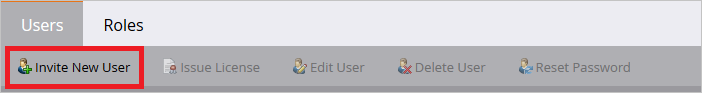

<properties
    pageTitle="Lernprogramm: Azure-Active Directory-Integration in Marketo | Microsoft Azure"
    description="Informationen Sie zum einmaligen Anmeldens zwischen Azure Active Directory und Marketo konfigurieren."
    services="active-directory"
    documentationCenter=""
    authors="jeevansd"
    manager="femila"
    editor=""/>

<tags
    ms.service="active-directory"
    ms.workload="identity"
    ms.tgt_pltfrm="na"
    ms.devlang="na"
    ms.topic="article"
    ms.date="09/07/2016"
    ms.author="jeedes"/>

# Lernprogramm: Azure-Active Directory-Integration in Marketo

In diesem Lernprogramm erfahren Sie, wie Marketo mit Azure Active Directory (Azure AD) integriert werden soll.

Integration von Marketo mit Azure AD bietet Ihnen die folgenden Vorteile:

- Sie können in Azure AD steuern, die auf Marketo zugreifen
- Sie können Ihre Benutzer automatisch auf Marketo (einmaliges Anmelden) mit ihren Konten Azure AD-angemeldete abrufen aktivieren.
- Sie können Ihre Konten an einem zentralen Ort – im klassischen Azure-Portal verwalten.

Wenn Sie weitere Details zu SaaS app-Integration in Azure AD-wissen möchten, finden Sie unter [Was ist Zugriff auf die Anwendung und einmaliges Anmelden mit Azure Active Directory](active-directory-appssoaccess-whatis.md).

## Erforderliche Komponenten

Zum Konfigurieren von Azure AD-Integration mit Marketo, benötigen Sie die folgenden Elemente:

- Ein Azure AD-Abonnement
- Eine Marketo einmaligen Anmeldung aktiviert Abonnement

> [AZURE.NOTE] Wenn Sie um die Schritte in diesem Lernprogramm zu testen, empfehlen wir nicht mit einer Umgebung für die Herstellung.

Führen Sie zum Testen der Schritte in diesem Lernprogramm Tips:

- Sie sollten Ihre Umgebung Herstellung nicht verwenden, es sei denn, dies erforderlich ist.
- Wenn Sie eine Testversion Azure AD-Umgebung besitzen, können Sie eine einen Monat zum Testen [hier](https://azure.microsoft.com/pricing/free-trial/)erhalten.

## Szenario Beschreibung
In diesem Lernprogramm testen Sie Azure AD-einmaliges Anmelden in einer testumgebung.

In diesem Lernprogramm beschriebenen Szenario besteht aus zwei Hauptfenster Bausteine:

1. Hinzufügen von Marketo aus dem Katalog
2. Konfigurieren und Testen Azure AD einmaliges Anmelden

## Hinzufügen von Marketo aus dem Katalog
Um die Integration der Marketo in Azure AD zu konfigurieren, müssen Sie Marketo zu Ihrer Liste der verwalteten SaaS apps aus dem Katalog hinzuzufügen.

**Um Marketo aus dem Katalog hinzufügen möchten, führen Sie die folgenden Schritte aus:**

1. Klicken Sie im **Azure klassischen Portal**auf der linken Navigationsbereich auf **Active Directory**.

    ![Active Directory][1]

2. Wählen Sie aus der Liste **Verzeichnis** Verzeichnis für das Sie Verzeichnisintegration aktivieren möchten.

3. Klicken Sie zum Öffnen der Anwendungsansicht in der Verzeichnisansicht im oberen Menü auf **Applications** .

    ![Applikationen][2]

4. Klicken Sie auf **Hinzufügen** , am unteren Rand der Seite.

    ![Applikationen][3]

5. Klicken Sie im Dialogfeld **Was möchten Sie tun** klicken Sie auf **eine Anwendung aus dem Katalog hinzufügen**.

    ![Applikationen][4]

6. Geben Sie im Suchfeld **Marketo**ein.

    

7. Wählen Sie im Ergebnisbereich **Marketo aus**, und klicken Sie dann auf **abgeschlossen** , um die Anwendung hinzugefügt haben.

    

##  Konfigurieren und Testen Azure AD einmaliges Anmelden
In diesem Abschnitt Konfigurieren und Testen Azure AD-einmaliges Anmelden mit Marketo basierend auf einen Testbenutzer "Britta Simon" bezeichnet.

Für einmaliges Anmelden entwickelt muss Azure AD kennen, kann der Benutzer Gegenstück Marketo einem Benutzer in Azure AD. Kurzum, muss eine Link Beziehung zwischen einem Azure AD-Benutzer und dem entsprechenden Benutzer in Marketo eingerichtet werden.

Dieser Link Beziehung wird hergestellt, indem Sie den Wert des **Benutzernamens** in Azure AD als der Wert für den **Benutzernamen** in Marketo zuweisen.

Zum Konfigurieren und Azure AD-einmaliges Anmelden mit Marketo testen, müssen Sie die folgenden Bausteine durchführen:

1. **[Konfigurieren von Azure AD einmaligen Anmeldens](#configuring-azure-ad-single-sign-on)** - damit Ihre Benutzer dieses Feature verwenden können.
2. **[Erstellen einer Azure AD Benutzer testen](#creating-an-azure-ad-test-user)** : Azure AD-einmaliges Anmelden mit Britta Simon testen.
3. **[Erstellen einer Marketo Benutzer testen](#creating-a-predictix-price-reporting-test-user)** : ein Gegenstück von Britta Simon in Marketo haben, die in der Azure AD-Darstellung Ihrer verknüpft ist.
4. **[Testen Sie Benutzer zuweisen Azure AD](#assigning-the-azure-ad-test-user)** - Britta Simon mit Azure AD-einmaliges Anmelden aktivieren.
5. **[Testen der einmaligen Anmeldens](#testing-single-sign-on)** - zur Überprüfung, ob die Konfiguration funktioniert.

### Konfigurieren von Azure AD-einmaliges Anmelden

In diesem Abschnitt Azure AD-einmaliges Anmelden im klassischen Portal aktivieren und konfigurieren in Ihrer Anwendung Marketo einmaliges Anmelden.

**Führen Sie die folgenden Schritte aus, um Azure AD-einmaliges Anmelden mit Marketo konfigurieren:**

1. Im Portal klassischen auf der Seite **Marketo** Integration Anwendung klicken Sie auf **Konfigurieren einmaligen Anmeldens** zum Öffnen des Dialogfelds **Konfigurieren einmaliges Anmelden** .
     
    ![Konfigurieren Sie einmaliges Anmelden][6] 

2. Klicken Sie auf der Seite **Wie möchten Sie Benutzer bei der Marketo auf** **Azure AD einmaliges Anmelden**wählen Sie aus, und klicken Sie dann auf **Weiter**.

     

3. Führen Sie auf der Seite Dialogfeld **Konfigurieren der App-Einstellungen** die folgenden Schritte aus:

     

    ein. Geben Sie in das Textfeld **Bezeichner** die URL, die mit dem folgenden Muster:`https://saml.marketo.com/sp`
    
    b. Geben Sie in das Textfeld **Antwort-URL** die URL mit dem folgenden Muster:`https://login.marketo.com/saml/assertion/\<munchkinid\>`

    c. Klicken Sie auf **Weiter**
 
4. Klicken Sie auf der Seite **Konfigurieren einmaliges Anmelden bei Marketo** führen Sie die folgenden Schritte aus:

    

    ein. Klicken Sie auf **Zertifikat herunterladen**, und speichern Sie die Datei auf Ihrem Computer.

    b. Klicken Sie auf **Weiter**.

5. Um Munchkin Id Ihrer Anwendung zu gelangen, melden Sie sich bei Marketo mit Administrator-Anmeldeberechtigungen, und führen Sie folgende Aktionen aus:

    ein. Melden Sie sich bei Marketo app mit Administrator-Anmeldeberechtigungen.

    b. Klicken Sie auf die Schaltfläche "Administrator" im oberen Navigationsbereich.

     

    c. Navigieren Sie zu der Integration-Menü, und klicken Sie auf den Link Munchkin
    
    

    d. Kopieren Sie die Munchkin-Id, die auf dem Bildschirm angezeigt, und führen Sie Ihre Antwort-URL in der Azure AD-Konfigurations-Assistent.

    

6.  Zum Konfigurieren der SSO in der Anwendung, führen Sie die folgende Schritte aus:

    ein. Melden Sie sich bei Marketo app mit Administrator-Anmeldeberechtigungen.

    b. Klicken Sie auf die Schaltfläche "Administrator" im oberen Navigationsbereich.

     

    c. Navigieren Sie zu der Integration-Menü, und klicken Sie auf Single Sign On

     

    d. Klicken Sie zum Aktivieren auf die Schaltfläche ' Bearbeiten ' auf der SAML-Einstellungen
    
     

    e. **Aktivieren** Einstellungen für einzelne Zeichen

    f. Geben Sie die Herausgeber-ID, die Sie aus Azure AD-Kontokonfigurations-Assistenten kopiert haben.

    g. Geben Sie die URL in das Textfeld Einheiten ID als **http://saml.marketo.com/sp**

    h. Wählen Sie den Speicherort der Benutzer-ID als **Namen Identifier-Element** aus.

    

    > [AZURE.NOTE] Wenn Ihre Benutzer-ID nicht UPN Wert und ändern Sie den Wert in der Registerkarte Attribut ist.
     
    Ich. Laden Sie das Zertifikat, das Sie von Azure AD-Kontokonfigurations-Assistenten heruntergeladen haben hoch. Speichern Sie die Einstellungen.

    j. Bearbeiten Sie die Einstellungen Seiten umleiten

    k. Kopieren Sie die Anmelde-URL aus Azure AD-Kontokonfigurations-Assistenten in das Textfeld **Anmelde-URL** ein.

    l. Kopieren Sie die URL für die Abmeldung aus Azure AD-Kontokonfigurations-Assistenten in das Textfeld **URL Abmelden** .

    m. Kopieren Sie die URL Ihrer Marketo Instanz, und klicken Sie auf Speichern Schaltfläche, um die Einstellungen zu speichern, in der URL zurück.

    

7. Führen Sie zum Aktivieren der SSO für Benutzer die folgenden Aktionen aus:

    ein. Melden Sie sich bei Marketo app mit Administrator-Anmeldeberechtigungen.

    b. Klicken Sie auf die Schaltfläche " **Administrator** " im oberen Navigationsbereich.

     

    c. Navigieren Sie zum Menü **Sicherheit** , und klicken Sie auf **Login-Einstellungen** 

    

    d. Aktivieren Sie die Option **SSO erforderlich** , und speichern Sie die Einstellungen.
    
    

8. Im Portal klassischen wählen Sie die Bestätigung Konfiguration für einzelne Zeichen, und klicken Sie dann auf **Weiter**.
    
    ![Azure AD einmaliges Anmelden][10]

8. Klicken Sie auf der Seite **Bestätigung für einzelne anmelden** auf **abgeschlossen**.  
 
    ![Azure AD einmaliges Anmelden][11]

### Erstellen eines Benutzers mit Azure AD-testen
In diesem Abschnitt erstellen Sie einen Testbenutzer im klassischen Portal Britta Simon bezeichnet.

![Erstellen von Azure AD-Benutzer][20]

**Führen Sie die folgenden Schritte aus, um einen Testbenutzer in Azure AD zu erstellen:**

1. Klicken Sie im **Azure klassischen Portal**auf der linken Navigationsbereich auf **Active Directory**.

     

2. Wählen Sie aus der Liste **Verzeichnis** Verzeichnis für das Sie Verzeichnisintegration aktivieren möchten.

3. Wenn die Liste der Benutzer, klicken Sie im Menü oben anzeigen möchten, klicken Sie auf **Benutzer**.

     

4. Klicken Sie im Dialogfeld **Benutzer hinzufügen** um in der Symbolleiste auf der Unterseite öffnen, auf **Benutzer hinzufügen**.

     

5. Führen Sie auf der Seite **Teilen Sie uns zu diesem Benutzer** die folgenden Schritte aus:   

    ein. Wählen Sie als Typ des Benutzers neuen Benutzer in Ihrer Organisation ein.

    b. Geben Sie den Benutzernamen **Textfeld** **BrittaSimon**ein.

    c. Klicken Sie auf **Weiter**.

6.  Klicken Sie auf der Seite **Benutzerprofil** -Dialogfeld führen Sie die folgenden Schritte aus:  

    ein. Geben Sie im Textfeld **Vorname** **Britta**aus.  

    b. In das letzte Textfeld **Name** , Typ, **Simon**.

    c. Geben Sie im Textfeld **Anzeigename** **Britta Simon**aus.

    d. Wählen Sie in der Liste **Rolle** **Benutzer**aus.

    e. Klicken Sie auf **Weiter**.

7. Klicken Sie auf der Seite **erste temporäres Kennwort** auf **Erstellen**.

     

8. Klicken Sie auf der Seite **erste temporäres Kennwort** führen Sie die folgenden Schritte aus:

     

    ein. Notieren Sie den Wert für das **Neue Kennwort ein**.

    b. Klicken Sie auf **abgeschlossen**.   

### Erstellen eines Benutzers mit Marketo testen

In diesem Abschnitt erstellen Sie einen Benutzer namens Britta Simon in Marketo. Bitte folgendermaßen Sie vor, um einen Benutzer in Marketo Plattform zu erstellen.

1. Melden Sie sich bei Marketo app mit Administrator-Anmeldeberechtigungen.

2. Klicken Sie auf die Schaltfläche " **Administrator** " im oberen Navigationsbereich.

     

3. Navigieren Sie zum Menü **Sicherheit** , und klicken Sie auf **Benutzer und Rollen**

      

4. Klicken Sie auf der Registerkarte Benutzer auf **Neuen Benutzer einladen**

     

5. Füllen Sie die folgende Informationen in den neuen Benutzer einladen-Assistenten

    ein. Geben Sie den Benutzer **e-Mail-** Adresse in das Textfeld

    

    b. Geben Sie den **ersten Namen** in das Textfeld
    
    c. Geben Sie den **Nachnamen** in das Textfeld

    d. Klicken Sie auf Weiter

6. Wählen Sie auf der Registerkarte **Berechtigungen** des Benutzers Rollen, und klicken Sie auf Weiter

    

7. Klicken Sie auf die Schaltfläche senden, die Benutzer Einladung senden

    

8. Benutzer, die e-Mail-Benachrichtigung erhalten und hat, klicken Sie auf den Link, und ändern das Kennwort ein, um das Konto zu aktivieren. 

### Zuweisen des Azure AD-Test-Benutzers

In diesem Abschnitt aktivieren Sie Britta Simon Azure einmaliges Anmelden verwenden, indem Sie keinen Zugriff auf Marketo erteilen.

![Benutzer zuweisen][200] 

**Um Britta Simon Marketo zuzuweisen, führen Sie die folgenden Schritte aus:**

1. Klicken Sie im Portal klassischen zum Öffnen der Anwendungsansicht in der Verzeichnisansicht klicken Sie auf **Applikationen** im oberen Menü.

    ![Benutzer zuweisen][201] 

2. Wählen Sie in der Liste Applications **Marketo**.

     

3. Klicken Sie auf **Benutzer**, klicken Sie im Menü oben.

    ![Benutzer zuweisen][203]

4. Wählen Sie in der Liste Benutzer **Britta Simon**aus.

5. Klicken Sie unten auf der Symbolleiste auf **zuweisen**.

    ![Benutzer zuweisen][205]

### Testen einmaliges Anmelden

In diesem Abschnitt Testen Sie Ihre Azure AD-einzelne anmelden Konfiguration mit der Access-Systemsteuerung.

Wenn Sie die Kachel Marketo im Bereich Access klicken, Sie sollten automatisch an Ihrer Anwendung Marketo angemeldete abrufen.

## Zusätzliche Ressourcen

* [Liste der zum Integrieren SaaS-Apps mit Azure-Active Directory-Lernprogramme](active-directory-saas-tutorial-list.md)
* [Was ist die Anwendungszugriff und einmaliges Anmelden mit Azure Active Directory?](active-directory-appssoaccess-whatis.md)

<!--Image references-->

[1]: ./media/active-directory-saas-marketo-tutorial/tutorial_general_01.png
[2]: ./media/active-directory-saas-marketo-tutorial/tutorial_general_02.png
[3]: ./media/active-directory-saas-marketo-tutorial/tutorial_general_03.png
[4]: ./media/active-directory-saas-marketo-tutorial/tutorial_general_04.png

[6]: ./media/active-directory-saas-marketo-tutorial/tutorial_general_05.png
[10]: ./media/active-directory-saas-marketo-tutorial/tutorial_general_06.png
[11]: ./media/active-directory-saas-marketo-tutorial/tutorial_general_07.png
[20]: ./media/active-directory-saas-marketo-tutorial/tutorial_general_100.png

[200]: ./media/active-directory-saas-marketo-tutorial/tutorial_general_200.png
[201]: ./media/active-directory-saas-marketo-tutorial/tutorial_general_201.png
[203]: ./media/active-directory-saas-marketo-tutorial/tutorial_general_203.png
[204]: ./media/active-directory-saas-marketo-tutorial/tutorial_general_204.png
[205]: ./media/active-directory-saas-marketo-tutorial/tutorial_general_205.png
