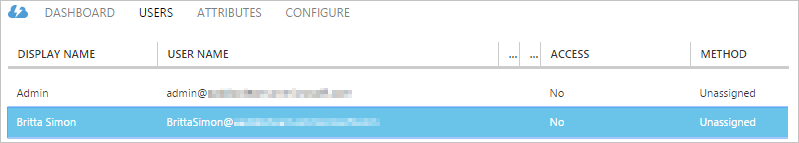
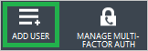
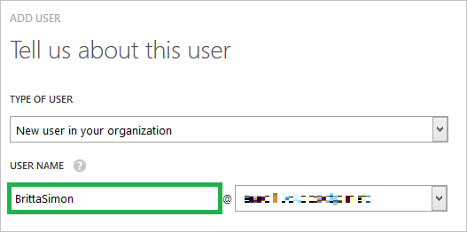
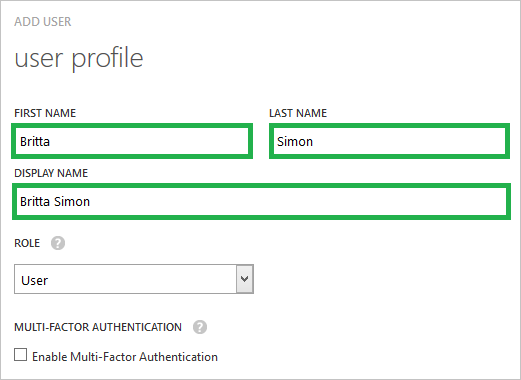
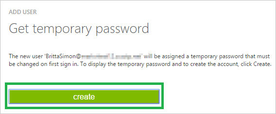
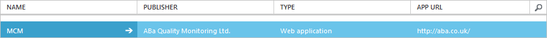

<properties 
    pageTitle="Lernprogramm: Azure-Active Directory-Integration in MCM | Microsoft Azure" 
    description="Erfahren Sie, wie MCM mit Azure Active Directory verwenden, aktivieren Sie einmaliges Anmelden, automatisierte Bereitstellung und mehr!" 
    services="active-directory" 
    authors="jeevansd"  
    documentationCenter="na" 
    manager="femila"/>
<tags 
    ms.service="active-directory" 
    ms.devlang="na" 
    ms.topic="article" 
    ms.tgt_pltfrm="na" 
    ms.workload="identity" 
    ms.date="08/30/2016" 
    ms.author="jeedes" />

#Lernprogramm: Azure-Active Directory-Integration in MCM
  
Ziel dieses Lernprogramms ist zu veranschaulichen MCM mit Azure Active Directory (Azure AD) integriert werden soll.

Integrieren von MCM in Azure AD bietet Ihnen die folgenden Vorteile:

- Sie können in Azure AD steuern, wer auf MCM zugreifen kann
- Sie können Ihre Benutzer automatisch auf MCM (einmaliges Anmelden) mit ihren Konten Azure AD-angemeldete abrufen aktivieren.
- Sie können Ihre Konten an einem zentralen Ort – im klassischen Azure-Portal verwalten.

Wenn Sie weitere Details zu SaaS app-Integration in Azure AD-wissen möchten, finden Sie unter [Was ist Zugriff auf die Anwendung und einmaliges Anmelden mit Azure Active Directory](active-directory-appssoaccess-whatis.md).

## Erforderliche Komponenten

Um Azure AD-Integration mit MCM konfigurieren zu können, benötigen Sie die folgenden Elemente:

- Ein gültiges Azure-Abonnement
- Eine MCM einmaligen Anmeldung aktiviert Abonnement

> [AZURE.NOTE] Wenn Sie um die Schritte in diesem Lernprogramm zu testen, empfehlen wir nicht mit einer Umgebung für die Herstellung.

Führen Sie zum Testen der Schritte in diesem Lernprogramm Tips:

- Sie sollten Ihre Umgebung Herstellung nicht verwenden, es sei denn, dies erforderlich ist.
- Wenn Sie eine Testversion Azure AD-Umgebung besitzen, können Sie eine einen Monat zum Testen [hier](https://azure.microsoft.com/pricing/free-trial/)erhalten.

## Szenario Beschreibung
Ziel dieses Lernprogramms ist, sodass Sie in einer Umgebung für Azure AD-einmaligen Anmeldens testen können.

In diesem Lernprogramm beschriebenen Szenario besteht aus zwei Hauptfenster Bausteine:

1. Hinzufügen von MCM aus dem Katalog
2. Konfigurieren und Testen Azure AD einmaliges Anmelden

## Hinzufügen von MCM aus dem Katalog
Zum Konfigurieren der Integration von MCM in Azure AD müssen Sie MCM zu Ihrer Liste der verwalteten SaaS apps aus dem Katalog hinzuzufügen.

**Um MCM aus dem Katalog hinzufügen möchten, führen Sie die folgenden Schritte aus:**

1.  Klicken Sie im Azure klassischen-Portal auf der linken Navigationsbereich auf **Active Directory**.

    ![Active Directory] (./media/active-directory-saas-mcm-tutorial/tutorial_general_01.png "Active Directory")

2.  Wählen Sie aus der Liste **Verzeichnis** Verzeichnis für das Sie Verzeichnisintegration aktivieren möchten.

3.  Klicken Sie zum Öffnen der Anwendungsansicht in der Verzeichnisansicht im oberen Menü auf **Applications** .

    ![Applikationen] (./media/active-directory-saas-mcm-tutorial/tutorial_general_02.png "Applikationen")

4.  Klicken Sie auf **Hinzufügen** , am unteren Rand der Seite.

    ![Anwendung hinzufügen] (./media/active-directory-saas-mcm-tutorial/tutorial_general_03.png "Anwendung hinzufügen")

5.  Klicken Sie im Dialogfeld **Was möchten Sie tun** klicken Sie auf **eine Anwendung aus dem Katalog hinzufügen**.

    ![Hinzufügen einer Anwendung von gallerry] (./media/active-directory-saas-mcm-tutorial/tutorial_general_04.png "Hinzufügen einer Anwendung von gallerry")

6.  Geben Sie im **Suchfeld** **MCM**aus.

    ![Katalog der Anwendung] (./media/active-directory-saas-mcm-tutorial/tutorial_mcm_01.png "Katalog der Anwendung")

7.  Im Ergebnisbereich **MCM**wählen Sie aus, und klicken Sie dann auf **abgeschlossen** , um die Anwendung hinzugefügt haben.

    ![MCM] (./media/active-directory-saas-mcm-tutorial/tutorial_mcm_001.png "MCM")

##  Konfigurieren und Testen Azure AD einmaliges Anmelden
Das Ziel der in diesem Abschnitt ist erläutert, wie Sie konfigurieren und Testen der Azure AD-einmaliges Anmelden mit MCM basierend auf einen Testbenutzer "Britta Simon" bezeichnet.

Für einmaliges Anmelden entwickelt muss Azure AD wissen, was der Benutzer Gegenstück MCM an einen Benutzer in Azure AD ist. Kurzum, muss eine Link Beziehung zwischen einem Azure AD-Benutzer und dem entsprechenden Benutzer in MCM eingerichtet werden.

Dieser Link Beziehung wird hergestellt, indem Sie den Wert des **Benutzernamens** in Azure AD als der Wert für den **Benutzernamen** in MCM zuweisen.

Zum Konfigurieren und Azure AD-einmaliges Anmelden mit MCM testen, müssen Sie die folgenden Bausteine durchführen:

1. **[Konfigurieren von Azure AD einmaligen Anmeldens](#configuring-azure-ad-single-single-sign-on)** - damit Ihre Benutzer dieses Feature verwenden können.
2. **[Erstellen einer Azure AD Benutzer testen](#creating-an-azure-ad-test-user)** : Azure AD-einmaliges Anmelden mit Britta Simon testen.
3. **[Erstellen einer MCM Benutzer testen](#creating-a-mcm-test-user)** : ein Gegenstück von Britta Simon in MCM haben, die in der Azure AD-Darstellung Ihrer verknüpft ist.
4. **[Testen Sie Benutzer zuweisen Azure AD](#assigning-the-azure-ad-test-user)** - Britta Simon mit Azure AD-einmaliges Anmelden aktivieren.
5. **[Testen der einmaligen Anmeldens](#testing-single-sign-on)** - zur Überprüfung, ob die Konfiguration funktioniert.

### Konfigurieren von Azure AD-einmaliges Anmelden
  
In diesem Abschnitt Azure AD-einmaliges Anmelden im klassischen Portal aktivieren und konfigurieren in Ihrer Anwendung MCM einmaliges Anmelden.

**Führen Sie die folgenden Schritte aus, um Azure AD-einmaliges Anmelden mit MCM konfigurieren:**

1.  Im Azure klassischen-Portal auf der Seite **MCM** Integration Anwendung klicken Sie auf **Konfigurieren einmaligen Anmeldens** um das Dialogfeld **Konfigurieren Single Sign On** öffnen.

    ![Konfigurieren einmaliges Anmelden] (./media/active-directory-saas-mcm-tutorial/tutorial_general_05.png "Konfigurieren einmaliges Anmelden")

2.  Klicken Sie auf der Seite **Wie möchten Sie Benutzer MCM bei, klicken Sie auf** **Microsoft Azure AD einmaliges Anmelden**wählen Sie aus, und klicken Sie dann auf **Weiter**.

    ![Microsoft Azure AD einmaliges Anmelden] (./media/active-directory-saas-mcm-tutorial/tutorial_mcm_03.png "Microsoft Azure AD einmaliges Anmelden")

3.  Führen Sie auf der Seite Dialogfeld Konfigurieren der App-Einstellungen die folgenden Schritte aus:

    ![Konfigurieren der App-URL] (./media/active-directory-saas-mcm-tutorial/tutorial_mcm_04.png "Konfigurieren der App-URL")

    ein. Geben Sie im Textfeld **Melden Sie sich auf URL** ein: `https://myaba.co.uk/client-access/<company name>/saml.php`.
    
    b. Klicken Sie auf **Weiter**

4.  Klicken Sie auf der Seite **Konfigurieren einmaliges Anmelden bei MCM** klicken Sie auf **Herunterladen von Metadaten**, und speichern Sie die Zertifikatdatei auf Ihrem Computer.

    ![Konfigurieren Sie einmaliges Anmelden] (./media/active-directory-saas-mcm-tutorial/tutorial_mcm_05.png "Konfigurieren Sie einmaliges Anmelden")

5. Wenn für die Anwendung konfigurierten SSO erhalten möchten, wenden Sie sich an Ihr Supportteam MCM. Fügen Sie die heruntergeladenen Metadatendatei, und teilen Sie sie mit MCM Team SSO auf ihrer Seite einrichten.

6.  Im Portal klassischen wählen Sie die Bestätigung Konfiguration für einzelne Zeichen, und klicken Sie dann auf **Weiter**.

    ![Konfigurieren Sie einmaliges Anmelden] (./media/active-directory-saas-mcm-tutorial/tutorial_mcm_06.png "Konfigurieren Sie einmaliges Anmelden")

7. Klicken Sie auf der Seite **Bestätigung für einzelne anmelden** auf **abgeschlossen**.

    ![Konfigurieren Sie einmaliges Anmelden] (./media/active-directory-saas-mcm-tutorial/tutorial_mcm_07.png "Konfigurieren Sie einmaliges Anmelden")

### Erstellen eines Benutzers mit Azure AD-testen

Das Ziel der in diesem Abschnitt besteht im Erstellen eines Testbenutzers im klassischen Portal Britta Simon bezeichnet.

**Führen Sie die folgenden Schritte aus, um einen Testbenutzer in Azure AD zu erstellen:**

1. Klicken Sie im **Azure klassischen Portal**auf der linken Navigationsbereich auf **Active Directory**.

    

2. Wählen Sie aus der Liste **Verzeichnis** Verzeichnis für das Sie Verzeichnisintegration aktivieren möchten.

3. Wenn die Liste der Benutzer, klicken Sie im Menü oben anzeigen möchten, klicken Sie auf **Benutzer**.
    
    

4. Klicken Sie im Dialogfeld **Benutzer hinzufügen** um in der Symbolleiste auf der Unterseite öffnen, auf **Benutzer hinzufügen**.

    

5. Führen Sie auf der Seite **Teilen Sie uns zu diesem Benutzer** die folgenden Schritte aus:

    

    ein. Wählen Sie als Typ des Benutzers neuen Benutzer in Ihrer Organisation ein.

    b. Geben Sie den Benutzernamen **Textfeld** **BrittaSimon**ein.

    c. Klicken Sie auf **Weiter**.

6.  Klicken Sie auf der Seite **Benutzerprofil** Dialogfeld führen Sie die folgenden Schritte aus:
    
    

    ein. Geben Sie im Textfeld **Vorname** **Britta**aus.  

    b. In das letzte Textfeld **Name** , Typ, **Simon**.

    c. Geben Sie im Textfeld **Anzeigename** **Britta Simon**aus.

    d. Wählen Sie in der Liste **Rolle** **Benutzer**aus.

    e. Klicken Sie auf **Weiter**.

7. Klicken Sie auf der Seite **erste temporäres Kennwort** auf **Erstellen**.
    
    

8. Klicken Sie auf der Seite **erste temporäres Kennwort** führen Sie die folgenden Schritte aus:
    
    

    ein. Notieren Sie den Wert für das **Neue Kennwort ein**.

    b. Klicken Sie auf **abgeschlossen**.   

###Erstellen eines Testbenutzers MCM
  
In diesem Abschnitt erstellen Sie einen Benutzer namens Britta Simon in MCM an. Arbeiten Sie mit MCM Supportteam Benutzer in die MCM Plattform hinzufügen.

>[AZURE.NOTE]Alle anderen MCM Benutzer Konto Creation Tools können oder APIs bereitgestellt durch MCM bereitstellen AAD Benutzerkonten.

###Zuweisen des Azure AD-Test-Benutzers
  
Das Ziel der in diesem Abschnitt ist für die Aktivierung der Britta Simon Azure einmaliges Anmelden verwenden, indem Sie keinen Zugriff auf MCM erteilen.
    
![Zuweisen von Benutzern] (./media/active-directory-saas-mcm-tutorial/assign_aaduser_00.png "Zuweisen von Benutzern")

**Um MCM Britta Simon zuzuweisen, führen Sie die folgenden Schritte aus:**

1. Klicken Sie im Portal klassischen zum Öffnen der Anwendungsansicht in der Verzeichnisansicht klicken Sie auf **Applikationen** im oberen Menü.
    
    ![Zuweisen von Benutzern] (./media/active-directory-saas-mcm-tutorial/assign_aaduser_01.png "Zuweisen von Benutzern")

2. Wählen Sie in der Liste Applikationen **MCM**aus.
    
    

1. Klicken Sie auf **Benutzer**, klicken Sie im Menü oben.
    
    ![Zuweisen von Benutzern] (./media/active-directory-saas-mcm-tutorial/assign_aaduser_02.png "Zuweisen von Benutzern")

1. Wählen Sie in der Liste Benutzer **Britta Simon**aus.

2. Klicken Sie unten auf der Symbolleiste auf **zuweisen**.
    
    ![Zuweisen von Benutzern] (./media/active-directory-saas-mcm-tutorial/assign_aaduser_03.png "Zuweisen von Benutzern")

### Testen einmaliges Anmelden

Das Ziel der in diesem Abschnitt ist zum Azure AD-einzelne anmelden Überprüfen der Konfiguration mithilfe des Bedienfelds Access.
 
Wenn Sie die Kachel MCM im Bereich Access klicken, Sie sollten automatisch an Ihrer Anwendung MCM angemeldete abrufen.

## Zusätzliche Ressourcen

* [Liste der zum Integrieren SaaS-Apps mit Azure-Active Directory-Lernprogramme](active-directory-saas-tutorial-list.md)
* [Was ist die Anwendungszugriff und einmaliges Anmelden mit Azure Active Directory?](active-directory-appssoaccess-whatis.md)