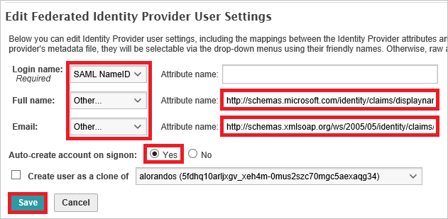

<properties
    pageTitle="Lernprogramm: Azure-Active Directory-Integration in MOVEit Transfer | Microsoft Azure"
    description="Informationen Sie zum einmaligen Anmeldens zwischen Azure Active Directory und MOVEit Übertragung konfigurieren."
    services="active-directory"
    documentationCenter=""
    authors="jeevansd"
    manager="femila"
    editor=""/>

<tags
    ms.service="active-directory"
    ms.workload="identity"
    ms.tgt_pltfrm="na"
    ms.devlang="na"
    ms.topic="article"
    ms.date="10/18/2016"
    ms.author="jeedes"/>

# Lernprogramm: Azure-Active Directory-Integration in MOVEit durchstellen

Ziel dieses Lernprogramms ist zu veranschaulichen MOVEit Übertragung mit Azure Active Directory (Azure AD) integriert werden soll.

Integration von MOVEit Übertragung mit Azure AD bietet Ihnen die folgenden Vorteile:

- Sie können in Azure AD steuern, die zu übertragende MOVEit zugreifen können
- Sie können Ihre Benutzer automatisch auf MOVEit Transfer (einmaliges Anmelden) angemeldete Abrufen mit ihren Azure AD-Konten aktivieren.
- Sie können Ihre Konten an einem zentralen Ort – im klassischen Azure-Portal verwalten.

Wenn Sie weitere Details zu SaaS app-Integration in Azure AD-wissen möchten, finden Sie unter [Was ist Zugriff auf die Anwendung und einmaliges Anmelden mit Azure Active Directory](active-directory-appssoaccess-whatis.md).

## Erforderliche Komponenten

Zum Konfigurieren von Azure AD-Integration mit MOVEit durchstellen, benötigen Sie die folgenden Elemente:

- Ein Azure AD-Abonnement
- Eine MOVEit Übertragung einmaligen Anmeldung aktiviert Abonnement

> [AZURE.NOTE] Wenn Sie um die Schritte in diesem Lernprogramm zu testen, empfehlen wir nicht mit einer Umgebung für die Herstellung.

Führen Sie zum Testen der Schritte in diesem Lernprogramm Tips:

- Sie sollten Ihre Umgebung Herstellung nicht verwenden, es sei denn, dies erforderlich ist.
- Wenn Sie eine Testversion Azure AD-Umgebung besitzen, können Sie eine einen Monat zum Testen [hier](https://azure.microsoft.com/pricing/free-trial/)erhalten.

## Szenario Beschreibung
Ziel dieses Lernprogramms ist, sodass Sie in einer Umgebung für Azure AD-einmaligen Anmeldens testen können.

In diesem Lernprogramm beschriebenen Szenario besteht aus zwei Hauptfenster Bausteine:

1. Hinzufügen von MOVEit Transfer aus dem Katalog
2. Konfigurieren und Testen Azure AD einmaliges Anmelden

## Hinzufügen von MOVEit Transfer aus dem Katalog
Zum Konfigurieren der Integration von MOVEit Transfer in Azure AD müssen Sie MOVEit Übertragung zu Ihrer Liste der verwalteten SaaS apps aus dem Katalog hinzuzufügen.

**Wenn MOVEit Transfer aus dem Katalog hinzufügen möchten, führen Sie die folgenden Schritte aus:**

1. Klicken Sie im **Azure klassischen Portal**auf der linken Navigationsbereich auf **Active Directory**. 

    ![Active Directory][1]

2. Wählen Sie aus der Liste **Verzeichnis** Verzeichnis für das Sie Verzeichnisintegration aktivieren möchten.

3. Klicken Sie zum Öffnen der Anwendungsansicht in der Verzeichnisansicht im oberen Menü auf **Applications** .
    
    ![Applikationen][2]

4. Klicken Sie auf **Hinzufügen** , am unteren Rand der Seite.
    
    ![Applikationen][3]

5. Klicken Sie im Dialogfeld **Was möchten Sie tun** klicken Sie auf **eine Anwendung aus dem Katalog hinzufügen**.

    ![Applikationen][4]

6. Geben Sie im Suchfeld **MOVEit Transfer**aus.

    

7. Wählen Sie im Ergebnisfeld **MOVEit Übertragung aus**und dann auf **abgeschlossen** , um die Anwendung hinzuzufügen.

    

##  Konfigurieren und Testen Azure AD einmaliges Anmelden
Das Ziel der in diesem Abschnitt wird erläutert, wie Sie konfigurieren und Testen der Azure AD-einmaliges Anmelden mit MOVEit durchstellen eines Namens "Britta Simon" Testbenutzers basierend auf.

Für einmaliges Anmelden entwickelt muss Azure AD wissen, was der Benutzer Gegenstück MOVEit Übertragung an einen Benutzer in Azure AD ist. Kurzum, muss eine Link Beziehung zwischen einem Azure AD-Benutzer und dem entsprechenden Benutzer in MOVEit Übertragung eingerichtet werden.

Dieser Link Beziehung wird hergestellt, indem Sie den Wert des **Benutzernamens** in Azure AD als der Wert für den **Benutzernamen** in MOVEit Übertragung zuweisen.

Zum Konfigurieren und Azure AD-einmaliges Anmelden mit MOVEit Übertragung testen, müssen Sie die folgenden Bausteine durchführen:

1. **[Konfigurieren von Azure AD einmaligen Anmeldens](#configuring-azure-ad-single-single-sign-on)** - damit Ihre Benutzer dieses Feature verwenden können.
2. **[Erstellen einer Azure AD Benutzer testen](#creating-an-azure-ad-test-user)** : Azure AD-einmaliges Anmelden mit Britta Simon testen.
3. **[Erstellen einer MOVEit Übertragung Benutzer testen](#creating-a-moveit-transfer-test-user)** : ein Gegenstück von Britta Simon in MOVEit Übertragung haben, die in der Azure AD-Darstellung Ihrer verknüpft ist.
4. **[Testen Sie Benutzer zuweisen Azure AD](#assigning-the-azure-ad-test-user)** - Britta Simon mit Azure AD-einmaliges Anmelden aktivieren.
5. **[Testen der einmaligen Anmeldens](#testing-single-sign-on)** - zur Überprüfung, ob die Konfiguration funktioniert.

### Konfigurieren von Azure AD-einmaliges Anmelden

In diesem Abschnitt Azure AD-einmaliges Anmelden im klassischen Portal aktivieren und konfigurieren in Ihrer Anwendung MOVEit Transfer einmaliges Anmelden.

**So konfigurieren Sie Azure AD-einmaliges Anmelden mit MOVEit Transfer die folgenden Schritte aus:**

1. Im Portal klassischen auf der Seite Anwendung Integration **MOVEit Übertragung** klicken Sie auf **Konfigurieren einmaligen Anmeldens** zum Öffnen des Dialogfelds **Konfigurieren einmaliges Anmelden** .
     
    ![Konfigurieren Sie einmaliges Anmelden][6] 

2. Klicken Sie auf der Seite **Wie möchten Sie Benutzer bei der MOVEit Transfer auf** **Azure AD einmaliges Anmelden**wählen Sie aus, und klicken Sie dann auf **Weiter**.
    
    

3. Führen Sie auf der Seite **Einstellungen für die App konfigurieren** Dialogfeld die folgenden Schritte aus, und klicken Sie auf **Weiter**:

    

    ein. Geben Sie in das Textfeld **Melden Sie sich auf URL** anmelden URL mit Ihrer eigenen Domäne aus.

    b. Geben Sie in das Textfeld **Bezeichner** eine Entität-ID-URL ein.

    c. Geben Sie im Textfeld **URL Antworten** einer Enebled Assertion Consumer Benutzeroberflächen-URL ein.

    d. Klicken Sie auf **Weiter**

    > [AZURE.NOTE] Bitte beachten Sie, dass Sie diese Werte mit der tatsächlichen melden Sie sich auf URL und der Bezeichner aktualisiert haben. Um diese Werte zu erhalten, können Sie weitere Details finden Sie in Schritt 8 oder wenden Sie sich an [MOVEit übertragen](https://www.ipswitch.com/support/technical-support).

4. Klicken Sie auf der Seite **Konfigurieren einmaliges Anmelden bei MOVEit durchstellen** führen Sie die folgenden Schritte aus, und klicken Sie auf **Weiter**:

    

    ein. Klicken Sie auf **Herunterladen von Metadaten**aus, und speichern Sie die Datei auf Ihrem Computer.

    b. Klicken Sie auf **Weiter**.

5. Melden Sie sich für den Zugriff auf Ihre MOVEit Transfer Mandanten als Administrator.

6. Klicken Sie im linken Navigationsbereich auf **Einstellungen**.

    

7. Klicken Sie auf **Einzigen Anmeldung** Link befindet sich unter **Sicherheitsrichtlinien-Benutzerauthentifizierung >**.

    

8. Klicken Sie auf den Link Metadaten-URL zum Herunterladen des Dokuments Metadaten.

    

    - Vergewissern Sie sich **%EntityID** Treffer **Bezeichner** in Schritt3.
    
    - Stellen Sie sicher, dass die URL des Speicherorts meiner **AssertionConsumerService** **Antworten URL** in Schritt3 entspricht.

    

9. Klicken Sie auf **Identitätsanbieter hinzufügen** -Schaltfläche, um eine neue Partnersuche Identitätsanbieter hinzuzufügen.

    

10. Klicken Sie auf **Durchsuchen...** , um Wählen Sie in Schritt 4 die Metadatendatei, die Sie heruntergeladen haben, und klicken Sie auf **Identitätsanbieter hinzufügen** , um die heruntergeladene Datei hochladen. 

    

11. Wählen Sie "**Ja**" als **aktiviert** auf der Seite **Edit Partnersuche Identität Anbieter Settings...** , und klicken Sie auf **Speichern**.

     

12. Führen Sie auf der Seite **Bearbeiten Partnersuche Identität Anbieter User Settings** die folgenden Aktionen aus, und klicken Sie auf **Speichern**.

    ein. Wählen Sie **SAML NameID** **Anmeldenamen**ein.

    b. Wählen Sie **andere** als **vollständigen Namen** , und setzen Sie den Wert in das **Attributname** Textfeld: http://schemas.microsoft.com/identity/claims/displayname.

    c. Wählen Sie **andere** als **E-Mail** , und setzen Sie den Wert in das **Attributname** Textfeld: http://schemas.xmlsoap.org/ws/2005/05/identity/claims/emailaddress.

    d. Wählen Sie **Ja** , als **Konto automatisch einrichten, bei der Anmeldung**.

    e. Klicken Sie auf die Schaltfläche **Speichern** .

    

13. Im Portal klassischen wählen Sie die Bestätigung Konfiguration für einzelne Zeichen, und klicken Sie dann auf **Weiter**.
    
    ![Azure AD einmaliges Anmelden][10]

14. Klicken Sie auf der Seite **Bestätigung für einzelne anmelden** auf **abgeschlossen**.  
    
    ![Azure AD einmaliges Anmelden][11]

### Erstellen eines Benutzers mit Azure AD-testen
Das Ziel der in diesem Abschnitt besteht im Erstellen eines Testbenutzers im klassischen Portal Britta Simon bezeichnet.

![Erstellen von Azure AD-Benutzer][20]

**Führen Sie die folgenden Schritte aus, um einen Testbenutzer in Azure AD zu erstellen:**

1. Klicken Sie im **Azure klassischen Portal**auf der linken Navigationsbereich auf **Active Directory**.

    

2. Wählen Sie aus der Liste **Verzeichnis** Verzeichnis für das Sie Verzeichnisintegration aktivieren möchten.

3. Wenn die Liste der Benutzer, klicken Sie im Menü oben anzeigen möchten, klicken Sie auf **Benutzer**.
    
    

4. Klicken Sie im Dialogfeld **Benutzer hinzufügen** um in der Symbolleiste auf der Unterseite öffnen, auf **Benutzer hinzufügen**.

    

5. Führen Sie auf der Seite **Teilen Sie uns zu diesem Benutzer** die folgenden Schritte aus:

    

    ein. Wählen Sie als Typ des Benutzers neuen Benutzer in Ihrer Organisation ein.

    b. Geben Sie den Benutzernamen **Textfeld** **BrittaSimon**ein.

    c. Klicken Sie auf **Weiter**.

6.  Klicken Sie auf der Seite **Benutzerprofil** Dialogfeld führen Sie die folgenden Schritte aus:
    
    

    ein. Geben Sie im Textfeld **Vorname** **Britta**aus.  

    b. In das letzte Textfeld **Name** , Typ, **Simon**.

    c. Geben Sie im Textfeld **Anzeigename** **Britta Simon**aus.

    d. Wählen Sie in der Liste **Rolle** **Benutzer**aus.

    e. Klicken Sie auf **Weiter**.

7. Klicken Sie auf der Seite **erste temporäres Kennwort** auf **Erstellen**.
    
    

8. Führen Sie auf der Seite **erste temporäres Kennwort** die folgenden Schritte aus:
    
    

    ein. Notieren Sie den Wert für das **Neue Kennwort ein**.

    b. Klicken Sie auf **abgeschlossen**.   

### Erstellen eines Testbenutzers MOVEit durchstellen

Das Ziel der in diesem Abschnitt ist zum Erstellen eines Benutzers Britta Simon in MOVEit Übertragung bezeichnet. MOVEit die Übertragung unterstützt in-Time-Bereitstellung, die Sie aktiviert haben.

Keine für Sie in diesem Abschnitt Aktionselement ist vorhanden. Bei dem Versuch, MOVEit Transfer zugreifen, wenn er noch nicht vorhanden ist, wird ein neuer Benutzer erstellt werden.

> [AZURE.NOTE] Wenn Sie einen Benutzer manuell erstellen müssen, müssen Sie wenden Sie sich an das Supportteam MOVEit übertragen.

### Zuweisen des Azure AD-Test-Benutzers

Das Ziel der in diesem Abschnitt ist für die Aktivierung der Britta Simon Azure einmaliges Anmelden verwenden, indem Sie keinen Zugriff zu übertragende MOVEit erteilen.
    
![Benutzer zuweisen][200]

**Um Britta Simon MOVEit Transfer zuzuweisen, führen Sie die folgenden Schritte aus:**

1. Klicken Sie im Portal klassischen zum Öffnen der Anwendungsansicht in der Verzeichnisansicht klicken Sie auf **Applikationen** im oberen Menü.
    
    ![Benutzer zuweisen][201]

2. Wählen Sie in der Liste Applications **MOVEit Transfer**aus.
    
    

3. Klicken Sie auf **Benutzer**, klicken Sie im Menü oben.
    
    ![Benutzer zuweisen][203]

4. Wählen Sie in der Liste Benutzer **Britta Simon**aus.

5. Klicken Sie unten auf der Symbolleiste auf **zuweisen**.
    
    ![Benutzer zuweisen][205]

### Testen einmaliges Anmelden

Das Ziel der in diesem Abschnitt ist zum Azure AD-einzelne anmelden Überprüfen der Konfiguration mithilfe des Bedienfelds Access.
 
Wenn Sie die Kachel MOVEit Übertragung im Bereich Access klicken, Sie sollten automatisch angemeldet-an Ihrer Anwendung MOVEit Transfer auf abrufen.

## Zusätzliche Ressourcen

* [Liste der zum Integrieren SaaS-Apps mit Azure-Active Directory-Lernprogramme](active-directory-saas-tutorial-list.md)
* [Was ist die Anwendungszugriff und einmaliges Anmelden mit Azure Active Directory?](active-directory-appssoaccess-whatis.md)

<!--Image references-->

[1]: ./media/active-directory-saas-moveittransfer-tutorial/tutorial_general_01.png
[2]: ./media/active-directory-saas-moveittransfer-tutorial/tutorial_general_02.png
[3]: ./media/active-directory-saas-moveittransfer-tutorial/tutorial_general_03.png
[4]: ./media/active-directory-saas-moveittransfer-tutorial/tutorial_general_04.png

[6]: ./media/active-directory-saas-moveittransfer-tutorial/tutorial_general_05.png
[10]: ./media/active-directory-saas-moveittransfer-tutorial/tutorial_general_06.png
[11]: ./media/active-directory-saas-moveittransfer-tutorial/tutorial_general_07.png
[20]: ./media/active-directory-saas-moveittransfer-tutorial/tutorial_general_100.png

[200]: ./media/active-directory-saas-moveittransfer-tutorial/tutorial_general_200.png
[201]: ./media/active-directory-saas-moveittransfer-tutorial/tutorial_general_201.png
[203]: ./media/active-directory-saas-moveittransfer-tutorial/tutorial_general_203.png
[204]: ./media/active-directory-saas-moveittransfer-tutorial/tutorial_general_204.png
[205]: ./media/active-directory-saas-moveittransfer-tutorial/tutorial_general_205.png
