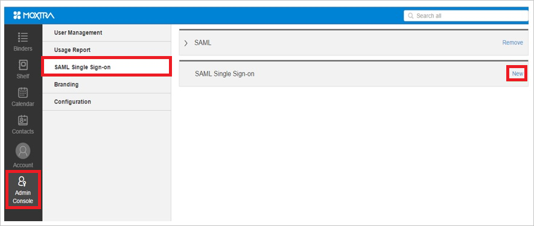

<properties
    pageTitle="Lernprogramm: Azure-Active Directory-Integration in Moxtra | Microsoft Azure"
    description="Informationen Sie zum einmaligen Anmeldens zwischen Azure Active Directory und Moxtra konfigurieren."
    services="active-directory"
    documentationCenter=""
    authors="jeevansd"
    manager="femila"
    editor=""/>

<tags
    ms.service="active-directory"
    ms.workload="identity"
    ms.tgt_pltfrm="na"
    ms.devlang="na"
    ms.topic="article"
    ms.date="10/20/2016"
    ms.author="jeedes"/>

# Lernprogramm: Azure-Active Directory-Integration in Moxtra

Ziel dieses Lernprogramms ist es zu zeigen, wie Sie Moxtra mit Azure Active Directory (Azure AD) integrieren.  
Integration von Moxtra mit Azure AD bietet Ihnen die folgenden Vorteile: 

- Sie können in Azure AD steuern, die auf Moxtra zugreifen 
- Sie können Ihre Benutzer automatisch auf Moxtra (einmaliges Anmelden) mit ihren Konten Azure AD-angemeldete abrufen aktivieren.
- Sie können Ihre Konten an einem zentralen Ort – im klassischen Azure-Portal verwalten.

Wenn Sie weitere Details zu SaaS app-Integration in Azure AD-wissen möchten, finden Sie unter [Was ist Zugriff auf die Anwendung und einmaliges Anmelden mit Azure Active Directory](active-directory-appssoaccess-whatis.md).

## Erforderliche Komponenten 

Zum Konfigurieren von Azure AD-Integration mit Moxtra, benötigen Sie die folgenden Elemente:

- Ein Azure AD-Abonnement
- Eine Moxtra einmaligen Anmeldung aktiviert Abonnement

> [AZURE.NOTE] Wenn Sie um die Schritte in diesem Lernprogramm zu testen, empfehlen wir nicht mit einer Umgebung für die Herstellung.

Führen Sie zum Testen der Schritte in diesem Lernprogramm Tips:

- Sie sollten Ihre Umgebung Herstellung nicht verwenden, es sei denn, dies erforderlich ist.
- Wenn Sie eine Testversion Azure AD-Umgebung besitzen, können Sie eine einen Monat zum Testen [hier](https://azure.microsoft.com/pricing/free-trial/)erhalten. 

 
## Szenario Beschreibung
Ziel dieses Lernprogramms ist, sodass Sie in einer Umgebung für Azure AD-einmaligen Anmeldens testen können.  
In diesem Lernprogramm beschriebenen Szenario besteht aus zwei Hauptfenster Bausteine:

1. Hinzufügen von Moxtra aus dem Katalog 
2. Konfigurieren und Testen Azure AD einmaliges Anmelden

## Hinzufügen von Moxtra aus dem Katalog
Um die Integration der Moxtra in Azure AD zu konfigurieren, müssen Sie Moxtra zu Ihrer Liste der verwalteten SaaS apps aus dem Katalog hinzuzufügen.

**Um Moxtra aus dem Katalog hinzufügen möchten, führen Sie die folgenden Schritte aus:**

1. Klicken Sie im **Azure klassischen Portal**auf der linken Navigationsbereich auf **Active Directory**. 

    ![Active Directory][1]

2. Wählen Sie aus der Liste **Verzeichnis** Verzeichnis für das Sie Verzeichnisintegration aktivieren möchten.

3. Klicken Sie zum Öffnen der Anwendungsansicht in der Verzeichnisansicht im oberen Menü auf **Applications** .

    ![Applikationen][2]

4. Klicken Sie auf **Hinzufügen** , am unteren Rand der Seite.

    ![Applikationen][3]

5. Klicken Sie im Dialogfeld **Was möchten Sie tun** klicken Sie auf **eine Anwendung aus dem Katalog hinzufügen**.

    ![Applikationen][4]

6. Geben Sie im Suchfeld **Moxtra**ein.

    

7. Wählen Sie im Ergebnisbereich **Moxtra aus**, und klicken Sie dann auf **abgeschlossen** , um die Anwendung hinzugefügt haben.

    

##  Konfigurieren und Testen Azure AD einmaliges Anmelden
Das Ziel der in diesem Abschnitt ist erläutert, wie Sie konfigurieren und Testen der Azure AD-einmaliges Anmelden mit Moxtra basierend auf einen Testbenutzer "Britta Simon" bezeichnet.

Für einmaliges Anmelden entwickelt muss Azure AD wissen, was der Benutzer Gegenstück Moxtra an einen Benutzer in Azure AD ist. Kurzum, muss eine Link Beziehung zwischen einem Azure AD-Benutzer und dem entsprechenden Benutzer in Moxtra eingerichtet werden.  
Dieser Link Beziehung wird hergestellt, indem Sie den Wert des **Benutzernamens** in Azure AD als der Wert für den **Benutzernamen** in Moxtra zuweisen.
 
Zum Konfigurieren und Azure AD-einmaliges Anmelden mit Moxtra testen, müssen Sie die folgenden Bausteine durchführen:

1. **[Konfigurieren von Azure AD einmaligen Anmeldens](#configuring-azure-ad-single-single-sign-on)** - damit Ihre Benutzer dieses Feature verwenden können.
2. **[Erstellen einer Azure AD Benutzer testen](#creating-an-azure-ad-test-user)** : Azure AD-einmaliges Anmelden mit Britta Simon testen.
4. **[Erstellen einer Moxtra Benutzer testen](#creating-a-moxtra-test-user)** : ein Gegenstück von Britta Simon in Moxtra haben, die in der Azure AD-Darstellung Ihrer verknüpft ist.
5. **[Testen Sie Benutzer zuweisen Azure AD](#assigning-the-azure-ad-test-user)** - Britta Simon mit Azure AD-einmaliges Anmelden aktivieren.
5. **[Testen der einmaligen Anmeldens](#testing-single-sign-on)** - zur Überprüfung, ob die Konfiguration funktioniert.

### Konfigurieren von Azure AD einmaliges Anmelden

Das Ziel der in diesem Abschnitt ist Azure AD-einmaliges Anmelden im klassischen Azure-Portal aktivieren und konfigurieren einmaliges Anmelden in Ihrer Anwendung Moxtra. 

Die Moxtra-Anwendung erwartet die SAML-Assertionen in einem bestimmten Format, das Hinzufügen von benutzerdefinierten Attribut Zuordnungen zu der Saml-token Attribute Konfiguration erfordert. Das folgende Bildschirmabbild zeigt ein Beispiel dafür.

 

**Führen Sie die folgenden Schritte aus, um Azure AD-einmaliges Anmelden mit Moxtra konfigurieren:**

1. Im Azure klassischen-Portal auf der Seite **Moxtra** Integration Anwendung klicken Sie auf **Konfigurieren einmaligen Anmeldens** zum Öffnen des Dialogfelds **Konfigurieren einmaliges Anmelden** .

    ![Konfigurieren Sie einmaliges Anmelden][6] 

2. Klicken Sie auf der Seite **Wie möchten Sie Benutzer bei der Moxtra auf** **Azure AD einmaliges Anmelden**wählen Sie aus, und klicken Sie dann auf **Weiter**.

     

3. Führen Sie auf der Seite **Einstellungen für die App konfigurieren** Dialogfeld die folgenden Schritte aus:.

     

    ein. Geben Sie in das Textfeld **Melden Sie sich auf URL** den folgenden URL: **https://www.moxtra.com/service/#login**.

    b. Klicken Sie auf **Weiter**.
 
 
4. Klicken Sie auf der Seite **Konfigurieren einmaliges Anmelden bei Moxtra** führen Sie die folgenden Schritte aus:

     

    ein. Klicken Sie auf **Zertifikat herunterladen**, und speichern Sie die Datei auf Ihrem Computer.

    b. Klicken Sie auf **Weiter**.

1. In einem anderen Browserfenster melden Sie sich auf der Website Ihres Unternehmens Moxtra als Administrator.

1. Klicken Sie in der Symbolleiste auf der linken Seite auf **-Verwaltungskonsole > SAML einmaligen Anmeldens**, und klicken Sie dann **neu**.

     

1. Führen Sie auf der Seite **SAML** die folgenden Schritte aus:

     

    ein. Geben Sie in das Textfeld **Name** einen Namen für die Konfiguration (z. B.: *SAML*). 

    b. Im Azure klassischen-Portal auf der Seite **Konfigurieren einmaliges Anmelden bei Moxtra** kopieren Sie den Wert der **Element-ID** , und fügen Sie ihn in das Textfeld **IdP Einheiten ID** . 

    c. Kopieren Sie den Wert **Remote Anmelde-URL** , und fügen Sie ihn in das Textfeld **Anmelde-URL** , im Azure klassischen-Portal auf der Seite **Konfigurieren einmaliges Anmelden bei Moxtra** . 

    d. Klicken Sie in das Textfeld **AuthnContextClassRef** , Tyoe **Urn: Oasis: Namen: Tc: SAML:2.0:ac:classes:Password**.

    e. Im Azure klassischen-Portal auf der Seite **Konfigurieren einmaliges Anmelden bei Moxtra** kopieren Sie des Werts **Bezeichner Namensformat** , und fügen Sie ihn in das Textfeld **NameID-Format** . 

    f. Öffnen des heruntergeladenen Zertifikats in Editor, kopieren Sie den Inhalt aus, und fügen Sie ihn in das Textfeld **Zertifikat** .    

    g. Geben Sie im Textfeld der SAML-e-Mail-Domäne Ihre SAML-e-Mail-Domäne ein.    
   
     > [AZURE.NOTE] Wenn Sie die Schritte zum Überprüfen der Domäne anzeigen möchten, klicken Sie auf das "**i**" unten.

    h. Klicken Sie auf **Aktualisieren**.

6. Im Portal Azure klassischen wählen Sie die Konfiguration für einzelne Zeichen Bestätigung, und klicken Sie dann auf **Weiter**. 

    ![Azure AD einmaliges Anmelden][10]

7. Klicken Sie auf der Seite **Bestätigung für einzelne anmelden** auf **abgeschlossen**.  

    ![Azure AD einmaliges Anmelden][11]

1. Klicken Sie auf **Attributen** , um das Dialogfeld **Token SAML-Attribute** zu öffnen, um benutzerdefinierte Attribut Zuordnungen Konfiguration token Attribute Saml in das Menü im oberen Bereich hinzuzufügen. 

     

1. Führen Sie für jede Datenzeile von in der nachfolgenden Tabelle die folgenden Schritte aus:

  	| Attributname | Attributwert |
  	| ---            | ---             |
  	| Vorname      | Vorname       |
  	| Nachname       | Nachname         |
  	| idpid          | *\<the * *Element-ID* *Wert aus der* *Konfigurieren einmaliges Anmelden bei Moxtra* *Dialogfeld in der klassischen Azure-Portal \> * |

 
    ein. Klicken Sie auf add Benutzerattribut 

     

    b. Klicken Sie im Dialogfeld **Attribut für Benutzer hinzufügen** Geben Sie Attributname und Attributwert für diese Zeile in der Tabelle angezeigt. 

     

    c. Klicken Sie auf **abgeschlossen**.

1. Klicken Sie auf **Änderungen anzuwenden**. 

     

### Erstellen eines Benutzers mit Azure AD-testen
Das Ziel der in diesem Abschnitt besteht im Erstellen eines Testbenutzers aufgerufen Britta Simon im klassischen Azure-Portal.  

![Erstellen von Azure AD-Benutzer][20]

**Führen Sie die folgenden Schritte aus, um einen Testbenutzer in Azure AD zu erstellen:**

1. Klicken Sie im **Azure klassischen Portal**auf der linken Navigationsbereich auf **Active Directory**.

      

2. Wählen Sie aus der Liste **Verzeichnis** Verzeichnis für das Sie Verzeichnisintegration aktivieren möchten.

3. Wenn die Liste der Benutzer, klicken Sie im Menü oben anzeigen möchten, klicken Sie auf **Benutzer**.

     
 
4. Klicken Sie im Dialogfeld **Benutzer hinzufügen** um in der Symbolleiste auf der Unterseite öffnen, auf **Benutzer hinzufügen**. 

     

5. Führen Sie auf der Seite **Teilen Sie uns zu diesem Benutzer** die folgenden Schritte aus: 

      

    ein. Wählen Sie als Typ des Benutzers neuen Benutzer in Ihrer Organisation ein.

    b. Geben Sie den Benutzernamen **Textfeld** **BrittaSimon**ein.

    c. Klicken Sie auf **Weiter**.

6.  Klicken Sie auf der Seite **Benutzerprofil** Dialogfeld führen Sie die folgenden Schritte aus: 

     
 
    ein. Geben Sie im Textfeld **Vorname** **Britta**aus.  

    b. In das letzte Textfeld **Name** , Typ, **Simon**.

    c. Geben Sie im Textfeld **Anzeigename** **Britta Simon**aus.

    d. Wählen Sie in der Liste **Rolle** **Benutzer**aus.
  
    e. Klicken Sie auf **Weiter**.

7. Klicken Sie auf der Seite **erste temporäres Kennwort** auf **Erstellen**.

     
 
8. Klicken Sie auf der Seite **erste temporäres Kennwort** führen Sie die folgenden Schritte aus:

     
  
    ein. Notieren Sie den Wert für das **Neue Kennwort ein**.

    b. Klicken Sie auf **abgeschlossen**.   

  
 
### Erstellen eines Testbenutzers Moxtra

Das Ziel der in diesem Abschnitt ist zum Erstellen eines Benutzers Britta Simon in Moxtra bezeichnet.

**Führen Sie die folgenden Schritte aus, um einen Benutzer namens Britta Simon in Moxtra zu erstellen:**

1. Melden Sie sich für den Zugriff auf Ihre Moxtra Firmenwebsite als Administrator.

1. Klicken Sie in der Symbolleiste auf der linken Seite auf **-Verwaltungskonsole > User Management**, und klicken Sie dann **Benutzer hinzufügen**.

     

1. Klicken Sie im Dialogfeld **Benutzer hinzufügen** führen Sie die folgenden Schritte aus:

    ein. Geben Sie im Textfeld **Vorname** **Britta**aus.

    b. Geben Sie im Textfeld **Nachname** **Simon**aus.

    c. Geben Sie in das Textfeld **E-Mail** Brittas e-Mail-Adresse in der klassischen Azure-Portal aus.

    d. Geben Sie im Textfeld **Division** ein **Entwickler**.

    e. Geben Sie in das Textfeld **Abteilung** **IT**aus.

    f. Wählen Sie **geschulten**aus.

    g. Klicken Sie auf **Hinzufügen**.

### Zuweisen des Azure AD-Test-Benutzers

Das Ziel der in diesem Abschnitt ist für die Aktivierung der Britta Simon Azure einmaliges Anmelden verwenden, indem Sie keinen Zugriff auf Moxtra erteilen.

![Benutzer zuweisen][200] 

**Um Britta Simon Moxtra zuzuweisen, führen Sie die folgenden Schritte aus:**

1. Klicken Sie im Portal Azure klassischen zum Öffnen der Anwendungsansicht in der Verzeichnisansicht klicken Sie auf **Applikationen** im oberen Menü.

    ![Benutzer zuweisen][201] 

2. Wählen Sie in der Liste Applications **Moxtra**.

     

1. Klicken Sie auf **Benutzer**, klicken Sie im Menü oben.

    ![Benutzer zuweisen][203] 

1. Wählen Sie in der Liste Benutzer **Britta Simon**aus.

2. Klicken Sie unten auf der Symbolleiste auf **zuweisen**.

    ![Benutzer zuweisen][205]

### Testen einmaliges Anmelden

Das Ziel der in diesem Abschnitt ist zum Azure AD-einzelne anmelden Überprüfen der Konfiguration mithilfe des Bedienfelds Access.  
Wenn Sie die Kachel Moxtra im Bereich Access klicken, Sie sollten automatisch an Ihrer Anwendung Moxtra angemeldete abrufen.

## Zusätzliche Ressourcen

* [Liste der zum Integrieren SaaS-Apps mit Azure-Active Directory-Lernprogramme](active-directory-saas-tutorial-list.md)
* [Was ist die Anwendungszugriff und einmaliges Anmelden mit Azure Active Directory?](active-directory-appssoaccess-whatis.md)

<!--Image references-->

[1]: ./media/active-directory-saas-moxtra-tutorial/tutorial_general_01.png
[2]: ./media/active-directory-saas-moxtra-tutorial/tutorial_general_02.png
[3]: ./media/active-directory-saas-moxtra-tutorial/tutorial_general_03.png
[4]: ./media/active-directory-saas-moxtra-tutorial/tutorial_general_04.png

[6]: ./media/active-directory-saas-moxtra-tutorial/tutorial_general_05.png
[10]: ./media/active-directory-saas-moxtra-tutorial/tutorial_general_06.png
[11]: ./media/active-directory-saas-moxtra-tutorial/tutorial_general_07.png
[20]: ./media/active-directory-saas-moxtra-tutorial/tutorial_general_100.png

[200]: ./media/active-directory-saas-moxtra-tutorial/tutorial_general_200.png
[201]: ./media/active-directory-saas-moxtra-tutorial/tutorial_general_201.png
[203]: ./media/active-directory-saas-moxtra-tutorial/tutorial_general_203.png
[204]: ./media/active-directory-saas-moxtra-tutorial/tutorial_general_204.png
[205]: ./media/active-directory-saas-moxtra-tutorial/tutorial_general_205.png

