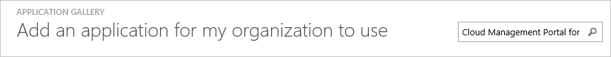
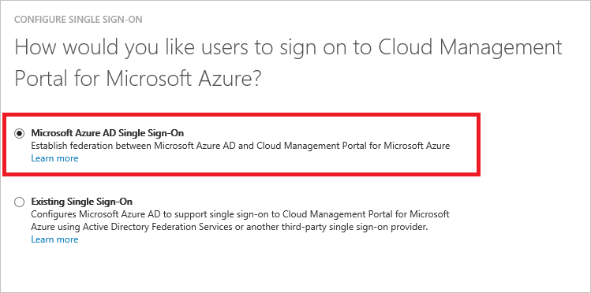
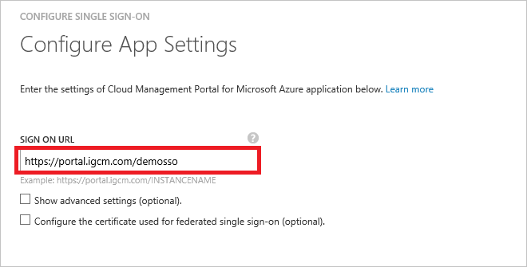
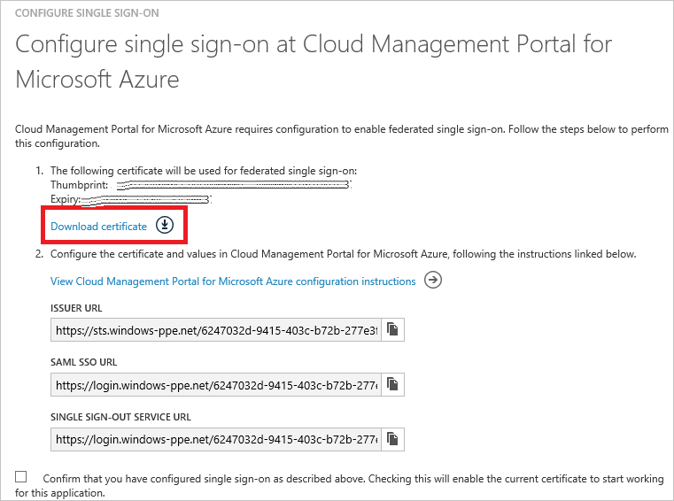
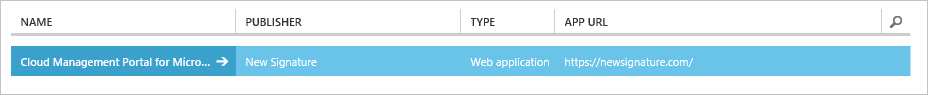

<properties
    pageTitle="Lernprogramm: Azure-Active Directory-Integration in der Cloud-Verwaltungsportal für Microsoft Azure | Microsoft Azure"
    description="Informationen Sie zum einmaligen Anmeldens zwischen Azure Active Directory und Cloud-Verwaltungsportal für Microsoft Azure konfigurieren."
    services="active-directory"
    documentationCenter=""
    authors="jeevansd"
    manager="femila"
    editor=""/>

<tags
    ms.service="active-directory"
    ms.workload="identity"
    ms.tgt_pltfrm="na"
    ms.devlang="na"
    ms.topic="article"
    ms.date="08/16/2016"
    ms.author="jeedes"/>

# Lernprogramm: Azure-Active Directory-Integration in der Cloud-Verwaltungsportal für Microsoft Azure

Ziel dieses Lernprogramms ist zu veranschaulichen Verwaltungsportal für Microsoft Azure Cloud mit Azure Active Directory (Azure AD) integriert werden soll.  
Integrieren von Cloud-Verwaltungsportal für Microsoft Azure in Azure AD bietet Ihnen die folgenden Vorteile:

- Sie können in Azure AD steuern, die für Microsoft Azure Cloud Management-Portal zugreifen
- Sie können Ihre Benutzer automatisch in die Cloud-Verwaltungsportal für Microsoft Azure (einmaliges Anmelden) angemeldete Abrufen mit ihren Azure AD-Konten aktivieren.
- Sie können Ihre Konten an einem zentralen Ort – im klassischen Azure-Portal verwalten.

Wenn Sie weitere Details zu SaaS app-Integration in Azure AD-wissen möchten, finden Sie unter [Was ist Zugriff auf die Anwendung und einmaliges Anmelden mit Azure Active Directory](active-directory-appssoaccess-whatis.md).

## Erforderliche Komponenten

Um Azure AD-Integration mit Cloud-Verwaltungsportal für Microsoft Azure konfigurieren zu können, benötigen Sie die folgenden Elemente:

- Ein Azure AD-Abonnement
- Ein Cloud Verwaltungsportal für Microsoft Azure einmaligen Anmeldung aktiviert Abonnement

> [AZURE.NOTE] Wenn Sie um die Schritte in diesem Lernprogramm zu testen, empfehlen wir nicht mit einer Umgebung für die Herstellung.

Führen Sie zum Testen der Schritte in diesem Lernprogramm Tips:

- Sie sollten Ihre Umgebung Herstellung nicht verwenden, es sei denn, dies erforderlich ist.
- Wenn Sie eine Testversion Azure AD-Umgebung besitzen, können Sie eine einen Monat zum Testen [hier](https://azure.microsoft.com/pricing/free-trial/)erhalten.

## Szenario Beschreibung
Ziel dieses Lernprogramms ist, sodass Sie in einer Umgebung für Azure AD-einmaligen Anmeldens testen können.  
In diesem Lernprogramm beschriebenen Szenario besteht aus zwei Hauptfenster Bausteine:

1. Cloud-Verwaltungsportal für Microsoft Azure aus dem Katalog hinzufügen
2. Konfigurieren und Testen Azure AD einmaliges Anmelden

## Cloud-Verwaltungsportal für Microsoft Azure aus dem Katalog hinzufügen
Um die Integration der Cloud-Verwaltungsportal für Microsoft Azure in Azure AD konfigurieren zu können, müssen Sie Cloud-Verwaltungsportal für Microsoft Azure aus dem Katalog zu Ihrer Liste der verwalteten SaaS apps hinzufügen.

**Wenn Cloud-Verwaltungsportal für Microsoft Azure aus dem Katalog hinzufügen möchten, führen Sie die folgenden Schritte aus:**

1. Klicken Sie im **Azure klassischen Portal**auf der linken Navigationsbereich auf **Active Directory**. 

    ![Active Directory][1]

2. Wählen Sie aus der Liste **Verzeichnis** Verzeichnis für das Sie Verzeichnisintegration aktivieren möchten.

3. Klicken Sie zum Öffnen der Anwendungsansicht in der Verzeichnisansicht im oberen Menü auf **Applications** .

    ![Applikationen][2]

4. Klicken Sie auf **Hinzufügen** , am unteren Rand der Seite.

    ![Applikationen][3]

5. Klicken Sie im Dialogfeld **Was möchten Sie tun** klicken Sie auf **eine Anwendung aus dem Katalog hinzufügen**.

    ![Applikationen][4]

6. Geben Sie in das Suchfeld **Cloud-Verwaltungsportal für Microsoft Azure**ein.

    

7. Im Bereich Ergebnisse wählen Sie **Cloud-Verwaltungsportal für Microsoft Azure aus**und dann auf **abgeschlossen** , um die Anwendung hinzuzufügen.

    

##  Konfigurieren und Testen Azure AD einmaliges Anmelden
Das Ziel der in diesem Abschnitt ist erläutert, wie Sie konfigurieren und Testen der Azure AD-einmaliges Anmelden mit Cloud-Verwaltungsportal für Microsoft Azure basierend auf einen Testbenutzer "Britta Simon" bezeichnet.

Für einmaliges Anmelden entwickelt muss Azure AD Gegenstück Benutzer im Verwaltungsportal für Microsoft Azure Cloud an einen Benutzer in Azure AD kennen. Kurzum, muss eine Link Beziehung zwischen einem Azure AD-Benutzer und dem entsprechenden Benutzer in der Cloud-Verwaltungsportal für Microsoft Azure eingerichtet werden.  
Dieser Link Beziehung wird hergestellt, indem Sie den Wert des **Benutzernamens** in Azure AD als der Wert für den **Benutzernamen** in der Cloud-Verwaltungsportal für Microsoft Azure zuweisen.

Zum Konfigurieren und Azure AD-einmaliges Anmelden mit Cloud-Verwaltungsportal für Microsoft Azure testen, müssen Sie die folgenden Bausteine durchführen:

1. **[Konfigurieren von Azure AD einmaligen Anmeldens](#configuring-azure-ad-single-single-sign-on)** - damit Ihre Benutzer dieses Feature verwenden können.
2. **[Erstellen einer Azure AD Benutzer testen](#creating-an-azure-ad-test-user)** : Azure AD-einmaliges Anmelden mit Britta Simon testen.
4. **[Erstellen ein Cloud Verwaltungsportal für Microsoft Azure testen Benutzer](#creating-a-newsignature-test-user)** : ein Gegenstück von Britta Simon in die Cloud-Verwaltungsportal für Microsoft Azure haben, die in der Azure AD-Darstellung Ihrer verknüpft ist.
5. **[Testen Sie Benutzer zuweisen Azure AD](#assigning-the-azure-ad-test-user)** - Britta Simon mit Azure AD-einmaliges Anmelden aktivieren.
5. **[Testen der einmaligen Anmeldens](#testing-single-sign-on)** - zur Überprüfung, ob die Konfiguration funktioniert.

### Konfigurieren von Azure AD einmaliges Anmelden

Das Ziel der in diesem Abschnitt ist Azure AD-einmaliges Anmelden im klassischen Azure-Portal aktivieren und konfigurieren einmaliges Anmelden in der Cloud-Verwaltungsportal für Microsoft Azure-Anwendung.

**Führen Sie die folgenden Schritte aus, um Azure AD-einmaliges Anmelden mit Cloud-Verwaltungsportal für Microsoft Azure konfigurieren:**

1. Im Azure klassischen-Portal auf der Seite **Cloud-Verwaltungsportal für Microsoft Azure** Integration Anwendung klicken Sie auf **Konfigurieren einmaligen Anmeldens** zum Öffnen des Dialogfelds **Konfigurieren einmaliges Anmelden** .

    ![Konfigurieren Sie einmaliges Anmelden][6] 

2. Klicken Sie auf der Seite **Wie möchten Sie Benutzer bei der Cloud-Verwaltungsportal für Microsoft Azure auf** **Azure AD einmaliges Anmelden**wählen Sie aus, und klicken Sie dann auf **Weiter**.

     

3. Führen Sie auf der Seite **Einstellungen für die App konfigurieren** Dialogfeld die folgenden Schritte aus:.

     

    ein. Geben Sie in das Textfeld **Melden Sie sich auf URL** die URL Ihrer Benutzer melden Sie sich für den Zugriff auf Ihre Cloud-Verwaltungsportal für Microsoft Azure-Anwendung unter Verwendung des folgenden Musters untersuchten aus:`https://portal.igcm.com/<instance name>`

    b. Klicken Sie auf **Weiter**.

4. Führen Sie auf der Seite **Konfigurieren einmaliges Anmelden bei der Cloud-Verwaltungsportal für Microsoft Azure** die folgenden Schritte aus:

     

    ein. Klicken Sie auf **Zertifikat herunterladen**, und speichern Sie die Datei auf Ihrem Computer.

    b. Klicken Sie auf **Weiter**.

5. Wenn für die Anwendung konfigurierten SSO erhalten möchten, wenden Sie sich an Ihre Cloud-Verwaltungsportal für Microsoft Azure-Supportteam bei [jczernuszka@newsignature.com](mailTo:jczernuszka@newsignature.com) und e-Mail-die heruntergeladene Zertifikatsdatei anfügen. Auch führen Sie geben Sie die URL des Herausgebers, SAML SSO-URL und einzelne Zeichen, Service URL, damit sie für die Integration von SSO konfiguriert werden können.

6. Im Portal Azure klassischen wählen Sie die Konfiguration für einzelne Zeichen Bestätigung, und klicken Sie dann auf **Weiter**.

    ![Azure AD einmaliges Anmelden][10]

7. Klicken Sie auf der Seite **Bestätigung für einzelne anmelden** auf **abgeschlossen**.  

    ![Azure AD einmaliges Anmelden][11]

### Erstellen eines Benutzers mit Azure AD-testen
Das Ziel der in diesem Abschnitt besteht im Erstellen eines Testbenutzers aufgerufen Britta Simon im klassischen Azure-Portal.  

![Erstellen von Azure AD-Benutzer][20]

**Führen Sie die folgenden Schritte aus, um einen Testbenutzer in Azure AD zu erstellen:**

1. Klicken Sie im **Azure klassischen Portal**auf der linken Navigationsbereich auf **Active Directory**.

     

2. Wählen Sie aus der Liste **Verzeichnis** Verzeichnis für das Sie Verzeichnisintegration aktivieren möchten.

3. Wenn die Liste der Benutzer, klicken Sie im Menü oben anzeigen möchten, klicken Sie auf **Benutzer**.

     

4. Klicken Sie im Dialogfeld **Benutzer hinzufügen** um in der Symbolleiste auf der Unterseite öffnen, auf **Benutzer hinzufügen**.

     

5. Führen Sie auf der Seite **Teilen Sie uns zu diesem Benutzer** die folgenden Schritte aus:

     

    ein. Wählen Sie als Typ des Benutzers neuen Benutzer in Ihrer Organisation ein.

    b. Geben Sie den Benutzernamen **Textfeld** **BrittaSimon**ein.

    c. Klicken Sie auf **Weiter**.

6.  Klicken Sie auf der Seite **Benutzerprofil** Dialogfeld führen Sie die folgenden Schritte aus:

     

    ein. Geben Sie im Textfeld **Vorname** **Britta**aus.  

    b. In das letzte Textfeld **Name** , Typ, **Simon**.

    c. Geben Sie im Textfeld **Anzeigename** **Britta Simon**aus.

    d. Wählen Sie in der Liste **Rolle** **Benutzer**aus.

    e. Klicken Sie auf **Weiter**.

7. Klicken Sie auf der Seite **erste temporäres Kennwort** auf **Erstellen**.

     

8. Führen Sie auf der Seite **erste temporäres Kennwort** die folgenden Schritte aus:

     

    ein. Notieren Sie den Wert für das **Neue Kennwort ein**.

    b. Klicken Sie auf **abgeschlossen**.   

### Erstellen ein Cloud Verwaltungsportal für Microsoft Azure Testbenutzers

Das Ziel der in diesem Abschnitt ist zum Erstellen eines Benutzers Britta Simon in die Cloud-Verwaltungsportal für Microsoft Azure bezeichnet. Arbeiten Sie mit der Cloud Verwaltungsportal für Microsoft Azure-Supportteam, über die Benutzer in der Cloud-Verwaltungsportal für Microsoft Azure-Konto hinzufügen. 

> [AZURE.NOTE]Wenn Sie einen Benutzer manuell erstellen müssen, müssen Sie die Cloud-Verwaltungsportal für Microsoft Azure-Supportteam wenden Sie sich an.

### Zuweisen des Azure AD-Test-Benutzers

Das Ziel der in diesem Abschnitt ist für die Aktivierung der Britta Simon Azure einmaliges Anmelden verwenden, indem Sie keinen Zugriff auf Cloud-Verwaltungsportal für Microsoft Azure erteilen.

![Benutzer zuweisen][200] 

**Um Cloud-Verwaltungsportal für Microsoft Azure Britta Simon zuzuweisen, führen Sie die folgenden Schritte aus:**

1. Klicken Sie im Portal Azure klassischen zum Öffnen der Anwendungsansicht in der Verzeichnisansicht klicken Sie auf **Applikationen** im oberen Menü.

    ![Benutzer zuweisen][201] 

2. Wählen Sie in der Liste Applikationen **Cloud-Verwaltungsportal für Microsoft Azure**ein.

     

1. Klicken Sie auf **Benutzer**, klicken Sie im Menü oben.

    ![Benutzer zuweisen][203] 

1. Wählen Sie in der Liste Benutzer **Britta Simon**aus.

2. Klicken Sie unten auf der Symbolleiste auf **zuweisen**.

    ![Benutzer zuweisen][205]

### Testen einmaliges Anmelden

Das Ziel der in diesem Abschnitt ist zum Azure AD-einzelne anmelden Überprüfen der Konfiguration mithilfe des Bedienfelds Access.  
Wenn Sie die Cloud-Verwaltungsportal für Microsoft Azure-Kachel im Bereich Access klicken, Sie sollten automatisch in der Cloud-Verwaltungsportal für Microsoft Azure-Anwendung angemeldete abrufen.

## Zusätzliche Ressourcen

* [Liste der zum Integrieren SaaS-Apps mit Azure-Active Directory-Lernprogramme](active-directory-saas-tutorial-list.md)
* [Was ist die Anwendungszugriff und einmaliges Anmelden mit Azure Active Directory?](active-directory-appssoaccess-whatis.md)

<!--Image references-->

[1]: ./media/active-directory-saas-newsignature-tutorial/tutorial_general_01.png
[2]: ./media/active-directory-saas-newsignature-tutorial/tutorial_general_02.png
[3]: ./media/active-directory-saas-newsignature-tutorial/tutorial_general_03.png
[4]: ./media/active-directory-saas-newsignature-tutorial/tutorial_general_04.png

[6]: ./media/active-directory-saas-newsignature-tutorial/tutorial_general_05.png
[10]: ./media/active-directory-saas-newsignature-tutorial/tutorial_general_06.png
[11]: ./media/active-directory-saas-newsignature-tutorial/tutorial_general_07.png
[20]: ./media/active-directory-saas-newsignature-tutorial/tutorial_general_100.png

[200]: ./media/active-directory-saas-newsignature-tutorial/tutorial_general_200.png
[201]: ./media/active-directory-saas-newsignature-tutorial/tutorial_general_201.png
[203]: ./media/active-directory-saas-newsignature-tutorial/tutorial_general_203.png
[204]: ./media/active-directory-saas-newsignature-tutorial/tutorial_general_204.png
[205]: ./media/active-directory-saas-newsignature-tutorial/tutorial_general_205.png
