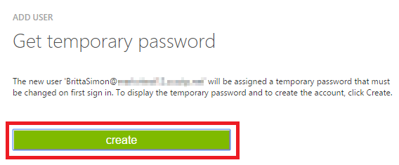

<properties
    pageTitle="Lernprogramm: Azure-Active Directory-Integration in O.C. Hertwig - AppreciateHub | Microsoft Azure"
    description="Informationen Sie zum Konfigurieren der einmaligen Anmeldens zwischen Azure Active Directory und O.C. Hertwig - AppreciateHub."
    services="active-directory"
    documentationCenter=""
    authors="jeevansd"
    manager="femila"
    editor=""/>

<tags
    ms.service="active-directory"
    ms.workload="identity"
    ms.tgt_pltfrm="na"
    ms.devlang="na"
    ms.topic="article"
    ms.date="08/16/2016"
    ms.author="jeedes"/>

# Lernprogramm: Azure-Active Directory-Integration in O.C. Hertwig - AppreciateHub

Das Ziel dieses Lernprogramms besteht darin, die zeigen, wie Sie O.C. integrieren. Hertwig - AppreciateHub mit Azure Active Directory (Azure AD).  
Integration von O.C. Hertwig - bietet AppreciateHub mit Azure AD Ihnen die folgenden Vorteile: 

- Sie können in Azure AD steuern, die auf O.C. zugreifen Hertwig - AppreciateHub 
- Sie können Ihre Benutzer automatisch auf O.C. angemeldete abrufen aktivieren. Hertwig - AppreciateHub (einmaliges Anmelden) mit ihren Azure AD-Konten
- Sie können Ihre Konten an einem zentralen Ort – im klassischen Azure-Portal verwalten.

Wenn Sie weitere Details zu SaaS app-Integration in Azure AD-wissen möchten, finden Sie unter [Was ist Zugriff auf die Anwendung und einmaliges Anmelden mit Azure Active Directory](active-directory-appssoaccess-whatis.md).

## Erforderliche Komponenten 

So konfigurieren Sie Azure AD-Integration mit O.C. Hertwig - AppreciateHub, benötigen Sie die folgenden Elemente:

- Ein Azure AD-Abonnement
- EINE O.C. Hertwig - AppreciateHub einmaligen Anmeldung aktiviert Abonnement

> [AZURE.NOTE] Wenn Sie um die Schritte in diesem Lernprogramm zu testen, empfehlen wir nicht mit einer Umgebung für die Herstellung.

Führen Sie zum Testen der Schritte in diesem Lernprogramm Tips:

- Sie sollten Ihre Umgebung Herstellung nicht verwenden, es sei denn, dies erforderlich ist.
- Wenn Sie eine Testversion Azure AD-Umgebung besitzen, können Sie eine einen Monat zum Testen [hier](https://azure.microsoft.com/pricing/free-trial/)erhalten. 

 
## Szenario Beschreibung
Ziel dieses Lernprogramms ist, sodass Sie in einer Umgebung für Azure AD-einmaligen Anmeldens testen können.  
In diesem Lernprogramm beschriebenen Szenario besteht aus drei wichtigsten Bausteine:

1. Hinzufügen von O.C. Hertwig - AppreciateHub aus dem Katalog 
2. Konfigurieren und Testen Azure AD einmaliges Anmelden

## Hinzufügen von O.C. Hertwig - AppreciateHub aus dem Katalog
So konfigurieren Sie die Integration von O.C. Hertwig - AppreciateHub in Azure AD, müssen Sie O.C. hinzufügen Hertwig - AppreciateHub aus dem Katalog zu Ihrer Liste der verwalteten SaaS apps.

**Zum Hinzufügen von O.C. Kunze - AppreciateHub aus dem Katalog, führen Sie die folgenden Schritte aus:**

1. Klicken Sie im **Azure klassischen Portal**auf der linken Navigationsbereich auf **Active Directory**. 

    ![Active Directory][1] 

2. Wählen Sie aus der Liste **Verzeichnis** Verzeichnis für das Sie Verzeichnisintegration aktivieren möchten.

3. Klicken Sie zum Öffnen der Anwendungsansicht in der Verzeichnisansicht im oberen Menü auf **Applications** .

    ![Applikationen][2] 

4. Klicken Sie auf **Hinzufügen** , am unteren Rand der Seite.

    ![Applikationen][3] 

5. Klicken Sie im Dialogfeld **Was möchten Sie tun** klicken Sie auf **eine Anwendung aus dem Katalog hinzufügen**.

    ![Applikationen][4] 

6. Geben Sie im Suchfeld **O.C. Kunze - AppreciateHub**aus.

    ![Applikationen][5] 

7. Im Bereich Ergebnisse wählen Sie **O.C. Kunze - AppreciateHub aus**und dann auf **abgeschlossen** , um die Anwendung hinzuzufügen.

    ![Applikationen][25] 

##  Konfigurieren und Testen Azure AD einmaliges Anmelden

Das Ziel der in diesem Abschnitt besteht darin, die erläutert, wie Sie konfigurieren und Azure AD-einmaliges Anmelden mit O.C. testen Hertwig - AppreciateHub Grundlage eines Namens "Britta Simon" Testbenutzers an.

Für einmaliges Anmelden entwickelt muss Azure AD wissen, welche Gegenstück Benutzer im O.C. Hertwig - ist AppreciateHub an einen Benutzer in Azure Active Directory. Kurzum, eine Link Beziehung zwischen einem Azure AD-Benutzer und dem entsprechenden Benutzer in O.C. Hertwig - AppreciateHub hergestellt werden muss.  
Diese Verknüpfung Beziehung wird hergestellt, indem Sie den Wert des **Benutzernamens** in Azure AD als der Wert für den **Benutzernamen** in O.C. zuweisen Hertwig - AppreciateHub.
 
Konfigurieren und Azure AD-einmaliges Anmelden mit O.C. testen Hertwig - AppreciateHub, müssen Sie die folgenden Bausteine durchführen:

1. **[Konfigurieren von Azure AD einmaligen Anmeldens](#configuring-azure-ad-single-single-sign-on)** - damit Ihre Benutzer dieses Feature verwenden können.
2. **[Erstellen einer Azure AD Benutzer testen](#creating-an-azure-ad-test-user)** : Azure AD-einmaliges Anmelden mit Britta Simon testen.
4. **[Erstellen einer O.C. Kunze - Testbenutzer AppreciateHub](#creating-a-halogen-software-test-user)** - ein Gegenstück von Britta Simon in O.C. haben. Hertwig - AppreciateHub, die in der Azure AD-Darstellung Ihrer verknüpft ist.
5. **[Testen Sie Benutzer zuweisen Azure AD](#assigning-the-azure-ad-test-user)** - Britta Simon mit Azure AD-einmaliges Anmelden aktivieren.
5. **[Testen der einmaligen Anmeldens](#testing-single-sign-on)** - zur Überprüfung, ob die Konfiguration funktioniert.

### Konfigurieren von Azure AD einmaliges Anmelden

In diesem Abschnitt Ziel ist es Azure AD-einmaliges Anmelden im klassischen Azure-Portal aktivieren und konfigurieren einmaliges Anmelden in Ihrer O.C. Hertwig - Anwendung AppreciateHub.

**Zum Konfigurieren Azure AD-einmaliges Anmelden mit O.C. Kunze - AppreciateHub, führen Sie die folgenden Schritte aus:**

1. Im Azure klassischen-Portal auf der Seite **O.C. Kunze - AppreciateHub** Integration Anwendung klicken Sie auf **Konfigurieren einmaligen Anmeldens** zum Öffnen des Dialogfelds **Konfigurieren einmaliges Anmelden** .

    ![Konfigurieren Sie einmaliges Anmelden][6]

2. Klicken Sie auf der Seite **Wie möchten Sie Benutzer bei der O.C. Kunze - AppreciateHub auf** **Azure AD einmaliges Anmelden**wählen Sie aus, und klicken Sie dann auf **Weiter**.

    ![Azure AD einmaliges Anmelden][7]

3. Führen Sie auf der Seite Dialogfeld **Konfigurieren der App-Einstellungen** die folgenden Schritte aus:

    ![Konfigurieren der App-Einstellungen][8]
 
     ein. Öffnen Sie die Metadatendatei, die mit den folgenden Link: [https://fed.appreciatehub.com/fed/sp/metadata](https://fed.appreciatehub.com/fed/sp/metadata).

     b. Suchen Sie nach dem **Md:AssertionConsumerService** Knoten. 

     c. Kopieren Sie den Wert für das Attribut **Position** ein. 

     ![Konfigurieren der App-Einstellungen][12]
     
     d. **Melden Sie sich auf URL** im Textfeld hinter den Wert haben Sie im vorherigen Schritt erhalten.

     > [AZURE.NOTE] Wenn Sie Expiriencing Probleme Abrufen der Antwort-URL aus der Metadatendatei sind, wenden Sie sich an den O.C. Hertwig - Supportteam über AppreciateHub [sso@octanner.com](mailto:sso@octanner.com).

     e. Klicken Sie auf **Weiter**.
 
4. Klicken Sie auf der Seite **Konfigurieren einmaliges Anmelden bei O.C. Kunze - AppreciateHub** klicken Sie auf **Herunterladen von Metadaten**, und speichern Sie die Metadatendatei lokal auf Ihrem Computer.

    ![Was ist Azure AD-Verbindung herstellen][9]

5. Wenden Sie sich an den O.C. Hertwig - Supportteam über Xyz, AppreciateHub bieten sie Metadaten-Datei, und sie informieren, dass SSO für Sie aktiviert werden sollten.

6. Klicken Sie im Portal Azure klassischen wählen Sie die Bestätigung Konfiguration für einzelne Zeichen, und klicken Sie dann auf **Weiter**. 

    ![Was ist Azure AD-Verbindung herstellen][10]

7. Klicken Sie auf der Seite **Bestätigung für einzelne anmelden** auf **abgeschlossen**.  

    ![Was ist Azure AD-Verbindung herstellen][11]

### Erstellen eines Benutzers mit Azure AD-testen
Das Ziel der in diesem Abschnitt besteht im Erstellen eines Testbenutzers aufgerufen Britta Simon im klassischen Azure-Portal.  

![Erstellen von Azure AD-Benutzer][20]

**Führen Sie die folgenden Schritte aus, um einen Testbenutzer in Azure AD zu erstellen:**

1. Klicken Sie im **Azure klassischen Portal**auf der linken Navigationsbereich auf **Active Directory**.

     

2. Wählen Sie aus der Liste **Verzeichnis** Verzeichnis für das Sie Verzeichnisintegration aktivieren möchten.

3. Wenn die Liste der Benutzer, klicken Sie im Menü oben anzeigen möchten, klicken Sie auf **Benutzer**.

     
 
4. Klicken Sie im Dialogfeld **Benutzer hinzufügen** um in der Symbolleiste auf der Unterseite öffnen, auf **Benutzer hinzufügen**. 

     

5. Führen Sie auf der Seite **Teilen Sie uns zu diesem Benutzer** die folgenden Schritte aus: 

     

    ein. Wählen Sie als Typ des Benutzers neuen Benutzer in Ihrer Organisation ein.

    b. Geben Sie den Benutzernamen **Textfeld** **BrittaSimon**ein.

    c. Klicken Sie auf **Weiter**.

6.  Klicken Sie auf der Seite **Benutzerprofil** Dialogfeld führen Sie die folgenden Schritte aus: 

    
 
    ein. Geben Sie im Textfeld **Vorname** **Britta**aus.  

    b. In das letzte Textfeld **Name** , Typ, **Simon**.

    c. Geben Sie im Textfeld **Anzeigename** **Britta Simon**aus.

    d. Wählen Sie in der Liste **Rolle** **Benutzer**aus.
    e. Klicken Sie auf **Weiter**.

7. Klicken Sie auf der Seite **erste temporäres Kennwort** auf **Erstellen**.

     
 
8. Klicken Sie auf der Seite **erste temporäres Kennwort** führen Sie die folgenden Schritte aus:

     
  
    ein. Notieren Sie den Wert für das **Neue Kennwort ein**.

    b. Klicken Sie auf **abgeschlossen**.   

  
 
### Erstellen einer O.C. Hertwig - Testbenutzer AppreciateHub

Das Ziel der in diesem Abschnitt wird zum Erstellen eines Benutzers Britta Simon in O.C. aufgerufen Hertwig - AppreciateHub.

**Zum Erstellen eines Benutzers aufgerufen Britta Simon in O.C. Kunze - AppreciateHub, führen Sie die folgenden Schritte aus:**

1. Bitten Sie Ihrem Supportteam OC Kunze zum Erstellen eines Benutzers, das als NameID Attribut den gleichen Wert wie der Benutzername, der Britta Simon in Azure AD enthält.

### Zuweisen des Azure AD-Test-Benutzers

In diesem Abschnitt Ziel ist es für die Aktivierung der Britta Simon Azure einmaliges Anmelden verwenden, indem Sie keinen Zugriff auf O.C. erteilen Hertwig - AppreciateHub.

![Benutzer zuweisen][200]

**Führen Sie die folgenden Schritte aus, um Britta Simon O.C. Kunze - AppreciateHub, zuzuweisen:**

1. Klicken Sie im Portal Azure klassischen zum Öffnen der Anwendungsansicht in der Verzeichnisansicht klicken Sie auf **Applikationen** im oberen Menü.

    ![Benutzer zuweisen][201]

2. Wählen Sie in der Liste Applications **O.C. Kunze - AppreciateHub**aus.

    ![Benutzer zuweisen][202]

1. Klicken Sie auf **Benutzer**, klicken Sie im Menü oben.

    ![Benutzer zuweisen][203]

1. Wählen Sie in der Liste Benutzer **Britta Simon**aus.

2. Klicken Sie unten auf der Symbolleiste auf **zuweisen**.

    ![Benutzer zuweisen][205]

### Testen einmaliges Anmelden

Das Ziel der in diesem Abschnitt ist zum Azure AD-einzelne anmelden Überprüfen der Konfiguration mithilfe des Bedienfelds Access.  
Beim Klicken auf die O.C. Hertwig - AppreciateHub Kachel im Bereich Access Sie sollten erhalten automatisch angemeldet für den Zugriff auf Ihre O.C. Hertwig - Anwendung AppreciateHub.

## Zusätzliche Ressourcen

* [Liste der zum Integrieren SaaS-Apps mit Azure-Active Directory-Lernprogramme](active-directory-saas-tutorial-list.md)
* [Was ist die Anwendungszugriff und einmaliges Anmelden mit Azure Active Directory?](active-directory-appssoaccess-whatis.md)

<!--Image references-->
[1]: ./media/active-directory-saas-oc-tanner-tutorial/tutorial_general_01.png
[2]: ./media/active-directory-saas-oc-tanner-tutorial/tutorial_general_02.png
[3]: ./media/active-directory-saas-oc-tanner-tutorial/tutorial_general_03.png
[4]: ./media/active-directory-saas-oc-tanner-tutorial/tutorial_general_04.png
[5]: ./media/active-directory-saas-oc-tanner-tutorial/tutorial_octanner_01.png
[25]: ./media/active-directory-saas-oc-tanner-tutorial/tutorial_octanner_25.png

[6]: ./media/active-directory-saas-oc-tanner-tutorial/tutorial_general_05.png
[7]: ./media/active-directory-saas-oc-tanner-tutorial/tutorial_octanner_02.png
[8]: ./media/active-directory-saas-oc-tanner-tutorial/tutorial_octanner_03.png
[9]: ./media/active-directory-saas-oc-tanner-tutorial/tutorial_octanner_04.png
[10]: ./media/active-directory-saas-oc-tanner-tutorial/tutorial_octanner_05.png
[11]: ./media/active-directory-saas-oc-tanner-tutorial/tutorial_octanner_06.png
[12]: ./media/active-directory-saas-oc-tanner-tutorial/tutorial_octanner_08.png
[20]: ./media/active-directory-saas-oc-tanner-tutorial/tutorial_general_100.png

[200]: ./media/active-directory-saas-oc-tanner-tutorial/tutorial_general_200.png
[201]: ./media/active-directory-saas-oc-tanner-tutorial/tutorial_general_201.png
[202]: ./media/active-directory-saas-oc-tanner-tutorial/tutorial_octanner_07.png
[203]: ./media/active-directory-saas-oc-tanner-tutorial/tutorial_general_203.png
[204]: ./media/active-directory-saas-oc-tanner-tutorial/tutorial_general_204.png
[205]: ./media/active-directory-saas-oc-tanner-tutorial/tutorial_general_205.png

