<properties
    pageTitle="Lernprogramm: Azure-Active Directory-Integration in OpsGenie | Microsoft Azure"
    description="Informationen Sie zum einmaligen Anmeldens zwischen Azure Active Directory und OpsGenie konfigurieren."
    services="active-directory"
    documentationCenter=""
    authors="jeevansd"
    manager="femila"
    editor=""/>

<tags
    ms.service="active-directory"
    ms.workload="identity"
    ms.tgt_pltfrm="na"
    ms.devlang="na"
    ms.topic="article"
    ms.date="10/07/2016"
    ms.author="jeedes"/>

# Lernprogramm: Azure-Active Directory-Integration in OpsGenie

Ziel dieses Lernprogramms ist es zu zeigen, wie Sie OpsGenie mit Azure Active Directory (Azure AD) integrieren.

Integration von OpsGenie mit Azure AD bietet Ihnen die folgenden Vorteile:

- Sie können in Azure AD steuern, die auf OpsGenie zugreifen
- Sie können Ihre Benutzer automatisch auf OpsGenie (einmaliges Anmelden) mit ihren Konten Azure AD-angemeldete abrufen aktivieren.
- Sie können Ihre Konten an einem zentralen Ort – im klassischen Azure-Portal verwalten.

Wenn Sie weitere Details zu SaaS app-Integration in Azure AD-wissen möchten, finden Sie unter [Was ist Zugriff auf die Anwendung und einmaliges Anmelden mit Azure Active Directory](active-directory-appssoaccess-whatis.md).

## Erforderliche Komponenten

Zum Konfigurieren von Azure AD-Integration mit OpsGenie, benötigen Sie die folgenden Elemente:

- Ein Azure AD-Abonnement
- Eine OpsGenie einmaliges Anmelden aktiviert Abonnement

> [AZURE.NOTE] Wenn Sie um die Schritte in diesem Lernprogramm zu testen, empfehlen wir nicht mit einer Umgebung für die Herstellung.

Führen Sie zum Testen der Schritte in diesem Lernprogramm Tips:

- Sie sollten Ihre Umgebung Herstellung nicht verwenden, es sei denn, dies erforderlich ist.
- Wenn Sie eine Testversion Azure AD-Umgebung besitzen, können Sie eine einen Monat zum Testen [hier](https://azure.microsoft.com/pricing/free-trial/)erhalten.

## Szenario Beschreibung
Ziel dieses Lernprogramms ist, sodass Sie in einer Umgebung für Azure AD-einmaligen Anmeldens testen können. 

In diesem Lernprogramm beschriebenen Szenario besteht aus zwei Hauptfenster Bausteine:

1. Hinzufügen von OpsGenie aus dem Katalog
2. Konfigurieren und Testen Azure AD einmaliges Anmelden

## Hinzufügen von OpsGenie aus dem Katalog
Um die Integration der OpsGenie in Azure AD zu konfigurieren, müssen Sie OpsGenie zu Ihrer Liste der verwalteten SaaS apps aus dem Katalog hinzuzufügen.

**Um OpsGenie aus dem Katalog hinzufügen möchten, führen Sie die folgenden Schritte aus:**

1. Klicken Sie im **Azure klassischen Portal**auf der linken Navigationsbereich auf **Active Directory**. 

    ![Active Directory][1]

2. Wählen Sie aus der Liste **Verzeichnis** Verzeichnis für das Sie Verzeichnisintegration aktivieren möchten.

3. Klicken Sie zum Öffnen der Anwendungsansicht in der Verzeichnisansicht im oberen Menü auf **Applications** .

    ![Applikationen][2]

4. Klicken Sie auf **Hinzufügen** , am unteren Rand der Seite.

    ![Applikationen][3]

5. Klicken Sie im Dialogfeld **Was möchten Sie tun** klicken Sie auf **eine Anwendung aus dem Katalog hinzufügen**.

    ![Applikationen][4]

6. Geben Sie im Suchfeld **OpsGenie**ein.

    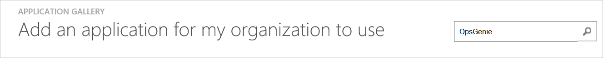

7. Wählen Sie im Ergebnisbereich **OpsGenie aus**, und klicken Sie dann auf **abgeschlossen** , um die Anwendung hinzugefügt haben.

    

##  Konfigurieren und Testen Azure AD einmaliges Anmelden
Das Ziel der in diesem Abschnitt ist erläutert, wie Sie konfigurieren und Testen der Azure AD-einmaliges Anmelden mit OpsGenie basierend auf einen Testbenutzer "Britta Simon" bezeichnet.

Für einmaliges Anmelden entwickelt muss Azure AD den Benutzer Gegenstück OpsGenie einem Benutzer in Azure AD kennen. Kurzum, muss eine Link Beziehung zwischen einem Azure AD-Benutzer und dem entsprechenden Benutzer in OpsGenie eingerichtet werden.

Dieser Link Beziehung wird hergestellt, indem Sie den Wert des **Benutzernamens** in Azure AD als der Wert für den **Benutzernamen** in OpsGenie zuweisen.

Zum Konfigurieren und Azure AD-einmaliges Anmelden mit OpsGenie testen, müssen Sie die folgenden Bausteine durchführen:

1. **[Konfigurieren von Azure AD einmaligen Anmeldens](#configuring-azure-ad-single-single-sign-on)** - damit Ihre Benutzer dieses Feature verwenden können.
2. **[Erstellen einer Azure AD Benutzer testen](#creating-an-azure-ad-test-user)** : Azure AD-einmaliges Anmelden mit Britta Simon testen.
4. **[Erstellen einer OpsGenie Benutzer testen](#creating-a-opsgenie-test-user)** : ein Gegenstück von Britta Simon in OpsGenie haben, die in der Azure AD-Darstellung Ihrer verknüpft ist.
5. **[Testen Sie Benutzer zuweisen Azure AD](#assigning-the-azure-ad-test-user)** - Britta Simon mit Azure AD-einmaliges Anmelden aktivieren.
5. **[Testen der einmaligen Anmeldens](#testing-single-sign-on)** - zur Überprüfung, ob die Konfiguration funktioniert.

### Konfigurieren von Azure AD-einmaliges Anmelden

Das Ziel der in diesem Abschnitt ist Azure AD-einmaliges Anmelden im klassischen Azure-Portal aktivieren und konfigurieren einmaliges Anmelden in Ihrer Anwendung OpsGenie.

**Führen Sie die folgenden Schritte aus, um Azure AD-einmaliges Anmelden mit OpsGenie konfigurieren:**

1. Im Azure klassischen-Portal auf der Seite **OpsGenie** Integration Anwendung klicken Sie auf **Konfigurieren einmaligen Anmeldens** zum Öffnen des Dialogfelds **Konfigurieren einmaliges Anmelden** .

    ![Konfigurieren Sie einmaliges Anmelden][6] 

2. Klicken Sie auf der Seite **Wie möchten Sie Benutzer bei der OpsGenie auf** **Azure AD einmaliges Anmelden**wählen Sie aus, und klicken Sie dann auf **Weiter**.

    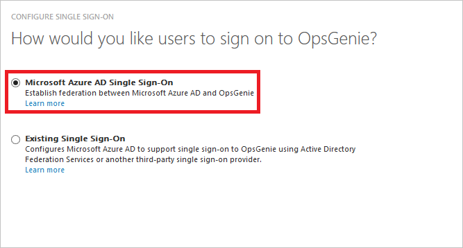 

3. Führen Sie auf der Seite Dialogfeld **Konfigurieren der App-Einstellungen** die folgenden Schritte aus:

    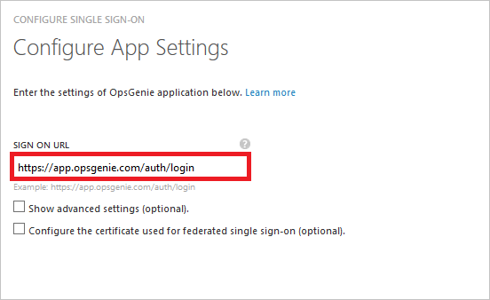 

    ein. Geben Sie in das Textfeld melden Sie sich auf URL die URL Ihrer Benutzer melden Sie sich für den Zugriff auf Ihre OpsGenie-Anwendung unter Verwendung des folgenden Musters untersuchten: **"https://app.opsgenie.com/auth/login"**.

    > [AZURE.NOTE] Wenden Sie sich an Ihr [Supportteam für OpsGenie](mailto:support@opsgenie.com) , wenn Sie Ihre melden Sie sich auf URL benötigen.

    b. Klicken Sie auf **Weiter**.

4. Klicken Sie auf der Seite **Konfigurieren einmaliges Anmelden bei OpsGenie** führen Sie die folgenden Schritte aus:

    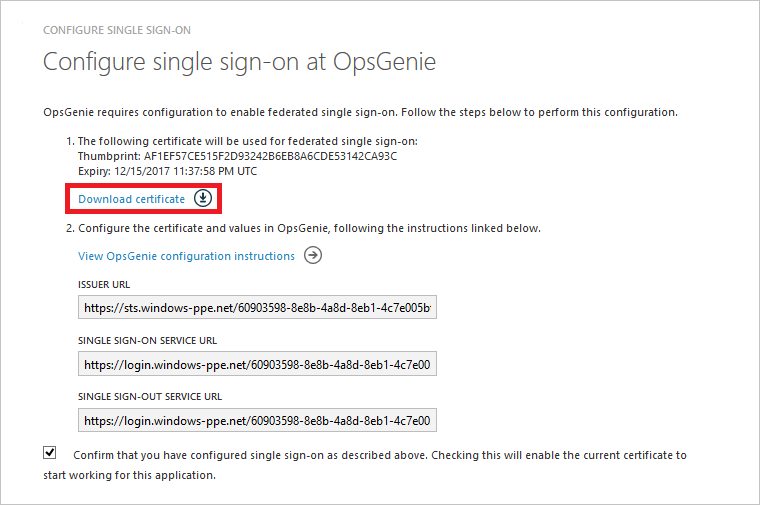 

    ein. Klicken Sie auf **Zertifikat herunterladen**, und speichern Sie die Datei auf Ihrem Computer. Wir benötigen diese Zertifikat und Metadaten URLs (Entität-ID, melden Sie sich In URL SSO und melden Sie sich ab URL) SSO auf OpsGenie Seite einrichten.

    b. Klicken Sie auf **Weiter**.

5. Öffnen Sie einer anderen Instanz des Browsers, und klicken Sie dann melden Sie sich als Administrator OpsGenie.

6. Klicken Sie auf **Einstellungen**, und klicken Sie dann auf die Registerkarte **Single Sign On** .
 
    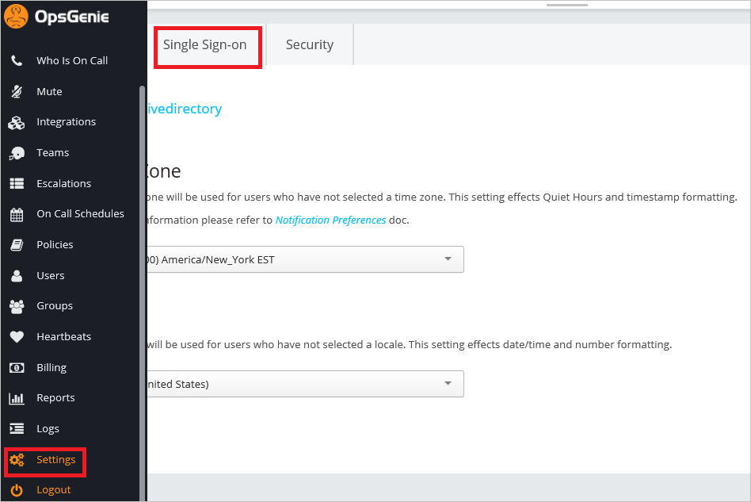 

7. Wählen Sie zum Aktivieren von SSO **aktiviert**.

    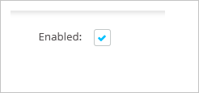 
   
8. Klicken Sie im Abschnitt **Anbieter** auf der Registerkarte **Azure Active Directory** .

    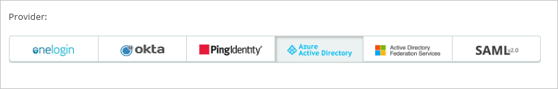 
    
9. Klicken Sie auf der Seite Dialogfeld Azure Active Directory führen Sie die folgenden Schritte aus:
 
    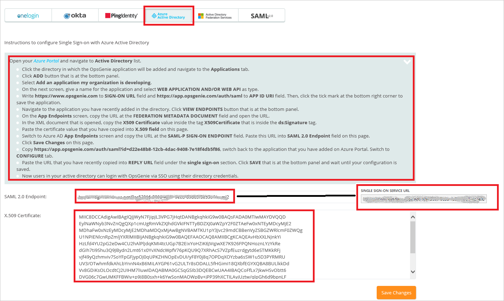 

    ein. Kopieren Sie den Wert für die **Einzelnen melden Sie sich auf Dienst-URL** , und fügen Sie ihn in das Textfeld **SAML 2.0-Endpunkt** , im Azure klassischen-Portal auf der Seite **Konfigurieren einmaliges Anmelden bei OpsGenie** .

    b. Erstellen Sie eine codierte Base-64-Datei aus der heruntergeladenen Zertifikat ein.      
    
    > [AZURE.NOTE] Weitere Informationen hierzu finden Sie unter [Konvertieren ein binäres Zertifikat in eine Textdatei](https://www.youtube.com/watch?v=PlgrzUZ-Y1o&feature=youtu.be).

    c. Öffnen Sie Ihre Base-64-codierte Zertifikat in Editor, kopieren Sie den Inhalt der es in der Zwischenablage, und fügen Sie ihn in das Textfeld **500 Zertifikat** .

    d. Klicken Sie auf **Änderungen speichern**.

6. Im Portal Azure klassischen wählen Sie die Konfiguration für einzelne Zeichen Bestätigung, und klicken Sie dann auf **Weiter**.

    ![Azure AD einmaliges Anmelden][10]

7. Klicken Sie auf der Seite **Bestätigung für einzelne anmelden** auf **abgeschlossen**.  

    ![Azure AD einmaliges Anmelden][11]

### Erstellen eines Benutzers mit Azure AD-testen
Das Ziel der in diesem Abschnitt besteht im Erstellen eines Testbenutzers aufgerufen Britta Simon im klassischen Azure-Portal.

![Erstellen von Azure AD-Benutzer][20]

**Führen Sie die folgenden Schritte aus, um einen Testbenutzer in Azure AD zu erstellen:**

1. Klicken Sie im **Azure klassischen Portal**auf der linken Navigationsbereich auf **Active Directory**.

     

2. Wählen Sie aus der Liste **Verzeichnis** Verzeichnis für das Sie Verzeichnisintegration aktivieren möchten.

3. Wenn die Liste der Benutzer, klicken Sie im Menü oben anzeigen möchten, klicken Sie auf **Benutzer**.

     

4. Klicken Sie im Dialogfeld **Benutzer hinzufügen** um in der Symbolleiste auf der Unterseite öffnen, auf **Benutzer hinzufügen**.

     

5. Führen Sie auf der Seite **Teilen Sie uns zu diesem Benutzer** die folgenden Schritte aus:

     

    ein. Wählen Sie als Typ des Benutzers neuen Benutzer in Ihrer Organisation ein.

    b. Geben Sie den Benutzernamen **Textfeld** **BrittaSimon**ein.

    c. Klicken Sie auf **Weiter**.

6.  Klicken Sie auf der Seite **Benutzerprofil** Dialogfeld führen Sie die folgenden Schritte aus:

     

    ein. Geben Sie im Textfeld **Vorname** **Britta**aus.  

    b. In das letzte Textfeld **Name** , Typ, **Simon**.

    c. Geben Sie im Textfeld **Anzeigename** **Britta Simon**aus.

    d. Wählen Sie in der Liste **Rolle** **Benutzer**aus.

    e. Klicken Sie auf **Weiter**.

7. Klicken Sie auf der Seite **erste temporäres Kennwort** auf **Erstellen**.

     

8. Klicken Sie auf der Seite **erste temporäres Kennwort** führen Sie die folgenden Schritte aus:

     

    ein. Notieren Sie den Wert für das **Neue Kennwort ein**.

    b. Klicken Sie auf **abgeschlossen**.   

### Erstellen eines Testbenutzers OpsGenie

Das Ziel der in diesem Abschnitt ist zum Erstellen eines Benutzers Britta Simon in OpsGenie bezeichnet. 

1.  In einem Webbrowserfenster melden Sie sich in Ihrem Mandanten OpsGenie als Administrator.

2.  Navigieren Sie zur Liste der Benutzer, indem Sie **Benutzer** im linken Bereich auf.
   
    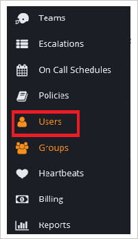 

3.  Klicken Sie auf "**Benutzer hinzufügen**".

3.  Klicken Sie im Dialogfeld **Benutzer hinzufügen** führen Sie die folgenden Schritte aus:

    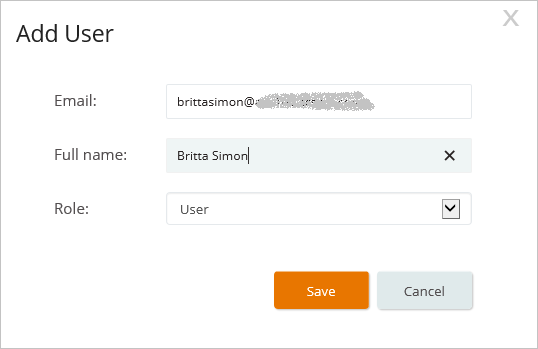 

    ein. Geben Sie in das Textfeld **E-Mail** Brittas e-Mail-Adresse in Azure Active Directory.

    b. Geben Sie in das Textfeld **Vollständigen Namen** **Britta Simon**aus.

    c. Klicken Sie auf **Speichern**. 

Britta erhalten eine e-Mail mit Anweisungen zum Einrichten von ihr Profil.

### Zuweisen des Azure AD-Test-Benutzers

Das Ziel der in diesem Abschnitt ist für die Aktivierung der Britta Simon Azure einmaliges Anmelden verwenden, indem Sie keinen Zugriff auf OpsGenie erteilen.

![Benutzer zuweisen][200] 

**Um Britta Simon OpsGenie zuzuweisen, führen Sie die folgenden Schritte aus:**

1. Klicken Sie im Portal Azure klassischen zum Öffnen der Anwendungsansicht in der Verzeichnisansicht klicken Sie auf **Applikationen** im oberen Menü.
 
    ![Benutzer zuweisen][201] 

2. Wählen Sie in der Liste Applications **OpsGenie**.

    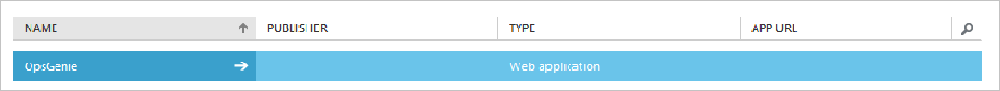 

1. Klicken Sie auf **Benutzer**, klicken Sie im Menü oben.

    ![Benutzer zuweisen][203] 

1. Wählen Sie in der Liste Benutzer **Britta Simon**aus.

2. Klicken Sie unten auf der Symbolleiste auf **zuweisen**.

    ![Benutzer zuweisen][205]

### Testen einmaliges Anmelden

Das Ziel der in diesem Abschnitt ist zum Azure AD-einzelne anmelden Überprüfen der Konfiguration mithilfe des Bedienfelds Access.

Wenn Sie die Kachel OpsGenie im Bereich Access klicken, Sie sollten automatisch an Ihrer Anwendung OpsGenie angemeldete abrufen.

## Zusätzliche Ressourcen

* [Liste der zum Integrieren SaaS-Apps mit Azure-Active Directory-Lernprogramme](active-directory-saas-tutorial-list.md)
* [Was ist die Anwendungszugriff und einmaliges Anmelden mit Azure Active Directory?](active-directory-appssoaccess-whatis.md)

<!--Image references-->

[1]: ./media/active-directory-saas-opsgenie-tutorial/tutorial_general_01.png
[2]: ./media/active-directory-saas-opsgenie-tutorial/tutorial_general_02.png
[3]: ./media/active-directory-saas-opsgenie-tutorial/tutorial_general_03.png
[4]: ./media/active-directory-saas-opsgenie-tutorial/tutorial_general_04.png

[6]: ./media/active-directory-saas-opsgenie-tutorial/tutorial_general_05.png
[10]: ./media/active-directory-saas-opsgenie-tutorial/tutorial_general_06.png
[11]: ./media/active-directory-saas-opsgenie-tutorial/tutorial_general_07.png
[20]: ./media/active-directory-saas-opsgenie-tutorial/tutorial_general_100.png

[200]: ./media/active-directory-saas-opsgenie-tutorial/tutorial_general_200.png
[201]: ./media/active-directory-saas-opsgenie-tutorial/tutorial_general_201.png
[203]: ./media/active-directory-saas-opsgenie-tutorial/tutorial_general_203.png
[204]: ./media/active-directory-saas-opsgenie-tutorial/tutorial_general_204.png
[205]: ./media/active-directory-saas-opsgenie-tutorial/tutorial_general_205.png
