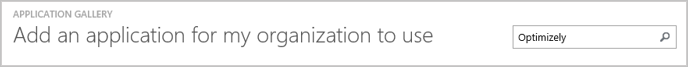
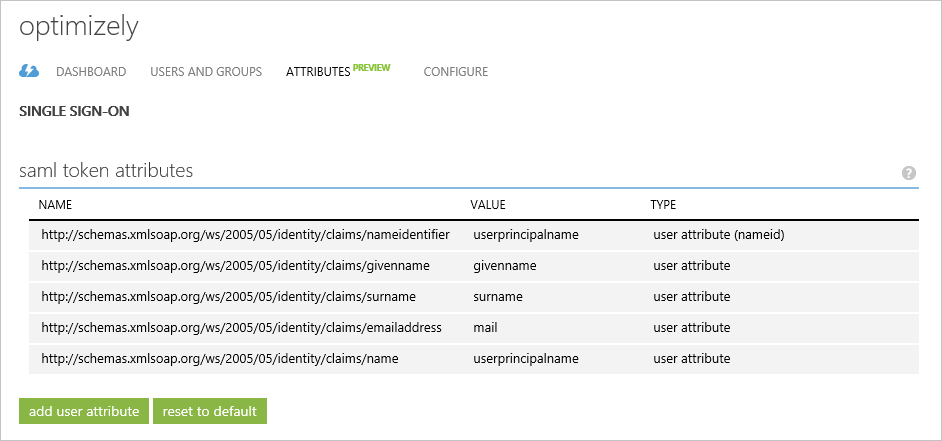
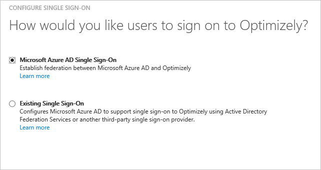
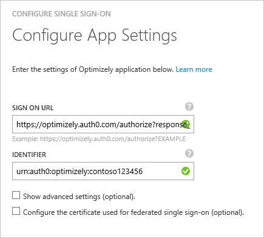
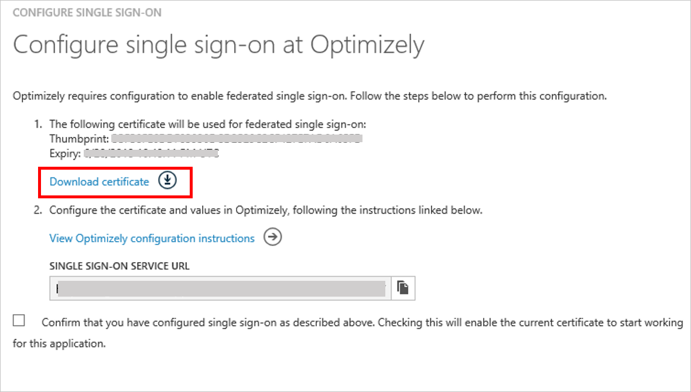
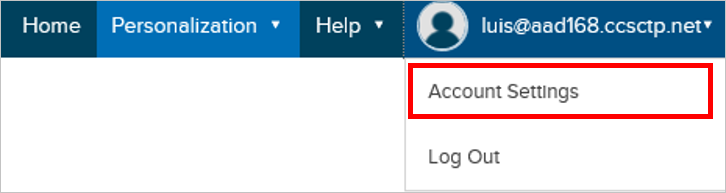
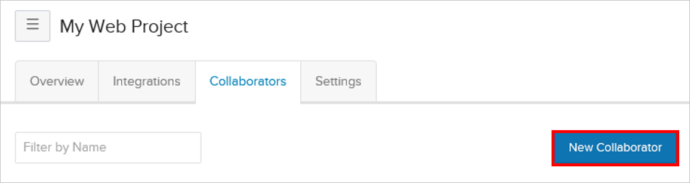
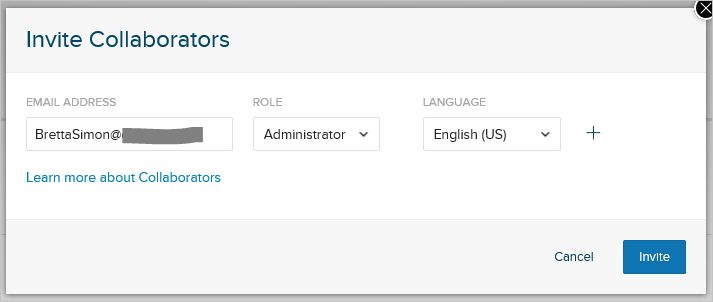
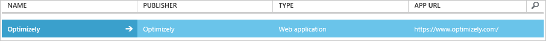

<properties
    pageTitle="Lernprogramm: Azure-Active Directory-Integration in Optimizely | Microsoft Azure"
    description="Informationen Sie zum einmaligen Anmeldens zwischen Azure Active Directory und Optimizely konfigurieren."
    services="active-directory"
    documentationCenter=""
    authors="jeevansd"
    manager="femila"
    editor=""/>

<tags
    ms.service="active-directory"
    ms.workload="identity"
    ms.tgt_pltfrm="na"
    ms.devlang="na"
    ms.topic="article"
    ms.date="09/11/2016"
    ms.author="jeedes"/>

# Lernprogramm: Azure-Active Directory-Integration in Optimizely

In diesem Lernprogramm erfahren Sie, wie Optimizely mit Azure Active Directory (Azure AD) integriert werden soll.

Integration von Optimizely mit Azure AD bietet Ihnen die folgenden Vorteile:

- Sie können in Azure AD steuern, die auf Optimizely zugreifen
- Sie können Ihre Benutzer automatisch auf Optimizely (einmaliges Anmelden) mit ihren Konten Azure AD-angemeldete abrufen aktivieren.
- Sie können Ihre Konten an einem zentralen Ort – im klassischen Azure-Portal verwalten.

Wenn Sie weitere Details zu SaaS app-Integration in Azure AD-wissen möchten, finden Sie unter [Was ist Zugriff auf die Anwendung und einmaliges Anmelden mit Azure Active Directory](active-directory-appssoaccess-whatis.md).

## Erforderliche Komponenten

Zum Konfigurieren von Azure AD-Integration mit Optimizely, benötigen Sie die folgenden Elemente:

- Ein Azure AD-Abonnement
- Eine **Optimizely** einmaligen Anmeldung aktiviert Abonnement

> [AZURE.NOTE] Wenn Sie um die Schritte in diesem Lernprogramm zu testen, empfehlen wir nicht mit einer Umgebung für die Herstellung.

Führen Sie zum Testen der Schritte in diesem Lernprogramm Tips:

- Sie sollten Ihre Umgebung Herstellung nicht verwenden, es sei denn, dies erforderlich ist.
- Wenn Sie eine Testversion Azure AD-Umgebung besitzen, können Sie eine einen Monat zum Testen [hier](https://azure.microsoft.com/pricing/free-trial/)erhalten.

## Szenario Beschreibung
In diesem Lernprogramm testen Sie Azure AD-einmaliges Anmelden in einer testumgebung. In diesem Lernprogramm beschriebenen Szenario besteht aus zwei Hauptfenster Bausteine:

1. Hinzufügen von Optimizely aus dem Katalog
2. Konfigurieren und Testen Azure AD einmaliges Anmelden

## Hinzufügen von Optimizely aus dem Katalog
Um die Integration der Optimizely in Azure AD zu konfigurieren, müssen Sie Optimizely zu Ihrer Liste der verwalteten SaaS apps aus dem Katalog hinzuzufügen.

**Um Optimizely aus dem Katalog hinzufügen möchten, führen Sie die folgenden Schritte aus:**

1. Klicken Sie im **Azure klassischen Portal**auf der linken Navigationsbereich auf **Active Directory**. 

    ![Active Directory][1]

2. Wählen Sie aus der Liste **Verzeichnis** Verzeichnis für das Sie Verzeichnisintegration aktivieren möchten.

3. Klicken Sie zum Öffnen der Anwendungsansicht in der Verzeichnisansicht im oberen Menü auf **Applications** .

    ![Applikationen][2]

4. Klicken Sie auf **Hinzufügen** , am unteren Rand der Seite.

    ![Applikationen][3]

5. Klicken Sie im Dialogfeld **Was möchten Sie tun** klicken Sie auf **eine Anwendung aus dem Katalog hinzufügen**.

    ![Applikationen][4]

6. Geben Sie im Suchfeld **Optimizely**ein.

    

7. Wählen Sie im Ergebnisbereich **Optimizely aus**, und klicken Sie dann auf **abgeschlossen** , um die Anwendung hinzugefügt haben.

    

##  Konfigurieren und Testen Azure AD einmaliges Anmelden
In diesem Abschnitt Konfigurieren und Testen Azure AD-einmaliges Anmelden mit Optimizely basierend auf einen Testbenutzer "Britta Simon" bezeichnet.

Für einmaliges Anmelden entwickelt muss Azure AD kennen, kann der Benutzer Gegenstück Optimizely einem Benutzer in Azure AD. Kurzum, muss eine Link Beziehung zwischen einem Azure AD-Benutzer und dem entsprechenden Benutzer in Optimizely eingerichtet werden.
Dieser Link Beziehung wird hergestellt, indem Sie den Wert des **Benutzernamens** in Azure AD als der Wert für den **Benutzernamen** in Optimizely zuweisen.

Zum Konfigurieren und Azure AD-einmaliges Anmelden mit Optimizely testen, müssen Sie die folgenden Bausteine durchführen:

1. **[Konfigurieren von Azure AD einmaligen Anmeldens](#configuring-azure-ad-single-single-sign-on)** - damit Ihre Benutzer dieses Feature verwenden können.
2. **[Erstellen einer Azure AD Benutzer testen](#creating-an-azure-ad-test-user)** : Azure AD-einmaliges Anmelden mit Britta Simon testen.
4. **[Erstellen einer Optimizely Benutzer testen](#creating-an-optimizely-test-user)** : ein Gegenstück von Britta Simon in Optimizely haben, die in der Azure AD-Darstellung Ihrer verknüpft ist.
5. **[Testen Sie Benutzer zuweisen Azure AD](#assigning-the-azure-ad-test-user)** - Britta Simon mit Azure AD-einmaliges Anmelden aktivieren.
5. **[Testen der einmaligen Anmeldens](#testing-single-sign-on)** - zur Überprüfung, ob die Konfiguration funktioniert.

### Konfigurieren von Azure AD einmaliges Anmelden

Das Ziel der in diesem Abschnitt ist Azure AD-einmaliges Anmelden im klassischen Azure-Portal aktivieren und konfigurieren einmaliges Anmelden in Ihrer Anwendung Optimizely.

Optimizely Anwendung erwartet die SAML-Assertionen ein Attribut mit dem Namen "e-Mail" enthalten. Der Wert von "e-Mail" sollten eine erkannt Optimizely e-Mail-Nachricht, die von Azure AD authentifiziert abrufen können. Konfigurieren Sie die anfordern "e-Mail" für diese Anwendung. Sie können die Werte dieser Attribute der Registerkarte **"Atrributes"** der Anwendung verwalten. Das folgende Bildschirmabbild zeigt ein Beispiel dafür. 

 

**Führen Sie die folgenden Schritte aus, um Azure AD-einmaliges Anmelden mit Optimizely konfigurieren:**

1. Im klassischen Azure Portal **Optimizely** Anwendung Integration in die Seite, klicken Sie im Menü oben klicken Sie auf **Attribute**.
     
    ![Konfigurieren Sie einmaliges Anmelden][5]

2. Klicken Sie im Dialogfeld SAML token Attribute fügen Sie das Attribut "e-Mail" hinzu.

    ein. Klicken Sie auf **Benutzerattribut hinzufügen** , um das Dialogfeld **Benutzerattribut hinzufügen** zu öffnen. 
    
    

    b. Geben Sie in das Textfeld **Name Attribut** die Attribut "e-Mail" aus.

    c. Wählen Sie aus der Liste **Attributwert** Attribut Wert "Userprincipalname" oder jeder Wert, der eine e-Mail-Nachricht von Azure AD erkannt und Optimizely.

    d. Klicken Sie auf **abgeschlossen**.
3. Klicken Sie im Menü oben auf **Schnellstart**.

    ![Konfigurieren Sie einmaliges Anmelden][6]
4. Im Portal klassischen auf der Seite **Optimizely** Integration Anwendung klicken Sie auf **Konfigurieren einmaligen Anmeldens** zum Öffnen des Dialogfelds **Konfigurieren einmaliges Anmelden** .

    ![Konfigurieren Sie einmaliges Anmelden][7] 

5. Klicken Sie auf der Seite **Wie möchten Sie Benutzer bei der Optimizely auf** **Azure AD einmaliges Anmelden**wählen Sie aus, und klicken Sie dann auf **Weiter**.
    
    

6. Führen Sie auf der Seite Dialogfeld **Konfigurieren der App-Einstellungen** die folgenden Schritte aus: 

    

    ein. Geben Sie im Textfeld **Melden Sie sich auf URL** ein:`https://app.optimizely.net/contoso`

    b. Geben Sie in das Textfeld **Bezeichner** :`urn:auth0:optimizely:contoso`

    c. Klicken Sie auf **Weiter**. 

    > [AZURE.NOTE] Die Werte für das **Signieren auf URL** und **Bezeichner** sind nur Platzhalter für die ist-Werte. Sie können die Anweisungen zur Aquiring der tatsächlichen Werte von Optimizely später in diesem Lernprogramm suchen.

7. Klicken Sie auf der Seite **Konfigurieren einmaliges Anmelden bei Optimizely** führen Sie die folgenden Schritte aus:

    

    ein. Klicken Sie auf **Zertifikat herunterladen**, und speichern Sie die Datei auf Ihrem Computer.

    b. Kopieren Sie die **URL der Dienst für einmaliges Anmelden**.

8. Um für die Anwendung konfigurierten SSO zu gelangen, wenden Sie sich an Ihren Optimizely Account Manager, und geben Sie die folgende Informationen:

    - Ihr heruntergeladene Zertifikat 
    - Die URL der Dienst für einmaliges Anmelden
 
    In der Antwort auf Ihre e-Mails bietet Optimizely melden Sie sich auf URL (SP initiiert SSO) und die Werte Bezeichner (Service Provider Entität ID).

9. Kehren Sie zum **Konfigurieren der App-Einstellungen** Dialogseite, und gehen Sie folgendermaßen vor:

    

    ein. Geben Sie in das Textfeld **Melden Sie sich auf URL** der vom Optimizely bereitgestellten **SP initiiert SSO-URL** ein.

    b. Geben Sie in das Textfeld **Bezeichner** vom Optimizely bereitgestellte **Service Provider Entität-ID** ein.

    c. Klicken Sie auf **Weiter**.

10. Klicken Sie auf der Seite **Konfigurieren einmaliges Anmelden bei Optimizely** führen Sie die folgenden Schritte aus:
    
    ![Azure AD einmaliges Anmelden][10]

    ein. Wählen Sie die Konfiguration für einzelne Zeichen Bestätigung an.

    b. Klicken Sie auf **Weiter**.

11. Klicken Sie auf der Seite **Bestätigung für einzelne anmelden** auf **abgeschlossen**.  
    
    ![Azure AD einmaliges Anmelden][11]

12. In einem anderen Browserfenster melden Sie sich für den Zugriff auf Ihre Optimizely Anwendung.
13. Klicken Sie auf die Namen in der oberen rechten Ecke und dann auf **Konten-Einstellungen**zu berücksichtigen.

    

14. Aktivieren Sie das Kontrollkästchen **Aktivieren SSO** unter Single Sign On im Abschnitt **Übersicht** , in die Registerkarte Konto.

    

### Erstellen eines Benutzers mit Azure AD-testen
In diesem Abschnitt erstellen Sie einen Testbenutzer im klassischen Portal Britta Simon bezeichnet.
Wählen Sie in der Liste Benutzer **Britta Simon**aus.

![Erstellen von Azure AD-Benutzer][20]

**Führen Sie die folgenden Schritte aus, um einen Testbenutzer in Azure AD zu erstellen:**

1. Klicken Sie im **Azure klassischen Portal**auf der linken Navigationsbereich auf **Active Directory**.
    
     

2. Wählen Sie aus der Liste **Verzeichnis** Verzeichnis für das Sie Verzeichnisintegration aktivieren möchten.

3. Wenn die Liste der Benutzer, klicken Sie im Menü oben anzeigen möchten, klicken Sie auf **Benutzer**.
    
     

4. Klicken Sie im Dialogfeld **Benutzer hinzufügen** um in der Symbolleiste auf der Unterseite öffnen, auf **Benutzer hinzufügen**.

     

5. Führen Sie auf der Seite **Teilen Sie uns zu diesem Benutzer** die folgenden Schritte aus:
 
     

    ein. Wählen Sie als Typ des Benutzers neuen Benutzer in Ihrer Organisation ein.

    b. Geben Sie den Benutzernamen **Textfeld** **BrittaSimon**ein.

    c. Klicken Sie auf **Weiter**.

6.  Klicken Sie auf der Seite **Benutzerprofil** Dialogfeld führen Sie die folgenden Schritte aus:

     

    ein. Geben Sie im Textfeld **Vorname** **Britta**aus.  

    b. In das letzte Textfeld **Name** , Typ, **Simon**.

    c. Geben Sie im Textfeld **Anzeigename** **Britta Simon**aus.

    d. Wählen Sie in der Liste **Rolle** **Benutzer**aus.

    e. Klicken Sie auf **Weiter**.

7. Klicken Sie auf der Seite **erste temporäres Kennwort** auf **Erstellen**.

     

8. Klicken Sie auf der Seite **erste temporäres Kennwort** führen Sie die folgenden Schritte aus:

     

    ein. Notieren Sie den Wert für das **Neue Kennwort ein**.

    b. Klicken Sie auf **abgeschlossen**.   

### Erstellen eines Benutzers mit Optimizely testen

In diesem Abschnitt erstellen Sie einen Benutzer namens Britta Simon in Optimizely.

1. Wählen Sie auf der Homepage der **Mitarbeiter** Registerkarte
2. Klicken Sie auf **Neue Collaborator** zum Hinzufügen einer neuen Collaborator des Projekts.

    

3.  Füllen Sie die e-Mail-Adresse und weisen Sie aber eine Rolle zu. Klicken Sie auf **einladen**.

    

4. Sie erhalten eine e-Mail-Einladung. Verwenden die e-Mail-Adresse ein. Sie haben zur Anmeldung bei Optimizely.

### Zuweisen des Azure AD-Test-Benutzers

In diesem Abschnitt aktivieren Sie Britta Simon Azure einmaliges Anmelden verwenden, indem Sie keinen Zugriff auf Optimizely erteilen.

![Benutzer zuweisen][200] 

**Um Britta Simon Optimizely zuzuweisen, führen Sie die folgenden Schritte aus:**

1. Klicken Sie im Portal klassischen zum Öffnen der Anwendungsansicht in der Verzeichnisansicht klicken Sie auf **Applikationen** im oberen Menü.

    ![Benutzer zuweisen][201] 

2. Wählen Sie in der Liste Applications **Optimizely**.

     

1. Klicken Sie auf **Benutzer**, klicken Sie im Menü oben.

    ![Benutzer zuweisen][203] 

1. Wählen Sie in der Liste alle Benutzer **Britta Simon**aus.

2. Klicken Sie unten auf der Symbolleiste auf **zuweisen**.

    ![Benutzer zuweisen][205]

### Testen einmaliges Anmelden

Das Ziel der in diesem Abschnitt ist zum Azure AD-einzelne anmelden Überprüfen der Konfiguration mithilfe des Bedienfelds Access.

Wenn Sie die Kachel Optimizely im Bereich Access klicken, Sie sollten automatisch an Ihrer Anwendung Optimizely angemeldete abrufen.

## Zusätzliche Ressourcen

* [Liste der zum Integrieren SaaS-Apps mit Azure-Active Directory-Lernprogramme](active-directory-saas-tutorial-list.md)
* [Was ist die Anwendungszugriff und einmaliges Anmelden mit Azure Active Directory?](active-directory-appssoaccess-whatis.md)

<!--Image references-->

[1]: ./media/active-directory-saas-optimizely-tutorial/tutorial_general_01.png
[2]: ./media/active-directory-saas-optimizely-tutorial/tutorial_general_02.png
[3]: ./media/active-directory-saas-optimizely-tutorial/tutorial_general_03.png
[4]: ./media/active-directory-saas-optimizely-tutorial/tutorial_general_04.png

[5]: ./media/active-directory-saas-optimizely-tutorial/tutorial_general_05.png
[6]: ./media/active-directory-saas-optimizely-tutorial/tutorial_general_06.png
[7]:  ./media/active-directory-saas-optimizely-tutorial/tutorial_general_050.png
[10]: ./media/active-directory-saas-optimizely-tutorial/tutorial_general_060.png
[11]: ./media/active-directory-saas-optimizely-tutorial/tutorial_general_070.png
[20]: ./media/active-directory-saas-optimizely-tutorial/tutorial_general_100.png

[200]: ./media/active-directory-saas-optimizely-tutorial/tutorial_general_200.png
[201]: ./media/active-directory-saas-optimizely-tutorial/tutorial_general_201.png
[203]: ./media/active-directory-saas-optimizely-tutorial/tutorial_general_203.png
[204]: ./media/active-directory-saas-optimizely-tutorial/tutorial_general_204.png
[205]: ./media/active-directory-saas-optimizely-tutorial/tutorial_general_205.png
