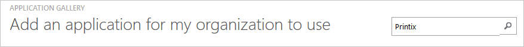
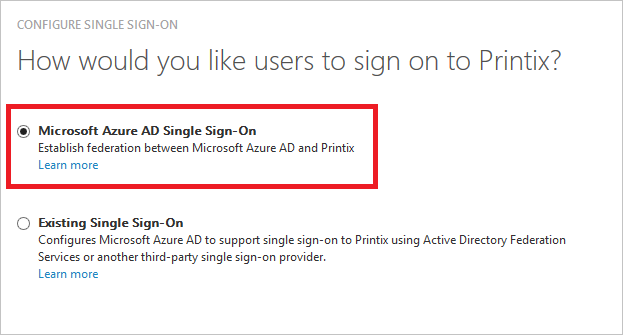
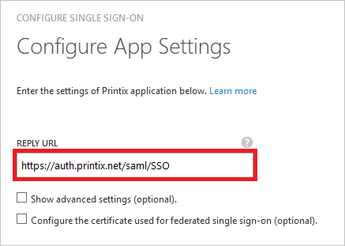
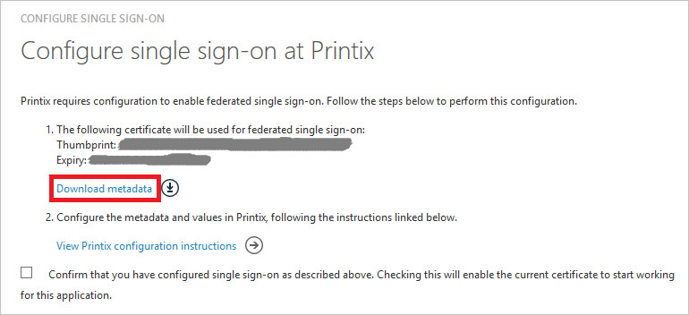
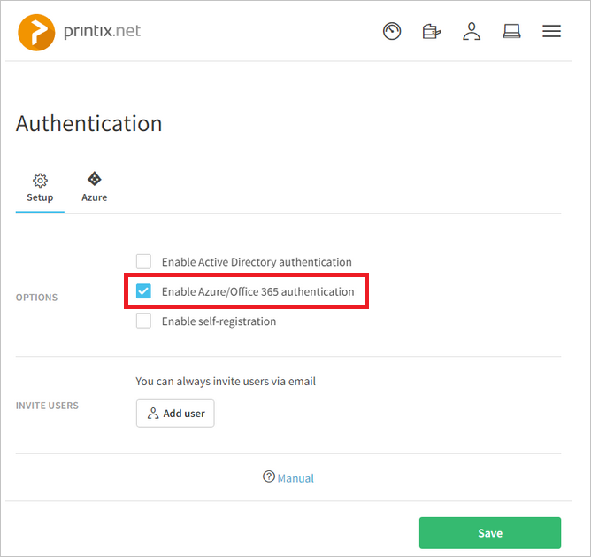
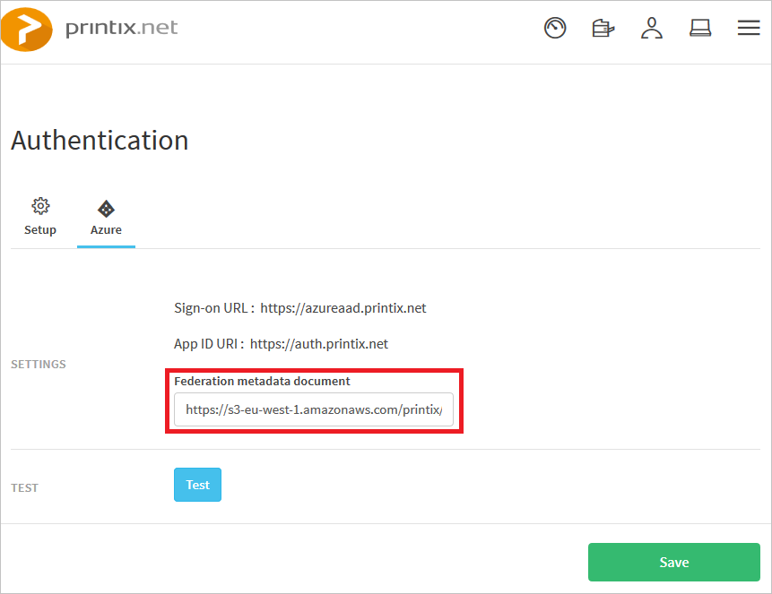
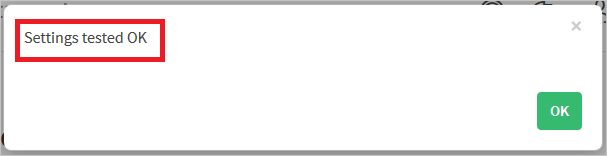
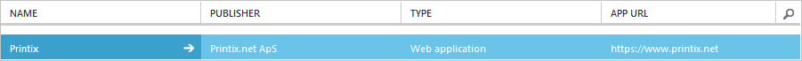

<properties
    pageTitle="Lernprogramm: Azure-Active Directory-Integration in Printix | Microsoft Azure"
    description="Informationen Sie zum einmaligen Anmeldens zwischen Azure Active Directory und Printix konfigurieren."
    services="active-directory"
    documentationCenter=""
    authors="jeevansd"
    manager="femila"
    editor=""/>

<tags
    ms.service="active-directory"
    ms.workload="identity"
    ms.tgt_pltfrm="na"
    ms.devlang="na"
    ms.topic="article"
    ms.date="09/01/2016"
    ms.author="jeedes"/>

# Lernprogramm: Azure-Active Directory-Integration in Printix

In diesem Lernprogramm erfahren Sie, wie Printix mit Azure Active Directory (Azure AD) integriert werden soll.

Integration von Printix mit Azure AD bietet Ihnen die folgenden Vorteile:

- Sie können in Azure AD steuern, die auf Printix zugreifen
- Sie können Ihre Benutzer automatisch auf Printix (einmaliges Anmelden) mit ihren Konten Azure AD-angemeldete abrufen aktivieren.
- Sie können Ihre Konten an einem zentralen Ort – im klassischen Azure-Portal verwalten.

Wenn Sie weitere Details zu SaaS app-Integration in Azure AD-wissen möchten, finden Sie unter [Was ist Zugriff auf die Anwendung und einmaliges Anmelden mit Azure Active Directory](active-directory-appssoaccess-whatis.md).

## Erforderliche Komponenten

Zum Konfigurieren von Azure AD-Integration mit Printix, benötigen Sie die folgenden Elemente:

- Ein Azure AD-Abonnement
- Eine Printix einmaligen Anmeldung aktiviert Abonnement

> [AZURE.NOTE] Wenn Sie um die Schritte in diesem Lernprogramm zu testen, empfehlen wir nicht mit einer Umgebung für die Herstellung.

Führen Sie zum Testen der Schritte in diesem Lernprogramm Tips:

- Sie sollten Ihre Umgebung Herstellung nicht verwenden, es sei denn, dies erforderlich ist.
- Wenn Sie eine Testversion Azure AD-Umgebung besitzen, können Sie eine einen Monat zum Testen [hier](https://azure.microsoft.com/pricing/free-trial/)erhalten.

## Szenario Beschreibung
In diesem Lernprogramm testen Sie Azure AD-einmaliges Anmelden in einer testumgebung.

In diesem Lernprogramm beschriebenen Szenario besteht aus zwei Hauptfenster Bausteine:

1. Hinzufügen von Printix aus dem Katalog
2. Konfigurieren und Testen Azure AD einmaliges Anmelden

## Hinzufügen von Printix aus dem Katalog
Um die Integration der Printix in Azure AD zu konfigurieren, müssen Sie Printix zu Ihrer Liste der verwalteten SaaS apps aus dem Katalog hinzuzufügen.

**Um Printix aus dem Katalog hinzufügen möchten, führen Sie die folgenden Schritte aus:**

1. Klicken Sie im **Azure klassischen Portal**auf der linken Navigationsbereich auf **Active Directory**.

    ![Active Directory][1]
2. Wählen Sie aus der Liste **Verzeichnis** Verzeichnis für das Sie Verzeichnisintegration aktivieren möchten.

3. Klicken Sie zum Öffnen der Anwendungsansicht in der Verzeichnisansicht im oberen Menü auf **Applications** .

    ![Applikationen][2]

4. Klicken Sie auf **Hinzufügen** , am unteren Rand der Seite.

    ![Applikationen][3]

5. Klicken Sie im Dialogfeld **Was möchten Sie tun** klicken Sie auf **eine Anwendung aus dem Katalog hinzufügen**.

    ![Applikationen][4]

6. Geben Sie im Suchfeld **Printix**ein.

    
7. Wählen Sie im Ergebnisbereich **Printix aus**, und klicken Sie dann auf **abgeschlossen** , um die Anwendung hinzugefügt haben.

##  Konfigurieren und Testen Azure AD einmaliges Anmelden
In diesem Abschnitt Konfigurieren und Testen Azure AD-einmaliges Anmelden mit Printix basierend auf einen Testbenutzer "Britta Simon" bezeichnet.

Für einmaliges Anmelden entwickelt muss Azure AD kennen, kann der Benutzer Gegenstück Printix einem Benutzer in Azure AD. Kurzum, muss eine Link Beziehung zwischen einem Azure AD-Benutzer und dem entsprechenden Benutzer in Printix eingerichtet werden.

Dieser Link Beziehung wird hergestellt, indem Sie den Wert des **Benutzernamens** in Azure AD als der Wert für den **Benutzernamen** in Printix zuweisen.

Zum Konfigurieren und Azure AD-einmaliges Anmelden mit Printix testen, müssen Sie die folgenden Bausteine durchführen:

1. **[Konfigurieren von Azure AD einmaligen Anmeldens](#configuring-azure-ad-single-sign-on)** - damit Ihre Benutzer dieses Feature verwenden können.
2. **[Erstellen einer Azure AD Benutzer testen](#creating-an-azure-ad-test-user)** : Azure AD-einmaliges Anmelden mit Britta Simon testen.
3. **[Erstellen einer Printix Benutzer testen](#creating-a-printix-test-user)** : ein Gegenstück von Britta Simon in Printix haben, die in der Azure AD-Darstellung Ihrer verknüpft ist.
4. **[Testen Sie Benutzer zuweisen Azure AD](#assigning-the-azure-ad-test-user)** - Britta Simon mit Azure AD-einmaliges Anmelden aktivieren.
5. **[Testen der einmaligen Anmeldens](#testing-single-sign-on)** - zur Überprüfung, ob die Konfiguration funktioniert.

### Konfigurieren von Azure AD-einmaliges Anmelden

In diesem Abschnitt Azure AD-einmaliges Anmelden im klassischen Portal aktivieren und konfigurieren in Ihrer Anwendung Printix einmaliges Anmelden.

**Führen Sie die folgenden Schritte aus, um Azure AD-einmaliges Anmelden mit Printix konfigurieren:**

1. Im Portal klassischen auf der Seite **Printix** Integration Anwendung klicken Sie auf **Konfigurieren einmaligen Anmeldens** zum Öffnen des Dialogfelds **Konfigurieren einmaliges Anmelden** .
     
    ![Konfigurieren Sie einmaliges Anmelden][6] 

2. Klicken Sie auf der Seite **Wie möchten Sie Benutzer bei der Printix auf** **Azure AD einmaliges Anmelden**wählen Sie aus, und klicken Sie dann auf **Weiter**.

     

3. Führen Sie auf der Seite Dialogfeld **Konfigurieren der App-Einstellungen** die folgenden Schritte aus:

     

    ein. Geben Sie im Textfeld **URL Antworten** `https://auth.printix.net/saml/SSO`.
    
    b. Klicken Sie auf **Weiter**
 
4. Klicken Sie auf der Seite **Konfigurieren einmaliges Anmelden bei Printix** führen Sie die folgenden Schritte aus:

    

    ein. Klicken Sie auf **Herunterladen von Metadaten**aus, und speichern Sie die Datei auf Ihrem Computer.

    b. Klicken Sie auf **Weiter**.

5. Melden Sie sich für den Zugriff auf Ihre Printix Mandanten als Administrator.

6. Klicken Sie im Menü oben klicken Sie auf das Symbol in der oberen rechten Ecke, und wählen Sie "**Authentifizierung**" aus.

    

7. Wählen Sie auf der Registerkarte **Setup** **Aktivieren Azure/Office 365-Authentifizierung**

    

8. Geben Sie auf der Registerkarte **Azure** Föderation-Metadaten-URL in das Textfeld**Föderation Metadatendokument"**ein. 
    
    

    ein. Die Metadaten XML-Datei, die Sie in Schritt 4 an Printix Supportteam über heruntergeladen angefügt "**support@printix.net**". Dann werden sie die XML-Datei hochladen und bieten eine Föderation-Metadaten-URL, mit Ihnen.

9. Klicken Sie auf die Schaltfläche "**Testen**", und klicken Sie auf "**OK**"-Schaltfläche, wenn der Test erfolgreich war.

    ein. Azure-active Directory-Seite wird angezeigt, nachdem Sie auf die Schaltfläche **Testen** . "Der Test erfolgreich war" bedeutet hier nach der Eingabe der Anmeldeinformationen eines Ihrer Azure Testkonto sie "Einstellungen getestet OK" Popo von einer Nachricht wird. Klicken Sie dann auf die Schaltfläche **OK** .

    

10. Klicken Sie auf die Schaltfläche **Speichern** auf der Seite "**Authentifizierung**".

11. Im Portal klassischen wählen Sie die Bestätigung Konfiguration für einzelne Zeichen, und klicken Sie dann auf **Weiter**.
    
    ![Azure AD einmaliges Anmelden][10]

12. Klicken Sie auf der Seite **Bestätigung für einzelne anmelden** auf **abgeschlossen**.  
 
    ![Azure AD einmaliges Anmelden][11]

### Erstellen eines Benutzers mit Azure AD-testen
In diesem Abschnitt erstellen Sie einen Testbenutzer im klassischen Portal Britta Simon bezeichnet.

![Erstellen von Azure AD-Benutzer][20]

**Führen Sie die folgenden Schritte aus, um einen Testbenutzer in Azure AD zu erstellen:**

1. Klicken Sie im **Azure klassischen Portal**auf der linken Navigationsbereich auf **Active Directory**.

     

2. Wählen Sie aus der Liste **Verzeichnis** Verzeichnis für das Sie Verzeichnisintegration aktivieren möchten.

3. Wenn die Liste der Benutzer, klicken Sie im Menü oben anzeigen möchten, klicken Sie auf **Benutzer**.

     

4. Klicken Sie im Dialogfeld **Benutzer hinzufügen** um in der Symbolleiste auf der Unterseite öffnen, auf **Benutzer hinzufügen**.

     

5. Führen Sie auf der Seite **Teilen Sie uns zu diesem Benutzer** die folgenden Schritte aus:
    
     

    ein. Wählen Sie als Typ des Benutzers neuen Benutzer in Ihrer Organisation ein.

    b. Geben Sie den Benutzernamen **Textfeld** **BrittaSimon**ein.

    c. Klicken Sie auf **Weiter**.

6.  Klicken Sie auf der Seite **Benutzerprofil** Dialogfeld führen Sie die folgenden Schritte aus:

     

    ein. Geben Sie im Textfeld **Vorname** **Britta**aus.  

    b. In das letzte Textfeld **Name** , Typ, **Simon**.

    c. Geben Sie im Textfeld **Anzeigename** **Britta Simon**aus.

    d. Wählen Sie in der Liste **Rolle** **Benutzer**aus.

    e. Klicken Sie auf **Weiter**.

7. Klicken Sie auf der Seite **erste temporäres Kennwort** auf **Erstellen**.

     

8. Führen Sie auf der Seite **erste temporäres Kennwort** die folgenden Schritte aus:

     

    ein. Notieren Sie den Wert für das **Neue Kennwort ein**.

    b. Klicken Sie auf **abgeschlossen**.   

### Erstellen eines Benutzers mit Printix testen

Das Ziel der in diesem Abschnitt ist zum Erstellen eines Benutzers Britta Simon in Printix bezeichnet. Printix unterstützt in-Time-Bereitstellung, welche ist standardmäßig aktiviert.

Keine für Sie in diesem Abschnitt Aktionselement ist vorhanden. Bei dem Versuch, Printix zugreifen, wenn er noch nicht vorhanden ist, wird ein neuer Benutzer erstellt werden. [Konfigurieren von Azure AD einmaliges Anmelden](#configuring-azure-ad-single-single-sign-on).

> [AZURE.NOTE] Wenn Sie einen Benutzer manuell erstellen müssen, müssen Sie wenden Sie sich an das Supportteam Printix.

### Zuweisen des Azure AD-Test-Benutzers

In diesem Abschnitt aktivieren Sie Britta Simon Azure einmaliges Anmelden verwenden, indem Sie keinen Zugriff auf Printix erteilen.

![Benutzer zuweisen][200] 

**Um Britta Simon Printix zuzuweisen, führen Sie die folgenden Schritte aus:**

1. Klicken Sie im Portal klassischen zum Öffnen der Anwendungsansicht in der Verzeichnisansicht klicken Sie auf **Applikationen** im oberen Menü.

    ![Benutzer zuweisen][201] 

2. Wählen Sie in der Liste Applications **Printix**.

     

3. Klicken Sie auf **Benutzer**, klicken Sie im Menü oben.

    ![Benutzer zuweisen][203]

4. Wählen Sie in der Liste Benutzer **Britta Simon**aus.

5. Klicken Sie unten auf der Symbolleiste auf **zuweisen**.

    ![Benutzer zuweisen][205]

### Testen einmaliges Anmelden

In diesem Abschnitt Testen Sie Ihre Azure AD-einzelne anmelden Konfiguration mit der Access-Systemsteuerung.

Wenn Sie die Kachel Printix im Bereich Access klicken, Sie sollten automatisch an Ihrer Anwendung Printix angemeldete abrufen.

## Zusätzliche Ressourcen

* [Liste der zum Integrieren SaaS-Apps mit Azure-Active Directory-Lernprogramme](active-directory-saas-tutorial-list.md)
* [Was ist die Anwendungszugriff und einmaliges Anmelden mit Azure Active Directory?](active-directory-appssoaccess-whatis.md)

<!--Image references-->

[1]: ./media/active-directory-saas-printix-tutorial/tutorial_general_01.png
[2]: ./media/active-directory-saas-printix-tutorial/tutorial_general_02.png
[3]: ./media/active-directory-saas-printix-tutorial/tutorial_general_03.png
[4]: ./media/active-directory-saas-printix-tutorial/tutorial_general_04.png

[6]: ./media/active-directory-saas-printix-tutorial/tutorial_general_05.png
[10]: ./media/active-directory-saas-printix-tutorial/tutorial_general_06.png
[11]: ./media/active-directory-saas-printix-tutorial/tutorial_general_07.png
[20]: ./media/active-directory-saas-printix-tutorial/tutorial_general_100.png

[200]: ./media/active-directory-saas-printix-tutorial/tutorial_general_200.png
[201]: ./media/active-directory-saas-printix-tutorial/tutorial_general_201.png
[203]: ./media/active-directory-saas-printix-tutorial/tutorial_general_203.png
[204]: ./media/active-directory-saas-printix-tutorial/tutorial_general_204.png
[205]: ./media/active-directory-saas-printix-tutorial/tutorial_general_205.png
