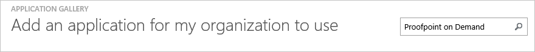
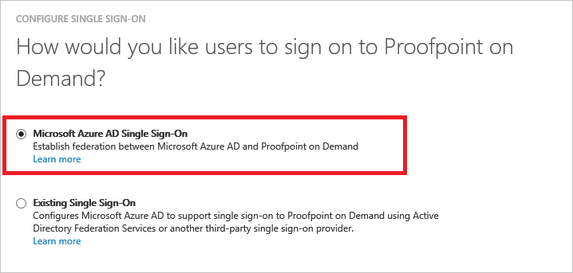
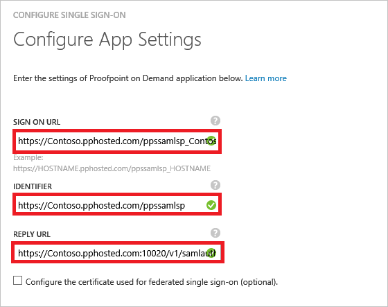
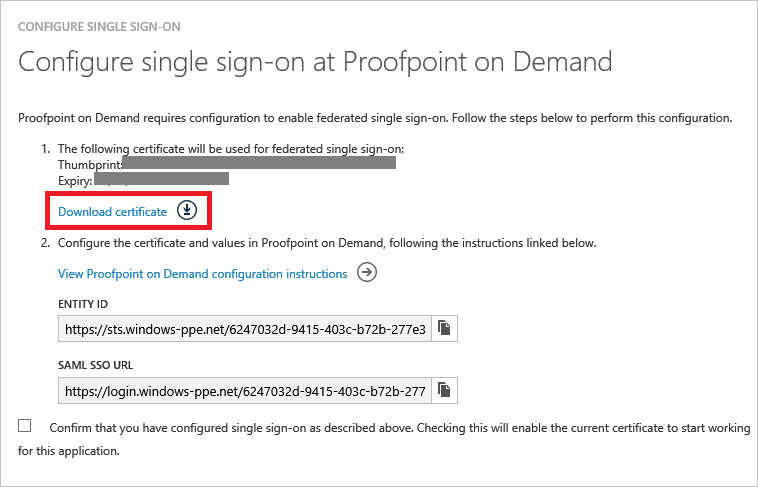
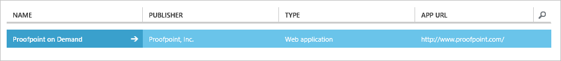

<properties
    pageTitle="Lernprogramm: Azure-Active Directory-Integration in Proofpoint on Demand | Microsoft Azure"
    description="Informationen Sie zum Konfigurieren der einmaligen Anmeldens zwischen Azure Active Directory und Proofpoint bei Bedarf."
    services="active-directory"
    documentationCenter=""
    authors="jeevansd"
    manager="femila"
    editor=""/>

<tags
    ms.service="active-directory"
    ms.workload="identity"
    ms.tgt_pltfrm="na"
    ms.devlang="na"
    ms.topic="article"
    ms.date="10/05/2016"
    ms.author="jeedes"/>

# Lernprogramm: Azure-Active Directory-Integration in Proofpoint on Demand

In diesem Lernprogramm erfahren Sie, wie Proofpoint on Demand mit Azure Active Directory (Azure AD) integriert werden soll.

Integrieren von Proofpoint bei Bedarf in Azure AD bietet Ihnen die folgenden Vorteile:

- Sie können in Azure AD steuern, die bei Bedarf auf Proofpoint zugreifen.
- Sie können die Benutzer automatisch auf Proofpoint on Demand (einmaliges Anmelden oder SSO) mit ihren Konten Azure AD-signiert erhalten auf aktivieren.
- Sie können Ihre Konten an einem zentralen Ort, der Azure klassischen Portal verwalten.

Wenn Sie weitere Details zu SaaS app-Integration in Azure AD-wissen möchten, finden Sie unter [Neuigkeiten Anwendungszugriff und einmaliges Anmelden mit Azure Active Directory?](active-directory-appssoaccess-whatis.md).

## Erforderliche Komponenten

Zum Konfigurieren von Azure AD-Integration mit Proofpoint on Demand, benötigen Sie die folgenden Elemente:

- Ein Azure AD-Abonnement
- Eine Proofpoint bei Bedarf einzelne anmelden Abonnements

Um die Schritte in diesem Lernprogramm zu testen, führen Sie diese Empfehlungen aus:

- Ihre Umgebung Herstellung nicht verwendet werden, es sei denn, dies erforderlich ist.
- Wenn Sie eine Testversion Azure AD-Umgebung besitzen, können Sie [eine Testversion einen Monat abrufen](https://azure.microsoft.com/pricing/free-trial/).

## Szenario Beschreibung
In diesem Lernprogramm testen Sie Azure AD-einmaliges Anmelden in einer testumgebung.

In diesem Lernprogramm beschriebenen Szenario besteht aus zwei Hauptfenster Bausteine:

1. Fügen Sie bei Bedarf Proofpoint aus dem Katalog.
2. Konfigurieren Sie und Testen Sie Azure AD-einmaliges Anmelden.

## Hinzufügen von Proofpoint bei Bedarf aus dem Katalog
Zum Konfigurieren der Integration von Proofpoint bei Bedarf in Azure AD müssen Sie zu Ihrer Liste der verwalteten SaaS apps aus dem Katalog Proofpoint bei Bedarf hinzuzufügen.

1. Klicken Sie im linken Navigationsbereich im Azure klassischen Portal auf **Active Directory**.

    ![Active Directory-Symbol][1]
2. Wählen Sie aus der Liste **Verzeichnis** Verzeichnis für das Sie Verzeichnisintegration aktivieren möchten.

3. Klicken Sie zum Öffnen der Anwendungsansicht in der Verzeichnisansicht auf das Menü am oberen auf **APPLICATIONS** .

    ![APPLIKATIONEN Menüelement][2]

4. Klicken Sie am unteren Rand der Seite **Hinzufügen** .

    ![Schaltfläche "hinzufügen"][3]

5. **Was möchten Sie führen Sie** im Dialogfeld klicken Sie auf **eine Anwendung aus dem Katalog hinzufügen**.

    ![Wahl der Anwendung aus dem Katalog hinzufügen][4]

6. Geben Sie im Suchfeld **Proofpoint on Demand**.

    

7. Wählen Sie im Ergebnisbereich **bei Bedarf Proofpoint**, und klicken Sie dann auf **abgeschlossen** , um die Anwendung hinzugefügt haben.

##  Konfigurieren Sie und Testen Sie der Azure AD-einmaliges Anmelden
In diesem Abschnitt Konfigurieren und Azure AD-einmaliges Anmelden mit Proofpoint auf Grundlage eines Namens Britta Simon Testbenutzers Demand testen.

Für einmaliges Anmelden entwickelt muss Azure AD wissen, was der Benutzer Gegenstück Proofpoint bei Bedarf in Azure AD einem Benutzer ist. Kurzum, müssen Sie eine Link Beziehung zwischen einem Azure AD-Benutzer und dem entsprechenden Benutzer in Proofpoint on Demand herstellen.

Sie richten diese Beziehung Link, indem Sie den Wert der **Benutzername** in Azure AD als Wert von **Username** in Proofpoint on Demand zuweisen.

Zum Konfigurieren und Azure AD-einmaliges Anmelden mit Proofpoint on Demand testen, gehen Sie folgendermaßen vor:

1. [Konfigurieren von Azure AD einmaliges Anmelden](#configuring-azure-ad-single-sign-on), damit Ihre Benutzer dieses Feature verwenden können.
2. [Erstellen einer Azure AD-Testbenutzer](#creating-an-azure-ad-test-user)Azure AD-einmaliges Anmelden mit Britta Simon testen.
3. [Erstellen einer Proofpoint auf Demand Testbenutzer](#creating-a-proofpoint-ondemand-test-user)ein Gegenstück von Britta Simon in Proofpoint on Demand haben, die in der Azure AD-Darstellung Ihrer verknüpft ist.
4. [Zuweisen den Testbenutzer Azure AD-](#assigning-the-azure-ad-test-user), Britta Simon mit Azure AD-einmaliges Anmelden aktivieren.
5. [Test einmaliges Anmelden](#testing-single-sign-on), um sicherzustellen, dass die Konfiguration funktioniert.

### Konfigurieren von Azure AD-einmaliges Anmelden

In diesem Abschnitt Azure AD-einmaliges Anmelden im klassischen Portal aktivieren und Konfigurieren der Ihre Proofpoint auf Demand Anwendung einmaliges Anmelden.

1. Im Portal klassischen auf der Seite **Proofpoint on Demand** Integration Anwendung klicken Sie auf **Konfigurieren einmaligen Anmeldens** zum Öffnen des Dialogfelds **Konfigurieren einmaliges Anmelden** .

    ![Schaltfläche "Einmaliges Anmelden konfigurieren"][6]

2. Klicken Sie auf der Seite **Wie möchten Sie Benutzer bei der Proofpoint bei Bedarf auf** **Microsoft Azure AD einmaliges Anmelden**wählen Sie aus, und klicken Sie dann auf **Weiter**.

    

3. Führen Sie auf der Seite **Einstellungen für die App konfigurieren** die folgenden Schritte aus:

    

    ein. Geben Sie in das Feld **Melden Sie sich auf URL** die URL, in dem Benutzer Ihre Proofpoint auf Demand Anwendung bei auf, ein. Verwenden Sie das folgende Muster: **https://\<Hostname\>.pphosted.com/ppssamlsp_hostname**

    b. Geben Sie die URL im Feld **BEZEICHNER** mit dem folgenden Muster: **https://\<Hostname / >.pphosted.com/ppssamlsp**

    c. Geben Sie in das Feld **Antwort-URL** die URL mit dem folgenden Muster: **https://\<Hostname / >.pphosted.com:portnumber/v1/samlauth/samlconsumer**

    d. Klicken Sie auf **Weiter**.

4. Führen Sie auf der Seite **Konfigurieren einmaliges Anmelden bei Proofpoint bei Bedarf** die folgenden Schritte aus:

    

    ein. Klicken Sie auf **Zertifikat herunterladen**, und speichern Sie die Datei auf Ihrem Computer.

    b. Klicken Sie auf **Weiter**.

5. Um SSO für die Anwendung konfigurierten zu gelangen, wenden Sie sich an den Proofpoint auf Supportteam bei Bedarf, und geben sie Folgendes:

    • Die heruntergeladene Zertifikat

    • Der Element-ID

    • Die SSO SAML-URL

6. Im Portal klassischen wählen Sie die Bestätigung Konfiguration für einzelne Zeichen, und klicken Sie dann auf **Weiter**.

    ![Das Kontrollkästchen, das bestätigt, dass Sie einmaliges Anmelden konfiguriert haben][10]

7. Klicken Sie auf der Seite **Bestätigung für einzelne anmelden** auf **abgeschlossen**.  

    ![Bestätigungsseite][11]

### Erstellen einer Azure AD-Testbenutzer
In diesem Abschnitt erstellen Sie einen Testbenutzer mit dem Namen Britta Simon in der klassischen Portal aus.

![Der Test-Benutzer in der Liste der Benutzer][20]

1. Klicken Sie im linken Navigationsbereich im Azure klassischen Portal auf **Active Directory**.

    

2. Wählen Sie aus der Liste **Verzeichnis** Verzeichnis für das Sie Verzeichnisintegration aktivieren möchten.

3. Um eine Liste der Benutzer, klicken Sie auf das Menü am oberen anzuzeigen, klicken Sie auf **Benutzer**.

    

4. Klicken Sie auf **Benutzer hinzufügen**, um auf der Symbolleiste unten im Dialogfeld **Benutzer hinzufügen** zu öffnen.

    

5. Führen Sie auf der Seite **Teilen Sie uns zu diesem Benutzer** die folgenden Schritte aus:  

    ein. Wählen Sie im Feld **Typ des Benutzers** **neuen Benutzer in Ihrer Organisation**ein.

    b. Geben Sie im Feld **Benutzername** **BrittaSimon**ein.

    c. Klicken Sie auf **Weiter**.

6.  Klicken Sie auf der Seite " **Benutzerprofil** " führen Sie die folgenden Schritte aus: 

    ein. Geben Sie im Feld **Vorname** **Britta**aus.  

    b. Geben Sie im Feld **Nachname** **Simon**aus.

    c. Geben Sie im Feld **ANZEIGENAME** **Britta Simon**aus.

    d. Wählen Sie in der Liste **Rolle** **Benutzer**aus.

    e. Klicken Sie auf **Weiter**.

7. Klicken Sie auf der Seite **erste temporäres Kennwort** auf **Erstellen**.

    

8. Klicken Sie auf der Seite **erste temporäres Kennwort** führen Sie die folgenden Schritte aus:

    

    ein. Notieren Sie den Wert in das Feld **Neues Kennwort** ein.

    b. Klicken Sie auf **abgeschlossen**.   

### Erstellen einer Proofpoint auf Demand Testbenutzers

In diesem Abschnitt erstellen Sie einen Benutzer namens Britta Simon in Proofpoint bei Bedarf an. Arbeiten Sie mit Proofpoint auf Demand Supportteam zum Hinzufügen von Benutzern in der Proofpoint auf Demand Plattform.

### Zuweisen des Azure AD-Test-Benutzers

In diesem Abschnitt aktivieren Sie Britta Simon Azure einmaliges Anmelden verwenden, indem Sie keinen Zugriff auf Proofpoint on Demand erteilen.

![Benutzerinformationen, mit Zugriff über die direkte Methode aktiviert][200]

1. Im Portal klassischen in der Verzeichnisansicht klicken Sie auf **ANWENDUNGEN** auf das Menü am oberen Rand, um die Ansicht von Applications zu öffnen.

    ![APPLIKATIONEN Menüelement][201]

2. Wählen Sie in der Liste der Anwendungen **Proofpoint on Demand**aus.

    

3. Klicken Sie auf das Menü am oberen klicken Sie auf **Benutzer**.

    ![Menüelement für Benutzer][203]

4. Wählen Sie in der Liste der Benutzer **Britta Simon**aus.

5. Klicken Sie auf der Symbolleiste unten auf **zuweisen**.

    ![Schaltfläche zuweisen][205]

### Testen Sie einmaliges Anmelden

In diesem Abschnitt Testen Sie Ihre Azure AD-einzelne anmelden Konfiguration mithilfe der Access-Systemsteuerung.

Wenn Sie die Kachel **Proofpoint bei Bedarf** auf der Access-Anzeige klicken, sollten Sie automatisch in Ihrem Proofpoint auf Demand Anwendung angemeldet sein.

## Zusätzliche Ressourcen

* [Liste der Lernprogramme wie SaaS-apps mit Azure Active Directory integriert werden soll.](active-directory-saas-tutorial-list.md)
* [Was ist die Anwendungszugriff und einmaliges Anmelden mit Azure Active Directory?](active-directory-appssoaccess-whatis.md)

<!--Image references-->

[1]: ./media/active-directory-saas-proofpoint-ondemand-tutorial/tutorial_general_01.png
[2]: ./media/active-directory-saas-proofpoint-ondemand-tutorial/tutorial_general_02.png
[3]: ./media/active-directory-saas-proofpoint-ondemand-tutorial/tutorial_general_03.png
[4]: ./media/active-directory-saas-proofpoint-ondemand-tutorial/tutorial_general_04.png

[6]: ./media/active-directory-saas-proofpoint-ondemand-tutorial/tutorial_general_05.png
[10]: ./media/active-directory-saas-proofpoint-ondemand-tutorial/tutorial_general_06.png
[11]: ./media/active-directory-saas-proofpoint-ondemand-tutorial/tutorial_general_07.png
[20]: ./media/active-directory-saas-proofpoint-ondemand-tutorial/tutorial_general_100.png

[200]: ./media/active-directory-saas-proofpoint-ondemand-tutorial/tutorial_general_200.png
[201]: ./media/active-directory-saas-proofpoint-ondemand-tutorial/tutorial_general_201.png
[203]: ./media/active-directory-saas-proofpoint-ondemand-tutorial/tutorial_general_203.png
[204]: ./media/active-directory-saas-proofpoint-ondemand-tutorial/tutorial_general_204.png
[205]: ./media/active-directory-saas-proofpoint-ondemand-tutorial/tutorial_general_205.png
