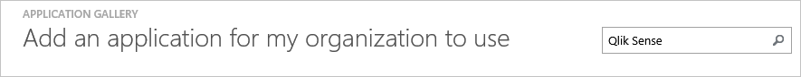
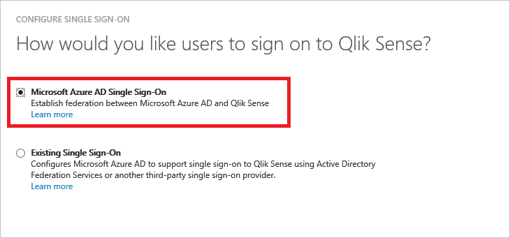
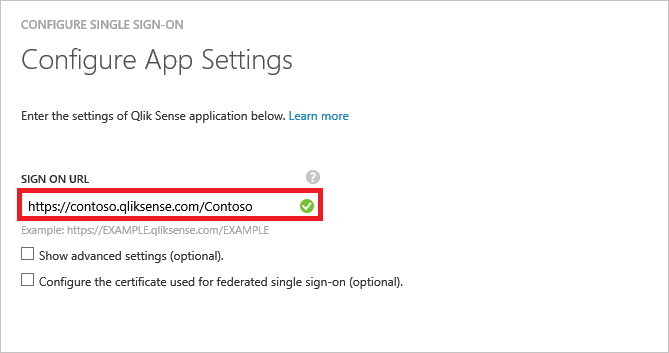
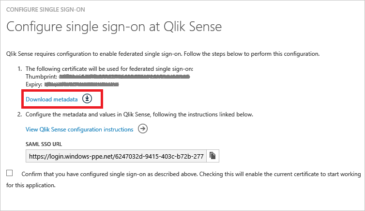
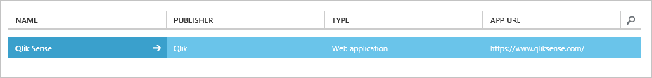

<properties
    pageTitle="Lernprogramm: Azure-Active Directory-Integration in Qlik sinnvoll Enterprise | Microsoft Azure"
    description="Informationen Sie zum Konfigurieren der einmaligen Anmeldens zwischen Azure Active Directory und Qlik sinnvoll Enterprise."
    services="active-directory"
    documentationCenter=""
    authors="jeevansd"
    manager="femila"
    editor=""/>

<tags
    ms.service="active-directory"
    ms.workload="identity"
    ms.tgt_pltfrm="na"
    ms.devlang="na"
    ms.topic="article"
    ms.date="08/31/2016"
    ms.author="jeedes"/>

# Lernprogramm: Azure-Active Directory-Integration in Qlik sinnvoll Enterprise

In diesem Lernprogramm erfahren Sie, wie Qlik sinnvoll Enterprise mit Azure Active Directory (Azure AD) integriert werden soll.

Integrieren von Azure AD Qlik sinnvoll Enterprise bietet Ihnen die folgenden Vorteile:

- Sie können in Azure AD steuern, wer auf Qlik sinnvoll Enterprise zugreifen kann
- Sie können Ihre Benutzer automatisch auf Qlik sinnvoll Enterprise (einmaliges Anmelden) angemeldete Abrufen mit ihren Azure AD-Konten aktivieren.
- Sie können Ihre Konten an einem zentralen Ort – im klassischen Azure-Portal verwalten.

Wenn Sie weitere Details zu SaaS app-Integration in Azure AD-wissen möchten, finden Sie unter [Was ist Zugriff auf die Anwendung und einmaliges Anmelden mit Azure Active Directory](active-directory-appssoaccess-whatis.md).

## Erforderliche Komponenten

Zum Konfigurieren von Azure AD-Integration mit Qlik sinnvoll Enterprise, benötigen Sie die folgenden Elemente:

- Ein Azure AD-Abonnement
- Qlik sinnvoll Enterprise einmalige Anmeldung aktiviert Abonnements

> [AZURE.NOTE] Wenn Sie um die Schritte in diesem Lernprogramm zu testen, empfehlen wir nicht mit einer Umgebung für die Herstellung.

Führen Sie zum Testen der Schritte in diesem Lernprogramm Tips:

- Sie sollten Ihre Umgebung Herstellung nicht verwenden, es sei denn, dies erforderlich ist.
- Wenn Sie eine Testversion Azure AD-Umgebung besitzen, können Sie eine einen Monat zum Testen [hier](https://azure.microsoft.com/pricing/free-trial/)erhalten.

## Szenario Beschreibung
In diesem Lernprogramm testen Sie Azure AD-einmaliges Anmelden in einer testumgebung.

In diesem Lernprogramm beschriebenen Szenario besteht aus zwei Hauptfenster Bausteine:

1. Hinzufügen von Qlik sinnvoll Enterprise aus dem Katalog
2. Konfigurieren und Testen Azure AD einmaliges Anmelden

## Hinzufügen von Qlik sinnvoll Enterprise aus dem Katalog
Zum Konfigurieren der Integration von Qlik sinnvoll Enterprise in Azure AD müssen Sie Qlik sinnvoll Enterprise zu Ihrer Liste der verwalteten SaaS apps aus dem Katalog hinzuzufügen.

**Um Qlik sinnvoll Enterprise aus dem Katalog hinzufügen möchten, führen Sie die folgenden Schritte aus:**

1. Klicken Sie im **Azure klassischen Portal**auf der linken Navigationsbereich auf **Active Directory**.

    ![Active Directory][1]
2. Wählen Sie aus der Liste **Verzeichnis** Verzeichnis für das Sie Verzeichnisintegration aktivieren möchten.

3. Klicken Sie zum Öffnen der Anwendungsansicht in der Verzeichnisansicht im oberen Menü auf **Applications** .

    ![Applikationen][2]

4. Klicken Sie auf **Hinzufügen** , am unteren Rand der Seite.

    ![Applikationen][3]

5. Klicken Sie im Dialogfeld **Was möchten Sie tun** klicken Sie auf **eine Anwendung aus dem Katalog hinzufügen**.

    ![Applikationen][4]

6. Geben Sie im Suchfeld **Qlik sinnvoll Enterprise**aus.

    

7. Wählen Sie im Ergebnisbereich **Qlik sinnvoll Enterprise aus**, und klicken Sie dann auf **abgeschlossen** , um die Anwendung hinzugefügt haben.

    

##  Konfigurieren und Testen Azure AD einmaliges Anmelden
In diesem Abschnitt Konfigurieren und Testen Azure AD-einmaliges Anmelden mit Qlik sinnvoll Enterprise basierend auf einen Testbenutzer "Britta Simon" bezeichnet.

Für einmaliges Anmelden entwickelt muss Azure AD kennen, kann der Benutzer Gegenstück Qlik sinnvoll Enterprise an einen Benutzer in Azure AD. Kurzum, muss eine Link Beziehung zwischen einem Azure AD-Benutzer und dem entsprechenden Benutzer in Qlik sinnvoll Enterprise eingerichtet werden.

Dieser Link Beziehung wird hergestellt, indem Sie den Wert des **Benutzernamens** in Azure AD als der Wert für den **Benutzernamen** in Qlik sinnvoll Enterprise zuweisen.

Zum Konfigurieren und Azure AD-einmaliges Anmelden mit Qlik sinnvoll Enterprise testen, müssen Sie die folgenden Bausteine durchführen:

1. **[Konfigurieren von Azure AD einmaligen Anmeldens](#configuring-azure-ad-single-sign-on)** - damit Ihre Benutzer dieses Feature verwenden können.
2. **[Erstellen einer Azure AD Benutzer testen](#creating-an-azure-ad-test-user)** : Azure AD-einmaliges Anmelden mit Britta Simon testen.
3. **[Erstellen eines Qlik sinnvoll Enterprise Benutzer testen](#creating-a-qliksense-enterprise-test-user)** : ein Gegenstück von Britta Simon in Enterprise-Qlik sinnvoll sein, die in der Azure AD-Darstellung Ihrer verknüpft ist.
4. **[Testen Sie Benutzer zuweisen Azure AD](#assigning-the-azure-ad-test-user)** - Britta Simon mit Azure AD-einmaliges Anmelden aktivieren.
5. **[Testen der einmaligen Anmeldens](#testing-single-sign-on)** - zur Überprüfung, ob die Konfiguration funktioniert.

### Konfigurieren von Azure AD-einmaliges Anmelden

In diesem Abschnitt Azure AD-einmaliges Anmelden im klassischen Portal aktivieren und konfigurieren in Ihrer Anwendung Qlik sinnvoll Enterprise einmaliges Anmelden.

**Führen Sie die folgenden Schritte aus, um Azure AD-einmaliges Anmelden mit Qlik sinnvoll Enterprise konfigurieren:**

1. Im Portal klassischen auf der Seite **Qlik sinnvoll Enterprise** Application Integration klicken Sie auf **Konfigurieren einmaligen Anmeldens** zum Öffnen des Dialogfelds **Konfigurieren einmaliges Anmelden** .
     
    ![Konfigurieren Sie einmaliges Anmelden][6] 

2. Klicken Sie auf der Seite **Wie möchten Sie Benutzer bei der Qlik sinnvoll Enterprise auf** **Azure AD einmaliges Anmelden**wählen Sie aus, und klicken Sie dann auf **Weiter**.

     

3. Führen Sie auf der Seite Dialogfeld **Konfigurieren der App-Einstellungen** die folgenden Schritte aus:

     

    ein. Geben Sie in das Textfeld **Melden Sie sich auf URL** die URL Ihrer Benutzer melden Sie sich für den Zugriff auf Ihre Qlik sinnvoll Enterprise-Anwendung, die mit dem folgenden Muster untersuchten: **https://\<Qlik sinnvoll vollständig im Format Hostname\>: 443 / < virtuelle Proxy Präfix\>/samlauthn/**.
    
    > [AZURE.NOTE] Beachten Sie den Schrägstrich am Ende dieses URI.  Es ist erforderlich.

    b. Klicken Sie auf **Weiter**
 
4. Führen Sie auf der Seite **Konfigurieren einmaliges Anmelden bei Qlik sinnvoll Enterprise** die folgenden Schritte aus:

    

    ein. Klicken Sie auf **Herunterladen von Metadaten**aus, und speichern Sie die Datei auf Ihrem Computer.  Bedenken Sie, diese Metadatendatei zu bearbeiten, bevor Sie auf dem Server Qlik sinnvoll hochladen.

    b. Klicken Sie auf **Weiter**.

5. Bereiten Sie die Föderation Metadaten XML-Datei, damit Sie die zu Qlik sinnvoll Server hochladen können.

    > [AZURE.NOTE] Vor dem Hochladen der IdP Metadaten auf dem Server Qlik sinnvoll, muss die Datei bearbeitet werden, um Informationen, um die ordnungsgemäße Funktion zwischen Azure AD zu entfernen und Server Qlik sinnvoll.

    ![QlikSense][qs24]

    ein. Öffnen Sie die Datei FederationMetaData.xml aus Azure in einem Texteditor heruntergeladen.

    b. Suchen Sie nach den Wert **RoleDescriptor**.  Es werden vier Einträge (zwei Paare öffnende und schließende Element-Tags).

    c. Löschen der RoleDescriptor Kategorien und alle Informationen dazwischen aus der Datei.

    d. Speichern Sie die Datei, und Umgebung zur späteren Verwendung im Dokument beibehalten.

6. Navigieren Sie zu Qlik sinnvoll Qlik Management Console (QMC) als Benutzer, der mit virtuelle Proxykonfigurationen erstellen kann.

7. Klicken Sie in der QMC auf das Menüelement virtuelle Proxy.

    ![QlikSense][qs6] 

8. Klicken Sie am unteren Rand des Bildschirms auf die neue Schaltfläche erstellen.

    ![QlikSense][qs7]

9. Der Bildschirm virtuellen Proxy bearbeiten wird angezeigt.  Klicken Sie auf der rechten Seite des Bildschirms befindet sich ein Menü für Konfigurationsoptionen sichtbar zu machen.

    ![QlikSense][qs9]

10. Geben Sie mit der Kennung Menüoption aktiviert wird die Informationen für die Azure virtuelle Proxy-Konfiguration Identifizierung aus.

    ![QlikSense][qs8]  
    
    ein. Das Feld Beschreibung wird einen Anzeigenamen für die virtuelle Proxy-Konfiguration.  Geben Sie einen Wert für eine Beschreibung ein.
    
    b. Das Feld "Präfix" identifiziert den Proxyendpunkt virtuelle zum Herstellen einer Qlik sinnvoll mit Azure AD einmaliges Anmelden.  Geben Sie einen eindeutigen Präfixnamen für diesen virtuellen Proxy aus.

    c. Inaktiv Sitzungstimeout (Minuten) wird das Timeout für Verbindungen über diese virtuelle Proxy.

    d. Des Sitzung Cookie Spaltennamens ist der Name des Cookies, speichern den Sitzungsbezeichner für die Sitzung Qlik sinnvoll, die ein Benutzer nach erfolgreicher Authentifizierung erhält.  Dieser Name muss eindeutig sein.

11. Klicken Sie auf die Menüoption Authentifizierung, um ihn sichtbar zu machen.  Anmeldebildschirm wird angezeigt.

    ![QlikSense][qs10]

    ein. Das **Modus anonymer Zugriff** Dropdown-bestimmt, ob anonyme Benutzer Qlik sinnvoll über den virtuelle Proxy zugreifen können.  Die Standardoption ist kein anonyme Benutzer.

    b. Das **Authentifizierungsmethode** Dropdown-bestimmt, dass das Authentifizierungsschema die virtuelle Proxy verwendet wird.  Wählen Sie SAML aus der Dropdownliste aus.  Weitere Optionen werden als Ergebnis angezeigt.

    c. Eingabe im **SAML Host URI Feld**Hostname Benutzer Zugriff auf Qlik sinnvoll über diesen virtuellen SAML-Proxy geben werden.  Der Hostname ist der Uri des Servers Qlik sinnvoll.

    d. Geben Sie in der **SAML-Entität-ID**den gleichen Wert für das SAML Host URI-Feld eingegeben.

    e. Der **SAML-IdP Metadaten** ist die Datei, die zuvor im Abschnitt **Bearbeiten Föderation Metadaten aus Azure AD-Konfiguration** bearbeitet.  So entfernen Sie Informationen, um die ordnungsgemäße Funktion zwischen Azure AD **vor dem Hochladen des IdP Metadaten, die Datei bearbeitet werden muss** und Qlik sinnvoll Server.  **Lizenzinformationen finden Sie die Anweisungen über, wenn die Datei noch bearbeitet werden.**  Wenn die Datei bearbeitet wurde klicken Sie auf die Schaltfläche Durchsuchen, und wählen Sie die bearbeiteten es an der Proxykonfiguration virtuelle hochzuladende Metadatendatei.

    f. Geben Sie den Attributnamen oder Referenzinformationen für das SAML-Attribut, die die **Benutzer-ID** Azure AD darstellt, wird auf dem Server Qlik sinnvoll senden.  Referenzinformationen Schema steht in der app Azure Bildschirme Beitragskonfiguration.  Verwenden Sie das Namensattribut, **Geben Sie http://schemas.xmlsoap.org/ws/2005/05/identity/claims/name**.

    g. Geben Sie den Wert für das **Benutzerverzeichnis** , die die Benutzer zugeordnet werden soll, wenn sie sich mit einem Qlik sinnvoll Server durch Azure AD-authentifizieren.  Hartcodierte Werte müssen in **eckigen Klammern []**eingeschlossen werden.  Um ein Attribut in die Azure AD SAML-Assertion gesendet verwenden zu können, geben Sie den Namen der das Attribut in dieser Text im Feld **ohne** rechteckige Klammern gesetzt.

    h. Die **signierende SAML-Algorithmus** legt das Zertifikat des Anbieter (in diesem Fall Qlik sinnvoll Server) bei der Anmeldung für die virtuelle Proxy-Konfiguration.  Wenn Qlik sinnvoll Server mit Microsoft Enhanced RSA und AES Cryptographic Provider generiert vertrauenswürdiges Zertifikat verwendet, ändern Sie den signierenden SAML-Algorithmus in **SHA-256**ein.

    Ich. Abschnitt Zuordnung SAML-Attribut ermöglicht zusätzliche Attribute wie Gruppen zur Verwendung in Sicherheitsregeln sinnvoll Qlik gesendet werden.

12. Klicken Sie auf den Lastenausgleich Menüoption aus, um es sichtbar zu machen.  Der Bildschirm Lastenausgleich wird angezeigt.

    ![QlikSense][qs11]

13. Klicken Sie auf die neue Server Knoten Schaltfläche hinzufügen, select-Engine Knoten oder Knoten Qlik sinnvoll Sitzungen zu für den Lastenausgleich Zwecke sendet, und klicken Sie auf die Schaltfläche hinzufügen.

    ![QlikSense][qs12]

14. Klicken Sie auf die Menüoption erweiterte sichtbar zu machen. Der Bildschirm erweitert wird angezeigt.

    ![QlikSense][qs13]

    ein. Die Liste der Host weiß identifiziert Hostnamen, die bei der Verbindung mit dem Server Qlik sinnvoll akzeptiert werden.  **Geben Sie den Hostnamen angegebenen Benutzer werden beim Verbinden mit Qlik sinnvoll Server aus.** Der Hostname ist der gleiche Wert wie der SAML-Uri Host, ohne die https://.

15. Klicken Sie auf die Schaltfläche Übernehmen.

    ![QlikSense][qs14]

16. Klicken Sie auf OK, um die Warnung zu übernehmen, die besagt Proxys verknüpft an den virtuelle Proxy neu gestartet werden können.

    ![QlikSense][qs15]

17. Klicken Sie auf der rechten Seite des Bildschirms angezeigt wird das zugehörige Elemente im Menü.  Klicken Sie auf die Menüoption Proxys.

    ![QlikSense][qs16]

18. Der Bildschirm Proxy wird angezeigt.  Klicken Sie auf die Schaltfläche links unten, um einen Proxy an den virtuelle Proxy verknüpfen.

    ![QlikSense][qs17]

19. Wählen Sie den Proxyknoten, der diese virtuelle Proxyverbindung unterstützen und klicken Sie auf die Schaltfläche verknüpfen.  Nach dem verknüpfen, wird der Proxy unter zugeordneten Proxys aufgeführt.

    ![QlikSense][qs18]
    ![QlikSense][qs19]

20. Nach ungefähr fünf bis zehn Sekunden erscheint die Nachricht QMC aktualisieren.  Klicken Sie auf die Schaltfläche Aktualisieren QMC.

    ![QlikSense][qs20]

21. Wenn die QMC aktualisiert wird, klicken Sie auf das Menüelement des virtuellen Proxys. Neue virtuelle Proxy-SAML-Eintrag wird in der Tabelle auf dem Bildschirm aufgeführt.  Klick auf virtuellen Proxy-Eintrag.

    ![QlikSense][qs51]

22. Am unteren Rand des Bildschirms wird die Schaltfläche SP Herunterladen von Metadaten aktivieren.  Klicken Sie auf die Schaltfläche Herunterladen SP Metadaten, um die Metadaten in eine Datei zu speichern.

    ![QlikSense][qs52]

23. Öffnen Sie die sp-Metadaten-Datei ein.  Sehen Sie sich den Eintrag **%EntityID** und den Eintrag **AssertionConsumerService** .  Diese Werte sind die **Bezeichner** und die **Melden Sie sich auf die URL** in der Anwendungskonfiguration Azure AD-entspricht. Wenn sie keine entsprechende sind sollten Sie diese im Konfigurations-Assistenten Azure AD-App ersetzen.

    ![QlikSense][qs53]

24. Im Portal klassischen wählen Sie die Bestätigung Konfiguration für einzelne Zeichen, und klicken Sie dann auf **Weiter**.
    
    ![Azure AD einmaliges Anmelden][10]

25. Klicken Sie auf der Seite **Bestätigung für einzelne anmelden** auf **abgeschlossen**.  
 
    ![Azure AD einmaliges Anmelden][11]

### Erstellen eines Benutzers mit Azure AD-testen
In diesem Abschnitt erstellen Sie einen Testbenutzer im klassischen Portal Britta Simon bezeichnet.

![Erstellen von Azure AD-Benutzer][20]

**Führen Sie die folgenden Schritte aus, um einen Testbenutzer in Azure AD zu erstellen:**

1. Klicken Sie im **Azure klassischen Portal**auf der linken Navigationsbereich auf **Active Directory**.

     

2. Wählen Sie aus der Liste **Verzeichnis** Verzeichnis für das Sie Verzeichnisintegration aktivieren möchten.

3. Wenn die Liste der Benutzer, klicken Sie im Menü oben anzeigen möchten, klicken Sie auf **Benutzer**.

     

4. Klicken Sie im Dialogfeld **Benutzer hinzufügen** um in der Symbolleiste auf der Unterseite öffnen, auf **Benutzer hinzufügen**.

     

5. Führen Sie auf der Seite **Teilen Sie uns zu diesem Benutzer** die folgenden Schritte aus:   

    ein. Wählen Sie als Typ des Benutzers neuen Benutzer in Ihrer Organisation ein.

    b. Geben Sie den Benutzernamen **Textfeld** **BrittaSimon**ein.

    c. Klicken Sie auf **Weiter**.

6.  Klicken Sie auf der Seite **Benutzerprofil** -Dialogfeld führen Sie die folgenden Schritte aus:  

    ein. Geben Sie im Textfeld **Vorname** **Britta**aus.  

    b. In das letzte Textfeld **Name** , Typ, **Simon**.

    c. Geben Sie im Textfeld **Anzeigename** **Britta Simon**aus.

    d. Wählen Sie in der Liste **Rolle** **Benutzer**aus.

    e. Klicken Sie auf **Weiter**.

7. Klicken Sie auf der Seite **erste temporäres Kennwort** auf **Erstellen**.

     

8. Führen Sie auf der Seite **erste temporäres Kennwort** die folgenden Schritte aus:

     

    ein. Notieren Sie den Wert für das **Neue Kennwort ein**.

    b. Klicken Sie auf **abgeschlossen**.   

### Erstellen eines Benutzers mit Qlik sinnvoll Enterprise testen

In diesem Abschnitt erstellen Sie einen Benutzer namens Britta Simon in Qlik sinnvoll Enterprise aus. Arbeiten Sie mit Qlik sinnvoll Enterprise-Supportteam um die Benutzer in der Qlik sinnvoll Enterprise-Plattform hinzuzufügen.

### Zuweisen des Azure AD-Test-Benutzers

In diesem Abschnitt aktivieren Sie Britta Simon Azure einmaliges Anmelden verwenden, indem Sie keinen Zugriff auf Qlik sinnvoll Enterprise erteilen.

![Benutzer zuweisen][200] 

**Um Britta Simon Qlik sinnvoll Enterprise zuzuweisen, führen Sie die folgenden Schritte aus:**

1. Klicken Sie im Portal klassischen zum Öffnen der Anwendungsansicht in der Verzeichnisansicht klicken Sie auf **Applikationen** im oberen Menü.

    ![Benutzer zuweisen][201] 

2. Wählen Sie in der Liste Applications **Qlik sinnvoll Enterprise**aus.

     

3. Klicken Sie auf **Benutzer**, klicken Sie im Menü oben.

    ![Benutzer zuweisen][203]

4. Wählen Sie in der Liste Benutzer **Britta Simon**aus.

5. Klicken Sie unten auf der Symbolleiste auf **zuweisen**.

    ![Benutzer zuweisen][205]

## Testen einmaliges Anmelden

In diesem Abschnitt Testen Sie Ihre Azure AD-einzelne anmelden Konfiguration mit der Access-Systemsteuerung.

Wenn Sie die Kachel Qlik sinnvoll Enterprise im Bereich Access klicken, Sie sollten automatisch an Ihrer Anwendung Qlik sinnvoll Enterprise angemeldete abrufen.

## Zusätzliche Ressourcen

* [Liste der zum Integrieren SaaS-Apps mit Azure-Active Directory-Lernprogramme](active-directory-saas-tutorial-list.md)
* [Was ist die Anwendungszugriff und einmaliges Anmelden mit Azure Active Directory?](active-directory-appssoaccess-whatis.md)

<!--Image references-->

[1]: ./media/active-directory-saas-qliksense-enterprise-tutorial/tutorial_general_01.png
[2]: ./media/active-directory-saas-qliksense-enterprise-tutorial/tutorial_general_02.png
[3]: ./media/active-directory-saas-qliksense-enterprise-tutorial/tutorial_general_03.png
[4]: ./media/active-directory-saas-qliksense-enterprise-tutorial/tutorial_general_04.png

[6]: ./media/active-directory-saas-qliksense-enterprise-tutorial/tutorial_general_05.png
[10]: ./media/active-directory-saas-qliksense-enterprise-tutorial/tutorial_general_06.png
[11]: ./media/active-directory-saas-qliksense-enterprise-tutorial/tutorial_general_07.png
[20]: ./media/active-directory-saas-qliksense-enterprise-tutorial/tutorial_general_100.png

[200]: ./media/active-directory-saas-qliksense-enterprise-tutorial/tutorial_general_200.png
[201]: ./media/active-directory-saas-qliksense-enterprise-tutorial/tutorial_general_201.png
[203]: ./media/active-directory-saas-qliksense-enterprise-tutorial/tutorial_general_203.png
[204]: ./media/active-directory-saas-qliksense-enterprise-tutorial/tutorial_general_204.png
[205]: ./media/active-directory-saas-qliksense-enterprise-tutorial/tutorial_general_205.png

[qs6]: ./media/active-directory-saas-qliksense-enterprise-tutorial/tutorial_qliksenseenterprise_06.png
[qs7]: ./media/active-directory-saas-qliksense-enterprise-tutorial/tutorial_qliksenseenterprise_07.png
[qs8]: ./media/active-directory-saas-qliksense-enterprise-tutorial/tutorial_qliksenseenterprise_08.png
[qs9]: ./media/active-directory-saas-qliksense-enterprise-tutorial/tutorial_qliksenseenterprise_09.png
[qs10]: ./media/active-directory-saas-qliksense-enterprise-tutorial/tutorial_qliksenseenterprise_10.png
[qs11]: ./media/active-directory-saas-qliksense-enterprise-tutorial/tutorial_qliksenseenterprise_11.png
[qs12]: ./media/active-directory-saas-qliksense-enterprise-tutorial/tutorial_qliksenseenterprise_12.png
[qs13]: ./media/active-directory-saas-qliksense-enterprise-tutorial/tutorial_qliksenseenterprise_13.png
[qs14]: ./media/active-directory-saas-qliksense-enterprise-tutorial/tutorial_qliksenseenterprise_14.png
[qs15]: ./media/active-directory-saas-qliksense-enterprise-tutorial/tutorial_qliksenseenterprise_15.png
[qs16]: ./media/active-directory-saas-qliksense-enterprise-tutorial/tutorial_qliksenseenterprise_16.png
[qs17]: ./media/active-directory-saas-qliksense-enterprise-tutorial/tutorial_qliksenseenterprise_17.png
[qs18]: ./media/active-directory-saas-qliksense-enterprise-tutorial/tutorial_qliksenseenterprise_18.png
[qs19]: ./media/active-directory-saas-qliksense-enterprise-tutorial/tutorial_qliksenseenterprise_19.png
[qs20]: ./media/active-directory-saas-qliksense-enterprise-tutorial/tutorial_qliksenseenterprise_20.png
[qs21]: ./media/active-directory-saas-qliksense-enterprise-tutorial/tutorial_qliksenseenterprise_21.png
[qs22]: ./media/active-directory-saas-qliksense-enterprise-tutorial/tutorial_qliksenseenterprise_22.png
[qs23]: ./media/active-directory-saas-qliksense-enterprise-tutorial/tutorial_qliksenseenterprise_23.png
[qs24]: ./media/active-directory-saas-qliksense-enterprise-tutorial/tutorial_qliksenseenterprise_24.png
[qs25]: ./media/active-directory-saas-qliksense-enterprise-tutorial/tutorial_qliksenseenterprise_25.png
[qs26]: ./media/active-directory-saas-qliksense-enterprise-tutorial/tutorial_qliksenseenterprise_26.png
[qs51]: ./media/active-directory-saas-qliksense-enterprise-tutorial/tutorial_qliksenseenterprise_51.png
[qs52]: ./media/active-directory-saas-qliksense-enterprise-tutorial/tutorial_qliksenseenterprise_52.png
[qs53]: ./media/active-directory-saas-qliksense-enterprise-tutorial/tutorial_qliksenseenterprise_53.png