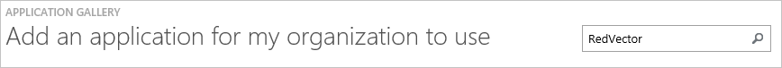
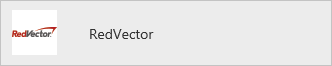
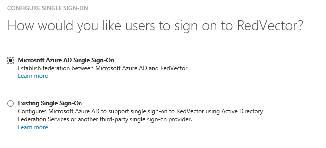
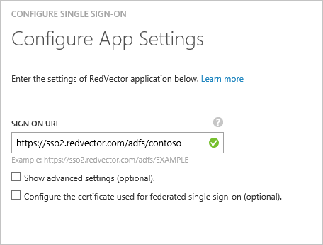
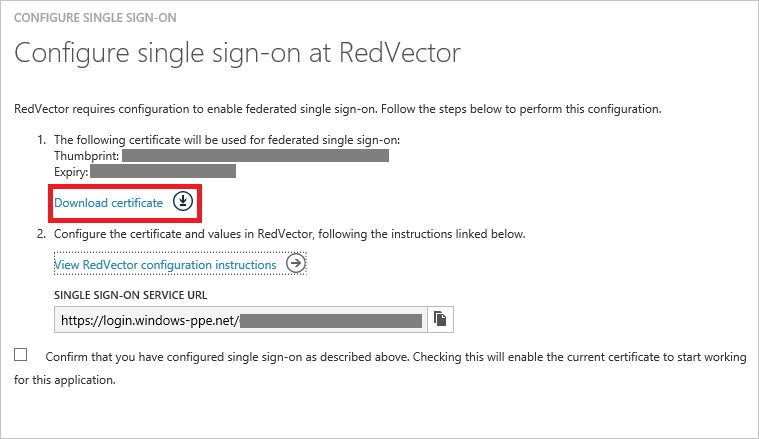
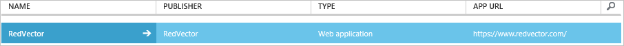

<properties
    pageTitle="Lernprogramm: Azure-Active Directory-Integration in RedVector | Microsoft Azure"
    description="Informationen Sie zum einmaligen Anmeldens zwischen Azure Active Directory und RedVector konfigurieren."
    services="active-directory"
    documentationCenter=""
    authors="jeevansd"
    manager="femila"
    editor=""/>

<tags
    ms.service="active-directory"
    ms.workload="identity"
    ms.tgt_pltfrm="na"
    ms.devlang="na"
    ms.topic="article"
    ms.date="10/28/2016"
    ms.author="jeedes"/>

# Lernprogramm: Azure-Active Directory-Integration in RedVector

In diesem Lernprogramm erfahren Sie, wie RedVector mit Azure Active Directory (Azure AD) integriert werden soll.

Integration von RedVector mit Azure AD bietet Ihnen die folgenden Vorteile:

- Sie können in Azure AD steuern, die auf RedVector zugreifen
- Sie können Ihre Benutzer automatisch auf RedVector (einmaliges Anmelden) mit ihren Konten Azure AD-angemeldete abrufen aktivieren.
- Sie können Ihre Konten an einem zentralen Ort – im klassischen Azure-Portal verwalten.

Wenn Sie weitere Details zu SaaS app-Integration in Azure AD-wissen möchten, finden Sie unter [Was ist Zugriff auf die Anwendung und einmaliges Anmelden mit Azure Active Directory](active-directory-appssoaccess-whatis.md).

## Erforderliche Komponenten

Zum Konfigurieren von Azure AD-Integration mit RedVector, benötigen Sie die folgenden Elemente:

- Ein Azure AD-Abonnement
- Eine **RedVector** einmaligen Anmeldung aktiviert Abonnement

> [AZURE.NOTE] Wenn Sie um die Schritte in diesem Lernprogramm zu testen, empfehlen wir nicht mit einer Umgebung für die Herstellung.

Führen Sie zum Testen der Schritte in diesem Lernprogramm Tips:

- Sie sollten Ihre Umgebung Herstellung nicht verwenden, es sei denn, dies erforderlich ist.
- Wenn Sie eine Testversion Azure AD-Umgebung besitzen, können Sie eine einen Monat zum Testen [hier](https://azure.microsoft.com/pricing/free-trial/)erhalten.

## Szenario Beschreibung
In diesem Lernprogramm testen Sie Azure AD-einmaliges Anmelden in einer testumgebung. In diesem Lernprogramm beschriebenen Szenario besteht aus zwei Hauptfenster Bausteine:

1. Hinzufügen von RedVector aus dem Katalog
2. Konfigurieren und Testen Azure AD einmaliges Anmelden

## Hinzufügen von RedVector aus dem Katalog
Um die Integration der RedVector in Azure AD zu konfigurieren, müssen Sie RedVector zu Ihrer Liste der verwalteten SaaS apps aus dem Katalog hinzuzufügen.

**Um RedVector aus dem Katalog hinzufügen möchten, führen Sie die folgenden Schritte aus:**

1. Klicken Sie im **Azure klassischen Portal**auf der linken Navigationsbereich auf **Active Directory**. 

    ![Active Directory][1]

2. Wählen Sie aus der Liste **Verzeichnis** Verzeichnis für das Sie Verzeichnisintegration aktivieren möchten.

3. Klicken Sie zum Öffnen der Anwendungsansicht in der Verzeichnisansicht im oberen Menü auf **Applications** .

    ![Applikationen][2]

4. Klicken Sie auf **Hinzufügen** , am unteren Rand der Seite.

    ![Applikationen][3]

5. Klicken Sie im Dialogfeld **Was möchten Sie tun** klicken Sie auf **eine Anwendung aus dem Katalog hinzufügen**.

    ![Applikationen][4]

6. Geben Sie im Suchfeld **RedVector**ein.

    

7. Wählen Sie im Ergebnisbereich **RedVector aus**, und klicken Sie dann auf **abgeschlossen** , um die Anwendung hinzugefügt haben.

    

##  Konfigurieren und Testen Azure AD einmaliges Anmelden
In diesem Abschnitt Konfigurieren und Testen Azure AD-einmaliges Anmelden mit RedVector basierend auf einen Testbenutzer "Britta Simon" bezeichnet.

Für einmaliges Anmelden entwickelt muss Azure AD kennen, kann der Benutzer Gegenstück RedVector einem Benutzer in Azure AD. Kurzum, muss eine Link Beziehung zwischen einem Azure AD-Benutzer und dem entsprechenden Benutzer in RedVector eingerichtet werden.
Dieser Link Beziehung wird hergestellt, indem Sie den Wert des **Benutzernamens** in Azure AD als der Wert für den **Benutzernamen** in RedVector zuweisen.

Zum Konfigurieren und Azure AD-einmaliges Anmelden mit RedVector testen, müssen Sie die folgenden Bausteine durchführen:

1. **[Konfigurieren von Azure AD einmaligen Anmeldens](#configuring-azure-ad-single-single-sign-on)** - damit Ihre Benutzer dieses Feature verwenden können.
2. **[Erstellen einer Azure AD Benutzer testen](#creating-an-azure-ad-test-user)** : Azure AD-einmaliges Anmelden mit Britta Simon testen.
4. **[Erstellen einer RedVector Benutzer testen](#creating-a-RedVector-test-user)** : ein Gegenstück von Britta Simon in RedVector haben, die in der Azure AD-Darstellung Ihrer verknüpft ist.
5. **[Testen Sie Benutzer zuweisen Azure AD](#assigning-the-azure-ad-test-user)** - Britta Simon mit Azure AD-einmaliges Anmelden aktivieren.
5. **[Testen der einmaligen Anmeldens](#testing-single-sign-on)** - zur Überprüfung, ob die Konfiguration funktioniert.

### Konfigurieren von Azure AD-einmaliges Anmelden

Das Ziel der in diesem Abschnitt ist Azure AD-einmaliges Anmelden im klassischen Azure-Portal aktivieren und konfigurieren einmaliges Anmelden in Ihrer Anwendung RedVector.

**Führen Sie die folgenden Schritte aus, um Azure AD-einmaliges Anmelden mit RedVector konfigurieren:**

1. Klicken Sie im Menü oben auf **Schnellstart**.

    ![Konfigurieren Sie einmaliges Anmelden][6]

2. Im Portal klassischen auf der Seite **RedVector** Integration Anwendung klicken Sie auf **Konfigurieren einmaligen Anmeldens** zum Öffnen des Dialogfelds **Konfigurieren einmaliges Anmelden** .

    ![Konfigurieren Sie einmaliges Anmelden][7] 

3. Klicken Sie auf der Seite **Wie möchten Sie Benutzer bei der RedVector auf** **Azure AD einmaliges Anmelden**wählen Sie aus, und klicken Sie dann auf **Weiter**.
    
    

4. Führen Sie auf der Seite Dialogfeld **Konfigurieren der App-Einstellungen** die folgenden Schritte aus: 

    

    ein. Geben Sie in das Textfeld melden Sie sich auf URL eine URL, die mit dem folgenden Muster: `https://sso2.redvector.com/adfs/<Companyname>`. Möglicherweise müssen Sie mit dem Redvector Support bei <sso@redvector.com> können Sie die richtigen Werte für Ihre Umgebung zu gelangen.

    b. Klicken Sie auf **Weiter**.

5. Klicken Sie auf der Seite **Konfigurieren einmaliges Anmelden bei RedVector** auf **Zertifikat herunterladen**möchten, und speichern Sie die Datei auf Ihrem Computer. Kopieren Sie außerdem den Dienst für einmaliges Anmelden URL-Wert. Sie benötigen diese Informationen zur Verfügung RedVector Support zum Abrufen von SSO konfiguriert.

    

6. Wenn für die Anwendung konfigurierten SSO erhalten möchten, wenden Sie sich an RedVector Supportteam bei <sso@redvector.com>. Sie werden mit den richtigen Kanal unterstützen, SSO konfigurieren. Klicken Sie in der e-Mail, wird Folgendes bereitgestellt: 

    - Die heruntergeladene Zertifikat
    - Die **URL der SAML-SSO**

7. Im Portal klassischen wählen Sie die Bestätigung Konfiguration für einzelne Zeichen, und klicken Sie dann auf **Weiter**.
    
    ![Azure AD einmaliges Anmelden][10]

8. Klicken Sie auf der Seite **Bestätigung für einzelne anmelden** auf **abgeschlossen**.  
    
    ![Azure AD einmaliges Anmelden][11]

### Erstellen eines Benutzers mit Azure AD-testen
In diesem Abschnitt erstellen Sie einen Testbenutzer im klassischen Portal Britta Simon bezeichnet.

![Erstellen von Azure AD-Benutzer][20]

**Führen Sie die folgenden Schritte aus, um einen Testbenutzer in Azure AD zu erstellen:**

1. Klicken Sie im **Azure klassischen Portal**auf der linken Navigationsbereich auf **Active Directory**.
    
     

2. Wählen Sie aus der Liste **Verzeichnis** Verzeichnis für das Sie Verzeichnisintegration aktivieren möchten.

3. Wenn die Liste der Benutzer, klicken Sie im Menü oben anzeigen möchten, klicken Sie auf **Benutzer**.
    
     

4. Klicken Sie im Dialogfeld **Benutzer hinzufügen** um in der Symbolleiste auf der Unterseite öffnen, auf **Benutzer hinzufügen**.

     

5. Führen Sie auf der Seite **Teilen Sie uns zu diesem Benutzer** die folgenden Schritte aus:
 
     

    ein. Wählen Sie als Typ des Benutzers neuen Benutzer in Ihrer Organisation ein.

    b. Geben Sie den Benutzernamen **Textfeld** **BrittaSimon**ein.

    c. Klicken Sie auf **Weiter**.

6.  Klicken Sie auf der Seite **Benutzerprofil** Dialogfeld führen Sie die folgenden Schritte aus:

     

    ein. Geben Sie im Textfeld **Vorname** **Britta**aus.  

    b. In das letzte Textfeld **Name** , Typ, **Simon**.

    c. Geben Sie im Textfeld **Anzeigename** **Britta Simon**aus.

    d. Wählen Sie in der Liste **Rolle** **Benutzer**aus.

    e. Klicken Sie auf **Weiter**.

7. Klicken Sie auf der Seite **erste temporäres Kennwort** auf **Erstellen**.

     

8. Führen Sie auf der Seite **erste temporäres Kennwort** die folgenden Schritte aus:

     

    ein. Notieren Sie den Wert für das **Neue Kennwort ein**.

    b. Klicken Sie auf **abgeschlossen**.   

### Erstellen eines Testbenutzers RedVector

In diesem Abschnitt erstellen Sie einen Benutzer namens Britta Simon in RedVector. Wenn Sie nicht, dass das Wissen Hinzufügen von Britta Simon in RedVector, arbeiten Sie mit RedVector Supportteam Testbenutzer hinzufügen und SSO aktivieren. Wenden Sie sich an, bei <sso@redvector.com>.

### Zuweisen des Azure AD-Test-Benutzers

In diesem Abschnitt aktivieren Sie Britta Simon Azure einmaliges Anmelden verwenden, indem Sie keinen Zugriff auf RedVector erteilen.

![Benutzer zuweisen][200] 

**Um Britta Simon RedVector zuzuweisen, führen Sie die folgenden Schritte aus:**

1. Klicken Sie im Portal klassischen zum Öffnen der Anwendungsansicht in der Verzeichnisansicht klicken Sie auf **Applikationen** im oberen Menü.

    ![Benutzer zuweisen][201] 

2. Wählen Sie in der Liste Applications **RedVector**.

     

1. Klicken Sie auf **Benutzer**, klicken Sie im Menü oben.

    ![Benutzer zuweisen][203] 

1. Wählen Sie in der Liste alle Benutzer **Britta Simon**aus.

2. Klicken Sie unten auf der Symbolleiste auf **zuweisen**.

    ![Benutzer zuweisen][205]

### Testen einmaliges Anmelden

Das Ziel der in diesem Abschnitt ist zum Azure AD-einzelne anmelden Überprüfen der Konfiguration mithilfe des Bedienfelds Access.

Wenn Sie die Kachel RedVector im Bereich Access klicken, Sie sollten automatisch an Ihrer Anwendung RedVector angemeldete abrufen.

## Zusätzliche Ressourcen

* [Liste der zum Integrieren SaaS-Apps mit Azure-Active Directory-Lernprogramme](active-directory-saas-tutorial-list.md)
* [Was ist die Anwendungszugriff und einmaliges Anmelden mit Azure Active Directory?](active-directory-appssoaccess-whatis.md)

<!--Image references-->

[1]: ./media/active-directory-saas-redvector-tutorial/tutorial_general_01.png
[2]: ./media/active-directory-saas-redvector-tutorial/tutorial_general_02.png
[3]: ./media/active-directory-saas-redvector-tutorial/tutorial_general_03.png
[4]: ./media/active-directory-saas-redvector-tutorial/tutorial_general_04.png

[5]: ./media/active-directory-saas-redvector-tutorial/tutorial_general_05.png
[6]: ./media/active-directory-saas-redvector-tutorial/tutorial_general_06.png
[7]:  ./media/active-directory-saas-redvector-tutorial/tutorial_general_050.png
[10]: ./media/active-directory-saas-redvector-tutorial/tutorial_general_060.png
[11]: ./media/active-directory-saas-redvector-tutorial/tutorial_general_070.png
[20]: ./media/active-directory-saas-redvector-tutorial/tutorial_general_100.png

[200]: ./media/active-directory-saas-redvector-tutorial/tutorial_general_200.png
[201]: ./media/active-directory-saas-redvector-tutorial/tutorial_general_201.png
[203]: ./media/active-directory-saas-redvector-tutorial/tutorial_general_203.png
[204]: ./media/active-directory-saas-redvector-tutorial/tutorial_general_204.png
[205]: ./media/active-directory-saas-redvector-tutorial/tutorial_general_205.png
