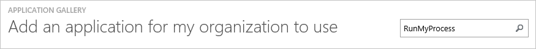
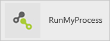
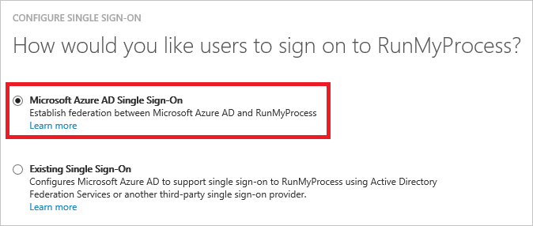
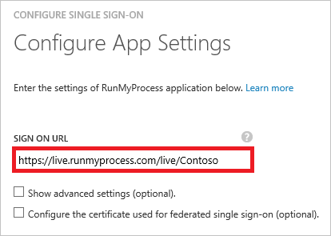
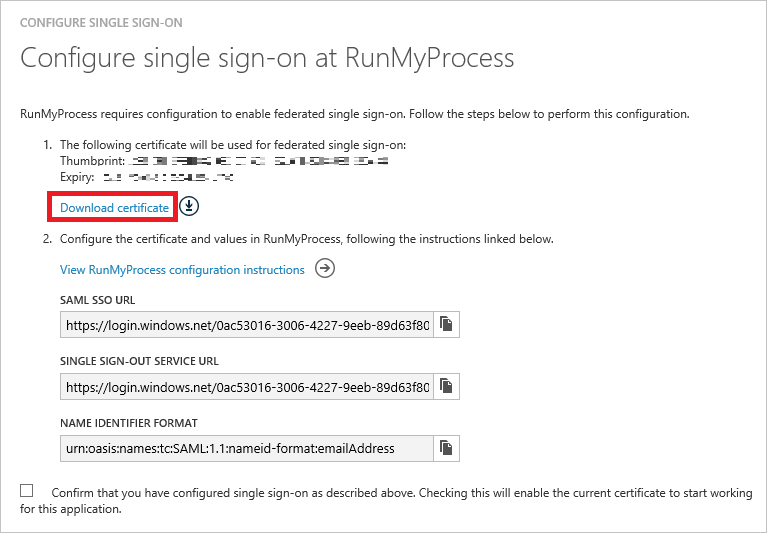
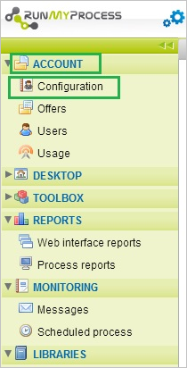
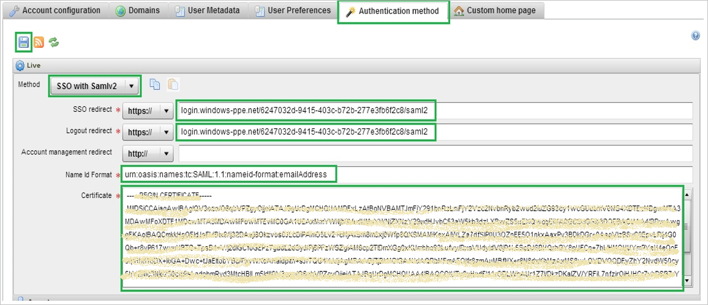
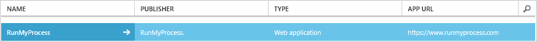

<properties
    pageTitle="Lernprogramm: Azure-Active Directory-Integration in RunMyProcess | Microsoft Azure"
    description="Informationen Sie zum einmaligen Anmeldens zwischen Azure Active Directory und RunMyProcess konfigurieren."
    services="active-directory"
    documentationCenter=""
    authors="jeevansd"
    manager="femila"
    editor=""/>

<tags
    ms.service="active-directory"
    ms.workload="identity"
    ms.tgt_pltfrm="na"
    ms.devlang="na"
    ms.topic="article"
    ms.date="10/21/2016"
    ms.author="jeedes"/>

# Lernprogramm: Azure-Active Directory-Integration in RunMyProcess

Ziel dieses Lernprogramms ist es zu zeigen, wie Sie RunMyProcess mit Azure Active Directory (Azure AD) integrieren.

Integration von RunMyProcess mit Azure AD bietet Ihnen die folgenden Vorteile:

- Sie können in Azure AD steuern, die auf RunMyProcess zugreifen
- Sie können Ihre Benutzer automatisch auf RunMyProcess (einmaliges Anmelden) mit ihren Konten Azure AD-angemeldete abrufen aktivieren.
- Sie können Ihre Konten an einem zentralen Ort – im klassischen Azure-Portal verwalten.

Wenn Sie weitere Details zu SaaS app-Integration in Azure AD-wissen möchten, finden Sie unter [Was ist Zugriff auf die Anwendung und einmaliges Anmelden mit Azure Active Directory](active-directory-appssoaccess-whatis.md).

## Erforderliche Komponenten

Zum Konfigurieren von Azure AD-Integration mit RunMyProcess, benötigen Sie die folgenden Elemente:

- Ein Azure AD-Abonnement
- Eine RunMyProcess einmaligen Anmeldung aktiviert Abonnement

> [AZURE.NOTE] Wenn Sie um die Schritte in diesem Lernprogramm zu testen, empfehlen wir nicht mit einer Umgebung für die Herstellung.

Führen Sie zum Testen der Schritte in diesem Lernprogramm Tips:

- Sie sollten Ihre Umgebung Herstellung nicht verwenden, es sei denn, dies erforderlich ist.
- Wenn Sie eine Testversion Azure AD-Umgebung besitzen, können Sie eine einen Monat zum Testen [hier](https://azure.microsoft.com/pricing/free-trial/)erhalten.

## Szenario Beschreibung
Ziel dieses Lernprogramms ist, sodass Sie in einer Umgebung für Azure AD-einmaligen Anmeldens testen können.

In diesem Lernprogramm beschriebenen Szenario besteht aus zwei Hauptfenster Bausteine:

1. Hinzufügen von RunMyProcess aus dem Katalog
2. Konfigurieren und Testen Azure AD einmaliges Anmelden

## Hinzufügen von RunMyProcess aus dem Katalog
Um die Integration der RunMyProcess in Azure AD zu konfigurieren, müssen Sie RunMyProcess zu Ihrer Liste der verwalteten SaaS apps aus dem Katalog hinzuzufügen.

**Um RunMyProcess aus dem Katalog hinzufügen möchten, führen Sie die folgenden Schritte aus:**

1. Klicken Sie im **Azure klassischen Portal**auf der linken Navigationsbereich auf **Active Directory**.

    ![Active Directory][1]

2. Wählen Sie aus der Liste **Verzeichnis** Verzeichnis für das Sie Verzeichnisintegration aktivieren möchten.

3. Klicken Sie zum Öffnen der Anwendungsansicht in der Verzeichnisansicht im oberen Menü auf **Applications** .

    ![Applikationen][2]

4. Klicken Sie auf **Hinzufügen** , am unteren Rand der Seite.

    ![Applikationen][3]

5. Klicken Sie im Dialogfeld **Was möchten Sie tun** klicken Sie auf **eine Anwendung aus dem Katalog hinzufügen**.

    ![Applikationen][4]

6. Geben Sie im Suchfeld **RunMyProcess**ein.

    

7. Wählen Sie im Ergebnisbereich **RunMyProcess aus**, und klicken Sie dann auf **abgeschlossen** , um die Anwendung hinzugefügt haben.

    

##  Konfigurieren und Testen Azure AD einmaliges Anmelden
Das Ziel der in diesem Abschnitt ist erläutert, wie Sie konfigurieren und Testen der Azure AD-einmaliges Anmelden mit RunMyProcess basierend auf einen Testbenutzer "Britta Simon" bezeichnet.

Ist für einmaliges Anmelden entwickelt Azure AD-Anforderungen wissen, was der Benutzer Gegenstück RunMyProcess einem Benutzer in Azure AD ist. Kurzum, muss eine Link Beziehung zwischen einem Azure AD-Benutzer und dem entsprechenden Benutzer in RunMyProcess eingerichtet werden.

Dieser Link Beziehung wird hergestellt, indem Sie den Wert des **Benutzernamens** in Azure AD als der Wert für den **Benutzernamen** in RunMyProcess zuweisen.

Zum Konfigurieren und Azure AD-einmaliges Anmelden mit RunMyProcess testen, müssen Sie die folgenden Bausteine durchführen:

1. **[Konfigurieren von Azure AD einmaligen Anmeldens](#configuring-azure-ad-single-sign-on)** - damit Ihre Benutzer dieses Feature verwenden können.
2. **[Erstellen einer Azure AD Benutzer testen](#creating-an-azure-ad-test-user)** : Azure AD-einmaliges Anmelden mit Britta Simon testen.
3. **[Erstellen einer RunMyProcess Benutzer testen](#creating-a-runmyprocess-test-user)** : ein Gegenstück von Britta Simon in RunMyProcess haben, die in der Azure AD-Darstellung Ihrer verknüpft ist.
4. **[Testen Sie Benutzer zuweisen Azure AD](#assigning-the-azure-ad-test-user)** - Britta Simon mit Azure AD-einmaliges Anmelden aktivieren.
5. **[Testen der einmaligen Anmeldens](#testing-single-sign-on)** - zur Überprüfung, ob die Konfiguration funktioniert.

### Konfigurieren von Azure AD-einmaliges Anmelden

In diesem Abschnitt Azure AD-einmaliges Anmelden im klassischen Portal aktivieren und konfigurieren in Ihrer Anwendung RunMyProcess einmaliges Anmelden.

**Führen Sie die folgenden Schritte aus, um Azure AD-einmaliges Anmelden mit RunMyProcess konfigurieren:**

1. Im Portal klassischen auf der Seite **RunMyProcess** Integration Anwendung klicken Sie auf **Konfigurieren einmaligen Anmeldens** zum Öffnen des Dialogfelds **Konfigurieren einmaliges Anmelden** .
     
    ![Konfigurieren Sie einmaliges Anmelden][6] 

2. Klicken Sie auf der Seite **Wie möchten Sie Benutzer bei der RunMyProcess auf** **Azure AD einmaliges Anmelden**wählen Sie aus, und klicken Sie dann auf **Weiter**.

     

3. Führen Sie auf der Seite Dialogfeld **Konfigurieren der App-Einstellungen** die folgenden Schritte aus:

     

    ein. Geben Sie in das Textfeld **Melden Sie sich auf URL** eine URL, die mit dem folgenden Muster: `https://live.runmyprocess.com/live/<tenant id>`.
        
    b. Klicken Sie auf **Weiter**

    > [AZURE.NOTE] Bitte beachten Sie, dass, Sie den Wert durch die tatsächliche melden Sie sich auf URL zu aktualisieren müssen. Um diesen Wert zu erhalten, wenden Sie sich an RunMyProcess Supportteam über <mailto:support@runmyprocess.com>.
 
4. Klicken Sie auf der Seite **Konfigurieren einmaliges Anmelden bei RunMyProcess** klicken Sie auf **Zertifikat herunterladen** , und speichern Sie die Datei auf Ihrem Computer:

    

5. In einem anderen Webbrowserfenster melden Sie sich für den Zugriff auf Ihre RunMyProcess Mandanten als Administrator.

6. Klicken Sie im linken Navigationsbereich klicken Sie auf **Konto** , und wählen Sie die **Konfiguration**.

    

7. Wechseln Sie zum Abschnitt **Authentifizierungsmethode** , und führen Sie folgende Schritte aus:

    

    ein. Wählen Sie als **Methode** **SSO mit Samlv2**aus.

    b. In der **SSO umleiten** setzen Textfeld den Wert von **SAML SSO-URL** aus Azure AD-Anwendung Kontokonfigurations-Assistenten.

    c. In der **Abmeldung umleiten** setzen Textfeld den Wert der **Einzelnen Sign-Out Service URL** aus Azure AD-Anwendung Kontokonfigurations-Assistenten.

    d. **Id Namensformat** setzen Textfeld den Wert der **Bezeichner Namensformat** aus Azure AD-Anwendung Kontokonfigurations-Assistenten aus.

    e. Kopieren Sie den Inhalt der heruntergeladenen Zertifikatsdatei, und fügen Sie ihn in das Textfeld **Zertifikat** . 

    f. Klicken Sie auf **Speichern** .
    
8. Im Portal klassischen wählen Sie die Bestätigung Konfiguration für einzelne Zeichen, und klicken Sie dann auf **Weiter**.
    
    ![Azure AD einmaliges Anmelden][10]

9. Klicken Sie auf der Seite **Bestätigung für einzelne anmelden** auf **abgeschlossen**.  
 
    ![Azure AD einmaliges Anmelden][11]

### Erstellen eines Benutzers mit Azure AD-testen
Das Ziel der in diesem Abschnitt besteht im Erstellen eines Testbenutzers im klassischen Portal Britta Simon bezeichnet.

![Erstellen von Azure AD-Benutzer][20]

**Führen Sie die folgenden Schritte aus, um einen Testbenutzer in Azure AD zu erstellen:**

1. Klicken Sie im **Azure klassischen Portal**auf der linken Navigationsbereich auf **Active Directory**.

     

2. Wählen Sie aus der Liste **Verzeichnis** Verzeichnis für das Sie Verzeichnisintegration aktivieren möchten.

3. Wenn die Liste der Benutzer, klicken Sie im Menü oben anzeigen möchten, klicken Sie auf **Benutzer**.

     

4. Klicken Sie im Dialogfeld **Benutzer hinzufügen** um in der Symbolleiste auf der Unterseite öffnen, auf **Benutzer hinzufügen**.

     

5. Führen Sie auf der Seite **Teilen Sie uns zu diesem Benutzer** die folgenden Schritte aus:   

    ein. Wählen Sie als Typ des Benutzers neuen Benutzer in Ihrer Organisation ein.

    b. Geben Sie den Benutzernamen **Textfeld** **BrittaSimon**ein.

    c. Klicken Sie auf **Weiter**.

6.  Klicken Sie auf der Seite **Benutzerprofil** -Dialogfeld führen Sie die folgenden Schritte aus:  

    ein. Geben Sie im Textfeld **Vorname** **Britta**aus.  

    b. In das letzte Textfeld **Name** , Typ, **Simon**.

    c. Geben Sie im Textfeld **Anzeigename** **Britta Simon**aus.

    d. Wählen Sie in der Liste **Rolle** **Benutzer**aus.

    e. Klicken Sie auf **Weiter**.

7. Klicken Sie auf der Seite **erste temporäres Kennwort** auf **Erstellen**.

     

8. Führen Sie auf der Seite **erste temporäres Kennwort** die folgenden Schritte aus:

     

    ein. Notieren Sie den Wert für das **Neue Kennwort ein**.

    b. Klicken Sie auf **abgeschlossen**.   

### Erstellen eines Testbenutzers RunMyProcess
  
Um Azure AD-Benutzern zur Anmeldung bei RunMyProcess zu ermöglichen, müssen er in RunMyProcess bereitgestellt werden. Im Falle von RunMyProcess ist die Bereitstellung eine manuelle Aufgabe.

#### Um eine Benutzerkonten bereitzustellen, führen Sie die folgenden Schritte aus:

1.  Melden Sie sich als Administrator in Ihrer Firmenwebsite RunMyProcess an.

2.  Klicken Sie auf **Konto** , wählen Sie im linken Navigationsbereich **Benutzer** aus, und klicken Sie auf **Neuer Benutzer**.

    ![Neuer Benutzer] (./media/active-directory-saas-runmyprocess-tutorial/tutorial_runmyprocess_003.png "Neuer Benutzer")

3.  Führen Sie im Abschnitt **User Settings** die folgenden Schritte aus:

    ![Profil] (./media/active-directory-saas-runmyprocess-tutorial/tutorial_runmyprocess_004.png "Profil")

    ein. Geben Sie den **Namen** und **E-mail** über ein gültiges AAD-Konto, die, das Sie in die verknüpfte Textfelder bereitstellen möchten.

    b. Wählen Sie eine **Sprache IDE**, eine **Sprache** und ein **Profil**.

    c. Wählen Sie die **Erstellung einer E-mail an mich Konto senden**.

    d. Klicken Sie auf **Speichern**.

    >[AZURE.NOTE] Alle anderen RunMyProcess Benutzer Konto Creation Tools können oder APIs von bereitgestellten RunMyProcess Bereitstellen von Azure Active Directory-Benutzerkonten.
    

### Zuweisen des Azure AD-Test-Benutzers

Das Ziel der in diesem Abschnitt ist für die Aktivierung der Britta Simon Azure einmaliges Anmelden verwenden, indem Sie keinen Zugriff auf RunMyProcess erteilen.

![Benutzer zuweisen][200] 

**Um Britta Simon RunMyProcess zuzuweisen, führen Sie die folgenden Schritte aus:**

1. Klicken Sie im Portal klassischen zum Öffnen der Anwendungsansicht in der Verzeichnisansicht klicken Sie auf **Applikationen** im oberen Menü.

    ![Benutzer zuweisen][201] 

2. Wählen Sie in der Liste Applications **RunMyProcess**.

     

3. Klicken Sie auf **Benutzer**, klicken Sie im Menü oben.

    ![Benutzer zuweisen][203]

4. Wählen Sie in der Liste Benutzer **Britta Simon**aus.

5. Balken unten, klicken Sie auf **zuweisen**.

    ![Benutzer zuweisen][205]

### Testen einmaliges Anmelden

Das Ziel der in diesem Abschnitt ist zum Azure AD-einzelne anmelden Überprüfen der Konfiguration mithilfe des Bedienfelds Access.
 
Wenn Sie die Kachel RunMyProcess im Bereich Access klicken, Sie sollten automatisch an Ihrer Anwendung RunMyProcess angemeldete abrufen.

## Zusätzliche Ressourcen

* [Liste der zum Integrieren SaaS-Apps mit Azure-Active Directory-Lernprogramme](active-directory-saas-tutorial-list.md)
* [Was ist die Anwendungszugriff und einmaliges Anmelden mit Azure Active Directory?](active-directory-appssoaccess-whatis.md)

<!--Image references-->

[1]: ./media/active-directory-saas-runmyprocess-tutorial/tutorial_general_01.png
[2]: ./media/active-directory-saas-runmyprocess-tutorial/tutorial_general_02.png
[3]: ./media/active-directory-saas-runmyprocess-tutorial/tutorial_general_03.png
[4]: ./media/active-directory-saas-runmyprocess-tutorial/tutorial_general_04.png

[6]: ./media/active-directory-saas-runmyprocess-tutorial/tutorial_general_05.png
[10]: ./media/active-directory-saas-runmyprocess-tutorial/tutorial_general_06.png
[11]: ./media/active-directory-saas-runmyprocess-tutorial/tutorial_general_07.png
[20]: ./media/active-directory-saas-runmyprocess-tutorial/tutorial_general_100.png

[200]: ./media/active-directory-saas-runmyprocess-tutorial/tutorial_general_200.png
[201]: ./media/active-directory-saas-runmyprocess-tutorial/tutorial_general_201.png
[203]: ./media/active-directory-saas-runmyprocess-tutorial/tutorial_general_203.png
[204]: ./media/active-directory-saas-runmyprocess-tutorial/tutorial_general_204.png
[205]: ./media/active-directory-saas-runmyprocess-tutorial/tutorial_general_205.png
