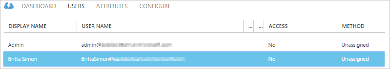
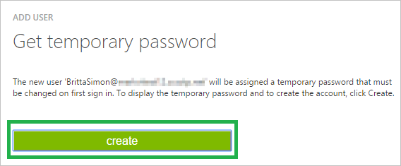

<properties 
    pageTitle="Lernprogramm: Azure-Active Directory-Integration in Samanage | Microsoft Azure" 
    description="Erfahren Sie, wie Samanage mit Azure Active Directory verwenden, aktivieren Sie einmaliges Anmelden, automatisierte Bereitstellung und mehr!" 
    services="active-directory" 
    authors="jeevansd"  
    documentationCenter="na" 
    manager="femila"/>
<tags 
    ms.service="active-directory" 
    ms.devlang="na" 
    ms.topic="article" 
    ms.tgt_pltfrm="na" 
    ms.workload="identity" 
    ms.date="08/15/2016" 
    ms.author="jeedes" />

# Lernprogramm: Azure-Active Directory-Integration in Samanage
  
Ziel dieses Lernprogramms ist es zu zeigen, wie Sie Samanage mit Azure Active Directory (Azure AD) integrieren.

Integration von Samanage mit Azure AD bietet Ihnen die folgenden Vorteile:

- Sie können in Azure AD steuern, die auf Samanage zugreifen
- Sie können Ihre Benutzer automatisch auf Samanage (einmaliges Anmelden) mit ihren Konten Azure AD-angemeldete abrufen aktivieren.
- Sie können Ihre Konten an einem zentralen Ort – im klassischen Azure-Portal verwalten.

Wenn Sie weitere Details zu SaaS app-Integration in Azure AD-wissen möchten, finden Sie unter [Was ist Zugriff auf die Anwendung und einmaliges Anmelden mit Azure Active Directory](active-directory-appssoaccess-whatis.md).

## Erforderliche Komponenten

Zum Konfigurieren von Azure AD-Integration mit Samanage, benötigen Sie die folgenden Elemente:

- Ein gültiges Azure-Abonnement
- Einen Mandanten in Samanage

> [AZURE.NOTE] Wenn Sie um die Schritte in diesem Lernprogramm zu testen, empfehlen wir nicht mit einer Umgebung für die Herstellung.

Führen Sie zum Testen der Schritte in diesem Lernprogramm Tips:

- Sie sollten Ihre Umgebung Herstellung nicht verwenden, es sei denn, dies erforderlich ist.
- Wenn Sie eine Testversion Azure AD-Umgebung besitzen, können Sie eine einen Monat zum Testen [hier](https://azure.microsoft.com/pricing/free-trial/)erhalten.

## Szenario Beschreibung
Ziel dieses Lernprogramms ist, sodass Sie in einer Umgebung für Azure AD-einmaligen Anmeldens testen können.

In diesem Lernprogramm beschriebenen Szenario besteht aus zwei Hauptfenster Bausteine:

1. Hinzufügen von Samanage aus dem Katalog
2. Konfigurieren und Testen Azure AD einmaliges Anmelden

## Hinzufügen von Samanage aus dem Katalog
Um die Integration der Samanage in Azure AD zu konfigurieren, müssen Sie Samanage zu Ihrer Liste der verwalteten SaaS apps aus dem Katalog hinzuzufügen.

**Um Samanage aus dem Katalog hinzufügen möchten, führen Sie die folgenden Schritte aus:**

1.  Klicken Sie im Azure klassischen-Portal auf der linken Navigationsbereich auf **Active Directory**.

    ![Active Directory] (./media/active-directory-saas-samanage-tutorial/tutorial_general_01.png "Active Directory")

2.  Wählen Sie aus der Liste **Verzeichnis** Verzeichnis für das Sie Verzeichnisintegration aktivieren möchten.

3.  Klicken Sie zum Öffnen der Anwendungsansicht in der Verzeichnisansicht im oberen Menü auf **Applications** .

    ![Applikationen] (./media/active-directory-saas-samanage-tutorial/tutorial_general_02.png "Applikationen")

4.  Klicken Sie auf **Hinzufügen** , am unteren Rand der Seite.

    ![Anwendung hinzufügen] (./media/active-directory-saas-samanage-tutorial/tutorial_general_03.png "Anwendung hinzufügen")

5.  Klicken Sie im Dialogfeld **Was möchten Sie tun** klicken Sie auf **eine Anwendung aus dem Katalog hinzufügen**.

    ![Hinzufügen einer Anwendung von gallerry] (./media/active-directory-saas-samanage-tutorial/tutorial_general_04.png "Hinzufügen einer Anwendung von gallerry")

6.  Geben Sie im **Suchfeld** **Samanage**.

    ![Katalog der Anwendung] (./media/active-directory-saas-samanage-tutorial/tutorial_samanage_01.png "Katalog der Anwendung")

7.  Wählen Sie im Ergebnisbereich **Samanage aus**, und klicken Sie dann auf **abgeschlossen** , um die Anwendung hinzugefügt haben.

    ![Samanage] (./media/active-directory-saas-samanage-tutorial/tutorial_samanage_02.png "Samanage")

##  Konfigurieren und Testen Azure AD einmaliges Anmelden
Das Ziel der in diesem Abschnitt ist erläutert, wie Sie konfigurieren und Testen der Azure AD-einmaliges Anmelden mit Samanage basierend auf einen Testbenutzer "Britta Simon" bezeichnet.

Für einmaliges Anmelden entwickelt muss Azure AD wissen, was der Benutzer Gegenstück Samanage an einen Benutzer in Azure AD ist. Kurzum, muss eine Link Beziehung zwischen einem Azure AD-Benutzer und dem entsprechenden Benutzer in Samanage eingerichtet werden.

Dieser Link Beziehung wird hergestellt, indem Sie den Wert des **Benutzernamens** in Azure AD als der Wert für den **Benutzernamen** in Samanage zuweisen.

Zum Konfigurieren und Azure AD-einmaliges Anmelden mit Samanage testen, müssen Sie die folgenden Bausteine durchführen:

1. **[Konfigurieren von Azure AD einmaligen Anmeldens](#configuring-azure-ad-single-single-sign-on)** - damit Ihre Benutzer dieses Feature verwenden können.
2. **[Erstellen einer Azure AD Benutzer testen](#creating-an-azure-ad-test-user)** : Azure AD-einmaliges Anmelden mit Britta Simon testen.
3. **[Erstellen einer Samanage Benutzer testen](#creating-a-Samanage-test-user)** : ein Gegenstück von Britta Simon in Samanage haben, die in der Azure AD-Darstellung Ihrer verknüpft ist.
4. **[Testen Sie Benutzer zuweisen Azure AD](#assigning-the-azure-ad-test-user)** - Britta Simon mit Azure AD-einmaliges Anmelden aktivieren.
5. **[Testen der einmaligen Anmeldens](#testing-single-sign-on)** - zur Überprüfung, ob die Konfiguration funktioniert.

### Konfigurieren von Azure AD-einmaliges Anmelden
  
In diesem Abschnitt Azure AD-einmaliges Anmelden im klassischen Portal aktivieren und konfigurieren in Ihrer Anwendung Samanage einmaliges Anmelden.

**Führen Sie die folgenden Schritte aus, um Azure AD-einmaliges Anmelden mit Samanage konfigurieren:**

1.  Im Azure klassischen-Portal auf der Seite **Samanage** Integration Anwendung klicken Sie auf **Konfigurieren einmaligen Anmeldens** um das Dialogfeld **Konfigurieren Single Sign On** öffnen.

    ![Konfigurieren einmaliges Anmelden] (./media/active-directory-saas-samanage-tutorial/tutorial_general_05.png "Konfigurieren einmaliges Anmelden")

2.  Klicken Sie auf der Seite **Wie möchten Sie Benutzer bei der Samanage auf** **Microsoft Azure AD einmaliges Anmelden**wählen Sie aus, und klicken Sie dann auf **Weiter**.

    ![Microsoft Azure AD einmaliges Anmelden] (./media/active-directory-saas-samanage-tutorial/tutorial_samanage_03.png "Microsoft Azure AD einmaliges Anmelden")

3.  Führen Sie auf der Seite Dialogfeld Konfigurieren der App-Einstellungen die folgenden Schritte aus:

    ![Konfigurieren der App-URL] (./media/active-directory-saas-samanage-tutorial/tutorial_samanage_04.png "Konfigurieren der App-URL")

    ein. Geben Sie in das Textfeld **Melden Sie sich auf URL** eine URL, die mit dem folgenden Muster: `https://<Company Name>.samanage.com/saml_login/<Company Name>`.
    
    b. Klicken Sie auf **Weiter**

    > [AZURE.NOTE] Bitte beachten Sie, dass diese nicht die tatsächlichen Werte sind. Sie müssen diese Werte durch die tatsächliche melden Sie sich auf URL zu aktualisieren. Um diese Werte zu erhalten, finden Sie weitere Details 8.c Schritt, oder wenden Sie sich an Samanage.

4.  Klicken Sie auf der Seite **Konfigurieren einmaliges Anmelden bei Samanage** klicken Sie auf **Zertifikat herunterladen**, und speichern Sie die Zertifikatdatei auf Ihrem Computer.

    ![Konfigurieren Sie einmaliges Anmelden] (./media/active-directory-saas-samanage-tutorial/tutorial_samanage_05.png "Konfigurieren Sie einmaliges Anmelden")

5.  In einem anderen Webbrowserfenster melden Sie sich bei der Website Ihres Unternehmens Samanage als Administrator.

6.  Klicken Sie auf **Dashboard** , und wählen Sie **Setup** im linken Navigationsbereich.

    ![Dashboard] (./media/active-directory-saas-samanage-tutorial/tutorial_samanage_001.png "Dashboard")

7.  Klicken Sie auf **Einmaliges Anmelden**.

    ![Einmaliges Anmelden] (./media/active-directory-saas-samanage-tutorial/tutorial_samanage_002.png "Einmaliges Anmelden")

8.  Navigieren Sie zum Abschnitt **Login mithilfe von SAML** , führen Sie die folgenden Schritte aus:
    
    ![Melden Sie sich mithilfe von SAML] (./media/active-directory-saas-samanage-tutorial/tutorial_samanage_003.png "Melden Sie sich mithilfe von SAML")

    ein.  Klicken Sie auf **einmaliges Anmelden mit SAML aktivieren**.

    b.  In der **Identität Anbieter URL** setzen Textfeld den Wert der **Identität Anbieter-ID** aus Azure AD-Anwendung Kontokonfigurations-Assistenten aus.    

    c.  Bestätigen Sie, dass die **Anmelde-URL,** die **Auf URL melden Sie sich** in Schritt 3 übereinstimmt.

    d.  In der **URL Abmeldung** setzen Textfeld den Wert des **Remote Abmeldung URL** aus Azure AD-Anwendung Kontokonfigurations-Assistenten aus.

    e. Geben Sie in das Textfeld **SAML-Herausgeber** der app-Id in der Identitätsanbieter festgelegte URI aus.

    f.  Öffnen Sie Ihre Base-64-codierte Zertifikat in Editor, kopieren Sie den Inhalt der es in der Zwischenablage, und fügen Sie ihn in das Textfeld **Ihre Identitätsanbieter x. 509-Zertifikat darunter einfügen** .
    
    g.  Klicken Sie auf **Benutzer erstellen, wenn sie nicht in Samanage vorhanden sind**.
    
    h.  Klicken Sie auf **Aktualisieren**.

9.  Im Portal klassischen wählen Sie die Bestätigung Konfiguration für einzelne Zeichen, und klicken Sie dann auf **Weiter**.

    ![Konfigurieren Sie einmaliges Anmelden] (./media/active-directory-saas-samanage-tutorial/tutorial_samanage_06.png "Konfigurieren Sie einmaliges Anmelden")

10. Klicken Sie auf der Seite **Bestätigung für einzelne anmelden** auf **abgeschlossen**.

    ![Konfigurieren Sie einmaliges Anmelden] (./media/active-directory-saas-samanage-tutorial/tutorial_samanage_07.png "Konfigurieren Sie einmaliges Anmelden")

### Erstellen eines Benutzers mit Azure AD-testen

Das Ziel der in diesem Abschnitt besteht im Erstellen eines Testbenutzers im klassischen Portal Britta Simon bezeichnet.

**Führen Sie die folgenden Schritte aus, um einen Testbenutzer in Azure AD zu erstellen:**

1. Klicken Sie im **Azure klassischen Portal**auf der linken Navigationsbereich auf **Active Directory**.

    

2. Wählen Sie aus der Liste **Verzeichnis** Verzeichnis für das Sie Verzeichnisintegration aktivieren möchten.

3. Wenn die Liste der Benutzer, klicken Sie im Menü oben anzeigen möchten, klicken Sie auf **Benutzer**.
    
    

4. Klicken Sie im Dialogfeld **Benutzer hinzufügen** um in der Symbolleiste auf der Unterseite öffnen, auf **Benutzer hinzufügen**.

    

5. Führen Sie auf der Seite **Teilen Sie uns zu diesem Benutzer** die folgenden Schritte aus:

    

    ein. Wählen Sie als Typ des Benutzers neuen Benutzer in Ihrer Organisation ein.

    b. Geben Sie den Benutzernamen **Textfeld** **BrittaSimon**ein.

    c. Klicken Sie auf **Weiter**.

6.  Klicken Sie auf der Seite **Benutzerprofil** Dialogfeld führen Sie die folgenden Schritte aus:
    
    

    ein. Geben Sie im Textfeld **Vorname** **Britta**aus.  

    b. In das letzte Textfeld **Name** , Typ, **Simon**.

    c. Geben Sie im Textfeld **Anzeigename** **Britta Simon**aus.

    d. Wählen Sie in der Liste **Rolle** **Benutzer**aus.

    e. Klicken Sie auf **Weiter**.

7. Klicken Sie auf der Seite **erste temporäres Kennwort** auf **Erstellen**.
    
    

8. Klicken Sie auf der Seite **erste temporäres Kennwort** führen Sie die folgenden Schritte aus:
    
    

    ein. Notieren Sie den Wert für das **Neue Kennwort ein**.

    b. Klicken Sie auf **abgeschlossen**.   

### Erstellen eines Testbenutzers Samanage
  
Um Azure AD-Benutzern zur Anmeldung bei Samanage zu ermöglichen, diese bereitgestellt werden müssen in der Groß-/Kleinschreibung von Samanage Samanage.In, bereitgestellt ist eine manuelle Aufgabe.

####Um ein Benutzerkonto bereitstellen, führen Sie die folgenden Schritte aus:

1.  Melden Sie sich als Administrator in Ihrer Firmenwebsite Samanage.

2.  Klicken Sie auf **Dashboard** , und wählen Sie **Setup** im linken Navigationsbereich verschieben.

    ![Setup] (./media/active-directory-saas-samanage-tutorial/tutorial_samanage_001.png "Setup")

3.  Klicken Sie auf der Registerkarte **Benutzer**

    ![Benutzer] (./media/active-directory-saas-samanage-tutorial/tutorial_samanage_006.png "Benutzer")

4.  Klicken Sie auf **Neuer Benutzer**.

    ![Neuer Benutzer] (./media/active-directory-saas-samanage-tutorial/tutorial_samanage_007.png "Neuer Benutzer")

5.  Geben Sie den **Namen** und die **E-Mail-Adresse** eines Kontos Azure AD-, die Sie bereitstellen, und klicken Sie auf **Benutzer erstellen**möchten.

    ![Erstellen Benutzer] (./media/active-directory-saas-samanage-tutorial/tutorial_samanage_008.png "Erstellen Benutzer")

    >[AZURE.NOTE]Der Inhaber des AAD Konto wird erhalten eine e-Mail, und führen Sie einen Link, um ihr Konto zu bestätigen, bevor sie aktiviert wurde. Alle anderen Samanage Benutzer Konto Creation Tools können oder APIs bereitgestellt durch Samanage bereitstellen AAD Benutzerkonten.

###Zuweisen des Azure AD-Test-Benutzers
  
Das Ziel der in diesem Abschnitt ist für die Aktivierung der Britta Simon Azure einmaliges Anmelden verwenden, indem Sie keinen Zugriff auf Samanage erteilen.
    
![Zuweisen von Benutzern] (./media/active-directory-saas-samanage-tutorial/assign_aaduser_00.png "Zuweisen von Benutzern")

**Um Britta Simon Samanage zuzuweisen, führen Sie die folgenden Schritte aus:**

1. Klicken Sie im Portal klassischen zum Öffnen der Anwendungsansicht in der Verzeichnisansicht klicken Sie auf **Applikationen** im oberen Menü.
    
    ![Zuweisen von Benutzern] (./media/active-directory-saas-samanage-tutorial/assign_aaduser_01.png "Zuweisen von Benutzern")

2. Wählen Sie in der Liste Applications **Samanage**.
    
    

3. Klicken Sie auf **Benutzer**, klicken Sie im Menü oben.
    
    ![Zuweisen von Benutzern] (./media/active-directory-saas-samanage-tutorial/assign_aaduser_02.png "Zuweisen von Benutzern")

4. Wählen Sie in der Liste Benutzer **Britta Simon**aus.

5. Klicken Sie unten auf der Symbolleiste auf **zuweisen**.
    
    ![Zuweisen von Benutzern] (./media/active-directory-saas-samanage-tutorial/assign_aaduser_03.png "Zuweisen von Benutzern")

### Testen einmaliges Anmelden

Das Ziel der in diesem Abschnitt ist zum Azure AD-einzelne anmelden Überprüfen der Konfiguration mithilfe des Bedienfelds Access.
 
Wenn Sie die Kachel Samanage im Bereich Access klicken, Sie sollten automatisch an Ihrer Anwendung Samanage angemeldete abrufen.

## Zusätzliche Ressourcen

* [Liste der zum Integrieren SaaS-Apps mit Azure-Active Directory-Lernprogramme](active-directory-saas-tutorial-list.md)
* [Was ist die Anwendungszugriff und einmaliges Anmelden mit Azure Active Directory?](active-directory-appssoaccess-whatis.md)