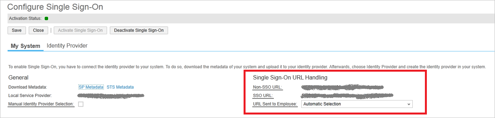

<properties
    pageTitle="Lernprogramm: Azure-Active Directory-Integration mit SAP-Business ByDesign | Microsoft Azure"
    description="Informationen Sie zum Konfigurieren der einmaligen Anmeldens zwischen Azure Active Directory und SAP-Business ByDesign."
    services="active-directory"
    documentationCenter=""
    authors="jeevansd"
    manager="femila"
    editor=""/>

<tags
    ms.service="active-directory"
    ms.workload="identity"
    ms.tgt_pltfrm="na"
    ms.devlang="na"
    ms.topic="article"
    ms.date="09/09/2016"
    ms.author="jeedes"/>

# Lernprogramm: Azure-Active Directory-Integration mit SAP-Business ByDesign

In diesem Lernprogramm erfahren Sie, wie SAP-Business ByDesign mit Azure Active Directory (Azure AD) integriert werden soll.

Integrieren von SAP-Business ByDesign mit Azure AD bietet Ihnen die folgenden Vorteile:

- Sie können in Azure AD steuern, wer Zugriff auf SAP-Business ByDesign hat
- Sie können Ihre Benutzer automatisch auf SAP-Business ByDesign (einmaliges Anmelden) angemeldete Abrufen mit ihren Azure AD-Konten aktivieren.
- Sie können Ihre Konten an einem zentralen Ort – im klassischen Azure-Portal verwalten.

Wenn Sie weitere Details zu SaaS app-Integration in Azure AD-wissen möchten, finden Sie unter [Was ist Zugriff auf die Anwendung und einmaliges Anmelden mit Azure Active Directory](active-directory-appssoaccess-whatis.md).

## Erforderliche Komponenten

Zum Konfigurieren von Azure AD-Integration mit SAP-Business ByDesign, benötigen Sie die folgenden Elemente:

- Ein Azure AD-Abonnement
- Ein SAP-Business ByDesign einmaligen Anmeldung aktiviert Abonnement

> [AZURE.NOTE] Wenn Sie um die Schritte in diesem Lernprogramm zu testen, empfehlen wir nicht mit einer Umgebung für die Herstellung.

Führen Sie zum Testen der Schritte in diesem Lernprogramm Tips:

- Sie sollten Ihre Umgebung Herstellung nicht verwenden, es sei denn, dies erforderlich ist.
- Wenn Sie eine Testversion Azure AD-Umgebung besitzen, können Sie eine einen Monat zum Testen [hier](https://azure.microsoft.com/pricing/free-trial/)erhalten.

## Szenario Beschreibung
In diesem Lernprogramm testen Sie Azure AD-einmaliges Anmelden in einer testumgebung.

In diesem Lernprogramm beschriebenen Szenario besteht aus zwei Hauptfenster Bausteine:

1. Hinzufügen von SAP-Business ByDesign aus dem Katalog
2. Konfigurieren und Testen Azure AD einmaliges Anmelden

## Hinzufügen von SAP-Business ByDesign aus dem Katalog
Zum Konfigurieren der Integration von SAP-Business ByDesign in Azure AD müssen Sie SAP-Business ByDesign zu Ihrer Liste der verwalteten SaaS apps aus dem Katalog hinzuzufügen.

**Wenn SAP-Business ByDesign aus dem Katalog hinzufügen möchten, führen Sie die folgenden Schritte aus:**

1. Klicken Sie im **Azure klassischen Portal**auf der linken Navigationsbereich auf **Active Directory**.

    ![Active Directory][1]

2. Wählen Sie aus der Liste **Verzeichnis** Verzeichnis für das Sie Verzeichnisintegration aktivieren möchten.

3. Klicken Sie zum Öffnen der Anwendungsansicht in der Verzeichnisansicht im oberen Menü auf **Applications** .

    ![Applikationen][2]

4. Klicken Sie auf **Hinzufügen** , am unteren Rand der Seite.

    ![Applikationen][3]

5. Klicken Sie im Dialogfeld **Was möchten Sie tun** klicken Sie auf **eine Anwendung aus dem Katalog hinzufügen**.

    ![Applikationen][4]

6. Geben Sie in das Suchfeld ein **SAP-Business ByDesign**.

    

7. Im Bereich Ergebnisse wählen Sie **SAP-Business ByDesign aus**und dann auf **abgeschlossen** , um die Anwendung hinzuzufügen.

    

##  Konfigurieren und Testen Azure AD einmaliges Anmelden
In diesem Abschnitt Konfigurieren und Testen Azure AD-einmaliges Anmelden mit SAP-Business ByDesign basierend auf einen Testbenutzer "Britta Simon" bezeichnet.

Für einmaliges Anmelden entwickelt muss Azure AD wissen, was der Benutzer Gegenstück SAP-Business ByDesign einem Benutzer in Azure AD ist. Kurzum, muss eine Link Beziehung zwischen einem Azure AD-Benutzer und der entsprechenden Benutzerinformationen im SAP-Business ByDesign eingerichtet werden.

Dieser Link Beziehung wird hergestellt, indem Sie den Wert des **Benutzernamens** in Azure AD als der Wert für den **Benutzernamen** in SAP-Business ByDesign zuweisen.

Zum Konfigurieren und Azure AD-einmaliges Anmelden mit SAP-Business ByDesign testen, müssen Sie die folgenden Bausteine durchführen:

1. **[Konfigurieren von Azure AD einmaligen Anmeldens](#configuring-azure-ad-single-sign-on)** - damit Ihre Benutzer dieses Feature verwenden können.
2. **[Erstellen einer Azure AD Benutzer testen](#creating-an-azure-ad-test-user)** : Azure AD-einmaliges Anmelden mit Britta Simon testen.
3. **[Erstellen eines SAP-Business ByDesign Benutzer testen](#creating-an-sap-business-bydesign-test-user)** : ein Gegenstück von Britta Simon in SAP-Business ByDesign haben, die in der Azure AD-Darstellung Ihrer verknüpft ist.
4. **[Testen Sie Benutzer zuweisen Azure AD](#assigning-the-azure-ad-test-user)** - Britta Simon mit Azure AD-einmaliges Anmelden aktivieren.
5. **[Testen der einmaligen Anmeldens](#testing-single-sign-on)** - zur Überprüfung, ob die Konfiguration funktioniert.

### Konfigurieren von Azure AD-einmaliges Anmelden

In diesem Abschnitt Azure AD-einmaliges Anmelden im klassischen Portal aktivieren und konfigurieren in Ihrer Anwendung SAP-Business ByDesign einmaliges Anmelden.

SAP-Business ByDesign-Anwendung erwartet die SAML-Assertionen in einem bestimmten Format an. Konfigurieren Sie die folgenden Ansprüche für diese Anwendung. Sie können die Werte dieser Attribute der Registerkarte **"Atrribute"** der Anwendung verwalten. Das folgende Bildschirmabbild zeigt ein Beispiel dafür. 

**So konfigurieren Sie Azure AD-einmaliges Anmelden mit SAP-Business ByDesign die folgenden Schritte aus:**

1. Im klassischen Azure Portal **SAP-Business ByDesign** Anwendung Integration in die Seite, klicken Sie im Menü oben klicken Sie auf **Attribute**.

     

2. Klicken Sie in der Liste der Attribute SAML-token Attributen wählen Sie das Attribut Nameidentifier, und klicken Sie dann auf **Bearbeiten**.

     

3. Klicken Sie im Dialogfeld Benutzerattribut bearbeiten führen Sie die folgenden Schritte aus:

     

    ein. Wählen Sie aus der Liste Attributwert aus der **ExtractMailPrefix()** fuction

    b. Wählen Sie in der Liste e-Mail-Benutzer-Attribut, die, das Sie für Ihre Implementierung verwenden möchten. 
    Angenommen, wenn die EmployeeID als eindeutige Benutzer-ID verwenden möchten, und Sie den Attributwert in der ExtensionAttribute2 gespeichert haben, wählen Sie dann **user.extensionattribute2**. 

    c. Klicken Sie auf **abgeschlossen**. 
    

4. Im Portal klassischen auf der Seite Anwendung Integration von **SAP-Business ByDesign** klicken Sie auf **Konfigurieren einmaligen Anmeldens** zum Öffnen des Dialogfelds **Konfigurieren einmaliges Anmelden** .
     
    ![Konfigurieren Sie einmaliges Anmelden][6] 

5. Klicken Sie auf der Seite **Wie möchten Sie Benutzer bei der SAP-Business ByDesign auf** **Azure AD einmaliges Anmelden**wählen Sie aus, und klicken Sie dann auf **Weiter**.

     

6. Führen Sie auf der Seite Dialogfeld **Konfigurieren der App-Einstellungen** die folgenden Schritte aus:

     

    ein. Geben Sie in das Textfeld **Melden Sie sich auf URL** die URL Ihrer Benutzer melden Sie sich für den Zugriff auf Ihre SAP-Business ByDesign-Anwendung unter Verwendung des folgenden Musters untersuchten aus:`https://<servername>.sapbydesign.com`
    
    b. Klicken Sie auf **Weiter**
 
7. Führen Sie auf der Seite **Konfigurieren einmaliges Anmelden bei SAP-Business ByDesign** die folgenden Schritte aus:

    

    ein. Klicken Sie auf **Herunterladen von Metadaten**aus, und speichern Sie die Datei auf Ihrem Computer.

    b. Klicken Sie auf **Weiter**.

8. Um für die Anwendung konfigurierten SSO zu erhalten, führen Sie die folgenden Schritte aus:

    ein. Melden Sie sich auf Ihre SAP-Business ByDesign-Portal mit Administratorrechten an.

    b. Navigieren Sie zur **Anwendung und Benutzer Management allgemeine Aufgabe** , und klicken Sie auf der Registerkarte **Identitätsanbieter** .

    c. Klicken Sie auf **Neue Identitätsanbieter** , und wählen Sie die Metadaten-XML-Datei, die Sie vom klassischen Azure-Portal heruntergeladen haben. Durch das Importieren von Metadaten aus, uploads das System automatisch die erforderlichen Signaturzertifikat und Verschlüsselungszertifikats an.

    

    d. Wählen Sie zum Einschließen der **Assertion Consumer Dienst-URL** in die Anfrage SAML **Einschließen Assertion Consumer Service URL**ein.

    e. Klicken Sie auf **einmaliges Anmelden aktivieren**.

    f. Die Änderungen zu speichern.

    g. Klicken Sie auf der Registerkarte **Meine System** .

    

    h. Kopieren Sie die **SSO-URL** , und fügen Sie ihn in das Textfeld **Azure AD melden Sie sich auf die URL** .

    

    Ich. Geben Sie an, ob der Mitarbeiter manuell zwischen-Befehl mit Benutzer-ID und Ihr Kennwort oder SSO, indem Sie **Manuelle Identität Anbieter Auswahl**auswählen auswählen kann.

    j. Geben Sie im Abschnitt **SSO-URL** die URL, die der Mitarbeiter für die Anmeldung an das System verwendet werden soll. 
    In der URL gesendet Mitarbeiter Dropdown-Liste können Sie zwischen den folgenden Optionen auswählen:
    
    **Nicht-SSO-URL**
 
    Das System sendet nur die normalen System-URL für den Mitarbeiter. Der Mitarbeiter kann nicht melden Sie sich über SSO, muss und Trennzeichen Kennwort verwenden oder stattdessen das Zertifikat.

    **SSO-URL** 

    Das System sendet nur die SSO-URL für den Mitarbeiter. Der Mitarbeiter kann sich über SSO anmelden. Anforderung der Authentifizierung wird durch die IdP umgeleitet.

    **Automatische Auswahl**
 
    Wenn SSO nicht aktiviert ist, sendet das System den normalen System-URL für den Mitarbeiter an. Wenn SSO aktiv ist, prüft das System, ob der Mitarbeiter ein Kennwort geschützt ist. Wenn ein Kennwort verfügbar ist, werden sowohl SSO-URL und nicht SSO URL an den Mitarbeiter gesendet. Wenn der Mitarbeiter kein Kennwort hat, wird nur die SSO-URL für den Mitarbeiter gesendet.

    k. Die Änderungen zu speichern.

9. Im Portal klassischen wählen Sie die Bestätigung Konfiguration für einzelne Zeichen, und klicken Sie dann auf **Weiter**.
    
    ![Azure AD einmaliges Anmelden][10]

10. Klicken Sie auf der Seite **Bestätigung für einzelne anmelden** auf **abgeschlossen**.  
 
    ![Azure AD einmaliges Anmelden][11]

### Erstellen eines Benutzers mit Azure AD-testen
In diesem Abschnitt erstellen Sie einen Testbenutzer im klassischen Portal Britta Simon bezeichnet.

![Erstellen von Azure AD-Benutzer][20]

**Führen Sie die folgenden Schritte aus, um einen Testbenutzer in Azure AD zu erstellen:**

1. Klicken Sie im **Azure klassischen Portal**auf der linken Navigationsbereich auf **Active Directory**.

     

2. Wählen Sie aus der Liste **Verzeichnis** Verzeichnis für das Sie Verzeichnisintegration aktivieren möchten.

3. Wenn die Liste der Benutzer, klicken Sie im Menü oben anzeigen möchten, klicken Sie auf **Benutzer**.

     

4. Klicken Sie im Dialogfeld **Benutzer hinzufügen** um in der Symbolleiste auf der Unterseite öffnen, auf **Benutzer hinzufügen**.

     

5. Führen Sie auf der Seite **Teilen Sie uns zu diesem Benutzer** die folgenden Schritte aus:
    
     

    ein. Wählen Sie als Typ des Benutzers neuen Benutzer in Ihrer Organisation ein.

    b. Geben Sie den Benutzernamen **Textfeld** **BrittaSimon**ein.

    c. Klicken Sie auf **Weiter**.

6.  Klicken Sie auf der Seite **Benutzerprofil** Dialogfeld führen Sie die folgenden Schritte aus:
    
     

    ein. Geben Sie im Textfeld **Vorname** **Britta**aus.  

    b. In das letzte Textfeld **Name** , Typ, **Simon**.

    c. Geben Sie im Textfeld **Anzeigename** **Britta Simon**aus.

    d. Wählen Sie in der Liste **Rolle** **Benutzer**aus.

    e. Klicken Sie auf **Weiter**.

7. Klicken Sie auf der Seite **erste temporäres Kennwort** auf **Erstellen**.

     

8. Führen Sie auf der Seite **erste temporäres Kennwort** die folgenden Schritte aus:

     

    ein. Notieren Sie den Wert für das **Neue Kennwort ein**.

    b. Klicken Sie auf **abgeschlossen**.   

### Erstellen eines Benutzers mit SAP-Business ByDesign test

In diesem Abschnitt erstellen Sie einen Benutzer namens Britta Simon in SAP-Business ByDesign. Arbeiten Sie mit SAP-Business ByDesign Supportteam Benutzer in die SAP-Business ByDesign-Plattform hinzufügen. 

> [AZURE.NOTE] Stellen Sie sicher, dass NameID Wert mit dem Username-Feld in der SAP-Business ByDesign-Plattform entsprechen sollen.

### Zuweisen des Azure AD-Test-Benutzers

In diesem Abschnitt aktivieren Sie Britta Simon Azure einmaliges Anmelden verwenden, indem Sie keinen Zugriff auf SAP-Business ByDesign erteilen.

![Benutzer zuweisen][200] 

**Um Britta Simon SAP-Business ByDesign zuzuweisen, führen Sie die folgenden Schritte aus:**

1. Klicken Sie im Portal klassischen zum Öffnen der Anwendungsansicht in der Verzeichnisansicht klicken Sie auf **Applikationen** im oberen Menü.

    ![Benutzer zuweisen][201] 

2. Wählen Sie in der Liste Applikationen **SAP-Business ByDesign**.

     

3. Klicken Sie auf **Benutzer**, klicken Sie im Menü oben.

    ![Benutzer zuweisen][203]

4. Wählen Sie in der Liste Benutzer **Britta Simon**aus.

5. Klicken Sie unten auf der Symbolleiste auf **zuweisen**.

    ![Benutzer zuweisen][205]

### Testen einmaliges Anmelden

In diesem Abschnitt Testen Sie Ihre Azure AD-einzelne anmelden Konfiguration mit der Access-Systemsteuerung.

Wenn Sie die Kachel SAP-Business ByDesign im Bereich Access klicken, Sie sollten automatisch an Ihrer Anwendung SAP-Business ByDesign angemeldete abrufen.

## Zusätzliche Ressourcen

* [Liste der zum Integrieren SaaS-Apps mit Azure-Active Directory-Lernprogramme](active-directory-saas-tutorial-list.md)
* [Was ist die Anwendungszugriff und einmaliges Anmelden mit Azure Active Directory?](active-directory-appssoaccess-whatis.md)

<!--Image references-->

[1]: ./media/active-directory-saas-sapbusinessbydesign-tutorial/tutorial_general_01.png
[2]: ./media/active-directory-saas-sapbusinessbydesign-tutorial/tutorial_general_02.png
[3]: ./media/active-directory-saas-sapbusinessbydesign-tutorial/tutorial_general_03.png
[4]: ./media/active-directory-saas-sapbusinessbydesign-tutorial/tutorial_general_04.png

[6]: ./media/active-directory-saas-sapbusinessbydesign-tutorial/tutorial_general_05.png
[10]: ./media/active-directory-saas-sapbusinessbydesign-tutorial/tutorial_general_06.png
[11]: ./media/active-directory-saas-sapbusinessbydesign-tutorial/tutorial_general_07.png
[20]: ./media/active-directory-saas-sapbusinessbydesign-tutorial/tutorial_general_100.png

[200]: ./media/active-directory-saas-sapbusinessbydesign-tutorial/tutorial_general_200.png
[201]: ./media/active-directory-saas-sapbusinessbydesign-tutorial/tutorial_general_201.png
[203]: ./media/active-directory-saas-sapbusinessbydesign-tutorial/tutorial_general_203.png
[204]: ./media/active-directory-saas-sapbusinessbydesign-tutorial/tutorial_general_204.png
[205]: ./media/active-directory-saas-sapbusinessbydesign-tutorial/tutorial_general_205.png
