<properties
    pageTitle="Lernprogramm: Azure-Active Directory-Integration in er Elemente | Microsoft Azure"
    description="Informationen Sie zum einmaligen Anmeldens zwischen Azure Active Directory und er Elementen konfigurieren."
    services="active-directory"
    documentationCenter=""
    authors="jeevansd"
    manager="femila"
    editor=""/>

<tags
    ms.service="active-directory"
    ms.workload="identity"
    ms.tgt_pltfrm="na"
    ms.devlang="na"
    ms.topic="article"
    ms.date="09/01/2016"
    ms.author="jeedes"/>

# Lernprogramm: Azure-Active Directory-Integration in er Elemente

Das Ziel dieses Lernprogramms ist gezeigt, wie er Elemente mit Azure Active Directory (Azure AD) integriert werden.  
Integrieren von er Elemente in Azure AD bietet Ihnen die folgenden Vorteile:

- Sie können in Azure AD steuern, wer auf er Elemente zugreifen kann
- Sie können Ihre Benutzer automatisch auf er Elemente (einmaliges Anmelden) angemeldete Abrufen mit ihren Azure AD-Konten aktivieren.
- Sie können Ihre Konten an einem zentralen Ort – Azure Active Directory verwalten. 

Wenn Sie weitere Details zu SaaS app-Integration in Azure AD-wissen möchten, finden Sie unter [Was ist Zugriff auf die Anwendung und einmaliges Anmelden mit Azure Active Directory](active-directory-appssoaccess-whatis.md).

## Erforderliche Komponenten

Um Azure AD-Integration mit er Elementen konfigurieren zu können, benötigen Sie die folgenden Elemente:

- Ein Azure AD-Abonnement
- ER Elemente einmalige Anmeldung aktiviert Abonnements

> [AZURE.NOTE] Wenn Sie um die Schritte in diesem Lernprogramm zu testen, empfehlen wir nicht mit einer Umgebung für die Herstellung.

Führen Sie zum Testen der Schritte in diesem Lernprogramm Tips:

- Sie sollten Ihre Umgebung Herstellung nicht verwenden, es sei denn, dies erforderlich ist.
- Wenn Sie eine Testversion Azure AD-Umgebung besitzen, können Sie eine einen Monat zum Testen [hier](https://azure.microsoft.com/pricing/free-trial/)erhalten.

## Szenario Beschreibung
Ziel dieses Lernprogramms ist, sodass Sie in einer Umgebung für Azure AD-einmaligen Anmeldens testen können.  
In diesem Lernprogramm beschriebenen Szenario besteht aus zwei Hauptfenster Bausteine:

1. ER Elemente aus dem Katalog hinzufügen
2. Konfigurieren und Testen Azure AD einmaliges Anmelden

## ER Elemente aus dem Katalog hinzufügen
Zum Konfigurieren der Integration von er Elemente in Azure AD müssen Sie Ihre Liste von verwalteten SaaS apps er Elemente aus dem Katalog hinzufügen.

**Wenn er Elemente aus dem Katalog hinzufügen möchten, führen Sie die folgenden Schritte aus:**

1. Klicken Sie im **Azure klassischen Portal**auf der linken Navigationsbereich auf **Active Directory**. 

    ![Active Directory][1]

2. Wählen Sie aus der Liste **Verzeichnis** Verzeichnis für das Sie Verzeichnisintegration aktivieren möchten.

3. Klicken Sie zum Öffnen der Anwendungsansicht in der Verzeichnisansicht im oberen Menü auf **Applications** .

    ![Applikationen][2]

4. Klicken Sie auf **Hinzufügen** , am unteren Rand der Seite.

    ![Applikationen][3]

5. Klicken Sie im Dialogfeld **Was möchten Sie tun** klicken Sie auf **eine Anwendung aus dem Katalog hinzufügen**.

    ![Applikationen][4]

6. Geben Sie in das Suchfeld **Er Elemente**aus.
 
    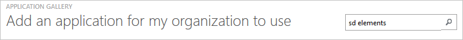

7. Wählen Sie im Ergebnisbereich **Er Elemente aus**, und klicken Sie dann auf **abgeschlossen** , um die Anwendung hinzuzufügen.

    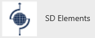

##  Konfigurieren und Testen Azure AD einmaliges Anmelden
Das Ziel der in diesem Abschnitt ist erläutert, wie Sie konfigurieren und Testen der Azure AD-einmaliges Anmelden mit er Elemente auf Grundlage eines Testbenutzers "Britta Simon" bezeichnet.

Für einmaliges Anmelden entwickelt muss Azure AD wissen, was der Benutzer Gegenstück er Elemente an einen Benutzer in Azure AD ist. Kurzum, muss eine Link Beziehung zwischen einem Azure AD-Benutzer und dem entsprechenden Benutzer in er Elementen hergestellt werden.  
Dieser Link Beziehung wird hergestellt, indem Sie den Wert des **Benutzernamens** in Azure AD als der Wert für den **Benutzernamen** in er Elemente zuweisen.

Zum Konfigurieren und Azure AD-einmaliges Anmelden mit Elementen er testen, müssen Sie die folgenden Bausteine durchführen:

1. **[Konfigurieren von Azure AD einmaligen Anmeldens](#configuring-azure-ad-single-single-sign-on)** - damit Ihre Benutzer dieses Feature verwenden können.
2. **[Erstellen einer Azure AD Benutzer testen](#creating-an-azure-ad-test-user)** : Azure AD-einmaliges Anmelden mit Britta Simon testen.
4. **[Erstellen einer er Elemente testen Benutzer](#creating-a-sd-elements-test-user)** : ein Gegenstück von Britta Simon in er Elemente haben, die in der Azure AD-Darstellung Ihrer verknüpft ist.
5. **[Testen Sie Benutzer zuweisen Azure AD](#assigning-the-azure-ad-test-user)** - Britta Simon mit Azure AD-einmaliges Anmelden aktivieren.
5. **[Testen der einmaligen Anmeldens](#testing-single-sign-on)** - zur Überprüfung, ob die Konfiguration funktioniert.

### Konfigurieren von Azure AD einmaliges Anmelden

Das Ziel der in diesem Abschnitt ist Azure AD-einmaliges Anmelden im klassischen Azure-Portal aktivieren und konfigurieren einmaliges Anmelden in Ihrer Anwendung er Elemente.

Ihrer Anwendung er Elemente erwartet die SAML-Assertionen in einem bestimmten Format, das Hinzufügen von benutzerdefinierten Attribut Zuordnungen zu der Konfiguration **token Saml-Attribute** erfordert. Das folgende Bildschirmabbild zeigt ein Beispiel für diese:

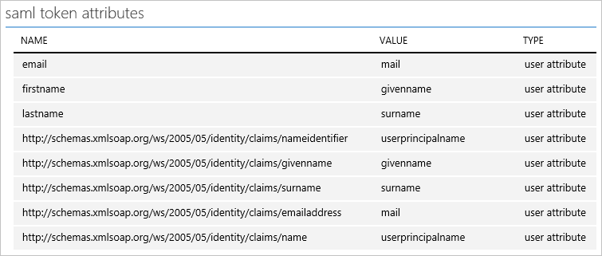 

**So konfigurieren Sie Azure AD-einmaliges Anmelden mit Elementen er die folgenden Schritte aus:**

1. Im Azure klassischen-Portal auf der Seite Anwendung Integration **Er Elemente** klicken Sie auf **Konfigurieren einmaligen Anmeldens** zum Öffnen des Dialogfelds **Konfigurieren einmaliges Anmelden** .

    ![Konfigurieren Sie einmaliges Anmelden][6] 

2. Klicken Sie auf der Seite **Wie möchten Sie Benutzer bei der er Elemente auf** **Azure AD einmaliges Anmelden**wählen Sie aus, und klicken Sie dann auf **Weiter**.

    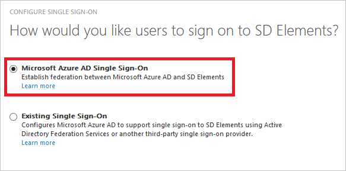 

3. Führen Sie auf der Seite **Einstellungen für die App konfigurieren** Dialogfeld die folgenden Schritte aus:.
    
    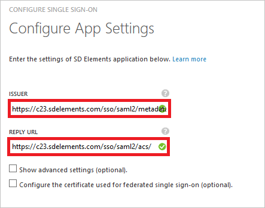 

    ein. Geben Sie in das Textfeld **Herausgeber** des Mandanten Herausgeber URL dem folgenden Muster: *https://\<Ihren Mandanten Namen\>.sdelements.com/sso/saml2/metadata*
   
    b. Geben Sie im Textfeld **URL Antwort** des Mandanten Antworten URL dem folgenden Muster: *https://\<Ihren Mandanten Namen\>.sdelements.com/sso/saml2/acs/*       

    > [AZURE.NOTE] Wenn Sie die tatsächliche Herausgeber URL und Antwort-URL für Ihren Mandanten benötigen, wenden Sie sich an Ihr [Supportteam für er Elemente](mailto:support@sdelements.com).
      
    c. Klicken Sie auf **Weiter**.

4. Klicken Sie auf der Seite **Konfigurieren einmaliges Anmelden bei er Elemente** führen Sie die folgenden Schritte aus:
   
    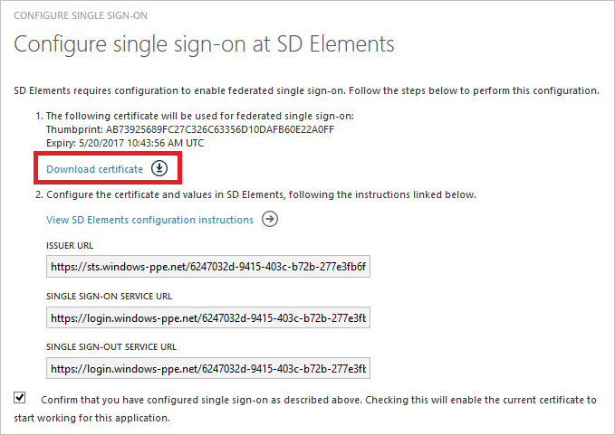 

    ein. Klicken Sie auf **Zertifikat herunterladen**, und speichern Sie die Datei auf Ihrem Computer.

    b. Klicken Sie auf **Weiter**.

1. Um einmaliges Anmelden aktiviert zu erhalten, wenden Sie sich an Ihr [Supportteam für er Elemente](mailto:support@sdelements.com) , und teilen Sie sie mit der Zertifikatdatei heruntergeladene.

5. In einem anderen Browserfenster Singn für den Zugriff auf Ihrem Mandanten er Elemente als Administrator.

6. Klicken Sie im Menü oben klicken Sie auf System, und klicken Sie dann auf einmaliges Anmelden. 

    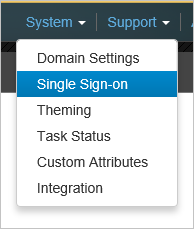 

7. Klicken Sie im Dialogfeld **Einstellungen für einzelne Zeichen** führen Sie die folgenden Schritte aus:

    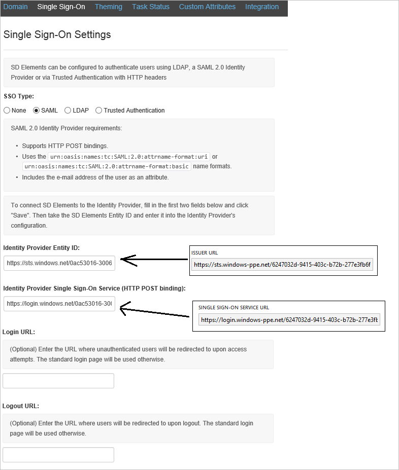 

    ein. Wählen Sie als **Typ SSO** **SAML**aus.

    b. Kopieren Sie auf der Seite **Konfigurieren einmaliges Anmelden bei er Elemente** im Azure klassischen Portal den Wert des **Herausgebers URL** , und fügen Sie ihn in das Textfeld **Identität Provider Entität-ID** .

    c. Kopieren Sie auf der Seite **Konfigurieren einmaliges Anmelden bei er Elemente** im Azure klassischen Portal den Wert für die **Einzelnen anmelden Dienst-URL** , und fügen Sie ihn in das Textfeld **Identität Anbieter einzelnen für einmaliges Anmelden** .

    d. Klicken Sie auf **Speichern**.

6. Im Portal Azure klassischen wählen Sie die Konfiguration für einzelne Zeichen Bestätigung, und klicken Sie dann auf **Weiter**.

    ![Azure AD einmaliges Anmelden][10]

7. Klicken Sie auf der Seite **Bestätigung für einzelne anmelden** auf **abgeschlossen**.  

    ![Azure AD einmaliges Anmelden][11]

1. Klicken Sie im Menü oben auf **Attributen** , um das Dialogfeld **Token SAML-Attribute** zu öffnen. 
    
    ![Konfigurieren Sie einmaliges Anmelden][21]

2. Führen Sie für jede Zeile in der folgenden Tabelle die folgenden Schritte aus:

  	| Attributname | Attributwert |
  	| ---            | ---             |
  	| E-Mail          | User.Mail       |
  	| Vorname      | User.GivenName  |
  	| Nachname       | User.Surname    |

    ein. Klicken Sie auf **Benutzerattribut hinzufügen**. 
    
    ![Konfigurieren Sie einmaliges Anmelden][23]

    b. Geben Sie in das Textfeld **Attributname** den **Namen der Attribut** aus, und wählen Sie als **Attributwert**, der für diese Zeile angezeigte Attribut-Wert.
    
    ![Konfigurieren Sie einmaliges Anmelden][22]

    c. Klicken Sie auf **Benutzerattribut hinzufügen**. 
    
    ![Konfigurieren Sie einmaliges Anmelden][23]

1. Klicken Sie auf **Änderungen anzuwenden**. 
    
    ![Konfigurieren Sie einmaliges Anmelden][24]

### Erstellen eines Benutzers mit Azure AD-testen
Das Ziel der in diesem Abschnitt besteht im Erstellen eines Testbenutzers aufgerufen Britta Simon im klassischen Azure-Portal.  

![Erstellen von Azure AD-Benutzer][20]

**Führen Sie die folgenden Schritte aus, um einen Testbenutzer in Azure AD zu erstellen:**

1. Klicken Sie im **Azure klassischen Portal**auf der linken Navigationsbereich auf **Active Directory**.

     

2. Wählen Sie aus der Liste **Verzeichnis** Verzeichnis für das Sie Verzeichnisintegration aktivieren möchten.

3. Wenn die Liste der Benutzer, klicken Sie im Menü oben anzeigen möchten, klicken Sie auf **Benutzer**.

     

4. Klicken Sie im Dialogfeld **Benutzer hinzufügen** um in der Symbolleiste auf der Unterseite öffnen, auf **Benutzer hinzufügen**.

     

5. Führen Sie auf der Seite **Teilen Sie uns zu diesem Benutzer** die folgenden Schritte aus:

     

    ein. Wählen Sie als Typ des Benutzers neuen Benutzer in Ihrer Organisation ein.

    b. Geben Sie den Benutzernamen **Textfeld** **BrittaSimon**ein.

    c. Klicken Sie auf **Weiter**.

6.  Klicken Sie auf der Seite **Benutzerprofil** Dialogfeld führen Sie die folgenden Schritte aus:

     

    ein. Geben Sie im Textfeld **Vorname** **Britta**aus.  

    b. In das letzte Textfeld **Name** , Typ, **Simon**.

    c. Geben Sie im Textfeld **Anzeigename** **Britta Simon**aus.

    d. Wählen Sie in der Liste **Rolle** **Benutzer**aus.

    e. Klicken Sie auf **Weiter**.

7. Klicken Sie auf der Seite **erste temporäres Kennwort** auf **Erstellen**.

     

8. Führen Sie auf der Seite **erste temporäres Kennwort** die folgenden Schritte aus:

     

    ein. Notieren Sie den Wert für das **Neue Kennwort ein**.

    b. Klicken Sie auf **abgeschlossen**.   

### Erstellen eines Testbenutzers er Elemente

Das Ziel der in diesem Abschnitt ist zum Erstellen eines Benutzers Britta Simon in er Elemente bezeichnet. Im Falle er Elemente ist Erstellen von Benutzern er Elemente eine manuelle Aufgabe aus.

**Führen Sie die folgenden Schritte aus, um Britta Simon in er Elemente zu erstellen:**

1.  In einem Webbrowserfenster melden Sie sich für den Zugriff auf Ihre Firmenwebsite er Elemente als Administrator.

2.  Klicken Sie im Menü oben auf User Management und klicken Sie dann auf Benutzer.
 
    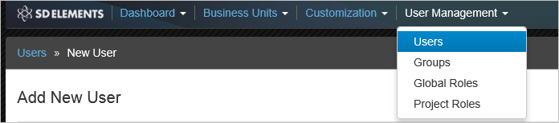 

3.  Klicken Sie auf neuen Benutzer hinzufügen.
 
    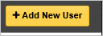 

4.  Klicken Sie im Dialogfeld neuen Benutzer hinzufügen führen Sie die folgenden Schritte aus:

    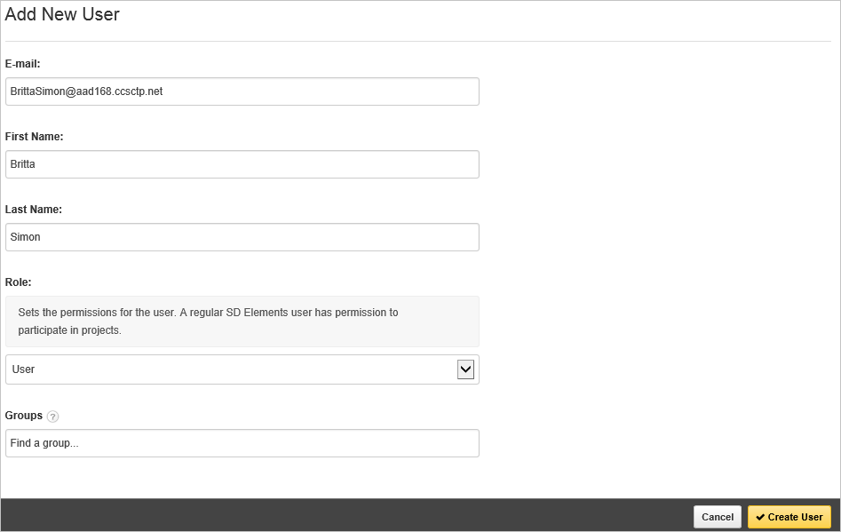 

    ein. Geben Sie in das Textfeld **E-mail** Brittas e-Mail-Adresse in Azure Active Directory.

    b. Geben Sie im Textfeld **Vorname** **Britta**aus.

    c. Geben Sie im Textfeld **Nachname** **Simon**aus.

    d. Wählen Sie als **Rolle** **Benutzer**aus. 

    e. Klicken Sie auf **Benutzer erstellen**.

### Zuweisen des Azure AD-Test-Benutzers

Das Ziel der in diesem Abschnitt ist für die Aktivierung der Britta Simon Azure einmaliges Anmelden verwenden, indem Sie keinen Zugriff auf Elemente er erteilen.

![Benutzer zuweisen][200] 

**Um Elemente er Britta Simon zuzuweisen, führen Sie die folgenden Schritte aus:**

1. Klicken Sie im Portal Azure klassischen zum Öffnen der Anwendungsansicht in der Verzeichnisansicht klicken Sie auf **Applikationen** im oberen Menü.

    ![Benutzer zuweisen][201] 

2. Wählen Sie in der Liste Applikationen **Er Elemente**aus.

    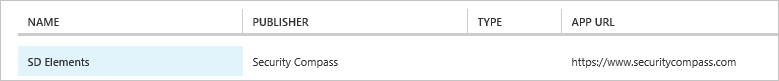 

1. Klicken Sie auf **Benutzer**, klicken Sie im Menü oben.

    ![Benutzer zuweisen][203] 

1. Wählen Sie in der Liste **Benutzer** **Britta Simon**aus.

2. Klicken Sie unten auf der Symbolleiste auf **zuweisen**.

    ![Benutzer zuweisen][205]

### Testen einmaliges Anmelden

Das Ziel der in diesem Abschnitt ist zum Azure AD-einzelne anmelden Überprüfen der Konfiguration mithilfe des Bedienfelds Access.  
Wenn Sie die Kachel er Elemente in der Systemsteuerung Access klicken, Sie sollten automatisch an Ihrer Anwendung er Elemente angemeldete abrufen.

## Zusätzliche Ressourcen

* [Liste der zum Integrieren SaaS-Apps mit Azure-Active Directory-Lernprogramme](active-directory-saas-tutorial-list.md)
* [Was ist die Anwendungszugriff und einmaliges Anmelden mit Azure Active Directory?](active-directory-appssoaccess-whatis.md)

<!--Image references-->

[1]: ./media/active-directory-saas-sd-elements-tutorial/tutorial_general_01.png
[2]: ./media/active-directory-saas-sd-elements-tutorial/tutorial_general_02.png
[3]: ./media/active-directory-saas-sd-elements-tutorial/tutorial_general_03.png
[4]: ./media/active-directory-saas-sd-elements-tutorial/tutorial_general_04.png

[6]: ./media/active-directory-saas-sd-elements-tutorial/tutorial_general_05.png
[10]: ./media/active-directory-saas-sd-elements-tutorial/tutorial_general_06.png
[11]: ./media/active-directory-saas-sd-elements-tutorial/tutorial_general_07.png
[20]: ./media/active-directory-saas-sd-elements-tutorial/tutorial_general_100.png

[21]: ./media/active-directory-saas-sd-elements-tutorial/tutorial_general_80.png
[22]: ./media/active-directory-saas-sd-elements-tutorial/tutorial_general_82.png
[23]: ./media/active-directory-saas-sd-elements-tutorial/tutorial_general_81.png
[24]: ./media/active-directory-saas-sd-elements-tutorial/tutorial_general_83.png

[200]: ./media/active-directory-saas-sd-elements-tutorial/tutorial_general_200.png
[201]: ./media/active-directory-saas-sd-elements-tutorial/tutorial_general_201.png
[203]: ./media/active-directory-saas-sd-elements-tutorial/tutorial_general_203.png
[204]: ./media/active-directory-saas-sd-elements-tutorial/tutorial_general_204.png
[205]: ./media/active-directory-saas-sd-elements-tutorial/tutorial_general_205.png
