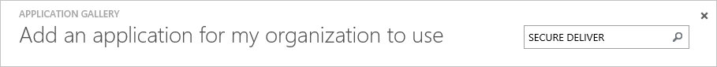
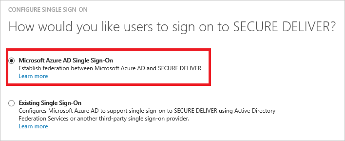
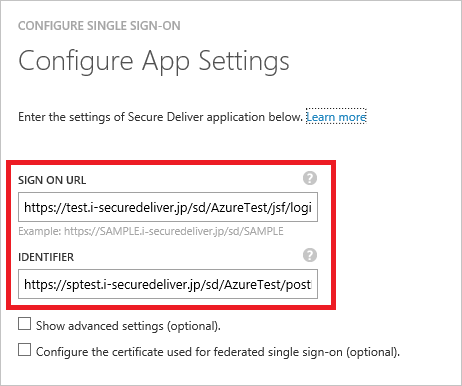
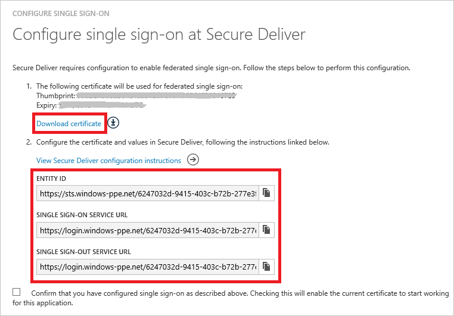
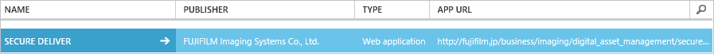

<properties
    pageTitle="Lernprogramm: Azure-Active Directory-Integration in Novatus | Microsoft Azure"
    description="Informationen Sie zum einmaligen Anmeldens zwischen Azure Active Directory und VORFÜHREN SECURE konfigurieren."
    services="active-directory"
    documentationCenter=""
    authors="jeevansd"
    manager="femila"
    editor=""/>

<tags
    ms.service="active-directory"
    ms.workload="identity"
    ms.tgt_pltfrm="na"
    ms.devlang="na"
    ms.topic="article"
    ms.date="09/26/2016"
    ms.author="jeedes"/>

# Lernprogramm: Azure-Active Directory-Integration in SECURE VORFÜHREN

Ziel dieses Lernprogramms ist es zu zeigen, wie Sie SECURE VORFÜHREN mit Azure Active Directory (Azure AD) integriert werden soll.  
Integration von SECURE VORFÜHREN mit Azure AD bietet Ihnen die folgenden Vorteile:

- Sie können in Azure AD steuern, wer auf SECURE VORFÜHREN zugreifen kann
- Sie können Ihre Benutzer automatisch angemeldet-SECURE vorführen (einmaliges Anmelden) klicken Sie auf erste mit ihren Azure AD-Konten aktivieren.
- Sie können Ihre Konten an einem zentralen Ort – im klassischen Azure-Portal verwalten.

Wenn Sie weitere Details zu SaaS app-Integration in Azure AD-wissen möchten, finden Sie unter [Was ist Zugriff auf die Anwendung und einmaliges Anmelden mit Azure Active Directory](active-directory-appssoaccess-whatis.md).

## Erforderliche Komponenten

Zum Konfigurieren von Azure AD-Integration mit SECURE VORFÜHREN, benötigen Sie die folgenden Elemente:

- Ein Azure-Abonnement
- Vorführen einer SECURE einmalige Anmeldung aktiviert Abonnements

> [AZURE.NOTE] Wenn Sie um die Schritte in diesem Lernprogramm zu testen, empfehlen wir nicht mit einer Umgebung für die Herstellung.

Führen Sie zum Testen der Schritte in diesem Lernprogramm Tips:

- Sie sollten Ihre Umgebung Herstellung nicht verwenden, es sei denn, dies erforderlich ist.
- Wenn Sie eine Testversion Azure AD-Umgebung besitzen, können Sie eine einen Monat zum Testen [hier](https://azure.microsoft.com/pricing/free-trial/)erhalten.

## Szenario Beschreibung
Ziel dieses Lernprogramms ist, sodass Sie in einer Umgebung für Azure AD-einmaligen Anmeldens testen können.  
In diesem Lernprogramm beschriebenen Szenario besteht aus zwei Hauptfenster Bausteine:

1. Hinzufügen von SECURE VORFÜHREN aus dem Katalog
2. Konfigurieren und Testen Azure AD einmaliges Anmelden

## Hinzufügen von SECURE VORFÜHREN aus dem Katalog
Zum Konfigurieren der Integration von SECURE VORFÜHREN in Azure AD müssen Sie SECURE VORFÜHREN zu Ihrer Liste der verwalteten SaaS apps aus dem Katalog hinzuzufügen.

**Zum VORFÜHREN SECURE aus dem Katalog hinzufügen möchten, führen Sie die folgenden Schritte aus:**

1. Klicken Sie im **Azure klassischen Portal**auf der linken Navigationsbereich auf **Active Directory**. 

    ![Active Directory][1]

2. Wählen Sie aus der Liste **Verzeichnis** Verzeichnis für das Sie Verzeichnisintegration aktivieren möchten.

3. Klicken Sie zum Öffnen der Anwendungsansicht in der Verzeichnisansicht im oberen Menü auf **Applications** .

    ![Applikationen][2]

4. Klicken Sie auf **Hinzufügen** , am unteren Rand der Seite.

    ![Applikationen][3]

5. Klicken Sie im Dialogfeld **Was möchten Sie tun** klicken Sie auf **eine Anwendung aus dem Katalog hinzufügen**.

    ![Applikationen][4]

6. Geben Sie in das Suchfeld **SECURE VORFÜHREN**.

    

7. Aktivieren Sie im Ergebnisbereich **Übermitteln, SECURE**, und klicken Sie dann auf **abgeschlossen** , um die Anwendung hinzugefügt haben.
    
    

##  Konfigurieren und Testen Azure AD einmaliges Anmelden
Das Ziel der in diesem Abschnitt ist erläutert, wie Sie konfigurieren und Testen der Azure AD-einmaliges Anmelden mit SECURE VORFÜHREN basierend auf einen Testbenutzer "Britta Simon" bezeichnet.

Für einmaliges Anmelden entwickelt muss Azure AD Gegenstück Benutzer im SECURE VORFÜHREN an einen Benutzer in Azure AD kennen. Kurzum, muss eine Link Beziehung zwischen einem Azure AD-Benutzer und dem entsprechenden Benutzer in SECURE VORFÜHREN eingerichtet werden.  
Dieser Link Beziehung wird hergestellt, indem Sie den Wert des **Benutzernamens** in Azure AD als der Wert für den **Benutzernamen** in SECURE VORFÜHREN zuweisen.

Zum Konfigurieren und Testen Azure AD-einmaliges Anmelden mit SECURE VORFÜHREN, müssen Sie die folgenden Bausteine durchführen:

1. **[Konfigurieren von Azure AD einmaligen Anmeldens](#configuring-azure-ad-single-single-sign-on)** - damit Ihre Benutzer dieses Feature verwenden können.
2. **[Erstellen einer Azure AD Benutzer testen](#creating-an-azure-ad-test-user)** : Azure AD-einmaliges Anmelden mit Britta Simon testen.
3. **[Erstellen einer SECURE VORFÜHREN Benutzer testen](#creating-a-secure-deliver-test-user)** : ein Gegenstück von Britta Simon Personen haben, die in der Azure AD-Darstellung Ihrer verknüpft ist.
5. **[Testen Sie Benutzer zuweisen Azure AD](#assigning-the-azure-ad-test-user)** - Britta Simon mit Azure AD-einmaliges Anmelden aktivieren.
5. **[Testen der einmaligen Anmeldens](#testing-single-sign-on)** - zur Überprüfung, ob die Konfiguration funktioniert.

### Konfigurieren von Azure AD einmaliges Anmelden

Das Ziel der in diesem Abschnitt ist Azure AD-einmaliges Anmelden im klassischen Azure-Portal aktivieren und konfigurieren einmaliges Anmelden in Ihrer Anwendung SECURE VORFÜHREN.

**Führen Sie die folgenden Schritte aus, um Azure AD-einmaliges Anmelden mit SECURE VORFÜHREN konfigurieren:**

1. Im Azure klassischen-Portal auf der **SECURE VORFÜHREN** Integrationsseite Anwendung klicken Sie auf **Konfigurieren einmaligen Anmeldens** zum Öffnen des Dialogfelds **Konfigurieren einmaliges Anmelden** .

    ![Konfigurieren Sie einmaliges Anmelden][6] 

2. Klicken Sie auf der Seite **Wie möchten Sie Benutzer sich SECURE vorführen auf** **Azure AD einmaliges Anmelden**wählen Sie aus, und klicken Sie dann auf **Weiter**.
 
     

3. Führen Sie auf der Seite **Einstellungen für die App konfigurieren** Dialogfeld die folgenden Schritte aus, und klicken Sie dann auf **Weiter**:
 
     

    ein. Geben Sie in das Textfeld **Melden Sie sich auf URL** die URL Ihrer Benutzer melden Sie sich für den Zugriff auf Ihre VORFÜHREN SECURE-Anwendung unter Verwendung des folgenden Musters untersuchten: **"https://i-securedeliver.jp/sd/\<Firmennamen\>/jsf/login/sso"**.

    b. Wenden Sie sich an das über VORFÜHREN Supportteam SECURE [iw-sd-support@fujifilm.com](mailto:iw-sd-support@fujifilm.com) können Sie Ihre URL des Mandanten zu gelangen, wenn Sie nicht, dass den Wert wissen.

    c. Geben Sie in das Textfeld **Bezeichner** den Mandanten-URL ein. 

    d. Klicken Sie auf **Weiter**

4. Klicken Sie auf der Seite **Konfigurieren einmaliges Anmelden bei SECURE VORFÜHREN** führen Sie die folgenden Schritte aus, und klicken Sie dann auf **Weiter**:

     

    ein. Klicken Sie auf **Zertifikat herunterladen**, und speichern Sie die Datei auf Ihrem Computer.

    b. Klicken Sie auf **Weiter**.

5. Um für die Anwendung konfigurierten SSO zu gelangen, wenden Sie sich an Ihr Supportteam SECURE VORFÜHREN über [iw-sd-support@fujifilm.com](mailto:iw-sd-support@fujifilm.com) , und teilen Sie sie mit den folgenden:
    
    • Die heruntergeladene Zertifikatsdatei

    • Der **Element-ID**

    • Die **URL der Dienst für einmaliges Anmelden**

    • Die **einzelnen Abmeldung Dienst-URL**

6. Im Portal Azure klassischen wählen Sie die Konfiguration für einzelne Zeichen Bestätigung, und klicken Sie dann auf **Weiter**.

    ![Azure AD einmaliges Anmelden][10]

7. Klicken Sie auf der Seite **Bestätigung für einzelne anmelden** auf **abgeschlossen**.  
  
    ![Azure AD einmaliges Anmelden][11]

### Erstellen eines Benutzers mit Azure AD-testen
Das Ziel der in diesem Abschnitt besteht im Erstellen eines Testbenutzers aufgerufen Britta Simon im klassischen Azure-Portal.

![Erstellen von Azure AD-Benutzer][20]

**Führen Sie zum Erstellen eines Testbenutzers VORFÜHREN SECURE in Azure AD die folgenden Schritte aus:**

1. Klicken Sie im **Azure klassischen Portal**auf der linken Navigationsbereich auf **Active Directory**.

     

2. Wählen Sie aus der Liste **Verzeichnis** Verzeichnis für das Sie Verzeichnisintegration aktivieren möchten.

3. Wenn die Liste der Benutzer, klicken Sie im Menü oben anzeigen möchten, klicken Sie auf **Benutzer**.
  
     

4. Klicken Sie im Dialogfeld **Benutzer hinzufügen** um in der Symbolleiste auf der Unterseite öffnen, auf **Benutzer hinzufügen**.

     

5. Führen Sie auf der Seite **Teilen Sie uns zu diesem Benutzer** die folgenden Schritte aus:

     

    ein. Wählen Sie als Typ des Benutzers neuen Benutzer in Ihrer Organisation ein.

    b. Geben Sie den Benutzernamen **Textfeld** **BrittaSimon**ein.

    c. Klicken Sie auf **Weiter**.

6.  Klicken Sie auf der Seite **Benutzerprofil** Dialogfeld führen Sie die folgenden Schritte aus:

     

    ein. Geben Sie im Textfeld **Vorname** **Britta**aus.  

    b. In das letzte Textfeld **Name** , Typ, **Simon**.

    c. Geben Sie im Textfeld **Anzeigename** **Britta Simon**aus.

    d. Wählen Sie in der Liste **Rolle** **Benutzer**aus.

    e. Klicken Sie auf **Weiter**.

7. Klicken Sie auf der Seite **erste temporäres Kennwort** auf **Erstellen**.

     

8. Klicken Sie auf der Seite **erste temporäres Kennwort** führen Sie die folgenden Schritte aus:

     

    ein. Notieren Sie den Wert für das **Neue Kennwort ein**.

    b. Klicken Sie auf **abgeschlossen**.   

### Erstellen eines Testbenutzers SECURE VORFÜHREN

Das Ziel der in diesem Abschnitt ist zum Erstellen eines Benutzers Britta Simon in SECURE VORFÜHREN bezeichnet. Arbeiten Sie mit SECURE VORFÜHREN Supportteam Benutzer im SECURE VORFÜHREN Konto hinzufügen.

> [AZURE.NOTE] Wenn Sie einen Benutzer manuell zu erstellen müssen, müssen Sie das Supportteam SECURE VORFÜHREN.

### Zuweisen des Azure AD-Test-Benutzers

Das Ziel der in diesem Abschnitt ist für die Aktivierung der Britta Simon Azure einmaliges Anmelden verwenden, indem Sie ihre Access zum Vorführen einer SECURE erteilen.

![Benutzer zuweisen][200] 

**Um SECURE VORFÜHREN Britta Simon zuzuweisen, führen Sie die folgenden Schritte aus:**

1. Klicken Sie im Portal Azure klassischen zum Öffnen der Anwendungsansicht in der Verzeichnisansicht klicken Sie auf **Applikationen** im oberen Menü.

    ![Benutzer zuweisen][201] 

2. Wählen Sie in der Liste Applikationen **SECURE VORFÜHREN**.

     

1. Klicken Sie auf **Benutzer**, klicken Sie im Menü oben.

    ![Benutzer zuweisen][203] 

1. Wählen Sie in der Liste Benutzer **Britta Simon**aus.

2. Klicken Sie unten auf der Symbolleiste auf **zuweisen**.

    ![Benutzer zuweisen][205]

### Testen einmaliges Anmelden

Das Ziel der in diesem Abschnitt ist zum Azure AD-einzelne anmelden Überprüfen der Konfiguration mithilfe des Bedienfelds Access.  
Wenn Sie die Kachel SECURE VORFÜHREN im Bereich Access klicken, Sie sollten automatisch angemeldet-an Ihrer Anwendung SECURE VORFÜHREN auf abrufen.

## Zusätzliche Ressourcen

* [Liste der zum Integrieren SaaS-Apps mit Azure-Active Directory-Lernprogramme](active-directory-saas-tutorial-list.md)
* [Was ist die Anwendungszugriff und einmaliges Anmelden mit Azure Active Directory?](active-directory-appssoaccess-whatis.md)

<!--Image references-->

[1]: ./media/active-directory-saas-securedeliver-tutorial/tutorial_general_01.png
[2]: ./media/active-directory-saas-securedeliver-tutorial/tutorial_general_02.png
[3]: ./media/active-directory-saas-securedeliver-tutorial/tutorial_general_03.png
[4]: ./media/active-directory-saas-securedeliver-tutorial/tutorial_general_04.png

[6]: ./media/active-directory-saas-securedeliver-tutorial/tutorial_general_05.png
[10]: ./media/active-directory-saas-securedeliver-tutorial/tutorial_general_06.png
[11]: ./media/active-directory-saas-securedeliver-tutorial/tutorial_general_07.png
[20]: ./media/active-directory-saas-securedeliver-tutorial/tutorial_general_100.png

[200]: ./media/active-directory-saas-securedeliver-tutorial/tutorial_general_200.png
[201]: ./media/active-directory-saas-securedeliver-tutorial/tutorial_general_201.png
[203]: ./media/active-directory-saas-securedeliver-tutorial/tutorial_general_203.png
[204]: ./media/active-directory-saas-securedeliver-tutorial/tutorial_general_204.png
[205]: ./media/active-directory-saas-securedeliver-tutorial/tutorial_general_205.png
