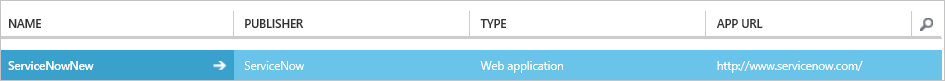

<properties
    pageTitle="Lernprogramm: Azure-Active Directory-Integration in ServiceNow und ServiceNow Express | Microsoft Azure"
    description="Informationen Sie zum einmaligen Anmeldens zwischen Azure Active Directory und ServiceNow und ServiceNow Express konfigurieren."
    services="active-directory"
    documentationCenter=""
    authors="jeevansd"
    manager="femila"
    editor=""/>

<tags
    ms.service="active-directory"
    ms.workload="identity"
    ms.tgt_pltfrm="na"
    ms.devlang="na"
    ms.topic="article"
    ms.date="10/27/2016"
    ms.author="jeedes"/>

# Lernprogramm: Azure-Active Directory-Integration mit ServiceNow und ServiceNow Express.

In diesem Lernprogramm erfahren Sie, wie ServiceNow und ServiceNow Express mit Azure Active Directory (Azure AD) integriert werden soll.

Integration von ServiceNow und ServiceNow Express mit Azure AD bietet Ihnen die folgenden Vorteile:

- Sie können in Azure AD steuern, wer auf ServiceNow und ServiceNow Express zugreifen kann
- Sie können Ihre Benutzer automatisch angemeldet-ServiceNow und ServiceNow Express (einmaliges Anmelden) mit ihren Azure AD-Konten auf erste aktivieren.
- Sie können Ihre Konten an einem zentralen Ort – im klassischen Azure-Portal verwalten.

Wenn Sie weitere Details zu SaaS app-Integration in Azure AD-wissen möchten, finden Sie unter [Was ist Zugriff auf die Anwendung und einmaliges Anmelden mit Azure Active Directory](active-directory-appssoaccess-whatis.md).

## Erforderliche Komponenten

Um Azure AD-Integration mit ServiceNow und ServiceNow Express konfigurieren zu können, benötigen Sie die folgenden Elemente:

- Ein Azure AD-Abonnement
- Für ServiceNow, Instanz oder den Mandanten von ServiceNow, Calgary Version oder höher
- Für ServiceNow Express, eine Instanz von ServiceNow Express, Helsinki Version oder höher
- ServiceNow Mandanten muss die [Mehrere Anbieter einzelnen melden Sie sich auf-Plug-Ins](http://wiki.servicenow.com/index.php?title=Multiple_Provider_Single_Sign-On#gsc.tab=0) aktiviert haben. Dies möglich, indem Sie eine Serviceanfrage bei <https://hi.service-now.com/> 

> [AZURE.NOTE] Wenn Sie um die Schritte in diesem Lernprogramm zu testen, empfehlen wir nicht mit einer Umgebung für die Herstellung.

Führen Sie zum Testen der Schritte in diesem Lernprogramm Tips:

- Sie sollten Ihre Umgebung Herstellung nicht verwenden, es sei denn, dies erforderlich ist.
- Wenn Sie eine Testversion Azure AD-Umgebung besitzen, können Sie eine einen Monat zum Testen [hier](https://azure.microsoft.com/pricing/free-trial/)erhalten.

## Szenario Beschreibung
In diesem Lernprogramm testen Sie Azure AD-einmaliges Anmelden in einer testumgebung. In diesem Lernprogramm beschriebenen Szenario besteht aus zwei Hauptfenster Bausteine:

1. Hinzufügen von ServiceNow aus dem Katalog
2. Konfigurieren und Testen Azure AD-einmaliges Anmelden für ServiceNow oder ServiceNow Express

## Hinzufügen von ServiceNow aus dem Katalog
Um die Integration von ServiceNow oder ServiceNow Express in Azure AD konfigurieren, müssen Sie ServiceNow zu Ihrer Liste der verwalteten SaaS apps aus dem Katalog hinzuzufügen. 

**Um ServiceNow aus dem Katalog hinzufügen möchten, führen Sie die folgenden Schritte aus:**

1. Klicken Sie im **Azure klassischen Portal**auf der linken Navigationsbereich auf **Active Directory**. 

    ![Active Directory][1]

2. Wählen Sie aus der Liste **Verzeichnis** Verzeichnis für das Sie Verzeichnisintegration aktivieren möchten.

3. Klicken Sie zum Öffnen der Anwendungsansicht in der Verzeichnisansicht im oberen Menü auf **Applications** .

    ![Applikationen][2]

4. Klicken Sie auf **Hinzufügen** , am unteren Rand der Seite.

    ![Applikationen][3]

5. Klicken Sie im Dialogfeld **Was möchten Sie tun** klicken Sie auf **eine Anwendung aus dem Katalog hinzufügen**.

    ![Applikationen][4]

6. Geben Sie im Suchfeld **ServiceNow**ein.

    

7. Wählen Sie im Ergebnisbereich **ServiceNow aus**, und klicken Sie dann auf **abgeschlossen** , um die Anwendung hinzugefügt haben.

    

##  Konfigurieren und Testen Azure AD einmaliges Anmelden
In diesem Abschnitt Sie konfigurieren und Testen Azure AD-einmaliges Anmelden mit ServiceNow oder ServiceNow Express auf Grundlage eines Testbenutzers "Britta Simon" bezeichnet.

Für einmaliges Anmelden entwickelt muss Azure AD kennen, kann der Benutzer Gegenstück ServiceNow einem Benutzer in Azure AD. Kurzum, muss eine Link Beziehung zwischen einem Azure AD-Benutzer und dem entsprechenden Benutzer in ServiceNow eingerichtet werden.
Dieser Link Beziehung wird hergestellt, indem Sie den Wert des **Benutzernamens** in Azure AD als der Wert für den **Benutzernamen** in ServiceNow zuweisen. Zum Konfigurieren und Azure AD-einmaliges Anmelden mit ServiceNow testen, müssen Sie die folgenden Bausteine durchführen:

1. **[Konfigurieren von Azure AD einmaliges Anmelden für ServiceNow](#configuring-azure-ad-single-sign-on-for-servicenow)** - damit Ihre Benutzer dieses Feature verwenden können.
2. **[Konfigurieren von Azure AD einmaliges Anmelden für ServiceNow Express](#configuring-azure-ad-single-sign-on-for-servicenow-express)** - damit Ihre Benutzer dieses Feature verwenden können.
3. **[Erstellen einer Azure AD Benutzer testen](#creating-an-azure-ad-test-user)** : Azure AD-einmaliges Anmelden mit Britta Simon testen.
4. **[Erstellen einer ServiceNow Benutzer testen](#creating-a-servicenow-test-user)** : ein Gegenstück von Britta Simon in ServiceNow haben, die in der Azure AD-Darstellung Ihrer verknüpft ist.
5. **[Testen Sie Benutzer zuweisen Azure AD](#assigning-the-azure-ad-test-user)** - Britta Simon mit Azure AD-einmaliges Anmelden aktivieren.
6. **[Testen der einmaligen Anmeldens](#testing-single-sign-on)** - zur Überprüfung, ob die Konfiguration funktioniert.

> [AZURE.NOTE] Wenn Sie ServiceNow konfigurieren möchten Schritt 2 auslassen. Dann, wenn Sie ServiceNow Express konfigurieren möchten überspringen Sie Schritt 1.

### Konfigurieren von Azure AD einmaliges Anmelden für ServiceNow

1.  Klassische Azure AD-Portal auf der Seite **ServiceNow** Integration Anwendung klicken Sie auf **Konfigurieren einmaligen Anmeldens** um das Dialogfeld **Konfigurieren Single Sign On** öffnen.

    ![Konfigurieren einmaliges Anmelden] (./media/active-directory-saas-servicenow-tutorial/IC749323.png "Konfigurieren einmaliges Anmelden")

2.  Klicken Sie auf der Seite **Wie möchten Sie Benutzer bei der ServiceNow auf** **Microsoft Azure AD einmaliges Anmelden**wählen Sie aus, und klicken Sie dann auf **Weiter**.

    ![Konfigurieren einmaliges Anmelden] (./media/active-directory-saas-servicenow-tutorial/IC749324.png "Konfigurieren einmaliges Anmelden")

3.  Führen Sie auf der Seite **Einstellungen für die App konfigurieren** die folgenden Schritte aus:

    ![Konfigurieren der app-URL] (./media/active-directory-saas-servicenow-tutorial/IC769497.png "Konfigurieren der app-URL")

    ein. Geben Sie in das Textfeld **ServiceNow melden Sie sich auf die URL** den URL verwendet, die für Ihre Benutzer melden Sie sich für den Zugriff auf Ihre ServiceNow-Anwendung, die dem Muster folgen: `https://<instance-name>.service-now.com`.

    b. Geben Sie in das Textfeld **Bezeichner** Ihre URL ein, die Ihre Benutzer zum Anmelden an Ihrer ServiceNow-Anwendung, die dem Muster folgen: `https://<instance-name>.service-now.com`.

    c. Klicken Sie auf **Weiter**

4.  Um Azure AD ServiceNow automatisch für SAML-basierten Authentifizierung konfiguriert haben, geben Sie Ihre ServiceNow Instanznamen, Administrator Benutzernamen, und Administratorkennworts im Formular **für einmaliges Anmelden automatische Konfiguration** und klicken Sie auf *Konfigurieren*. Notiz, die der Administrator Benutzername bereitgestellt müssen die Rolle des **Security_admin** in ServiceNow für dieses entwickelt zugewiesen. Andernfalls zum manuellen Konfigurieren von ServiceNow, wenn Sie eine SAML-Identitätsanbieter Azure AD verwenden klicken Sie auf **manuell konfigurieren Sie die Anwendung für einmaliges Anmelden**, und klicken Sie dann klicken Sie auf **Weiter** und die folgenden Schritte aus.

    ![Konfigurieren der app-URL] (./media/active-directory-saas-servicenow-tutorial/IC7694971.png "Konfigurieren der app-URL")

5.  Klicken Sie auf der Seite **Konfigurieren einmaliges Anmelden bei ServiceNow** klicken Sie auf **Download Zertifikat**, das Zertifikatdatei lokal auf Ihrem Computer speichern.

    ![Konfigurieren einmaliges Anmelden] (./media/active-directory-saas-servicenow-tutorial/IC749325.png "Konfigurieren einmaliges Anmelden")

1. Melden Sie sich für den Zugriff auf Ihre ServiceNow Anwendung als Administrator.
2. Aktivieren Sie die _Integration - mehrere Anbieter einzelnen anmelden Installer_ -Plug-in, indem Sie die nächsten Schritte:

    ein. Klicken Sie im Navigationsbereich auf der linken Seite wechseln Sie zum Abschnitt **System Definition** , und klicken Sie dann auf **-Plug-Ins**.

    ![Konfigurieren der app-URL] (./media/active-directory-saas-servicenow-tutorial/tutorial_servicenow_03.png "Aktivieren-Plug-Ins")
    
    b. Suchen Sie nach der _Integration - mehrere Anbieter einzelnen anmelden-Installationsprogramm_.

    ![Konfigurieren der app-URL] (./media/active-directory-saas-servicenow-tutorial/tutorial_servicenow_04.png "Aktivieren-Plug-Ins")

    c. Wählen Sie das Plug-in aus. Rechte klicken Sie auf, und wählen Sie **Aktivieren/Upgrade**.
    
    d. Klicken Sie auf die Schaltfläche **Aktivieren** .

2. Klicken Sie im Navigationsbereich auf der linken Seite auf **Eigenschaften**.  

    ![Konfigurieren der app-URL] (./media/active-directory-saas-servicenow-tutorial/tutorial_servicenow_06.png "Konfigurieren der app-URL")

3. Klicken Sie im Dialogfeld **Eigenschaften von mehreren Anbieter SSO** führen Sie die folgenden Schritte aus:

    ![Konfigurieren der app-URL] (./media/active-directory-saas-servicenow-tutorial/IC7694981.png "Konfigurieren der app-URL")

    ein. Als **mehrere Anbieter SSO aktivieren**möchten wählen Sie **Ja**aus.

    b. Als **Debuggen Protokollierung haben Sie mehrere Anbieter SSO-Integration aktivieren**wählen Sie **Ja**aus.

    c. Geben Sie **im Feld auf den Benutzer, die... Tabelle** Textfeld **Benutzername**ein.

    d. Klicken Sie auf **Speichern**.

1. Klicken Sie im Navigationsbereich auf der linken Seite auf **X509 Zertifikate**.

    ![Konfigurieren einmaliges Anmelden] (./media/active-directory-saas-servicenow-tutorial/tutorial_servicenow_05.png "Konfigurieren einmaliges Anmelden")

1. Klicken Sie auf **neu**, klicken Sie im Dialogfeld **X. 509-Zertifikate** .

    ![Konfigurieren einmaliges Anmelden] (./media/active-directory-saas-servicenow-tutorial/IC7694974.png "Konfigurieren einmaliges Anmelden")

1. Klicken Sie im Dialogfeld **X. 509-Zertifikate** führen Sie die folgenden Schritte aus:

    ![Konfigurieren einmaliges Anmelden] (./media/active-directory-saas-servicenow-tutorial/IC7694975.png "Konfigurieren einmaliges Anmelden")

    ein. Klicken Sie auf **neu**.

    b. Geben Sie in das Textfeld **Name** einen Namen für die Konfiguration (z. B.: **TestSAML2.0**).

    c. Wählen Sie **aktiv**.

    d. Wählen Sie als **Format** **PEM**an.

    e. Wählen Sie als **Typ** **Store Zertifikat vertrauen**.
    
    f. Öffnen Sie Ihr Base64-codierte Zertifikat in Editor, kopieren Sie den Inhalt der es in der Zwischenablage, und fügen Sie ihn in das Textfeld **PEM Zertifikat** .

    g. Klicken Sie auf **Aktualisieren**.

1. Klicken Sie im Navigationsbereich auf der linken Seite auf **Identitätsanbieter**.

    ![Konfigurieren einmaliges Anmelden] (./media/active-directory-saas-servicenow-tutorial/tutorial_servicenow_07.png "Konfigurieren einmaliges Anmelden")

1. Klicken Sie auf **neu**, klicken Sie im Dialogfeld **Identitätsanbieter** :

    ![Konfigurieren einmaliges Anmelden] (./media/active-directory-saas-servicenow-tutorial/IC7694977.png "Konfigurieren einmaliges Anmelden")

1. Klicken Sie im Dialogfeld **Identitätsanbieter** klicken Sie auf **SAML2 Update1?**:

    ![Konfigurieren einmaliges Anmelden] (./media/active-directory-saas-servicenow-tutorial/IC7694978.png "Konfigurieren einmaliges Anmelden")

1. Klicken Sie im Dialogfeld Eigenschaften von SAML2 Update1 führen Sie die folgenden Schritte aus:

    ![Konfigurieren einmaliges Anmelden] (./media/active-directory-saas-servicenow-tutorial/IC7694982.png "Konfigurieren einmaliges Anmelden")

    ein. Geben Sie in das Textfeld **Name** einen Namen für die Konfiguration (z. B.: **SAML 2.0**).

    b. Im **Feld Benutzer** Textfeld, Typ **e-Mail** oder **User_id**, je nachdem, welche Feld verwendet wird, um Benutzer in Ihrer ServiceNow Bereitstellung eindeutig zu identifizieren. 
    
    > [AZURE.NOTE] Sie können Configue Azure AD, um entweder die Azure AD-Benutzer-ID (Benutzerprinzipalnamen) oder die e-Mail-Adresse als eindeutige ID im SAML-Token ausgeben, indem Sie auf die **ServiceNow > Attribute > einmaliges Anmelden** Abschnitt des Azure klassischen Portals und das Attribut **Nameidentifier** das gewünschte Feld zuordnen. Der in Azure AD (z. B. Benutzerprinzipalnamen) für das ausgewählte Attribut gespeicherte Wert muss den Wert für die eingegebenes Feld (z. B. User_id) in ServiceNow gespeicherten übereinstimmen

    c. Im klassischen Azure AD-Portal kopieren Sie den Wert **Identität Anbieter-ID** , und fügen Sie ihn in das Textfeld **Identität Provider-URL** .

    d. Im klassischen Azure AD-Portal kopieren Sie den Wert für die **Authentifizierung anfordern URL** , und fügen Sie ihn in das Textfeld **des Identitätsanbieter AuthnRequest** .

    e. Im klassischen Azure AD-Portal kopieren Sie den Wert für die **Einzelnen Sign-Out Dienst-URL** , und fügen Sie ihn in das Textfeld **des Identitätsanbieter SingleLogoutRequest** .

    f. Geben Sie in das Textfeld **ServiceNow Homepage** die URL der Homepage Ihrer ServiceNow-Instanz aus.

    > [AZURE.NOTE] Homepage der ServiceNow-Instanz ist eine Verkettung **ServieNow Mandanten URL** und **/navpage.do** (z. B.:`https://fabrikam.service-now.com/navpage.do`).
 

    g. In der **Einheiten ID / Herausgeber** Textfeld, geben Sie die URL Ihrer ServiceNow Mandanten.

    h. Geben Sie in das Textfeld **Zielgruppe URL** die URL Ihrer Mandanten ServiceNow aus. 

    Ich. Geben Sie in das Textfeld **Protokoll für die IDP des SingleLogoutRequest Bindung** **Urn: Oasis: Namen: Tc: SAML:2.0:bindings:HTTP-Umleiten**.

    j. Geben Sie in das Textfeld NameID Richtlinie **Urn: Oasis: Namen: Tc: SAML:1.1:nameid-Format: nicht angegebener**.

    k. Deaktivieren Sie auf **eine AuthnContextClass erstellen**.

    l. Geben Sie im **AuthnContextClassRef Methode**, `http://schemas.microsoft.com/ws/2008/06/identity/authenticationmethod/password`. Dies ist nur erforderlich, wenn Sie nur Cloud-Organisation sind. Wenn Sie lokal ADFS oder MFA für die Authentifizierung verwenden sollten Sie diesen Wert nicht konfigurieren. 

    m. Geben Sie im Textfeld **Uhr Neigung** **60**ein.

    n. Wählen Sie als **Einzelnes Zeichen auf Skript** **MultiSSO_SAML2_Update1**ein.

    o. Als **X509 Zertifikat**, wählen Sie das Zertifikat, das im vorherigen Schritt erstellt haben.

    p. Klicken Sie auf **Absenden**. 

6. Klicken Sie im Portal Azure AD-klassischen wählen Sie die Bestätigung Konfiguration für einzelne Zeichen, und klicken Sie dann auf **Weiter**. 

    ![Konfigurieren einmaliges Anmelden] (./media/active-directory-saas-servicenow-tutorial/IC7694990.png "Konfigurieren einmaliges Anmelden")

7. Klicken Sie auf der Seite **Bestätigung für einzelne anmelden** auf **abgeschlossen**.
 
    ![Konfigurieren einmaliges Anmelden] (./media/active-directory-saas-servicenow-tutorial/IC7694991.png "Konfigurieren einmaliges Anmelden")

### Konfigurieren von Azure AD einmaliges Anmelden für ServiceNow Express

1.  Klassische Azure AD-Portal auf der Seite **ServiceNow** Integration Anwendung klicken Sie auf **Konfigurieren einmaligen Anmeldens** um das Dialogfeld **Konfigurieren Single Sign On** öffnen.

    ![Konfigurieren einmaliges Anmelden] (./media/active-directory-saas-servicenow-tutorial/IC749323.png "Konfigurieren einmaliges Anmelden")

2.  Klicken Sie auf der Seite **Wie möchten Sie Benutzer bei der ServiceNow auf** **Microsoft Azure AD einmaliges Anmelden**wählen Sie aus, und klicken Sie dann auf **Weiter**.

    ![Konfigurieren einmaliges Anmelden] (./media/active-directory-saas-servicenow-tutorial/IC749324.png "Konfigurieren einmaliges Anmelden")

3.  Führen Sie auf der Seite **Einstellungen für die App konfigurieren** die folgenden Schritte aus:

    ![Konfigurieren der app-URL] (./media/active-directory-saas-servicenow-tutorial/IC769497.png "Konfigurieren der app-URL")

    ein. Geben Sie in das Textfeld **ServiceNow melden Sie sich auf die URL** den URL verwendet, die für Ihre Benutzer melden Sie sich für den Zugriff auf Ihre ServiceNow-Anwendung, die dem Muster folgen: `https://<instance-name>.service-now.com`.

    b. Geben Sie im Textfeld **URL Herausgeber** Ihre URL ein, die Ihre Benutzer zum Anmelden an Ihrer ServiceNow-Anwendung, die dem Muster folgen `https://<instance-name>.service-now.com`.

    c. Klicken Sie auf **Weiter**

4.  Klicken Sie auf **manuell konfigurieren Sie die Anwendung für einmaliges Anmelden**, und klicken Sie dann auf **Weiter** , und führen Sie die folgenden Schritte aus.

    ![Konfigurieren der app-URL] (./media/active-directory-saas-servicenow-tutorial/IC7694971.png "Konfigurieren der app-URL")

5.  Klicken Sie auf der Seite **Konfigurieren einmaliges Anmelden bei ServiceNow** klicken Sie auf **Zertifikat herunterladen**, speichern Sie die Zertifikatsdatei lokal auf Ihrem Computer, und klicken Sie dann auf **Weiter**.

    ![Konfigurieren einmaliges Anmelden] (./media/active-directory-saas-servicenow-tutorial/IC749325.png "Konfigurieren einmaliges Anmelden")

6. Melden Sie sich für den Zugriff auf Ihre ServiceNow Express-Anwendung als Administrator.

7. Klicken Sie im Navigationsbereich auf der linken Seite auf **Einmaliges Anmelden**.  

    ![Konfigurieren der app-URL] (./media/active-directory-saas-servicenow-tutorial/ic7694980ex.png "Konfigurieren der app-URL")

8. Klicken Sie im Dialogfeld **Single Sign On** klicken Sie auf das Konfigurationssymbol, klicken Sie auf der oberen rechten Ecke, und legen Sie folgende Eigenschaften:

    ![Konfigurieren der app-URL] (./media/active-directory-saas-servicenow-tutorial/ic7694981ex.png "Konfigurieren der app-URL")

    ein. Ein-/schalten Sie **Aktivieren mehrerer Anbieter SSO** nach rechts aus.

    b. Schalten Sie **Debuggen für die Integration von mehreren Anbieter SSO-Protokollierung aktivieren** , nach rechts.

    c. Geben Sie **im Feld auf den Benutzer, die... Tabelle** Textfeld **Benutzername**ein.

9. Klicken Sie auf **Neues Zertifikat hinzuzufügen**, klicken Sie im Dialogfeld **Einmaliges Anmelden** .

    ![Konfigurieren einmaliges Anmelden] (./media/active-directory-saas-servicenow-tutorial/ic7694973ex.png "Konfigurieren einmaliges Anmelden")

10. Klicken Sie im Dialogfeld **X. 509-Zertifikate** führen Sie die folgenden Schritte aus:

    ![Konfigurieren einmaliges Anmelden] (./media/active-directory-saas-servicenow-tutorial/IC7694975.png "Konfigurieren einmaliges Anmelden")

    ein. Geben Sie in das Textfeld **Name** einen Namen für die Konfiguration (z. B.: **TestSAML2.0**).

    b. Wählen Sie **aktiv**.

    c. Wählen Sie als **Format** **PEM**an.

    d. Wählen Sie als **Typ** **Store Zertifikat vertrauen**.

    e. Erstellen einer Base64-codierte Datei aus Ihrem heruntergeladene Zertifikat.
   
    > [AZURE.NOTE] Weitere Informationen hierzu finden Sie unter [Konvertieren ein binäres Zertifikat in eine Textdatei](http://youtu.be/PlgrzUZ-Y1o).
    
    f. Öffnen Sie Ihr Base64-codierte Zertifikat in Editor, kopieren Sie den Inhalt der es in der Zwischenablage, und fügen Sie ihn in das Textfeld **PEM Zertifikat** .

    g. Klicken Sie auf **Aktualisieren**.

11. Klicken Sie auf **Neue IdP hinzuzufügen**, klicken Sie im Dialogfeld **Einmaliges Anmelden** .

    ![Konfigurieren einmaliges Anmelden] (./media/active-directory-saas-servicenow-tutorial/ic7694976ex.png "Konfigurieren einmaliges Anmelden")

12. Klicken Sie im Dialogfeld **Neue Identitätsanbieter hinzufügen** unter **Identitätsanbieter konfigurieren**führen Sie die folgenden Schritte aus:

    ![Konfigurieren einmaliges Anmelden] (./media/active-directory-saas-servicenow-tutorial/ic7694982ex.png "Konfigurieren einmaliges Anmelden")

    ein. Geben Sie in das Textfeld **Name** einen Namen für die Konfiguration (z. B.: **SAML 2.0**).

    b. Im klassischen Azure AD-Portal kopieren Sie den Wert **Identität Anbieter-ID** , und fügen Sie ihn in das Textfeld **Identität Provider-URL** .

    c. Im klassischen Azure AD-Portal kopieren Sie den Wert für die **Authentifizierung anfordern URL** , und fügen Sie ihn in das Textfeld **des Identitätsanbieter AuthnRequest** .

    d. Im klassischen Azure AD-Portal kopieren Sie den Wert für die **Einzelnen Sign-Out Dienst-URL** , und fügen Sie ihn in das Textfeld **des Identitätsanbieter SingleLogoutRequest** .

    e. Wählen Sie als **Identität Anbieter Zertifikat**das Zertifikat, das Sie im vorherigen Schritt erstellt haben.

13. Klicken Sie auf **Erweiterte Einstellungen**, und klicken Sie unter **Zusätzliche Identität Anbietereigenschaften**, gehen Sie folgendermaßen vor:

    ![Konfigurieren einmaliges Anmelden] (./media/active-directory-saas-servicenow-tutorial/ic7694983ex.png "Konfigurieren einmaliges Anmelden")

    ein. Geben Sie in das Textfeld **Protokoll für die IDP des SingleLogoutRequest Bindung** **Urn: Oasis: Namen: Tc: SAML:2.0:bindings:HTTP-Umleiten**.

    b. Geben Sie in das Textfeld **NameID Richtlinie** **Urn: Oasis: Namen: Tc: SAML:1.1:nameid-Format: nicht angegebener**.    

    c. Geben Sie in der **Methode AuthnContextClassRef** **http://schemas.microsoft.com/ws/2008/06/identity/authenticationmethod/password**ein.
    
    d. Deaktivieren Sie auf **eine AuthnContextClass erstellen**.

14. Führen Sie unter **Zusätzliche Service Providereigenschaften**die folgenden Schritte aus:

    ![Konfigurieren einmaliges Anmelden] (./media/active-directory-saas-servicenow-tutorial/ic7694984ex.png "Konfigurieren einmaliges Anmelden")

    ein. Geben Sie in das Textfeld **ServiceNow Homepage** die URL der Homepage Ihrer ServiceNow-Instanz aus.

    > [AZURE.NOTE] Homepage der ServiceNow-Instanz ist eine Verkettung **ServieNow Mandanten URL** und **/navpage.do** (z. B.: `https://fabrikam.service-now.com/navpage.do`).

    b. In der **Einheiten ID / Herausgeber** Textfeld, geben Sie die URL Ihrer ServiceNow Mandanten.

    c. Geben Sie in das Textfeld **Zielgruppe URI** die URL Ihrer ServiceNow Mandanten aus. 

    d. Geben Sie im Textfeld **Uhr Neigung** **60**ein.

    e. Im **Feld Benutzer** Textfeld, Typ **e-Mail** oder **User_id**, je nachdem, welche Feld verwendet wird, um Benutzer in Ihrer ServiceNow Bereitstellung eindeutig zu identifizieren.
    
    > [AZURE.NOTE] Sie können Configue Azure AD, um entweder die Azure AD-Benutzer-ID (Benutzerprinzipalnamen) oder die e-Mail-Adresse als eindeutige ID im SAML-Token ausgeben, indem Sie auf die **ServiceNow > Attribute > einmaliges Anmelden** Abschnitt des Azure klassischen Portals und das Attribut **Nameidentifier** das gewünschte Feld zuordnen. Der in Azure AD (z. B. Benutzerprinzipalnamen) für das ausgewählte Attribut gespeicherte Wert muss den Wert für die eingegebenes Feld (z. B. User_id) in ServiceNow gespeicherten übereinstimmen

    f. Klicken Sie auf **Speichern**. 

15. Klicken Sie im Portal Azure AD-klassischen wählen Sie die Bestätigung Konfiguration für einzelne Zeichen, und klicken Sie dann auf **Weiter**. 

    ![Konfigurieren einmaliges Anmelden] (./media/active-directory-saas-servicenow-tutorial/IC7694990.png "Konfigurieren einmaliges Anmelden")

16. Klicken Sie auf der Seite **Bestätigung für einzelne anmelden** auf **abgeschlossen**.
 
    ![Konfigurieren einmaliges Anmelden] (./media/active-directory-saas-servicenow-tutorial/IC7694991.png "Konfigurieren einmaliges Anmelden")

##Konfigurieren der Benutzer bereitgestellt
  
Das Ziel der in diesem Abschnitt ist zu gliedernden wie Benutzer Bereitstellung von Active Directory-Benutzerkonten zu ServiceNow aktiviert.

### Führen Sie zum Konfigurieren der Benutzer bereitgestellt, die folgenden Schritte aus:

1. Klicken Sie im Azure klassischen Verwaltungsportal, klicken Sie auf der Seite **ServiceNow** Anwendung Integration auf **Konfigurieren Benutzer bereitgestellt**. 

    ![Benutzer bereitgestellt] (./media/active-directory-saas-servicenow-tutorial/IC769498.png "Benutzer bereitgestellt")

2. Klicken Sie auf der Seite **Geben Sie Ihre Anmeldeinformationen ServiceNow zum Aktivieren der automatischen Benutzer bereitgestellt** bieten die folgenden Einstellungen der Konfiguration: Benutzer konfigurieren bereitgestellt werden. 

     ein. Geben Sie in das Textfeld **ServiceNow Instanznamen** den Instanznamen ServiceNow ein.

     b. Geben Sie in das Textfeld **ServiceNow Admin-Benutzername** der Name des Kontos Administrator ServiceNow ein.

     c. Geben Sie in das Textfeld **ServiceNow Administratorkennworts** das Kennwort für dieses Konto ein.

     d. Klicken Sie auf **Überprüfen** , um zu überprüfen, ob Ihre Konfiguration.

     e. Klicken Sie auf die Schaltfläche **Weiter** , um die **nächsten Schritte** -Seite zu öffnen.

     f. Wenn Sie alle Benutzer in dieser Anwendung bereitstellen möchten, wählen Sie "**automatisch alle Benutzerkonten im Verzeichnis zu dieser Anwendung bereitgestellt**". 

    ![Nächste Schritte] (./media/active-directory-saas-servicenow-tutorial/IC698804.png "Nächste Schritte")

     g. Klicken Sie auf der Seite **Weitere Schritte** auf **abgeschlossen** , um die Konfiguration zu speichern.

### Erstellen eines Benutzers mit Azure AD-testen
In diesem Abschnitt erstellen Sie einen Testbenutzer im klassischen Portal Britta Simon bezeichnet.

![Erstellen von Azure AD-Benutzer][20]

**Führen Sie die folgenden Schritte aus, um einen Testbenutzer in Azure AD zu erstellen:**

1. Klicken Sie im **Azure klassischen Portal**auf der linken Navigationsbereich auf **Active Directory**.
    
     

2. Wählen Sie aus der Liste **Verzeichnis** Verzeichnis für das Sie Verzeichnisintegration aktivieren möchten.

3. Wenn die Liste der Benutzer, klicken Sie im Menü oben anzeigen möchten, klicken Sie auf **Benutzer**.
    
     

4. Klicken Sie im Dialogfeld **Benutzer hinzufügen** um in der Symbolleiste auf der Unterseite öffnen, auf **Benutzer hinzufügen**.

     

5. Führen Sie auf der Seite **Teilen Sie uns zu diesem Benutzer** die folgenden Schritte aus:
 
     

    ein. Wählen Sie als Typ des Benutzers neuen Benutzer in Ihrer Organisation ein.

    b. Geben Sie den Benutzernamen **Textfeld** **BrittaSimon**ein.

    c. Klicken Sie auf **Weiter**.

6.  Klicken Sie auf der Seite **Benutzerprofil** Dialogfeld führen Sie die folgenden Schritte aus:

     

    ein. Geben Sie im Textfeld **Vorname** **Britta**aus.  

    b. In das letzte Textfeld **Name** , Typ, **Simon**.

    c. Geben Sie im Textfeld **Anzeigename** **Britta Simon**aus.

    d. Wählen Sie in der Liste **Rolle** **Benutzer**aus.

    e. Klicken Sie auf **Weiter**.

7. Klicken Sie auf der Seite **erste temporäres Kennwort** auf **Erstellen**.

     

8. Führen Sie auf der Seite **erste temporäres Kennwort** die folgenden Schritte aus:

     

    ein. Notieren Sie den Wert für das **Neue Kennwort ein**.

    b. Klicken Sie auf **abgeschlossen**.   

### Erstellen eines Testbenutzers ServiceNow

In diesem Abschnitt erstellen Sie einen Benutzer namens Britta Simon in ServiceNow. In diesem Abschnitt erstellen Sie einen Benutzer namens Britta Simon in ServiceNow. Wenn Sie zum Hinzufügen eines Benutzers in Ihrem ServiceNow oder ServiceNow Express-Konto nicht kennen, wenden Sie sich an den ServiceNow Supportteam.

### Zuweisen des Azure AD-Test-Benutzers

In diesem Abschnitt aktivieren Sie Britta Simon Azure einmaliges Anmelden verwenden, indem Sie keinen Zugriff auf ServiceNow erteilen.

![Benutzer zuweisen][200] 

**Um Britta Simon ServiceNow zuzuweisen, führen Sie die folgenden Schritte aus:**

1. Klicken Sie im Portal klassischen zum Öffnen der Anwendungsansicht in der Verzeichnisansicht klicken Sie auf **Applikationen** im oberen Menü.

    ![Benutzer zuweisen][201] 

2. Wählen Sie in der Liste Applications **ServiceNow**.

     

1. Klicken Sie auf **Benutzer**, klicken Sie im Menü oben.

    ![Benutzer zuweisen][203] 

1. Wählen Sie in der Liste alle Benutzer **Britta Simon**aus.

2. Klicken Sie unten auf der Symbolleiste auf **zuweisen**.

    ![Benutzer zuweisen][205]

### Testen einmaliges Anmelden

Das Ziel der in diesem Abschnitt ist zum Azure AD-einzelne anmelden Überprüfen der Konfiguration mithilfe des Bedienfelds Access.

Wenn Sie die Kachel ServiceNow im Bereich Access klicken, Sie sollten automatisch an Ihrer Anwendung ServiceNow angemeldete abrufen.

## Zusätzliche Ressourcen

* [Liste der zum Integrieren SaaS-Apps mit Azure-Active Directory-Lernprogramme](active-directory-saas-tutorial-list.md)
* [Was ist die Anwendungszugriff und einmaliges Anmelden mit Azure Active Directory?](active-directory-appssoaccess-whatis.md)

<!--Image references-->

[1]: ./media/active-directory-saas-servicenow-tutorial/tutorial_general_01.png
[2]: ./media/active-directory-saas-servicenow-tutorial/tutorial_general_02.png
[3]: ./media/active-directory-saas-servicenow-tutorial/tutorial_general_03.png
[4]: ./media/active-directory-saas-servicenow-tutorial/tutorial_general_04.png

[5]: ./media/active-directory-saas-servicenow-tutorial/tutorial_general_05.png
[6]: ./media/active-directory-saas-servicenow-tutorial/tutorial_general_06.png
[7]:  ./media/active-directory-saas-servicenow-tutorial/tutorial_general_050.png
[10]: ./media/active-directory-saas-servicenow-tutorial/tutorial_general_060.png
[11]: ./media/active-directory-saas-servicenow-tutorial/tutorial_general_070.png
[20]: ./media/active-directory-saas-servicenow-tutorial/tutorial_general_100.png

[200]: ./media/active-directory-saas-servicenow-tutorial/tutorial_general_200.png
[201]: ./media/active-directory-saas-servicenow-tutorial/tutorial_general_201.png
[203]: ./media/active-directory-saas-servicenow-tutorial/tutorial_general_203.png
[204]: ./media/active-directory-saas-servicenow-tutorial/tutorial_general_204.png
[205]: ./media/active-directory-saas-servicenow-tutorial/tutorial_general_205.png
