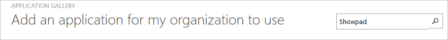
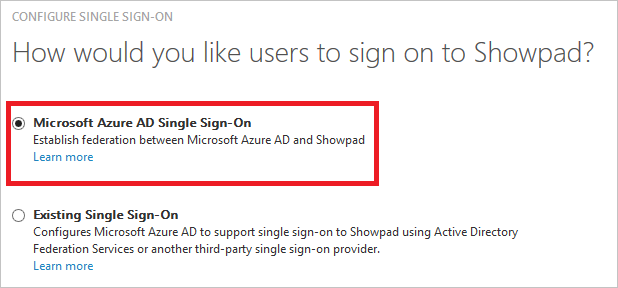
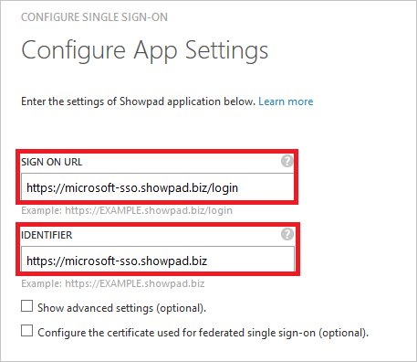
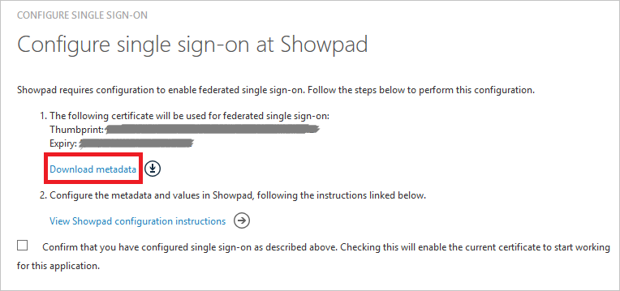
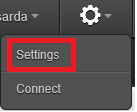
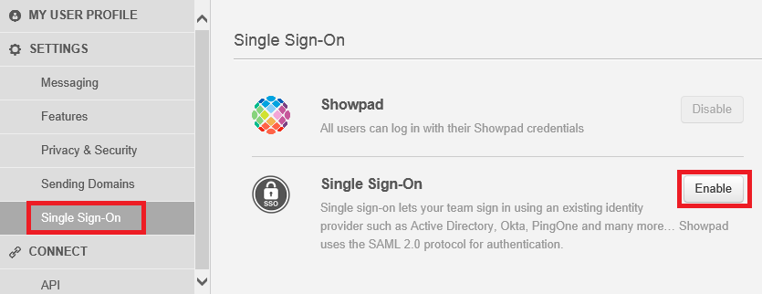
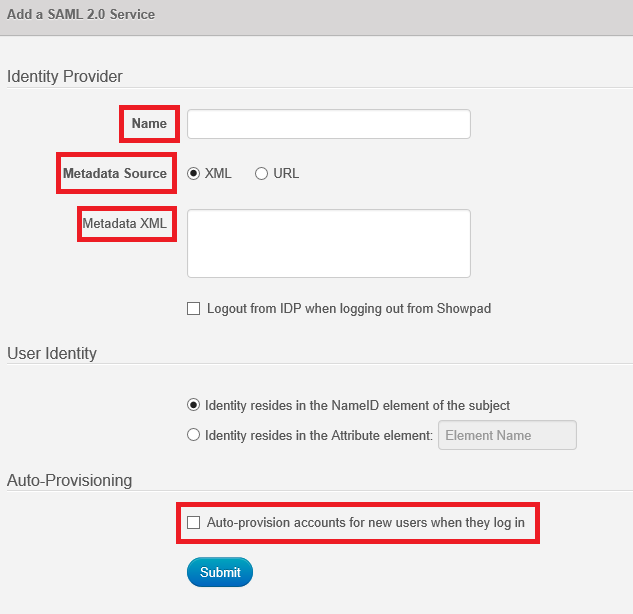
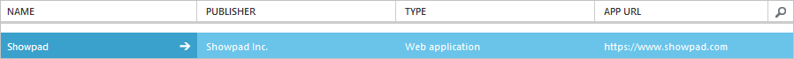

<properties
    pageTitle="Lernprogramm: Azure-Active Directory-Integration in Showpad | Microsoft Azure"
    description="Informationen Sie zum einmaligen Anmeldens zwischen Azure Active Directory und Showpad konfigurieren."
    services="active-directory"
    documentationCenter=""
    authors="jeevansd"
    manager="femila"
    editor=""/>

<tags
    ms.service="active-directory"
    ms.workload="identity"
    ms.tgt_pltfrm="na"
    ms.devlang="na"
    ms.topic="article"
    ms.date="09/01/2016"
    ms.author="jeedes"/>

# Lernprogramm: Azure-Active Directory-Integration in Showpad

Ziel dieses Lernprogramms ist es zu zeigen, wie Sie Showpad mit Azure Active Directory (Azure AD) integrieren.

Integration von Showpad mit Azure AD bietet Ihnen die folgenden Vorteile:

- Sie können in Azure AD steuern, die auf Showpad zugreifen
- Sie können Ihre Benutzer automatisch auf Showpad (einmaliges Anmelden) mit ihren Konten Azure AD-angemeldete abrufen aktivieren.
- Sie können Ihre Konten an einem zentralen Ort – das Azure Active Directory-Portal verwalten.

Wenn Sie weitere Details zu SaaS app-Integration in Azure AD-wissen möchten, finden Sie unter [Was ist Zugriff auf die Anwendung und einmaliges Anmelden mit Azure Active Directory](active-directory-appssoaccess-whatis.md).

## Erforderliche Komponenten

Zum Konfigurieren von Azure AD-Integration mit Showpad, benötigen Sie die folgenden Elemente:

- Ein Azure AD-Abonnement
- Ein Abonnement Showpad

> [AZURE.NOTE] Wenn Sie um die Schritte in diesem Lernprogramm zu testen, empfehlen wir nicht mit einer Umgebung für die Herstellung.

Führen Sie zum Testen der Schritte in diesem Lernprogramm Tips:

- Sie sollten Ihre Umgebung Herstellung nicht verwenden, es sei denn, dies erforderlich ist.
- Wenn Sie eine Testversion Azure AD-Umgebung besitzen, können Sie eine einen Monat zum Testen [hier](https://azure.microsoft.com/pricing/free-trial/)erhalten.

## Szenario Beschreibung
Ziel dieses Lernprogramms ist, sodass Sie in einer Umgebung für Azure AD-einmaligen Anmeldens testen können. 

In diesem Lernprogramm beschriebenen Szenario besteht aus zwei Hauptfenster Bausteine:

1. Hinzufügen von Showpad aus dem Katalog
2. Konfigurieren und Testen Azure AD einmaliges Anmelden

## Hinzufügen von Showpad aus dem Katalog
Um die Integration der Showpad in Azure AD zu konfigurieren, müssen Sie Showpad zu Ihrer Liste der verwalteten SaaS apps aus dem Katalog hinzuzufügen.

**Um Showpad aus dem Katalog hinzufügen möchten, führen Sie die folgenden Schritte aus:**

1. Klicken Sie im **Azure klassischen Portal**auf der linken Navigationsbereich auf **Active Directory**. 

    ![Applikationen][1]

2. Wählen Sie aus der Liste **Verzeichnis** Verzeichnis für das Sie Verzeichnisintegration aktivieren möchten.

3. Klicken Sie zum Öffnen der Anwendungsansicht in der Verzeichnisansicht im oberen Menü auf **Applications** .

    ![Applikationen][2]

4. Klicken Sie auf **Hinzufügen** , am unteren Rand der Seite.

    ![Applikationen][3]

5. Klicken Sie im Dialogfeld **Was möchten Sie tun** klicken Sie auf **eine Anwendung aus dem Katalog hinzufügen**.
 
    ![Applikationen][4]

6. Geben Sie im Suchfeld **Showpad**ein.

    

7. Wählen Sie im Ergebnisbereich **Showpad aus**, und klicken Sie dann auf **abgeschlossen** , um die Anwendung hinzugefügt haben.

    

##  Konfigurieren und Testen Azure AD einmaliges Anmelden
Das Ziel der in diesem Abschnitt ist erläutert, wie Sie konfigurieren und Testen der Azure AD-einmaliges Anmelden mit Showpad basierend auf einen Testbenutzer "Britta Simon" bezeichnet.

Für einmaliges Anmelden entwickelt muss Azure AD wissen, was der Benutzer Gegenstück Showpad an einen Benutzer in Azure AD ist. Kurzum, muss eine Link Beziehung zwischen einem Azure AD-Benutzer und dem entsprechenden Benutzer in Showpad eingerichtet werden.

Dieser Link Beziehung wird hergestellt, indem Sie den Wert des **Benutzernamens** in Azure AD als der Wert für den **Benutzernamen** in Showpad zuweisen.

Zum Konfigurieren und Azure AD-einmaliges Anmelden mit Showpad testen, müssen Sie die folgenden Bausteine durchführen:

1. **[Konfigurieren von Azure AD einmaligen Anmeldens](#configuring-azure-ad-single-single-sign-on)** - damit Ihre Benutzer dieses Feature verwenden können.
2. **[Erstellen einer Azure AD Benutzer testen](#creating-an-azure-ad-test-user)** : Azure AD-einmaliges Anmelden mit Britta Simon testen.
3. **[Erstellen einer Showpad Benutzer testen](#creating-a-showpad-test-user)** : ein Gegenstück von Britta Simon in Showpad haben, die in der Azure AD-Darstellung Ihrer verknüpft ist.
4. **[Testen Sie Benutzer zuweisen Azure AD](#assigning-the-azure-ad-test-user)** - Britta Simon mit Azure AD-einmaliges Anmelden aktivieren.
5. **[Testen der einmaligen Anmeldens](#testing-single-sign-on)** - zur Überprüfung, ob die Konfiguration funktioniert.

### Konfigurieren von Azure AD einmaliges Anmelden

Das Ziel der in diesem Abschnitt ist Azure AD-einmaliges Anmelden im klassischen Azure-Portal aktivieren und konfigurieren einmaliges Anmelden in Ihrer Anwendung Showpad.

**Führen Sie die folgenden Schritte aus, um Azure AD-einmaliges Anmelden mit Showpad konfigurieren:**

1. Im Azure klassischen-Portal auf der Seite **Showpad** Integration Anwendung klicken Sie auf **Konfigurieren einmaligen Anmeldens** zum Öffnen des Dialogfelds **Konfigurieren einmaliges Anmelden** .

    ![Konfigurieren Sie einmaliges Anmelden][6] 

2. Klicken Sie auf der Seite **Wie möchten Sie Benutzer bei der Showpad auf** **Azure AD einmaliges Anmelden**wählen Sie aus, und klicken Sie dann auf **Weiter**.

    

3. Führen Sie auf der Seite **Einstellungen für die App konfigurieren** Dialogfeld die folgenden Schritte aus, und klicken Sie dann auf **Weiter**:

     

    ein. Geben Sie in das Textfeld **Melden Sie sich auf URL** die URL, die von den Benutzern die Anmeldung an Ihrer Showpad-Anwendung unter Verwendung des folgenden Musters verwendet:`https://<company name>.showpad.biz/login`

    b. Geben Sie in das Textfeld **Bezeichner** die URL, die mit dem folgenden Muster:`https://<company name>.showpad.biz`

    c. Klicken Sie auf **Weiter**

4. Klicken Sie auf der Seite **Konfigurieren einmaliges Anmelden bei Showpad** führen Sie die folgenden Schritte aus, und klicken Sie dann auf **Weiter**:

    

    ein. Klicken Sie auf **Herunterladen von Metadaten**aus, und speichern Sie die Datei auf Ihrem Computer.

    b. Klicken Sie auf **Weiter**.

5. Melden Sie sich für den Zugriff auf Ihre Showpad Mandanten als Administrator.

6. Klicken Sie auf **Einstellungen**, klicken Sie im Menü oben.

     

7. Navigieren Sie zu "**Einmaliges Anmelden**", und klicken Sie auf "**Aktivieren**".
 
    

8. Führen Sie die folgenden Schritte aus, klicken Sie im Dialogfeld **Hinzufügen eines SAML 2.0-Dienst** :

     

    ein. Geben Sie in das Textfeld **Name** den Namen der Anbieter Bezeichner (z. B.: den Namen Ihres Unternehmens).

    b. Wählen Sie als **Quelle für Metadaten**aus **XML**.

    c. Kopieren Sie den Inhalt der heruntergeladenen Metadaten-XML-Datei, und fügen Sie ihn in **Metadaten XML-** Textfeld.

    d. Wählen Sie **automatisch Bereitstellen von Konten für neue Benutzer, sobald sie anmelden**aus.

    e. Klicken Sie auf **Absenden**.

10. Im Portal Azure klassischen wählen Sie die Konfiguration für einzelne Zeichen Bestätigung, und klicken Sie dann auf **Weiter**.

    ![Azure AD einmaliges Anmelden][10]

11. Klicken Sie auf der Seite **Bestätigung für einzelne anmelden** auf **abgeschlossen**.  
  
    ![Azure AD einmaliges Anmelden][11]

### Erstellen eines Benutzers mit Azure AD-testen
Das Ziel der in diesem Abschnitt besteht im Erstellen eines Testbenutzers aufgerufen Britta Simon im klassischen Azure-Portal.

![Erstellen von Azure AD-Benutzer][20]

**Führen Sie zum Erstellen eines Testbenutzers Showpad in Azure AD die folgenden Schritte aus:**

1. Klicken Sie im **Azure klassischen Portal**auf der linken Navigationsbereich auf **Active Directory**.

     

2. Wählen Sie aus der Liste **Verzeichnis** Verzeichnis für das Sie Verzeichnisintegration aktivieren möchten.

3. Wenn die Liste der Benutzer, klicken Sie im Menü oben anzeigen möchten, klicken Sie auf **Benutzer**.

     

4. Klicken Sie im Dialogfeld **Benutzer hinzufügen** um in der Symbolleiste auf der Unterseite öffnen, auf **Benutzer hinzufügen**.

     

5. Führen Sie auf der Seite **Teilen Sie uns zu diesem Benutzer** die folgenden Schritte aus:

     

    ein. Geben Sie in das Textfeld **Benutzername** **BrittaSimon**ein.

    b. Klicken Sie auf **Weiter**.

6.  Klicken Sie auf der Seite **Benutzerprofil** Dialogfeld führen Sie die folgenden Schritte aus:

     

    ein. Geben Sie im Textfeld **Vorname** **Britta**aus.  

    b. In das letzte Textfeld **Name** , Typ, **Simon**.

    c. Geben Sie im Textfeld **Anzeigename** **Britta Simon**aus.

    d. Wählen Sie als **Rolle** **Benutzer**aus.

    e. Klicken Sie auf **Weiter**.

7. Klicken Sie auf der Seite **erste temporäres Kennwort** auf **Erstellen**.

    

8. Klicken Sie auf der Seite **erste temporäres Kennwort** führen Sie die folgenden Schritte aus:

     

    ein. Notieren Sie den Wert für das **Neue Kennwort ein**.

    b. Klicken Sie auf **abgeschlossen**.

### Erstellen eines Testbenutzers Showpad

Das Ziel der in diesem Abschnitt ist zum Erstellen eines Benutzers Britta Simon in Showpad bezeichnet. 

Showpad unterstützt in-Time-Bereitstellung. Sie haben die Bereitstellung in **[Konfigurieren von Azure AD einmaliges Anmelden](#configuring-azure-ad-single-single-sign-on)**aktiviert. 

Keine für Sie in diesem Abschnitt Aktionselement ist vorhanden. 

### Zuweisen des Azure AD-Test-Benutzers

Das Ziel der in diesem Abschnitt ist für die Aktivierung der Britta Simon Azure einmaliges Anmelden verwenden, indem Sie keinen Zugriff auf Showpad erteilen.

![Benutzer zuweisen][200]

**Um Britta Simon Showpad zuzuweisen, führen Sie die folgenden Schritte aus:**

1. Die Azure klassischen im Menü oben klicken Sie auf **Anwendungen**.

    ![Benutzer zuweisen][201] 

2. Klicken Sie in der Anwendungsliste auf **Showpad**.

     

1. Klicken Sie auf **Benutzer**, klicken Sie im Menü oben.

    ![Benutzer zuweisen][203]

1. Wählen Sie in der Liste Benutzer **Britta Simon**aus.

2. Klicken Sie unten auf der Symbolleiste auf **zuweisen**.

    ![Benutzer zuweisen][205]

### Testen einmaliges Anmelden

Das Ziel der in diesem Abschnitt ist zum Azure AD-einzelne anmelden Überprüfen der Konfiguration mithilfe des Bedienfelds Access.

Wenn Sie die Kachel **Showpad** im Bereich Access klicken, Sie sollten automatisch an Ihrer Anwendung Showpad angemeldete abrufen.

## Zusätzliche Ressourcen

* [Liste der zum Integrieren SaaS-Apps mit Azure-Active Directory-Lernprogramme](active-directory-saas-tutorial-list.md)
* [Was ist die Anwendungszugriff und einmaliges Anmelden mit Azure Active Directory?](active-directory-appssoaccess-whatis.md)

<!--Image references-->

[1]: ./media/active-directory-saas-showpad-tutorial/tutorial_general_01.png
[2]: ./media/active-directory-saas-showpad-tutorial/tutorial_general_02.png
[3]: ./media/active-directory-saas-showpad-tutorial/tutorial_general_03.png
[4]: ./media/active-directory-saas-showpad-tutorial/tutorial_general_04.png

[6]: ./media/active-directory-saas-showpad-tutorial/tutorial_general_05.png
[10]: ./media/active-directory-saas-showpad-tutorial/tutorial_general_06.png
[11]: ./media/active-directory-saas-showpad-tutorial/tutorial_general_07.png
[20]: ./media/active-directory-saas-showpad-tutorial/tutorial_general_100.png

[200]: ./media/active-directory-saas-showpad-tutorial/tutorial_general_200.png
[201]: ./media/active-directory-saas-showpad-tutorial/tutorial_general_201.png
[203]: ./media/active-directory-saas-showpad-tutorial/tutorial_general_203.png
[204]: ./media/active-directory-saas-showpad-tutorial/tutorial_general_204.png
[205]: ./media/active-directory-saas-showpad-tutorial/tutorial_general_205.png
