<properties
    pageTitle="Lernprogramm: Azure-Active Directory-Integration mit Skydesk E-Mail | Microsoft Azure"
    description="Informationen Sie zum Konfigurieren der einmaligen Anmeldens zwischen Azure Active Directory und Skydesk-e-Mail."
    services="active-directory"
    documentationCenter=""
    authors="jeevansd"
    manager="femila"
    editor=""/>

<tags
    ms.service="active-directory"
    ms.workload="identity"
    ms.tgt_pltfrm="na"
    ms.devlang="na"
    ms.topic="article"
    ms.date="09/29/2016"
    ms.author="jeedes"/>

# Lernprogramm: Azure-Active Directory-Integration in Skydesk-e-Mail

Ziel dieses Lernprogramms ist es zu zeigen, wie Sie Skydesk-e-Mail in Azure Active Directory (Azure AD) zu integrieren.

Integrieren von Skydesk-e-Mail in Azure AD bietet Ihnen die folgenden Vorteile:

- Sie können in Azure AD steuern, wer auf Skydesk E-Mails zugreifen kann
- Sie können Ihre Benutzer automatisch auf Skydesk E-Mail (einmaliges Anmelden) angemeldete Abrufen mit ihren Azure AD-Konten aktivieren.
- Sie können Ihre Konten an einem zentralen Ort – im klassischen Azure Active Directory-Portal verwalten.

Wenn Sie weitere Details zu SaaS app-Integration in Azure AD-wissen möchten, finden Sie unter [Was ist Zugriff auf die Anwendung und einmaliges Anmelden mit Azure Active Directory](active-directory-appssoaccess-whatis.md).

## Erforderliche Komponenten

Zum Konfigurieren von Azure AD-Integration mit Skydesk E-Mail, benötigen Sie die folgenden Elemente:

- Ein Azure AD-Abonnement
- Skydesk e-Mail-einmalige Anmeldung aktiviert Abonnements

> [AZURE.NOTE] Wenn Sie um die Schritte in diesem Lernprogramm zu testen, empfehlen wir nicht mit einer Umgebung für die Herstellung.

Führen Sie zum Testen der Schritte in diesem Lernprogramm Tips:

- Sie sollten Ihre Umgebung Herstellung nicht verwenden, es sei denn, dies erforderlich ist.
- Wenn Sie eine Testversion Azure AD-Umgebung besitzen, können Sie eine einen Monat zum Testen [hier](https://azure.microsoft.com/pricing/free-trial/)erhalten.

## Szenario Beschreibung
Ziel dieses Lernprogramms ist, sodass Sie in einer Umgebung für Azure AD-einmaligen Anmeldens testen können. 

In diesem Lernprogramm beschriebenen Szenario besteht aus zwei Hauptfenster Bausteine:

1. Hinzufügen von Skydesk-e-Mail aus dem Katalog
2. Konfigurieren und Testen Azure AD einmaliges Anmelden

## Hinzufügen von Skydesk-e-Mail aus dem Katalog
Zum Konfigurieren der Integration von Skydesk-e-Mail in Azure AD müssen Sie Skydesk-e-Mail zu Ihrer Liste der verwalteten SaaS apps aus dem Katalog hinzuzufügen.

**Wenn Skydesk E-Mail aus dem Katalog hinzufügen möchten, führen Sie die folgenden Schritte aus:**

1. Klicken Sie im **Azure klassischen Portal**auf der linken Navigationsbereich auf **Active Directory**. 

    ![Active Directory][1]

2. Wählen Sie aus der Liste **Verzeichnis** Verzeichnis für das Sie Verzeichnisintegration aktivieren möchten.

3. Klicken Sie zum Öffnen der Anwendungsansicht in der Verzeichnisansicht im oberen Menü auf **Applications** .

    ![Applikationen][2]

4. Klicken Sie auf **Hinzufügen** , am unteren Rand der Seite.

    ![Applikationen][3]

5. Klicken Sie im Dialogfeld **Was möchten Sie tun** klicken Sie auf **eine Anwendung aus dem Katalog hinzufügen**.

    ![Applikationen][4]

6. Geben Sie im Suchfeld **Skydesk-e-Mail**aus.

    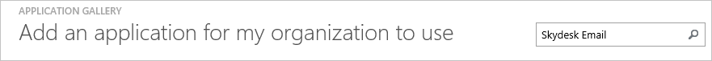

7. Wählen Sie im Ergebnisbereich **Skydesk E-Mail**und dann auf **abgeschlossen** , um die Anwendung hinzuzufügen.

    

##  Konfigurieren und Testen Azure AD einmaliges Anmelden
Das Ziel der in diesem Abschnitt wird erläutert, wie Sie konfigurieren und Azure AD-einmaliges Anmelden mit Skydesk E-Mail Testen eines Namens "Britta Simon" Testbenutzers basierend auf.

Für einmaliges Anmelden entwickelt muss Azure AD wissen, was der Benutzer Gegenstück Skydesk E-Mail an einen Benutzer in Azure AD ist. Kurzum, muss eine Link Beziehung zwischen einem Azure AD-Benutzer und dem entsprechenden Benutzer in einer E-Mail Skydesk eingerichtet werden.

Dieser Link Beziehung wird hergestellt, indem Sie den Wert des **Benutzernamens** in Azure AD als der Wert für den **Benutzernamen** Skydesk e-Mail zuweisen.

Zum Konfigurieren und Azure AD-einmaliges Anmelden mit Skydesk E-Mail testen, müssen Sie die folgenden Bausteine durchführen:

1. **[Konfigurieren von Azure AD einmaligen Anmeldens](#configuring-azure-ad-single-single-sign-on)** - damit Ihre Benutzer dieses Feature verwenden können.
2. **[Erstellen einer Azure AD Benutzer testen](#creating-an-azure-ad-test-user)** : Azure AD-einmaliges Anmelden mit Britta Simon testen.
3. **[Erstellen eine E-Mail Skydesk Benutzer testen](#creating-a-Skydesk-Email-test-user)** : ein Gegenstück von Britta Simon Skydesk e-Mail haben, die in der Azure AD-Darstellung Ihrer verknüpft ist.
4. **[Testen Sie Benutzer zuweisen Azure AD](#assigning-the-azure-ad-test-user)** - Britta Simon mit Azure AD-einmaliges Anmelden aktivieren.
5. **[Testen der einmaligen Anmeldens](#testing-single-sign-on)** - zur Überprüfung, ob die Konfiguration funktioniert.

### Konfigurieren von Azure AD einmaliges Anmelden

Das Ziel der in diesem Abschnitt ist Azure AD-einmaliges Anmelden im klassischen Azure-Portal aktivieren und konfigurieren einmaliges Anmelden in Ihrer Skydesk-e-Mail-Anwendung.

**Führen Sie die folgenden Schritte aus, um Azure AD-einmaliges Anmelden mit Skydesk E-Mail konfigurieren:**

1. Im Azure klassischen-Portal auf der Seite **Skydesk e-Mail-** Anwendung Integration klicken Sie auf **Konfigurieren einmaligen Anmeldens** zum Öffnen des Dialogfelds **Konfigurieren einmaliges Anmelden** .

    ![Konfigurieren Sie einmaliges Anmelden][6] 

2. Klicken Sie auf der Seite **Wie möchten Sie Benutzer bei der Skydesk-e-Mail auf** **Azure AD einmaliges Anmelden**wählen Sie aus, und klicken Sie dann auf **Weiter**.

    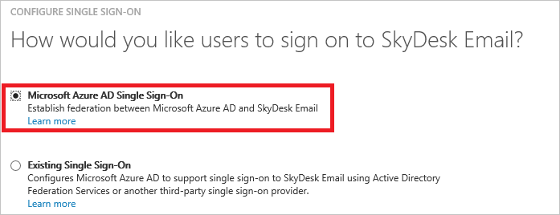 

3. Führen Sie auf der Seite Dialogfeld **Konfigurieren der App-Einstellungen** die folgenden Schritte aus:
 
    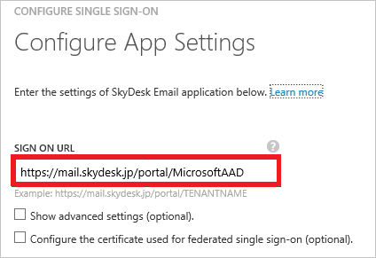 

    ein. Geben Sie in das Textfeld melden Sie sich auf URL die URL Ihrer Benutzer melden Sie sich für den Zugriff auf Ihre Skydesk e-Mail-Anwendung unter Verwendung des folgenden Musters untersuchten: **"https://mail.skydesk.jp/portal/\<Firmennamen\>"**.

    b. Klicken Sie auf **Weiter**.

4. Führen Sie auf der Seite **Konfigurieren einmaliges Anmelden bei Skydesk e-Mail-** die folgenden Schritte aus:

    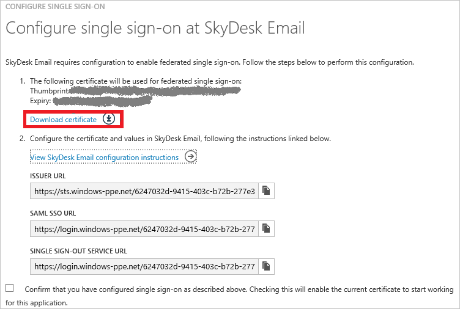 

    ein. Klicken Sie auf **Zertifikat herunterladen**, und speichern Sie die Datei auf Ihrem Computer.

    b. Klicken Sie auf **Weiter**.

5. Um SSO in **Skydesk-e-Mail**zu aktivieren, führen Sie die folgenden Schritte aus:
 
    ein. Melden Sie sich für den Zugriff auf Ihr Skydesk e-Mail-Konto als Administrator.

    b. Klicken Sie im Menü oben klicken Sie auf Setup, und wählen Sie Org. 

    

    c. Klicken Sie auf aus klicken Sie im linken Bereich auf Domänen.

    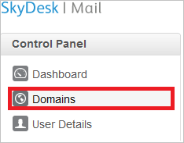

    d. Klicken Sie auf Domäne hinzufügen.

    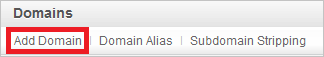

    e. Geben Sie Ihren Domänennamen ein, und klicken Sie dann auf Überprüfen Sie Domäne.

    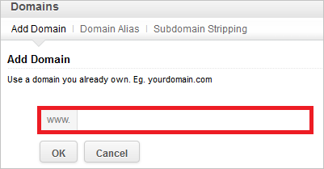

    f. Klicken Sie auf aus klicken Sie im linken Bereich auf **SAML-Authentifizierung**

    

6. Führen Sie auf der Seite Dialogfeld **SAML-Authentifizierung** die folgenden Schritte aus:

    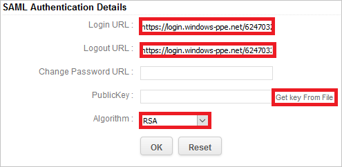

    > [AZURE.NOTE] Um SAML-basierten Authentifizierung verwenden, sollten entweder stehen Ihnen **die Domäne überprüft** oder **Portal URL** einrichten. Sie können festlegen, dass das Portal URL mit dem eindeutigen Namen.

    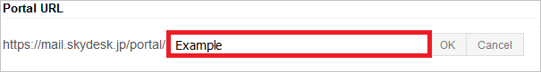

    ein. Klassische Azure AD-Portal kopieren Sie den Wert von **SAML SSO-URL** , und fügen Sie ihn in das Textfeld **Anmelde-URL** .

    b. Klassische Azure AD-Portal kopieren Sie den Wert für die **Einzelnen Sign-Out Dienst-URL** , und fügen Sie ihn in das Textfeld **Abmeldung** URL.

    c. **Ändern Kennwort URL** ist optional so lassen Sie ihn leer.

    d. Klicken Sie auf **Schlüssel aus Datei erhalten** , Ihre heruntergeladene Skydesk e-Mail-Zertifikat auszuwählen, und klicken Sie dann auf **Öffnen** , wenn Sie das Zertifikat hochladen.

    e. Wählen Sie als **Algorithmus** **RSA**aus.

    f. Klicken Sie auf **Ok,** um die Änderungen zu speichern.

7. Im Portal Azure klassischen wählen Sie die Konfiguration für einzelne Zeichen Bestätigung, und klicken Sie dann auf **Weiter**.

    ![Azure AD einmaliges Anmelden][10]

8. Klicken Sie auf der Seite **Bestätigung für einzelne anmelden** auf **abgeschlossen**.  
  
    ![Azure AD einmaliges Anmelden][11]

### Erstellen eines Benutzers mit Azure AD-testen
Das Ziel der in diesem Abschnitt besteht im Erstellen eines Testbenutzers aufgerufen Britta Simon im klassischen Azure-Portal.

![Erstellen von Azure AD-Benutzer][20]

**Führen Sie die folgenden Schritte aus, um einen Testbenutzer in Azure AD zu erstellen:**

1. Klicken Sie im **Azure klassischen Portal**auf der linken Navigationsbereich auf **Active Directory**.

     

2. Wählen Sie aus der Liste **Verzeichnis** Verzeichnis für das Sie Verzeichnisintegration aktivieren möchten.

3. Wenn die Liste der Benutzer, klicken Sie im Menü oben anzeigen möchten, klicken Sie auf **Benutzer**.

     

4. Klicken Sie im Dialogfeld **Benutzer hinzufügen** um in der Symbolleiste auf der Unterseite öffnen, auf **Benutzer hinzufügen**.

     

5. Führen Sie auf der Seite **Teilen Sie uns zu diesem Benutzer** die folgenden Schritte aus:

     

    ein. Wählen Sie als Typ des Benutzers neuen Benutzer in Ihrer Organisation ein.

    b. Geben Sie den Benutzernamen **Textfeld** **BrittaSimon**ein.

    c. Klicken Sie auf **Weiter**.

6.  Klicken Sie auf der Seite **Benutzerprofil** Dialogfeld führen Sie die folgenden Schritte aus:

     

    ein. Geben Sie im Textfeld **Vorname** **Britta**aus.  

    b. In das letzte Textfeld **Name** , Typ, **Simon**.

    c. Geben Sie im Textfeld **Anzeigename** **Britta Simon**aus.

    d. Wählen Sie in der Liste **Rolle** **Benutzer**aus.

    e. Klicken Sie auf **Weiter**.

7. Klicken Sie auf der Seite **erste temporäres Kennwort** auf **Erstellen**.

     

8. Führen Sie auf der Seite **erste temporäres Kennwort** die folgenden Schritte aus:
 
     

    ein. Notieren Sie den Wert für das **Neue Kennwort ein**.

    b. Klicken Sie auf **abgeschlossen**.   

### Erstellen eines Testbenutzers Skydesk-e-Mail

In diesem Abschnitt erstellen Sie einen Benutzer namens Britta Simon Skydesk e-Mail aus.

ein. Klicken Sie auf **Benutzerzugriff** aus Skydesk-e-Mail im linken Bereich auf, und geben Sie Ihren Benutzernamen ein. 

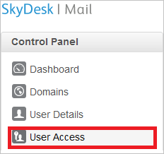

[AZURE.NOTE] Wenn Sie Massen Benutzer erstellen müssen, müssen Sie wenden Sie sich an das Supportteam Skydesk-e-Mail.

### Zuweisen des Azure AD-Test-Benutzers

Das Ziel der in diesem Abschnitt ist für die Aktivierung der Britta Simon Azure einmaliges Anmelden verwenden, indem Sie keinen Zugriff auf Skydesk E-Mail erteilen.

![Benutzer zuweisen][200] 

**Um Britta Simon Skydesk e-Mail-zuzuweisen, führen Sie die folgenden Schritte aus:**

1. Klicken Sie im Portal Azure klassischen zum Öffnen der Anwendungsansicht in der Verzeichnisansicht klicken Sie auf **Applikationen** im oberen Menü.
 
    ![Benutzer zuweisen][201] 

2. Wählen Sie in der Liste Applications **Skydesk-e-Mail**aus.

    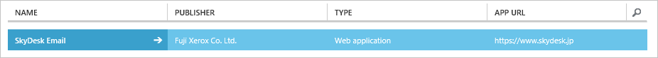 

1. Klicken Sie auf **Benutzer**, klicken Sie im Menü oben.

    ![Benutzer zuweisen][203] 

1. Wählen Sie in der Liste Benutzer **Britta Simon**aus.

2. Klicken Sie unten auf der Symbolleiste auf **zuweisen**.

    ![Benutzer zuweisen][205]

### Testen einmaliges Anmelden

Das Ziel der in diesem Abschnitt ist zum Azure AD-einzelne anmelden Überprüfen der Konfiguration mithilfe des Bedienfelds Access.

Wenn Sie die Skydesk-e-Mail-Kachel im Bereich Access klicken, Sie sollten automatisch angemeldet-an Ihrer Anwendung Skydesk-e-Mail auf abrufen.

## Zusätzliche Ressourcen

* [Liste der zum Integrieren SaaS-Apps mit Azure-Active Directory-Lernprogramme](active-directory-saas-tutorial-list.md)
* [Was ist die Anwendungszugriff und einmaliges Anmelden mit Azure Active Directory?](active-directory-appssoaccess-whatis.md)

<!--Image references-->

[1]: ./media/active-directory-saas-skydeskemail-tutorial/tutorial_general_01.png
[2]: ./media/active-directory-saas-skydeskemail-tutorial/tutorial_general_02.png
[3]: ./media/active-directory-saas-skydeskemail-tutorial/tutorial_general_03.png
[4]: ./media/active-directory-saas-skydeskemail-tutorial/tutorial_general_04.png

[6]: ./media/active-directory-saas-skydeskemail-tutorial/tutorial_general_05.png
[10]: ./media/active-directory-saas-skydeskemail-tutorial/tutorial_general_06.png
[11]: ./media/active-directory-saas-skydeskemail-tutorial/tutorial_general_07.png
[20]: ./media/active-directory-saas-skydeskemail-tutorial/tutorial_general_100.png

[200]: ./media/active-directory-saas-skydeskemail-tutorial/tutorial_general_200.png
[201]: ./media/active-directory-saas-skydeskemail-tutorial/tutorial_general_201.png
[203]: ./media/active-directory-saas-skydeskemail-tutorial/tutorial_general_203.png
[204]: ./media/active-directory-saas-skydeskemail-tutorial/tutorial_general_204.png
[205]: ./media/active-directory-saas-skydeskemail-tutorial/tutorial_general_205.png
