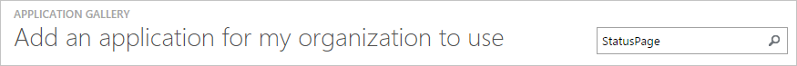
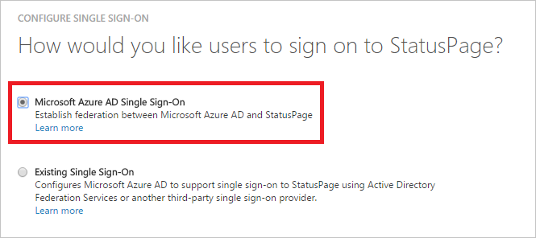
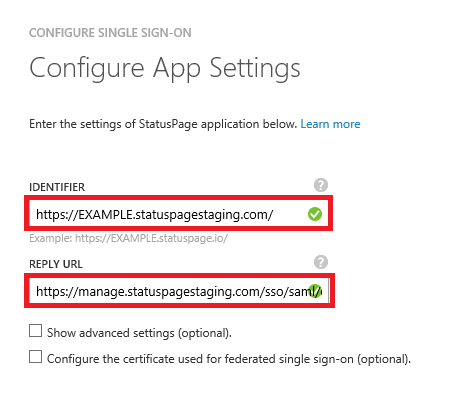
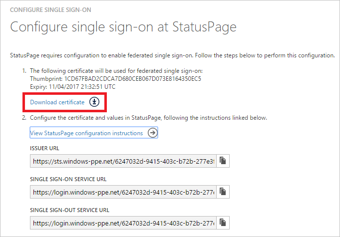
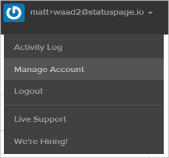
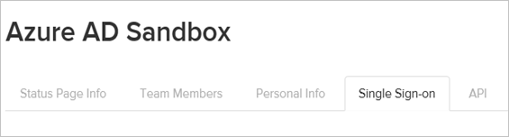
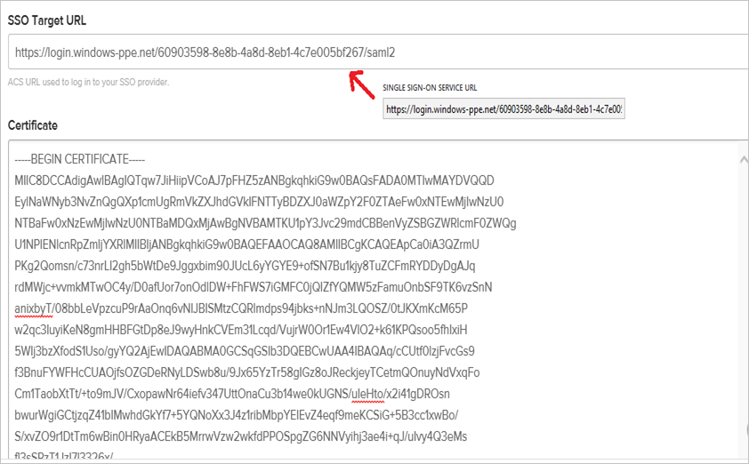
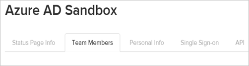
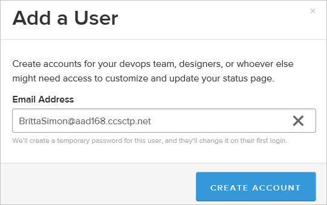
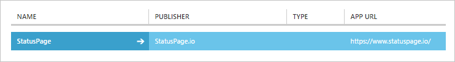

<properties
    pageTitle="Lernprogramm: Azure-Active Directory-Integration in StatusPage | Microsoft Azure"
    description="Informationen Sie zum einmaligen Anmeldens zwischen Azure Active Directory und StatusPage konfigurieren."
    services="active-directory"
    documentationCenter=""
    authors="jeevansd"
    manager="femila"
    editor=""/>

<tags
    ms.service="active-directory"
    ms.workload="identity"
    ms.tgt_pltfrm="na"
    ms.devlang="na"
    ms.topic="article"
    ms.date="10/07/2016"
    ms.author="jeedes"/>

# Lernprogramm: Azure-Active Directory-Integration in StatusPage

Ziel dieses Lernprogramms ist es zu zeigen, wie Sie StatusPage mit Azure Active Directory (Azure AD) integrieren.

Integration von StatusPage mit Azure AD bietet Ihnen die folgenden Vorteile: 

- Sie können in Azure AD steuern, die auf StatusPage zugreifen 
- Sie können Ihre Benutzer automatisch auf StatusPage (einmaliges Anmelden) mit ihren Konten Azure AD-angemeldete abrufen aktivieren.
- Sie können Ihre Konten an einem zentralen Ort – im klassischen Azure-Portal verwalten.

Wenn Sie weitere Details zu SaaS app-Integration in Azure AD-wissen möchten, finden Sie unter [Was ist Zugriff auf die Anwendung und einmaliges Anmelden mit Azure Active Directory](active-directory-appssoaccess-whatis.md).

## Erforderliche Komponenten 

Zum Konfigurieren von Azure AD-Integration mit StatusPage, benötigen Sie die folgenden Elemente:

- Ein Azure AD-Abonnement
- Eine StatusPage einmaligen Anmeldung aktiviert Abonnement

> [AZURE.NOTE] Wenn Sie um die Schritte in diesem Lernprogramm zu testen, empfehlen wir nicht mit einer Umgebung für die Herstellung.

Führen Sie zum Testen der Schritte in diesem Lernprogramm Tips:

- Sie sollten Ihre Umgebung Herstellung nicht verwenden, es sei denn, dies erforderlich ist.
- Wenn Sie eine Testversion Azure AD-Umgebung besitzen, können Sie eine einen Monat zum Testen [hier](https://azure.microsoft.com/pricing/free-trial/)erhalten. 

 
## Szenario Beschreibung
Ziel dieses Lernprogramms ist, sodass Sie in einer Umgebung für Azure AD-einmaligen Anmeldens testen können. 

In diesem Lernprogramm beschriebenen Szenario besteht aus zwei Hauptfenster Bausteine:

1. Hinzufügen von StatusPage aus dem Katalog 
2. Konfigurieren und Testen Azure AD einmaliges Anmelden

## Hinzufügen von StatusPage aus dem Katalog
Um die Integration der StatusPage in Azure AD zu konfigurieren, müssen Sie StatusPage zu Ihrer Liste der verwalteten SaaS apps aus dem Katalog hinzuzufügen.

**Um StatusPage aus dem Katalog hinzufügen möchten, führen Sie die folgenden Schritte aus:**

1. Klicken Sie im **Azure klassischen Portal**auf der linken Navigationsbereich auf **Active Directory**. 

    ![Active Directory][1]

2. Wählen Sie aus der Liste **Verzeichnis** Verzeichnis für das Sie Verzeichnisintegration aktivieren möchten.

3. Klicken Sie zum Öffnen der Anwendungsansicht in der Verzeichnisansicht im oberen Menü auf **Applications** .

    ![Applikationen][2]

4. Klicken Sie auf **Hinzufügen** , am unteren Rand der Seite.
 
    ![Applikationen][3]

5. Klicken Sie im Dialogfeld **Was möchten Sie tun** klicken Sie auf **eine Anwendung aus dem Katalog hinzufügen**.

    ![Applikationen][4]

6. Geben Sie im Suchfeld **StatusPage**ein.
 
    

7. Wählen Sie im Ergebnisbereich **StatusPage aus**, und klicken Sie dann auf **abgeschlossen** , um die Anwendung hinzugefügt haben.

    

##  Konfigurieren und Testen Azure AD einmaliges Anmelden
Das Ziel der in diesem Abschnitt ist erläutert, wie Sie konfigurieren und Testen der Azure AD-einmaliges Anmelden mit StatusPage basierend auf einen Testbenutzer "Britta Simon" bezeichnet.

Für einmaliges Anmelden entwickelt muss Azure AD wissen, was der Benutzer Gegenstück StatusPage an einen Benutzer in Azure AD ist. Kurzum, muss eine Link Beziehung zwischen einem Azure AD-Benutzer und dem entsprechenden Benutzer in StatusPage eingerichtet werden.

Dieser Link Beziehung wird hergestellt, indem Sie den Wert des **Benutzernamens** in Azure AD als der Wert für den **Benutzernamen** in StatusPage zuweisen.
 
Zum Konfigurieren und Azure AD-einmaliges Anmelden mit StatusPage testen, müssen Sie die folgenden Bausteine durchführen:

1. **[Konfigurieren von Azure AD einmaligen Anmeldens](#configuring-azure-ad-single-single-sign-on)** - damit Ihre Benutzer dieses Feature verwenden können.
2. **[Erstellen einer Azure AD Benutzer testen](#creating-an-azure-ad-test-user)** : Azure AD-einmaliges Anmelden mit Britta Simon testen.
4. **[Erstellen einer StatusPage Benutzer testen](#creating-a-statuspage-test-user)** : ein Gegenstück von Britta Simon in StatusPage haben, die in der Azure AD-Darstellung Ihrer verknüpft ist.
5. **[Testen Sie Benutzer zuweisen Azure AD](#assigning-the-azure-ad-test-user)** - Britta Simon mit Azure AD-einmaliges Anmelden aktivieren.
5. **[Testen der einmaligen Anmeldens](#testing-single-sign-on)** - zur Überprüfung, ob die Konfiguration funktioniert.

### Konfigurieren von Azure AD einmaliges Anmelden

Das Ziel der in diesem Abschnitt ist Azure AD-einmaliges Anmelden im klassischen Azure-Portal aktivieren und konfigurieren einmaliges Anmelden in Ihrer Anwendung StatusPage. 

**Führen Sie die folgenden Schritte aus, um Azure AD-einmaliges Anmelden mit StatusPage konfigurieren:**

1. Im Azure klassischen-Portal auf der Seite **StatusPage** Integration Anwendung klicken Sie auf **Konfigurieren einmaligen Anmeldens** zum Öffnen des Dialogfelds **Konfigurieren einmaliges Anmelden** .

    ![Konfigurieren Sie einmaliges Anmelden][6] 

2. Klicken Sie auf der Seite **Wie möchten Sie Benutzer bei der StatusPage auf** **Azure AD einmaliges Anmelden**wählen Sie aus, und klicken Sie dann auf **Weiter**.
 
     

3. Führen Sie auf der Seite Dialogfeld **Konfigurieren der App-Einstellungen** die folgenden Schritte aus:
 
     

    > [AZURE.NOTE] Wenden Sie sich an das Supportteam StatusPage am [SupportTeam@statuspage.io](mailto:SupportTeam@statuspage.io)zum Anfordern von Metadaten für einmaliges Anmelden Konfiguration erforderlich.

    ein. Die Metadaten kopieren Sie den Wert Herausgeber, und fügen Sie ihn in das Textfeld **Bezeichner** .

    b. Die Metadaten kopieren Sie die URL der Antwort, und fügen Sie ihn in das Textfeld **URL Antworten** .

    c. Klicken Sie auf **Weiter**.
 
 
4. Klicken Sie auf der Seite **Konfigurieren einmaliges Anmelden bei StatusPage** führen Sie die folgenden Schritte aus:

     

    ein. Klicken Sie auf **Zertifikat herunterladen**, und speichern Sie die Datei auf Ihrem Computer.

    b. Klicken Sie auf **Weiter**.

1. In einem anderen Browserfenster melden Sie sich auf der Website Ihres Unternehmens StatusPage als Administrator.

1. Klicken Sie auf **Konto verwalten**, in der Symbolleiste Hauptfenster.

     

1. Klicken Sie auf der Registerkarte **einmaliges Anmelden** . 

     

1. Führen Sie auf der Seite SSO einrichten die folgenden Schritte aus:

     

    ein. Im Azure klassischen-Portal auf der Seite **Konfigurieren einmaliges Anmelden bei StatusPage** kopieren Sie den Wert für die **Einzelnen anmelden Dienst-URL** , und fügen Sie ihn in das Textfeld **SSO Ziel-URL** . 

    b. Öffnen des heruntergeladenen Zertifikats in Editor, kopieren Sie den Inhalt aus, und fügen Sie ihn in das Textfeld **Zertifikat** . 

    c. Klicken Sie auf **Speichern**.

6. Im Portal Azure klassischen wählen Sie die Konfiguration für einzelne Zeichen Bestätigung, und klicken Sie dann auf **Weiter**. 

    ![Azure AD einmaliges Anmelden][10]

7. Klicken Sie auf der Seite **Bestätigung für einzelne anmelden** auf **abgeschlossen**.  
  
    ![Azure AD einmaliges Anmelden][11]

### Erstellen eines Benutzers mit Azure AD-testen
Das Ziel der in diesem Abschnitt besteht im Erstellen eines Testbenutzers aufgerufen Britta Simon im klassischen Azure-Portal.

![Erstellen von Azure AD-Benutzer][20]

**Führen Sie die folgenden Schritte aus, um einen Testbenutzer in Azure AD zu erstellen:**

1. Klicken Sie im **Azure klassischen Portal**auf der linken Navigationsbereich auf **Active Directory**.

      

2. Wählen Sie aus der Liste **Verzeichnis** Verzeichnis für das Sie Verzeichnisintegration aktivieren möchten.

3. Wenn die Liste der Benutzer, klicken Sie im Menü oben anzeigen möchten, klicken Sie auf **Benutzer**.

     
 
4. Klicken Sie im Dialogfeld **Benutzer hinzufügen** um in der Symbolleiste auf der Unterseite öffnen, auf **Benutzer hinzufügen**. 

     

5. Führen Sie auf der Seite **Teilen Sie uns zu diesem Benutzer** die folgenden Schritte aus: 

      

    ein. Wählen Sie als Typ des Benutzers neuen Benutzer in Ihrer Organisation ein.

    b. Geben Sie den Benutzernamen **Textfeld** **BrittaSimon**ein.

    c. Klicken Sie auf **Weiter**.

6.  Klicken Sie auf der Seite **Benutzerprofil** Dialogfeld führen Sie die folgenden Schritte aus: 

     
 
    ein. Geben Sie im Textfeld **Vorname** **Britta**aus.  

    b. In das letzte Textfeld **Name** , Typ, **Simon**.

    c. Geben Sie im Textfeld **Anzeigename** **Britta Simon**aus.

    d. Wählen Sie in der Liste **Rolle** **Benutzer**aus.
    e. Klicken Sie auf **Weiter**.

7. Klicken Sie auf der Seite **erste temporäres Kennwort** auf **Erstellen**.

     
 
8. Klicken Sie auf der Seite **erste temporäres Kennwort** führen Sie die folgenden Schritte aus:

     
  
    ein. Notieren Sie den Wert für das **Neue Kennwort ein**.

    b. Klicken Sie auf **abgeschlossen**.   

  
 
### Erstellen eines Testbenutzers StatusPage

Das Ziel der in diesem Abschnitt ist zum Erstellen eines Benutzers Britta Simon in StatusPage bezeichnet.
StatusPage unterstützt in-Time-Bereitstellung. Sie haben bereits in [Konfigurieren von Azure AD einmaliges Anmelden](#configuring-azure-ad-single-single-sign-on)aktiviert werden.

**Führen Sie die folgenden Schritte aus, um einen Benutzer namens Britta Simon in StatusPage zu erstellen:**

1. Melden Sie sich für den Zugriff auf Ihre StatusPage Firmenwebsite als Administrator.

1. Klicken Sie auf **Konto verwalten**, klicken Sie im Menü oben.

1. Klicken Sie auf der Registerkarte Teammitglieder. 

     

1. Klicken Sie auf **Teammitglied hinzufügen**. 

     

1. Geben Sie die **E-Mail-Adresse**, **vor-** und **Auf Namen** , der einen gültigen Benutzer, die, den Sie in die verknüpfte Textfelder bereitstellen möchten. 

     

1. Wählen Sie als **Rolle** **-Client-Manager**aus.

1. Klicken Sie auf **Konto erstellen**.

### Zuweisen des Azure AD-Test-Benutzers

Das Ziel der in diesem Abschnitt ist für die Aktivierung der Britta Simon Azure einmaliges Anmelden verwenden, indem Sie keinen Zugriff auf StatusPage erteilen.

![Benutzer zuweisen][200] 

**Um Britta Simon StatusPage zuzuweisen, führen Sie die folgenden Schritte aus:**

1. Klicken Sie im Portal Azure klassischen zum Öffnen der Anwendungsansicht in der Verzeichnisansicht klicken Sie auf **Applikationen** im oberen Menü.

    ![Benutzer zuweisen][201] 

2. Wählen Sie in der Liste Applications **StatusPage**.

     

1. Klicken Sie auf **Benutzer**, klicken Sie im Menü oben.

    ![Benutzer zuweisen][203] 

1. Wählen Sie in der Liste Benutzer **Britta Simon**aus.

2. Klicken Sie unten auf der Symbolleiste auf **zuweisen**.

    ![Benutzer zuweisen][205]

### Testen einmaliges Anmelden

Das Ziel der in diesem Abschnitt ist zum Azure AD-einzelne anmelden Überprüfen der Konfiguration mithilfe des Bedienfelds Access.

Wenn Sie die Kachel StatusPage im Bereich Access klicken, Sie sollten automatisch an Ihrer Anwendung StatusPage angemeldete abrufen.

## Zusätzliche Ressourcen

* [Liste der zum Integrieren SaaS-Apps mit Azure-Active Directory-Lernprogramme](active-directory-saas-tutorial-list.md)
* [Was ist die Anwendungszugriff und einmaliges Anmelden mit Azure Active Directory?](active-directory-appssoaccess-whatis.md)

<!--Image references-->

[1]: ./media/active-directory-saas-statuspage-tutorial/tutorial_general_01.png
[2]: ./media/active-directory-saas-statuspage-tutorial/tutorial_general_02.png
[3]: ./media/active-directory-saas-statuspage-tutorial/tutorial_general_03.png
[4]: ./media/active-directory-saas-statuspage-tutorial/tutorial_general_04.png

[6]: ./media/active-directory-saas-statuspage-tutorial/tutorial_general_05.png
[10]: ./media/active-directory-saas-statuspage-tutorial/tutorial_general_06.png
[11]: ./media/active-directory-saas-statuspage-tutorial/tutorial_general_07.png
[20]: ./media/active-directory-saas-statuspage-tutorial/tutorial_general_100.png

[200]: ./media/active-directory-saas-statuspage-tutorial/tutorial_general_200.png
[201]: ./media/active-directory-saas-statuspage-tutorial/tutorial_general_201.png
[203]: ./media/active-directory-saas-statuspage-tutorial/tutorial_general_203.png
[204]: ./media/active-directory-saas-statuspage-tutorial/tutorial_general_204.png
[205]: ./media/active-directory-saas-statuspage-tutorial/tutorial_general_205.png

