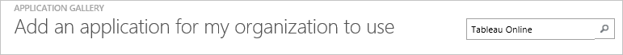
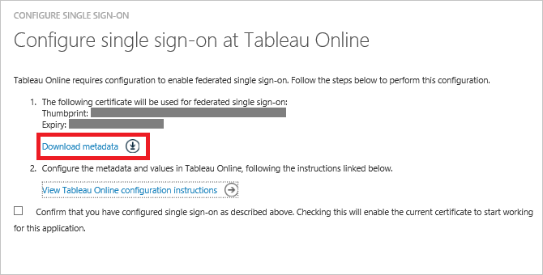
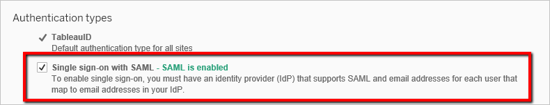
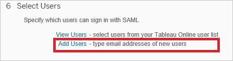
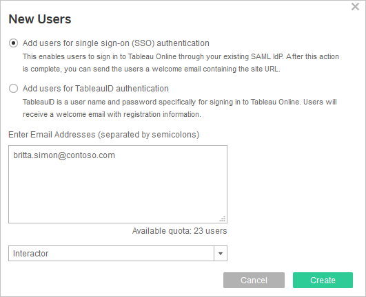
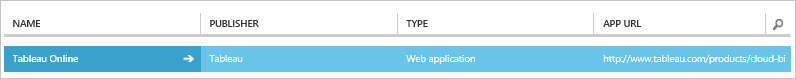

<properties
    pageTitle="Lernprogramm: Azure-Active Directory-Integration in Tableaus Online | Microsoft Azure"
    description="Informationen Sie zum einmaligen Anmeldens zwischen Azure Active Directory und Tableaus Online zu konfigurieren."
    services="active-directory"
    documentationCenter=""
    authors="jeevansd"
    manager="femila"
    editor=""/>

<tags
    ms.service="active-directory"
    ms.workload="identity"
    ms.tgt_pltfrm="na"
    ms.devlang="na"
    ms.topic="article"
    ms.date="10/18/2016"
    ms.author="jeedes"/>

# Lernprogramm: Azure-Active Directory-Integration in Tableaus Online

In diesem Lernprogramm erfahren Sie, wie Tableaus Online mit Azure Active Directory (Azure AD) integriert werden soll.

Integration mit Azure AD Tableaus Online bietet Ihnen die folgenden Vorteile:

- Sie können in Azure AD steuern, wer auf Tableaus Online zugreifen kann
- Sie können Ihre Benutzer automatisch auf Online Tableaus (einmaliges Anmelden) angemeldete Abrufen mit ihren Azure AD-Konten aktivieren.
- Sie können Ihre Konten an einem zentralen Ort – im klassischen Azure-Portal verwalten.

Wenn Sie weitere Details zu SaaS app-Integration in Azure AD-wissen möchten, finden Sie unter [Was ist Zugriff auf die Anwendung und einmaliges Anmelden mit Azure Active Directory](active-directory-appssoaccess-whatis.md).

## Erforderliche Komponenten

Um Azure AD-Integration mit Tableaus Online zu konfigurieren, benötigen Sie die folgenden Elemente:

- Ein Azure AD-Abonnement
- **Online Tableaus** einmalige Anmeldung aktiviert Abonnements

> [AZURE.NOTE] Wenn Sie um die Schritte in diesem Lernprogramm zu testen, empfehlen wir nicht mit einer Umgebung für die Herstellung.

Führen Sie zum Testen der Schritte in diesem Lernprogramm Tips:

- Sie sollten Ihre Umgebung Herstellung nicht verwenden, es sei denn, dies erforderlich ist.
- Wenn Sie eine Testversion Azure AD-Umgebung besitzen, können Sie eine einen Monat zum Testen [hier](https://azure.microsoft.com/pricing/free-trial/)erhalten.

## Szenario Beschreibung
In diesem Lernprogramm testen Sie Azure AD-einmaliges Anmelden in einer testumgebung. In diesem Lernprogramm beschriebenen Szenario besteht aus zwei Hauptfenster Bausteine:

1. Hinzufügen von Tableaus Online aus dem Katalog
2. Konfigurieren und Testen Azure AD einmaliges Anmelden

## Hinzufügen von Tableaus Online aus dem Katalog
Um die Integration von Tableaus Online in Azure AD zu konfigurieren, müssen Sie Tableaus Online zu Ihrer Liste der verwalteten SaaS apps aus dem Katalog hinzuzufügen.

**Um Tableaus Online aus dem Katalog hinzuzufügen, führen Sie die folgenden Schritte aus:**

1. Klicken Sie im **Azure klassischen Portal**auf der linken Navigationsbereich auf **Active Directory**. 

    ![Active Directory][1]

2. Wählen Sie aus der Liste **Verzeichnis** Verzeichnis für das Sie Verzeichnisintegration aktivieren möchten.

3. Klicken Sie zum Öffnen der Anwendungsansicht in der Verzeichnisansicht im oberen Menü auf **Applications** .

    ![Applikationen][2]

4. Klicken Sie auf **Hinzufügen** , am unteren Rand der Seite.

    ![Applikationen][3]

5. Klicken Sie im Dialogfeld **Was möchten Sie tun** klicken Sie auf **eine Anwendung aus dem Katalog hinzufügen**.

    ![Applikationen][4]

6. Geben Sie in das Suchfeld **Tableaus Online**ein.

    

7. Klicken Sie im Ergebnisbereich wählen Sie **Tableaus Online aus**und dann auf **abgeschlossen** , um die Anwendung hinzugefügt haben.

    

##  Konfigurieren und Testen Azure AD einmaliges Anmelden
In diesem Abschnitt Konfigurieren und Testen Azure AD-einmaliges Anmelden mit Tableaus Online basierend auf einen Testbenutzer "Britta Simon" bezeichnet.

Für einmaliges Anmelden entwickelt muss Azure AD wissen, was der Benutzer Gegenstück Tableaus Online in Azure AD einem Benutzer ist. Kurzum, muss eine Link Beziehung zwischen einem Azure AD-Benutzer und dem entsprechenden Benutzer in Tableaus Online hergestellt werden.
Dieser Link Beziehung wird hergestellt, indem Sie den Wert des **Benutzernamens** in Azure AD als der Wert für den **Benutzernamen** in Tableaus Online zuweisen.

Zum Konfigurieren und Azure AD-einmaliges Anmelden mit Tableaus Online testen, müssen Sie die folgenden Bausteine durchführen:

1. **[Konfigurieren von Azure AD einmaligen Anmeldens](#configuring-azure-ad-single-single-sign-on)** - damit Ihre Benutzer dieses Feature verwenden können.
2. **[Erstellen einer Azure AD Benutzer testen](#creating-an-azure-ad-test-user)** : Azure AD-einmaliges Anmelden mit Britta Simon testen.
4. **[Erstellen einer Tableaus Online Benutzer testen](#creating-a-Tableau-Online-test-user)** : ein Gegenstück von Britta Simon in Tableaus Online sein, die in der Azure AD-Darstellung Ihrer verknüpft ist.
5. **[Testen Sie Benutzer zuweisen Azure AD](#assigning-the-azure-ad-test-user)** - Britta Simon mit Azure AD-einmaliges Anmelden aktivieren.
5. **[Testen der einmaligen Anmeldens](#testing-single-sign-on)** - zur Überprüfung, ob die Konfiguration funktioniert.

### Konfigurieren von Azure AD-einmaliges Anmelden

Das Ziel der in diesem Abschnitt ist Azure AD-einmaliges Anmelden im klassischen Azure-Portal aktivieren und konfigurieren einmaliges Anmelden in Ihrer Anwendung Tableaus Online.

**Um Azure AD-einmaliges Anmelden mit Tableaus Online zu konfigurieren, führen Sie die folgenden Schritte aus:**

1. Klicken Sie im Menü oben auf **Schnellstart**.

    ![Konfigurieren Sie einmaliges Anmelden][6]
2. Im Portal klassischen auf der Seite von **Tableaus Online** Anwendung Integration klicken Sie auf **Konfigurieren einmaligen Anmeldens** zum Öffnen des Dialogfelds **Konfigurieren einmaliges Anmelden** .

    ![Konfigurieren Sie einmaliges Anmelden][7] 

3. Klicken Sie auf der Seite **Wie möchten Sie Benutzer Tableaus Online bei auf** **Azure AD einmaliges Anmelden**wählen Sie aus, und klicken Sie dann auf **Weiter**.
    
    

4. Führen Sie auf der Seite Dialogfeld **Konfigurieren der App-Einstellungen** die folgenden Schritte aus: 

    

    ein. Geben Sie in das Textfeld melden Sie sich auf URL eine URL, die mit dem folgenden Muster:`https://sso.online.tableau.com`

    c. Klicken Sie auf **Weiter**.

5. Klicken Sie auf der Seite **Konfigurieren einmaliges Anmelden bei Tableaus Online** auf **Metadaten herunterladen**möchten, und speichern Sie die Datei auf Ihrem Computer.

    

6. Wählen Sie die Bestätigung Konfiguration für einzelne Zeichen, und klicken Sie dann auf **Weiter**.
    
    ![Azure AD einmaliges Anmelden][10]

7. Klicken Sie auf der Seite **Bestätigung für einzelne anmelden** auf **abgeschlossen**.  
    
    ![Azure AD einmaliges Anmelden][11]
8. In einem anderen Browserfenster melden Sie sich für den Zugriff auf Ihre Tableaus Online-Anwendung. Wechseln Sie zu **Einstellungen** und dann auf **Authentifizierung**

    

9. Klicken Sie unter **Authentifizierungsarten** Abschnitt. Das Kontrollkästchen Sie **einmaliges Anmelden mit SAML** um SAML aktivieren.

    

10. Führen Sie einen Bildlauf nach unten bis zum Abschnitt **Tableaus Online Metadatendatei importieren** aus.  Klicken Sie auf Durchsuchen, und importieren Sie die Metadatendatei, die Sie von Azure AD heruntergeladen haben. Klicken Sie dann auf **Übernehmen**.

    

11. Fügen Sie im Abschnitt **Übereinstimmung Assertionen** den entsprechenden Identitätsanbieter Assertion Namen für die e-Mail-Adresse, vor- und Nachnamen aus. Um diese Informationen aus Azure AD zu erhalten:

    ein. Zurück zur Azure AD. Im klassischen Azure Portal **Tableaus Online** Anwendung Integration in die Seite, klicken Sie im Menü oben klicken Sie auf **Attribute**. Kopieren Sie den Namen für die Werte: Userprincipalname, Vorname und Nachname.
     
    

    b. Wechseln Sie zur Anwendung Tableaus Online, und klicken Sie dann festlegen Sie im Abschnitt **Tableaus Online Attribute** , wie folgt:
    
    -  E-Mail-Adresse: **Voicemail** oder **userprincipalname**
    -  Vorname: **Vorname**
    -  Nachname: **Nachname**

    

### Erstellen eines Benutzers mit Azure AD-testen
In diesem Abschnitt erstellen Sie einen Testbenutzer im klassischen Portal Britta Simon bezeichnet.

![Erstellen von Azure AD-Benutzer][20]

**Führen Sie die folgenden Schritte aus, um einen Testbenutzer in Azure AD zu erstellen:**

1. Klicken Sie im **Azure klassischen Portal**auf der linken Navigationsbereich auf **Active Directory**.
    
     

2. Wählen Sie aus der Liste **Verzeichnis** Verzeichnis für das Sie Verzeichnisintegration aktivieren möchten.

3. Wenn die Liste der Benutzer, klicken Sie im Menü oben anzeigen möchten, klicken Sie auf **Benutzer**.
    
     

4. Klicken Sie im Dialogfeld **Benutzer hinzufügen** um in der Symbolleiste auf der Unterseite öffnen, auf **Benutzer hinzufügen**.

     

5. Führen Sie auf der Seite **Teilen Sie uns zu diesem Benutzer** die folgenden Schritte aus:
 
     

    ein. Wählen Sie als Typ des Benutzers neuen Benutzer in Ihrer Organisation ein.

    b. Geben Sie den Benutzernamen **Textfeld** **BrittaSimon**ein.

    c. Klicken Sie auf **Weiter**.

6.  Klicken Sie auf der Seite **Benutzerprofil** Dialogfeld führen Sie die folgenden Schritte aus:

     

    ein. Geben Sie im Textfeld **Vorname** **Britta**aus.  

    b. In das letzte Textfeld **Name** , Typ, **Simon**.

    c. Geben Sie im Textfeld **Anzeigename** **Britta Simon**aus.

    d. Wählen Sie in der Liste **Rolle** **Benutzer**aus.

    e. Klicken Sie auf **Weiter**.

7. Klicken Sie auf der Seite **erste temporäres Kennwort** auf **Erstellen**.

     

8. Führen Sie auf der Seite **erste temporäres Kennwort** die folgenden Schritte aus:

     

    ein. Notieren Sie den Wert für das **Neue Kennwort ein**.

    b. Klicken Sie auf **abgeschlossen**.   

### Erstellen eines Testbenutzers Tableaus Online

In diesem Abschnitt erstellen Sie einen Benutzer namens Britta Simon in Tableaus Online.

1. Klicken Sie auf **Online Tableaus**klicken Sie auf **Einstellungen** und dann auf Abschnitt **Authentifizierung** . Führen Sie einen Bildlauf nach unten bis zum Abschnitt **Benutzer auswählen** . Klicken Sie auf **Benutzer hinzufügen** , und klicken Sie dann auf **e-Mail-Adressen eingeben**.

    
2. Wählen Sie **Benutzer hinzufügen, für die einzelnen einmaliges Anmelden (SSO) Authentifizierung**aus. Fügen Sie in das Textfeld **Geben Sie e-Mail-Adressen**britta.simon@contoso.com

    

3.  Klicken Sie auf **Erstellen**.

### Zuweisen des Azure AD-Test-Benutzers

In diesem Abschnitt aktivieren Sie Britta Simon Azure einmaliges Anmelden verwenden, indem Sie keinen Zugriff auf Online Tableaus erteilen.

![Benutzer zuweisen][200] 

**Um Britta Simon Tableaus Online zuzuweisen, führen Sie die folgenden Schritte aus:**

1. Klicken Sie im Portal klassischen zum Öffnen der Anwendungsansicht in der Verzeichnisansicht klicken Sie auf **Applikationen** im oberen Menü.

    ![Benutzer zuweisen][201] 

3. Wählen Sie in der Liste Applikationen **Tableaus Online**ein.

     

4. Klicken Sie auf **Benutzer**, klicken Sie im Menü oben.

    ![Benutzer zuweisen][203] 

5. Wählen Sie in der Liste alle Benutzer **Britta Simon**aus.

6. Klicken Sie unten auf der Symbolleiste auf **zuweisen**.

    ![Benutzer zuweisen][205]

### Testen einmaliges Anmelden

Das Ziel der in diesem Abschnitt ist zum Azure AD-einzelne anmelden Überprüfen der Konfiguration mithilfe des Bedienfelds Access.

Wenn Sie die Tableaus Online-Kachel im Bereich Access klicken, Sie sollten automatisch angemeldet-an Ihrer Anwendung Tableaus Online auf abrufen.

## Zusätzliche Ressourcen

* [Liste der zum Integrieren SaaS-Apps mit Azure-Active Directory-Lernprogramme](active-directory-saas-tutorial-list.md)
* [Was ist die Anwendungszugriff und einmaliges Anmelden mit Azure Active Directory?](active-directory-appssoaccess-whatis.md)

<!--Image references-->

[1]: ./media/active-directory-saas-tableauonline-tutorial/tutorial_general_01.png
[2]: ./media/active-directory-saas-tableauonline-tutorial/tutorial_general_02.png
[3]: ./media/active-directory-saas-tableauonline-tutorial/tutorial_general_03.png
[4]: ./media/active-directory-saas-tableauonline-tutorial/tutorial_general_04.png

[5]: ./media/active-directory-saas-tableauonline-tutorial/tutorial_general_05.png
[6]: ./media/active-directory-saas-tableauonline-tutorial/tutorial_general_06.png
[7]:  ./media/active-directory-saas-tableauonline-tutorial/tutorial_general_050.png
[10]: ./media/active-directory-saas-tableauonline-tutorial/tutorial_general_060.png
[11]: ./media/active-directory-saas-tableauonline-tutorial/tutorial_general_070.png
[20]: ./media/active-directory-saas-tableauonline-tutorial/tutorial_general_100.png

[200]: ./media/active-directory-saas-tableauonline-tutorial/tutorial_general_200.png
[201]: ./media/active-directory-saas-tableauonline-tutorial/tutorial_general_201.png
[203]: ./media/active-directory-saas-tableauonline-tutorial/tutorial_general_203.png
[204]: ./media/active-directory-saas-tableauonline-tutorial/tutorial_general_204.png
[205]: ./media/active-directory-saas-tableauonline-tutorial/tutorial_general_205.png
