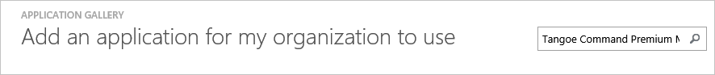
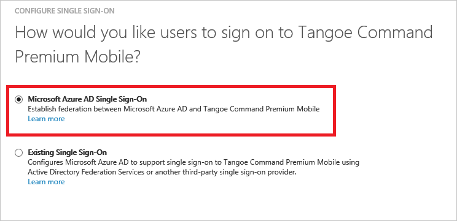
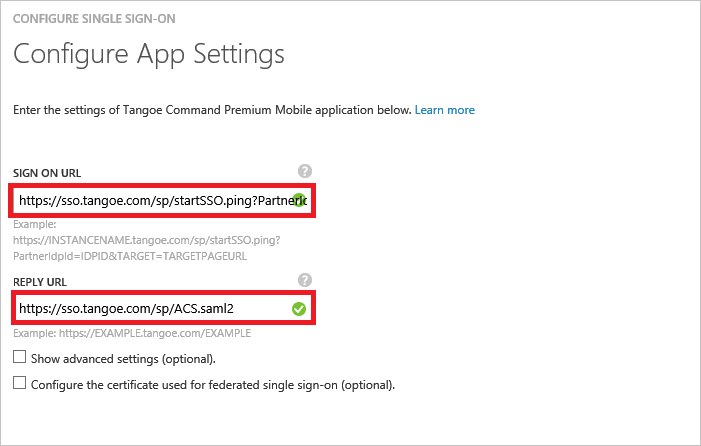
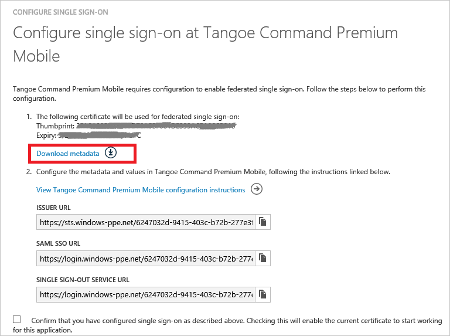
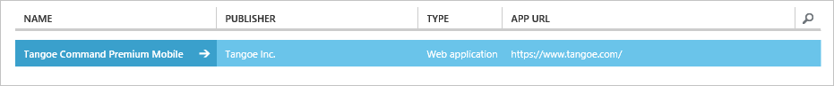

<properties
    pageTitle="Lernprogramm: Azure-Active Directory-Integration in Tangoe Befehl Premium Mobile | Microsoft Azure"
    description="Informationen Sie zum Konfigurieren der einmaligen Anmeldens zwischen Azure Active Directory und Tangoe Befehl Premium Mobile."
    services="active-directory"
    documentationCenter=""
    authors="jeevansd"
    manager="femila"
    editor=""/>

<tags
    ms.service="active-directory"
    ms.workload="identity"
    ms.tgt_pltfrm="na"
    ms.devlang="na"
    ms.topic="article"
    ms.date="09/29/2016"
    ms.author="jeedes"/>

# Lernprogramm: Azure-Active Directory-Integration in Tangoe Befehl Premium Mobile

In diesem Lernprogramm erfahren Sie, wie Tangoe Befehl Premium Mobile mit Azure Active Directory (Azure AD) integriert werden soll.

Integrieren von Azure AD Tangoe Befehl Premium Mobile bietet Ihnen die folgenden Vorteile:

- Sie können in Azure AD steuern, wer auf Tangoe Befehl Premium Mobile zugreifen kann
- Sie können mit ihren Azure AD-Konten Ihrer Benutzer automatisch angemeldet-Tangoe Befehl Premium Mobile (einmaliges Anmelden) klicken Sie auf erste aktivieren.
- Sie können Ihre Konten an einem zentralen Ort – im klassischen Azure-Portal verwalten.

Wenn Sie weitere Details zu SaaS app-Integration in Azure AD-wissen möchten, finden Sie unter [Was ist Zugriff auf die Anwendung und einmaliges Anmelden mit Azure Active Directory](active-directory-appssoaccess-whatis.md).

## Erforderliche Komponenten

Um Azure AD-Integration mit Tangoe Befehl Premium Mobile konfigurieren zu können, benötigen Sie die folgenden Elemente:

- Ein Azure-Abonnement
- Eine Tangoe Befehl Premium Mobile einmaligen Anmeldung aktiviert Abonnement

> [AZURE.NOTE] Wenn Sie um die Schritte in diesem Lernprogramm zu testen, empfehlen wir nicht mit einer Umgebung für die Herstellung.

Führen Sie zum Testen der Schritte in diesem Lernprogramm Tips:

- Sie sollten Ihre Umgebung Herstellung nicht verwenden, es sei denn, dies erforderlich ist.
- Wenn Sie eine Testversion Azure AD-Umgebung besitzen, können Sie eine einen Monat zum Testen [hier](https://azure.microsoft.com/pricing/free-trial/)erhalten.

## Szenario Beschreibung
In diesem Lernprogramm testen Sie Azure AD-einmaliges Anmelden in einer testumgebung. 

In diesem Lernprogramm beschriebenen Szenario besteht aus zwei Hauptfenster Bausteine:

1. Hinzufügen von Tangoe Befehl Premium Mobile aus dem Katalog
2. Konfigurieren und Testen Azure AD einmaliges Anmelden

## Hinzufügen von Tangoe Befehl Premium Mobile aus dem Katalog
Um die Integration von Tangoe Befehl Premium Mobile in Azure AD konfigurieren zu können, müssen Sie Tangoe Befehl Premium Mobile aus dem Katalog zu Ihrer Liste der verwalteten SaaS apps hinzufügen.

**Um Tangoe Befehl Premium Mobile aus dem Katalog hinzufügen möchten, führen Sie die folgenden Schritte aus:**

1. Klicken Sie im **Azure klassischen Portal**auf der linken Navigationsbereich auf **Active Directory**. 

    ![Active Directory][1]

2. Wählen Sie aus der Liste **Verzeichnis** Verzeichnis für das Sie Verzeichnisintegration aktivieren möchten.

3. Klicken Sie zum Öffnen der Anwendungsansicht in der Verzeichnisansicht im oberen Menü auf **Applications** .

    ![Applikationen][2]

4. Klicken Sie auf **Hinzufügen** , am unteren Rand der Seite.

    ![Applikationen][3]

5. Klicken Sie im Dialogfeld **Was möchten Sie tun** klicken Sie auf **eine Anwendung aus dem Katalog hinzufügen**.

    ![Applikationen][4]

6. Geben Sie im Suchfeld **Tangoe Befehl Premium Mobile**aus.

    

7. Wählen Sie im Ergebnisbereich **Tangoe Befehl Premium Mobile**, und klicken Sie dann auf **abgeschlossen** , um die Anwendung hinzugefügt haben.

##  Konfigurieren und Testen Azure AD einmaliges Anmelden
In diesem Abschnitt Konfigurieren und Testen Azure AD-einmaliges Anmelden mit Tangoe Befehl Premium Mobile basierend auf einen Testbenutzer "Britta Simon" bezeichnet.

Für einmaliges Anmelden entwickelt muss Azure AD kennen, kann der Benutzer Gegenstück Tangoe Befehl Premium Mobile einem Benutzer in Azure AD. Kurzum, muss eine Link Beziehung zwischen einem Azure AD-Benutzer und dem entsprechenden Benutzer in Tangoe Befehl Premium Mobile eingerichtet werden.

Dieser Link Beziehung wird hergestellt, indem Sie den Wert des **Benutzernamens** in Azure AD als der Wert für den **Benutzernamen** in Tangoe Befehl Premium Mobile zuweisen.

Zum Konfigurieren und Azure AD-einmaliges Anmelden mit Tangoe Befehl Premium Mobile testen, müssen Sie die folgenden Bausteine durchführen:

1. **[Konfigurieren von Azure AD einmaligen Anmeldens](#configuring-azure-ad-single-single-sign-on)** - damit Ihre Benutzer dieses Feature verwenden können.
2. **[Erstellen einer Azure AD Benutzer testen](#creating-an-azure-ad-test-user)** : Azure AD-einmaliges Anmelden mit Britta Simon testen.
4. **[Erstellen einer Tangoe Befehl Premium Mobile Benutzer testen](#creating-an-tangoe-test-user)** : ein Gegenstück von Britta Simon in Tangoe Befehl Premium Mobile haben, die in der Azure AD-Darstellung Ihrer verknüpft ist.
5. **[Testen Sie Benutzer zuweisen Azure AD](#assigning-the-azure-ad-test-user)** - Britta Simon mit Azure AD-einmaliges Anmelden aktivieren.
5. **[Testen der einmaligen Anmeldens](#testing-single-sign-on)** - zur Überprüfung, ob die Konfiguration funktioniert.

### Konfigurieren von Azure AD einmaliges Anmelden

In diesem Abschnitt Azure AD-einmaliges Anmelden im klassischen Portal aktivieren und konfigurieren in Ihrer Anwendung Tangoe Befehl Premium Mobile einmaliges Anmelden.

**Führen Sie die folgenden Schritte aus, um Azure AD-einmaliges Anmelden mit Tangoe Befehl Premium Mobile konfigurieren:**

1. Im Portal klassischen auf der Seite **Tangoe Befehl Premium Mobile** Integration Anwendung klicken Sie auf **Konfigurieren einmaligen Anmeldens** zum Öffnen des Dialogfelds **Konfigurieren einmaliges Anmelden** .

    ![Konfigurieren Sie einmaliges Anmelden][6]

2. Klicken Sie auf der Seite **Wie möchten Sie Benutzer bei der Tangoe Befehl Premium Mobile auf** **Azure AD einmaliges Anmelden**wählen Sie aus, und klicken Sie dann auf **Weiter**.

     

3. Führen Sie auf der Seite Dialogfeld **Konfigurieren der App-Einstellungen** die folgenden Schritte aus:
 
     

    ein. Geben Sie in das Textfeld **Melden Sie sich auf URL** die URL Ihrer Benutzer melden Sie sich für den Zugriff auf Ihre Tangoe Befehl Premium Mobile-Anwendung unter Verwendung des folgenden Musters untersuchten: **"https://sso.tangoe.com/sp/startSSO.ping?PartnerIdpId=\<Mandanten Herausgeber\>& Ziel =\<Ziel-URL der Seite\>"**.

    b. Geben Sie in das Textfeld **Antwort-URL** die URL in das folgende Muster: **"https://sso.tangoe.com/sp/ACS.saml2"**

    > [AZURE.NOTE]  Wenn Sie die richtigen Werte für die URLs nicht kennen, können die Werte oberhalb als Platzhalter und Anforderung der die richtigen Werte von Support für Ihren Kunden Tangoe zugeordnet werden soll.

4. Führen Sie auf der Seite **Konfigurieren einmaliges Anmelden bei Tangoe Befehl Premium Mobile** die folgenden Schritte aus:
 
     

    ein. Klicken Sie auf **Herunterladen von Metadaten**aus, und speichern Sie die Datei auf Ihrem Computer.

    b. Klicken Sie auf **Weiter**.

5.  Wenn für die Anwendung konfigurierten SSO erhalten möchten, wenden Sie sich an Ihre Tangoe Kundensupport zugeordnet werden soll, und geben Sie Folgendes:

    - Heruntergeladene Metadaten-Datei
    - Die **URL des Herausgebers**
    - Die **URL der SAML-SSO**
    - Die **einzelnen Abmeldung Dienst-URL**

  
6. Im Portal klassischen wählen Sie die Bestätigung Konfiguration für einzelne Zeichen, und klicken Sie dann auf **Weiter**.

    ![Azure AD einmaliges Anmelden][10]

7. Klicken Sie auf der Seite **Bestätigung für einzelne anmelden** auf **abgeschlossen**.  
  
    ![Azure AD einmaliges Anmelden][11]

### Erstellen eines Benutzers mit Azure AD-testen
In diesem Abschnitt erstellen Sie einen Testbenutzer im klassischen Portal Britta Simon bezeichnet.

Wählen Sie in der Liste Benutzer **Britta Simon**aus.

![Erstellen von Azure AD-Benutzer][20]

**Führen Sie die folgenden Schritte aus, um einen Testbenutzer in Azure AD zu erstellen:**

1. Klicken Sie im **Azure klassischen Portal**auf der linken Navigationsbereich auf **Active Directory**.

     

2. Wählen Sie aus der Liste **Verzeichnis** Verzeichnis für das Sie Verzeichnisintegration aktivieren möchten.

3. Wenn die Liste der Benutzer, klicken Sie im Menü oben anzeigen möchten, klicken Sie auf **Benutzer**.

     

4. Klicken Sie im Dialogfeld **Benutzer hinzufügen** um in der Symbolleiste auf der Unterseite öffnen, auf **Benutzer hinzufügen**.

    

5. Führen Sie auf der Seite **Teilen Sie uns zu diesem Benutzer** die folgenden Schritte aus:

     

    ein. Wählen Sie als Typ des Benutzers neuen Benutzer in Ihrer Organisation ein.

    b. Geben Sie den Benutzernamen **Textfeld** **BrittaSimon**ein.

    c. Klicken Sie auf **Weiter**.

6.  Klicken Sie auf der Seite **Benutzerprofil** Dialogfeld führen Sie die folgenden Schritte aus:

     

    ein. Geben Sie im Textfeld **Vorname** **Britta**aus.  

    b. In das letzte Textfeld **Name** , Typ, **Simon**.

    c. Geben Sie im Textfeld **Anzeigename** **Britta Simon**aus.

    d. Wählen Sie in der Liste **Rolle** **Benutzer**aus.

    e. Klicken Sie auf **Weiter**.

7. Klicken Sie auf der Seite **erste temporäres Kennwort** auf **Erstellen**.

     

8. Führen Sie auf der Seite **erste temporäres Kennwort** die folgenden Schritte aus:
 
     

    ein. Notieren Sie den Wert für das **Neue Kennwort ein**.

    b. Klicken Sie auf **abgeschlossen**.   

### Erstellen eines Benutzers mit Tangoe Befehl Premium Mobile testen

In diesem Abschnitt erstellen Sie einen Benutzer namens Britta Simon in Tangoe Befehl Premium Mobile. Tangoe Befehl Premium Mobile-Anwendung benötigen alle Benutzer in der Anwendung zuvor Single Sign On bereitgestellt werden. Also bitte Arbeit mit der Tangoe Kunden-Support-zuordnen zu alle diese Benutzer in die Anwendung bereitgestellt. 

> [AZURE.NOTE] Wenn Sie einen Benutzer manuell zu erstellen, oder Stapel müssen Sie von Benutzern, wenden Sie sich an das Supportteam Tangoe Befehl Premium Mobile müssen.

### Zuweisen des Azure AD-Test-Benutzers

In diesem Abschnitt aktivieren Sie Britta Simon Azure einmaliges Anmelden verwenden, indem Sie keinen Zugriff auf Tangoe Befehl Premium Mobile erteilen.

![Benutzer zuweisen][200] 

**Um Britta Simon Tangoe Befehl Premium Mobile zuzuweisen, führen Sie die folgenden Schritte aus:**

1. Klicken Sie im Portal klassischen zum Öffnen der Anwendungsansicht in der Verzeichnisansicht klicken Sie auf **Applikationen** im oberen Menü.

![Benutzer zuweisen][201] 

2. Wählen Sie in der Liste Applications **Tangoe Befehl Premium Mobile**aus.

 

1. Klicken Sie auf **Benutzer**, klicken Sie im Menü oben.

![Benutzer zuweisen][203] 

1. Wählen Sie in der Liste Benutzer **Britta Simon**aus.

2. Klicken Sie unten auf der Symbolleiste auf **zuweisen**.

![Benutzer zuweisen][205]

### Testen einmaliges Anmelden

In diesem Abschnitt Testen Sie Ihre Azure AD-einzelne anmelden Konfiguration mit der Access-Systemsteuerung.

Wenn Sie die Kachel Tangoe Befehl Premium Mobile im Bereich Access klicken, Sie sollten automatisch an Ihrer Anwendung Tangoe Befehl Premium Mobile angemeldete abrufen.

## Zusätzliche Ressourcen

* [Liste der zum Integrieren SaaS-Apps mit Azure-Active Directory-Lernprogramme](active-directory-saas-tutorial-list.md)
* [Was ist die Anwendungszugriff und einmaliges Anmelden mit Azure Active Directory?](active-directory-appssoaccess-whatis.md)

<!--Image references-->

[1]: ./media/active-directory-saas-tangoe-tutorial/tutorial_general_01.png
[2]: ./media/active-directory-saas-tangoe-tutorial/tutorial_general_02.png
[3]: ./media/active-directory-saas-tangoe-tutorial/tutorial_general_03.png
[4]: ./media/active-directory-saas-tangoe-tutorial/tutorial_general_04.png

[6]: ./media/active-directory-saas-tangoe-tutorial/tutorial_general_05.png
[10]: ./media/active-directory-saas-tangoe-tutorial/tutorial_general_06.png
[11]: ./media/active-directory-saas-tangoe-tutorial/tutorial_general_07.png
[20]: ./media/active-directory-saas-tangoe-tutorial/tutorial_general_100.png

[200]: ./media/active-directory-saas-tangoe-tutorial/tutorial_general_200.png
[201]: ./media/active-directory-saas-tangoe-tutorial/tutorial_general_201.png
[203]: ./media/active-directory-saas-tangoe-tutorial/tutorial_general_203.png
[204]: ./media/active-directory-saas-tangoe-tutorial/tutorial_general_204.png
[205]: ./media/active-directory-saas-tangoe-tutorial/tutorial_general_205.png
