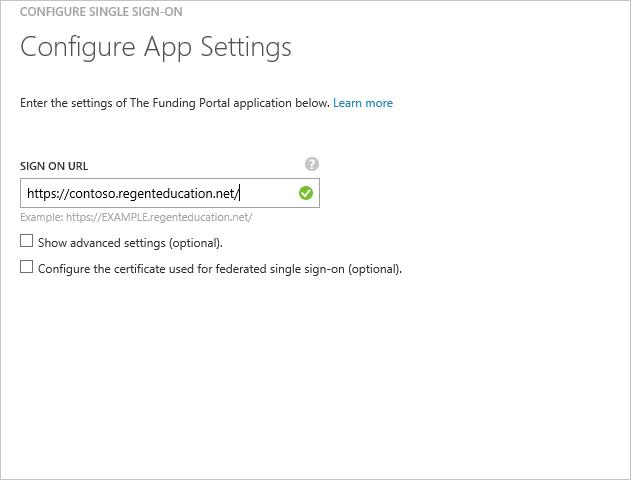
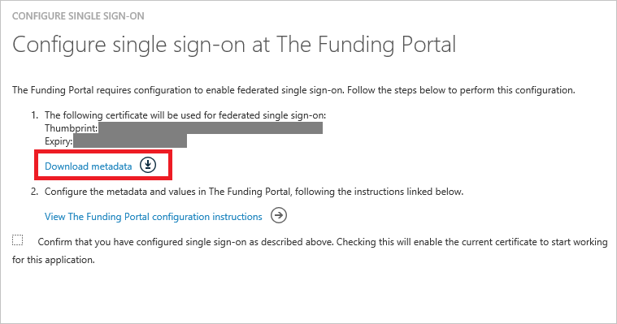
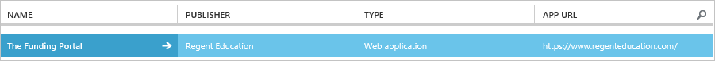

<properties
    pageTitle="Lernprogramm: Azure-Active Directory-Integration in der Bereitstellung von Mitteln Portal | Microsoft Azure"
    description="Informationen Sie zum einmaligen Anmeldens zwischen Azure Active Directory und der Bereitstellung von Mitteln Portal konfigurieren."
    services="active-directory"
    documentationCenter=""
    authors="jeevansd"
    manager="femila"
    editor=""/>

<tags
    ms.service="active-directory"
    ms.workload="identity"
    ms.tgt_pltfrm="na"
    ms.devlang="na"
    ms.topic="article"
    ms.date="09/02/2016"
    ms.author="jeedes"/>

# Lernprogramm: Azure-Active Directory-Integration in der Bereitstellung von Mitteln-Portal

In diesem Lernprogramm erfahren Sie, wie die Bereitstellung von Mitteln Portal mit Azure Active Directory (Azure AD) integriert werden soll.

Integrieren von der Bereitstellung von Mitteln Portal in Azure AD bietet Ihnen die folgenden Vorteile:

- Sie können in Azure AD steuern, wer auf die Bereitstellung von Mitteln Portal zugreifen können
- Sie können Ihre Benutzer automatisch auf die Bereitstellung von Mitteln Portal (einmaliges Anmelden) angemeldete Abrufen mit ihren Azure AD-Konten aktivieren.
- Sie können Ihre Konten an einem zentralen Ort – im klassischen Azure-Portal verwalten.

Wenn Sie weitere Details zu SaaS app-Integration in Azure AD-wissen möchten, finden Sie unter [Was ist Zugriff auf die Anwendung und einmaliges Anmelden mit Azure Active Directory](active-directory-appssoaccess-whatis.md).

## Erforderliche Komponenten

Um Azure AD-Integration in der Bereitstellung von Mitteln Portal konfigurieren zu können, benötigen Sie die folgenden Elemente:

- Ein Azure AD-Abonnement
- **Die Bereitstellung von Mitteln Portal** einmalige Anmeldung aktiviert Abonnements

> [AZURE.NOTE] Wenn Sie um die Schritte in diesem Lernprogramm zu testen, empfehlen wir nicht mit einer Umgebung für die Herstellung.

Führen Sie zum Testen der Schritte in diesem Lernprogramm Tips:

- Sie sollten Ihre Umgebung Herstellung nicht verwenden, es sei denn, dies erforderlich ist.
- Wenn Sie eine Testversion Azure AD-Umgebung besitzen, können Sie eine einen Monat zum Testen [hier](https://azure.microsoft.com/pricing/free-trial/)erhalten.

## Szenario Beschreibung
In diesem Lernprogramm testen Sie Azure AD-einmaliges Anmelden in einer testumgebung. In diesem Lernprogramm beschriebenen Szenario besteht aus zwei Hauptfenster Bausteine:

1. Hinzufügen der Bereitstellung von Mitteln Portal aus dem Katalog
2. Konfigurieren und Testen Azure AD einmaliges Anmelden

## Hinzufügen der Bereitstellung von Mitteln Portal aus dem Katalog
Zum Konfigurieren der Integration von der Bereitstellung von Mitteln Portal in Azure AD müssen Sie die Bereitstellung von Mitteln-Portal zu Ihrer Liste der verwalteten SaaS apps aus dem Katalog hinzuzufügen.

**Wenn die Bereitstellung von Mitteln Portal aus dem Katalog hinzufügen möchten, führen Sie die folgenden Schritte aus:**

1. Klicken Sie im **Azure klassischen Portal**auf der linken Navigationsbereich auf **Active Directory**. 

    ![Active Directory][1]

2. Wählen Sie aus der Liste **Verzeichnis** Verzeichnis für das Sie Verzeichnisintegration aktivieren möchten.

3. Klicken Sie zum Öffnen der Anwendungsansicht in der Verzeichnisansicht im oberen Menü auf **Applications** .

    ![Applikationen][2]

4. Klicken Sie auf **Hinzufügen** , am unteren Rand der Seite.

    ![Applikationen][3]

5. Klicken Sie im Dialogfeld **Was möchten Sie tun** klicken Sie auf **eine Anwendung aus dem Katalog hinzufügen**.

    ![Applikationen][4]

6. Geben Sie in das Suchfeld **Der Bereitstellung von Mitteln Portal**aus.

    

7. Wählen Sie im Ergebnisbereich aus **Der Bereitstellung von Mitteln Portal**, und klicken Sie dann auf **abgeschlossen** , um die Anwendung hinzugefügt haben.

    

##  Konfigurieren und Testen Azure AD einmaliges Anmelden
In diesem Abschnitt Konfigurieren und Testen Sie mit der Bereitstellung von Mitteln Portal basierend auf einen Testbenutzer namens "Britta Simon" Azure AD-einmaliges Anmelden.

Für einmaliges Anmelden entwickelt muss Azure AD wissen, was in Azure AD Gegenstück Benutzer im Portal für die Bereitstellung von Mitteln für einen Benutzer ist. Kurzum, muss eine Link Beziehung zwischen einem Azure AD-Benutzer und der entsprechenden Benutzerinformationen im Portal für die Bereitstellung von Mitteln eingerichtet werden.
Dieser Link Beziehung wird hergestellt, indem Sie den Wert des **Benutzernamens** in Azure AD als der Wert für den **Benutzernamen** im Portal für die Bereitstellung von Mitteln zuweisen.

Zum Konfigurieren und Azure AD-einmaliges Anmelden mit der Bereitstellung von Mitteln Portal testen, müssen Sie die folgenden Bausteine durchführen:

1. **[Konfigurieren von Azure AD einmaligen Anmeldens](#configuring-azure-ad-single-single-sign-on)** - damit Ihre Benutzer dieses Feature verwenden können.
2. **[Erstellen einer Azure AD Benutzer testen](#creating-an-azure-ad-test-user)** : Azure AD-einmaliges Anmelden mit Britta Simon testen.
4. **[Erstellen eines der Bereitstellung von Mitteln Portals Benutzer testen](#creating-a-the-funding-portal-test-user)** : ein Gegenstück von Britta Simon Portal für die Bereitstellung von Mitteln haben, die in der Azure AD-Darstellung Ihrer verknüpft ist.
5. **[Testen Sie Benutzer zuweisen Azure AD](#assigning-the-azure-ad-test-user)** - Britta Simon mit Azure AD-einmaliges Anmelden aktivieren.
5. **[Testen der einmaligen Anmeldens](#testing-single-sign-on)** - zur Überprüfung, ob die Konfiguration funktioniert.

### Konfigurieren von Azure AD-einmaliges Anmelden

Das Ziel der in diesem Abschnitt ist Azure AD-einmaliges Anmelden im klassischen Azure-Portal aktivieren und konfigurieren einmaliges Anmelden in Ihrer dienstanwendung Portal für Bereitstellung von Mitteln.

Die Bereitstellung von Mitteln Portal-Anwendung erwartet die SAML-Assertionen ein Attribut mit dem Namen "externalId1" enthalten. Der Wert von "externalId1" sollte eine erkannten StudentID sein. Konfigurieren Sie die anfordern "externalId1" für diese Anwendung. Sie können die Werte dieser Attribute der Registerkarte **"Atrributes"** der Anwendung verwalten. Das folgende Bildschirmabbild zeigt ein Beispiel dafür.

 

**Führen Sie die folgenden Schritte aus, um Azure AD-einmaliges Anmelden mit der Bereitstellung von Mitteln Portal konfigurieren:**

1. Im klassischen Azure Portal **Portal für die Bereitstellung von Mitteln** Anwendung Integration in die Seite, klicken Sie im Menü oben klicken Sie auf **Attribute**.
     
    ![Konfigurieren Sie einmaliges Anmelden][5]

2. Klicken Sie im Dialogfeld SAML token Attribute fügen Sie das Attribut "externalId1" hinzu.

    ein. Klicken Sie auf **Benutzerattribut hinzufügen** , um das Dialogfeld **Benutzerattribut hinzufügen** zu öffnen. 
    
    

    b. Geben Sie in das Textfeld **Name Attribut** das Attribut "externalId1" ein.

    c. Wählen Sie das Attribut aus, die, das Sie für Ihre Implementierung verwenden möchten, aus der Liste **Attribut-Wert** . Beispielsweise, wenn Sie den Wert StudentID in der ExtensionAttribute1 gespeichert sind, wählen Sie dann user.extensionattribute1.

    d. Klicken Sie auf **abgeschlossen**. Klicken Sie dann auf **Änderungen übernehmen**.

1. Klicken Sie im Menü oben auf **Schnellstart**.

    ![Konfigurieren Sie einmaliges Anmelden][6]

2. Im Portal klassischen auf der Seite **Der Bereitstellung von Mitteln Portal** Integration Anwendung klicken Sie auf **Konfigurieren einmaligen Anmeldens** zum Öffnen des Dialogfelds **Konfigurieren einmaliges Anmelden** .

    ![Konfigurieren Sie einmaliges Anmelden][7] 

3. Klicken Sie auf der Seite **Wie möchten Sie Benutzer bei der Bereitstellung von Mitteln Portal, auf** **Azure AD einmaliges Anmelden**wählen Sie aus, und klicken Sie dann auf **Weiter**.
    
    

4. Führen Sie auf der Seite Dialogfeld **Konfigurieren der App-Einstellungen** die folgenden Schritte aus: 

    

    ein. Geben Sie in das Textfeld melden Sie sich auf URL eine URL, die mit dem folgenden Muster: `https://<subdomain>.regenteducation.net/`.

    b. Klicken Sie auf **Weiter**.

5. Klicken Sie auf der Seite **Konfigurieren einmaliges Anmelden bei der Bereitstellung von Mitteln Portal** auf **Metadaten herunterladen**möchten, und speichern Sie die Datei auf Ihrem Computer.

    

6. Um für die Anwendung konfigurierten SSO zu gelangen, wenden Sie sich an die Bereitstellung von Mitteln Portal Support. Sie werden mit den richtigen Kanal unterstützen, SSO konfigurieren. Bitte beachten Sie, dass Sie auf e-Mail senden, und fügen Sie Metadatendatei heruntergeladen info@regenteducation.com.

7. Im Portal klassischen wählen Sie die Bestätigung Konfiguration für einzelne Zeichen, und klicken Sie dann auf **Weiter**.
    
    ![Azure AD einmaliges Anmelden][10]

8. Klicken Sie auf der Seite **Bestätigung für einzelne anmelden** auf **abgeschlossen**.  
    
    ![Azure AD einmaliges Anmelden][11]

### Erstellen eines Benutzers mit Azure AD-testen
In diesem Abschnitt erstellen Sie einen Testbenutzer im klassischen Portal Britta Simon bezeichnet.

![Erstellen von Azure AD-Benutzer][20]

**Führen Sie die folgenden Schritte aus, um einen Testbenutzer in Azure AD zu erstellen:**

1. Klicken Sie im **Azure klassischen Portal**auf der linken Navigationsbereich auf **Active Directory**.
    
     

2. Wählen Sie aus der Liste **Verzeichnis** Verzeichnis für das Sie Verzeichnisintegration aktivieren möchten.

3. Wenn die Liste der Benutzer, klicken Sie im Menü oben anzeigen möchten, klicken Sie auf **Benutzer**.
    
     

4. Klicken Sie im Dialogfeld **Benutzer hinzufügen** um in der Symbolleiste auf der Unterseite öffnen, auf **Benutzer hinzufügen**.

     

5. Führen Sie auf der Seite **Teilen Sie uns zu diesem Benutzer** die folgenden Schritte aus:
 
     

    ein. Wählen Sie als Typ des Benutzers neuen Benutzer in Ihrer Organisation ein.

    b. Geben Sie den Benutzernamen **Textfeld** **BrittaSimon**ein.

    c. Klicken Sie auf **Weiter**.

6.  Klicken Sie auf der Seite **Benutzerprofil** Dialogfeld führen Sie die folgenden Schritte aus:

     

    ein. Geben Sie im Textfeld **Vorname** **Britta**aus.  

    b. In das letzte Textfeld **Name** , Typ, **Simon**.

    c. Geben Sie im Textfeld **Anzeigename** **Britta Simon**aus.

    d. Wählen Sie in der Liste **Rolle** **Benutzer**aus.

    e. Klicken Sie auf **Weiter**.

7. Klicken Sie auf der Seite **erste temporäres Kennwort** auf **Erstellen**.

     

8. Klicken Sie auf der Seite **erste temporäres Kennwort** führen Sie die folgenden Schritte aus:

     

    ein. Notieren Sie den Wert für das **Neue Kennwort ein**.

    b. Klicken Sie auf **abgeschlossen**.   

### Erstellen eines Testbenutzers Portal für die Bereitstellung von Mitteln

In diesem Abschnitt erstellen Sie einen Benutzer namens Britta Simon der Bereitstellung von Mitteln-Portal an. Wenn Sie nicht, dass das Wissen Hinzufügen von Britta Simon Portal für die Bereitstellung von Mitteln, arbeiten Sie mit der Bereitstellung von Mitteln Portal Supportteam Testbenutzer hinzufügen und SSO aktivieren. Wenden Sie sich an, bei info@regenteducation.com.

### Zuweisen des Azure AD-Test-Benutzers

In diesem Abschnitt aktivieren Sie Britta Simon Azure einmaliges Anmelden verwenden, indem Sie keinen Zugriff auf die Bereitstellung von Mitteln Portal erteilen.

![Benutzer zuweisen][200] 

**Um die Bereitstellung von Mitteln Portal Britta Simon zuzuweisen, führen Sie die folgenden Schritte aus:**

1. Klicken Sie im Portal klassischen zum Öffnen der Anwendungsansicht in der Verzeichnisansicht klicken Sie auf **Applikationen** im oberen Menü.

    ![Benutzer zuweisen][201] 

2. Wählen Sie in der Liste Applikationen **Portal für die Bereitstellung von Mitteln**aus.

     

1. Klicken Sie auf **Benutzer**, klicken Sie im Menü oben.

    ![Benutzer zuweisen][203] 

1. Wählen Sie in der Liste alle Benutzer **Britta Simon**aus.

2. Klicken Sie unten auf der Symbolleiste auf **zuweisen**.

    ![Benutzer zuweisen][205]

### Testen einmaliges Anmelden

Das Ziel der in diesem Abschnitt ist zum Azure AD-einzelne anmelden Überprüfen der Konfiguration mithilfe des Bedienfelds Access.

Wenn Sie die Kachel der Bereitstellung von Mitteln Portal im Bereich Access klicken, Sie sollten automatisch an Ihrer dienstanwendung Portal für Bereitstellung von Mitteln angemeldete erhalten.

## Zusätzliche Ressourcen

* [Liste der zum Integrieren SaaS-Apps mit Azure-Active Directory-Lernprogramme](active-directory-saas-tutorial-list.md)
* [Was ist die Anwendungszugriff und einmaliges Anmelden mit Azure Active Directory?](active-directory-appssoaccess-whatis.md)

<!--Image references-->

[1]: ./media/active-directory-saas-thefundingportal-tutorial/tutorial_general_01.png
[2]: ./media/active-directory-saas-thefundingportal-tutorial/tutorial_general_02.png
[3]: ./media/active-directory-saas-thefundingportal-tutorial/tutorial_general_03.png
[4]: ./media/active-directory-saas-thefundingportal-tutorial/tutorial_general_04.png

[5]: ./media/active-directory-saas-thefundingportal-tutorial/tutorial_general_05.png
[6]: ./media/active-directory-saas-thefundingportal-tutorial/tutorial_general_06.png
[7]:  ./media/active-directory-saas-thefundingportal-tutorial/tutorial_general_050.png
[10]: ./media/active-directory-saas-thefundingportal-tutorial/tutorial_general_060.png
[11]: ./media/active-directory-saas-thefundingportal-tutorial/tutorial_general_070.png
[20]: ./media/active-directory-saas-thefundingportal-tutorial/tutorial_general_100.png

[200]: ./media/active-directory-saas-thefundingportal-tutorial/tutorial_general_200.png
[201]: ./media/active-directory-saas-thefundingportal-tutorial/tutorial_general_201.png
[203]: ./media/active-directory-saas-thefundingportal-tutorial/tutorial_general_203.png
[204]: ./media/active-directory-saas-thefundingportal-tutorial/tutorial_general_204.png
[205]: ./media/active-directory-saas-thefundingportal-tutorial/tutorial_general_205.png
