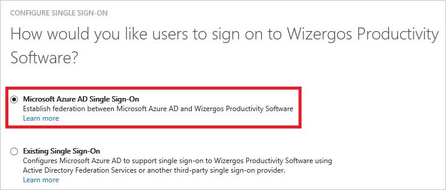
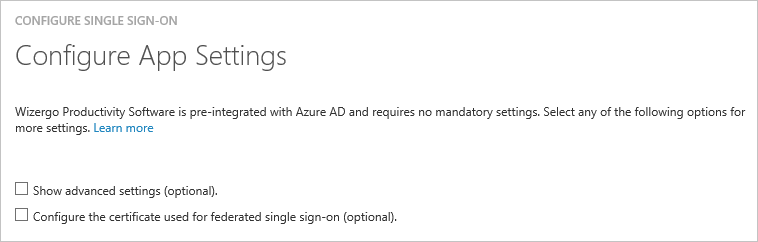
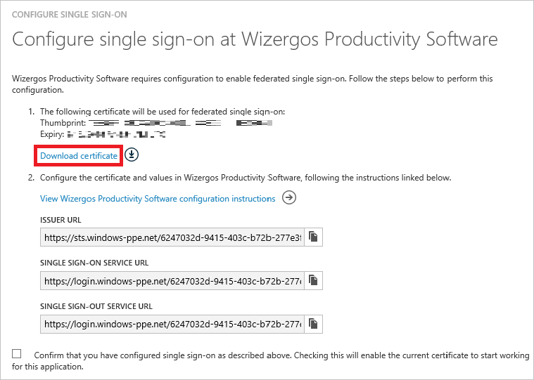
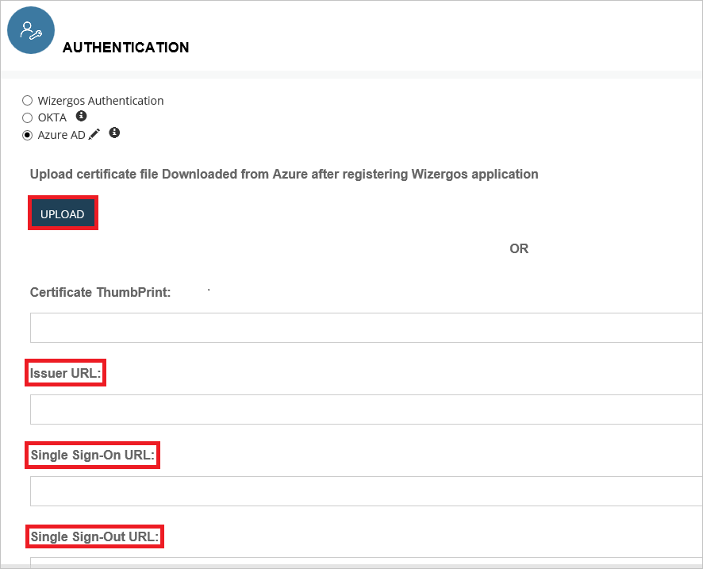

<properties
    pageTitle="Lernprogramm: Azure-Active Directory-Integration in Wizergos Produktivitätssoftware | Microsoft Azure"
    description="Informationen Sie zum Konfigurieren der einmaligen Anmeldens zwischen Azure Active Directory und Wizergos Produktivitätssoftware."
    services="active-directory"
    documentationCenter=""
    authors="jeevansd"
    manager="femila"
    editor=""/>

<tags
    ms.service="active-directory"
    ms.workload="identity"
    ms.tgt_pltfrm="na"
    ms.devlang="na"
    ms.topic="article"
    ms.date="10/17/2016"
    ms.author="jeedes"/>

# Lernprogramm: Azure-Active Directory-Integration in Wizergos Produktivitätssoftware 

Ziel dieses Lernprogramms ist zu veranschaulichen Wizergos Produktivitätssoftware mit Azure Active Directory (Azure AD) integriert werden soll.

Integration Wizergos Produktivitätssoftware mit Azure AD bietet Ihnen die folgenden Vorteile:

- Sie können in Azure AD steuern, wer auf Wizergos Produktivitätssoftware zugreifen kann
- Sie können Ihre Benutzer automatisch auf Wizergos Produktivitätssoftware (einmaliges Anmelden) angemeldete Abrufen mit ihren Azure AD-Konten aktivieren.
- Sie können Ihre Konten an einem zentralen Ort – im klassischen Azure-Portal verwalten.

Wenn Sie weitere Details zu SaaS app-Integration in Azure AD-wissen möchten, finden Sie unter [Was ist Zugriff auf die Anwendung und einmaliges Anmelden mit Azure Active Directory](active-directory-appssoaccess-whatis.md).

## Erforderliche Komponenten

Zum Konfigurieren von Azure AD-Integration mit Wizergos Produktivitätssoftware, benötigen Sie die folgenden Elemente:

- Ein Azure AD-Abonnement
- Eine Wizergos Produktivitätssoftware einmaligen Anmeldung aktiviert Abonnement

> [AZURE.NOTE] Wenn Sie um die Schritte in diesem Lernprogramm zu testen, empfehlen wir nicht mit einer Umgebung für die Herstellung.

Führen Sie zum Testen der Schritte in diesem Lernprogramm Tips:

- Sie sollten Ihre Umgebung Herstellung nicht verwenden, es sei denn, dies erforderlich ist.
- Wenn Sie eine Testversion Azure AD-Umgebung besitzen, können Sie eine einen Monat zum Testen [hier](https://azure.microsoft.com/pricing/free-trial/)erhalten.

## Szenario Beschreibung
Ziel dieses Lernprogramms ist, sodass Sie in einer Umgebung für Azure AD-einmaligen Anmeldens testen können.

In diesem Lernprogramm beschriebenen Szenario besteht aus zwei Hauptfenster Bausteine:

1. Hinzufügen von Wizergos Produktivitätssoftware aus dem Katalog
2. Konfigurieren und Testen Azure AD einmaliges Anmelden

## Hinzufügen von Wizergos Produktivitätssoftware aus dem Katalog
Zum Konfigurieren der Integration von Wizergos Produktivitätssoftware in Azure AD müssen Sie Wizergos Produktivitätssoftware zu Ihrer Liste der verwalteten SaaS apps aus dem Katalog hinzuzufügen.

**Wenn Wizergos Produktivitätssoftware aus dem Katalog hinzufügen möchten, führen Sie die folgenden Schritte aus:**

1. Klicken Sie im **Azure klassischen Portal**auf der linken Navigationsbereich auf **Active Directory**. 

    ![Active Directory][1]

2. Wählen Sie aus der Liste **Verzeichnis** Verzeichnis für das Sie Verzeichnisintegration aktivieren möchten.

3. Klicken Sie zum Öffnen der Anwendungsansicht in der Verzeichnisansicht im oberen Menü auf **Applications** .
    
    ![Applikationen][2]

4. Klicken Sie auf **Hinzufügen** , am unteren Rand der Seite.
    
    ![Applikationen][3]

5. Klicken Sie im Dialogfeld **Was möchten Sie tun** klicken Sie auf **eine Anwendung aus dem Katalog hinzufügen**.

    ![Applikationen][4]

6. Geben Sie im Suchfeld **Wizergos Produktivitätssoftware**aus.

    

7. Wählen Sie im Ergebnisfeld **Wizergos Produktivitätssoftware**und dann auf **abgeschlossen** , um die Anwendung hinzuzufügen.

    

##  Konfigurieren und Testen Azure AD einmaliges Anmelden
Das Ziel der in diesem Abschnitt ist erläutert, wie Sie konfigurieren und Testen der Azure AD-einmaliges Anmelden mit Wizergos Produktivitätssoftware auf Grundlage eines Testbenutzers "Britta Simon" bezeichnet.

Für einmaliges Anmelden entwickelt muss Azure AD wissen, was der Benutzer Gegenstück Wizergos Produktivitätssoftware an einen Benutzer in Azure AD ist. Kurzum, muss eine Link Beziehung zwischen einem Azure AD-Benutzer und dem entsprechenden Benutzer Wizergos Produktivität Software hergestellt werden.

Dieser Link Beziehung wird hergestellt, indem Sie den Wert des **Benutzernamens** in Azure AD als der Wert für den **Benutzernamen** Wizergos Produktivität Software zuweisen.

Zum Konfigurieren und Azure AD-einmaliges Anmelden mit BynWizergos Produktivität Softwareder testen, müssen Sie die folgenden Bausteine durchführen:

1. **[Konfigurieren von Azure AD einmaligen Anmeldens](#configuring-azure-ad-single-single-sign-on)** - damit Ihre Benutzer dieses Feature verwenden können.
2. **[Erstellen einer Azure AD Benutzer testen](#creating-an-azure-ad-test-user)** : Azure AD-einmaliges Anmelden mit Britta Simon testen.
3. **[Erstellen einer Wizergos Produktivitätssoftware testen Benutzer](#creating-a-wizergos-productivity-software-test-user)** : ein Gegenstück von Britta Simon Wizergos Produktivität Software haben, die in der Azure AD-Darstellung Ihrer verknüpft ist.
4. **[Testen Sie Benutzer zuweisen Azure AD](#assigning-the-azure-ad-test-user)** - Britta Simon mit Azure AD-einmaliges Anmelden aktivieren.
5. **[Testen der einmaligen Anmeldens](#testing-single-sign-on)** - zur Überprüfung, ob die Konfiguration funktioniert.

### Konfigurieren von Azure AD-einmaliges Anmelden

In diesem Abschnitt Azure AD-einmaliges Anmelden im klassischen Portal aktivieren und konfigurieren in Ihrer Anwendung Wizergos Produktivitätssoftware einmaliges Anmelden.

**So konfigurieren Sie Azure AD-einmaliges Anmelden mit Wizergos Produktivitätssoftware die folgenden Schritte aus:**

1. Im Portal klassischen auf der Seite Anwendung Integration **Wizergos Produktivitätssoftware** klicken Sie auf **Konfigurieren einmaligen Anmeldens** zum Öffnen des Dialogfelds **Konfigurieren einmaliges Anmelden** .
     
    ![Konfigurieren Sie einmaliges Anmelden][6] 

2. Klicken Sie auf der Seite **Wie möchten Sie Benutzer bei der Wizergos Produktivitätssoftware auf** **Azure AD einmaliges Anmelden**markieren Sie, und klicken Sie dann auf **Weiter**:
    
    

3. Klicken Sie auf der Seite Dialogfeld **Konfigurieren der App-Einstellungen** auf **Weiter**:

    

4. Klicken Sie auf der Seite **Konfigurieren einmaliges Anmelden bei Wizergos Produktivitätssoftware** klicken Sie auf **Zertifikat herunterladen**, und speichern Sie die Datei auf Ihrem Computer:

    

5. In einem anderen Webbrowserfenster melden Sie sich für den Zugriff auf Ihre Wizergos Produktivitätssoftware Mandanten als Administrator.

6. Wählen Sie im Menü Hamburger **Administrator**aus.

    

7. Klicken Sie in der Seite Administrator im linken Menü Wählen Sie **Authentifizierung** , und klicken Sie auf **Azure AD**.

    

8. Führen Sie die folgenden Schritte auf Abschnitt **Authentifizierung** ein.

    

    ein. Klicken Sie auf die Schaltfläche **Hochladen** , um die heruntergeladene Zertifikat von Azure AD hochzuladen. 

    b. In der **URL des Herausgebers** setzen Textfeld den Wert des **Herausgebers URL** aus Azure AD-Anwendung Kontokonfigurations-Assistenten aus.

    c. In der **URL für einzelne Zeichen** setzen Textfeld den Wert der **Einzelnen anmelden Service URL** aus Azure AD-Anwendung Kontokonfigurations-Assistenten aus.

    d. In den **Einzelnen Sign-Out URL** setzen Textfeld den Wert der **Einzelnen Sign-out Service URL** aus Azure AD-Anwendung Kontokonfigurations-Assistenten aus.

    e. Klicken Sie auf die Schaltfläche **Speichern** .

9. Im Portal klassischen wählen Sie die Bestätigung Konfiguration für einzelne Zeichen, und klicken Sie dann auf **Weiter**.
    
    ![Azure AD einmaliges Anmelden][10]

10. Klicken Sie auf der Seite **Bestätigung für einzelne anmelden** auf **abgeschlossen**.  
    
    ![Azure AD einmaliges Anmelden][11]

### Erstellen eines Benutzers mit Azure AD-testen
Das Ziel der in diesem Abschnitt besteht im Erstellen eines Testbenutzers im klassischen Portal Britta Simon bezeichnet.

![Erstellen von Azure AD-Benutzer][20]

**Führen Sie die folgenden Schritte aus, um einen Testbenutzer in Azure AD zu erstellen:**

1. Klicken Sie im **Azure klassischen Portal**auf der linken Navigationsbereich auf **Active Directory**.

    

2. Wählen Sie aus der Liste **Verzeichnis** Verzeichnis für das Sie Verzeichnisintegration aktivieren möchten.

3. Wenn die Liste der Benutzer, klicken Sie im Menü oben anzeigen möchten, klicken Sie auf **Benutzer**.
    
    

4. Klicken Sie im Dialogfeld **Benutzer hinzufügen** um in der Symbolleiste auf der Unterseite öffnen, auf **Benutzer hinzufügen**.

    

5. Führen Sie auf der Seite **Teilen Sie uns zu diesem Benutzer** die folgenden Schritte aus:

    

    ein. Wählen Sie als Typ des Benutzers neuen Benutzer in Ihrer Organisation ein.

    b. Geben Sie den Benutzernamen **Textfeld** **BrittaSimon**ein.

    c. Klicken Sie auf **Weiter**.

6.  Klicken Sie auf der Seite **Benutzerprofil** Dialogfeld führen Sie die folgenden Schritte aus:
    
    

    ein. Geben Sie im Textfeld **Vorname** **Britta**aus.  

    b. In das letzte Textfeld **Name** , Typ, **Simon**.

    c. Geben Sie im Textfeld **Anzeigename** **Britta Simon**aus.

    d. Wählen Sie in der Liste **Rolle** **Benutzer**aus.

    e. Klicken Sie auf **Weiter**.

7. Klicken Sie auf der Seite **erste temporäres Kennwort** auf **Erstellen**.
    
    

8. Führen Sie auf der Seite **erste temporäres Kennwort** die folgenden Schritte aus:
    
    

    ein. Notieren Sie den Wert für das **Neue Kennwort ein**.

    b. Klicken Sie auf **abgeschlossen**.   

### Erstellen eines Testbenutzers Wizergos Produktivitätssoftware

In diesem Abschnitt erstellen Sie einen Benutzer namens Britta Simon Wizergos Produktivität Software aus. Arbeiten Sie an das Supportteam über Wizergos Produktivitätssoftware [support@wizergos.com](emailTo:support@wizergos.com) die Benutzer in die Wizergos Produktivitätssoftware-Plattform hinzufügen.

### Zuweisen des Azure AD-Test-Benutzers

Das Ziel der in diesem Abschnitt ist für die Aktivierung der Britta Simon Azure einmaliges Anmelden verwenden, indem Sie keinen Zugriff auf Wizergos Produktivitätssoftware erteilen.
    
   ![Benutzer zuweisen][200]

**Um Britta Simon Wizergos Produktivitätssoftware zuzuweisen, führen Sie die folgenden Schritte aus:**

1. Klicken Sie im Portal klassischen zum Öffnen der Anwendungsansicht in der Verzeichnisansicht klicken Sie auf **Applikationen** im oberen Menü.
    
    ![Benutzer zuweisen][201]

2. Wählen Sie in der Liste Applications **Wizergos Produktivitätssoftware**aus.
    
    

1. Klicken Sie auf **Benutzer**, klicken Sie im Menü oben.
    
    ![Benutzer zuweisen][203]

1. Wählen Sie in der Liste Benutzer **Britta Simon**aus.

2. Klicken Sie unten auf der Symbolleiste auf **zuweisen**.
    
    ![Benutzer zuweisen][205]

### Testen einmaliges Anmelden

Das Ziel der in diesem Abschnitt ist zum Azure AD-einzelne anmelden Überprüfen der Konfiguration mithilfe des Bedienfelds Access.
 
Wenn Sie die Kachel Wizergos Produktivitätssoftware im Bereich Access klicken, Sie sollten automatisch an Ihrer Anwendung Wizergos Produktivitätssoftware angemeldete erhalten.

## Zusätzliche Ressourcen

* [Liste der zum Integrieren SaaS-Apps mit Azure-Active Directory-Lernprogramme](active-directory-saas-tutorial-list.md)
* [Was ist die Anwendungszugriff und einmaliges Anmelden mit Azure Active Directory?](active-directory-appssoaccess-whatis.md)

<!--Image references-->

[1]: ./media/active-directory-saas-wizergosproductivitysoftware-tutorial/tutorial_general_01.png
[2]: ./media/active-directory-saas-wizergosproductivitysoftware-tutorial/tutorial_general_02.png
[3]: ./media/active-directory-saas-wizergosproductivitysoftware-tutorial/tutorial_general_03.png
[4]: ./media/active-directory-saas-wizergosproductivitysoftware-tutorial/tutorial_general_04.png

[6]: ./media/active-directory-saas-wizergosproductivitysoftware-tutorial/tutorial_general_05.png
[10]: ./media/active-directory-saas-wizergosproductivitysoftware-tutorial/tutorial_general_06.png
[11]: ./media/active-directory-saas-wizergosproductivitysoftware-tutorial/tutorial_general_07.png
[20]: ./media/active-directory-saas-wizergosproductivitysoftware-tutorial/tutorial_general_100.png

[200]: ./media/active-directory-saas-wizergosproductivitysoftware-tutorial/tutorial_general_200.png
[201]: ./media/active-directory-saas-wizergosproductivitysoftware-tutorial/tutorial_general_201.png
[203]: ./media/active-directory-saas-wizergosproductivitysoftware-tutorial/tutorial_general_203.png
[204]: ./media/active-directory-saas-wizergosproductivitysoftware-tutorial/tutorial_general_204.png
[205]: ./media/active-directory-saas-wizergosproductivitysoftware-tutorial/tutorial_general_205.png
