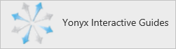

<properties
    pageTitle="Lernprogramm: Azure-Active Directory-Integration in interaktive Handbücher Yonyx | Microsoft Azure"
    description="Informationen Sie zum einmaligen Anmeldens zwischen Azure Active Directory und interaktive Handbücher Yonyx konfigurieren."
    services="active-directory"
    documentationCenter=""
    authors="jeevansd"
    manager="femila"
    editor=""/>

<tags
    ms.service="active-directory"
    ms.workload="identity"
    ms.tgt_pltfrm="na"
    ms.devlang="na"
    ms.topic="article"
    ms.date="10/26/2016"
    ms.author="jeedes"/>

# Lernprogramm: Azure-Active Directory-Integration in Yonyx interaktive Handbücher

Ziel dieses Lernprogramms ist es zu zeigen, wie Sie interaktive Handbücher Yonyx mit Azure Active Directory (Azure AD) integrieren.

Interaktive Handbücher Yonyx mit Azure AD Integration bietet Ihnen die folgenden Vorteile:

- Sie können in Azure AD steuern, wer auf Yonyx interaktive Handbücher zugreifen kann
- Sie können Ihre Benutzer automatisch auf Yonyx interaktive Handbücher (einmaliges Anmelden) angemeldete Abrufen mit ihren Azure AD-Konten aktivieren.
- Sie können Ihre Konten an einem zentralen Ort – im klassischen Azure-Portal verwalten.

Wenn Sie weitere Details zu SaaS app-Integration in Azure AD-wissen möchten, finden Sie unter [Was ist Zugriff auf die Anwendung und einmaliges Anmelden mit Azure Active Directory](active-directory-appssoaccess-whatis.md).

## Erforderliche Komponenten

Zum Konfigurieren von Azure AD-Integration mit Yonyx interaktive Handbücher, benötigen Sie die folgenden Elemente:

- Ein Azure AD-Abonnement
- Interaktive Handbücher Yonyx einmalige Anmeldung aktiviert Abonnements

> [AZURE.NOTE] Wenn Sie um die Schritte in diesem Lernprogramm zu testen, empfehlen wir nicht mit einer Umgebung für die Herstellung.

Führen Sie zum Testen der Schritte in diesem Lernprogramm Tips:

- Sie sollten Ihre Umgebung Herstellung nicht verwenden, es sei denn, dies erforderlich ist.
- Wenn Sie eine Testversion Azure AD-Umgebung besitzen, können Sie eine einen Monat zum Testen [hier](https://azure.microsoft.com/pricing/free-trial/)erhalten.

## Szenario Beschreibung
Ziel dieses Lernprogramms ist, sodass Sie in einer Umgebung für Azure AD-einmaligen Anmeldens testen können.

In diesem Lernprogramm beschriebenen Szenario besteht aus zwei Hauptfenster Bausteine:

1. Interaktive Handbücher Yonyx aus dem Katalog hinzufügen
2. Konfigurieren und Testen Azure AD einmaliges Anmelden

## Interaktive Handbücher Yonyx aus dem Katalog hinzufügen
Zum Konfigurieren der Integration von Yonyx interaktive Handbücher in Azure AD müssen Sie interaktive Handbücher Yonyx zu Ihrer Liste der verwalteten SaaS apps aus dem Katalog hinzuzufügen.

**Um interaktive Handbücher Yonyx aus dem Katalog hinzufügen möchten, führen Sie die folgenden Schritte aus:**

1. Klicken Sie im **Azure klassischen Portal**auf der linken Navigationsbereich auf **Active Directory**. 

    ![Active Directory][1]

2. Wählen Sie aus der Liste **Verzeichnis** Verzeichnis für das Sie Verzeichnisintegration aktivieren möchten.

3. Klicken Sie zum Öffnen der Anwendungsansicht in der Verzeichnisansicht im oberen Menü auf **Applications** .
    
    ![Applikationen][2]

4. Klicken Sie auf **Hinzufügen** , am unteren Rand der Seite.
    
    ![Applikationen][3]

5. Klicken Sie im Dialogfeld **Was möchten Sie tun** klicken Sie auf **eine Anwendung aus dem Katalog hinzufügen**.

    ![Applikationen][4]

6. Geben Sie im Suchfeld **Yonyx interaktive Handbücher**aus.

    

7. Wählen Sie im Ergebnisfeld **Interaktive Handbücher Yonyx aus**und dann auf **abgeschlossen** , um die Anwendung hinzuzufügen.

    

##  Konfigurieren und Testen Azure AD einmaliges Anmelden
Das Ziel der in diesem Abschnitt ist erläutert, wie Sie konfigurieren und Testen der Azure AD-einmaliges Anmelden mit Yonyx interaktive Handbücher basierend auf einen Testbenutzer "Britta Simon" bezeichnet.

Für einmaliges Anmelden entwickelt muss Azure AD wissen, was der Benutzer Gegenstück Yonyx interaktive Handbücher für einen Benutzer in Azure AD ist. Kurzum, muss eine Link Beziehung zwischen einem Azure AD-Benutzer und dem entsprechenden Benutzer in interaktive Handbücher Yonyx eingerichtet werden.

Dieser Link Beziehung wird hergestellt, indem Sie den Wert des **Benutzernamens** in Azure AD als der Wert für den **Benutzernamen** in interaktive Handbücher Yonyx zuweisen.

Zum Konfigurieren und Azure AD-einmaliges Anmelden mit Yonyx interaktive Handbücher testen, müssen Sie die folgenden Bausteine durchführen:

1. **[Konfigurieren von Azure AD einmaligen Anmeldens](#configuring-azure-ad-single-single-sign-on)** - damit Ihre Benutzer dieses Feature verwenden können.
2. **[Erstellen einer Azure AD Benutzer testen](#creating-an-azure-ad-test-user)** : Azure AD-einmaliges Anmelden mit Britta Simon testen.
3. **[Erstellen einer Yonyx interaktive Handbücher Benutzer testen](#creating-a-yonyx-interactive-guides-test-user)** : ein Gegenstück von Britta Simon in interaktive Handbücher Yonyx haben, die in der Azure AD-Darstellung Ihrer verknüpft ist.
4. **[Testen Sie Benutzer zuweisen Azure AD](#assigning-the-azure-ad-test-user)** - Britta Simon mit Azure AD-einmaliges Anmelden aktivieren.
5. **[Testen der einmaligen Anmeldens](#testing-single-sign-on)** - zur Überprüfung, ob die Konfiguration funktioniert.

### Konfigurieren von Azure AD-einmaliges Anmelden

In diesem Abschnitt Azure AD-einmaliges Anmelden im klassischen Portal aktivieren und konfigurieren in Ihrer Anwendung Yonyx interaktive Handbücher einmaliges Anmelden.

**Führen Sie die folgenden Schritte aus, um Azure AD-einmaliges Anmelden mit interaktive Handbücher Yonyx konfigurieren:**

1. Im Portal klassischen auf der Seite **Yonyx interaktive Handbücher** Integration Anwendung klicken Sie auf **Konfigurieren einmaligen Anmeldens** zum Öffnen des Dialogfelds **Konfigurieren einmaliges Anmelden** .
     
    ![Konfigurieren Sie einmaliges Anmelden][6] 

2. Klicken Sie auf der Seite **Wie möchten Sie Benutzer bei der Yonyx interaktive Handbücher auf** **Azure AD einmaliges Anmelden**wählen Sie aus, und klicken Sie dann auf **Weiter**.
    
    

3. Führen Sie auf der Seite **Einstellungen für die App konfigurieren** Dialogfeld die folgenden Schritte aus, und klicken Sie auf **Weiter**:

    

    ein. Geben Sie in das Textfeld **Melden Sie sich auf URL** eine URL, die mit dem folgenden Muster: `https://<company name>.yonyx.com/y/conversation/?id=<guid number>`.

    b. Geben Sie in das Textfeld **Bezeichner** eine URL, die mit dem folgenden Muster: `https://<company name>.yonyx.com`.

    c. Klicken Sie auf **Weiter**

    > [AZURE.NOTE] Bitte beachten Sie, dass Sie diese Werte mit der tatsächlichen melden Sie sich auf URL und der Bezeichner aktualisiert haben. Um diese Werte zu erhalten, wenden Sie sich an Yonyx interaktive Handbücher Supportteam über <mailto:support@yonyx.com>.

4. Klicken Sie auf der Seite **Konfigurieren einmaliges Anmelden bei Yonyx interaktive Handbücher** klicken Sie auf **Zertifikat herunterladen** , und speichern Sie die Datei auf Ihrem Computer:

    

5. Abzurufenden SSO so konfiguriert, dass für die Anwendung, Kontakt, interaktive Yonyx-Führungslinien Team über unterstützen <mailto:support@yonyx.com> , und teilen Sie sie mit den folgenden:

    • Die heruntergeladene **Zertifikat**

    • Die **URL des Herausgebers**

    • Die **URL der Dienst für einmaliges Anmelden**

    • Die **einzelnen Abmeldung Dienst-URL**

6. Im Portal klassischen wählen Sie die Bestätigung Konfiguration für einzelne Zeichen, und klicken Sie dann auf **Weiter**.
    
    ![Azure AD einmaliges Anmelden][10]

7. Klicken Sie auf der Seite **Bestätigung für einzelne anmelden** auf **abgeschlossen**.  
    
    ![Azure AD einmaliges Anmelden][11]

### Erstellen eines Benutzers mit Azure AD-testen
Das Ziel der in diesem Abschnitt besteht im Erstellen eines Testbenutzers im klassischen Portal Britta Simon bezeichnet.

![Erstellen von Azure AD-Benutzer][20]

**Führen Sie die folgenden Schritte aus, um einen Testbenutzer in Azure AD zu erstellen:**

1. Klicken Sie im **Azure klassischen Portal**auf der linken Navigationsbereich auf **Active Directory**.

    

2. Wählen Sie aus der Liste **Verzeichnis** Verzeichnis für das Sie Verzeichnisintegration aktivieren möchten.

3. Wenn die Liste der Benutzer, klicken Sie im Menü oben anzeigen möchten, klicken Sie auf **Benutzer**.
    
    

4. Klicken Sie im Dialogfeld **Benutzer hinzufügen** um in der Symbolleiste auf der Unterseite öffnen, auf **Benutzer hinzufügen**.

    

5. Führen Sie auf der Seite **Teilen Sie uns zu diesem Benutzer** die folgenden Schritte aus:

    

    ein. Wählen Sie als Typ des Benutzers neuen Benutzer in Ihrer Organisation ein.

    b. Geben Sie den Benutzernamen **Textfeld** **BrittaSimon**ein.

    c. Klicken Sie auf **Weiter**.

6.  Klicken Sie auf der Seite **Benutzerprofil** Dialogfeld führen Sie die folgenden Schritte aus:
    
    

    ein. Geben Sie im Textfeld **Vorname** **Britta**aus.  

    b. Geben Sie im Textfeld **Nachname** **Simon**aus.

    c. Geben Sie im Textfeld **Anzeigename** **Britta Simon**aus.

    d. Wählen Sie in der Liste **Rolle** **Benutzer**aus.

    e. Klicken Sie auf **Weiter**.

7. Klicken Sie auf der Seite **erste temporäres Kennwort** auf **Erstellen**.
    
    

8. Klicken Sie auf der Seite **erste temporäres Kennwort** führen Sie die folgenden Schritte aus:
    
    

    ein. Notieren Sie den Wert für das **Neue Kennwort ein**.

    b. Klicken Sie auf **abgeschlossen**.   

### Erstellen eines Testbenutzers interaktive Handbücher Yonyx

Das Ziel der in diesem Abschnitt ist zum Erstellen eines Benutzers Britta Simon in interaktive Handbücher Yonyx bezeichnet. Interaktive Handbücher Yonyx unterstützt in-Time-Bereitstellung, welche ist standardmäßig aktiviert.

Keine für Sie in diesem Abschnitt Aktionselement ist vorhanden. Bei dem Versuch, Adobe kreative Cloud zugreifen, wenn er noch nicht vorhanden ist, wird ein neuer Benutzer erstellt werden.

> [AZURE.NOTE] Wenn Sie einen Benutzer manuell zu erstellen müssen, müssen Sie die interaktive Handbücher Yonyx Supportteam über <mailto:support@yonyx.com>.

### Zuweisen des Azure AD-Test-Benutzers

Das Ziel der in diesem Abschnitt ist für die Aktivierung der Britta Simon Azure einmaliges Anmelden verwenden, indem Sie keinen Zugriff auf Yonyx interaktive Handbücher erteilen.
    
![Benutzer zuweisen][200]

**Um interaktive Handbücher Yonyx Britta Simon zuzuweisen, führen Sie die folgenden Schritte aus:**

1. Klicken Sie im Portal klassischen zum Öffnen der Anwendungsansicht in der Verzeichnisansicht klicken Sie auf **Applikationen** im oberen Menü.
    
    ![Benutzer zuweisen][201]

2. Wählen Sie in der Liste Applications **Yonyx interaktive Handbücher**.
    
    

3. Klicken Sie auf **Benutzer**, klicken Sie im Menü oben.
    
    ![Benutzer zuweisen][203]

4. Wählen Sie in der Liste Benutzer **Britta Simon**aus.

5. Klicken Sie unten auf der Symbolleiste auf **zuweisen**.
    
    ![Benutzer zuweisen][205]

### Testen einmaliges Anmelden

Das Ziel der in diesem Abschnitt ist zum Azure AD-einzelne anmelden Überprüfen der Konfiguration mithilfe des Bedienfelds Access.
 
Wenn Sie die Kachel Yonyx interaktive Handbücher im Bereich Access klicken, Sie sollten automatisch an Ihrer Anwendung Yonyx interaktive Handbücher angemeldete abrufen.

## Zusätzliche Ressourcen

* [Liste der zum Integrieren SaaS-Apps mit Azure-Active Directory-Lernprogramme](active-directory-saas-tutorial-list.md)
* [Was ist die Anwendungszugriff und einmaliges Anmelden mit Azure Active Directory?](active-directory-appssoaccess-whatis.md)

<!--Image references-->

[1]: ./media/active-directory-saas-yonyx-tutorial/tutorial_general_01.png
[2]: ./media/active-directory-saas-yonyx-tutorial/tutorial_general_02.png
[3]: ./media/active-directory-saas-yonyx-tutorial/tutorial_general_03.png
[4]: ./media/active-directory-saas-yonyx-tutorial/tutorial_general_04.png

[6]: ./media/active-directory-saas-yonyx-tutorial/tutorial_general_05.png
[10]: ./media/active-directory-saas-yonyx-tutorial/tutorial_general_06.png
[11]: ./media/active-directory-saas-yonyx-tutorial/tutorial_general_07.png
[20]: ./media/active-directory-saas-yonyx-tutorial/tutorial_general_100.png

[200]: ./media/active-directory-saas-yonyx-tutorial/tutorial_general_200.png
[201]: ./media/active-directory-saas-yonyx-tutorial/tutorial_general_201.png
[203]: ./media/active-directory-saas-yonyx-tutorial/tutorial_general_203.png
[204]: ./media/active-directory-saas-yonyx-tutorial/tutorial_general_204.png
[205]: ./media/active-directory-saas-yonyx-tutorial/tutorial_general_205.png
