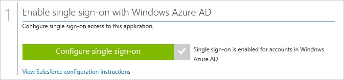

<properties
    pageTitle="Zum Verwalten der Föderation Zertifikate in Azure AD | Microsoft Azure"
    description="Erfahren Sie, wie Sie das Ablaufdatum für Ihre Zertifikate Föderation anpassen und So erneuern Sie Zertifikate, die bald abläuft."
    services="active-directory"
    documentationCenter=""
    authors="asmalser-msft"
    manager="femila"
    editor=""/>

<tags
    ms.service="active-directory"
    ms.workload="identity"
    ms.tgt_pltfrm="na"
    ms.devlang="na"
    ms.topic="article"
    ms.date="02/09/2016"
    ms.author="asmalser-msft"/>

#Verwalten von Zertifikaten für Partnerverbundkontakte einmaliges Anmelden in Azure-Active Directory

Dieser Artikel behandelt das häufige gestellte Fragen im Zusammenhang mit der Zertifikate, die Azure Active Directory erstellt werden, um den Clientanwendungen SaaS partnerverbundkontakte einmaliges Anmelden (SSO) herstellen.

In diesem Artikel wird nur für die apps, die zum **Azure AD einmaliges Anmelden**, verwenden Sie konfiguriert werden, wie im folgenden Beispiel gezeigt:

##So passen Sie das Ablaufdatum für das Zertifikat Föderation

Standardmäßig sind Zertifikate nach zwei Jahren abläuft festgelegt. Sie können ein anderes Ablaufdatum für das Zertifikat auswählen, indem Sie die nachstehenden Schritte durchführen. Verwenden Sie die darin enthaltenen Screenshots Vertrieb aus Gründen der Beispiel, jedoch Schritte auf eine beliebige partnerverbundkontakte SaaS app anwenden können.

1. Klicken Sie in Azure Active Directory auf der Seite Schnellstart für eine Anwendung, klicken Sie auf **Konfigurieren einmaliges Anmelden**.

    

2. Wählen Sie **Azure AD einmaliges Anmelden**aus, und klicken Sie dann auf **Weiter**.

3. Geben Sie in der **Anmeldung URL** der Anwendung, und aktivieren Sie das Kontrollkästchen für das **Konfigurieren des Zertifikats für partnerverbundkontakte einmaliges Anmelden verwendet**. Klicken Sie dann auf **Weiter**.

    

4. Klicken Sie auf der nächsten Seite Wählen Sie **generieren ein neues Zertifikat**aus, und wählen Sie aus, wie lange das Zertifikat für gültig sein soll. Klicken Sie dann auf **Weiter**.

    

5. Klicken Sie auf Weiter, klicken Sie auf **Zertifikat herunterladen**. Klicken Sie auf **Ansicht Konfiguration Anweisungen**, um weitere Informationen zum Hochladen des Zertifikats zu Ihrer bestimmten SaaS-Anwendung.

    

6. Das Zertifikat wird nicht aktiviert sein, bis Sie aktivieren Sie das Kontrollkästchen zur Bestätigung am unteren Rand des Dialogfelds, und klicken Sie dann auf Freigabe.

##So erneuern Sie ein Zertifikat, das bald abläuft

Im unten gezeigten Erneuerung Schritte sollte idealerweise keine erheblichen Ausfallzeiten für Ihre Benutzer führen. Die Screenshots in diesem Abschnitt Feature Vertrieb als Beispiel, jedoch folgendermaßen verwendet können auf eine beliebige app, partnerverbundkontakte SaaS anwenden.

1. Klicken Sie in Azure Active Directory auf der Seite Schnellstart für eine Anwendung, klicken Sie auf **Konfigurieren einmaliges Anmelden**.

    

2. Klicken Sie auf der ersten Seite des Dialogfelds **Azure AD einmaliges Anmelden** bereits sollten ausgewählt haben, klicken Sie auf **Weiter**.

3. Klicken Sie auf der zweiten Seite aktivieren Sie das Kontrollkästchen für **konfigurieren das Zertifikat für partnerverbundkontakte einmaliges Anmelden**. Klicken Sie dann auf **Weiter**.

    

4. Klicken Sie auf der nächsten Seite Wählen Sie **generieren ein neues Zertifikat**aus, und wählen Sie aus, wie lange Sie das neue Zertifikat für gültig sein soll. Klicken Sie dann auf **Weiter**.

    

5. Klicken Sie auf **Zertifikat herunterladen**. Um erfolgreich Rewnew Ihr Zertifikat, müssen Sie ausführen, die folgenden beiden Schritte:

    - Hochladen Sie das neue Zertifikat auf der SaaS-app anmelden Konfiguration einzelner Bildschirm. Informationen dazu für Ihre bestimmten SaaS-app, klicken Sie auf **Ansicht Konfiguration Anweisungen**.

    - Aktivieren Sie in Azure AD das Kontrollkästchen zur Bestätigung am unteren Rand des Dialogfelds aktivieren Sie das neue Zertifikat, und klicken Sie dann auf **Weiter** zu übermitteln.

    > [AZURE.IMPORTANT] Einmaliges Anmelden bei der app wird deaktiviert im Moment entweder eine der folgenden beiden Schritten abgeschlossen ist, aber es wird wieder aktiviert werden, sobald der zweite Schritt abgeschlossen ist. Daher, um Ausfallzeiten zu minimieren, wenden Sie sich bitte bereiten Sie beide Schritte innerhalb einer kurzen Zeitspanne voneinander zufriedenzustellen.

    

## Verwandte Artikel

- [Artikel Index für Anwendungsverwaltung in Azure-Active Directory](active-directory-apps-index.md)
- [Zugriff auf die Anwendung und einmaliges Anmelden mit Azure Active Directory](active-directory-appssoaccess-whatis.md)
- [Behandeln von SAML-basierten einmaliges Anmelden](active-directory-saml-debugging.md)
