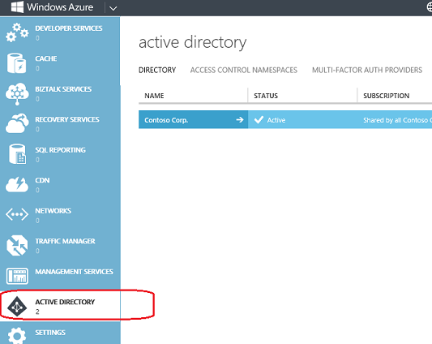

<properties
   pageTitle="Problembehandlung: Die 'Active Directory' Element ist nicht verfügbar oder falsch konfiguriert | Microsoft Azure "
   description="Was zu tun ist, wenn im Verwaltungsportal Azure Active Directory-Menüelement angezeigt wird."
   services="active-directory"
   documentationCenter="na"
   authors="bryanla"
   manager="mbaldwin"
   editor=""/>

<tags
   ms.service="active-directory"
   ms.devlang="na"
   ms.topic="article"
   ms.tgt_pltfrm="na"
   ms.workload="identity"
   ms.date="09/16/2016"
   ms.author="mbaldwin"/>

# Problembehandlung: 'Active Directory' Element ist, fehlt oder ist nicht verfügbar

Viele der Anweisungen zur Verwendung von Azure Active Directory-Features und Dienste beginnen mit "Wechseln Sie zu der Azure-Verwaltungsportal, und klicken Sie auf **Active Directory**." Doch was Sie tun, wenn die Active Directory-Erweiterung oder Menüelement nicht angezeigt wird oder wenn es **Nicht zur Verfügung**steht? In diesem Thema soll helfen. Es werden der Bedingung unter denen **Active Directory** nicht angezeigt werden oder nicht verfügbar ist, und erläutert, wie Sie fortfahren.

## Active Directory fehlt.

In der Regel wird ein **Active Directory** -Element im linken Navigationsmenü ein. Die Anweisungen im Azure Active Directory Verfahren wird davon ausgegangen, dass dieses Element in der Ansicht ist.

Das Active Directory-Element wird im linken Navigationsmenü angezeigt, wenn eine der folgenden Bedingungen den Wert true. Andernfalls wird das Element nicht angezeigt.

* Der aktuelle Benutzer angemeldet mit einem Microsoft-Konto (vormals als Windows Live ID bezeichnet) ab.

    ODER

* Azure-Mandanten wurde ein Verzeichnis und das aktuelle Konto ist ein Verzeichnisadministrator.

    ODER

* Der Azure Mandanten enthält mindestens einen Namespace mit Azure AD-Access-Steuerelements (ACS). Weitere Informationen finden Sie unter [Access Steuerelement Namespace](https://msdn.microsoft.com/library/azure/gg185908.aspx).

    ODER

* Der Azure Mandanten enthält mindestens eine Azure kombinierte Authentifizierung Anbieter. Weitere Informationen finden Sie unter [Verwalten von Azure mehrstufige Authentifizierungsanbieter](../multi-factor-authentication/multi-factor-authentication-get-started-cloud.md).

Klicken Sie zum Erstellen einer Access-Steuerelements Namespace oder eine kombinierte Authentifizierung Anbieter auf **+ neue** > **App Services** > **Active Directory**.

Um Administratorrechte verfügen, um ein Verzeichnis zu erhalten, müssen Sie Administrator eine Administratorrolle bei Ihrem Konto zuweisen. Weitere Informationen finden Sie unter [Zuweisen von Administratorrollen](active-directory-assign-admin-roles.md).

## Active Directory ist nicht verfügbar

Beim Klicken auf **+ neue** > **App Services**, ein **Active Directory** -Element angezeigt wird. Insbesondere wird das Active Directory-Element angezeigt, wenn die Active Directory-Features, wie Directory, Access Control oder kombinierte Authentifizierung Anbieter, für den aktuellen Benutzer verfügbar sind.

Jedoch, während die Seite geladen wird, das Element abgeblendet ist und gekennzeichnet ist **Nicht verfügbar**. Dies ist eine temporäre Zustand. Wenn Sie ein paar Sekunden warten, wird das Element verfügbar. Wenn die Verzögerung verlängert wird, behebt der Webseite häufig Aktualisieren des Problems.

