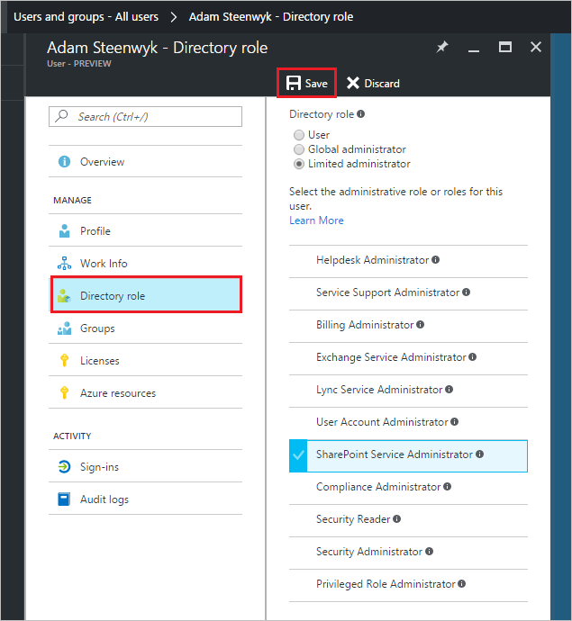

<properties
    pageTitle="Zuweisen eines Benutzers zu Administratorrollen in Azure Active Directory-Vorschau | Microsoft Azure"
    description="Erläutert, wie Sie in Azure Active Directory administrative Benutzerinformationen zu ändern"
    services="active-directory"
    documentationCenter=""
    authors="curtand"
    manager="femila"
    editor=""/>

<tags
    ms.service="active-directory"
    ms.workload="identity"
    ms.tgt_pltfrm="na"
    ms.devlang="na"
    ms.topic="article"
    ms.date="09/12/2016"
    ms.author="curtand"/>

# Zuweisen eines Benutzers zu Administratorrollen in Azure Active Directory-Vorschau

In diesem Artikel wird erläutert, wie Sie einem Benutzer in der Vorschau Azure Active Directory (Azure AD) eine Administratorrolle zuweisen. [Was ist in der Vorschau?](active-directory-preview-explainer.md) Informationen zum Hinzufügen neuer Benutzer in Ihrer Organisation finden Sie unter [Hinzufügen von neuen Benutzern zur Azure Active Directory](active-directory-users-create-azure-portal.md). Hinzugefügte Benutzer nicht standardmäßig über Administratorberechtigungen verfügen, jedoch können Sie Rollen zu einem beliebigen Zeitpunkt zu zuweisen.

## Zuweisen einer Rolle zu einem Benutzer

1.  Melden Sie sich mit dem [Azure-Portal](https://portal.azure.com) mit einem Konto, eines globalen Administrators für das Verzeichnis ist.

2.  Wählen Sie **Weitere Dienste**aus, geben Sie **Benutzer und Gruppen** in das Textfeld ein, und wählen Sie dann die **EINGABETASTE**.

    

3.  Wählen Sie **alle Benutzer**auf das Blade **Benutzer und Gruppen** .

    

4. Klicken Sie auf das Blade **Benutzer und Gruppen - alle Benutzer** wählen Sie einen Benutzer aus der Liste aus.

5. Wählen Sie in der Blade für den ausgewählten Benutzer **Directory Rolle**aus, und weisen Sie den Benutzer zu einer Rolle aus der Liste **Verzeichnis Rolle zu** . Weitere Informationen zu Rollen für Benutzer und Administrator finden Sie unter [Zuweisen von Administratorrollen in Azure Active Directory](active-directory-assign-admin-roles.md).

      

6. Wählen Sie **Speichern**aus.

## Nächste Schritte

- [Hinzufügen eines Benutzers](active-directory-users-create-azure-portal.md)
- [Zurücksetzen eines Benutzerkennworts im neuen Azure-Portal](active-directory-users-reset-password-azure-portal.md)
- [Informationen zur Arbeit eines Benutzers ändern](active-directory-users-work-info-azure-portal.md)
- [Verwalten von Benutzerprofilen](active-directory-users-profile-azure-portal.md)
- [Löschen eines Benutzers in Ihrer Azure Active Directory](active-directory-users-delete-user-azure-portal.md)
