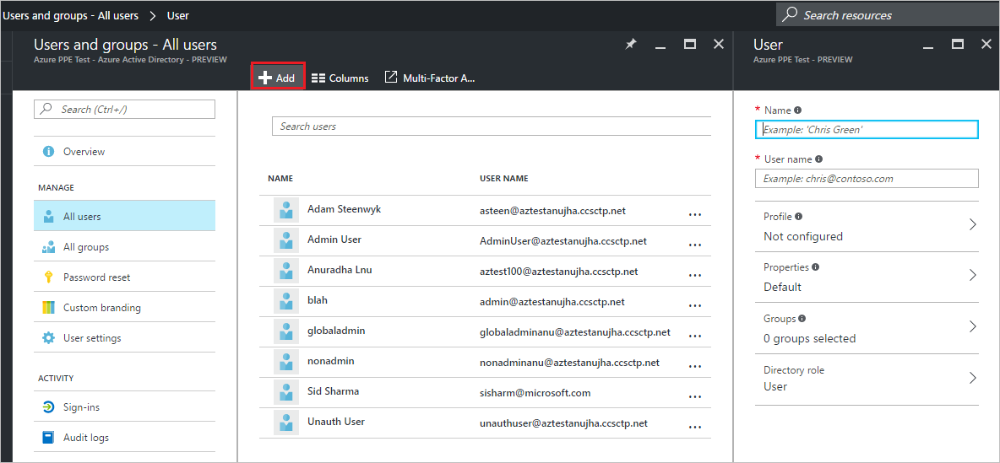

<properties
    pageTitle="Hinzufügen neuer Benutzer zur Azure-Active Directory-Vorschau | Microsoft Azure"
    description="Erläutert, wie Sie neue Benutzer hinzufügen oder Ändern von Benutzerinformationen in Azure Active Directory."
    services="active-directory"
    documentationCenter=""
    authors="curtand"
    manager="femila"
    editor=""/>

<tags
    ms.service="active-directory"
    ms.workload="identity"
    ms.tgt_pltfrm="na"
    ms.devlang="na"
    ms.topic="article"
    ms.date="09/12/2016"
    ms.author="curtand"/>

# Fügen Sie neuer Benutzer zur Azure-Active Directory-Vorschau hinzu

> [AZURE.SELECTOR]
- [Azure-portal](active-directory-users-create-azure-portal.md)
- [Azure klassischen-portal](active-directory-create-users.md)

In diesem Artikel wird erläutert, wie das Hinzufügen neuer Benutzer in Ihrer Organisation in der Vorschau Azure Active Direstory (Azure AD). [Was ist in der Vorschau?](active-directory-preview-explainer.md)

1.  Melden Sie sich mit dem [Azure-Portal](https://portal.azure.com) mit einem Konto, eines globalen Administrators für das Verzeichnis ist.

2.  Wählen Sie **Weitere Dienste**aus, geben Sie **Benutzer und Gruppen** in das Textfeld ein, und wählen Sie dann die **EINGABETASTE**.

    

3.  Klicken Sie auf das Blade **Benutzer und Gruppen** wählen Sie **alle Benutzer**aus, und wählen Sie dann auf **Hinzufügen**.

    

4.  Geben Sie die Details für den Benutzer, wie z. B. **und **Benutzernamen**** ein. Der Domain Namensteil des Benutzernamens muss entweder die ursprüngliche Domäne Name "foo.onmicrosoft.com" Standarddomänennamen oder überprüft, nicht Partnersuche Domänennamen "contoso.com".

5. Kopieren Sie oder andernfalls Beachten Sie das generierten Benutzerkennwort, dass Sie es für den Benutzer bereitstellen können, nachdem dieser Vorgang abgeschlossen ist.

6. Optional können Sie öffnen, und füllen Sie die Informationen in das Blade **Profil** , das Blade **Gruppen** oder das **Directory Rolle** Blade für den Benutzer. Weitere Informationen zu Rollen für Benutzer und Administrator finden Sie unter [Zuweisen von Administratorrollen in Azure Active Directory](active-directory-assign-admin-roles.md).

7.  Wählen Sie auf der Blade **Benutzer** **Erstellen**aus.

8. Sichere Verteilung generierte Kennwort an den neuen Benutzer an, damit der Benutzer sich anmelden kann.

## Nächste Schritte

- [Hinzufügen eines externen Benutzers](active-directory-users-create-external-azure-portal.md)
- [Zurücksetzen eines Benutzerkennworts im neuen Azure-Portal](active-directory-users-reset-password-azure-portal.md)
- [Informationen zur Arbeit eines Benutzers ändern](active-directory-users-work-info-azure-portal.md)
- [Verwalten von Benutzerprofilen](active-directory-users-profile-azure-portal.md)
- [Löschen eines Benutzers in Ihrer Azure Active Directory](active-directory-users-delete-user-azure-portal.md)
- [Einen Benutzer in Ihrer Azure Active Directory eine Rolle zuweisen](active-directory-users-assign-role-azure-portal.md)
