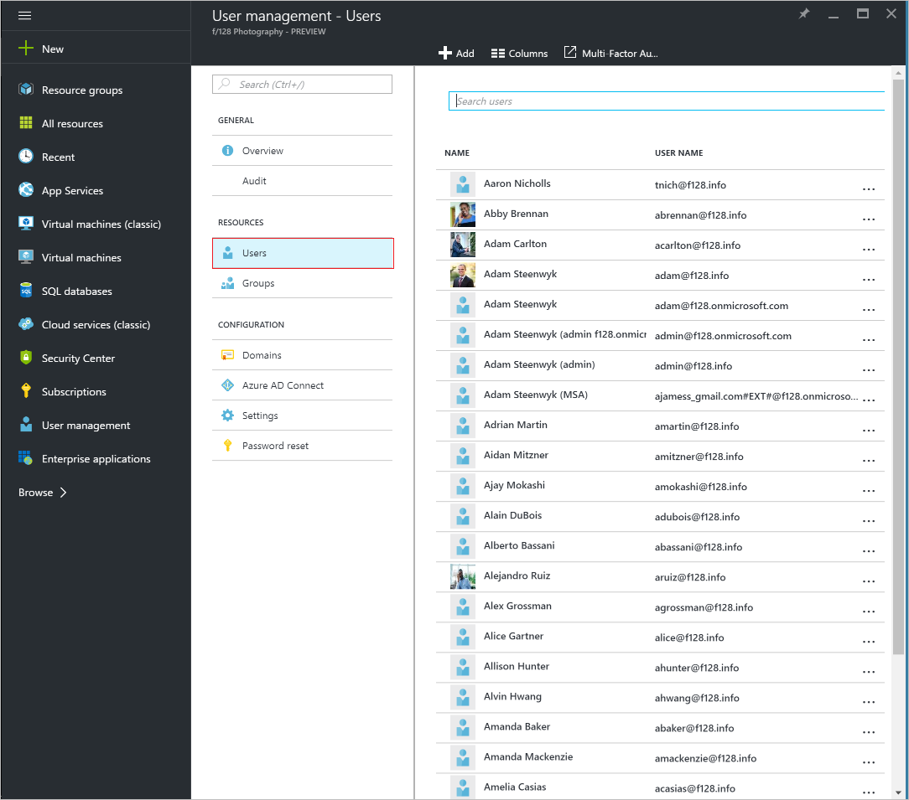

<properties
    pageTitle="Löschen eines Benutzers aus einem Verzeichnis in Azure Active Directory-Vorschau | Microsoft Azure"
    description="Erläutert, wie Sie einem Benutzer und alle zugehörigen Informationen aus Azure Active Directory löschen"
    services="active-directory"
    documentationCenter=""
    authors="curtand"
    manager="femila"
    editor=""/>

<tags
    ms.service="active-directory"
    ms.workload="identity"
    ms.tgt_pltfrm="na"
    ms.devlang="na"
    ms.topic="article"
    ms.date="09/12/2016"
    ms.author="curtand"/>

# Löschen eines Benutzers aus einem Verzeichnis in Azure Active Directory-Vorschau

In diesem Artikel wird erläutert, wie das Löschen eines Benutzers aus einem Verzeichnis in der Vorschau Azure Active Directory (Azure AD). [Was ist in der Vorschau?](active-directory-preview-explainer.md) Informationen zum Hinzufügen neuer Benutzer in Ihrer Organisation finden Sie unter [Hinzufügen von neuen Benutzern zur Azure Active Directory](active-directory-users-create-azure-portal.md).

## Löschen eines Benutzers

1.  Melden Sie sich mit dem [Azure-Portal](https://portal.azure.com) mit einem Konto, eines globalen Administrators für das Verzeichnis ist.

2.  Wählen Sie **Weitere Dienste**aus, geben Sie **Benutzer und Gruppen** in das Textfeld ein, und wählen Sie dann die **EINGABETASTE**.

    

3.  Aktivieren Sie das Blade **Benutzer und Gruppen** klicken Sie auf **Benutzer**aus.

    

4. Klicken Sie auf **Benutzer und Gruppen - Benutzer** -Blade wählen Sie einen Benutzer aus der Liste aus.

5. Klicken Sie auf das Blade für den ausgewählten Benutzer wählen Sie **Übersicht**, und wählen Sie dann in der Befehlsleiste **Löschen**.

    

## Nächste Schritte

- [Hinzufügen eines Benutzers](active-directory-users-create-azure-portal.md)
- [Zurücksetzen eines Benutzerkennworts im neuen Azure-Portal](active-directory-users-reset-password-azure-portal.md)
- [Einen Benutzer in Ihrer Azure Active Directory eine Rolle zuweisen](active-directory-users-assign-role-azure-portal.md)
- [Informationen zur Arbeit eines Benutzers ändern](active-directory-users-work-info-azure-portal.md)
- [Verwalten von Benutzerprofilen](active-directory-users-profile-azure-portal.md)
