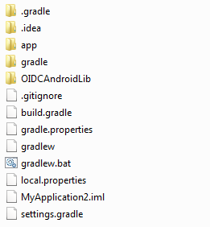

<properties
    pageTitle="Azure-Active Directory-Version 2.0 Android app | Microsoft Azure"
    description="So erstellen Sie eine Android-app, die in der Benutzer mit persönlichen Microsoft-Konto und Arbeit oder Schule Konten und Anrufe der Graph-API signiert Drittanbieter-Bibliotheken mit."
    services="active-directory"
    documentationCenter=""
    authors="brandwe"
    manager="mbaldwin"
    editor=""/>

<tags
    ms.service="active-directory"
    ms.workload="identity"
    ms.tgt_pltfrm="na"
    ms.devlang="na"
    ms.topic="article"
    ms.date="09/16/2016"
    ms.author="brandwe"/>

#  <a name="add-sign-in-to-an-android-app-using-a-third-party-library-with-graph-api-using-the-v20-endpoint"></a>Anmeldung bei einer Android app mit einer Drittanbieter-Bibliothek mit Graph-API mit der Version 2.0-Endpunkt hinzufügen

Die Microsoft-Identitätsplattform verwendet offene Standards wie OAuth2 und OpenID verbinden. Jede Bibliothek können Entwickler, die sie aus mit unserer Dienste integriert werden soll. Damit werden Entwickler unserer Plattform mit anderen Bibliotheken verwenden, haben wir ein paar Vorgehensweisen wie diesen Termin, um zu veranschaulichen, wie Drittanbieter-Bibliotheken für die Verbindung zur Microsoft-Identitätsplattform konfigurieren geschrieben. Die meisten Bibliotheken, die [der Spezifikation RFC6749 OAuth2](https://tools.ietf.org/html/rfc6749) implementieren können mit der Microsoft-Identitätsplattform verbinden.

Mit der Anwendung, die diese exemplarische Vorgehensweise erstellt die, können Benutzer melden Sie sich bei ihrer Organisation und suchen Sie nach selbst in ihrer Organisation mithilfe der Graph-API.

Wenn Sie mit OAuth2 oder Verbinden OpenID vertraut sind, möglicherweise viele dieser Konfiguration Stichprobe nicht Ihnen sinnvoll. Es empfiehlt sich, dass Sie [2.0 Protokolle - OAuth 2.0 Autorisierung Code Datenfluss](active-directory-v2-protocols-oauth-code.md) finden Sie unter Hintergrund.

> [AZURE.NOTE] Einige Features von unserer Plattform, die einen Ausdruck in den Standards OAuth2 oder OpenID verbinden, wie bedingte Access und Intune Richtlinie Verwaltung verfügen erfordern Sie unseren Quelle öffnen Microsoft Azure Identität Bibliotheken verwenden.

Der Endpunkt Version 2.0 unterstützt nicht alle Azure Active Directory-Szenarien und Features.

> [AZURE.NOTE] Um festzustellen, ob den Version 2.0-Endpunkt verwendet werden sollen, erfahren Sie, [Version 2.0 Einschränkungen](active-directory-v2-limitations.md).


## <a name="download-the-code-from-github"></a>Laden Sie den Code aus GitHub
Der Code für dieses Lernprogramm wird [auf GitHub](https://github.com/Azure-Samples/active-directory-android-native-oidcandroidlib-v2)verwaltet.  Wenn Sie nachvollziehen möchten, können Sie Sie [Herunterladen des app Gerüst als eine ZIP](https://github.com/Azure-Samples/active-directory-android-native-oidcandroidlib-v2/archive/skeleton.zip) oder das Gerüst Klonen:

```
git clone --branch skeleton git@github.com:Azure-Samples/active-directory-android-native-oidcandroidlib-v2.git
```

Sie können auch einfach die Stichprobe herunterladen und sofort beginnen:

```
git@github.com:Azure-Samples/active-directory-android-native-oidcandroidlib-v2.git
```

## <a name="register-an-app"></a>Registrieren einer app
Erstellen Sie eine neue app bei der [Anwendung Registrierung Portal](https://apps.dev.microsoft.com/?referrer=https://azure.microsoft.com/documentation/articles&deeplink=/appList), oder führen Sie die detaillierten Schritte an, [wie eine app mit den Endpunkt Version 2.0 registrieren](active-directory-v2-app-registration.md).  Vergewissern Sie sich an:

- Kopieren Sie die **Id der Anwendung** , die zu Ihrer Anwendung zugeordnet ist, da Sie es bald benötigen.
- Fügen Sie die **Mobile** -Plattform für Ihre app hinzu.

> Hinweis: Das Anwendung Registrierung Portal bietet einen **Umleiten URI** -Wert. Allerdings in diesem Beispiel müssen, verwenden Sie den Standardwert `https://login.microsoftonline.com/common/oauth2/nativeclient`.


## <a name="download-the-nxoauth2-third-party-library-and-create-a-workspace"></a>Herunterladen der NXOAuth2 Drittanbieter-Bibliothek und Erstellen eines Arbeitsbereichs

Für diese exemplarische Vorgehensweise verwenden Sie die OIDCAndroidLib aus GitHub, also eine OAuth2 Bibliothek basierend auf dem Code OpenID Verbinden von Google. Das Profil systemeigene Anwendung implementiert, und den Endpunkt Autorisierung des Benutzers unterstützt. Dies sind alle Punkte, die Sie benötigen Microsoft Identität-Plattform integriert werden soll.

Klonen der Repo OIDCAndroidLib auf Ihren Computer an.

```
git@github.com:kalemontes/OIDCAndroidLib.git
```


## <a name="set-up-your-android-studio-environment"></a>Richten Sie Ihrer Android Studio-Umgebung ein

1. Erstellen eines neuen Projekts für Android Studio und akzeptieren Sie die Standardeinstellungen des Assistenten.

    

    

    

2. Verschieben Sie den duplizierten Repo zum Einrichten Ihrer Project Module an die Position des Projekts. Sie können auch das Projekt erstellen und Klonen Sie es direkt auf den Speicherort des Projekts.

    

3. Öffnen Sie die Einstellungen für Project Module mithilfe des Kontextmenüs oder mithilfe der Tastenkombination Strg + Alt + Maj + S.

    

4. Entfernen Sie das app-Standardmodul, da nur die Project Container Einstellungen werden sollen.

    

5. Importieren von Module aus den duplizierten Repo und dem aktuellen Projekt.

    
    

6. Wiederholen Sie diese Schritte für die `oidlib-sample` Modul.

7. Überprüfen Sie die Abhängigkeiten Oidclib auf die `oidlib-sample` Modul.

    

8. Warten auf Gradle synchronisieren, und klicken Sie auf **OK** .

    Ihre settings.gradle aussehen sollte:

    

9. Erstellen Sie die Beispiel-app, um sicherzustellen, dass das Beispiel ordnungsgemäß funktioniert.

    Kann werden nicht dies noch nicht mit Azure Active Directory verwendet. Wir müssen zunächst einige Endpunkte konfigurieren. Dies ist, um sicherzustellen, dass Sie kein Android Studio Probleme haben, bevor wir Anpassen der Stichprobe app starten.

10. Erstellen und ausführen `oidlib-sample` als Ziel in Android Studio.

    

11. Löschen der `app ` Verzeichnis, die beibehalten wurde, wenn Sie das Modul aus dem Projekt entfernt, da Android Studio für Sicherheit löschen nicht.

    

12. Öffnen Sie im Menü **Konfigurationen bearbeiten** , um die Konfiguration ausführen zu entfernen, die auch beibehalten wurde, wenn Sie das Modul aus dem Projekt entfernt.

    
    

## <a name="configure-the-endpoints-of-the-sample"></a>Konfigurieren Sie die Endpunkte des Beispiels

Nun Sie haben die `oidlib-sample` erfolgreich ausgeführt wird, lassen Sie uns einige Endpunkte, damit dies funktioniert mit Azure Active Directory bearbeiten.

### <a name="configure-your-client-by-editing-the-oidcclientconfxml-file"></a>Konfigurieren Sie Ihren Kunden durch Bearbeiten der Datei oidc_clientconf.xml

1. Da Sie nur für ein Token, und rufen die Graph-API OAuth2 Zahlungen verwenden, legen Sie den Client OAuth2 nur ausführen. OIDC wird in einem späteren Beispiel stammen.

    ```xml
        <bool name="oidc_oauth2only">true</bool>
    ```

2. Konfigurieren Sie Ihre Client-ID, die Sie von der Registrierung Portal erhalten haben.

    ```xml
        <string name="oidc_clientId">86172f9d-a1ae-4348-aafa-7b3e5d1b36f5</string>
        <string name="oidc_clientSecret"></string>
    ```

3. Konfigurieren der URI-Umleitung mit der folgenden.

    ```xml
        <string name="oidc_redirectUrl">https://login.microsoftonline.com/common/oauth2/nativeclient</string>
    ```

4. Konfigurieren Sie Ihren Bereichen, die Sie benötigen die Graph-API zugreifen.

    ```xml
        <string-array name="oidc_scopes">
            <item>openid</item>
            <item>https://graph.microsoft.com/User.Read</item>
            <item>offline_access</item>
        </string-array>
    ```

Die `User.Read` Wert in `oidc_scopes` können Sie dem grundlegenden Profil in Benutzer die signierte lesen.
Sie können über alle verfügbaren Bereiche in [Microsoft Graph Berechtigung Bereichen](https://graph.microsoft.io/docs/authorization/permission_scopes)informieren.

Wenn Sie erläuterungen zu wünschen `openid` oder `offline_access` als Bereiche in OpenID verbinden, finden Sie unter [2.0 Protokolle - OAuth 2.0 Autorisierung Code Datenfluss](active-directory-v2-protocols-oauth-code.md).

### <a name="configure-your-client-endpoints-by-editing-the-oidcendpointsxml-file"></a>Konfigurieren Sie Ihre Clientendpunkte durch Bearbeiten der Datei oidc_endpoints.xml

- Öffnen der `oidc_endpoints.xml` ' Datei ', und nehmen Sie die folgenden Änderungen vor:

    ```xml
    <!-- Stores OpenID Connect provider endpoints. -->
    <resources>
        <string name="op_authorizationEnpoint">https://login.microsoftonline.com/common/oauth2/v2.0/authorize</string>
        <string name="op_tokenEndpoint">https://login.microsoftonline.com/common/oauth2/v2.0/token</string>
        <string name="op_userInfoEndpoint">https://www.example.com/oauth2/userinfo</string>
        <string name="op_revocationEndpoint">https://www.example.com/oauth2/revoketoken</string>
    </resources>
    ```

Diese Grenzwerte sollten nie ändern, wenn Sie OAuth2 als Protokoll verwenden.

> [AZURE.NOTE]
Die Endpunkte für `userInfoEndpoint` und `revocationEndpoint` von Azure Active Directory derzeit nicht unterstützt. Wenn Sie diese mit den Standardwert Beispiel.com lassen, werden Sie daran erinnert, dass sie nicht verfügbar in der Stichprobe sind :-)


## <a name="configure-a-graph-api-call"></a>Konfigurieren eines Anrufs Graph-API

- Öffnen der `HomeActivity.java` ' Datei ', und nehmen Sie die folgenden Änderungen vor:

    ```Java
       //TODO: set your protected resource url
        private static final String protectedResUrl = "https://graph.microsoft.com/v1.0/me/";
    ```

Hier gibt ein einfacher Graph-API Anruf unsere Informationen an.

Dies sind alle Änderungen, die Sie ausführen müssen. Führen Sie die `oidlib-sample` Anwendung, und klicken Sie auf **Anmelden**.

Nachdem Sie erfolgreich authentifiziert haben, wählen Sie die **Geschützte Ressource anfordern** -Schaltfläche, um den Anruf an die Graph-API zu testen.

## <a name="get-security-updates-for-our-product"></a>Abrufen von Sicherheitsupdates für unser Produkt

Wir empfehlen Ihnen Benachrichtigungen zu Sicherheitsvorfälle erhalten, besuchen die [Sicherheits-TechCenter](https://technet.microsoft.com/security/dd252948) und Abonnieren von Ihren Sicherheitshinweisen.
