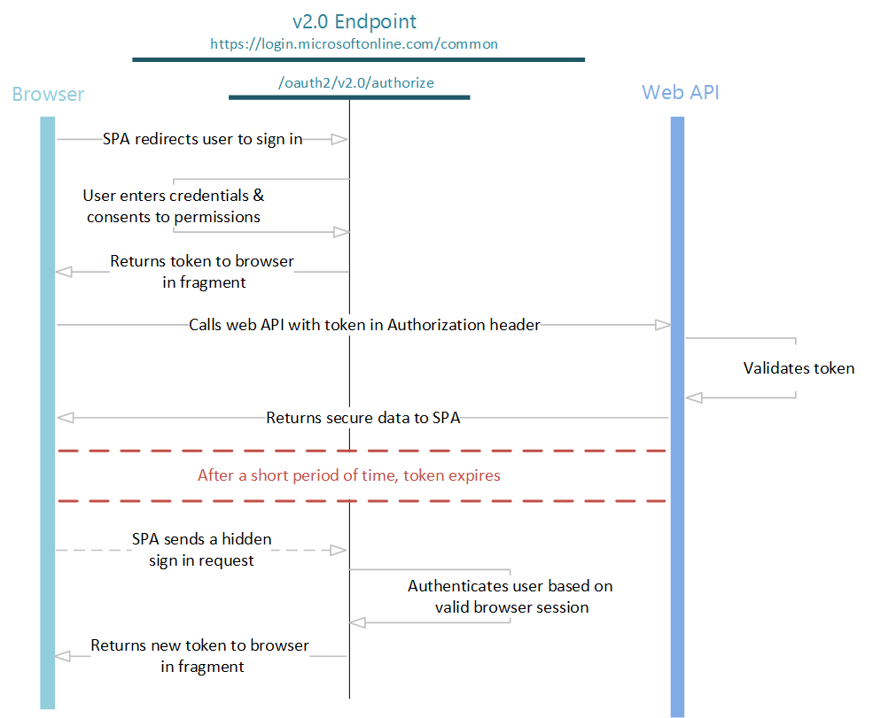

<properties
    pageTitle="Azure AD-Version 2.0 implizit Fluss | Microsoft Azure"
    description="Mithilfe von Azure AD-Version 2.0 Implementierung des Flusses implizit für einzelne Seite apps Baustein-Webanwendungen."
    services="active-directory"
    documentationCenter=""
    authors="dstrockis"
    manager="mbaldwin"
    editor=""/>

<tags
    ms.service="active-directory"
    ms.workload="identity"
    ms.tgt_pltfrm="na"
    ms.devlang="na"
    ms.topic="article"
    ms.date="09/16/2016"
    ms.author="dastrock"/>

# <a name="v20-protocols---spas-using-the-implicit-flow"></a>Version 2.0 Protokolle - SPAs mithilfe des Ablaufs implizit
Mit den Endpunkt Version 2.0 können Sie die Benutzer in Ihrer apps Einzelseite mit persönlichen und Arbeit/Schule Konten von Microsoft signieren.  Einzelseite und andere apps JavaScript ausführen, die hauptsächlich in einem Browser Smiley wenige interessante fordert, wenn es um Authentifizierung geht:

- Die Sicherheitseigenschaften dieser Apps sind unterscheidet sich deutlich von einer herkömmlichen serverbasierten Webanwendungen.
- Viele Autorisierung Servers und Identitätsanbieter unterstützt CORS Besprechungsanfragen nicht.
- Ganze Seite Browser leitet nicht an die app besonders Konflikte auftreten, zu der der Benutzeroberfläche machen.

In diesem Bereich (denken: AngularJS, Ember.js, React.js, usw.) Azure AD unterstützt illustrieren OAuth 2.0 implizit erteilen.  Implizite illustrieren ist in der [OAuth 2.0-Spezifikation](http://tools.ietf.org/html/rfc6749#section-4.2)beschrieben.  Seine primäre Vorteil besteht darin, dass sie die app Token aus Azure AD abgerufen werden ohne Durchführung eines Back-End-Servers Anmeldeinformationen Exchange zulässt.  Dadurch wird die app der Benutzer anmelden, Sitzung beibehalten und Token anderen Web-APIs alle im Client-JavaScript-Code abrufen.  Es gibt ein paar wichtige Sicherheitsaspekte zu berücksichtigen, wenn implizit illustrieren - speziell um [Client](http://tools.ietf.org/html/rfc6749#section-10.3) und [Benutzeridentitätswechsel](http://tools.ietf.org/html/rfc6749#section-10.3)verwenden.

Wenn Sie mithilfe der implizit Fluss und Azure AD-Authentifizierung zu Ihrer Anwendung JavaScript hinzufügen möchten, wird empfohlen, dass Sie unsere open Source JavaScript-Bibliothek [adal.js](https://github.com/AzureAD/azure-activedirectory-library-for-js)verwenden.  Es gibt einige AngularJS Lernprogramme verfügbar [hier](active-directory-appmodel-v2-overview.md#getting-started) Ihnen beim Einstieg helfen.  

Wenn Sie lieber nicht zu eine Bibliothek in Ihrer app Einzelseite verwenden und Protokollnachrichten zu senden, führen Sie jedoch die folgenden allgemeinen Schritte aus.

> [AZURE.NOTE]
    Nicht alle Azure Active Directory-Szenarien und Features werden von den Endpunkt Version 2.0 unterstützt.  Um festzustellen, ob den Version 2.0-Endpunkt verwendet werden sollen, erfahren Sie, [Version 2.0 Einschränkungen](active-directory-v2-limitations.md).
    
## <a name="protocol-diagram"></a>Protokoll-Diagramm
Der gesamte implizit Anmeldung Fluss sieht ungefähr wie folgt aus: einzelnen Schritte sind im folgenden ausführlich beschrieben.



## <a name="send-the-sign-in-request"></a>Senden Sie die Anfrage Anmeldung

Um die Benutzer zunächst in der app abzumelden, können Sie eine [OpenID verbinden](active-directory-v2-protocols-oidc.md) Autorisierung Anforderung senden und erhalten einer `id_token` aus den Endpunkt Version 2.0:

```
// Line breaks for legibility only

https://login.microsoftonline.com/{tenant}/oauth2/v2.0/authorize?
client_id=6731de76-14a6-49ae-97bc-6eba6914391e
&response_type=id_token+token
&redirect_uri=http%3A%2F%2Flocalhost%2Fmyapp%2F
&scope=openid%20https%3A%2F%2Fgraph.microsoft.com%2Fmail.read
&response_mode=fragment
&state=12345
&nonce=678910
```

> [AZURE.TIP] Klicken Sie auf den Link unten, um diese Anforderung ausführen! Nach der Anmeldung, sollte in Ihrem Browser umgeleitet werden `https://localhost/myapp/` mit einem `id_token` in der Adressleiste.
    <a href="https://login.microsoftonline.com/common/oauth2/v2.0/authorize?client_id=6731de76-14a6-49ae-97bc-6eba6914391e&response_type=id_token+token&redirect_uri=http%3A%2F%2Flocalhost%2Fmyapp%2F&scope=openid%20https%3A%2F%2Fgraph.microsoft.com%2Fmail.read&response_mode=fragment&state=12345&nonce=678910" target="_blank">https://Login.microsoftonline.com/Common/oauth2/v2.0/Authorize...</a>

| Parameter | | Beschreibung |
| ----------------------- | ------------------------------- | --------------- |
| Mandanten | Erforderlich | Die `{tenant}` Wert in den Pfad der Anforderung zum Steuern, wer bei der Anwendung anmelden kann verwendet werden kann.  Die zulässigen Werte sind `common`, `organizations`, `consumers`, und Mandanten Bezeichnern.  Weitere Details finden Sie unter [Grundlagen Protokoll](active-directory-v2-protocols.md#endpoints). |
| client_id | Erforderlich | Die Anwendung-Id, dass das Registrierung-Portal ([apps.dev.microsoft.com](https://apps.dev.microsoft.com/?referrer=https://azure.microsoft.com/documentation/articles&deeplink=/appList)) Ihre app zugewiesen. |
| response_type | Erforderlich | Darf enthalten `id_token` für OpenID verbinden Anmeldung.  Es kann auch die Response_type umfassen `token`. Verwenden von `token` hier Ihre app sofort eine Access-Token aus den Endpunkt autorisieren erhalten, ohne eine zweite Anforderung an den Endpunkt autorisieren vornehmen können.  Wenn Sie verwenden die `token` Response_type, die `scope` Parameter muss einen Bereich, der angibt, welche Ressource, um die auszustellen für enthalten. |
| redirect_uri | empfohlen | Die Redirect_uri der app, wo Authentifizierungsantworten gesendet und Empfangen von Ihrer app werden können.  Es muss exakt eine der Redirect_uris übereinstimmen, die Sie im Portal registriert, außer es Url codiert werden muss. |
| Bereich | Erforderlich | Ein Leerzeichen getrennte Liste mit Bereichen.  Für OpenID verbinden möchten, muss es den Bereich enthalten `openid`, die die Berechtigung "Signieren Sie" in der Benutzeroberfläche für die Zustimmung übersetzt.  Optional können auch enthalten sein sollen die `email` oder `profile` [Bereiche](active-directory-v2-scopes.md) für den Zugriff auf weitere Benutzerdaten.  Sie können auch die anderen Bereiche in dieser Anforderung zum Anfordern der Zustimmung zu verschiedenen Ressourcen aufnehmen.  |
| response_mode | empfohlen | Gibt die Methode, die verwendet werden soll, das sich daraus ergebende token zurück zu Ihrer Anwendung zu senden.  Sollten `fragment` für den implizit Flow.  |
| Bundesstaat | empfohlen | Einen Wert enthalten, in der Besprechungsanfrage, die auch in der token Antwort zurückgegeben wird.  Es kann eine Textzeichenfolge alle Inhalte, die Sie möchten.  Ein eindeutiger erzeugten Wert wird in der Regel für die [websiteübergreifende Anforderungsfälschungsangriffe verhindern](http://tools.ietf.org/html/rfc6749#section-10.12)verwendet.  Der Status wird auch Informationen zu den Status des Benutzers in der app codieren, bevor die Authentifizierungsanfrage ist, beispielsweise die Seite oder die Ansicht, die sie aufgetreten auf Waren, verwendet. |
| Nonce | Erforderlich | Einen Wert enthalten, in der Besprechungsanfrage, die von der app, die Bestandteil der resultierende Id_token als Anspruch generiert.  Die app kann dann diesen Wert, um die Wiedergabe token Angriffen zu verringern überprüfen.  Der Wert ist in der Regel eine zufällige, eindeutige Zeichenfolge, die verwendet werden kann, um den Ursprung der Anfrage zu identifizieren.  |
| Aufforderung | Optional | Gibt den Typ der Interaktion mit dem Benutzer, die erforderlich ist.  Die einzige gültige Werte zu diesem Zeitpunkt sind 'Anmeldung', 'keine' und 'Zustimmung'.  `prompt=login`Erzwingt den Benutzer zur Eingabe ihrer Anmeldeinformationen auf die Anfrage Inverser_Operator einmaligen Anmeldung.  `prompt=none`ist die Umkehrung – es stellt sicher, dass der Benutzer jede interaktive Aufforderung überhaupt nicht angezeigt werden.  Wenn die Anfrage über einmaligen Anmeldung im Hintergrund ausgeführt werden kann, wird der Version 2.0-Endpunkt einen Fehler zurück.  `prompt=consent`Nachdem sich der Benutzer den Benutzer auffordert signiert, erteilen, um die app, wird das Dialogfeld OAuth Zustimmung ausgelöst. |
| login_hint | Optional | Kann verwendet werden um vorab füllen Sie das Feld Benutzername/e-Mail-Adresse von der Anmeldeseite für den Benutzer, wenn Sie ihren Benutzernamen im Voraus kennen.  Häufig apps werden für diesen Parameter verwenden, während eine erneute Authentifizierung, haben Sie bereits den Benutzernamen aus einem vorherigen Anmeldung mit extrahiert die `preferred_username` beanspruchen. |
| domain_hint | Optional | Kann eine der `consumers` oder `organizations`.  Wenn enthalten, überspringen Sie den e-Mail-basierte Erkennungsvorgang diesen Benutzer durchläuft, klicken Sie auf der Seite Anmelden Version 2.0 führenden zu einer etwas mehr optimierten Benutzeroberfläche.  Häufig apps werden während der erneuten Authentifizierung für diesen Parameter verwenden, indem Sie Extrahieren der `tid` aus der Id_token beanspruchen.  Wenn die `tid` beanspruchen Wert ist `9188040d-6c67-4c5b-b112-36a304b66dad`, sollten Sie `domain_hint=consumers`.  Verwenden Sie andernfalls `domain_hint=organizations`. |

An diesem Punkt werden der Benutzer aufgefordert, geben Sie ihre Anmeldeinformationen ein, und führen Sie die Authentifizierung.  Der Version 2.0-Endpunkt wird außerdem sichergestellt, dass der Benutzer die Berechtigungen, die im angegebenen zugestimmt hat die `scope` Abfrage Parameter.  Wenn der Benutzer eine dieser Berechtigungen nicht zugestimmt hat, wird der Benutzer zu den erforderlichen Berechtigungen Zustimmung gefragt werden.  Details zu [Berechtigungen, Zustimmung, und mit mehreren Mandanten apps dienen hier](active-directory-v2-scopes.md).

Nachdem der Benutzer authentifiziert und Zustimmung gewährt, Version 2.0-Endpunkt zurückgegeben werden kann eine Antwort auf Ihre app auf die angegebene `redirect_uri`, mithilfe der angegebenen Methode der `response_mode` Parameter.

#### <a name="successful-response"></a>Erfolgreiche Antwort

Eine erfolgreiche Antwort mit `response_mode=fragment` und `response_type=id_token+token` Folgendes an, wobei Zeilenumbrüche, um die Lesbarkeit des aussieht:

```
GET https://localhost/myapp/#
access_token=eyJ0eXAiOiJKV1QiLCJhbGciOiJSUzI1NiIsIng1dCI6Ik5HVEZ2ZEstZnl0aEV1Q...
&token_type=Bearer
&expires_in=3599
&scope=https%3a%2f%2fgraph.microsoft.com%2fmail.read 
&id_token=eyJ0eXAiOiJKV1QiLCJhbGciOiJSUzI1NiIsIng1dCI6Ik5HVEZ2ZEstZnl0aEV1Q...
&state=12345
```

| Parameter | Beschreibung |
| ----------------------- | ------------------------------- |
| access_token | Hinzugefügt, wenn `response_type` umfasst `token`. Das Access-Token, das die app, in diesem Fall für die Microsoft Graph angefordert.  Das Access-Token nicht decodiert oder andernfalls überprüft, er kann als undurchsichtig Zeichenfolge behandelt werden. |
| token_type | Hinzugefügt, wenn `response_type` umfasst `token`.  Immer `Bearer`. |
| expires_in | Hinzugefügt, wenn `response_type` umfasst `token`.  Gibt die Anzahl von Sekunden ein, die das Token Zwischenspeichern gültig ist. |
| Bereich | Hinzugefügt, wenn `response_type` umfasst `token`.  Zeigt an, die folgende Bereiche, für die die Access_token sein soll. |
| id_token | Die Id_token, die die app angefordert. Sie können die Id_token zum Überprüfen der Identität des Benutzers, und beginnen eine Sitzung mit dem Benutzer verwenden.  Informationen zur Id_tokens und deren Inhalt ist in der [Version 2.0-Endpunkt token Verweis](active-directory-v2-tokens.md)enthalten.  |
| Bundesstaat | Wenn der Parameter Status in der Besprechungsanfrage enthalten ist, sollte der gleiche Wert in der Antwort angezeigt werden. Die app sollte überprüfen Sie, ob die Bundesstaat Werte in die Anforderung und Antwort identisch sind. |


#### <a name="error-response"></a>Antwort zurück
Fehler beim Antworten möglicherweise auch gesendet werden, mit der `redirect_uri` , damit die app diese angemessen behandelt werden kann:

```
GET https://localhost/myapp/#
error=access_denied
&error_description=the+user+canceled+the+authentication
```

| Parameter | Beschreibung |
| ----------------------- | ------------------------------- |
| Fehler | Eine Zeichenfolge des Fehlercodes, die zum Fehlertypen klassifizieren, die auftreten verwendet werden kann, und kann verwendet werden, um auf Fehler zu reagieren. |
| error_description | Eine bestimmte Fehlermeldung, die einen Entwickler die Ursache eines Authentifizierungsfehlers ermitteln helfen können.  |

## <a name="validate-the-idtoken"></a>Überprüfen der id_token
Nur empfangen eine Id_token reicht nicht aus, um die Benutzerauthentifizierung; müssen Sie die Id_token des Signatur überprüfen und überprüfen die Angaben im Token pro Anforderungen Ihrer app.  Der Version 2.0-Endpunkt verwendet [JSON Web Token (JWTs)](http://self-issued.info/docs/draft-ietf-oauth-json-web-token.html) und öffentlichem Schlüssel Token melden, und stellen Sie sicher, dass sie gültig sind.

Können Sie auswählen, um zu überprüfen der `id_token` im Client Code, sondern üblich besteht darin, senden die `id_token` mit einem Back-End-Server, und führen Sie die Überprüfung vorhanden.  Nachdem Sie die Signatur der Id_token überprüft haben, gibt es ein paar Ansprüche, die Sie zur Überprüfung erforderlich ist.  Finden Sie unter [Version 2.0 token Bezug](active-directory-v2-tokens.md) für Weitere Informationen, einschließlich [Token überprüfen](active-directory-v2-tokens.md#validating-tokens) und [Wichtige Informationen zu signieren Schlüssel Rollover](active-directory-v2-tokens.md#validating-tokens).  Es empfiehlt sich Gebrauch machen einer Bibliothek für analysiert und überprüft Token – es steht mindestens eine für die meisten Sprachen und Plattformen.
<!--TODO: Improve the information on this-->

Sie möchten möglicherweise auch zusätzliche Ansprüche abhängig von Ihrem Szenario überprüfen.  Einige allgemeinen Validierungen umfassen:

- Sicherstellung der Benutzer-Organisation wurde für die app registriert.
- Sicherstellung des Benutzers verfügt nicht über ordnungsgemäße Autorisierung/Berechtigungen
- Um eine bestimmte Stärke von Authentifizierung sicherzustellen, wie z. B. mehrstufige Authentifizierung aufgetreten.

Weitere Informationen über die Ansprüche in einer Id_token finden Sie unter [Version 2.0 Endpunkt token verweisen](active-directory-v2-tokens.md).

Nachdem Sie die Id_token vollständig überprüft haben, können Sie eine Sitzung mit dem Benutzer beginnen und Claims in der Id_token verwenden, erhalten Sie Informationen über den Benutzer in Ihrer app.  Diese Informationen kann verwendet werden, für die Anzeige, Datensätze, Autorisierungs.

## <a name="get-access-tokens"></a>Abrufen von Access-Token

Jetzt, da Sie den Benutzer in Ihrer app Einzelseite angemeldet haben, können Sie für einen Web-APIs von Azure Active Directory, wie etwa die [Microsoft Graph](https://graph.microsoft.io)gesicherter Access Token erhalten.  Auch wenn Sie bereits ein token mit erhalten die `token` Response_type, können Sie diese Methode verwenden, um Token zu zusätzlichen Ressourcen zu erfassen, ohne dass der Benutzer erneut anmelden weitergeleitet.

Im normalen OpenID verbinden/OAuth Fluss, führen Sie dies durch eine Anforderung an die Version 2.0 `/token` Endpunkt.  Jedoch unterstützt der Endpunkt Version 2.0 CORS Besprechungsanfragen, nicht, damit Anrufe AJAX zum Abrufen und Aktualisieren von Token außerhalb der Frage, wird.  Stattdessen können Sie neue Token für andere Web-APIs Abrufen des Ablaufs implizit in einer ausgeblendeten Iframe verwenden: 

```
// Line breaks for legibility only

https://login.microsoftonline.com/{tenant}/oauth2/v2.0/authorize?
client_id=6731de76-14a6-49ae-97bc-6eba6914391e
&response_type=token
&redirect_uri=http%3A%2F%2Flocalhost%2Fmyapp%2F
&scope=https%3A%2F%2Fgraph.microsoft.com%2Fmail.read&response_mode=fragment
&state=12345&nonce=678910
&prompt=none
&domain_hint=organizations
&login_hint=myuser@mycompany.com
```

> [AZURE.TIP] Versuchen Sie es kopieren und Einfügen der unterhalb der Anfrage in einer Browserregisterkarte! (Vergessen Sie nicht, ersetzen die `domain_hint` und die `login_hint` Werte durch die richtigen Werte für Ihre Benutzer)

```
https://login.microsoftonline.com/common/oauth2/v2.0/authorize?client_id=6731de76-14a6-49ae-97bc-6eba6914391e&response_type=token&redirect_uri=http%3A%2F%2Flocalhost%2Fmyapp%2F&scope=https%3A%2F%2Fgraph.microsoft.com%2Fmail.read&response_mode=fragment&state=12345&nonce=678910&prompt=none&domain_hint={{consumers-or-organizations}}&login_hint={{your-username}}
```

| Parameter | | Beschreibung |
| ----------------------- | ------------------------------- | --------------- |
| Mandanten | Erforderlich | Die `{tenant}` Wert in den Pfad der Anforderung zum Steuern, wer bei der Anwendung anmelden kann verwendet werden kann.  Die zulässigen Werte sind `common`, `organizations`, `consumers`, und Mandanten Bezeichnern.  Weitere Details finden Sie unter [Grundlagen Protokoll](active-directory-v2-protocols.md#endpoints). |
| client_id | Erforderlich | Die Anwendung-Id, dass das Registrierung-Portal ([apps.dev.microsoft.com](https://apps.dev.microsoft.com/?referrer=https://azure.microsoft.com/documentation/articles&deeplink=/appList)) Ihre app zugewiesen. |
| response_type | Erforderlich | Darf enthalten `id_token` für OpenID verbinden Anmeldung.  Sie können auch andere Response_types, enthalten, z. B. `code`. |
| redirect_uri | empfohlen | Die Redirect_uri der app, wo Authentifizierungsantworten gesendet und Empfangen von Ihrer app werden können.  Es muss exakt eine der Redirect_uris übereinstimmen, die Sie im Portal registriert, außer es Url codiert werden muss. |
| Bereich | Erforderlich | Ein Leerzeichen getrennte Liste mit Bereichen.  Für Token beim Abrufen sind alle [Bereiche](active-directory-v2-scopes.md) , die Sie für die Ressource relevante erforderlich.  |
| response_mode | empfohlen | Gibt die Methode, die verwendet werden soll, das sich daraus ergebende token zurück zu Ihrer Anwendung zu senden.  Kann eine der `query`, `form_post`, oder `fragment`.  |
| Bundesstaat | empfohlen | Einen Wert enthalten, in der Besprechungsanfrage, die auch in der token Antwort zurückgegeben wird.  Es kann eine Textzeichenfolge alle Inhalte, die Sie möchten.  Ein eindeutiger erzeugten Wert wird in der Regel für die websiteübergreifende Anforderungsfälschungsangriffe verhindern verwendet.  Der Status wird auch Informationen zu den Status des Benutzers in der app codieren, bevor die Authentifizierungsanfrage ist, beispielsweise die Seite oder die Ansicht, die sie aufgetreten auf Waren, verwendet. |
| Nonce | Erforderlich | Einen Wert enthalten, in der Besprechungsanfrage, die von der app, die Bestandteil der resultierende Id_token als Anspruch generiert.  Die app kann dann diesen Wert, um die Wiedergabe token Angriffen zu verringern überprüfen.  Der Wert ist in der Regel eine zufällige, eindeutige Zeichenfolge, die verwendet werden kann, um den Ursprung der Anfrage zu identifizieren.  |
| Aufforderung | Erforderlich | Für die Aktualisierung und Token in einem Iframe ausgeblendete erste, sollten Sie `prompt=none` um sicherzustellen, dass der Iframe wird nicht auf der Anmeldeseite Version 2.0 hängen, und sofort zurückgegeben. |
| login_hint | Erforderlich | Aktualisieren & Token in einem Iframe ausgeblendete erste, müssen Sie der Benutzername des Benutzers in dieser Hinweis einschließen, um mehrere Sitzungen unterscheiden, die der Benutzer zu einem bestimmten Zeitpunkt auftritt. Sie können den Benutzernamen aus einem vorherigen Anmeldung mit Extrahieren der `preferred_username` beanspruchen. |
| domain_hint | Erforderlich | Kann eine der `consumers` oder `organizations`.  Für die Aktualisierung und Token in einem Iframe ausgeblendete erste, müssen Sie die Domain_hint in der Besprechungsanfrage einschließen.  Extrahieren Sie den `tid` aus der Id_token von einer vorherigen Anmeldung bestimmen Sie den zu verwendenden Wert beanspruchen.  Wenn die `tid` beanspruchen Wert ist `9188040d-6c67-4c5b-b112-36a304b66dad`, sollten Sie `domain_hint=consumers`.  Verwenden Sie andernfalls `domain_hint=organizations`. |

Dank an die `prompt=none` Parameter, diese Anforderung wird entweder erfolgreich sind oder Fehlschlagen sofort und an Ihrer Anwendung.  Eine erfolgreiche Antwort gesendet zu Ihrer Anwendung auf die angegebene `redirect_uri`, mithilfe der angegebenen Methode der `response_mode` Parameter.

#### <a name="successful-response"></a>Erfolgreiche Antwort
Eine erfolgreiche Antwort mit `response_mode=fragment` sieht wie folgt aus:

```
GET https://localhost/myapp/#
access_token=eyJ0eXAiOiJKV1QiLCJhbGciOiJSUzI1NiIsIng1dCI6Ik5HVEZ2ZEstZnl0aEV1Q...
&state=12345
&token_type=Bearer
&expires_in=3599
&scope=https%3A%2F%2Fgraph.windows.net%2Fdirectory.read
```

| Parameter | Beschreibung |
| ----------------------- | ------------------------------- |
| access_token | Das Token, das die app angefordert. |
| token_type | Immer `Bearer`. |
| Bundesstaat | Wenn der Parameter Status in der Besprechungsanfrage enthalten ist, sollte der gleiche Wert in der Antwort angezeigt werden. Die app sollte überprüfen Sie, ob die Bundesstaat Werte in die Anforderung und Antwort identisch sind. |
| expires_in | Wie lange das Access-Token (in Sekunden) gültig ist. |
| Bereich | Die Bereiche, denen das Access-Token für gültig ist. |

#### <a name="error-response"></a>Antwort zurück
Fehler beim Antworten möglicherweise auch gesendet werden, mit der `redirect_uri` , damit die app diese angemessen behandelt werden kann.  Im Falle von `prompt=none`, ein erwarteter Fehler werden:

```
GET https://localhost/myapp/#
error=user_authentication_required
&error_description=the+request+could+not+be+completed+silently
```

| Parameter | Beschreibung |
| ----------------------- | ------------------------------- |
| Fehler | Eine Zeichenfolge des Fehlercodes, die zum Fehlertypen klassifizieren, die auftreten verwendet werden kann, und kann verwendet werden, um auf Fehler zu reagieren. |
| error_description | Eine bestimmte Fehlermeldung, die einen Entwickler die Ursache eines Authentifizierungsfehlers ermitteln helfen können.  |

Wenn Sie in der Besprechungsanfrage Iframe diese Fehlermeldung erhalten, muss der Benutzer interaktiv erneut anmelden ein neues Token abgerufen.  Sie können auswählen, in diesem Fall in jede beliebige Weise für eine Anwendung sinnvoll behandeln.

## <a name="refreshing-tokens"></a>Aktualisieren von Token

Beide `id_token`s und `access_token`s läuft ab nach ein kurzer Zeitraum, damit Ihre app vorbereitet werden muss, um diese zu aktualisieren regelmäßig Token.  Um beide Typen von Token zu aktualisieren, können Sie die gleichen ausgeblendeten Iframe-Anforderung von oberhalb mit Ausführen der `prompt=none` Parameter Azure AD-Verhalten zu steuern.  Wenn Sie ein neues erhalten möchten `id_token`, verwenden Sie unbedingt `response_type=id_token` und `scope=openid`, ebenso wie eine `nonce` Parameter.


## <a name="send-a-sign-out-request"></a>Senden einer Abmelden Anforderung

Die OpenIdConnect `end_session_endpoint` wird derzeit nicht durch den Endpunkt Version 2.0 unterstützt. Dies bedeutet, dass Ihre app eine Anforderung an den Endpunkt Version 2.0 zum Beenden der Sitzung eines Benutzers und deaktivieren Sie Cookies festlegen, indem Sie den Endpunkt Version 2.0 senden kann.
Wenn einen Benutzer sich anmelden möchten, kann Ihre app einfach beenden eine eigenen Sitzung mit dem Benutzer, und lassen Sie die Sitzung des Benutzers mit der Version 2.0-Endpunkt intakt.  Der Benutzer versucht, melden Sie sich das nächste Mal wird eine Seite "Konto auswählen" mit ihren Konten aktiv angemeldet aufgeführt angezeigt.
Klicken Sie auf dieser Seite kann der Benutzer zum Abmelden bei einem beliebigen Konto, Beenden der Sitzung mit dem Version 2.0-Endpunkt auswählen.

<!--

When you wish to sign the user out of the  app, it is not sufficient to clear your app's cookies or otherwise end the session with the user.  You must also redirect the user to the v2.0 endpoint for sign out.  If you fail to do so, the user will be able to re-authenticate to your app without entering their credentials again, because they will have a valid single sign-on session with the v2.0 endpoint.

You can simply redirect the user to the `end_session_endpoint` listed in the OpenID Connect metadata document:

```
GET https://login.microsoftonline.com/common/oauth2/v2.0/logout?
post_logout_redirect_uri=http%3A%2F%2Flocalhost%2Fmyapp%2F
```

| Parameter | | Description |
| ----------------------- | ------------------------------- | ------------ |
| post_logout_redirect_uri | recommended | The URL which the user should be redirected to after successful logout.  If not included, the user will be shown a generic message by the v2.0 endpoint.  |

-->