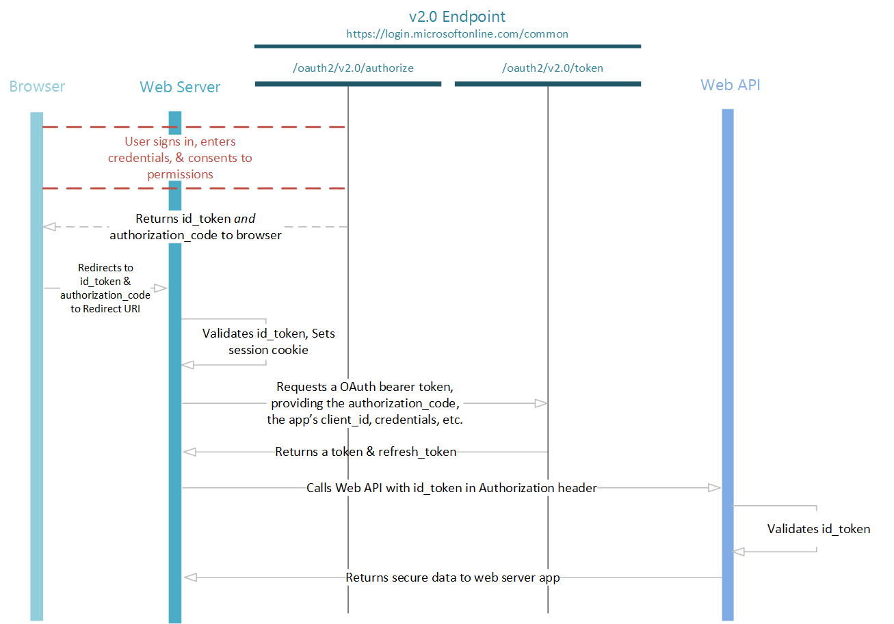

<properties
    pageTitle="Azure AD-Version 2.0 OpenID verbinden Protokoll | Microsoft Azure"
    description="Gebäude Webanwendungen Azure AD-Version 2.0 Implementierung von der herstellen OpenID Authentication-Protokoll verwenden."
    services="active-directory"
    documentationCenter=""
    authors="dstrockis"
    manager="mbaldwin"
    editor=""/>

<tags
    ms.service="active-directory"
    ms.workload="identity"
    ms.tgt_pltfrm="na"
    ms.devlang="na"
    ms.topic="article"
    ms.date="09/30/2016"
    ms.author="dastrock"/>

# <a name="v20-protocols---openid-connect"></a>Version 2.0 Protokolle - OpenID verbinden
Verbinden OpenID ist eine Authentifizierungsprotokoll, das OAuth 2.0, die sichere sich Benutzer in Webanwendungen verwendet werden können.  Verwenden die Version 2.0-Endpunkt Implementierung von OpenID verbinden, können Sie die API Zugriff auf Ihre Website entsprechend Applikationen und melden Sie sich hinzufügen.  In diesem Handbuch wird gezeigt, wie in einer Weise Sprache unabhängig dazu senden und Empfangen von HTTP-Nachrichten ohne unsere öffnen Source-Bibliotheken beschrieben.

> [AZURE.NOTE]
    Nicht alle Azure Active Directory-Szenarien und Features werden von den Endpunkt Version 2.0 unterstützt.  Um festzustellen, ob den Version 2.0-Endpunkt verwendet werden sollen, erfahren Sie, [Version 2.0 Einschränkungen](active-directory-v2-limitations.md).

Das OAuth 2.0*Autorisierung* Protokoll für den Einsatz als ein Protokoll zur *Authentifizierung* Ihnen ermöglicht, führen Sie einzelne [OpenID verbinden](http://openid.net/specs/openid-connect-core-1_0.html) erweitert anmelden OAuth verwenden.  Es das Konzept von einer `id_token`, welche ist ein Sicherheitstoken, über die der Client zum Überprüfen der Identität des Benutzers und grundlegende Profilinformationen über den Benutzer zu erhalten.  Da sie OAuth 2.0 erweitert, ermöglicht es auch apps, die verwendet werden können, den Zugriff auf Ressourcen, die von einem [Server Autorisierung](active-directory-v2-protocols.md#the-basics)gesichert werden **Access_tokens** sicher zu erwerben.  OpenID verbinden ist unserer Empfehlungen, wenn Sie eine [Web-Anwendung](active-directory-v2-flows.md#web-apps) erstellen, die auf einem Server gehostet wird und Sie über einen Browser.

## <a name="protocol-diagram---sign-in"></a>Protokoll Diagramm - Anmeldung
Grundlegendsten Anmeldung illustrieren enthält die folgenden Schritte aus: jeder von ihnen im folgenden ausführlich beschrieben ist.


## <a name="fetch-the-openid-connect-metadata-document"></a>Abrufen des herstellen OpenID Metadaten Dokuments
Beschreibt, OpenID verbinden ein Dokuments von Metadaten, das meisten Informationen für eine app auszuführenden Anmeldung erforderlich enthält.  Informationen, wie etwa die URLs zu verwenden, die Position des Diensts öffentlicher signierenden Schlüssel usw. umfasst.  Für den Endpunkt Version 2.0 ist das Verbinden OpenID-Metadaten-Dokument, das verwendet werden sollen:

```
https://login.microsoftonline.com/{tenant}/v2.0/.well-known/openid-configuration
```

Stelle, an der die `{tenant}` können, führen Sie eine der vier verschiedene Werte:

| Wert | Beschreibung |
| ----------------------- | ------------------------------- |
| `common` | Können Benutzer mit persönlichen Microsoft-Konten und der Arbeit/Schule Konten aus Azure Active Directory melden Sie sich bei der Anwendung. |
| `organizations` | Können nur Benutzer mit der Arbeit/Schule Konten aus Azure Active Directory melden Sie sich bei der Anwendung an. |
| `consumers` | Können nur Benutzer mit persönlichen Microsoft-Konten (MSA), melden Sie sich bei der Anwendung. |
| `8eaef023-2b34-4da1-9baa-8bc8c9d6a490`oder`contoso.onmicrosoft.com` | Können nur Benutzer mit der Arbeit/Schule Konten von einem bestimmten Azure Active Directory-Mandanten, melden Sie sich bei der Anwendung an.  Entweder benutzerfreundlichen Domänennamen der Azure AD-Mandanten oder Guid-Bezeichner des Mandanten kann verwendet werden.  |

Die Metadaten sind ein einfachen Json-Dokument, das ein Ausschnitt des unter bereitgestellt wird.  Deren Inhalt sind in der [Spezifikation OpenID verbinden](https://openid.net)vollständig beschrieben.

```
{
  "authorization_endpoint": "https:\/\/login.microsoftonline.com\/common\/oauth2\/v2.0\/authorize",
  "token_endpoint": "https:\/\/login.microsoftonline.com\/common\/oauth2\/v2.0\/token",
  "token_endpoint_auth_methods_supported": [
    "client_secret_post",
    "private_key_jwt"
  ],
  "jwks_uri": "https:\/\/login.microsoftonline.com\/common\/discovery\/v2.0\/keys",
  
  ...
  
}
```

In der Regel, verwenden Sie dieses Metadatendokument zu einer Bibliothek OpenID verbinden oder SDK konfigurieren; die Bibliothek verwenden die Metadaten seine Arbeit erledigen.  Wenn Sie eine Pre-Build OpenID verbinden Bibliothek nicht verwenden, können Sie die Schritte im weiteren Verlauf dieses Artikels ausführen Anmeldung in einer Web-app verwenden den Endpunkt Version 2.0 folgen. 

## <a name="send-the-sign-in-request"></a>Senden Sie die Anfrage Anmeldung
Wenn Ihre Web app werden zum Authentifizieren des Benutzers muss, können sie weisen Sie ihn an die `/authorize` Endpunkt.  Diese Anforderung ähnelt des ersten Abschnitts eines der [OAuth 2.0 Autorisierung Code Datenfluss](active-directory-v2-protocols-oauth-code.md), mit ein paar wichtige Unterschiede:

- Die Anforderung muss den Bereich einschließen `openid` in der `scope` Parameter.
- Die `response_type` darf Parameter enthalten.`id_token`
- Die Anforderung darf enthalten die `nonce` Parameter

```
// Line breaks for legibility only

GET https://login.microsoftonline.com/{tenant}/oauth2/v2.0/authorize?
client_id=6731de76-14a6-49ae-97bc-6eba6914391e
&response_type=id_token
&redirect_uri=http%3A%2F%2Flocalhost%2Fmyapp%2F
&response_mode=form_post
&scope=openid
&state=12345
&nonce=678910
```

> [AZURE.TIP] Klicken Sie auf den Link unten, um diese Anforderung ausführen! Nach der Anmeldung, sollte in Ihrem Browser umgeleitet werden `https://localhost/myapp/` mit einer `id_token` in der Adressleiste.  Notiz, die diese Anforderung verwendet `response_mode=query` (für nur Lernprogramm zu).  Es wird empfohlen, verwenden Sie `response_mode=form_post`.
    <a href="https://login.microsoftonline.com/common/oauth2/v2.0/authorize?client_id=6731de76-14a6-49ae-97bc-6eba6914391e&response_type=id_token&redirect_uri=http%3A%2F%2Flocalhost%2Fmyapp%2F&scope=openid&response_mode=query&state=12345&nonce=678910" target="_blank">https://Login.microsoftonline.com/Common/oauth2/v2.0/Authorize...</a>

| Parameter | | Beschreibung |
| ----------------------- | ------------------------------- | --------------- |
| Mandanten | Erforderlich | Die `{tenant}` Wert in den Pfad der Anforderung zum Steuern, wer bei der Anwendung anmelden kann verwendet werden kann.  Die zulässigen Werte sind `common`, `organizations`, `consumers`, und Mandanten Bezeichnern.  Weitere Details finden Sie unter [Grundlagen Protokoll](active-directory-v2-protocols.md#endpoints). |
| client_id | Erforderlich | Die Anwendung-Id, dass das Registrierung-Portal ([apps.dev.microsoft.com](https://apps.dev.microsoft.com/?referrer=https://azure.microsoft.com/documentation/articles&deeplink=/appList)) Ihre app zugewiesen. |
| response_type | Erforderlich | Darf enthalten `id_token` für OpenID verbinden Anmeldung.  Sie können auch andere Response_types, enthalten, z. B. `code`. |
| redirect_uri | empfohlen | Die Redirect_uri der app, wo Authentifizierungsantworten gesendet und Empfangen von Ihrer app werden können.  Es muss exakt eine der Redirect_uris übereinstimmen, die Sie im Portal registriert, außer es Url codiert werden muss. |
| Bereich | Erforderlich | Ein Leerzeichen getrennte Liste mit Bereichen.  Für OpenID verbinden möchten, muss es den Bereich enthalten `openid`, die die Berechtigung "Signieren Sie" in der Benutzeroberfläche für die Zustimmung übersetzt.  Sie können auch die anderen Bereiche in dieser Anforderung zum Anfordern der Genehmigung aufnehmen. |
| Nonce | Erforderlich | Einen Wert enthalten, in der Besprechungsanfrage, die von der app, die Bestandteil der resultierende Id_token als Anspruch generiert.  Die app kann dann diesen Wert, um die Wiedergabe token Angriffen zu verringern überprüfen.  Der Wert ist in der Regel eine zufällige, eindeutige Zeichenfolge, die verwendet werden kann, um den Ursprung der Anfrage zu identifizieren.  |
| response_mode | empfohlen | Gibt die Methode, die verwendet werden soll, das sich daraus ergebende Authorization_code wieder zu Ihrer Anwendung zu senden.  'Abfrage', 'Form_post' oder 'Fragment' möglich.  Für Webanwendungen wir empfehlen mit `response_mode=form_post` um sicherzustellen, dass die sicherste Übertragung von Token an Ihrer Anwendung.  
| Bundesstaat | empfohlen | Einen Wert enthalten, in der Besprechungsanfrage, die auch in der token Antwort zurückgegeben wird.  Es kann eine Textzeichenfolge alle Inhalte, die Sie möchten.  Ein eindeutiger erzeugten Wert wird in der Regel für die [websiteübergreifende Anforderungsfälschungsangriffe verhindern](http://tools.ietf.org/html/rfc6749#section-10.12)verwendet.  Der Status wird auch Informationen zu den Status des Benutzers in der app codieren, bevor die Authentifizierungsanfrage ist, beispielsweise die Seite oder die Ansicht, die sie aufgetreten auf Waren, verwendet. |
| Aufforderung | Optional | Gibt den Typ der Interaktion mit dem Benutzer, die erforderlich ist.  Die einzige gültige Werte zu diesem Zeitpunkt sind 'Anmeldung', 'keine' und 'Zustimmung'.  `prompt=login`Erzwingt den Benutzer zur Eingabe ihrer Anmeldeinformationen auf die Anfrage Inverser_Operator einmaligen Anmeldung.  `prompt=none`ist die Umkehrung – es stellt sicher, dass der Benutzer jede interaktive Aufforderung überhaupt nicht angezeigt werden.  Wenn die Anfrage über einmaligen Anmeldung im Hintergrund ausgeführt werden kann, wird der Version 2.0-Endpunkt einen Fehler zurück.  `prompt=consent`Nachdem sich der Benutzer den Benutzer auffordert signiert, erteilen, um die app, wird das Dialogfeld OAuth Zustimmung ausgelöst. |
| login_hint | Optional | Kann verwendet werden um vorab füllen Sie das Feld Benutzername/e-Mail-Adresse von der Anmeldeseite für den Benutzer, wenn Sie ihren Benutzernamen im Voraus kennen.  Häufig apps werden für diesen Parameter verwenden, während eine erneute Authentifizierung, haben Sie bereits den Benutzernamen aus einem vorherigen Anmeldung mit extrahiert die `preferred_username` beanspruchen. |
| domain_hint | Optional | Kann eine der `consumers` oder `organizations`.  Wenn enthalten, überspringen Sie den e-Mail-basierte Erkennungsvorgang diesen Benutzer durchläuft, klicken Sie auf der Seite Anmelden Version 2.0 führenden zu einer etwas mehr optimierten Benutzeroberfläche.  Häufig apps werden während der erneuten Authentifizierung für diesen Parameter verwenden, indem Sie Extrahieren der `tid` aus der Id_token beanspruchen.  Wenn die `tid` beanspruchen Wert ist `9188040d-6c67-4c5b-b112-36a304b66dad`, sollten Sie `domain_hint=consumers`.  Verwenden Sie andernfalls `domain_hint=organizations`. |
An diesem Punkt werden der Benutzer aufgefordert, geben Sie ihre Anmeldeinformationen ein, und führen Sie die Authentifizierung.  Der Version 2.0-Endpunkt wird außerdem sichergestellt, dass der Benutzer die Berechtigungen, die im angegebenen zugestimmt hat die `scope` Abfrage Parameter.  Wenn der Benutzer eine dieser Berechtigungen nicht zugestimmt hat, wird der Benutzer zu den erforderlichen Berechtigungen Zustimmung gefragt werden.  Details zu [Berechtigungen, Zustimmung, und mit mehreren Mandanten apps dienen hier](active-directory-v2-scopes.md).

Nachdem der Benutzer authentifiziert und Zustimmung gewährt, Version 2.0-Endpunkt zurückgegeben werden kann eine Antwort auf Ihre app auf die angegebene `redirect_uri`, mithilfe der angegebenen Methode der `response_mode` Parameter.

#### <a name="successful-response"></a>Erfolgreiche Antwort
Eine erfolgreiche Antwort mit `response_mode=form_post` sieht wie folgt aus:

```
POST /myapp/ HTTP/1.1
Host: localhost
Content-Type: application/x-www-form-urlencoded

id_token=eyJ0eXAiOiJKV1QiLCJhbGciOiJSUzI1NiIsIng1dCI6Ik1uQ19WWmNB...&state=12345
```

| Parameter | Beschreibung |
| ----------------------- | ------------------------------- |
| id_token | Die Id_token, die die app angefordert. Sie können die Id_token zum Überprüfen der Identität des Benutzers, und beginnen eine Sitzung mit dem Benutzer verwenden.  Informationen zur Id_tokens und deren Inhalt ist in der [Version 2.0-Endpunkt token Verweis](active-directory-v2-tokens.md)enthalten.  |
| Bundesstaat | Wenn der Parameter Status in der Besprechungsanfrage enthalten ist, sollte der gleiche Wert in der Antwort angezeigt werden. Die app sollte überprüfen, ob die Statuswerte in die Anforderung und Antwort identisch sind. |

#### <a name="error-response"></a>Antwort zurück
Fehler beim Antworten möglicherweise auch gesendet werden, mit der `redirect_uri` , damit die app diese angemessen behandelt werden kann:

```
POST /myapp/ HTTP/1.1
Host: localhost
Content-Type: application/x-www-form-urlencoded

error=access_denied&error_description=the+user+canceled+the+authentication
```

| Parameter | Beschreibung |
| ----------------------- | ------------------------------- |
| Fehler | Eine Zeichenfolge des Fehlercodes, die zum Fehlertypen klassifizieren, die auftreten verwendet werden kann, und kann verwendet werden, um auf Fehler zu reagieren. |
| error_description | Eine bestimmte Fehlermeldung, die einen Entwickler die Ursache eines Authentifizierungsfehlers ermitteln helfen können.  |

#### <a name="error-codes-for-authorization-endpoint-errors"></a>Fehlercodes Autorisierung Endpunkt Fehler

Die folgende Tabelle beschreibt die verschiedenen Fehlercodes, der in zurückgegeben werden, können die `error` Parameter der Antwort zurück.

| Fehlercode | Beschreibung | Clientaktion |
|------------|-------------|---------------|
| invalid_request | Protokoll Fehler aufgetreten, beispielsweise ein fehlender erforderlicher Parameter. | Beheben, und senden Sie die Anfrage erneut. Dies ist eine Entwicklung Fehler in der Regel während der anfänglichen Testen abgefangen wird.|
| unauthorized_client | Die Clientanwendung ist nicht zulässig, um einen Autorisierungscode anzufordern. | Das Problem tritt gewöhnlich auf, wenn die Clientanwendung in Azure AD nicht registriert ist oder nicht auf des Benutzers Azure AD-Mandanten hinzugefügt wird. Die Anwendung kann den Benutzer mit für das Installieren der Anwendung und das Hinzufügen zur Azure AD auffordern. |
| ACCESS_DENIED | Ressourcenbesitzer Zustimmung verweigert | Die Clientanwendung kann den Benutzer benachrichtigen, den fortgesetzt werden kann, wenn der Benutzer zulässt. |
| unsupported_response_type | Der Autorisierung Server unterstützt nicht den Antworttyp in der Besprechungsanfrage. | Beheben, und senden Sie die Anfrage erneut. Dies ist eine Entwicklung Fehler in der Regel während der anfänglichen Testen abgefangen wird.|
|server_error | Der Server ist einen unerwarteten Fehler aufgetreten. | Wiederholen Sie die Anforderung. Dieser Fehler können temporäre Bedingungen führen. Die Clientanwendung möglicherweise für den Benutzer erläutern, dass seine Antwort Fälligkeitsdatum ein temporärer Fehler verzögert ist. |
| temporarily_unavailable | Der Server ist vorübergehend ausgelastet und kann die Anfrage zu behandeln. | Wiederholen Sie die Anforderung. Die Clientanwendung möglicherweise für den Benutzer erläutern, dass seine Antwort Fälligkeitsdatum eine temporäre Bedingung verzögert ist. |
| invalid_resource |Die Zielressource ist ungültig, da es ist nicht vorhanden, Azure AD nicht werden gefunden kann oder nicht richtig konfiguriert.| Dies zeigt an, dass die Ressource, sofern vorhanden, nicht in den Mandanten konfiguriert wurde. Die Anwendung kann den Benutzer mit für das Installieren der Anwendung und das Hinzufügen zur Azure AD auffordern. |

## <a name="validate-the-idtoken"></a>Überprüfen der id_token
Nur empfangen eine Id_token reicht nicht aus, um die Benutzerauthentifizierung; müssen Sie die Id_token des Signatur überprüfen und überprüfen die Angaben im Token pro Anforderungen Ihrer app.  Der Version 2.0-Endpunkt verwendet [JSON Web Token (JWTs)](http://self-issued.info/docs/draft-ietf-oauth-json-web-token.html) und öffentlichem Schlüssel Token melden, und stellen Sie sicher, dass sie gültig sind.

Sie können auswählen, um zu überprüfen der `id_token` im Client Code, sondern üblich besteht darin, Senden der `id_token` auf einen Back-End-Server, und führen Sie die Überprüfung vorhanden.  Nachdem Sie die Signatur der Id_token überprüft haben, gibt es ein paar Ansprüche, die Sie zur Überprüfung erforderlich ist.  Finden Sie unter [Version 2.0 token Bezug](active-directory-v2-tokens.md) für Weitere Informationen, einschließlich [Token überprüfen](active-directory-v2-tokens.md#validating-tokens) und [Wichtige Informationen zu signieren Schlüssel Rollover](active-directory-v2-tokens.md#validating-tokens).  Es empfiehlt sich Gebrauch machen einer Bibliothek für analysiert und überprüft Token – es steht mindestens eine für die meisten Sprachen und Plattformen.
<!--TODO: Improve the information on this-->

Sie möchten möglicherweise auch zusätzliche Ansprüche abhängig von Ihrem Szenario überprüfen.  Einige allgemeinen Validierungen umfassen:

- Sicherstellung der Benutzer-Organisation wurde für die app registriert.
- Sicherstellung des Benutzers verfügt nicht über ordnungsgemäße Autorisierung/Berechtigungen
- Um eine bestimmte Stärke von Authentifizierung sicherzustellen, wie z. B. mehrstufige Authentifizierung aufgetreten.

Weitere Informationen über die Ansprüche in einer Id_token finden Sie unter [Version 2.0 Endpunkt token verweisen](active-directory-v2-tokens.md).

Nachdem Sie die Id_token vollständig überprüft haben, können Sie eine Sitzung mit dem Benutzer beginnen und Claims in der Id_token verwenden, erhalten Sie Informationen über den Benutzer in Ihrer app.  Diese Informationen kann verwendet werden, für die Anzeige, Datensätze, Autorisierungs.

## <a name="send-a-sign-out-request"></a>Senden einer Abmelden Anforderung

Die OpenIdConnect `end_session_endpoint` wird derzeit nicht durch den Endpunkt Version 2.0 unterstützt. Dies bedeutet, dass Ihre app eine Anforderung an den Endpunkt Version 2.0 zum Beenden der Sitzung eines Benutzers und deaktivieren Sie Cookies festlegen, indem Sie den Endpunkt Version 2.0 senden kann.
Wenn einen Benutzer sich anmelden möchten, kann Ihre app einfach beenden eine eigenen Sitzung mit dem Benutzer, und lassen Sie die Sitzung des Benutzers mit der Version 2.0-Endpunkt intakt.  Der Benutzer versucht, melden Sie sich das nächste Mal wird eine Seite "Konto auswählen" mit ihren Konten aktiv angemeldet aufgeführt angezeigt.
Klicken Sie auf dieser Seite kann der Benutzer zum Abmelden bei einem beliebigen Konto, Beenden der Sitzung mit dem Version 2.0-Endpunkt auswählen.

<!--

When you wish to sign the user out of the app, it is not sufficient to clear your app's cookies or otherwise end the session with the user.  You must also redirect the user to the v2.0 endpoint for sign out.  If you fail to do so, the user will be able to re-authenticate to your app without entering their credentials again, because they will have a valid single sign-on session with the v2.0 endpoint.

You can simply redirect the user to the `end_session_endpoint` listed in the OpenID Connect metadata document:

```
GET https://login.microsoftonline.com/common/oauth2/v2.0/logout?
post_logout_redirect_uri=http%3A%2F%2Flocalhost%2Fmyapp%2F
```

| Parameter | | Description |
| ----------------------- | ------------------------------- | ------------ |
| post_logout_redirect_uri | recommended | The URL which the user should be redirected to after successful logout.  If not included, the user will be shown a generic message by the v2.0 endpoint.  |

-->

## <a name="protocol-diagram---token-acquisition"></a>Protokoll Diagramm - Token Acquisition
Viele Web apps müssen nicht nur den Benutzer melden, sondern auch für diesen Benutzer OAuth mit einen Webdienst zugreifen.  Dieses Szenario kombiniert OpenID verbinden, für die Benutzerauthentifizierung, während gleichzeitig beim Abrufen eines Authorization_code, die Access_tokens mithilfe der Code Datenfluss OAuth Autorisierung abzurufenden verwendet werden können.

Die vollständige OpenID verbinden Anmeldung und token Acquisition Fluss sieht ungefähr wie folgt aus: jeden Schritt im folgenden ausführlich beschrieben ist.



## <a name="get-access-tokens"></a>Abrufen von Access-Token
Zum Erfassen von Access Token, müssen Sie etwas der Anmeldung anfordern von oben zu ändern:

```
// Line breaks for legibility only

GET https://login.microsoftonline.com/{tenant}/oauth2/v2.0/authorize?
client_id=6731de76-14a6-49ae-97bc-6eba6914391e      // Your registered Application Id
&response_type=id_token%20code
&redirect_uri=http%3A%2F%2Flocalhost%2Fmyapp%2F       // Your registered Redirect Uri, url encoded
&response_mode=form_post                              // 'query', 'form_post', or 'fragment'
&scope=openid%20                                      // Include both 'openid' and scopes your app needs  
offline_access%20                                        
https%3A%2F%2Fgraph.microsoft.com%2Fmail.read
&state=12345                                         // Any value, provided by your app
&nonce=678910                                        // Any value, provided by your app
```

> [AZURE.TIP] Klicken Sie auf den Link unten, um diese Anforderung ausführen! Nach der Anmeldung, sollte in Ihrem Browser umgeleitet werden `https://localhost/myapp/` mit einer `id_token` und eine `code` in der Adressleiste.  Notiz, die diese Anforderung verwendet `response_mode=query` (für nur Lernprogramm zu).  Es wird empfohlen, verwenden Sie `response_mode=form_post`.
    <a href="https://login.microsoftonline.com/common/oauth2/v2.0/authorize?client_id=6731de76-14a6-49ae-97bc-6eba6914391e&response_type=id_token%20code&redirect_uri=http%3A%2F%2Flocalhost%2Fmyapp%2F&response_mode=query&scope=openid%20offline_access%20https%3A%2F%2Fgraph.microsoft.com%2Fmail.read&state=12345&nonce=678910" target="_blank">https://Login.microsoftonline.com/Common/oauth2/v2.0/Authorize...</a>

Indem Berechtigung Bereiche in der Besprechungsanfrage und mithilfe `response_type=id_token code`, Version 2.0-Endpunkt wird sichergestellt, dass der Benutzer die Berechtigungen, die im angegebenen zugestimmt hat die `scope` Abfrage Parameter und Ihre app einen Autorisierungscode für eine Access-Token austauschen zurück.

#### <a name="successful-response"></a>Erfolgreiche Antwort
Eine erfolgreiche Antwort mit `response_mode=form_post` sieht wie folgt aus:

```
POST /myapp/ HTTP/1.1
Host: localhost
Content-Type: application/x-www-form-urlencoded

id_token=eyJ0eXAiOiJKV1QiLCJhbGciOiJSUzI1NiIsIng1dCI6Ik1uQ19WWmNB...&code=AwABAAAAvPM1KaPlrEqdFSBzjqfTGBCmLdgfSTLEMPGYuNHSUYBrq...&state=12345
```

| Parameter | Beschreibung |
| ----------------------- | ------------------------------- |
| id_token | Die Id_token, die die app angefordert. Sie können die Id_token zum Überprüfen der Identität des Benutzers, und beginnen eine Sitzung mit dem Benutzer verwenden.  Informationen zur Id_tokens und deren Inhalt ist in der [Version 2.0-Endpunkt token Verweis](active-directory-v2-tokens.md)enthalten.  |
| Code | Die Authorization_code, die die app angefordert. Den Autorisierungscode können die app in einer Access-Token für die Zielressource anfordern.  Authorization_codes sind sehr kurzlebige, in der Regel sie ablaufen nach etwa 10 Minuten. |
| Bundesstaat | Wenn der Parameter Status in der Besprechungsanfrage enthalten ist, sollte der gleiche Wert in der Antwort angezeigt werden. Die app sollte überprüfen, ob die Statuswerte in die Anforderung und Antwort identisch sind. |

#### <a name="error-response"></a>Antwort zurück
Fehler beim Antworten möglicherweise auch gesendet werden, mit der `redirect_uri` , damit die app diese angemessen behandelt werden kann:

```
POST /myapp/ HTTP/1.1
Host: localhost
Content-Type: application/x-www-form-urlencoded

error=access_denied&error_description=the+user+canceled+the+authentication
```

| Parameter | Beschreibung |
| ----------------------- | ------------------------------- |
| Fehler | Eine Zeichenfolge des Fehlercodes, die zum Fehlertypen klassifizieren, die auftreten verwendet werden kann, und kann verwendet werden, um auf Fehler zu reagieren. |
| error_description | Eine bestimmte Fehlermeldung, die einen Entwickler die Ursache eines Authentifizierungsfehlers ermitteln helfen können.  |

Eine Beschreibung der möglichen Fehlercodes und deren Aktion empfohlene Client finden Sie unter [Autorisierung Endpunkt Fehler Fehlercodes](#error-codes-for-authorization-endpoint-errors).

Nachdem Sie eine Autorisierung abgerufen haben `code` und eine `id_token`, können Sie den Benutzer anmelden und erhalten Sie Zugriffstoken in deren Auftrag.  Wenn den Benutzer sich anmelden, überprüfen Sie die `id_token` genauso wie [oben](#validating-the-id-token)beschriebenen.  Um Access Token zu gelangen, können Sie die in unseren [OAuth Protokoll Dokumentation](active-directory-v2-protocols-oauth-code.md#request-an-access-token)beschriebenen Schritte.
