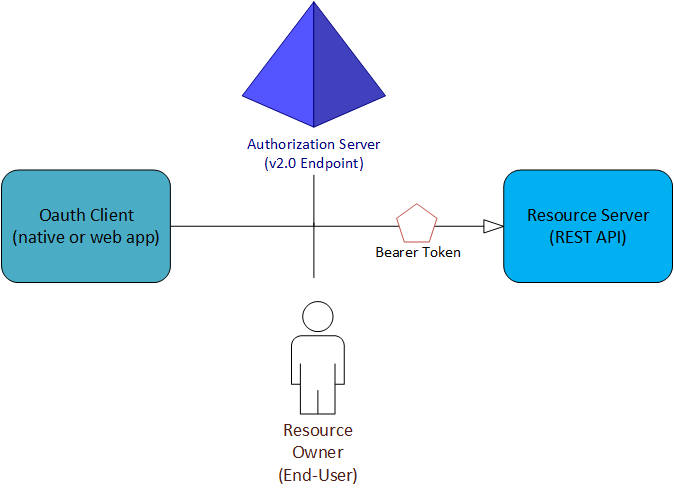

<properties
    pageTitle="Azure AD-Version 2.0 Protokolle | Microsoft Azure"
    description="Ein Handbuch für Protokolle vom Endpunkt Azure AD-Version 2.0 unterstützt."
    services="active-directory"
    documentationCenter=""
    authors="dstrockis"
    manager="mbaldwin"
    editor=""/>

<tags
    ms.service="active-directory"
    ms.workload="identity"
    ms.tgt_pltfrm="na"
    ms.devlang="na"
    ms.topic="article"
    ms.date="09/16/2016"
    ms.author="dastrock"/>

# <a name="v20-protocols---oauth-20--openid-connect"></a>Version 2.0 verbinden Protokolle - OAuth 2.0 und OpenID

Der Version 2.0-Endpunkt kann Azure AD für Identität-als-Service mit Protokolle nach Industriestandard, OpenID verbinden und OAuth 2.0 verwenden.  Während der Dienst Standards kompatibel ist, kann raffinierten Unterschiede zwischen einer beliebigen zwei Implementierung dieser Protokolle sein.  Hier die Informationen werden sinnvoll sein, wenn Sie festlegen, dass das Schreiben von Code per direkt und Umgang mit HTTP-Anfragen oder Verwenden einer 3rd Party Source-Bibliothek anstelle der Verwendung einer unserer open-Source-Bibliotheken öffnen.
<!-- TODO: Need link to libraries above -->

> [AZURE.NOTE]
    Nicht alle Azure Active Directory-Szenarien und Features werden von den Endpunkt Version 2.0 unterstützt.  Um festzustellen, ob den Version 2.0-Endpunkt verwendet werden sollen, erfahren Sie, [Version 2.0 Einschränkungen](active-directory-v2-limitations.md).

## <a name="the-basics"></a>Die Grundlagen
In nahezu allen OAuth & OpenID verbinden Zahlungen umfasst vier Parteien im Exchange:



- Die **Autorisierung Server** ist der Version 2.0-Endpunkt.  Es ist sicherzustellen, dass Identität des Benutzers, erteilen und Widerrufen des Zugriffs auf Ressourcen sowie zum Ausgeben von Token verantwortlich ist.  Es ist auch bekannt als Identitätsanbieter – sicher ganzer etwas mit Informationen des Benutzers, deren Zugriff und der Trust Beziehungen zwischen Parteien in einen Fluss tun.
- Der **Besitzer der Ressource** ist normalerweise der Endbenutzer.  Es ist der Teilnehmer, die verfügt über die Daten, und hat die Potenz Dritte weiter, um die Daten oder Ressourcen zugreifen dürfen.
- Der **OAuth Client** ist Ihre app identifiziert anhand seiner Anwendung-ID  Es ist normalerweise der Teilnehmer, die mit der Endbenutzer interagiert, und es Token vom Server Autorisierung anfordert.  Der Client muss durch den Ressourcenbesitzer über die Berechtigung zum Zugriff auf die Ressource erteilt werden.
- Der **Ressource-Server** ist, wo befindet sich die Ressource oder die Daten.  Es die Autorisierung Server um sicher authentifiziert und autorisiert den OAuth Client vertraut, und Person Access_tokens verwendet, um sicherzustellen, dass der Zugriff auf eine Ressource gewährt werden kann.


## <a name="app-registration"></a>App-Registrierung
Jeder app, die den Endpunkt Version 2.0 verwendet wird bei [apps.dev.microsoft.com](https://apps.dev.microsoft.com/?referrer=https://azure.microsoft.com/documentation/articles&deeplink=/appList) registriert sein, bevor interagieren mit OAuth oder OpenID eine Verbindung herstellen müssen.  Die app Registrierung zu wird sammeln und Ihre app ein paar Werte zuzuweisen:

- Eine **Id der Anwendung** , die Ihre app eindeutig
- Ein **URI umleiten** oder **Paket-ID** , die verwendet werden kann, um Antworten zu Ihrer Anwendung wieder zu leiten.
- Ein paar andere Szenario-spezifische Werte.

Weitere Einzelheiten hierzu erfahren Sie, wie Sie [eine app registrieren](active-directory-v2-app-registration.md).

## <a name="endpoints"></a>Endpunkte
Nach der Registrierung kommuniziert die app mit Azure AD per Anfragen an den Endpunkt Version 2.0:

```
https://login.microsoftonline.com/{tenant}/oauth2/v2.0/authorize
https://login.microsoftonline.com/{tenant}/oauth2/v2.0/token
```

Stelle, an der die `{tenant}` können, führen Sie eine der vier verschiedene Werte:

| Wert | Beschreibung |
| ----------------------- | ------------------------------- |
| `common` | Können Benutzer mit persönlichen Microsoft-Konten und der Arbeit/Schule Konten aus Azure Active Directory melden Sie sich bei der Anwendung. |
| `organizations` | Können nur Benutzer mit der Arbeit/Schule Konten aus Azure Active Directory melden Sie sich bei der Anwendung an. |
| `consumers` | Können nur Benutzer mit persönlichen Microsoft-Konten (MSA), melden Sie sich bei der Anwendung. |
| `8eaef023-2b34-4da1-9baa-8bc8c9d6a490`oder`contoso.onmicrosoft.com` | Können nur Benutzer mit der Arbeit/Schule Konten von einem bestimmten Azure Active Directory-Mandanten, melden Sie sich bei der Anwendung an.  Entweder benutzerfreundlichen Domänennamen der Azure AD-Mandanten oder Guid-Bezeichner des Mandanten kann verwendet werden.  |

Weitere Informationen zum Interaktion mit dieser Endpunkte wählen Sie einen bestimmten app unten.

## <a name="tokens"></a>Token
Die Version 2.0-Implementierung von OAuth 2.0, und verbinden Sie OpenID nutzen umfassende Person Token, einschließlich der Person Token als JWTs dargestellt. Eine Person Token ist ein einfaches Sicherheitstoken, den "Person" den Zugriff auf eine geschützte Ressource gewährt. In diesem Sinne ist die "Person" einer Partei, die das Token präsentieren kann. Obwohl eine Party zuerst mit Azure AD erhalten das Token Person authentifizieren muss, wenn die erforderlichen Schritte zum Token im Übertragung und Speicherung gesichert nicht geöffnet werden, können Sie abgefangen und durch einen dritten unbeabsichtigte verwendet werden. Während einige Sicherheitstokens eine integrierte Funktionalität für verhindern, dass unbefugten sie verwendet haben, werden Person Token verfügen nicht über dieses Verfahren und in einem sicheren Kanal wie z. B. Transport Layer Security (HTTPS) übertragen werden müssen. Bei der Übertragung einer Person Token als Klartext kann ein Mann-in der mittleren Angriffen verwendet werden durch bösartige dritte das Token erfassen und diese für einen nicht autorisierten Zugriff auf eine geschützte Ressource verwenden. Diese Sicherheitsprinzipien gelten beim Speichern oder Person Token zur späteren Verwendung zwischenspeichern. Immer Stellen Sie sicher, dass Ihre app übermittelt und Person Token auf sichere Weise speichert. Weitere Sicherheitsaspekte auf Person Token finden Sie unter [RFC 6750 Abschnitt 5](http://tools.ietf.org/html/rfc6750).

Weitere Informationen zu verschiedenen Arten von Token in den Endpunkt Version 2.0 verwendet steht in [der Version 2.0-Endpunkt token Bezug](active-directory-v2-tokens.md).

## <a name="protocols"></a>Protokolle

Wenn Sie bereit sind, finden Sie einige Beispiel Besprechungsanfragen, erste Schritte mit eine der unter Lernprogramme.  Können Sie jeweils entspricht ein bestimmtes Authentifizierung Szenario.  Wenn Sie benötigen Hilfe bei der Feststellung, welche für Sie richtigen illustrieren ist, lesen Sie [die Typen von apps, die Sie mit der Version 2.0 erstellen können](active-directory-v2-flows.md).

- [Erstellen von Mobile und systemeigene Anwendung mit OAuth 2.0](active-directory-v2-protocols-oauth-code.md)
- [Erstellen von Web Apps geöffnet ID verbinden](active-directory-v2-protocols-oidc.md)
- [Erstellen von Einzelseite-Apps mit impliziten illustrieren OAuth 2.0](active-directory-v2-protocols-implicit.md)
- [Generator Daemons oder Server Seite Prozesse mit den OAuth 2.0-Client-Anmeldeinformationen Datenfluss](active-directory-v2-protocols-oauth-client-creds.md)
- Abrufen von Token in eine Web-API mit der OAuth 2.0 im Auftrag von Datenfluss (in Kürze verfügbar)

<!-- - Get tokens using a username & password with the OAuth 2.0 Resource Owner Password Credentials Flow (coming soon) --> 
